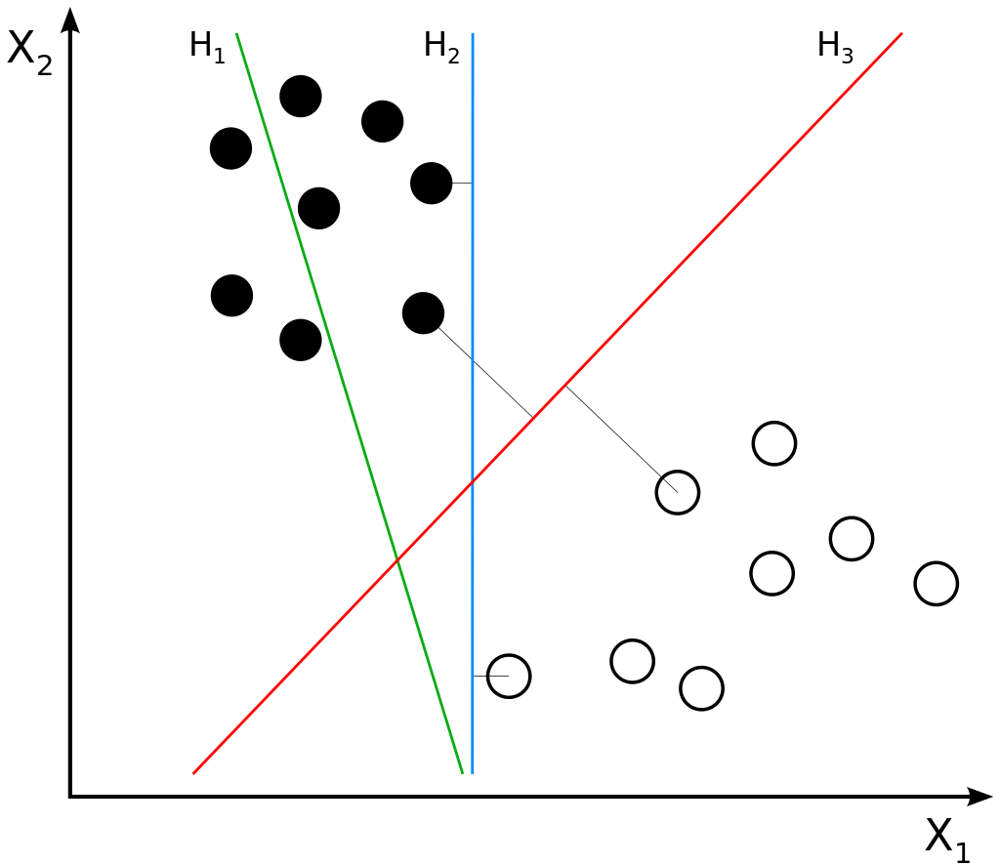
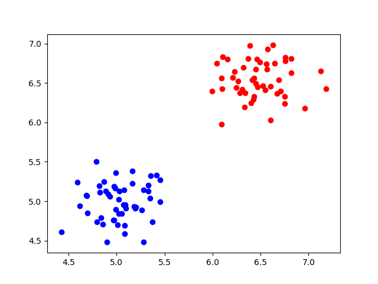

There is a lot of interest in deep learning models today: deep neural networks show beyond-average performance on many tasks, having spawned a new AI hype as well as many interesting and truly valuable AI based applications.

Does that mean, however, that we should forget about the more traditional approaches to machine learning?

No, we don't. The reason why is simple - they see things that deep learning models don't see. Given their different mathematical structure, the errors produced by those techniques are often _different ones_ than the DL models.

This sounds bad, but the exact opposite is true - because the models can be combined. When doing that, you might actually find the _ensemble to perform better_. This is the result of all the different errors cancelling each other out (Chollet, 2017).

Before neural networks, Support Vector Machines (SVMs) were very popular for generating classifiers. Support Vector Regression (SVR) is its regression equivalent. In this blog, we'll cover SVMs and SVRs. After reading it, you will understand...

- Where SVMs and SVR are located on the spectrum between supervised vs unsupervised vs reinforcement learning.
- How Support Vector Machines work as maximum-margin classifiers.
- How SVM can be extended to Regression and what this takes.

* * *

**Update 05/Feb/2021:** ensured that article is up to date.

* * *

\[toc\]

* * *

## Summary: Support Vector Machines and Support Vector Regression

Hyperplanes and data points. The [image](https://en.wikipedia.org/wiki/Support-vector_machine#/media/File:Svm_separating_hyperplanes_(SVG).svg)is not edited. Author: [Zack Weinberg](https://commons.wikimedia.org/w/index.php?title=User:ZackWeinberg&action=edit&redlink=1), derived from [Cyc's](https://commons.wikimedia.org/w/index.php?title=User:Cyc&action=edit&redlink=1) work. License: [CC BY-SA 3.0](https://creativecommons.org/licenses/by-sa/3.0/legalcode)

When you are training a Machine Learning model, there is a wide variety of algorithms to choose from. Today, neural networks are very popular methods for training a classification or regression model, but there are additional ones. Take Support Vector Machines, or their regression equivalent, Support Vector Regression. While these models have more [bias](https://www.machinecurve.com/index.php/2020/11/02/machine-learning-error-bias-variance-and-irreducible-error-with-python/) by design compared to neural networks, they might work better in cases where data is scarce.

This article discusses in detail but intuitively how **Support Vector Machines** and **Support Vector Regression works**. Here, we'll already cover things briefly. If you look at the image on the right, you see a binary classification problem. In other words, a supervised learning problem. You see black and white circles. The goal of any machine learning model used for classification is to find a decision boundary, i.e. a line (or, more strictly, a N-1 dimensional object called hyperplane for the N-dimensional feature space; here N=2, so the hyperplane is a line) that can distinguish between the classes.

Support Vector Machines (SVMs) here are so-called maximum-margin classifiers. This means that they will attempt to maximize the distance between the closest vectors of each class and the line. These closest vectors are called **support vectors**, and hence the name _Support Vector_ Machine. Hyperplane `H3` is best, as you can see it maximizes the equal distance between the two classes. It's better than `H2`, which is also capable of performing a classification but is not as good as `H3`, as well as better than `H1`, which is not capable of classifying at all.

The problem with SVMs however is that they can **(1) only be used for binary classification and (2) require a kernel function provided by humans to learn data**. In other words, you'll have to provide some estimate about the structure of your data, and it will then only work for binary classification problems. At least, out of the box. By [combining various binary SVMs together](https://www.machinecurve.com/index.php/2020/11/11/creating-one-vs-rest-and-one-vs-one-svm-classifiers-with-scikit-learn/), you can still use it in a **multiclass way**.

SVMs can also be used for regression; then, the goal is to estimate a hyperplane that can be used for regression. It works in a similar way, although in regression a so-called 'error tube' is added where errors are not penalized, reflecting the increased complexity of the problem (i.e. from a discrete problem with a few classes regression problems are continuous problems with infinite possible outcomes).

### Additional reading

Also make sure to read the following articles if you are interested in SVMs and SVR:

- [Creating a simple binary SVM classifier with Python and Scikit-learn](https://www.machinecurve.com/index.php/2020/05/03/creating-a-simple-binary-svm-classifier-with-python-and-scikit-learn/)
- [How to visualize support vectors of your SVM classifier?](https://www.machinecurve.com/index.php/2020/05/05/how-to-visualize-support-vectors-of-your-svm-classifier/)
- [Creating One-vs-Rest and One-vs-One SVM Classifiers with Scikit-learn](https://www.machinecurve.com/index.php/2020/11/11/creating-one-vs-rest-and-one-vs-one-svm-classifiers-with-scikit-learn/)
- [Using Error-Correcting Output Codes with Scikit-learn for multiclass SVM classification](https://www.machinecurve.com/index.php/2020/11/12/using-error-correcting-output-codes-for-multiclass-svm-classification/)
- [How to create a Multilabel SVM classifier with Scikit-learn](https://www.machinecurve.com/index.php/2020/11/12/how-to-create-a-multilabel-svm-classifier-with-scikit-learn/)
- [How to perform Multioutput Regression with SVMs in Python](https://www.machinecurve.com/index.php/2020/11/17/how-to-perform-multioutput-regression-with-svms-in-python/)
- [Using Radial Basis Functions for SVMs with Python and Scikit-learn](https://www.machinecurve.com/index.php/2020/11/25/using-radial-basis-functions-for-svms-with-python-and-scikit-learn/)

Let's now dive into SVMs and SVR more deeply! 🚀

* * *

## Before getting started: some basic ML ingredients

Before we can do so, we must first take a look at some basic ingredients of machine learning, before we can continue with SVMs and SVR. If you're already very familiar with these concepts, feel free to skip to the next section. If not, let's go!

### Supervised vs unsupervised vs reinforcement

In machine learning, you'll work goal-oriented: there is a problem to be solved and a machine learning model may be the solution to that problem. A problem may spawn a wide variety of ML scenarios, which can broadly be categorized into _supervised learning,_ _unsupervised learning_ and _reinforcement learning_.

In a supervised learning scenario, we have a so-called training set. This training set consists of many samples, usually in the form of vectors. These vectors, that are also called feature vectors, contain individual features, or values characterizing some domain. For example, the features _height_, _weight_, _BMI_ and _percentage of fat_ may characterize one's _body posture_ (the name of the feature vector, in this case).

In supervised learning, what you'll also find is that for each feature vector, there exists a so-called _target variable_. This target variable essentially correlates the feature vector with some outcome. Usually, the target variable is highly related to the problem you're trying to solve with machine learning. For example, in the situation above you might be interested in training a machine learning model that predicts the likelihood that one has diabetes (outcome 'yes', or 1) or no diabetes (outcome 'no', or 0) in five years from now.

Unsupervised learning scenarios exist as well. In those, you don't have target values, but merely a dataset in which your goal is to detect certain patterns. For example, you may wish to find certain groups in your data set - this is a typical scenario when you wish to group buyers based on their purchase records.

In the last category, reinforcement learning, you don't really have a dataset with which you either train a model or find patterns. Rather, you start with a dumb agent, which displays certain behavior. After each display of behavior, you'll tell the agent whether their action is _right_ or _wrong_. As a result, over time, it will perform the action described implicitly by the _goal_ present in your judgment. It will display _goal-oriented behavior_. A perfect example is displayed in this video, where agents learn to play hide and seek:

https://www.youtube.com/watch?v=kopoLzvh5jY

### Supervised ML: classification vs regression

SVMs and SVR are classic examples of supervised machine learning techniques. We'll therefore narrow down on supervised ML. We must next differentiate between classification and regression.

In a different blog, I already explained what classification is:

> Suppose that you work in the field of separating non-ripe tomatoes from the ripe ones. It's an important job, one can argue, because we don't want to sell customers tomatoes they can't process into dinner. It's the perfect job to illustrate what a human classifier would do.  
>   
> Humans have a perfect eye to spot tomatoes that are not ripe or that have any other defect, such as being rotten. They derive certain characteristics for those tomatoes, e.g. based on color, smell and shape:  
>   
> If it's green, it's likely to be unripe (or: not sellable);  
> If it smells, it is likely to be unsellable;  
> The same goes for when it's white or when fungus is visible on top of it.  
>   
> If none of those occur, it's likely that the tomato can be sold.  
> 
> We now have _two classes_: sellable tomatoes and non-sellable tomatoes.  
>   
> Human classifiers _decide about which class an object (a tomato) belongs to._
> 
> [How to create a CNN classifier with Keras?](https://machinecurve.com/index.php/2019/09/17/how-to-create-a-cnn-classifier-with-keras/)

This can also be done by a machine learning model: the numbers behind the tomato images as features in a feature vector and the outcome (sellable or non-sellable) as targets.

And Support Vector Machines (SVM) are methods to generate such classifiers. We'll cover their inner workings next.

...because _regression_ is left. In this supervised scenario, you don't pick a class for a feature vector, but rather, you'll estimate a _real number_ (an either positive or negative number that can have an infinite amount of decimals) for the input. For the diabetes case above, rather than estimating _yes or no_, you might wish to estimate the _probability_ of getting diabetes.

In the case of support vectors, Support Vector Regression is your way to go for supervised regression scenarios. Hence, let's cover their internals.

* * *

## Support Vector Machines

How do SVMs work? We'll cover the inner workings of Support Vector Machines first. They are used for classification problems, or assigning classes to certain inputs based on what was learnt previously.

Suppose that we have a dataset that is linearly separable:

We can simply draw a line in between the two groups and separate the data. As we've seen for e.g. the [Rosenblatt Perceptron](https://machinecurve.com/index.php/2019/07/23/linking-maths-and-intuition-rosenblatts-perceptron-in-python/), it's then possible to classify new data points into the correct group, or class.

However, with much data, a linear classifier might not be such a good idea: every sample is taken into account for generating the decision boundary. What's more, linear classifiers do not find the _optimum decision boundary._ When data is linearly separable, _at least one_, but often many decision boundaries exist. Yet, which one is optimal?

Support Vector Machines can very well handle these situations because they do two things: they _maximize the margin_ and they do so by means of _support vectors_.

### Maximum-margin classifier

In SVM scenario, a decision boundary is also called a hyperplane which, given that you have N dimensions, is N-1-dimensional. Hence, in the two-dimensional setting below, the hyperplane is one-dimensional - thus, a line.

We do however see three hyperplanes: H1, H2 and H3:

Hyperplanes and data points. The [image](https://en.wikipedia.org/wiki/Support-vector_machine#/media/File:Svm_separating_hyperplanes_(SVG).svg)is not edited. Author: [Zack Weinberg](https://commons.wikimedia.org/w/index.php?title=User:ZackWeinberg&action=edit&redlink=1), derived from [Cyc's](https://commons.wikimedia.org/w/index.php?title=User:Cyc&action=edit&redlink=1) work. License: [CC BY-SA 3.0](https://creativecommons.org/licenses/by-sa/3.0/legalcode)

The first hyperplane, H1, does not separate the classes and is therefore not a decision boundary at all.

The second hyperplane, H2, does separate the classes, but it is easy to understand that it does only so with a _small margin_: the distance from the closest _black_ data point and the closest _white_ data point to the hyperplane is relatively small.. A more optimal hyperplane can be found.

And that's H3. As you can see, the distances between the closests vectors to the line is much larger now, and, in fact, the largest _margin_ that can be found. We call this the maximum margin, and hence, the SVM is a _maximum-margin classifier_.

As we've seen, those vectors - or data points - play an important role in finding the optimum decision boundary. We hence call them _support vectors_ and they allow SVMs to have some very interesting properties compared to linear classifiers.

### Support Vectors

Let's closely look at the SVM plot again, and especially the separating decision boundaries H2 and H3. We have some very interesting observations:

- The decision boundaries seem to be determined only by the vectors that are closest to those boundaries, the support vectors. H2 and H3 have different support vectors;
- The best decision boundary is the one where the distance between the support vectors and the decision boundary is the largest.

Hyperplanes and data points. The [image](https://en.wikipedia.org/wiki/Support-vector_machine#/media/File:Svm_separating_hyperplanes_(SVG).svg)is not edited. Author: [Zack Weinberg](https://commons.wikimedia.org/w/index.php?title=User:ZackWeinberg&action=edit&redlink=1), derived from [Cyc's](https://commons.wikimedia.org/w/index.php?title=User:Cyc&action=edit&redlink=1) work. License: [CC BY-SA 3.0](https://creativecommons.org/licenses/by-sa/3.0/legalcode)

This essentially means that you'll only need to consider the closest vectors when computing the outcome for a new sample.

And hence, you can ignore those.

### Optimizing a SVM: cost function

When you optimize a SVM, you minimize a cost function. In the case of SVM, the cost function has _one_ optimum, which is the decision boundary that produces the largest margin. Given how you initialize the weights of your decision boundary before the training process starts (this may be done randomly), it may take some time to find this optimum. Many frameworks therefore allow you to specify a breakoff point, where the decision boundary might not be best, but good enough for your model to be usable.

### SVM variations

There are two flavors of SVM: **C-SVM** based classification and **nu-SVM** classification. While essentially they try to do the same ding - finding the optimum decision boundary by minimizing a cost function - the actual _cost function_ differs. The difference relates to _how errors are penalized_ during training. [Click here if you wish to look at the formulas](http://www.statsoft.com/textbook/support-vector-machines). It does however not seem to matter much which variation is used (Ferdi, n.d.). Rather, one's choice seems to be based on how intuitive one thinks it is for computing loss.

### What if data is not linearly separable? Kernels

It may of course also be the case that your data is not linearly separable. What to do?

Author: [Alisneaky](https://commons.wikimedia.org/w/index.php?title=User:Alisneaky&action=edit&redlink=1), [CC BY-SA 4.0](https://creativecommons.org/licenses/by-sa/4.0/legalcode)

We benefit from the fact that Support Vector Machines are so called _kernel machines_.

Kernels functions take a data point in some mathematical space as an input and can map it to another mathematical space.

Although very abstract, SVMs are thus capable of changing the shape of the dataset without actually changing the interrelationships between the samples, for the reason that they are all mapped in the same way.

This is great news, because we might now be able to find a function that maps our non-linearly separable dataset into one which _does have a linear separation between the two classes_. This is visually represented in the image above.

There are many kernels in use today. The Gaussian kernel is pretty much the standard one. From there, one can experiment further to see whether data can become linearly separable. If your data is not linearly separable at first, classification by means of a linear SVM is a bad idea, and kernels must be used.

* * *

## Support Vector Regression

Above, we looked at applying support vectors for classification, i.e., SVMs. However, did you know that support vectors can also be applied to regression scenarios - where you estimate a real number instead of assigning classes to inputs?

### How does Support Vector Regression work?

Support Vector Regression maintains all the interesting properties from Support Vector Machines (Saed Sayad, n.d.). Given data points, it attempts to find a curve. However, rather than having the curve act as a decision boundary in a classification problem, in SVR, a match is found between some vector and the _position_ on the curve.

_It's a regression scenario after all_.

And support vectors participate in finding the closest match between the data points and the actual function that is represented by them. Intuitively, when we maximize the distance between the _support vectors_ to the regressed curve, we get closest to the actual curve (because there is always some noise present in the statistical samples). It also follows that we can discard all the vectors that are no support vectors, for the simple reason that they are likely statistical outliers.

The result is a regressed function!

### Kernels and SVR

Kernels can also be applied in SVR. Hence, it is possible to regressing a _non-linear function_, or a curve, using SVR. Similarly, the non-linear data is mapped onto a space that makes the data _linear_. In the case of SVR, however, it does not need to be linear in order to separate two groups, but rather, to represent a straight line and hence compute the contribution of support vectors to the regression problem.

### SVR variations

With SVM, we saw that there are two variations: C-SVM and nu-SVM. In that case, the difference lies in the cost function that is to be optimized, especially in the hyperparameter that configures the loss to be computed.

The same happens in SVR: it comes with epsilon-SVM and nu-SVM regression, or epsilon-SVR and nu-SVR.

The difference lies in _what you wish to control during the training process_ (Pablo Rivas, n.d.).

In the case of epsilon-SVR, or ep-SVR, you wish to control the _maximum allowable error_ for your regression setting. That's great if you wish to find the best possible model without caring much about computational resources. As a result, you don't control the number of support vectors that is used during optimization: it could be few, it could be many. And with many, it could be that you need many resources.

On the other hand, with nu-SVR, you'll control the _number of support vectors_ instead. As a result, you don't control the maximum amount of error allowed in the model - it is estimated for you. By consequence, you likely need fewer or simpler resources than with ep-SVR, but you will likely find a slightly larger error.

Depending on your needs, you should choose the type of SVR that fits your machine learning problem.

* * *

## Recap

In this blog, we attempted to arrive at an intuitive understanding of generic machine learning concepts and eventually Support Vector Machines and Support Vector Regression. We identified the need for kernels, kernel functions and how cost functions are optimized with both SVM and SVR - and checked out C-SVM, nu-SVM, ep-SVR and nu-SVR.

I hope you've learnt something from this blog, or that it helped you understand those concepts rather intuitively! 😄 If you have any questions, remarks, or other comments, please feel free to leave a comment below 👇 I'll happily answer and where I see fit improve my post. Thanks in advance and happy engineering! 😎

### Additional reading

Also make sure to read the following articles if you are interested in SVMs and SVR:

- [Creating a simple binary SVM classifier with Python and Scikit-learn](https://www.machinecurve.com/index.php/2020/05/03/creating-a-simple-binary-svm-classifier-with-python-and-scikit-learn/)
- [How to visualize support vectors of your SVM classifier?](https://www.machinecurve.com/index.php/2020/05/05/how-to-visualize-support-vectors-of-your-svm-classifier/)
- [Creating One-vs-Rest and One-vs-One SVM Classifiers with Scikit-learn](https://www.machinecurve.com/index.php/2020/11/11/creating-one-vs-rest-and-one-vs-one-svm-classifiers-with-scikit-learn/)
- [Using Error-Correcting Output Codes with Scikit-learn for multiclass SVM classification](https://www.machinecurve.com/index.php/2020/11/12/using-error-correcting-output-codes-for-multiclass-svm-classification/)
- [How to create a Multilabel SVM classifier with Scikit-learn](https://www.machinecurve.com/index.php/2020/11/12/how-to-create-a-multilabel-svm-classifier-with-scikit-learn/)
- [How to perform Multioutput Regression with SVMs in Python](https://www.machinecurve.com/index.php/2020/11/17/how-to-perform-multioutput-regression-with-svms-in-python/)
- [Using Radial Basis Functions for SVMs with Python and Scikit-learn](https://www.machinecurve.com/index.php/2020/11/25/using-radial-basis-functions-for-svms-with-python-and-scikit-learn/)

* * *

## References

Chollet, F. (2017). _Deep Learning with Python_. New York, NY: Manning Publications.

Ferdi. (n.d.). c-classification SVM vs nu-classification SVM in e1071 R. Retrieved from [https://stats.stackexchange.com/a/312904](https://stats.stackexchange.com/a/312904)

Statsoft. (n.d.). Support Vector Machines (SVM). Retrieved from [http://www.statsoft.com/textbook/support-vector-machines](http://www.statsoft.com/textbook/support-vector-machines)

Saed Sayad. (n.d.). Support Vector Regression. Retrieved from [https://www.saedsayad.com/support\_vector\_machine\_reg.htm](https://www.saedsayad.com/support_vector_machine_reg.htm)

Pablo Rivas. (n.d.). Difference between ep-SVR and nu-SVR (and least squares SVR). Retrieved from [https://stats.stackexchange.com/a/167545](https://stats.stackexchange.com/a/167545)
