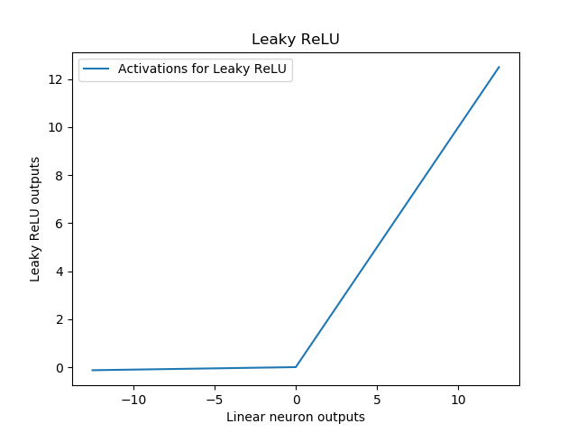

The **Leaky ReLU** is a type of [activation function](https://www.machinecurve.com/index.php/2019/09/04/relu-sigmoid-and-tanh-todays-most-used-activation-functions/) which comes across many machine learning blogs every now and then. It is suggested that it is an improvement of traditional ReLU and that it should be used more often.

But how is it an improvement? How does Leaky ReLU work? In this blog, we'll take a look. We identify what ReLU does and why this may be problematic in some cases. We then introduce Leaky ReLU and argue why its design can help reduce the impact of the problems of traditional ReLU. Subsequently, we briefly look into whether it is actually better and why traditional ReLU is still in favor today.

After reading this tutorial, you will...

- Understand how ReLU works.
- See why using ReLU can be problematic at times.
- How Leaky ReLU helps resolve these problems.

Let's take a look 🚀

* * *

**Update 08/Feb/2021:** ensure that article is up-to-date.

* * *

\[toc\]

* * *

## Brief recap: what is ReLU and how does it work?

Rectified Linear Unit, or ReLU, is one of the most common [activation functions](https://www.machinecurve.com/index.php/2019/09/04/relu-sigmoid-and-tanh-todays-most-used-activation-functions/) used in neural networks today. It is added to layers in neural networks to add _nonlinearity_, which is required to handle today's ever more complex and nonlinear datasets.

Each neuron computes a [dot product and adds a bias value](https://www.machinecurve.com/index.php/2019/07/23/linking-maths-and-intuition-rosenblatts-perceptron-in-python/) before the value is output to the neurons in the subsequent layer. These mathematical operations are linear in nature. This is not bad if we were training the model against a dataset that is linearly separable (in the case of classification) or where a line needs to be estimated (when regressing).

However, if data is nonlinear, we face problems. Linear neuron outputs ensure that the system as a whole, thus the entire neural network, behaves linearly. By consequence, it cannot handle such data, which is very common today: the MNIST dataset, which we used for showing how to build [classifiers in Keras](https://www.machinecurve.com/index.php/2019/09/17/how-to-create-a-cnn-classifier-with-keras/), is nonlinear - and it is one of the simpler ones!

Activation functions come to the rescue by adding nonlinearity. They're placed directly after the neural outputs and do nothing else but converting some input to some output. Because the mathematical functions used are nonlinear, the output is nonlinear - which is exactly what we want, since now the system behaves nonlinearly and nonlinear data is supported!

Note that although activation functions are pretty much nonlinear all the time, it's of course also possible to use the identity function \[latex\]f(x) = x\[/latex\] as an activation function. It would be pointless, but it can be done.

Now ReLU. It can be expressed as follows:

\\begin{equation} f(x) = \\begin{cases} 0, & \\text{if}\\ x < 0 \\\\ x, & \\text{otherwise} \\\\ \\end{cases} \\end{equation}

And visualized in this way:

For all values \[latex\]\\geq 0\[/latex\], it behaves linearly, but essentially behaves nonlinearly by outputting zeroes for all negative inputs.

Hence, it can be used as a nonlinear activation function.

It's grown very popular and may be the most popular activation used today - it is more popular than the older [Sigmoid and Tanh](https://www.machinecurve.com/index.php/2019/09/04/relu-sigmoid-and-tanh-todays-most-used-activation-functions/) activation functions - for the reason that it can be computed relatively inexpensively. Computing ReLU is equal to computing \[latex\]ReLU(x) = max(0, x)\[/latex\], which is much less expensive than the exponents or trigonometric operations necessary otherwise.

* * *

## Problems with ReLU

However, it's not the silver bullet and every time you'll run into trouble when using ReLU. It doesn't happen often - which makes it highly generalizable across machine learning domains and machine learning problems - but you may run into some issues.

Firstly, ReLU is not continuously differentiable. At \[latex\]x = 0\[/latex\], the breaking point between \[latex\]x\[/latex\] and 0, the gradient cannot be computed. This is not too problematic, but can very lightly impact training performance.

Secondly, and more gravely, ReLU sets all values < 0 to zero. This is beneficial in terms of sparsity, as the network will adapt to ensure that the most important neurons have values of > 0. However, this is a problem as well, since the gradient of 0 is 0 and hence neurons arriving at large negative values cannot recover from being stuck at 0. The neuron effectively dies and hence the problem is known as the _dying ReLU problem_. You're especially vulnerable to it when your neurons are not initialized properly or when your data is not normalized very well, causing significant weight swings during the first phases of optimizing your model. The impact of this problem may be that your network essentially stops learning and underperforms.

* * *

## Introducing Leaky ReLU

What if you _caused a slight but significant information leak_ in the left part of ReLU, i.e. the part where the output is always 0?

This is the premise behind **Leaky ReLU**, one of the possible newer activation functions that attempts to minimize one's sensitivity to the _dying ReLU problem_.

Mathematically, it is defined as follows (Maas et al., 2013):

\\begin{equation} f(x) = \\begin{cases} 0.01x, & \\text{if}\\ x < 0 \\\\ x, & \\text{otherwise} \\\\ \\end{cases} \\end{equation}

Leaky ReLU can be visualized as follows:

If you compare this with the image for traditional ReLU above, you'll see that for all \[latex\]inputs < 0\[/latex\], the outputs are slightly descending. The thesis is that these small numbers reduce the death of ReLU activated neurons. This way, you'll have to worry less about the initialization of your neural network and the normalization of your data. Although these topics remain important, they are slightly less critical.

* * *

## Does Leaky ReLU really work?

Next, the question: **does Leaky ReLU really work?** That is, does it really reduce the likelihood that your ReLU activating network dies off?

Let's try and find out.

Nouroz Rahman isn't convinced:

> However, I personally don’t think _Leaky ReLU_ provides any advantage over _ReLU_, holistically, considering both training and accuracy although some papers claimed to achieve that. That’s why _Leaky ReLU_ is trivial in deep learning and honestly speaking, I have never used it or thought of the necessity of using it.
> 
> [Nouroz Rahman](https://www.quora.com/What-are-the-advantages-of-using-Leaky-Rectified-Linear-Units-Leaky-ReLU-over-normal-ReLU-in-deep-learning/answer/Nouroz-Rahman)

In a 2018 study, Pedamonti argues that Leaky ReLU and ReLU performance on the MNIST dataset is similar. Even though the problem of dying neural networks may now be solved theoretically, it can be the case that it simply doesn't happen very often - and that in those cases, normal ReLU works as well. "It's simple, it's fast, it's standard" - someone argued. And I tend to agree.

* * *

## Summary

In this blog post, we've seen what challenges ReLU-activated neural networks. We also introduced the Leaky ReLU which attempts to resolve issues with traditional ReLU that are related to dying neural networks. We can conclude that in many cases, it seems to be the case that traditional / normal ReLU is relevant, and that Leaky ReLU benefits in those cases where you suspect your neurons are dying. I'd say: use ReLU if you can, and other linear rectifiers if you need to.

Happy engineering! 😊

* * *

## References

Maas, A. L., Hannun, A. Y., & Ng, A. Y. (2013). Rectifier Nonlinearities Improve Neural Network Acoustic Models. Retrieved from [https://www.semanticscholar.org/paper/Rectifier-Nonlinearities-Improve-Neural-Network-Maas/367f2c63a6f6a10b3b64b8729d601e69337ee3cc](https://www.semanticscholar.org/paper/Rectifier-Nonlinearities-Improve-Neural-Network-Maas/367f2c63a6f6a10b3b64b8729d601e69337ee3cc)

What are the advantages of using Leaky Rectified Linear Units (Leaky ReLU) over normal ReLU in deep learning? (n.d.). Retrieved from [https://www.quora.com/What-are-the-advantages-of-using-Leaky-Rectified-Linear-Units-Leaky-ReLU-over-normal-ReLU-in-deep-learning](https://www.quora.com/What-are-the-advantages-of-using-Leaky-Rectified-Linear-Units-Leaky-ReLU-over-normal-ReLU-in-deep-learning)

Pedamonti, D. (2018). Comparison of non-linear activation functions for deep neural networks on MNIST classification task. _arXiv preprint [arXiv:1804.02763](https://arxiv.org/pdf/1804.02763.pdf)_.
