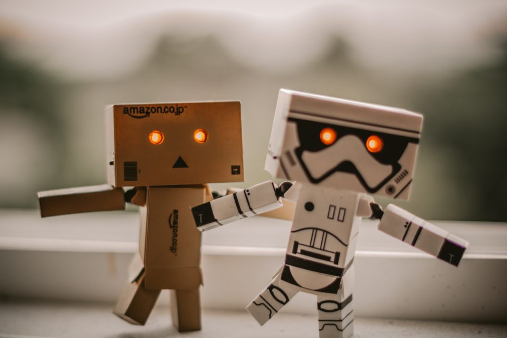

According to Max Tegmark, the author of the **Life 3.0** book, any form of life can be classified into three distinct groups:

<iframe style="width:120px;height:240px;float:right;margin-bottom:20px;margin-left:20px;" marginwidth="0" marginheight="0" scrolling="no" frameborder="0" src="//ws-na.amazon-adsystem.com/widgets/q?ServiceVersion=20070822&amp;OneJS=1&amp;Operation=GetAdHtml&amp;MarketPlace=US&amp;source=ac&amp;ref=qf_sp_asin_til&amp;ad_type=product_link&amp;tracking_id=webn3rd-20&amp;marketplace=amazon&amp;region=US&amp;placement=1101970316&amp;asins=1101970316&amp;linkId=02226818ab2dd489dbab38b1826e7a4b&amp;show_border=false&amp;link_opens_in_new_window=true&amp;price_color=333333&amp;title_color=0066c0&amp;bg_color=ffffff"></iframe>

- Life 1.0, where life can't adapt hardware (their bodies) and software (their thinking and actions) itself - instead, that was the role of evolution across generations.
- Life 2.0, where life can't adapt hardware but can adapt software itself.
- Life 3.0, where life can adapt both.

_(the Amazon advertisement contains an affiliate link for MachineCurve)._

...the book is about the third, and especially the wide array of possible paths towards there - plus their consequences.

Why a review here? Simple - artificial intelligence, and its quest for artificial general intelligence, may spawn something that is more intelligent than human beings: a superintelligence.

And Life 3.0 explores the consequences of such superintelligence. Let's find out how it does.

\[toc\]

## Welcome to the most important conversation of our time

The book starts with the Omega team, which is an organization that has secretly created the world's first superintelligence, called Prometheus. At first, its makers ensure that they earn a lot of money by deploying its intelligence - but they do not stop there.

No, on the contrary - since Prometheus is smarter than humans and is capable of improving itself, the world experiences a mind-blowing explosion of technical innovation, financial change and weakening of political systems. At last, they achieved what has never been achieved before - that the world is controlled by _one_ system.

Even though this scenario seems to be very unlikely, it's not. Today, some organizations are already pursuing [artificial general intelligence](https://en.wikipedia.org/wiki/Artificial_general_intelligence#Artificial_general_intelligence_research) through technological research. Even though we can't tell for sure whether we'll eventually achieve AGI and/or superintelligence, we can't tell we don't either.

By consequence, Max Tegmark welcomes us to the most important conversation of our time.

We don't need to be scared of robots. True superintelligent systems, Tegmark argues, will live inside of servers and other computing mediums.

## Setting the stage with today's narrow AI

In chapter 1, Tegmark sets the stage. He explores the concept of life - 1.0, 2.0 and 3.0, as outlined above - and introduces the thought that artificial intelligence research may allow us to reach Life 3.0 before the end of this century.

Such research does not happen in a moral vacuum. Instead, a fascinating and intense discussion has emerged about the kind of future we can likely expect when Life 3.0 enters our daily lives. He introduces three important streams of thought: _technoskeptics_, who believe that AGI is so difficult that it will still take centuries before we'll realize it; the _utopian/singularity stream of thought_ which welcomes AGI because, they argue, it will improve the world beyond expectations, and finally the _beneficial AI movement_. This latter argues that AI systems can bring both good and bad, and that we should undertake much exploration into finding out what it should look like.

After invalidating many false assumptions about artificial general intelligence and superintelligence, Tegmark explores the concepts of intelligence, memory, computation and learning in chapter 2. He links them to the fact that they are _independent of a medium_ - that is, where humans are limited by their brains, e.g. memory isn't limited by its hardware. Instead, we just invent new hardware to accomodate additional growth, as we have seen in the past. This ensures that the laws of physics are the only ones that we must respect, an important observation that Tegmark explores further in later chapters.

Of course - artificial intelligence has been around for a while, and it already impacts today's world. Chapter 3 explores the impact of contemporary AI on society in its many forms. For example, AI can already benefit our financial markets, self-driving cars, and healthcare. But this spawns a new question: how can we ensure that AI is reliable, and that it does what we want? Life 3.0 further explores this question in terms of autonomous weapons, autonomous legal systems, as well as AI and our jobs. The interesting thing here is that these changes are already happening all around us. We're already having [medical robots](https://emerj.com/ai-sector-overviews/artificial-intelligence-medical-robotics/), [AI can already diagnose eye disease](https://ai.googleblog.com/2016/11/deep-learning-for-detection-of-diabetic.html) and many jobs [can disappear as a result of AI](https://www.drdouggreen.com/2018/16-jobs-that-will-disappear-in-the-next-20-years-due-to-artificial-intelligence-from-alux-com/). Even when you cannot agree with the rest of the book, which is (as we shall see) much more abstract, this chapter is _very real_.

## Superintelligence: from intelligence explosion to cosmic exploration

It may (or may not) happen that we achieve artificial general intelligence one day - i.e., AI that is as intelligent and as versatile as human beings. This is entirely different than today's AI systems, which are very _narrow_ and hence good at one task while poor at all the others.

AGI, on the other hand, will be able to sense its shortcomings and eliminate them through learning.

This may result in what is called an _intelligence explosion_, where AGI systems improve themselves to levels beyond human comprehension - while doing so faster and faster.

### The consequences of exploding intelligence

Chapter 4 explores the consequences of such an intelligence explosion. What does it mean for the global systems that are in place today? Can they co-exist with superintelligent AI or will they be replaced?

Can we control an intelligence explosion? If not, what will happen? And how does the speed with which superintelligent systems improve themselves influence its impact on the world?

Those, and other questions, are introduced in this chapter, which bridges between AI as we know it and AI we couldn't even imagine - for better or for worse.

### The next 10k years after superintelligence emerges

We have no idea about what the world will look like after we create superintelligence. In fact, Tegmark argues in chapter 5, there are many streams of thought on this matter!

For example, will we create peaceful superintelligent systems that are either friendly by design or because humans control them to be that way?

Or, on the other side of the spectrum, will superintelligent systems replace human beings altogether, because they see fit?

We just don't know - and consensus on this matter seems to be far away. Every scenario that is drawn (Tegmark draws more scenarios than illustrated above and elaborates substantially on almost each of them) has benefits _and_ drawbacks. The only thing we all agree on is that we have to find out the best approach _before superintelligence exists_.

So far, Tegmark's arguments could be digested easily. We're now approaching the final stages of the book, and here Tegmark adds something of his background into the narrative: chapter 6 discusses the legacy of superintelligence from the point of view of a physicist.

We saw earlier that superintelligence is limited only by the laws of physics. These laws are however more complex than we think, and they can be bended in favor of the superintelligence. For example, superintelligent systems are expected to have a significant energy consumption. And superintelligence that decides to colonize our cosmos has to deal with the speed of light when it communicates its thoughts internally. Chapter 6 explores these laws of physics and shortcuts which superintelligence may take.

Even though it's incredibly interesting matter, even for people without a background in physics (like me), it was tougher to understand these parts of the book than the previous ones. And that is also true about the final two chapters of Life 3.0: the ones about _goal-driven behavior_ and _consciousness_.

## Goal-driven behavior & consciousness

AIs are often thought of as _goal-driven_, that is, they have some goal that they will attempt to achieve no matter what. This latter is likely especially true for superintelligent systems, which may attempt to achieve their goals by eliminating everything that stands between them and their goals.

But what is a goal? And where does goal-driven behavior originate from? Tegmark explores these questions in chapter 8. He does so by going back to his roots - physics - once again, explaining that goal-oriented behavior is rooted in the laws governing all matter.

He next links this thought on goal-driven behavior to human beings and how we attempt to achieve our goals, before moving on to intelligent machines and how they may be equipped with goal-driven behavior. This obviously requires taking a look at ethical aspects and the question of _how to equip such systems with goals_, without eliminating ourselves. Once again, Tegmark challenges us to help think about how we should shape our future with superintelligence.

The final chapter covers one of the most challenging topics surrounding superintelligent systems - the one of _consciousness_. What is consciousness? (We humans don't know for sure.) Do AI systems have consciousness - and by consequence, can they suffer, do they have rights, and does turning AI systems off equal murder? Those are questions that are intrinsically linked to this topic.

Tegmark uses a multi-stage approach to covering his views on consciousness. First, he explores _which parts of the brain are responsible for consciousness_. This is a scientific topic and hence falsifiable, and can hence be explored relatively easily. However, the other two - how physics relates to consciousness and why such thing exists - are much harder to answer. He therefore doesn't even try - which does make total sense.

## Life 3.0 is as objective as it can be

A book about superintelligence equals speculation - period. We don't know whether we will eventually achieve it, nor when that will be the case. Life 3.0 is by consequence a very speculative book.

_But it speculates as objectively as it can do_.

Tegmark, being a scientist, takes a very broad, objective and chronological stance to the discussion on superintelligence. For example, instead of the authors of other books, such as James Barrat in _Our Final Invention_ (who takes a very defeatist view to superintelligent AIs), I feel that Tegmark illuminates equally all streams of thought on superintelligence. He also covers a broad range of outcomes of superintelligence, all their benefits and drawbacks, without preferring one explicitly (except perhaps one time: he clearly argues to be part of the _beneficial AI movement_ himself. That is, he's somewhere in the middle between skepticisim and utopianism, which perhaps allows his book to be _sans_ any speculative dogmas).

The only thing you'll need to be able to handle is the fact that Tegmark is a physicist. Even though he writes in popular-scientific language, allowing you to digest the content with relative ease, the last three chapters are conceptually difficult. Since in the chapters on AI's cosmic colonization, goal-driven behavior and consciousness Tegmark links the physics and concepts to superintelligence relatively late, it requires some persistence to continue reading. But when you look back once you've finished them, you feel that you've just finished a story that _is indeed one of the more important ones of our time._

Life 3.0 is a very interesting book for the reader who aims to deepen his or her understanding of how today's narrow AI may grow into superintelligence - and the giant leap we still have to make to let this happen safely. I'd recommend it for sure.

Will you read the book? Or did you read it already? Let me know what you think about it in the comments section below! 👇 I'm very curious to find out!

## Check prices

 

**Life 3.0: Being Human in the Age of Artificial Intelligence**  
Max Tegmark, 2018  
ISBN 978-1-101-94659-6  
Vintage Books

[Check prices at Amazon (affiliate link).](https://amzn.to/34mGKlY)
