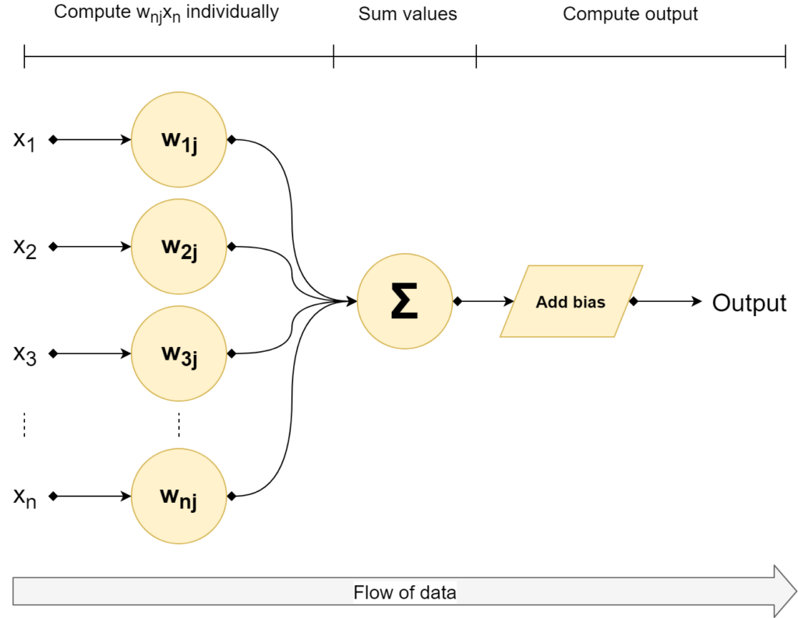
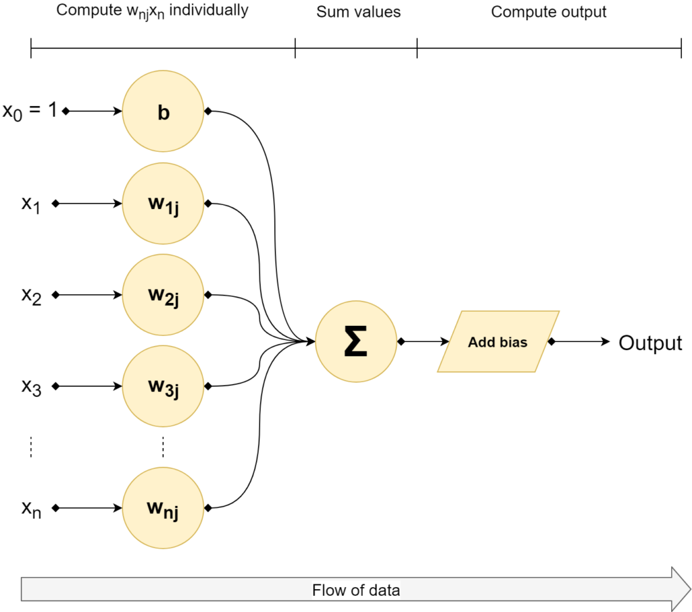
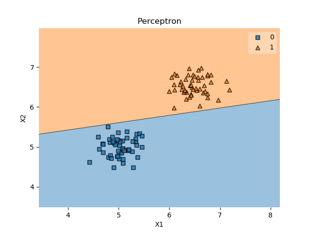

According to Wikipedia, Frank Rosenblatt is an "American psychologist notable in the field of artificial intelligence".

And notable, he is.

Rosenblatt is the inventor of the so-called **Rosenblatt Perceptron**, which is one of the first algorithms for supervised learning, invented in 1958 at the Cornell Aeronautical Laboratory.

The blogs I write on MachineCurve.com are educational in two ways. First, I use them to structure my thoughts on certain ML related topics. Second, if they help me, they could help others too. This blog is one of the best examples: it emerged from my struggle to identify **why it is difficult** to implement Rosenblatt's Perceptron with modern machine learning frameworks.

Turns out that has to do with the means of optimizing one's model - a.k.a. the Perceptron Learning Rule vs [Stochastic Gradient Descent](https://www.machinecurve.com/index.php/2019/10/24/gradient-descent-and-its-variants/). I'm planning to dive into this question in detail in another blog. This article describes the work I preformed _before_ being able to answer it - or, programming a Perceptron myself, understanding how it attempts to find the best [decision boundary](https://www.machinecurve.com/index.php/2019/10/11/how-to-visualize-the-decision-boundary-for-your-keras-model/). It **provides a tutorial** for **implementing the Rosenblatt Perceptron yourself**.

I will first introduce the Perceptron in detail by discussing some of its history as well as its mathematical foundations. Subsequently, I will move on to the Perceptron Learning Rule, demonstrating how it improves over time. This is followed by a Python based Perceptron implementation that is finally demonstrated with a real dataset.

Of course, if you want to start working with the Perceptron right away, you can find example code for the Rosenblatt Perceptron in the first section.

If you run into questions during the read, or if you have any comments, please feel free to write a comment in the comment box near the bottom 👇 I'm happy to provide my thoughts and improve this post whenever I'm wrong. I hope to hear from you!

**Update 13/Jan/2021:** Made article up-to-date. Added quick example to answer question _how to implement Rosenblatt Perceptron with Python?_ Performed changes to article structure. Added links to other articles. It's now ready for 2021!

* * *

\[toc\]

* * *

## Answer: implementing Rosenblatt Perceptron with Python

Some people just want to start with code before they read further. That's why in this section, you'll find a **fully functional example** of the Rosenblatt Perceptron, created with Python. It shows a class that is initialized, that has a training loop (`train` definition) and which can generate predictions once trained (through `predict`). If you want to understand the Perceptron in more detail, make sure to read the rest of this tutorial too!

```
import numpy as np

# Basic Rosenblatt Perceptron implementation
class RBPerceptron:

  # Constructor
  def __init__(self, number_of_epochs = 100, learning_rate = 0.1):
    self.number_of_epochs = number_of_epochs
    self.learning_rate = learning_rate

  # Train perceptron
  def train(self, X, D):
    # Initialize weights vector with zeroes
    num_features = X.shape[1]
    self.w = np.zeros(num_features + 1)
    # Perform the epochs
    for i in range(self.number_of_epochs):
      # For every combination of (X_i, D_i)
      for sample, desired_outcome in zip(X, D):
        # Generate prediction and compare with desired outcome
        prediction    = self.predict(sample)
        difference    = (desired_outcome - prediction)
        # Compute weight update via Perceptron Learning Rule
        weight_update = self.learning_rate * difference
        self.w[1:]    += weight_update * sample
        self.w[0]     += weight_update
    return self

  # Generate prediction
  def predict(self, sample):
    outcome = np.dot(sample, self.w[1:]) + self.w[0]
    return np.where(outcome > 0, 1, 0)
```

* * *

## A small introduction - what is a Perceptron?

A Perceptron is a [binary classifier](https://www.machinecurve.com/index.php/2020/10/19/3-variants-of-classification-problems-in-machine-learning/#variant-1-binary-classification) that was invented by [Frank Rosenblatt](https://en.wikipedia.org/wiki/Frank_Rosenblatt) in 1958, working on a research project for Cornell Aeronautical Laboratory that was US government funded. It was based on the recent advances with respect to mimicing the human brain, in particular the MCP architecture that was recently invented by McCulloch and Pitts.

This architecture attempted to mimic the way neurons operate in the brain: given certain inputs, they fire, and their firing behavior can change over time. By [allowing the same to happen in an artificial neuron](https://www.machinecurve.com/index.php/2020/10/29/why-nonlinear-activation-functions-improve-ml-performance-with-tensorflow-example/#individual-neurons), researchers at the time argued, machines could become capable of approximating human intelligence.

...well, that was a slight overestimation, I'd say 😄 Nevertheless, the Perceptron lies at the basis of where we've come today. It's therefore a very interesting topic to study deeper. Next, I will therefore scrutinize its mathematical building blocks, before moving on to implementing one in Python.

\[ad\]

### Mathematical building blocks

When you [train a supervised machine learning model](https://www.machinecurve.com/index.php/2019/10/04/about-loss-and-loss-functions/#the-high-level-supervised-learning-process), it must somehow capture the information that you're giving it. The Perceptron does this by means of a _[weights vector](https://www.machinecurve.com/index.php/2019/08/22/what-is-weight-initialization/)_, or `**w**` that determines the exact position of the [decision boundary](https://www.machinecurve.com/index.php/2019/10/11/how-to-visualize-the-decision-boundary-for-your-keras-model/) and is learnt from the data.

If you input new data, say in an _input vector_ `**x**`, you'll simply have to pinpoint this vector with respect to the learnt weights, to decide on the class.

Mathematically, this is represented as follows:

\[mathjax\]

\\begin{equation} f(x) = \\begin{cases} 1, & \\text{if}\\ \\textbf{w}\\cdot\\textbf{x}+b > 0 \\\\ 0, & \\text{otherwise} \\\\ \\end{cases} \\end{equation}

Here, you can see why it is a binary classifier: it simply determines the data to be part of class '0' or class '1'. This is done based on the output of the multiplication of the weights and input vectors, with a bias value added.

When you multiply two vectors, you're computing what is called a dot product. A dot product is the sum of the multiplications of the individual scalars in the vectors, pair-wise. This means that e.g. \[latex\]w\_1x\_1\[/latex\] is computed and summated together with \[latex\]w\_2x\_2\[/latex\], \[latex\]w\_3x\_3\[/latex\] and so on ... until \[latex\]w\_nx\_n\[/latex\]. Mathematically:

\\begin{equation} \\begin{split} &z=\\sum\_{i=1}^{n} w\_nx\_n + b \\\\ &= w\_1x\_1 + ... + w\_nx\_n + b \\\\ \\end{split} \\end{equation}

When this output value is larger than 0, it's class 1, otherwise it's class 0. In other words: [binary classification](https://www.machinecurve.com/index.php/2020/10/19/3-variants-of-classification-problems-in-machine-learning/#variant-1-binary-classification).

### The Perceptron, visually

Visually, this looks as follows:  
  



  
All right - we now have a mathematical structure for automatically deciding about the class. Weights vector `**w**` and bias value `_b_` are used for setting the decision boundary. We did however not yet cover how the Perceptron is updated. Let's find out now!

* * *

## Before optimizing: moving the bias into the weights vector

Rosenblatt did not only provide the model of the perceptron, but also the method for optimizing it.

This however requires that we first move the bias value into the weights vector.

This sounds strange, but it is actually a very elegant way of making the equation simpler.

\[ad\]

As you recall, this is how the Perceptron can be defined mathematically:

\\begin{equation} f(x) = \\begin{cases} 1, & \\text{if}\\ \\textbf{w}\\cdot\\textbf{x}+b > 0 \\\\ 0, & \\text{otherwise} \\\\ \\end{cases} \\end{equation}

Of which \[latex\]\\textbf{w}\\cdot\\textbf{x}+b\[/latex\] could be written as:

\\begin{equation} \\begin{split} &z=\\sum\_{i=1}^{n} w\_nx\_n + b \\\\ &= w\_1x\_1 + ... + w\_nx\_n + b \\\\ \\end{split} \\end{equation}

We now add the bias to the weights vector as \[latex\]w\_0\[/latex\] and choose \[latex\]x\_0 = 1\[/latex\]. This looks as follows:



This allows us to rewrite \[latex\]z\[/latex\] as follows - especially recall that \[latex\]w\_0 = b\[/latex\] and \[latex\]x\_0 = 1\[/latex\]:

\\begin{equation} \\begin{split} & z = \\sum\_{i=0}^{n} w\_nx\_n \\\\ & = w\_0x\_0 + w\_1x\_1 + ... + w\_nx\_n \\\\ & = w\_0x\_0 + w\_1x\_1 + ... + w\_nx\_n \\\\ & = 1b + w\_1x\_1 + ... + w\_nx\_n \\\\ & = w\_1x\_1 + ... + w\_nx\_n + b \\end{split} \\end{equation}

As you can see, it is still equal to the original way of writing it:

\\begin{equation} \\begin{split} &z=\\sum\_{i=1}^{n} w\_nx\_n + b \\\\ &= w\_1x\_1 + ... + w\_nx\_n + b \\\\ \\end{split} \\end{equation}

This way, we got rid of the bias \[latex\]b\[/latex\] in our main equation, which will greatly help us with what we'll do now: update the weights in order to optimize the model.

* * *

## Training the model

We'll use what is called the _Perceptron Learning Rule_ for that purpose. But first, we need to show you how the model is actually trained - by showing the pseudocode for the entire training process.

We'll have to make a couple assumptions at first:

1. There is the weights vector `w` which, at the beginning, is [uninitialized](https://www.machinecurve.com/index.php/2019/08/22/what-is-weight-initialization/).
2. You have a set of training values, such as \[latex\]T = \\{ (x\_1, d\_1), (x\_2, d\_2), ..., (x\_n, d\_n) \\}\[/latex\]. Here, \[latex\]x\_n\[/latex\] is a specific feature vector, while \[latex\]d\_n\[/latex\] is the corresponding target value.
3. We ensure that \[latex\]w\_0 = b\[/latex\] and \[latex\]x\_0 = 1\[/latex\].
4. We will have to configure a _[learning rate](https://www.machinecurve.com/index.php/2019/11/06/what-is-a-learning-rate-in-a-neural-network/)_ or \[latex\]r\[/latex\], or by how much the model weights improve. This is a number between 0 and 1. We use \[latex\]r = 0.1\[/latex\] in the Python code that follows next.

This is the pseudocode:

1. Initialize the weights vector `**w**` to zeroes or random numbers.
2. For every \[latex\](x\_n, d\_n)\[/latex\] in \[latex\]D\[/latex\]:
    1. Compute the output value for the input vector \[latex\]x\_n\[/latex\]. Mathematically, that's \[latex\]d'\_n: f(x\_n) = w\_nx\_n\[/latex\].
    2. Compare the output value \[latex\]d'\_n\[/latex\] with target value \[latex\]d\_n\[/latex\].
    3. Update the weights according to the Perceptron Learning Rule: \[latex\]w\_\\text{n,i}(t+1) = w\_\\text{n,i}(t) + r \\cdot (d\_n - d'\_n) \\cdot x\_\\text{n,i}\[/latex\] for all features (scalars) \[latex\]0 \\leq i \\leq|w\_n|\[/latex\].

Or, in plain English:

- First [initialize the weights](https://www.machinecurve.com/index.php/2019/08/22/what-is-weight-initialization/) randomly or to zeroes.
- Iterate over every feature in the data set.
- Compute the output value.
- Compare if it matches, and 'push' the weights into the right direction (i.e. the \[latex\]d\_n - d'\_n\[/latex\] part) slightly with respect to \[latex\]x\_\\text{n,i}\[/latex\], as much as the learning rate \[latex\]r\[/latex\] allows.

This means that the weights are updated for every sample from the dataset.

This process may be repeated until some criterion is reached, such as a specific number of errors, or - if you are adventurous - full convergence (i.e., the number of errors is 0).

* * *

## Perceptron in Python

Now let's see if we can code a Perceptron in Python. Create a new folder and add a file named `p.py`. In it, let's first import numpy, which we'll need for some number crunching:

```
import numpy as np
```

We'll create a class that is named `RBPerceptron`, or Rosenblatt's Perceptron. Classes in Python have a specific structure: they must be defined as such (by using `class`) and can contain Python definitions which must be coupled to the class through `self`. Additionally, it may have a constructor definition, which in Python is called `__init__`.

### Class definition and constructor

So let's code the class:

```
# Basic Rosenblatt Perceptron implementation
class RBPerceptron:
```

Next, we want to allow the engineer using our Perceptron to configure it before he or she starts the training process. We would like them to be able to configure two variables:

- The number of epochs, or rounds, before the model stops the training process.
- The learning rate \[latex\]r\[/latex\], i.e. the determinant for the size of the weight updates.

We'll do that as follows:

```
  # Constructor
  def __init__(self, number_of_epochs = 100, learning_rate = 0.1):
    self.number_of_epochs = number_of_epochs
    self.learning_rate = learning_rate
```

The `__init__` definition nicely has a self reference, but also two attributes: `number_of_epochs` and `learning_rate`. These are preconfigured, which means that if those values are not supplied, those values serve as default ones. By default, the model therefore trains for 100 epochs and has a default learning rate of 0.1

However, since the user can manually provide those, they must also be set. We need to use them globally: the number of epochs and the learning rate are important for the training process. By consequence, we cannot simply keep them in the context of our Python definition. Rather, we must add them to the instance variables of the class. This can be done by assigning them to the class through `self`.

\[ad\]

### The training definition

All right, the next part - the training definition:

```
  # Train perceptron
  def train(self, X, D):
    # Initialize weights vector with zeroes
    num_features = X.shape[1]
    self.w = np.zeros(num_features + 1)
    # Perform the epochs
    for i in range(self.number_of_epochs):
      # For every combination of (X_i, D_i)
      for sample, desired_outcome in zip(X, D):
        # Generate prediction and compare with desired outcome
        prediction    = self.predict(sample)
        difference    = (desired_outcome - prediction)
        # Compute weight update via Perceptron Learning Rule
        weight_update = self.learning_rate * difference
        self.w[1:]    += weight_update * sample
        self.w[0]     += weight_update
    return self
```

The definition it self must once again have a `self` reference, which is provided. However, it also requires the engineer to pass two attributes: `X`, or the set of input samples \[latex\]x\_1 ... x\_n\[/latex\], as well as `D`, which are their corresponding targets.

Within the definition, we first initialize the weights vector as discussed above. That is, we assign it with zeroes, and it is `num_features + 1` long. This way, it can both capture the features \[latex\]x\_1 ... x\_n\[/latex\] as well as the bias \[latex\]b\[/latex\] which was assigned to \[latex\]x\_0\[/latex\].

Next, the training process. This starts by creating a `for` statement that simply ensures that the program iterates over the `number_of_epochs` that were configured by the user.

During one iteration, or epoch, every combination of \[latex\](x\_i, d\_i)\[/latex\] is iterated over. In line with the pseudocode algorithm, a prediction is generated, the difference is computed, and the weights are updated accordingly.

After the training process has finished, the model itself is returned. This is not necessary, but is relatively convenient for later use by the ML engineer.

### Generating predictions

Finally, the model must also be capable of generating predictions, i.e. computing the dot product \[latex\]\\textbf{w}\\cdot\\textbf{x}\[/latex\] (where \[latex\]b\[/latex\] is included as \[latex\]w\_0\[/latex\]).

We do this relatively elegantly, thanks to another example of the Perceptron algorithm provided by [Sebastian Raschka](https://sebastianraschka.com/Articles/2015_singlelayer_neurons.html#artificial-neurons-and-the-mcculloch-pitts-model): we first compute the dot product for all weights except \[latex\]w\_0\[/latex\] and subsequently add this one as the bias weight. Most elegantly, however, is how the prediction is generated: with `np.where`. This allows an engineer to generate predictions for a batch of samples \[latex\]x\_i\[/latex\] at once. It looks as follows:

```
  # Generate prediction
  def predict(self, sample):
    outcome = np.dot(sample, self.w[1:]) + self.w[0]
    return np.where(outcome > 0, 1, 0)
```

### Final code

All right - when integrated, this is our final code.

You can also check it out on [GitHub](https://github.com/christianversloot/rosenblatts-perceptron).

```
import numpy as np

# Basic Rosenblatt Perceptron implementation
class RBPerceptron:

  # Constructor
  def __init__(self, number_of_epochs = 100, learning_rate = 0.1):
    self.number_of_epochs = number_of_epochs
    self.learning_rate = learning_rate

  # Train perceptron
  def train(self, X, D):
    # Initialize weights vector with zeroes
    num_features = X.shape[1]
    self.w = np.zeros(num_features + 1)
    # Perform the epochs
    for i in range(self.number_of_epochs):
      # For every combination of (X_i, D_i)
      for sample, desired_outcome in zip(X, D):
        # Generate prediction and compare with desired outcome
        prediction    = self.predict(sample)
        difference    = (desired_outcome - prediction)
        # Compute weight update via Perceptron Learning Rule
        weight_update = self.learning_rate * difference
        self.w[1:]    += weight_update * sample
        self.w[0]     += weight_update
    return self

  # Generate prediction
  def predict(self, sample):
    outcome = np.dot(sample, self.w[1:]) + self.w[0]
    return np.where(outcome > 0, 1, 0)
```

* * *

## Testing with a dataset

All right, let's now test our implementation of the Perceptron. For that, we'll need a dataset first. Let's generate one with Python. Go to the same folder as `p.py` and create a new one, e.g. `dataset.py`. Use this file for the next steps.

### Generating the dataset

We'll first import `numpy` and generate 50 zeros and 50 ones.

We then combine them into the `targets` list, which is now 100 long.

We'll then use the normal distribution to generate two samples that do not overlap of both 50 samples.

Finally, we concatenate the samples into the list of input vectors `X` and set the desired targets `D` to the targets generated before.

```
# Import libraries
import numpy as np

# Generate target classes {0, 1}
zeros = np.zeros(50)
ones = zeros + 1
targets = np.concatenate((zeros, ones))

# Generate data
small = np.random.normal(5, 0.25, (50,2))
large = np.random.normal(6.5, 0.25, (50,2))

# Prepare input data
X = np.concatenate((small,large))
D = targets
```

### Visualizing the dataset

It's always nice to get a feeling for the data you're working with, so let's first visualize the dataset:

```
import matplotlib.pyplot as plt
plt.scatter(small[:,0], small[:,1], color='blue')
plt.scatter(large[:,0], large[:,1], color='red')
plt.show()
```

It should look like this:


Let's next train our Perceptron with the entire [training set](https://www.machinecurve.com/index.php/2020/11/16/how-to-easily-create-a-train-test-split-for-your-machine-learning-model/) `X` and the corresponding desired targets `D`.

\[ad\]

We must first initialize our Perceptron for this purpose:

```
from p import RBPerceptron
rbp = RBPerceptron(600, 0.1)
```

Note that we use 600 epochs and set a learning rate of 0.1. Let's now train our model:

```
trained_model = rbp.train(X, D)
```

The training process should be completed relatively quickly. We can now visualize the Perceptron and its [decision boundary](https://www.machinecurve.com/index.php/2019/10/11/how-to-visualize-the-decision-boundary-for-your-keras-model/) with a library called [mlxtend](http://rasbt.github.io/mlxtend/) - once again the credits for using this library go out to [Sebastian Raschka.](https://sebastianraschka.com/Articles/2015_singlelayer_neurons.html#artificial-neurons-and-the-mcculloch-pitts-model)

If you don't have it already, install it first by means of `pip install mlxtend`.

Subsequently, add this code:

```
from mlxtend.plotting import plot_decision_regions
plot_decision_regions(X, D.astype(np.integer), clf=trained_model)
plt.title('Perceptron')
plt.xlabel('X1')
plt.ylabel('X2')
plt.show()
```

You should now see the same data with the Perceptron decision boundary successfully separating the two classes:



There you go, Rosenblatt's Perceptron in Python!

* * *

## References

Bernard (2018, December). Align equation left. Retrieved from [https://tex.stackexchange.com/questions/145657/align-equation-left](https://tex.stackexchange.com/questions/145657/align-equation-left)

Raschka, S. (2015, March 24). Single-Layer Neural Networks and Gradient Descent. Retrieved from [https://sebastianraschka.com/Articles/2015\_singlelayer\_neurons.html#artificial-neurons-and-the-mcculloch-pitts-model](https://sebastianraschka.com/Articles/2015_singlelayer_neurons.html#artificial-neurons-and-the-mcculloch-pitts-model)

Perceptron. (2003, January 22). Retrieved from [https://en.wikipedia.org/wiki/Perceptron#Learning\_algorithm](https://en.wikipedia.org/wiki/Perceptron#Learning_algorithm)
