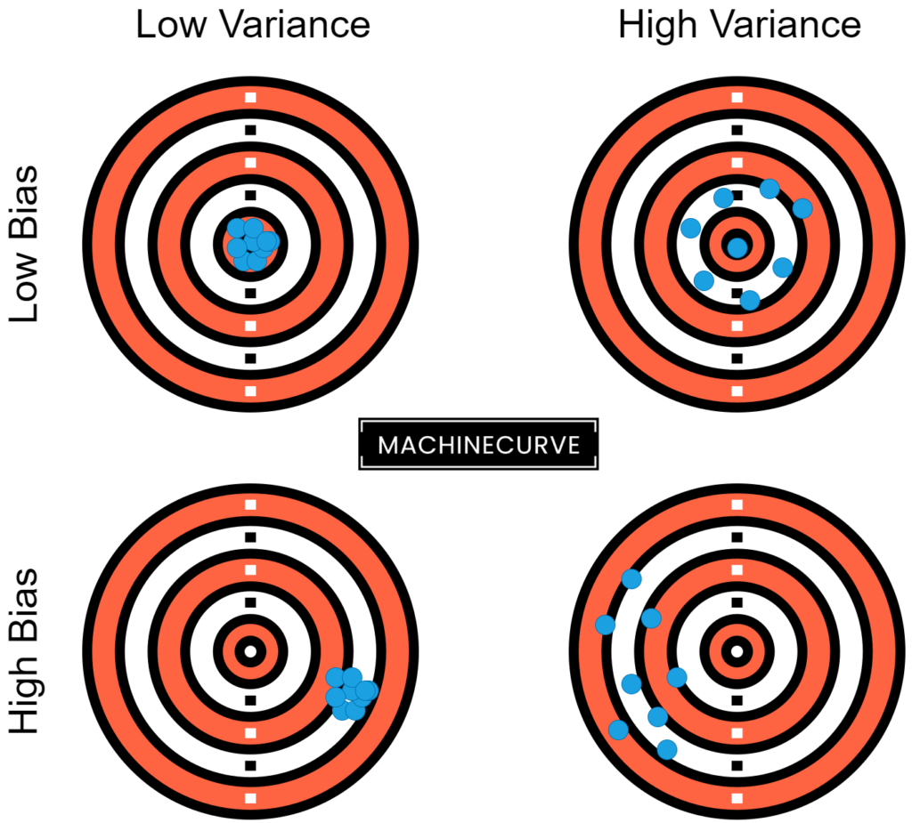

Supervised Machine Learning is one of the most prominent branches of Machine Learning these days. Using a labeled training set and an adequate model, it is possible to create a ML model that demonstrates very impressive results. As we will see, training such a model involves a cycle of _feeding forward_ data through the model, _observing how bad it performs_, and subsequently _optimizing it to make it better_.

After some threshold is passed, the training process stops, and the model is trained.

The "observing how bad it performs" part is the focus of today's article. Because the **error**, with which the former is expressed, is interesting - because it is composed of multiple error subtypes. This article will focus on these subtypes, which are the **bias error**, the **variance error** and the **irreducible error**. We will find out what error is in general, what those subtypes are, and how we can decompose a TensorFlow ML model into the error subtypes.

Let's take a look! :)

* * *

\[toc\]

* * *

## Error in supervised machine learning: what is it?

From the article about loss and loss functions, we know about the [high-level supervised machine learning process](https://www.machinecurve.com/index.php/2019/10/04/about-loss-and-loss-functions/#the-high-level-supervised-learning-process):

1. Samples from a labeled dataset are inserted into the model - this is called "feeding the samples forward".
2. The machine learning model generates a prediction for each sample.
3. All predictions are compared to the labels, called the ground truth, and a _loss value_ is output.
4. Based on the loss value, the loss is computed backwards, to find the optimizations for the individual parts of the machine learning model.
5. By means of some optimization mechanism (e.g. [gradient descent](https://www.machinecurve.com/index.php/2019/10/24/gradient-descent-and-its-variants/) or [Adaptive optimization](https://www.machinecurve.com/index.php/2019/11/03/extensions-to-gradient-descent-from-momentum-to-adabound/)), the model is optimized.

Above, we talked about the "observing how bad it performs" part of training a supervised machine learning model. Note that "how bad" and "loss" have relatively similar meaning - and yes, they are connected.

The "loss value" effectively shows you _how bad the model performs_ - in other words, how much off the model is compared to the ground truth, on average.

Hence, this loss value is also called the **model error**. Your goal as a machine learning engineer is to create a dataset, find a suitable algorithm, and tweak it accordingly, to generate a model that performs _and_ generalizes well. In other words, it must be accurate in terms of the prediction, and work in a wide range of cases - even with data that the model has never seen before.

And of course, this is quite a challenge.


* * *

## Error subtypes

Above, we saw that feeding forward the training samples results in a loss or _error_ value. It can be used subsequently for improving your Machine Learning model. Now, we'll dive into the error concept, and will see that it can be decomposed in a few distinct subtypes: **bias error**, **variance error** and **irreducible error**.

Put simply, the subtypes together compose the notion of 'error' in the following manner:

_Error = Bias error + Variance error + Irreducible error._

- **Bias error:** how strict the model generalizes to some designated set of functions.
- **Variance error:** how much the estimated function will change when the algorithm is trained with differing datasets.
- **Irreducible error:** error that is neither bias or variance error and is hence relatively random.

### Bias error

In Dietterich and Kong (1995), we find that Mitchell (1980) introduces the concept of **bias error** as follows:

> "Any basis for choosing one generalization \[hypothesis\] over another, other than strict consistency with the observed training instances."

While this sounds relatively vague - likely on purpose, for generalization purposes - we can relatively easily convert it into a definition that resonates well with ML researchers and engineers:

Bias involves an _assumption of the Machine Learning model that the target function to learn is part of a set of target functions_. In other words, if a model can only learn - or fit - a few example functions, it is a **high-bias** model. If the model can learn many functions instead, it is a **low-bias** model.

> Bias, in the context of Machine Learning, is a type of error that occurs due to erroneous assumptions in the learning algorithm.
> 
> StackExchange (n.d.)

High bias, by making a lot of assumptions about the target function, simplifies the model and makes the fit less computationally intensive.

For example, linear regression is a high-bias model, as it attempts to learn fit data to a function of the form \[latex\]y = a \\times x + b\[/latex\], and nothing else:


Bias error quantifies the amount of error that can be attributed to this assumption. In the plot above, we can see that due to the high-bias property of the linear learner, the bias error shall be quite high.

- **Models with high bias:** linear regression, logistic regression, linear classification, linear neural networks, linear SVMs
- **Models with low bias:** [nonlinear neural networks](https://www.machinecurve.com/index.php/2020/10/29/why-nonlinear-activation-functions-improve-ml-performance-with-tensorflow-example/), [nonlinear Support Vector Machines](https://www.machinecurve.com/index.php/2019/09/20/intuitively-understanding-svm-and-svr/), decision trees.

Your choice for a ML algorithm should never be entirely dependent on the bias assumption of the model. For example, if you have a linear dataset, there is no need to start with neural networks - instead, a linear classifier or linear regression model would likely be able to achieve similar performance at a fraction of the computational cost. Therefore, make sure to think about the characteristics of your dataset, the bias property, but also make sure to consider what we will study next: the variance error.

### Variance error

While the bias of a model tells us something about how rigid it is towards fitting a particular function, the **variance** of our model is related to our datasets:

> Variance, in the context of Machine Learning, is a type of error that occurs due to a model's sensitivity to small fluctuations in the training set.
> 
> StackExchange (n.d.)

Say, for example that we are training the same machine learning model with two different datasets. Model-wise, everything is the same - the algorithm is the same, the hyperparameter configuration is the same, and so on. The only thing that differs is the dataset.

Here, it must also be noted that we do not know whether the distributions of the datasets are _exactly_ the same - they could be, but do not necessarily have to be. However, they're close.

If our model is a **high-variance** model, it is really sensitive to changes in the dataset, and hence could show highly different performance - even when the changes are small. If it's **low-variance**, it's not so sensitive.

Especially when the model is [overfit](https://www.machinecurve.com/index.php/2019/12/16/what-is-dropout-reduce-overfitting-in-your-neural-networks/), the model generally has high variance - and visually, decision boundaries of such models look like this:

- **Models with low variance:** linear regression, logistic regression, linear classification, linear neural networks, linear SVMs
- **Models with high variance:** [nonlinear neural networks](https://www.machinecurve.com/index.php/2020/10/29/why-nonlinear-activation-functions-improve-ml-performance-with-tensorflow-example/), [nonlinear Support Vector Machines](https://www.machinecurve.com/index.php/2019/09/20/intuitively-understanding-svm-and-svr/), decision trees.


### Irreducible error

Some of the model error cannot be ascribed to bias or variance. This **irreducible error** can for example be random noise, which is always present in a randomly initialized machine learning model.

If we want to reduce the impact of model bias, we can choose a machine learning algorithm that is relatively low-bias - that is, increase model complexity and sensitivity. If we want to reduce model sensitivity to changes in data, we can pick a machine learning algorithm that is more rigid. We cannot remove irreducible error from the machine learning model.

It's simply something that we have to live with.

### The Bias-Variance trade-off

In writing the article, I have dropped some hints that bias and machine learning may be related to each other.

- If you read the article with a critical mind, you perhaps noticed that the list of models with low/high variance is exactly the opposite in the case of bias.
- In the section about irreducible error, reducing the effect of one (say, bias) would be to move into the direction of the other (say, variance).

And the opposite is also true. In fact, bias and variance are related. This is true for statistics and hence also for the field of machine learning. In fact, it is known as the **bias-variance trade-off**.

> The bias–variance trade-off implies that a model should balance underfitting and overfitting: Rich enough to express underlying structure in data and simple enough to avoid fitting spurious patterns
> 
> Belkin et al. (2019)

If you compare generating a machine learning model with playing a game of throwing bull's eye, your optimal end result would be a darts board where all arrows are in the middle of the board:

[](https://www.machinecurve.com/wp-content/uploads/2020/11/darts-1.png)

In Machine Learning terms, this is a model with **low bias** and **low variance**.

It is both effective / rich enough "to express structure" (i.e., all near the desired spot, being the center) and simple enough to "\[see\] spurious patterns" (i.e., darts arrows scattered around the board). In other words, it is a model of which its predictions are "spot on" and "not scattered".

In fact, we can extend the darts board to all four cases between low/high bias and low/high variance.

- If your **bias is low** and your **variance is high**, your darts arrows will be near the center but will show some scattering (ML: capable of fitting many patterns, but with some sensitivity to data changes).
- If your **bias is high** and your **variance is low**, the darts arrows will be near each other, but not near the center (ML: not so sensitive to data changes, but too biased, and hence predictions that are collectively off).
- If your **bias is high** and your **variance is high**, the darts arrows will both be scattered and away from the center (ML: too sensitive _and_ not capable of generating precise predictions).
- If your **bias is low** and your **variance is low**, your model is spot on without scattering. This is what you want.

[](https://www.machinecurve.com/wp-content/uploads/2020/11/darts.png)

The **trade-off** in the bias-variance trade-off means that you have to choose between giving up bias and giving up variance in order to generate a model that really works. If you choose a machine learning algorithm with more bias, it will often reduce variance, making it less sensitive to data. This can be good, unless the bias means that the model becomes too rigid. The opposite is also true: if you give up rigidity only to find the model show too much sensitivity, you've crossed the balance between bias and variance in the wrong direction.

Your end goal as a ML engineer is to find the sweet spot between bias and variance.

This is no easy task, and it is dependent on your dataset, the computational resources at your disposal (high-bias models are often less resource-intensive compared to low-bias models; the opposite is true for variance), and your ML experience.

Here, the only lesson is that practice makes perfect.

* * *

## Decomposing your ML error value into error subtypes

If your train a machine learning model, through picking a [loss function](https://www.machinecurve.com/index.php/2019/10/04/about-loss-and-loss-functions/), you'll be able to observe loss values throughout the training process and during the model evaluation step.

This loss value can be decomposed into bias and variance error by means of Sebastian Raschka's [Mlxtend](http://rasbt.github.io/mlxtend/) Python library, with which one can also [plot the decision boundary of a classifier](https://www.machinecurve.com/index.php/2019/10/11/how-to-visualize-the-decision-boundary-for-your-keras-model/).

More specifically, this can be done by means of the `bias_variance_decomp` functionality available in the library. Let's see how it works with the TensorFlow model listed here. It is the [MLP classifier that we created](https://www.machinecurve.com/index.php/2019/07/30/creating-an-mlp-for-regression-with-keras/) with the Chennai Reservoir Level Dataset ([click here for the dataset](https://www.machinecurve.com/index.php/2019/07/30/creating-an-mlp-for-regression-with-keras/#getting-familiar-with-the-data-the-chennai-water-crisis)).

- We import a variety of functionality: the bias-variance decomposition functionality from Mlxtend, some TensorFlow things, NumPy and generating a train/test split from Scikit-learn.
- We then load the data from a CSV file and shuffle the dataset.
- We separate features and targets and split the data into a 66/33 train/test split.
- We configure the input shape and subsequently create, configure and fit the model.
- We then evaluate the model and display the loss results.
- Finally, we use Mlxtend to decompose the loss into bias and variance loss: we set the loss function to Mean Squared Error, let it simulate bias and variance for 100 iterations, and initialize it with a random seed `46` (this can be any number).

Running the model gives us the components of the **bias error** and the **variance error**.

- Note that in November 2020, the Mlxtend package could not yet generate a decomposition for a Keras model. However, this was added quite recently, but was not available in the `pip` release yet. Therefore, make sure to install/upgrade Mlxtend from GitHub (GitHub, n.d.), by means of:

```
pip install git+git://github.com/rasbt/mlxtend.git
```

Here is the code.

```
# Imports
from mlxtend.evaluate import bias_variance_decomp
from tensorflow.keras.models import Sequential
from tensorflow.keras.layers import Dense
import numpy as np
from sklearn.model_selection import train_test_split

# Load data
dataset = np.loadtxt('./chennai_reservoir_levels.csv', delimiter='|', skiprows=1, usecols=(1,2,3,4))

# Shuffle dataset
np.random.shuffle(dataset)

# Separate features and targets
X = dataset[:, 0:3]
y = dataset[:, 3]

# Split
 into train/test sets
X_train, X_test, y_train, y_test = train_test_split(X, y, test_size=0.33, random_state=42)

# Set the input shape
input_shape = (3,)
print(f'Feature shape: {input_shape}')

# Create the model
model = Sequential()
model.add(Dense(16, input_shape=input_shape, activation='relu'))
model.add(Dense(8, activation='relu'))
model.add(Dense(1, activation='linear'))

# Configure the model and start training
model.compile(loss='mean_absolute_error', optimizer='adam', metrics=['mean_squared_error'])
model.fit(X_train, y_train, epochs=25, batch_size=1, verbose=1, validation_split=0.2)

# Test the model after training
test_results = model.evaluate(X_test, y_test, verbose=1)
print(f'Test results - Loss: {test_results[0]} - Accuracy: {test_results[1]*100}%')

# Using Mlxtend to decompose loss
avg_expected_loss, avg_bias, avg_var = bias_variance_decomp(
        model, X_train, y_train, X_test, y_test, 
        loss='mse',
        num_rounds=100,
        random_seed=46)

print('Average expected loss: %.3f' % avg_expected_loss)
print('Average bias: %.3f' % avg_bias)
print('Average variance: %.3f' % avg_var)
```

* * *

## Summary

In this article, we looked at the trade-off between bias error and variance error. We saw that machine learning model error can be decomposed into subtypes, being the bias - or the rigidity of the model in terms of the functions that it can learn - and variance - being the sensitivity to fluctuations in the training data.

Through an example of a darts board, we saw that we want to strike a fair balance between bias and variance - and that we would likely achieve a model with relatively low bias _and_ variance.

Unfortunately, we also saw that this is not always possible. Still, here, it is also important to find a balance between the two. For this reason, we illustrated how the error from a TensorFlow model can be decomposed into bias and variance by means of Mlxtend.

I hope that you have learnt something from today's article! If you did, please leave a comment in the comments section below - I would definitely appreciate it 😊 Please do the same if you have questions, remarks or other comments. Where possible, I will make sure to answer them!

Thank you for reading MachineCurve today and happy engineering 😎

* * *

## References

Raschka, S. (n.d.). _Mlxtend.evaluate - mlxtend_. Site not found · GitHub Pages. [https://rasbt.github.io/mlxtend/api\_subpackages/mlxtend.evaluate/#bias\_variance\_decomp](https://rasbt.github.io/mlxtend/api_subpackages/mlxtend.evaluate/#bias_variance_decomp)

Dietterich, T. G., & Kong, E. B. (1995). _[Machine learning bias, statistical bias, and statistical variance of decision tree algorithms](http://www.cems.uwe.ac.uk/~irjohnso/coursenotes/uqc832/tr-bias.pdf)_. Technical report, Department of Computer Science, Oregon State University.

Mitchell, T. M. (1980). [The need for biases in learning generalizations.](http://www-cgi.cs.cmu.edu/~tom/pubs/NeedForBias_1980.pdf) Tech. rep. CBMTR-117, Rutgers University, New Brunswick, NJ.

Belkin, M., Hsu, D., Ma, S., & Mandal, S. (2019). [Reconciling modern machine-learning practice and the classical bias–variance trade-off](https://www.pnas.org/content/116/32/15849.short). _Proceedings of the National Academy of Sciences_, _116_(32), 15849-15854.

StackExchange. (n.d.). _What is the meaning of term variance in machine learning model?_ Data Science Stack Exchange. [https://datascience.stackexchange.com/a/37350](https://datascience.stackexchange.com/a/37350)

Dartboard icon made by [Freepik](https://www.flaticon.com/authors/freepik "Freepik") from [www.flaticon.com](https://www.flaticon.com/ "Flaticon")

GitHub. (n.d.). _Bias\_variance\_decomp for keras sequential? · Issue #719 · rasbt/mlxtend_. [https://github.com/rasbt/mlxtend/issues/719](https://github.com/rasbt/mlxtend/issues/719)
