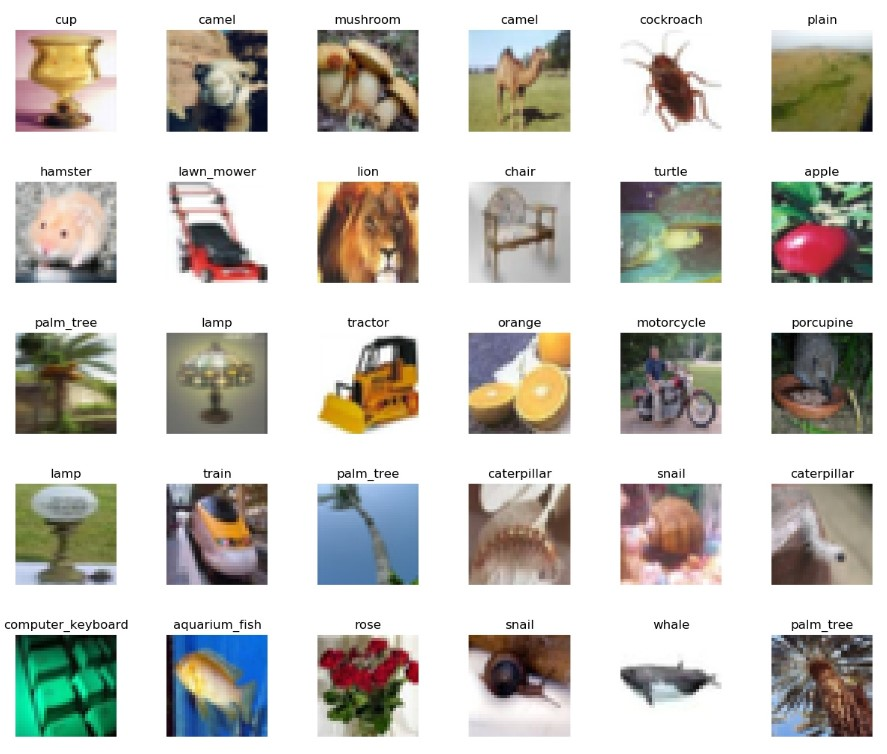
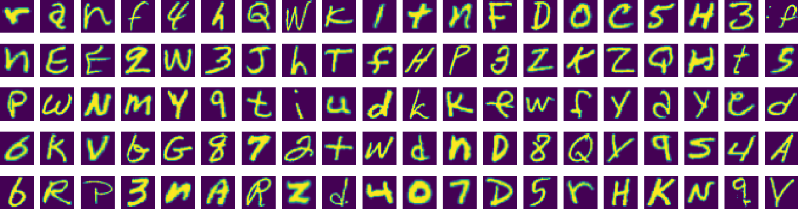
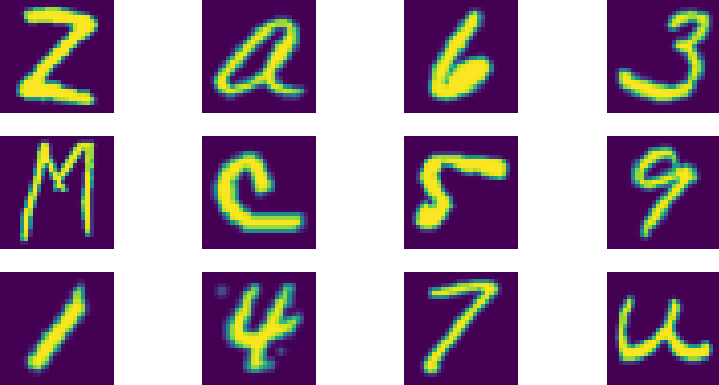
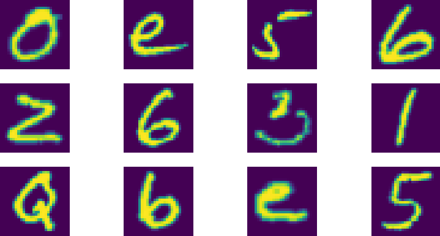
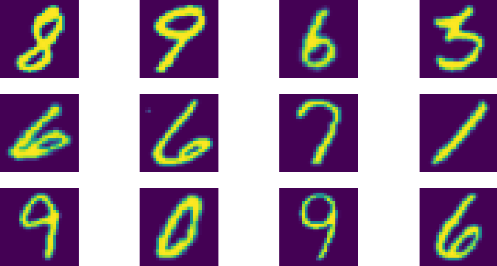
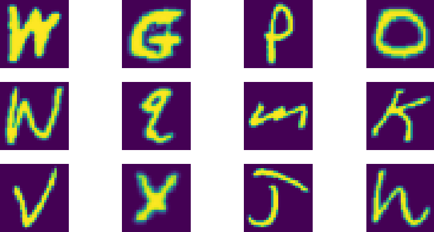
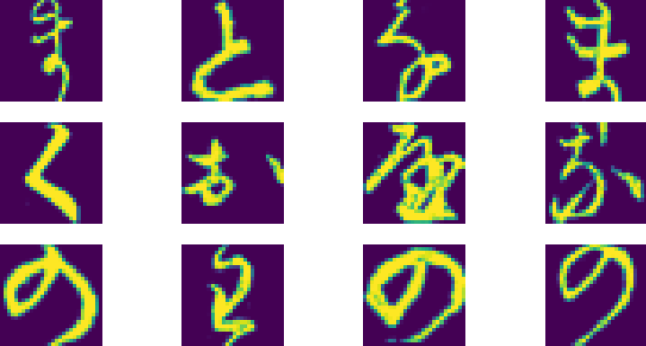
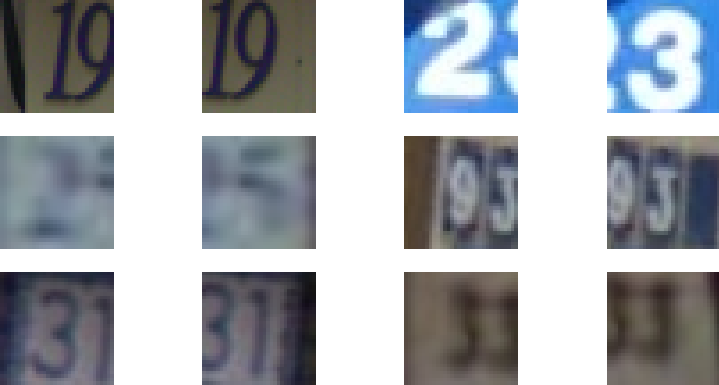
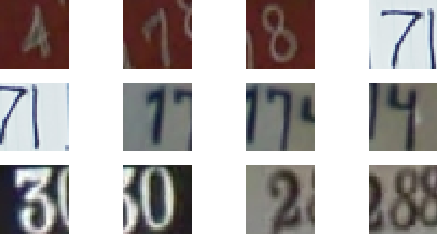
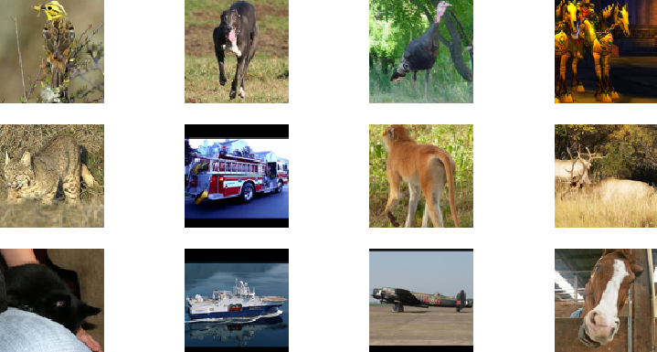

Thanks to modern deep learning frameworks like Keras, it's very easy to use particular datasets - which are included in the framework by default. However, the amount of datasets available is often quite low, as the creators likely have more important things to do than integrate all public datasets that are available on the Internet.

This blog post introduces the `extra-keras-datasets` module, which extends `tensorflow.keras.datasets` with additional ones. So far, we've included the EMNIST dataset, the KMNIST ones, as well as SVHN and STL-10, and we're adding more regularly.

Let's explore these new Keras datasets!

**Update 16/Nov/2020:** made the references to `keras.datasets` compatible with TensorFlow 2.x.

* * *

\[toc\]

* * *

## The Keras Datasets module

In a different blog post, we [explored the Keras Datasets module](https://www.machinecurve.com/index.php/2019/12/31/exploring-the-keras-datasets/). The module, which can be used in your Keras models by importing `tensorflow.keras.datasets`, allows you to load datasets very easily: often, it's simply enough to call `load_data()` and there you go.



The module contains various **image recognition datasets** - being MNIST, CIFAR-10, CIFAR-100, Fashion-MNIST - as well as **text classification datasets** - Reuters Newswires and IMDB sentiment - and a **regression dataset** (Boston House Prices).

However, the number of datasets is relatively small, especially when you're experimenting a lot (such as for my blog posts on MachineCurve. I'll usually use MNIST or the CIFAR datasets, but I'm a bit fed up with them). However, importing various other datasets requires quite some extra code, which makes the explanations with regards to the Keras models less accessible for beginners. Unfortunately, no module is available to support additional datasets.... **until now!**

* * *

## Say hi to Extra Keras Datasets

The **[Extra Keras Datasets module](https://github.com/christianversloot/extra_keras_datasets)** is a drop-in replacement for `tensorflow.keras.datasets`. Under the license provided by Keras, it makes use of its way of _downloading_ data, and offers the same `load_data()` definition to load particular datasets.

[](https://github.com/christianversloot/extra_keras_datasets)

So far, we support a small range of additional datasets, and we're extending on a daily to weekly basis. These are the datasets supported so far:

- EMNIST
- KMNIST
- SVHN
- STL-10

Before we continue with exploring the datasets themselves, let's take a look at the installation procedure first, so that you can start straight away :)

### Installing the Extra Keras Datasets

The installation process is fairly straight-forward:

```
pip install extra-keras-datasets
```

It should also check for and if necessary install the dependencies that are required to run it successfully.

Let's now take a look at which datasets are available :)

* * *

### EMNIST

The EMNIST dataset, which stands for Extended MNIST, is an extension of the MNIST dataset based on the original NIST dataset. It comes in multiple flavors:

- Balanced, which contains a balanced number of letters and digits.
- ByClass, which is unbalanced.
- ByMerge, which is also unbalanced.
- Digits, which are the digits only.
- Letters, which are the letters only.
- Classic MNIST, which is the MNIST dataset as we know it.

Let's now take a look at these datasets in a bit more detail.

#### Balanced

The `balanced` dataset contains digits as well as uppercase and lower handwritten letters. It contains 131.600 characters across 47 balanced classes.

```
from extra-keras-datasets import emnist
(input_train, target_train), (input_test, target_test) = emnist.load_data(type='balanced')
```

[](https://www.machinecurve.com/wp-content/uploads/2020/01/emnist-balanced.png)

* * *

#### ByClass

The `byClass` dataset also contains digits as well as upper case and lowercase letters, but it's unbalanced. Hence, the dataset is substantially larger, with 814.255 characters across 62 unbalanced classes. The classes for this dataset are \[0-9\], \[a-z\] and \[A-Z\] (Cohen et al., 2017).

```
from extra-keras-datasets import emnist
(input_train, target_train), (input_test, target_test) = emnist.load_data(type='byclass')
```

[](https://www.machinecurve.com/wp-content/uploads/2020/01/emnist-byclass.png)

* * *

#### ByMerge

The same is true for `byMerge`, but it's built up slightly differently. It also contains 814.255 characters, but has 47 unbalanced classes only. It merges classes where similarity between uppercase and lowercase letters is too large, possibly confusing your model. The merged classes are C, I, J, K, L, M, O, P, S, U, V, W, X, Y and Z, resulting in 47 insteaad of 62 classes (Cohen et al., 2017).

```
from extra-keras-datasets import emnist
(input_train, target_train), (input_test, target_test) = emnist.load_data(type='bymerge')
```

[](https://www.machinecurve.com/wp-content/uploads/2020/01/emnist-bymerge.png)

* * *

#### Digits

The `digits` dataset contains 280.000 characters across 10 balanced classes; these are the digits only.

```
from extra-keras-datasets import emnist
(input_train, target_train), (input_test, target_test) = emnist.load_data(type='digits')
```

[](https://www.machinecurve.com/wp-content/uploads/2020/01/emnist-digits.png)

* * *

#### Letters

The `letters` dataset contains 145.600 characters across 26 balanced classes; these are the handwritten letters only.

```
from extra-keras-datasets import emnist
(input_train, target_train), (input_test, target_test) = emnist.load_data(type='letters')
```

[](https://www.machinecurve.com/wp-content/uploads/2020/01/emnist-letters.png)

* * *

#### Classic MNIST

The `mnist` dataset is actually the same as traditional MNIST, with 70.000 characters across 10 balanced classes, equaling `tensorflow.keras.datasets.mnist`.

```
from extra-keras-datasets import emnist
(input_train, target_train), (input_test, target_test) = emnist.load_data(type='mnist')
```

[](https://www.machinecurve.com/wp-content/uploads/2020/01/emnist-mnist.png)

* * *

### KMNIST

#### Kuzushiji-MNIST

This is a drop-in replacement for MNIST, but then with 70.000 28x28 images of Japanese Kuzushiji characters. These are considered to be slightly more difficult than the digits of the MNIST dataset.

```
from extra-keras-datasets import kmnist
(input_train, target_train), (input_test, target_test) = kmnist.load_data(type='kmnist')
```

[](https://www.machinecurve.com/wp-content/uploads/2020/01/kmnist-kmnist.png)

* * *

#### Kuzushiji-49

This is an extension of the Kuzishiji-MNIST dataset, offering 270.912 images across 49 classes.

```
from extra-keras-datasets import kmnist
(input_train, target_train), (input_test, target_test) = kmnist.load_data(type='k49')
```

[](https://www.machinecurve.com/wp-content/uploads/2020/01/kmnist-k49.png)

* * *

### SVHN

The Street View House Numbers dataset (SVHN) contains 32x32 cropped images of house numbers obtained from Google Street View.

#### Normal

The `normal` variant contains 73.257 digits for training and 26.032 for testing.

```
from extra-keras-datasets import svhn
(input_train, target_train), (input_test, target_test) = svhn.load_data(type='normal')
```

[](https://www.machinecurve.com/wp-content/uploads/2020/01/svhn-normal.png)

* * *

#### Extra

The `extra` dataset extends the `normal` one with 531.131 extra samples, which are less difficult (Netzer et al., 2011). The dataset then totals 604.388 digits for training and 26.032 digits for testing.

```
from extra-keras-datasets import svhn
(input_train, target_train), (input_test, target_test) = svhn.load_data(type='extra')
```

[](https://www.machinecurve.com/wp-content/uploads/2020/01/svhn-extra.png)

* * *

### STL-10

The STL-10 dataset is an image recognition dataset for developing unsupervised feature learning, deep learning, self-taught learning algorithms. It contains 5.000 training images and 8.000 testing images, and represents 10 classes in total (airplane, bird, car, cat, deer, dog, horse, monkey, ship, truck).

```
from extra-keras-datasets import stl10
(input_train, target_train), (input_test, target_test) = stl10.load_data()
```

[](https://www.machinecurve.com/wp-content/uploads/2020/01/stl10-1.png)

* * *

## Summary

In this blog post, we've introduced the `extra-keras-datasets` module. It extends the original `tensorflow.keras.datasets` module with additional datasets. So far, the EMNIST, KMNIST, SVHN and STL-10 datasets have been made available for easy use. We're extending this dataset on a weekly to monthly basis, so stay tuned! :)

Thank you for reading MachineCurve today and happy engineering! 😎

\[kerasbox\]

* * *

## References

Cohen, G., Afshar, S., Tapson, J., & van Schaik, A. (2017). EMNIST: an extension of MNIST to handwritten letters. Retrieved from [http://arxiv.org/abs/1702.05373](http://arxiv.org/abs/1702.05373)

Clanuwat, T., Bober-Irizar, M., Kitamoto, A., Lamb, A., Yamamoto, K., & Ha, D. (2018). Deep learning for classical Japanese literature. arXiv preprint arXiv:1812.01718. Retrieved from [https://arxiv.org/abs/1812.01718](https://arxiv.org/abs/1812.01718)

Netzer, Y., Wang, T., Coates, A., Bissacco, A., Wu, B., & Ng, A. Y. (2011). Reading digits in natural images with unsupervised feature learning. Retrieved from [http://ufldl.stanford.edu/housenumbers/nips2011\_housenumbers.pdf](http://ufldl.stanford.edu/housenumbers/nips2011_housenumbers.pdf)  
 [http://ufldl.stanford.edu/housenumbers/](http://ufldl.stanford.edu/housenumbers/)

Coates, A., Ng, A., & Lee, H. (2011, June). An analysis of single-layer networks in unsupervised feature learning. In Proceedings of the fourteenth international conference on artificial intelligence and statistics (pp. 215-223). Retrieved from [http://cs.stanford.edu/~acoates/papers/coatesleeng\_aistats\_2011.pdf](http://cs.stanford.edu/~acoates/papers/coatesleeng_aistats_2011.pdf)
