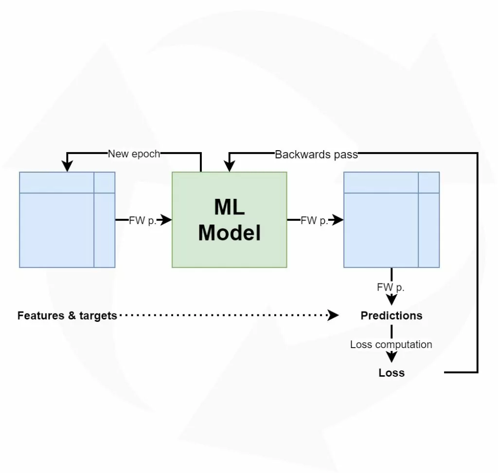

The human brain is very efficient: it can handle extremely complex cognitive situations with relative ease and energy efficiency. It also has a very high computational power relative to its size. Modern neural networks, which are at the forefront of the deep learning field, don't have that power-size ratio. Instead, for good performance in narrow domains, deep learning models need to become really big. Think half a gigabyte big for some pretrained models that can be used for detecting objects and so on.

Fortunately, there are model optimization techniques such as [quantization](https://www.machinecurve.com/index.php/2020/09/16/tensorflow-model-optimization-an-introduction-to-quantization/) and [pruning](https://www.machinecurve.com/index.php/2020/09/23/tensorflow-model-optimization-an-introduction-to-pruning/) that help with reducing the size of your model without losing a lot of its predictive power. This benefits speed and inference power, especially when running optimized models on edge devices - which is a trend I am convinced we will hear a lot more about in the years to come. Using [TensorFlow techniques](https://www.machinecurve.com/index.php/2020/09/29/tensorflow-pruning-schedules-constantsparsity-and-polynomialdecay/), we can reduce our models up to 10 times in size.

Now, let's zoom in to pruning. With e.g. the `PolynomialDecay` pruning schedule in TensorFlow, it is possible to configure _when_ pruning should start during training, as well as _how much pruning should be performed at a particular time_. That is, it is possible to increase the degree of pruning slowly but surely over the training process. This way, model weights can become more robust against the loss of weights incurred by pruning.

However, applying pruning can still be a black box - you know when during the training process pruning will approximately begin, and when it will end. You'll also know at what sparsity level pruning will start, and at what level it will end. However, if you want to **measure the degree of sparsity created by pruning during training**, you're blind. Say that you observe a model that no longer performs well after pruning. At what sparsity level does loss starts to decrease? And what sparsity level does the model finally end up with, anyway? Simply applying `PolynomialDecay` or `ConstantSparsity` based pruning will apply the pruning - but from a black box perspective.

Fortunately, when creating your Keras model using TensorFlow, a callback is available called `PruningSummaries` that is execuded after each epoch during the training process. By using this callback, you can make available information about the pruning process to your [TensorBoard](https://www.machinecurve.com/index.php/2019/11/13/how-to-use-tensorboard-with-keras/) instance. And precisely that is what we will be looking at in today's blog article. **How can pruning summaries open the black box of pruning during the training process?** Firstly, we'll take a brief look at what pruning is to provide you with necessary context about the pruning process. Subsequently, we'll introduce `PruningSummaries` and what they do according to the TensorFlow documentation. Then, we'll add them to our Keras example created in our article about [pruning](https://www.machinecurve.com/index.php/2020/09/29/tensorflow-pruning-schedules-constantsparsity-and-polynomialdecay/), and show you how they work by means of another example.

Let's take a look 😎

\[toc\]

* * *

## A brief recap: what is pruning, again?

Before we'll take a look at pruning summaries, it would be worthwhile to look at what pruning is in the first place - because we must understand _why_ we apply the pruning summaries in the first place. We can't do that without understanding what pruning is, what it does, and how it helps you during model optimization.

Obviously, if you already know about pruning, it's perfectly okay to skip this part :)

### The need for pruning

Now, suppose that you have an idea for a machine learning application of which the goal is large-scale image recognition. That is, you want to create a model that can distinguish between 1.000 classes - without making many mistakes. You also don't have a large (say, 1-2 million samples) dataset available for training. In those cases, it could be worthwhile to use the [VGG-16](https://keras.io/api/applications/vgg/#vgg16-function) architecture (Simonyan & Zisserman, 2014), which comes delivered with Keras with weights pretrained using the ImageNet dataset.

This is a great thing, as it might ensure that you can move forward with your idea, but it comes at a cost: running the model will be quite expensive in terms of computational resources that are required. As we saw [here](https://www.machinecurve.com/index.php/2020/09/23/tensorflow-model-optimization-an-introduction-to-pruning/#the-need-for-model-optimization), weights for VGG-16 are approximately ~500MB big. This means that you'll have to load a model of half a gigabyte, and then use it to generate new predictions! Think about how many neurons are in the network, and how computationally expensive computing all the intermediate steps between the first layer and the outcome would be (note that there are 16 layers with many weights between input and output).

### What happens when training a neural network

From our article about the [high-level supervised machine learning process](https://www.machinecurve.com/index.php/2019/10/04/about-loss-and-loss-functions/#the-high-level-supervised-learning-process), we know that training a supervised model involves moving features from a training set forward through layers in a neural network, subsequently computing the error (or loss value) and finally performing backwards error computation and [optimization](https://www.machinecurve.com/index.php/2019/11/03/extensions-to-gradient-descent-from-momentum-to-adabound/) (MachineCurv,e 2019).

Here, moving features forward means that per feature, we compute vector multiplications between so-called _feature vectors_ (representing a sample for which an outcome must be predicted) and _weight vectors_ (which cover part of the learning performed by the neural network; all weights together capture the entirety of patterns learnt by the network).

The same happens when you let a new sample pass through the network in a forward fashion in order to generate a new sample. With very large networks with many weights, this explains why they can sometimes be _very slow_ when generating new predictions, a process called model inference.



### Adding pruning to the training process

Pruning involves an answer to the following question: **can we drop the weights that don't contribute significantly to the predictive power of a machine learning model during training?** This means two things:

1. We can try and drop all weights that don't contribute in order to make our model faster;
2. _Without_ losing predictive power, i.e., without making the model significantly worse in its ability to generate predictions.

With [magnitude-based pruning](https://www.machinecurve.com/index.php/2020/09/23/tensorflow-model-optimization-an-introduction-to-pruning/), this is precisely what happens: weights that contribute insignificantly to the outcome model are dropped. They are not _truly_ removed from the model, because that would be impossible architecturally. However, they are removed in the sense that the **weights are set to zero**. This creates what is known as [sparsity](https://www.machinecurve.com/index.php/2020/09/23/tensorflow-model-optimization-an-introduction-to-pruning/#saving-storage-and-making-things-faster-with-magnitude-based-pruning), and this has many benefits:

> Why does setting model weights to zero help optimize a model, and make it smaller? Gale et al. (2019) answer this question: “models can be stored and transmitted compactly using sparse matrix formats”. This benefits from the fact that “\[sparse\] data is by nature more easily [compressed](https://en.wikipedia.org/wiki/Data_compression) and thus requires significantly less [storage](https://en.wikipedia.org/wiki/Computer_data_storage).” (Wikipedia, 2003). In addition, beyond compression, computation-wise programming code (such as computing `x`+`y`) can be made faster (e.g., it can be omitted if `x` or `y` are sparse, or both – `x+0` = `x`, and so on), benefiting processing – _inference_, in our case.
> 
> _TensorFlow model optimization: An introduction to pruning – MachineCurve_. (2020, September 23). MachineCurve. [https://www.machinecurve.com/index.php/2020/09/23/tensorflow-model-optimization-an-introduction-to-pruning/#saving-storage-and-making-things-faster-with-magnitude-based-pruning](https://www.machinecurve.com/index.php/2020/09/23/tensorflow-model-optimization-an-introduction-to-pruning/#saving-storage-and-making-things-faster-with-magnitude-based-pruning)

So, inducing **sparsity** by means of pruning helps make them smaller, makes them faster to load, and makes inference faster, by benefiting from the properties of sparse data in terms of storage and programming of libraries such as TensorFlow. That sounds great, doesn't it?

In TensorFlow, it is possible to apply pruning by means of the `ConstantSparsity` and `PolynomialDecay` [pruning schedules](https://www.machinecurve.com/index.php/2020/09/29/tensorflow-pruning-schedules-constantsparsity-and-polynomialdecay/). However, they provide what is a relative black box - you know that pruning will be applied, when it will start and when it will end, and how much sparsity will change over the course of your training process. However, you can't really look _inside_ and look at sparsity levels given a training step - you can only estimate them based on your configuration, but not measure them.

That's why we'll now take a look at `PruningSummaries`, which is a technique to measure the degree of sparsity of your neural network when applying pruning.

* * *

## Measuring pruning during training: PruningSummaries

If you've read my blog post about [TensorBoard](https://www.machinecurve.com/index.php/2019/11/13/how-to-use-tensorboard-with-keras/), or have used it before, you know that it can be used to follow the progress of your machine learning model that's training in realtime. In the post, I'll cover TensorBoard in more detail. Briefly, however:

- TensorBoard is a TensorFlow-delivered web application which allows you to track the inner workings of your ML model in multiple ways, including how training has progressed. As mentioned, this can be done in realtime.
- TensorBoard can be enabled by letting the training process write log data to a folder - you can do so by means of a Keras callback.
- A callback, in this sense, is a piece of code that is run every time something happens - for example, at the start of an epoch or at the start of a [batch](https://www.machinecurve.com/index.php/2019/10/24/gradient-descent-and-its-variants/#minibatch-gradient-descent) being fed forward through your model. It can also run at the end, if that's how the callback was programmed. It can be run by means of the `TensorBoard` callback.

The TensorFlow Model Optimization toolkit actually piggybacks on TensorBoard functionality by providing another callback called `PruningSummaries`. It runs after every epoch and logs information about the pruning process to TensorBoard. In particular, it logs the degree of sparsity of the model at a particular epoch. In short, it's "\[a\] Keras callback for adding pruning summaries to \[TensorBoard\]" (PruningSummaries, n.d.).

### PruningSummaries in the TFMOT API

PruningSummaries are available in the optimization toolkit's API, and the callback is hence documented. Here's what it looks like:

```python
tfmot.sparsity.keras.PruningSummaries(
    log_dir, update_freq='epoch', **kwargs
)
```

It's a really simple callback with literally two arguments - `log_dir`, i.e. where to write the logs, and `update_freq`, which means that it runs every epoch.

(By checking the [source code](https://github.com/tensorflow/model-optimization/blob/master/tensorflow_model_optimization/python/core/sparsity/keras/pruning_callbacks.py#L92-L151), I haven't observed what other values for `update_freq` are possible, so I'm assuming that it only runs on a per epoch basis.)

* * *

## Adding pruning summaries to TensorBoard: a Keras example

Well, that's all for theory. Let's now see how to add `PruningSummaries` to the Keras-based pruning example created in [my other article](https://www.machinecurve.com/index.php/2020/09/29/tensorflow-pruning-schedules-constantsparsity-and-polynomialdecay/). Do note that instead of the `ConstantSparsity` applied there, I will apply `PolynomialDecay` here, because we saw that it works a bit better. What's more, TensorBoard should now nicely show increasing sparsity levels when the numbers of epochs increase.

### Model imports, CNN definition & model compilation

First of all, we add model imporst, define our ConvNet and compile our model. As this isn't really different from creating the [ConvNet itself](https://www.machinecurve.com/index.php/2019/09/17/how-to-create-a-cnn-classifier-with-keras/), I won't really explain how to do that here. If you wish to understand this in more detail, please click the link.

Make sure to create a Python file (e.g. `pruningsummaries.py`) or open a Jupyter Notebook, and add the following code:

```python
import tensorflow
from tensorflow.keras.datasets import mnist
from tensorflow.keras.models import Sequential, save_model
from tensorflow.keras.layers import Dense, Dropout, Flatten
from tensorflow.keras.layers import Conv2D, MaxPooling2D
import tempfile
import tensorflow_model_optimization as tfmot
import numpy as np

# Model configuration
img_width, img_height = 28, 28
batch_size = 250
no_classes = 10
validation_split = 0.2
verbosity = 1
pruning_epochs = 30

# Load MNIST dataset
(input_train, target_train), (input_test, target_test) = mnist.load_data()
input_shape = (img_width, img_height, 1)

# Reshape data for ConvNet
input_train = input_train.reshape(input_train.shape[0], img_width, img_height, 1)
input_test = input_test.reshape(input_test.shape[0], img_width, img_height, 1)
input_shape = (img_width, img_height, 1)

# Parse numbers as floats
input_train = input_train.astype('float32')
input_test = input_test.astype('float32')

# Normalize [0, 255] into [0, 1]
input_train = input_train / 255
input_test = input_test / 255

# Convert target vectors to categorical targets
target_train = tensorflow.keras.utils.to_categorical(target_train, no_classes)
target_test = tensorflow.keras.utils.to_categorical(target_test, no_classes)

# Create the model
model = Sequential()
model.add(Conv2D(32, kernel_size=(3, 3), activation='relu', input_shape=input_shape))
model.add(MaxPooling2D(pool_size=(2, 2)))
model.add(Dropout(0.25))
model.add(Conv2D(64, kernel_size=(3, 3), activation='relu'))
model.add(MaxPooling2D(pool_size=(2, 2)))
model.add(Dropout(0.25))
model.add(Flatten())
model.add(Dense(256, activation='relu'))
model.add(Dense(no_classes, activation='softmax'))

# Compile the model
model.compile(loss=tensorflow.keras.losses.categorical_crossentropy,
              optimizer=tensorflow.keras.optimizers.Adam(),
              metrics=['accuracy'])
```

### Configuring pruning

Now that we have a compiled model, we can convert it so that it is wrapped with pruning functionality - which allows pruning to happen:

```python
# Load functionality for adding pruning wrappers
prune_low_magnitude = tfmot.sparsity.keras.prune_low_magnitude

# Compute the pruning end step
num_images = input_train.shape[0] * (1 - validation_split)
end_step = np.ceil(num_images / batch_size).astype(np.int32) * pruning_epochs

# Define pruning configuration
pruning_params = {
      'pruning_schedule': tfmot.sparsity.keras.PolynomialDecay(initial_sparsity=0.00,
                                                               final_sparsity=0.875,
                                                               begin_step=0.2*end_step,
                                                               end_step=end_step)
}
model_for_pruning = prune_low_magnitude(model, **pruning_params)

# Recompile the model
model_for_pruning.compile(loss=tensorflow.keras.losses.categorical_crossentropy,
              optimizer=tensorflow.keras.optimizers.Adam(),
              metrics=['accuracy'])
```

First, we define the function that will wrap our model with pruning functionality as `prune_low_magnitude`. We subsequently compute the `end_step`, which is effectively the number of batches per epoch times the number of epochs - i.e., the total number of steps taken to train the model.

Then, we define our pruning parameters. More specifically, we define `PolynomialDecay` as our pruning schedule. We start with a sparsity of 0% and end with a sparsity of theoretically 87.5%. Note that we only start pruning at 20% of the training process, to give the model a little bit of time to learn weights without immediately facing loss incurred by pruned weights. Pruning ends at 100% of the training process.

Finally, we actually _add_ the wrappers by calling `prune_low_magnitude` with our model and the pruning parameters that we defined above. Model recompilation is necessary for the pruning to work, and we do that last.

### Defining callbacks

Next, it's time to define the callbacks that Keras will use during training:

```python
# Model callbacks
log_dir = '.\logs'
callbacks = [
  tfmot.sparsity.keras.UpdatePruningStep(),
  tensorflow.keras.callbacks.TensorBoard(log_dir=log_dir, profile_batch = 100000000, histogram_freq=0, batch_size=32, write_graph=True, write_grads=False, write_images=False, embeddings_freq=0, embeddings_layer_names=None, embeddings_metadata=None, embeddings_data=None, update_freq='epoch'),
  tfmot.sparsity.keras.PruningSummaries(
    log_dir, update_freq='epoch'
  )
]
```

We use three of them:

- First of all, we're using the `UpdatePruningStep`. It updates the pruning step (literally: step = step + 1) after each batch. Without it, pruning doesn't work, and TensorFlow will in fact throw an error.
- The `TensorBoard` callback, which we use to write _regular_ data to TensorBoard. Click [here](https://www.machinecurve.com/index.php/2019/11/13/how-to-use-tensorboard-with-keras/#tensorboard-and-the-keras-api) for an explanation of all the attributes passed along.
    - **Important:** note that we, weirdly perhaps, added `profile_batch = 100000000` to our `TensorBoard` callback. This was necessary, because otherwise Keras would throw `ValueError: Must enable trace before export` when using `PruningSummaries`.
- The `PruningSummaries` callback which writes pruning summaries to TensorBoard as well.

As is clear, we write all logs to our `log_dir`. Note that `.\logs` means that it will work on Windows. Perhaps, you will need to change it into `./logs` if you're running Linux or Mac OS.

### Starting the training process with pruning

Then, it's time to start the training process - including pruning:

```python
# Fitting data
model_for_pruning.fit(input_train, target_train,
                      batch_size=batch_size,
                      epochs=pruning_epochs,
                      verbose=verbosity,
                      callbacks=callbacks,
                      validation_split=validation_split)
```

### Model evaluation

Finally, we test our trained and pruned model with our test dataset (split off above, in the first part of the model code) and print the evaluation scores:

```python
# Generate generalization metrics
score_pruned = model_for_pruning.evaluate(input_test, target_test, verbose=0)
print(f'Pruned CNN - Test loss: {score_pruned[0]} / Test accuracy: {score_pruned[1]}')
```

### Full model code

If you wish to obtain the full model code at once - that's of course possible :) Here you go:

```python
import tensorflow
from tensorflow.keras.datasets import mnist
from tensorflow.keras.models import Sequential, save_model
from tensorflow.keras.layers import Dense, Dropout, Flatten
from tensorflow.keras.layers import Conv2D, MaxPooling2D
import tempfile
import tensorflow_model_optimization as tfmot
import numpy as np

# Model configuration
img_width, img_height = 28, 28
batch_size = 250
no_classes = 10
validation_split = 0.2
verbosity = 1
pruning_epochs = 30

# Load MNIST dataset
(input_train, target_train), (input_test, target_test) = mnist.load_data()
input_shape = (img_width, img_height, 1)

# Reshape data for ConvNet
input_train = input_train.reshape(input_train.shape[0], img_width, img_height, 1)
input_test = input_test.reshape(input_test.shape[0], img_width, img_height, 1)
input_shape = (img_width, img_height, 1)

# Parse numbers as floats
input_train = input_train.astype('float32')
input_test = input_test.astype('float32')

# Normalize [0, 255] into [0, 1]
input_train = input_train / 255
input_test = input_test / 255

# Convert target vectors to categorical targets
target_train = tensorflow.keras.utils.to_categorical(target_train, no_classes)
target_test = tensorflow.keras.utils.to_categorical(target_test, no_classes)

# Create the model
model = Sequential()
model.add(Conv2D(32, kernel_size=(3, 3), activation='relu', input_shape=input_shape))
model.add(MaxPooling2D(pool_size=(2, 2)))
model.add(Dropout(0.25))
model.add(Conv2D(64, kernel_size=(3, 3), activation='relu'))
model.add(MaxPooling2D(pool_size=(2, 2)))
model.add(Dropout(0.25))
model.add(Flatten())
model.add(Dense(256, activation='relu'))
model.add(Dense(no_classes, activation='softmax'))

# Compile the model
model.compile(loss=tensorflow.keras.losses.categorical_crossentropy,
              optimizer=tensorflow.keras.optimizers.Adam(),
              metrics=['accuracy'])

# Load functionality for adding pruning wrappers
prune_low_magnitude = tfmot.sparsity.keras.prune_low_magnitude

# Compute the pruning end step
num_images = input_train.shape[0] * (1 - validation_split)
end_step = np.ceil(num_images / batch_size).astype(np.int32) * pruning_epochs

# Define pruning configuration
pruning_params = {
      'pruning_schedule': tfmot.sparsity.keras.PolynomialDecay(initial_sparsity=0.00,
                                                               final_sparsity=0.875,
                                                               begin_step=0.2*end_step,
                                                               end_step=end_step)
}
model_for_pruning = prune_low_magnitude(model, **pruning_params)

# Recompile the model
model_for_pruning.compile(loss=tensorflow.keras.losses.categorical_crossentropy,
              optimizer=tensorflow.keras.optimizers.Adam(),
              metrics=['accuracy'])

# Model callbacks
log_dir = '.\logs'
callbacks = [
  tfmot.sparsity.keras.UpdatePruningStep(),
  tensorflow.keras.callbacks.TensorBoard(log_dir=log_dir, profile_batch = 100000000, histogram_freq=0, batch_size=32, write_graph=True, write_grads=False, write_images=False, embeddings_freq=0, embeddings_layer_names=None, embeddings_metadata=None, embeddings_data=None, update_freq='epoch'),
  tfmot.sparsity.keras.PruningSummaries(
    log_dir, update_freq='epoch'
  )
]

# Fitting data
model_for_pruning.fit(input_train, target_train,
                      batch_size=batch_size,
                      epochs=pruning_epochs,
                      verbose=verbosity,
                      callbacks=callbacks,
                      validation_split=validation_split)

# Generate generalization metrics
score_pruned = model_for_pruning.evaluate(input_test, target_test, verbose=0)
print(f'Pruned CNN - Test loss: {score_pruned[0]} / Test accuracy: {score_pruned[1]}')
```

* * *

## Results: evaluation & TensorBoard screenshots

Let's now run the model. Open up your Python development environment with the necessary libraries installed (primarily, `tensorflow` and the `tfmot` toolkit), and run `python pruningsummaries.py` (or run it in your Notebook).

If all goes well, your model should start training.

### Model evaluation scores

Once it ends, you'll see a model evaluation score - in our case, pruning hasn't impacted accuracy, which is great but expected:

```
Pruned CNN - Test loss: 0.024733462060560124 / Test accuracy: 0.9921000003814697
```

### Starting TensorBoard

More interestingly, however, is what information `PruningSummaries` provide in TensorBoard. Let's open the board by means of a terminal that works from the same directory as where your `*.py` file is located:

```shell
tensorboard --logdir=./logs
```

If all goes well, you should see the following message:

```
Serving TensorBoard on localhost; to expose to the network, use a proxy or pass --bind_all
TensorBoard 2.0.2 at http://localhost:6006/ (Press CTRL+C to quit)
```

You can now navigate to [http://localhost:6006/](http://localhost:6006/) to see the results.

### What PruningSummaries look like in TensorFlow

When clicking one of the layers, you should see information about how the model became sparser during training:


Indeed: the model started getting sparser at approximately 20% of the training process, and achieved between 85-90% sparsity. Precisely as expected!

* * *

## Summary

Pruning can help your models get sparser, and hence faster to run and faster to load, especially on edge devices. This benefits model inference and the deployment of AI in the field. Today's machine learning libraries, such as TensorFlow, provide functionality for pruning through its Model Optimization Toolkit. While pruning often yields great benefits in terms of model size without losing model performance, it's still a bit of a black box.

By means of `PruningSummaries`, however, it's possible to see how pruning has induced sparsity within your machine learning model during the training process. The callback, which logs information about model sparsity to TensorBoard, allows you to see precisely when your model started getting sparser and what sparsity was achieved when. This opens the black box we mentioned before.

This article also provided an example with Keras. By means of a ConvNet based classifier, classifying the MNIST dataset into one out of ten classes, we saw that sparsity of 87.5% could be achieved without a bad-performing model. While this is a relatively artificial example, it shows how pruning can be really effective.

If you have any questions, remarks or other comments, please feel free to leave a comment in the comments section below! I'd love to hear from you 💬 Thank you for reading MachineCurve today and happy engineering! 😎

\[kerasbox\]

* * *

## References

_VGG16 - Convolutional network for classification and detection_. (2018, November 21). Neurohive - Neural Networks. [https://neurohive.io/en/popular-networks/vgg16/](https://neurohive.io/en/popular-networks/vgg16/)

Simonyan, K., & Zisserman, A. (2014). [Very deep convolutional networks for large-scale image recognition](https://arxiv.org/abs/1409.1556). _arXiv preprint arXiv:1409.1556_.

MachineCurve. (2019, December 21). _The high-level supervised learning process_. [https://www.machinecurve.com/index.php/2019/10/04/about-loss-and-loss-functions/#the-high-level-supervised-learning-process](https://www.machinecurve.com/index.php/2019/10/04/about-loss-and-loss-functions/#the-high-level-supervised-learning-process)

Universität Tübingen. (n.d.). _Magnitude based pruning_. Kognitive Systeme | Universität Tübingen. [https://www.ra.cs.uni-tuebingen.de/SNNS/UserManual/node249.html](https://www.ra.cs.uni-tuebingen.de/SNNS/UserManual/node249.html)

_TensorFlow model optimization: An introduction to pruning – MachineCurve_. (2020, September 23). MachineCurve. [https://www.machinecurve.com/index.php/2020/09/23/tensorflow-model-optimization-an-introduction-to-pruning/#saving-storage-and-making-things-faster-with-magnitude-based-pruning](https://www.machinecurve.com/index.php/2020/09/23/tensorflow-model-optimization-an-introduction-to-pruning/#saving-storage-and-making-things-faster-with-magnitude-based-pruning)

_Tfmot.sparsity.keras.PruningSummaries_. (n.d.). TensorFlow. [https://www.tensorflow.org/model\_optimization/api\_docs/python/tfmot/sparsity/keras/PruningSummaries](https://www.tensorflow.org/model_optimization/api_docs/python/tfmot/sparsity/keras/PruningSummaries)

_TensorFlow/model-optimization_. (n.d.). GitHub. [https://github.com/tensorflow/model-optimization/blob/master/tensorflow\_model\_optimization/python/core/sparsity/keras/pruning\_callbacks.py#L92-L151](https://github.com/tensorflow/model-optimization/blob/master/tensorflow_model_optimization/python/core/sparsity/keras/pruning_callbacks.py#L92-L151)
