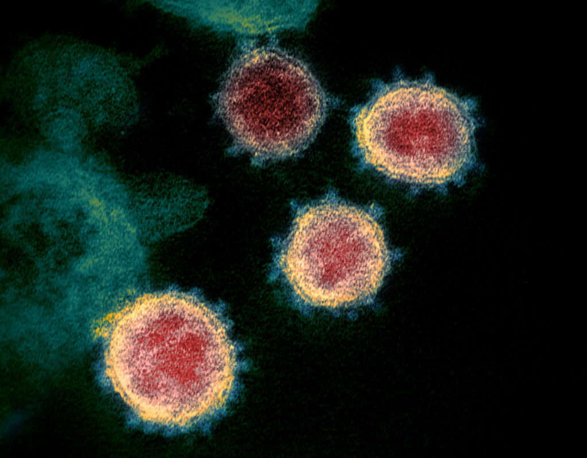
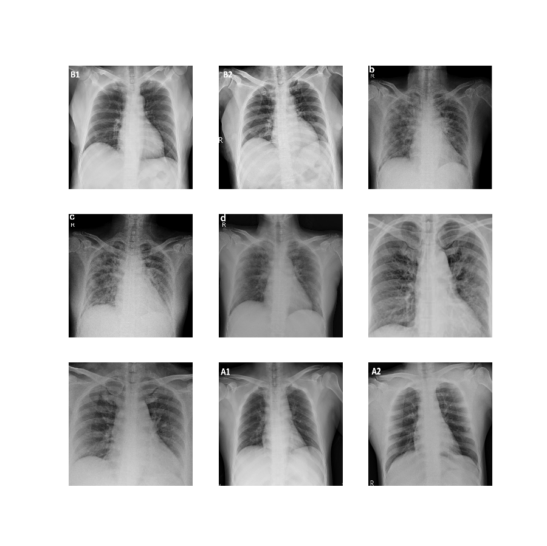

Since March 2020, the world is in crisis: the SARS-CoV-2 coronavirus is sweeping across the world. Many countries are currently in lockdown or have imposed strict social distancing measures. Some even fear that the world as we know it will never return - in the sense that even after vaccins are allowed onto the market, people will continue to show different behavior.

Now, the goal of this article is not to impose any additional fears onto my readers. Instead, I'm hoping to demonstrate that technology can play a very positive role in fighting the disease. We all know that in recent years, Machine Learning - and especially Deep Neural Networks - have made lots of progress. Especially in the area of Computer Vision, models can increasingly support and sometimes even replace humans in narrow domains.

And that is why Machine Learning can also be used to help doctors diagnose COVID-19 disease.

In this article, we'll create a **Convolutional Neural Network** that can help diagnose COVID-19 on **Radiography images**. It is structured as follows. Firstly, we'll take a look at COVID-19 in general (perhaps, this will be increasingly relevant for those who read this article years from now). Subsequently, we'll cover the detection of COVID-19 on Radiography images, and the dataset that we will be using today.

Subsequently, we'll move on to the real work. We first demonstrate that a **vanilla ConvNet** can already be used to generate a classifier. However, as more state-of-the-art results can potentially be achieved with pretraining, we also demonstrate how a neural network can be trained **on top of a ConvNet trained on ImageNet**: that is, a **transfer learning** setting. Finally, we'll evaluate how well the models work.

Let's take a look! 😎

* * *

\[toc\]

* * *

## COVID-19: some context, and how ML can help

[](https://www.machinecurve.com/wp-content/uploads/2020/11/49534865371_7219ecfbcd_k-scaled.jpg)

SARS-CoV-2 pictured by a transmission electron microscope. Credit: [NIAID](https://www.flickr.com/photos/niaid/49534865371/), license: [CC BY 2.0](https://creativecommons.org/licenses/by/2.0), no changes made.

Somewhere between October and December 2019, in China, a virus of type coronavirus likely spilled over from an animal onto humans. A Chinese doctor named Li Wenliang worked at the Wuhan Central Hospital in China and recognized a strange pattern in December - there had been some hospital admissions with symptoms that looked like SARS, the virus that led to an epidemic in 2003 (Hegerty, 2020).

On 30 December, he warned others about the outbreak, and eventually even died because he got ill himself. And he was right: the virus indeed looked like SARS. In fact, it's called **SARS-CoV-2**, and it's very closely related to the original SARS virus. What he didn't know at the time, however, was what an impact the virus would make on the world:

- The Wuhan area in China went into lockdown in the first months of 2020.
- Being insufficient, the virus spread to other parts of Asia in January and February.
- In early March, during Alpine season, the virus was present within Europe and spread extremely fast across European countries.
- Equally easily, the virus was imported into the United States and South America.

By consequence, at the time of writing, we're in a semi-lockdown because of a surge in cases in what is called the _second wave_.

Hospitals are flooding with patients - and we can only keep patient levels at relatively adequate levels by following strict social distancing measures. Doctors and nurses are exhausted, less-than-critical care is postponed, and the health system is cracking. In sum, this is what happened in March - and what can happen again:

https://www.youtube.com/watch?v=Ee7FRSPo76M

Fortunately, new technologies can always help in making life easier. This is especially true for **Artificial Intelligence** and its sub branch **Machine Learning.** In my master's research, for example, I studied how [Convolutional Neural Networks](https://www.machinecurve.com/index.php/2018/12/07/convolutional-neural-networks-and-their-components-for-computer-vision/) can help geophysicists with analyzing Ground Penetrating Radar images. This geophysical technique is used to scan the underground, in order to register cables and pipelines and avoid excavation damages during construction activities. Applying neural networks, in my case for the recognition of material type of an underground object, can make the analyst's job more efficient - they can perform work faster and have a decision-support tool at their disposal.

I started wondering - can't we do the same for COVID-19? Would there be a dataset available with which a Machine Learning model can be created that helps medical staff? Recognizing that medical decisions are _especially_ critical and that technologies should not be applied without care, I still wanted to experiment. Because _if_ Machine Learning can make the life of COVID-19 medical staff easier, the whole system benefits. Therefore, let's find out what's possible.

* * *

## Detecting COVID-19 on Radiography images

On [Kaggle](https://www.kaggle.com/tawsifurrahman/covid19-radiography-database), which is an awesome community for data science minded people, I found the **COVID-19 Radiography Database**:

> A team of researchers from Qatar University, Doha, Qatar and the University of Dhaka, Bangladesh along with their collaborators from Pakistan and Malaysia in collaboration with medical doctors have created a database of chest X-ray images for COVID-19 positive cases along with Normal and Viral Pneumonia images. In our current release, there are 219 COVID-19 positive images, 1341 normal images and 1345 viral pneumonia images. We will continue to update this database as soon as we have new x-ray images for COVID-19 pneumonia patients.
> 
> COVID-19 Radiography Database, n.d.

- The dataset contains images of **COVID-19 pneumonia,** **other viral pneumonia** and **normal chests.**
- For all three [classes](https://www.machinecurve.com/index.php/2020/10/19/3-variants-of-classification-problems-in-machine-learning/), the images were generated by means of radiography.
- The images are quite big - 1024 x 1024 pixels (and can be removed by us).
- There is a class imbalance between especially COVID-19 and the other classes. This is not surprising given the fact that COVID-19 is a relatively new disease, but this should be taken into account when creating the Machine Learning model.

Samples look as follows:



* * *

## Creating a Machine Learning model for detecting COVID-19

Now that we have obtained the necessary context and some insight in today's dataset, we're moving on to the practical part: creating a neural network for [classifying the images](https://www.machinecurve.com/index.php/2020/10/19/3-variants-of-classification-problems-in-machine-learning/).

For this task, we'll be using [TensorFlow](https://www.tensorflow.org/) and [Keras](http://keras.io). If you're no Machine Learning engineer - TensorFlow is one of the state-of-the-art machine learning libraries for training neural networks. Keras, on the other hand, is an abstraction layer on top of TensorFlow, created to make creating TF models easier. In fact, they are so tightly coupled that Keras has actually been embedded into TensorFlow these days.

Creating the model involves a set of steps:

1. **Specifying the model imports.**
2. **Defining configuration options for the model.**
3. **Creating ImageDataGenerators which can flow data from file.**
4. **Preparing the dataset.**
5. **Creating and compiling the [ConvNet](https://www.machinecurve.com/index.php/2018/12/07/convolutional-neural-networks-and-their-components-for-computer-vision/).**
6. **Fitting the data to the network.**
7. **Evaluating the network.**

### Specifying model imports

Let's open up a file or [Notebook](https://www.machinecurve.com/index.php/2020/10/07/easy-install-of-jupyter-notebook-with-tensorflow-and-docker/) where you can write some code. Make sure that you have Python and TensorFlow installed; preferably the newest versions of the language and library.

We can then add our imports.

- We will use `os` to perform file operations.
- We import `tensorflow` for obvious reasons.
- We will use the `EarlyStopping` and `ModelCheckpoint` callbacks to stop training when our [loss](https://www.machinecurve.com/index.php/2019/10/04/about-loss-and-loss-functions/) metrics [stop improving](https://www.machinecurve.com/index.php/2019/05/30/avoid-wasting-resources-with-earlystopping-and-modelcheckpoint-in-keras/), so that we always have the best model at our disposal.
- We import the `Conv2D` and `MaxPooling` layers for [feature extraction](https://www.machinecurve.com/index.php/2018/12/07/convolutional-neural-networks-and-their-components-for-computer-vision/) and [feature map reduction](https://www.machinecurve.com/index.php/2020/01/30/what-are-max-pooling-average-pooling-global-max-pooling-and-global-average-pooling/), respectively.
- Subsequently, further layer imports are `Dense`, `Dropout` and `Flatten` - in order to generate predictions (Flatten/Dense) and avoid overfitting ([Dropout](https://www.machinecurve.com/index.php/2019/12/16/what-is-dropout-reduce-overfitting-in-your-neural-networks/)).
- As we create our model with the Keras Sequential API, we import `Sequential`.
- Finally, we import `ImageDataGenerator`, with which we'll be able to flow data from files instead of storing everything into memory.

```
import os
import tensorflow
from tensorflow.keras.callbacks import EarlyStopping, ModelCheckpoint
from tensorflow.keras.layers import Conv2D, MaxPooling2D
from tensorflow.keras.layers import Dense, Dropout, Flatten
from tensorflow.keras.models import Sequential
from tensorflow.keras.preprocessing.image import ImageDataGenerator
```

### Defining configuration options

Next, it's time to define some options for model configuration.

- Our `target_size_scalar` variable will later be used to specify width and height of the images _after_ they will be resized from 1024 x 1024 pixels.
- Our [batch size](https://www.machinecurve.com/index.php/2019/10/24/gradient-descent-and-its-variants/#minibatch-gradient-descent) is set to 250.
- The number of epochs (i.e. [iterations](https://www.machinecurve.com/index.php/2019/10/04/about-loss-and-loss-functions/#the-high-level-supervised-learning-process)) is set to 1000, but the number of iterations will be lower because we use Early Stopping.
- The number of classes is 3.
- 20% of our data will be used for validation purposes.
- Verbosity, i.e. model output in your terminal, is set to 1, or `True`.
- The `path` and `path_test` determine the paths towards your training/validation and testing data, respectively. We'll get back to this.
- The `input_shape` is common for an image: `(w, h, d)` - with our target size scalar representing width and height.
- The labels speak for themselves.
- The `checkpoint_path` is the path towards the file where [ModelCheckpoint](https://www.machinecurve.com/index.php/2019/05/30/avoid-wasting-resources-with-earlystopping-and-modelcheckpoint-in-keras/) will save our model.

```
# Model configuration
target_size_scalar = 50 # 50 x 50 pixels
batch_size = 250
no_epochs = 1000
no_classes = 3
validation_split = 0.2
verbosity = 1
path = './covid/COVID-19 Radiography Database'
path_test = './covid/COVID-19 Radiography Database Test'
input_shape = (target_size_scalar, target_size_scalar, 3)
labels = ['COVID-19', 'NORMAL', 'Viral Pneumonia']
checkpoint_path=f'{os.path.dirname(os.path.realpath(__file__))}/covid-convnet.h5'
```

### Creating ImageDataGenerators for data import

Next, we create three `ImageDataGenerators` for our training, validation and testing data.

Image data generators can be used for "\[generating\] batches of tensor image data with real-time data augmentation" (Keras Team n.d.). Generators loop over the data in batches and are hence a useful mechanism for feeding data to the training process that starts later.

- We set `rescale` to `1./255`, meaning that each pixel is multiplied with `1/255`, to ensure that it's in the \[latex\]\[0, 1\]\[/latex\] range. This benefits training (omitting this can even make the model untrainable).
- For the training and validation `ImageDataGenerator`, we specify the 20% validation split. Next, we will see how this nicely leads to a training and validation dataset.

```
# Create ImageDataGenerators for training, validation and testing data
training_idg = ImageDataGenerator(
    rescale = 1./255, 
    validation_split = validation_split
)

validation_idg = ImageDataGenerator(
    rescale = 1./255, 
    validation_split = validation_split 
) 

testing_idg = ImageDataGenerator(
    rescale = 1./255
)
```

We often don't want to load all our data into memory just at once. Sometimes, this is even impossible - e.g. when you are training with really big datasets.

In those cases, `flow_from_directory` can be a nice technique. It connects to your `ImageDataGenerator` and essentially flows the batches of images from a directory that is to be specified. Below, we flow data from directory for the training, validation and testing generators.

- We set the `directory` to `path` for the first two generators, specifying the path to our training dataset. The test generator has `path_test` set as the path.
- Our classes had been specified by `labels`, so we configure this here.
- We apply a `seed` of 28 (this can be any integer close to and above 0), for `shuffling`, which is `True` in our case. In other words, we randomly shuffle the dataset when flowing from directory. However, if we do so with a `seed`, we know that our random initializer is generated in the same way. Doing this across the training and validation generator means that we'll have a nice validation dataset. We specify the differences between the two by means of `subset`.
- Our batch sizes and target sizes are also specified accordingly.

```
# Flow from directory for the IDGs
train_generator = training_idg.flow_from_directory(
    directory = path,
    classes = labels,
    seed = 28,
    batch_size = batch_size, 
    shuffle = True,
    target_size=(target_size_scalar, target_size_scalar),
    subset = 'training'
)

val_generator = validation_idg.flow_from_directory(
    directory = path,
    classes = labels,
    seed = 28,
    batch_size = batch_size, 
    shuffle = True,
    target_size=(target_size_scalar, target_size_scalar),
    subset = 'validation'
)

test_generator = testing_idg.flow_from_directory(
    directory = path_test,
    classes = labels,
    batch_size = batch_size, 
    target_size=(target_size_scalar, target_size_scalar)
)
```

### Preparing the dataset

Now that we have specified where the data loads from and how it loads, it's time to prepare the dataset.

The first and most important thing you have to do is [downloading the data](https://www.kaggle.com/tawsifurrahman/covid19-radiography-database). Once ready, unpack the data, and move the `COVID-19 Radiography Database` into a folder called `covid`, which itself is located at the level where your model code is being written.

Then create another folder in `./covid` called `COVID-19 Radiography Database Test`. Also create the sub folders, i.e. `COVID-19`, `NORMAL` and `VIRAL PNEUMONIA`. Now, go to the `COVID-19 Radiography Database` folder. From each sub folder (i.e. each class folder), cut 40 samples and move them to the respective folders in the `COVID-19 Radiography Database Test` folder. Preferably, do so randomly. This way, we're creating a test dataset while leaving training data behind.

In total, your training dataset (including validation data) will therefore be of this quantity:

- **COVID-19 images:** 179
- **Normal images:** 1301
- **Other viral pneumonia images:** 1305

Once again, we stress that this dataset is highly imbalanced between COVID-19 and the other classes. We'll take this into account later, when fitting data to the model.

### Creating and compiling the ConvNet

Our next step is creating the ConvNet.

- We use the `Sequential` API, which allows us to stack layers on top of each other with `model.add`.
- We use one two-dimensional Conv layer that is [ReLU-activated](https://www.machinecurve.com/index.php/2019/09/09/implementing-relu-sigmoid-and-tanh-in-keras/).
- This is followed by a [Max Pooling layer](https://www.machinecurve.com/index.php/2020/01/30/what-are-max-pooling-average-pooling-global-max-pooling-and-global-average-pooling/) to further downsample the feature maps.
- We also apply [Dropout](https://www.machinecurve.com/index.php/2019/12/18/how-to-use-dropout-with-keras/) to help avoid overfitting.
- Then, we flatten the multidimensional data into one-dimensional format with `Flatten`, and apply `Dense` layers to generate the predictions.
- The final layer is [Softmax-activated](https://www.machinecurve.com/index.php/2020/01/08/how-does-the-softmax-activation-function-work/) in order to generate a multiclass probability distribution over the 3 classes (because `no_classes = 3`).

```
# Create the ConvNet
model = Sequential()
model.add(Conv2D(32, kernel_size=(3, 3), activation='relu', input_shape=input_shape))
model.add(MaxPooling2D(pool_size=(2, 2)))
model.add(Dropout(0.5))
model.add(Flatten())
model.add(Dense(256, activation='relu'))
model.add(Dense(no_classes, activation='softmax'))
```

The layer stack above does not represent a full model yet - but rather, a model skeleton. We must compile the model in order to bring it to life.

- Since we are dealing with categorical data, we're using [categorical crossentropy](https://www.machinecurve.com/index.php/2019/10/22/how-to-use-binary-categorical-crossentropy-with-keras/) loss.
- We optimize with the Adam optimizer, one of the [widely used optimizers](https://www.machinecurve.com/index.php/2019/11/03/extensions-to-gradient-descent-from-momentum-to-adabound/) these days.
- For metrics, we specify a wide variety of them - accuracy, of course, but also the more specific ones such as precision, recall, and true/false positives/negatives.

```
# Compile the ConvNet
model.compile(loss=tensorflow.keras.losses.categorical_crossentropy,
              optimizer=tensorflow.keras.optimizers.Adam(),
              metrics=[
                'accuracy',
                tensorflow.keras.metrics.TruePositives(),
                tensorflow.keras.metrics.FalsePositives(),
                tensorflow.keras.metrics.TrueNegatives(),
                tensorflow.keras.metrics.FalseNegatives(),
                tensorflow.keras.metrics.Precision(),
                tensorflow.keras.metrics.Recall()  
              ])
```

### Fitting data to the network

Now that our model has been created and compiled, we can fit data to the model - i.e., start the training process.

#### Balancing the classes

However, we stressed twice that our dataset is highly imbalanced. If we would simply fit the data to the model, this could be problematic, because the imbalance would perhaps favor the two other classes simply for being more present.

That's why we must use **class weights** when fitting the data. With them, we can increase the importance of less-frequent classes, while decreasing the importance of more-frequent ones.

But how to compute the weights?

If you have [Scikit-learn](https://scikit-learn.org/stable/) installed onto your system, you can apply `sklearn.utils.class_weight.compute_class_weight` to compute the class weights relative to each other. I created a relatively naïve (i.e. non-generalizable) Python snippet that computes the weights for precisely the training class imbalance for our COVID-19 classifier.

```
import numpy as np
import sklearn

# Classes
num_one = 179
num_two = 1301
num_three = 1305

# Numpy arrays
arr_one = np.full(num_one, 0)
arr_two = np.full(num_two, 1)
arr_three = np.full(num_three, 2)

# Concat and unique
all_together = np.concatenate((arr_one, arr_two, arr_three)) 
unique = np.unique(all_together)

# Compute and print weights
weights = sklearn.utils.class_weight.compute_class_weight('balanced', unique, all_together)
print(weights)
```

Running it gives the following weights. They make sense: if we multiply 179 with \[latex\]\\approx 5.18\[/latex\] and then divide it by \[latex\]\\approx 0.71\[/latex\], we get \[latex\]\\approx 1301\[/latex\]. The same is true for the others. The weights ensure that the classes are balanced.

```
[5.18621974 0.71355368 0.71136654]
```

In our code, we therefore now add the weights as follows:

```

# Compute weights
class_weights = {0: 5.18621974, 1: 0.71355368, 2: 0.71136654}
```

#### Defining callbacks

Before, we noted that we use [EarlyStopping and ModelCheckpoint](https://www.machinecurve.com/index.php/2019/05/30/avoid-wasting-resources-with-earlystopping-and-modelcheckpoint-in-keras/) for stopping the training process when the loss metrics do no longer improve. Make sure to add the following code to add the callbacks as well.

- With `EarlyStopping`, the training process stops early - i.e. if some `monitor` no longer improves. In our case, that monitor is the validation loss. We want to minimize that loss, so our `mode` is set to `min`. We consider an epoch to be a non-improvement if the loss improvement is `< 0.01`. We are patient for five non-improving epochs/iterations, after which the training process stops.
- With `ModelCheckpoint`, we can save the model after every iteration. However, we ensure that the best is saved only, based on the same `monitor` and `mode`.

```
# Define callbacks
keras_callbacks = [
      EarlyStopping(monitor='val_loss', patience=5, mode='min', min_delta=0.01),
      ModelCheckpoint(checkpoint_path, monitor='val_loss', save_best_only=True, mode='min')
]
```

#### Starting the training process with model.fit

Now, it's time to start the training process.

- We specify the `train_generator` for our training data and the `val_generator` for our validation data. We also add the callbacks, class weights, define the number of epochs to 1.000 (but, remember, it'll stop early), and set verbosity (i.e. output) to `True`.

```
# Fit data to model
model.fit(train_generator,
          epochs=no_epochs,
          verbose=verbosity,
          class_weight=class_weights,
          callbacks=keras_callbacks,
          validation_data=val_generator)
```

### Model evaluation

Finally, we add some code that helps us [evaluate](https://www.machinecurve.com/index.php/2020/11/03/how-to-evaluate-a-keras-model-with-model-evaluate/) the model after it was trained. We test the model with the `test_generator` to find out if it generalizes well. We do so by listing each individual metric that we defined before.

```
# Generalization key value pairs
kvp = {
  0: 'Categorical crossentropy loss',
  1: 'Accuracy',
  2: 'True positives',
  3: 'False positives',
  4: 'True negatives',
  5: 'False negatives',
  6: 'Precision',
  7: 'Recall'
}

# Generate generalization metrics
scores = model.evaluate(test_generator, verbose=1)
print('Test results:')
for index, score in enumerate(scores):
  print(f'-> {kvp[index]}: {score}')
```

### Full model code

Should you wish to obtain the full model code - that is of course also possible :D Here you go.

```
import os
import tensorflow
from tensorflow.keras.callbacks import EarlyStopping, ModelCheckpoint
from tensorflow.keras.layers import Conv2D, MaxPooling2D
from tensorflow.keras.layers import Dense, Dropout, Flatten
from tensorflow.keras.models import Sequential
from tensorflow.keras.preprocessing.image import ImageDataGenerator

# Model configuration
target_size_scalar = 50 # 50 x 50 pixels
batch_size = 250
no_epochs = 1000
no_classes = 3
validation_split = 0.2
verbosity = 1
path = './covid/COVID-19 Radiography Database'
path_test = './covid/COVID-19 Radiography Database Test'
input_shape = (target_size_scalar, target_size_scalar, 3)
labels = ['COVID-19', 'NORMAL', 'Viral Pneumonia']
checkpoint_path=f'{os.path.dirname(os.path.realpath(__file__))}/covid-convnet.h5'

# Create ImageDataGenerators for training, validation and testing data
training_idg = ImageDataGenerator(
    rescale = 1./255, 
    validation_split = validation_split
)

validation_idg = ImageDataGenerator(
    rescale = 1./255, 
    validation_split = validation_split 
) 

testing_idg = ImageDataGenerator(
    rescale = 1./255
)    

# Flow from directory for the IDGs
train_generator = training_idg.flow_from_directory(
    directory = path,
    classes = labels,
    seed = 28,
    batch_size = batch_size, 
    shuffle = True,
    target_size=(target_size_scalar, target_size_scalar),
    subset = 'training'
)

val_generator = validation_idg.flow_from_directory(
    directory = path,
    classes = labels,
    seed = 28,
    batch_size = batch_size, 
    shuffle = True,
    target_size=(target_size_scalar, target_size_scalar),
    subset = 'validation'
)

test_generator = testing_idg.flow_from_directory(
    directory = path_test,
    classes = labels,
    batch_size = batch_size, 
    target_size=(target_size_scalar, target_size_scalar)
)

# Create the ConvNet
model = Sequential()
model.add(Conv2D(32, kernel_size=(3, 3), activation='relu', input_shape=input_shape))
model.add(MaxPooling2D(pool_size=(2, 2)))
model.add(Dropout(0.5))
model.add(Flatten())
model.add(Dense(256, activation='relu'))
model.add(Dense(no_classes, activation='softmax'))

# Compile the ConvNet
model.compile(loss=tensorflow.keras.losses.categorical_crossentropy,
              optimizer=tensorflow.keras.optimizers.Adam(),
              metrics=[
                'accuracy',
                tensorflow.keras.metrics.TruePositives(),
                tensorflow.keras.metrics.FalsePositives(),
                tensorflow.keras.metrics.TrueNegatives(),
                tensorflow.keras.metrics.FalseNegatives(),
                tensorflow.keras.metrics.Precision(),
                tensorflow.keras.metrics.Recall()  
              ])

# Compute weights
class_weights = {0: 5.18621974, 1: 0.71355368, 2: 0.71136654}

# Define callbacks
keras_callbacks = [
      EarlyStopping(monitor='val_loss', patience=5, mode='min', min_delta=0.01),
      ModelCheckpoint(checkpoint_path, monitor='val_loss', save_best_only=True, mode='min')
]

# Fit data to model
model.fit(train_generator,
          epochs=no_epochs,
          verbose=verbosity,
          class_weight=class_weights,
          callbacks=keras_callbacks,
          validation_data=val_generator)

# Generalization key value pairs
kvp = {
  0: 'Categorical crossentropy loss',
  1: 'Accuracy',
  2: 'True positives',
  3: 'False positives',
  4: 'True negatives',
  5: 'False negatives',
  6: 'Precision',
  7: 'Recall'
}

# Generate generalization metrics
scores = model.evaluate(test_generator, verbose=1)
print('Test results:')
for index, score in enumerate(scores):
  print(f'-> {kvp[index]}: {score}')
```

* * *

## How well does it work?

Time to train your model! Run your model with Python or run your Jupyter Notebook - and the training process will start. After a while, it'll end as well, because loss no longer improves. Those were the test results for my training process:

```
Test results:
-> Categorical crossentropy loss: 0.337981641292572
-> Accuracy: 0.8500000238418579
-> True positives: 101.0
-> False positives: 17.0
-> True negatives: 223.0
-> False negatives: 19.0
-> Precision: 0.8559321761131287
-> Recall: 0.8416666388511658
```

On the test dataset, a **85% accuracy** was achieved for the final `model`. This means that in 85% of cases, a predicted class represented the actual class. A precision and recall of approximately 84-86% also suggest good model performance.

And this for a vanilla ConvNet!

### Testing the saved ConvNet

The test above was generated for the final `model`. However, as we built in a bit of `patience` in the `EarlyStopping` callback, the process did not stop when we achieved the exact minimum in terms of [loss value](https://www.machinecurve.com/index.php/2019/10/04/about-loss-and-loss-functions/). In other words, if we could [load the saved model](https://www.machinecurve.com/index.php/2020/02/14/how-to-save-and-load-a-model-with-keras/) and call [evaluate](https://www.machinecurve.com/index.php/2020/11/03/how-to-evaluate-a-keras-model-with-model-evaluate/) on it, we might find even better performance.

I created the following snippet for testing a saved model.

- We import the TensorFlow building blocks that we need.
- We set configuration options for model evaluation.
- We generate a testing `ImageDataGenerator` and configure it to flow data from directory - the Test set directory, to be precise.
- We then [load the model](https://www.machinecurve.com/index.php/2020/02/14/how-to-save-and-load-a-model-with-keras/) and [evaluate it](https://www.machinecurve.com/index.php/2020/11/03/how-to-evaluate-a-keras-model-with-model-evaluate/) with the `ImageDataGenerator`.

```
import os
import tensorflow
from tensorflow.keras.preprocessing.image import ImageDataGenerator
from tensorflow.keras.models import load_model

# Model configuration
target_size_scalar = 50
batch_size = 15
path_test = './covid/COVID-19 Radiography Database Test'
input_shape = (target_size_scalar, target_size_scalar, 3)
labels = ['COVID-19', 'NORMAL', 'Viral Pneumonia']
checkpoint_path=f'{os.path.dirname(os.path.realpath(__file__))}/covid-convnet.h5'


# Generators
testing_idg = ImageDataGenerator(
    rescale = 1./255
)    

test_generator = testing_idg.flow_from_directory(
    directory = path_test,
    classes = labels,
    batch_size = batch_size, 
    target_size=(target_size_scalar, target_size_scalar)
)

# Load
model = load_model(
    checkpoint_path,
    custom_objects=None,
    compile=True
)

# Generalization key value pairs
kvp = {
  0: 'Categorical crossentropy loss',
  1: 'Accuracy',
  2: 'True positives',
  3: 'False positives',
  4: 'True negatives',
  5: 'False negatives',
  6: 'Precision',
  7: 'Recall'
}

# Generate generalization metrics
scores = model.evaluate(test_generator, verbose=1)
print('Test results:')
for index, score in enumerate(scores):
  print(f'-> {kvp[index]}: {score}')
```

The results:

```
Test results:
-> Categorical crossentropy loss: 0.28413824876770377
-> Accuracy: 0.8833333253860474
-> True positives: 106.0
-> False positives: 13.0
-> True negatives: 227.0
-> False negatives: 14.0
-> Precision: 0.8907563090324402
-> Recall: 0.8833333253860474
```

Even better! With a vanilla ConvNet, at the loss minimum found during the training process, we find an 88.3% accuracy and an 88-89% precision-recall. That's awesome! 😎

Now, while performance is already good, we can try and find whether we can boost performance even further, by applying a technique called _pretraining_ or _Transfer Learning_.

* * *

## Can performance be improved with Transfer Learning?

Transfer Learning is an area of Machine Learning "that focuses on storing knowledge gained while solving one problem and applying it to a different but related problem" (Wikipedia, 2006).

> For example, knowledge gained while learning to recognize cars could apply when trying to recognize trucks.
> 
> Wikipedia (2006)

Transfer learning can be really useful if you're a bit stuck training a Machine Learning model for a particular problem, while you have a well-performing one for a closely related problem.

In the case of Computer Vision, where ConvNets are used which learn [increasingly abstract feature representations](https://www.machinecurve.com/index.php/2018/12/07/convolutional-neural-networks-and-their-components-for-computer-vision/), this effectively means that parts of another well-performing ConvNet - i.e. the parts that learn very generic features - can be used to boost the performance of another ConvNet.

In our case, this means that if we can find a **pretrained** ConvNet - as it is called - and connect it to the ConvNet we created before, we might be able to boost performance even further.

### Adding a pretrained InceptionV3 model to our code

The snippet below shows how an `InceptionV3` architecture with weights trained on the `ImageNet` dataset can be used as a base for our COVID-19 classifier.

- First of all, note that we had to use the [Keras Functional API](https://keras.io/guides/functional_api/) instead of the Sequential one - otherwise, we could not glue the models together.
- We load the `InceptionV3` architecture with `ImageNet` weights into `basemodel` - and greatly benefit from the fact that Keras already defines it as a `keras.application`.
- On top of the `.output` of the `basemodel`, we stack a `GlobalAveragePooling2D` layer as well as a `Flatten` layer.
- We then increase the number of `Dense` layers. If we didn't do that, the bottleneck created by the single `Dense` layer would be too extreme and the model wouldn't learn.
- For the rest, the model is pretty similar: we apply `Dropout` and the same set of metrics as before. The two things that have also changed are the `target_size_scalar` (I thought 256 x 256 pixel images would be better for a deep architecture, so that it can learn more features) and `batch_size` - reduced significantly for memory reasons.

```
import os
import tensorflow
from tensorflow.keras.callbacks import EarlyStopping, ModelCheckpoint
from tensorflow.keras.layers import GlobalAveragePooling2D, Input
from tensorflow.keras.layers import Dense, Dropout, Flatten
from tensorflow.keras.models import Model
from tensorflow.keras.preprocessing.image import ImageDataGenerator
from tensorflow.keras.applications import InceptionV3

# Model configuration
target_size_scalar = 256 # 256 x 256 pixels
batch_size = 15
no_epochs = 1000
no_classes = 3
validation_split = 0.2
verbosity = 1
path = './covid/COVID-19 Radiography Database'
path_test = './covid/COVID-19 Radiography Database Test'
input_shape = (target_size_scalar, target_size_scalar, 3)
labels = ['COVID-19', 'NORMAL', 'Viral Pneumonia']
checkpoint_path=f'{os.path.dirname(os.path.realpath(__file__))}/covid-convnet-pretrained.h5'

# Create ImageDataGenerators for training, validation and testing data
training_idg = ImageDataGenerator(
    rescale = 1./255, 
    validation_split = validation_split
)

validation_idg = ImageDataGenerator(
    rescale = 1./255, 
    validation_split = validation_split 
) 

testing_idg = ImageDataGenerator(
    rescale = 1./255
)    

# Flow from directory for the IDGs
train_generator = training_idg.flow_from_directory(
    directory = path,
    classes = labels,
    seed = 28,
    batch_size = batch_size, 
    shuffle = True,
    target_size=(target_size_scalar, target_size_scalar),
    subset = 'training'
)

val_generator = validation_idg.flow_from_directory(
    directory = path,
    classes = labels,
    seed = 28,
    batch_size = batch_size, 
    shuffle = True,
    target_size=(target_size_scalar, target_size_scalar),
    subset = 'validation'
)

test_generator = testing_idg.flow_from_directory(
    directory = path_test,
    classes = labels,
    batch_size = batch_size, 
    target_size=(target_size_scalar, target_size_scalar)
)

# Load the InceptionV3 application
basemodel = InceptionV3(
    include_top = False, 
    weights = 'imagenet', 
    input_tensor = Input(input_shape),
)
basemodel.trainable = True

# Create the ConvNet
headmodel = basemodel.output
headmodel = GlobalAveragePooling2D()(headmodel)
headmodel = Flatten()(headmodel)
headmodel = Dense(200, activation='relu')(headmodel)
headmodel = Dropout(0.5)(headmodel)
headmodel = Dense(100, activation='relu')(headmodel)
headmodel = Dropout(0.5)(headmodel)
headmodel = Dense(50, activation='relu')(headmodel)
headmodel = Dropout(0.5)(headmodel)
headmodel = Dense(no_classes, activation='softmax')(headmodel)
model = Model(inputs = basemodel.input, outputs = headmodel)

# Compile the ConvNet
model.compile(loss=tensorflow.keras.losses.categorical_crossentropy,
              optimizer=tensorflow.keras.optimizers.Adam(),
              metrics=[
                'accuracy',
                tensorflow.keras.metrics.TruePositives(),
                tensorflow.keras.metrics.FalsePositives(),
                tensorflow.keras.metrics.TrueNegatives(),
                tensorflow.keras.metrics.FalseNegatives(),
                tensorflow.keras.metrics.Precision(),
                tensorflow.keras.metrics.Recall()  
              ])

# Compute weights
class_weights = {0: 5.18621974, 1: 0.71355368, 2: 0.71136654}

# Define callbacks
keras_callbacks = [
      EarlyStopping(monitor='val_loss', patience=5, mode='min', min_delta=0.01),
      ModelCheckpoint(checkpoint_path, monitor='val_loss', save_best_only=True, mode='min')
]

# Fit data to model
model.fit(train_generator,
          epochs=no_epochs,
          verbose=verbosity,
          class_weight=class_weights,
          callbacks=keras_callbacks,
          validation_data=val_generator)

# Generalization key value pairs
kvp = {
  0: 'Categorical crossentropy loss',
  1: 'Accuracy',
  2: 'True positives',
  3: 'False positives',
  4: 'True negatives',
  5: 'False negatives',
  6: 'Precision',
  7: 'Recall'
}

# Generate generalization metrics
scores = model.evaluate(test_generator, verbose=1)
print('Test results:')
for index, score in enumerate(scores):
  print(f'-> {kvp[index]}: {score}')
```

A few changes to the testing snippet are necessary to run the test with the pretrained ConvNet:

```

target_size_scalar = 256
batch_size = 15
...
checkpoint_path=f'{os.path.dirname(os.path.realpath(__file__))}/covid-convnet-pretrained.h5'
```

Results:

```
Test results:
-> Categorical crossentropy loss: 0.22990821907296777
-> Accuracy: 0.925000011920929
-> True positives: 110.0
-> False positives: 8.0
-> True negatives: 232.0
-> False negatives: 10.0
-> Precision: 0.9322034120559692
-> Recall: 0.9166666865348816
```

Our pretrained ConvNet boosts acuracy, precision and recall even further! 😎

* * *

## Summary

COVID-19 is currently sweeping our world. The pandemic, that spilled over from an animal to a human approximately one year ago, is currently having a significant impact on the world and global economies. Even worse, medical systems are cracking under the intense load of COVID patients currently in hospitals throughout the world.

In this article, we looked at how Machine Learning can benefit medical professionals in the COVID-19 area. Recognizing that real medical usage would require a lot of additional testing and such, today, we created a Convolutional Neural Network that can classify COVID-19 on Radiography images, distinguishing the images from normal ones and images with other viral pneumonias. In fact, by applying pretraining, we could achieve accuracies of 92.5%. Really awesome.

Improvements remain possible, of course. For example, medical science suggests that CT scans can be an even better data source for recognizing COVID. What's more, we could potentially _combine_ the two data sources in some kind of an ensemble model. And perhaps we can also add other medical data - blood data to give an example - with e.g. the levels of immunoglobin or typical COVID-related cytokines, to even tell what the disease timeline for an individual is.

However, that would be too much for one article! :)

Altogether, I hope that this article was useful for both inspiration and Machine Learning education - I did learn a lot from writing it. If you have any comments, questions or other remarks, please feel free to leave a comment in the comments section below 💬 Otherwise, thank you for reading MachineCurve today, stay healthy 😷 and happy engineering! 😎

* * *

## References

Wikipedia. (2020, February 5). _Coronavirus disease 2019_. Wikipedia, the free encyclopedia. Retrieved November 4, 2020, from [https://en.wikipedia.org/wiki/Coronavirus\_disease\_2019](https://en.wikipedia.org/wiki/Coronavirus_disease_2019)

M.E.H. Chowdhury, T. Rahman, A. Khandakar, R. Mazhar, M.A. Kadir, Z.B. Mahbub, K.R. Islam, M.S. Khan, A. Iqbal, N. Al-Emadi, M.B.I. Reaz, M. T. Islam, [“Can AI help in screening Viral and COVID-19 pneumonia?”](https://arxiv.org/ftp/arxiv/papers/2003/2003.13145.pdf) IEEE Access, Vol. 8, 2020, pp. 132665 - 132676.

Wikipedia. (2020, January 5). _COVID-19 pandemic_. Wikipedia, the free encyclopedia. Retrieved November 4, 2020, from [https://en.wikipedia.org/wiki/COVID-19\_pandemic#Background](https://en.wikipedia.org/wiki/COVID-19_pandemic#Background)

Hegarty, S. (2020, February 6). _The Chinese doctor who tried to warn others about coronavirus_. BBC News. [https://www.bbc.com/news/world-asia-china-51364382](https://www.bbc.com/news/world-asia-china-51364382)

_COVID-19 radiography database_. (n.d.). Kaggle: Your Machine Learning and Data Science Community. [https://www.kaggle.com/tawsifurrahman/covid19-radiography-database](https://www.kaggle.com/tawsifurrahman/covid19-radiography-database)

Keras Team. (n.d.). _Keras documentation: Image data preprocessing_. Keras: the Python deep learning API. [https://keras.io/api/preprocessing/image/#imagedatagenerator-class](https://keras.io/api/preprocessing/image/#imagedatagenerator-class)

Wikipedia. (2006, February 1). _Transfer learning_. Wikipedia, the free encyclopedia. Retrieved November 5, 2020, from [https://en.wikipedia.org/wiki/Transfer\_learning](https://en.wikipedia.org/wiki/Transfer_learning)
