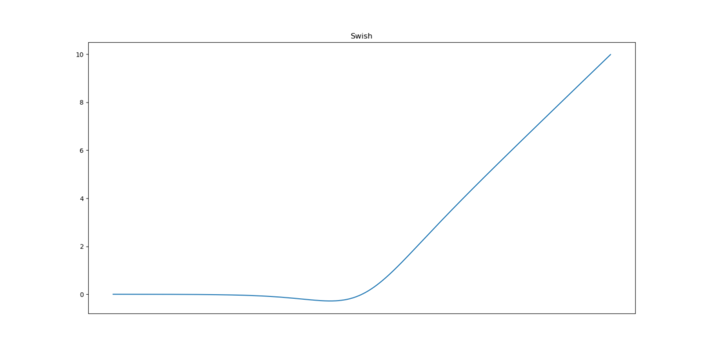
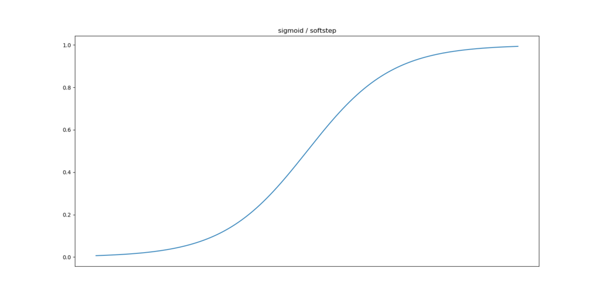
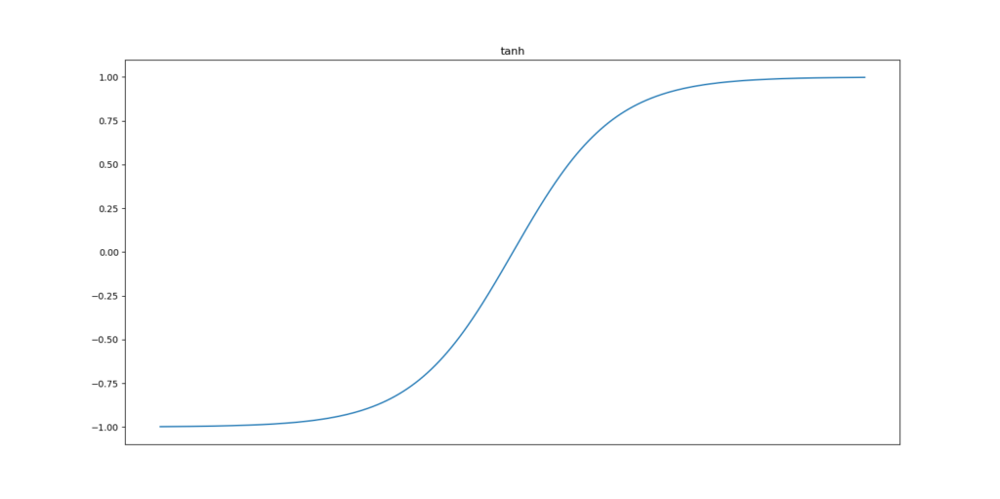
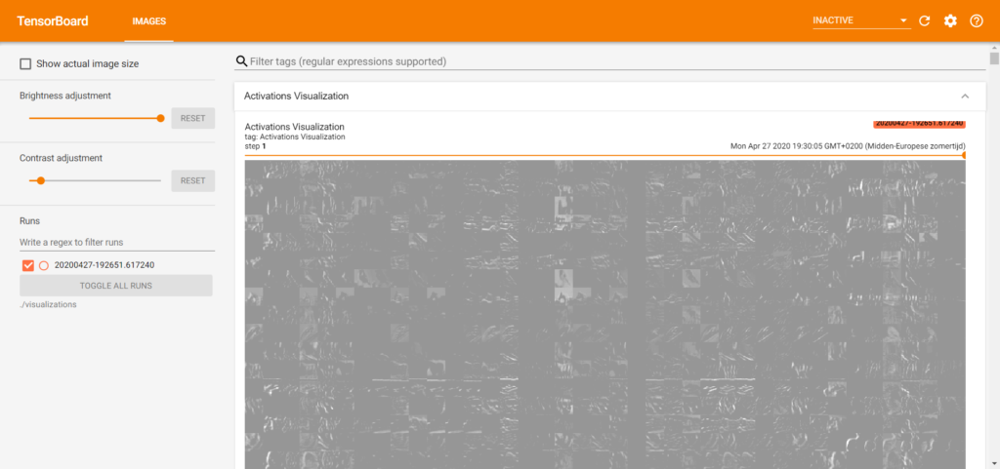
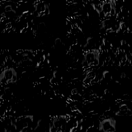
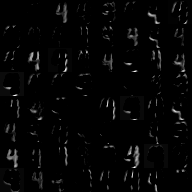

Deep learning models and especially neural networks have been used thoroughly over the past few years. There are many success cases in the press about the application of those models. One of the primary categories in which those are applied is the field of computer vision, mainly thanks to the 2012 revolution in [Convolutional Neural Networks](https://www.machinecurve.com/index.php/2018/12/07/convolutional-neural-networks-and-their-components-for-computer-vision/).

However, until recently, it was very difficult to understand how a neural network arrived at its outcome - i.e., its prediction.

Society however doesn't work that way. In order to facilitate adoption of AI into business processes, results must be explainable. For example, if access to a building is denied based on a computer vision model, the law might require that this happens based on a valid reason. If there's no such reason, it would be illegal to keep that person out. Now, this is just an example, but it demonstrates the necessity for explaining AI models, and by consequence machine learning models.

Tf-explain is a framework for enhancing interpretability and explainability of AI models created with TensorFlow 2.x based Keras. It offers a wide range of techniques for visualizing the outcomes and decision criteria of neural networks; then, primarily Convolutional Neural Networks.

In this blog post, we'll look at one such technique: Activation Visualization. It does what the name suggests - for a layer in a ConvNet, it visualizes how an input is processed through that layer and what each subsequent feature map looks like.

It is structured as follows. Firstly, we'll look at the conceptual nature of an activation - by taking a look at a layer of a ConvNet and how input is processed there, including why activation functions are necessary. Subsequently, we'll introduce `tf-explain` and provide a bit of background information. Following this, we'll implement a [Keras ConvNet](https://www.machinecurve.com/index.php/2020/03/30/how-to-use-conv2d-with-keras/) based on TensorFlow 2.x and perform Activation Visualization with `tf-explain` to show you how it works.

All code for doing so is included with the relevant steps and is broken down into small parts so that it will be very understandable. I hope this post will be useful for those who wish to use AI explainability techniques with Keras themselves. Let's go! :)

* * *

\[toc\]

\[affiliatebox\]

* * *

## What are activations?

In this tutorial, we'll primarily focus on Convolutional Neural Networks, also called CNNs or ConvNets. Those networks are the primary drivers of the deep learning revolution in computer vision.

Now, what is a ConvNet?

While we already have a [very detailed post on the matter](https://www.machinecurve.com/index.php/2018/12/07/convolutional-neural-networks-and-their-components-for-computer-vision/), let's repeat what is written there, here - but then briefly.

First of all, a Convolutional Neural Network is no special type of neural network - as with any, it's a set of trainable parameters which is trained through the [supervised machine learning process](https://www.machinecurve.com/index.php/2019/10/04/about-loss-and-loss-functions/#the-high-level-supervised-learning-process) with its feedforward operation and subsequent gradient based optimization.

Except for the fact that within Convolutional Neural Networks, parameters are structured a bit differently than in a regular fully connected network.

### ConvNets at a high level

Let's take a look at a ConvNet schematically:


Source: [gwding/draw\_convnet](https://github.com/gwding/draw_convnet)

On the left, you see the `Inputs` layer, which accepts a 32 x 32 pixel image with 3 image channels - i.e. an RGB image.

As you can see, in a loup-like structure, the inputs are reduced in size. This happens by means of the _convolution_ operation - which is a kernel of some by some pixels (5x5 in the `Inputs` layer) that slides over the entire input - horizontally and vertically. Doing so, it multiplies all the kernel images (the _learnt weights_) with the _input it covers_ in element-wise multiplications. The output represents the "loupe result" in the downstream layer. All outputs for an image combined is called a _feature map_, and often, as we can see here too, there are many kernels in a layer - resulting in many feature maps.

Learning is ascribed to the kernels, which have trainable weights that can be adapted to respond to inputs. This happens in the [optimization part of the machine learning process](https://www.machinecurve.com/index.php/2019/10/04/about-loss-and-loss-functions/#backwards-pass). It closes the cycle between inputs, outputs and subsequent model improvement - it's really that simple conceptually ;-)

As you can understand, the feature maps at the most downstream convolutional layer (possibly followed by [pooling layers](https://www.machinecurve.com/index.php/2020/01/30/what-are-max-pooling-average-pooling-global-max-pooling-and-global-average-pooling/)) are a very abstract representation of the original input image. This is beneficial in two ways:

1. Different images of the same object (such as two different cats) will quite resemble each other when they have been "louped" into very abstract format.
2. The abstract representations are common representations of a particular class (such as "cat") and are thus useful for actual classification.

That's why we say that convolutional layers are _feature extractors_, whereas the actual classification happens in the subsequent fully-connected layers - as we are used to with any neural network.

That's why ConvNets are slightly different, but conceptually similar to _traditional_ neural networks.

### Linearity of element-wise multiplications and activation functions

In a traditional neural network, the operation performed for some input vector \[latex\]\\textbf{x}\[/latex\] is \[latex\]output(\\textbf{x}) = \\textbf{w} \\times \\textbf{x}\[/latex\]. Here, vector \[latex\]\\textbf{x}\[/latex\] is the input vector (e.g. \[latex\]\[1.23, 3.77, -2.19\]\[/latex\] for a three-dimensional input vector) and \[latex\]\\textbf{w}\[/latex\] is the trainable weights vector of the same dimensionality.

This multiplication is done on an element-wise basis, i.e. \[latex\]1.23 \\times \\mathbf{w\_1}\[/latex\], and so on. For ConvNets, things work a bit differently, but the point remains standing - **this operation is linear**.

That's quite a problem, to say the least, for it doesn't matter how big your neural network is - if the chain of processing throughout all layers is linear, _[you can only handle linear data](https://www.machinecurve.com/index.php/2019/06/11/why-you-shouldnt-use-a-linear-activation-function/)_.

And pretty much all of today's data is nonlinear.

The solution is simple and elegant: you can place an [activation function](https://www.machinecurve.com/index.php/2020/01/24/overview-of-activation-functions-for-neural-networks/) directly behind the output of the layer. This function, which is pretty much always nonlinear (such as \[latex\]sin(x)\[/latex\]), converts the linear output into something nonlinear and subsequently ensures that it is passed to the next layer for processing. This way, it is ensured that all processing is nonlinear - and suddenly it becomes possible to handle nonlinear datasets. The output of this function is what we will call the **activation**, hence the name activation function. Today, we'll be visualizing the activations of ConvNet layers.

Today's most common activation function is the [Rectified Linear Unit (ReLU)](https://www.machinecurve.com/index.php/2019/09/04/relu-sigmoid-and-tanh-todays-most-used-activation-functions/). Other ones used still are [Tanh and Sigmoid](https://www.machinecurve.com/index.php/2019/09/04/relu-sigmoid-and-tanh-todays-most-used-activation-functions/), while there are also newer ones, such as [Leaky ReLU, PReLU, and Swish](https://www.machinecurve.com/index.php/2020/01/24/overview-of-activation-functions-for-neural-networks/). They all try to improve on top of each other. However, in most cases, ReLU suffices.

- [](https://www.machinecurve.com/wp-content/uploads/2019/05/swish.png)
    
- [](https://www.machinecurve.com/wp-content/uploads/2019/05/sigmoid.png)
    
- [](https://www.machinecurve.com/wp-content/uploads/2019/05/tanh.png)
    
- [](https://www.machinecurve.com/wp-content/uploads/2019/05/relu.png)
    

Common activation functions

* * *

## Introducing tf-explain

Let's now move towards the core of this post: the `tf-explain` framework 😎 Created by [Sicara](https://www.sicara.com/), it is a [collection](https://github.com/sicara/tf-explain) of "Interpretability Methods for tf.keras models with Tensorflow 2.0" (Tf-explain, n.d.).

Great! A collection of techniques that are usable with the modern implementation of Keras, which has migrated into the TensorFlow framework as of version 2.0.

What's more, `tf-explain` has implemented a wide range of techniques that have been proposed by scientists in a range of academic papers (Tf-explain, n.d.). As of April 2020, these include, but may no longer be limited to:

1. Activations Visualization
2. Vanilla Gradients
3. Gradients\*Inputs
4. Occlusion Sensitivity
5. Grad CAM (Class Activation Maps)
6. SmoothGrad
7. Integrated Gradients

...and others are on their development roadmap:

1. GradCAM++
2. Guided SmoothGrad
3. LRP

Sounds really cool - and installation is simple: `pip install tf-explain`. That's it - and it's usable for both the TensorFlow CPU and GPU based models :)

\[affiliatebox\]

* * *

## Visualizing ConvNet activations with tf-explain and Keras

Now that we understand what `tf-explain` is and what it does, we can actually do some work. Today, we will visualize the ConvNet activations with `tf-explain` for a simple ConvNet [created with Keras](https://www.machinecurve.com/index.php/2020/03/30/how-to-use-conv2d-with-keras/).

Recall: in a ConvNet, activations are the outputs of layers, and our technique will allow us to see the feature maps that are generated by a Keras model.

### Today's model

As the point of this blog post is to illustrate how `tf-explain` can be used for visualizing activations, I will not focus on creating the neural network itself. Instead, we have another blog post for that - being ["How to use Conv2D with Keras?"](https://www.machinecurve.com/index.php/2020/03/30/how-to-use-conv2d-with-keras/). Click the link to find a detailed, step-by-step explanation about the model that we will use in this blog post.

In short, our ConvNet will be able to classify the [CIFAR10 dataset](https://www.machinecurve.com/index.php/2019/12/31/exploring-the-keras-datasets/#cifar-10-small-image-classification):

[](https://www.machinecurve.com/wp-content/uploads/2019/06/cifar10_visualized.png)

As you can see, it is an image clasification dataset with 32x32 pixel RGB images of everyday objects. The images are distributed across 10 classes.

Here's the full model code from the ["How to use Conv2D with Keras?"](https://www.machinecurve.com/index.php/2020/03/30/how-to-use-conv2d-with-keras/) post:

```
from tensorflow.keras.datasets import cifar10
from tensorflow.keras.models import Sequential
from tensorflow.keras.layers import Dense, Flatten, Conv2D
from tensorflow.keras.losses import sparse_categorical_crossentropy
from tensorflow.keras.optimizers import Adam

# Model configuration
batch_size = 50
img_width, img_height, img_num_channels = 32, 32, 3
loss_function = sparse_categorical_crossentropy
no_classes = 10
no_epochs = 100
optimizer = Adam()
validation_split = 0.2
verbosity = 1

# Load CIFAR-10 data
(input_train, target_train), (input_test, target_test) = cifar10.load_data()

# Determine shape of the data
input_shape = (img_width, img_height, img_num_channels)

# Parse numbers as floats
input_train = input_train.astype('float32')
input_test = input_test.astype('float32')

# Scale data
input_train = input_train / 255
input_test = input_test / 255

# Create the model
model = Sequential()
model.add(Conv2D(32, kernel_size=(3, 3), activation='relu', input_shape=input_shape))
model.add(Conv2D(64, kernel_size=(3, 3), activation='relu'))
model.add(Conv2D(128, kernel_size=(3, 3), activation='relu'))
model.add(Flatten())
model.add(Dense(128, activation='relu'))
model.add(Dense(no_classes, activation='softmax'))

# Compile the model
model.compile(loss=loss_function,
              optimizer=optimizer,
              metrics=['accuracy'])

# Fit data to model
history = model.fit(input_train, target_train,
            batch_size=batch_size,
            epochs=no_epochs,
            verbose=verbosity,
            validation_split=validation_split)

# Generate generalization metrics
score = model.evaluate(input_test, target_test, verbose=0)
print(f'Test loss: {score[0]} / Test accuracy: {score[1]}')
```

Now, there are two paths forward with respect to generating the Activation Visualizations with `tf-explain`:

1. **Visualizing the activations during the training process.** This allows you to determine how your model's trainable parameters evolve during training, and whether you might have an intuitively better intermediate result that you better use as your final model. What's even better is that you can use [TensorBoard](https://www.machinecurve.com/index.php/2019/11/13/how-to-use-tensorboard-with-keras/) to track your visualizations _during_ training.
2. **Visualizing the activations after training.** This helps you determine whether your final model works well.

Of course, we'll cover both variants next.

### Visualizing the activations during training

The first thing to do when we want to visualize the activations during the training process is installing `tf-explain`, if you didn't already do so. It's really easy: `pip install tf-explain`. Make sure to do so in the environment where your `tensorflow` and other dependencies are also installed.

#### Adding tf-explain to your imports

The first thing we have to do is adding the `ActivationsVisualizationCallback` to the imports we already have:

```
from tf_explain.callbacks.activations_visualization import ActivationsVisualizationCallback
```

...so that they become:

```
from tensorflow.keras.datasets import cifar10
from tensorflow.keras.models import Sequential
from tensorflow.keras.layers import Dense, Flatten, Conv2D
from tensorflow.keras.losses import sparse_categorical_crossentropy
from tensorflow.keras.optimizers import Adam
from tf_explain.callbacks.activations_visualization import ActivationsVisualizationCallback
```

#### Creating a Keras callback: the ActivationsVisualizationCallback

As you could have guessed by now, using `tf-explain` during training works by means of _callbacks_. Those are pieces of functionality supported by Keras that run _while_ training, and can e.g. be used to [stop the training process and save data on the fly](https://www.machinecurve.com/index.php/2019/05/30/avoid-wasting-resources-with-earlystopping-and-modelcheckpoint-in-keras/).

So, in order to make this work, define a new callback just below the `model.compile` step:

```
# Define the Activation Visualization callback
output_dir = './visualizations'
callbacks = [
    ActivationsVisualizationCallback(
        validation_data=(input_test, target_test),
        layers_name=['visualization_layer'],
        output_dir=output_dir,
    ),
]
```

Firstly, we specify the `output_dir`, and set it to `./visualizations`. This means that a new folder called _visualizations_ will be created in the current folder, and the callback will dump the files for generating the visualization there.

Then, the `callbacks` array. All Keras callbacks must be provided to the model jointly, that is, together. Hence, we usually put them in an array. Today, the only callback is the `ActivationsVisualizationCallback`, so it might be a bit redundant - but the array is still necessary.

In the callback, we specify a few things:

- **Validation data:** which, in our case, is our testing data.
- **Layers name:** the names of the layers that we want to visualize.
- The **output directory**.

Now, wait a second! Layers name? What is this?

Well, in Keras, every layer gets assigned a name. Take a look at the [model summaries we can generate](https://www.machinecurve.com/index.php/2020/04/01/how-to-generate-a-summary-of-your-keras-model/), to give just one example. You'll see names like `conv2d_1` - but you can also provide your own. Let's do this, and replace the second `model.add` with:

```
model.add(Conv2D(64, kernel_size=(3, 3), activation='relu', name='visualization_layer'))
```

Now, `tf-explain` will understand what layer must be visualized.

#### Fit data to your model with the callback appended

Now that we have prepared our callback, it's time to use it. This is really as simple as adding the callbacks to the training process, i.e., to `model.fit`:

```
# Fit data to model
history = model.fit(input_train, target_train,
            batch_size=batch_size,
            epochs=no_epochs,
            verbose=verbosity,
            validation_split=validation_split,
            callbacks=callbacks)
```

I.e.: `callbacks=callbacks`.

**Pro tip:** for the time being, also make sure to set your `no_epochs` in the configuration to 2, especially if you just want to test. As we shall see, the visualization will become pretty big since we have to visualize 64 kernels across 2 epochs.

Time to run the model! Save your code as `activation-visualization-training.py` (or some other Python file), open up a terminal / environment where the dependencies are installed (being Tensorflow 2.x and `tf-explain`), and run the model:

```
python activation-visualization-training.py
```

The training process will start:

```
Relying on driver to perform ptx compilation. This message will be only logged once.
40000/40000 [==============================] - 106s 3ms/sample - loss: 1.5383 - accuracy: 0.4464 - val_loss: 1.2711 - val_accuracy: 0.5510
Epoch 2/2
40000/40000 [======================>
```

Contrary to what you are used to, time between epochs will be a little bit longer - as the results will have to be written to disk. Don't let this discourage you, though :)

#### Full model code

Now, for those who wish to obtain the full model code at once - for example, to start playing with the code straight away - here you go :)

```
from tensorflow.keras.datasets import cifar10
from tensorflow.keras.models import Sequential
from tensorflow.keras.layers import Dense, Flatten, Conv2D
from tensorflow.keras.losses import sparse_categorical_crossentropy
from tensorflow.keras.optimizers import Adam
from tf_explain.callbacks.activations_visualization import ActivationsVisualizationCallback

# Model configuration
batch_size = 50
img_width, img_height, img_num_channels = 32, 32, 3
loss_function = sparse_categorical_crossentropy
no_classes = 10
no_epochs = 2
optimizer = Adam()
validation_split = 0.2
verbosity = 1

# Load CIFAR-10 data
(input_train, target_train), (input_test, target_test) = cifar10.load_data()

# Determine shape of the data
input_shape = (img_width, img_height, img_num_channels)

# Parse numbers as floats
input_train = input_train.astype('float32')
input_test = input_test.astype('float32')

# Scale data
input_train = input_train / 255
input_test = input_test / 255

# Create the model
model = Sequential()
model.add(Conv2D(32, kernel_size=(3, 3), activation='relu', input_shape=input_shape))
model.add(Conv2D(64, kernel_size=(3, 3), activation='relu', name='visualization_layer'))
model.add(Conv2D(128, kernel_size=(3, 3), activation='relu'))
model.add(Flatten())
model.add(Dense(128, activation='relu'))
model.add(Dense(no_classes, activation='softmax'))

# Compile the model
model.compile(loss=loss_function,
              optimizer=optimizer,
              metrics=['accuracy'])

# Define the Activation Visualization callback
output_dir = './visualizations'
callbacks = [
    ActivationsVisualizationCallback(
        validation_data=(input_test, target_test),
        layers_name=['visualization_layer'],
        output_dir=output_dir,
    ),
]

# Fit data to model
history = model.fit(input_train, target_train,
            batch_size=batch_size,
            epochs=no_epochs,
            verbose=verbosity,
            validation_split=validation_split,
            callbacks=callbacks)

# Generate generalization metrics
score = model.evaluate(input_test, target_test, verbose=0)
print(f'Test loss: {score[0]} / Test accuracy: {score[1]}')
```

#### Results

When the training process has finished, you should see a file in your `./visualizations.py` folder that is named like `events.out.tfevents.1588008411.DESKTOP-PJKJ0UE.13452.235.v2`.

It could be located in some folder with another timestamp based name.

This could be odd, but it isn't. Recall from the introduction that _visualizations during training_ are generated in TFEvents format, and can be visualized using [TensorBoard](https://www.machinecurve.com/index.php/2019/11/13/how-to-use-tensorboard-with-keras/).

So let's do that. Open up your terminal again (possibly the same one as you trained your model in), `cd` to the folder where your `.py` file is located, and start TensorBoard:

```
tensorboard --logdir=./visualizations
```

By default, TensorBoard will load on `localhost` at port `6006`:

```
Serving TensorBoard on localhost; to expose to the network, use a proxy or pass --bind_all
TensorBoard 2.1.0 at http://localhost:6006/ (Press CTRL+C to quit)
```

Opening up that web page in your browser will pretty much directly show you the Activation Visualizations generated during training. What's more, on the left, it's also possible to adapt brightness and contrast:



My visualizations are still pretty weird. That's likely due to the fact that I've quit the training process after the second epoch, at a time where the model is still not adequate enough (`validation_accuracy = 0.63...`). However, as the file got quite quickly (~ 126MB already) and the purpose of this number of epochs was to demonstrate that it works, I left it at it :)

All right! Visualizing the activations during training: ✅. Let's proceed with visualizing activations after training 🚀

\[affiliatebox\]

### Visualizing the activations after training

In the case where you want to interpret how your model works after it has finished training, you might wish to use `tf-explain` and `ActivationsVisualization` _after_ the training process has finished.

We'll cover this scenario next.

#### Adding tf-explain to your imports

Of course, the first thing that must be done is adding `tf-explain` to the imports. A bit counterintuitively, the Activation Visualizer is called differently here: `ExtractActivations`. What's more, and this makes sense, it's located in the `.core` sub area of the Python source code, and not in `.callbacks`.

That's why this must be added to the imports:

```
from tf_explain.core.activations import ExtractActivations
```

So that they become:

```
from tensorflow.keras.datasets import cifar10
from tensorflow.keras.models import Sequential
from tensorflow.keras.layers import Dense, Flatten, Conv2D
from tensorflow.keras.losses import sparse_categorical_crossentropy
from tensorflow.keras.optimizers import Adam
from tf_explain.core.activations import ExtractActivations
```

#### Instantiate the ExtractActivations explainer

Now that we have imported the `tf-explain` functionality that we need, we can instantiate the explainer directly below `model.fit`:

```
# Define the Activation Visualization explainer
index = 250
image = input_test[index].reshape((1, 32, 32, 3))
label = target_test[index]
data = ([image], [label])
explainer = ExtractActivations()
grid = explainer.explain(data, model, layers_name='visualization_layer')
explainer.save(grid, '.', 'act.png')
```

Lets take a look at this code line by line:

- At the first line, we set `index` to 250. That means, sample 250. It can be set to any number, as long as it's a valid index in the dataset you're using.
- At the second line, we define the `image` based on the `index`. We also have to reshape it from `(32, 32, 3) -> (1, 32, 32, 3)`, because `tf-explain` throws an error otherwise.
- At the third line we define the `label` based on the `index`.
- We merge them together into a `data` tuple of samples at the fourth line. Do note that you could add multiple samples here: for example, a `second_image` (resulting in `[image, second_image]`), and the same for the labels. The labels seem not to be required.
- Subsequently, we instantiate the `explainer` next.
- Then, we instruct it to `explain` the `data` based on the `model` we trained, for the `layers_name` we defined.
- Then, we `save` the end result into `act.png`.

As with the _during training explanation_, we must specify the layer name here as well - so replace the second `model.add` in your code with:

```
model.add(Conv2D(64, kernel_size=(3, 3), activation='relu', name='visualization_layer'))
```

#### Results

Time to run it! 😎 Open up your terminal, `cd` to the folder where your Python file is located, and run it - e.g. `python activation-visualization-trained.py`:

```
Relying on driver to perform ptx compilation. This message will be only logged once.
40000/40000 [==============================] - 24s 596us/sample - loss: 1.4864 - accuracy: 0.4670 - val_loss: 1.1722 - val_accuracy: 0.5926
Epoch 2/10
40000/40000 [=================>
```

Great, we have a running training process :) Once it finishes, your activation visualization should be visible in the `act.png` file. In my case, it's a bit black-ish. What does it look like with your dataset? I'd love to know!



For the [MNIST dataset](https://www.machinecurve.com/index.php/2019/12/31/exploring-the-keras-datasets/#mnist-database-of-handwritten-digits), and a specific sample of number 4, it looks like this:



That's more promising :)

* * *

\[affiliatebox\]

## Summary

In this blog post, we looked at Activation Visualization for neural network interpretability with `tf-explain` and Keras. Firstly, we looked at Convolutional Neural Networks and their activations in general. Subsequently, we introduced `tf-explain`.

This was followed by a step-by-step explanation of the framework for visualizing data _during_ training with TensorBoard, and _after_ training with manual action. All code is included in the post.

I hope you've learnt something today! If you have any questions, remarks or other comments, please feel free to leave a comment in the comments section below 💬 Thank you for reading MachineCurve today and happy engineering 😎

\[kerasbox\]

* * *

## References

Tf-explain. (n.d.). _tf-explain documentation_. tf-explain — tf-explain documentation. [https://tf-explain.readthedocs.io/en/latest/](https://tf-explain.readthedocs.io/en/latest/)
