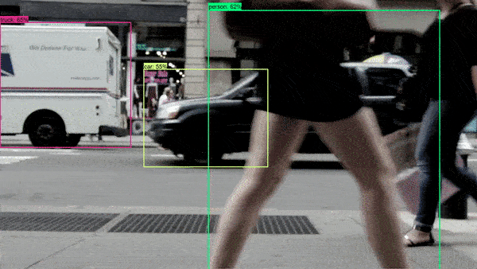
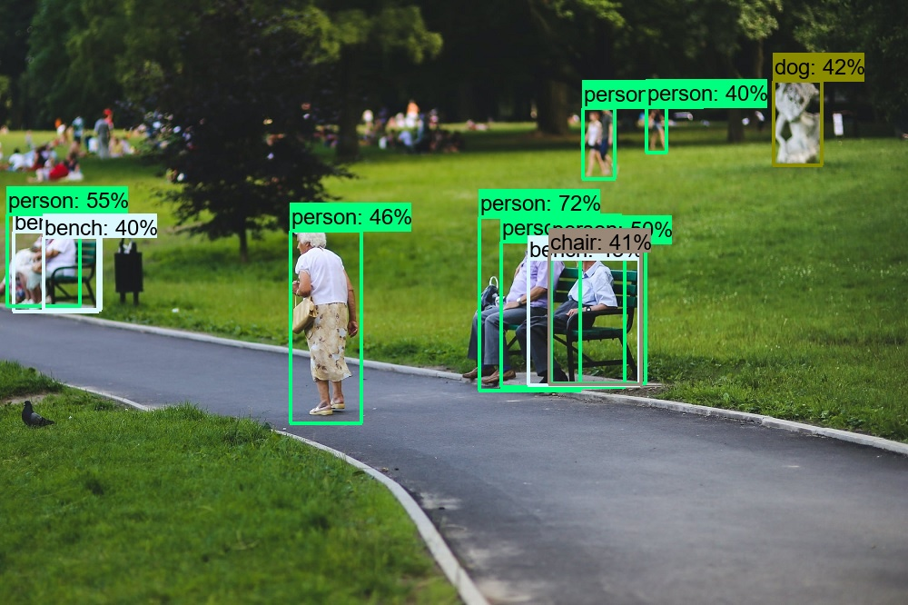
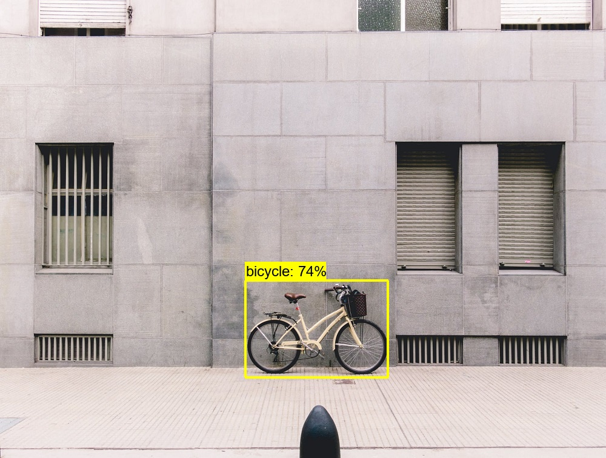
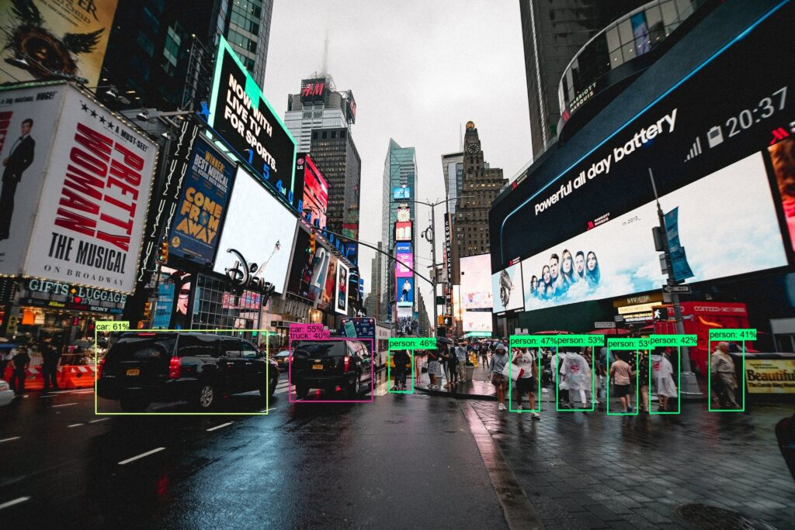

Object detection is one of the areas in Deep Learning where much progress has been made. Using a variety of models, we can detect objects in photos and - by consequence - also in videos. Even real-time object detection using webcam images is a common thing these days!

In this tutorial, we will build an **object detection system with TensorFlow**. Specifically, we will be using the TensorFlow Object Detection API. In a step-by-step fashion, you will install all the necessary dependencies, take a look at pretrained models in the TensorFlow Model Zoo, and build the object detector.

In other words, after reading this tutorial, you will...

- Understand what you need to install for building a TensorFlow based object detector.
- Know where to find pretrained models and download them to your system.
- Have built an actual object detector system that can be used with photos and videos.

And because images always say more than 1.000 words, you will create a system that can do this:



Let's take a look! 🔥

* * *

\[toc\]

* * *

## Code example: fully functional Object Detection with TensorFlow 2.x

With this fully functional **example of object detection with TensorFlow**, you can get started quickly. If you want to understand everything in more detail, make sure to read the rest of this tutorial below. We're going to walk through every step, so that you'll understand exactly how to build such a system yourself. Good luck!

**⚠ Pay attention to the following things when running this example straight away:**

1. Make sure that you have installed TensorFlow, OpenCV and the TensorFlow Object Detection API. I built this with [TensorFlow 2.4.0](https://www.machinecurve.com/index.php/2020/11/05/saying-hello-to-tensorflow-2-4-0/).
2. Download the pretrained model that you want to use for object detection.
3. Ensure that you correctly configure the path to the Object Detection API, the model checkpoint and the labels. Also make sure to set the model name correctly.
4. Optionally, comment out the `os.environ(...)` call if you want to run the code on your GPU. Of course, this only works if your TensorFlow is GPU-enabled.

```
# Specify model imports
from object_detection.builders import model_builder
from object_detection.utils import config_util
from object_detection.utils import label_map_util
from object_detection.utils import visualization_utils as viz_utils
import cv2
import numpy as np
import os
import tensorflow as tf

# Disable GPU if necessary
os.environ['CUDA_VISIBLE_DEVICES'] = '-1'

# Create object detector
class TFObjectDetector():
  
  # Constructor
  def __init__(self, path_to_object_detection = './models/research/object_detection/configs/tf2',\
    path_to_model_checkpoint = './checkpoint', path_to_labels = './labels.pbtxt',\
      model_name = 'ssd_mobilenet_v2_fpnlite_640x640_coco17_tpu-8'):
    self.model_name = model_name
    self.pipeline_config_path = path_to_object_detection
    self.pipeline_config = os.path.join(f'{self.pipeline_config_path}/{self.model_name}.config')
    self.full_config = config_util.get_configs_from_pipeline_file(self.pipeline_config)
    self.path_to_model_checkpoint = path_to_model_checkpoint
    self.path_to_labels = path_to_labels
    self.setup_model()

    
  # Set up model for usage
  def setup_model(self):
    self.build_model()
    self.restore_checkpoint()
    self.detection_function = self.get_model_detection_function()
    self.prepare_labels()

    
  # Build detection model
  def build_model(self):
    model_config = self.full_config['model']
    assert model_config is not None
    self.model = model_builder.build(model_config=model_config, is_training=False)
    return self.model

  
  # Restore checkpoint into model
  def restore_checkpoint(self):
    assert self.model is not None
    self.checkpoint = tf.train.Checkpoint(model=self.model)
    self.checkpoint.restore(os.path.join(self.path_to_model_checkpoint, 'ckpt-0')).expect_partial()

    
  # Get a tf.function for detection
  def get_model_detection_function(self):
    assert self.model is not None
    
    @tf.function
    def detection_function(image):
      image, shapes = self.model.preprocess(image)
      prediction_dict = self.model.predict(image, shapes)
      detections = self.model.postprocess(prediction_dict, shapes)
      return detections, prediction_dict, tf.reshape(shapes, [-1])
    
    return detection_function


  # Prepare labels
  # Source: https://github.com/tensorflow/models/blob/master/research/object_detection/colab_tutorials/inference_tf2_colab.ipynb
  def prepare_labels(self):
    label_map = label_map_util.load_labelmap(self.path_to_labels)
    categories = label_map_util.convert_label_map_to_categories(
        label_map,
        max_num_classes=label_map_util.get_max_label_map_index(label_map),
        use_display_name=True)
    self.category_index = label_map_util.create_category_index(categories)
    self.label_map_dict = label_map_util.get_label_map_dict(label_map, use_display_name=True)
    
  # Get keypoint tuples
  # Source: https://github.com/tensorflow/models/blob/master/research/object_detection/colab_tutorials/inference_tf2_colab.ipynb
  def get_keypoint_tuples(self, eval_config):
    tuple_list = []
    kp_list = eval_config.keypoint_edge
    for edge in kp_list:
      tuple_list.append((edge.start, edge.end))
    return tuple_list

  
  # Prepare image
  def prepare_image(self, image):
    return tf.convert_to_tensor(
      np.expand_dims(image, 0), dtype=tf.float32
    )

  
  # Perform detection
  def detect(self, image, label_offset = 1):
    # Ensure that we have a detection function
    assert self.detection_function is not None
    
    # Prepare image and perform prediction
    image = image.copy()
    image_tensor = self.prepare_image(image)
    detections, predictions_dict, shapes = self.detection_function(image_tensor)

    # Use keypoints if provided
    keypoints, keypoint_scores = None, None
    if 'detection_keypoints' in detections:
      keypoints = detections['detection_keypoints'][0].numpy()
      keypoint_scores = detections['detection_keypoint_scores'][0].numpy()
    
    # Perform visualization on output image/frame 
    viz_utils.visualize_boxes_and_labels_on_image_array(
      image,
      detections['detection_boxes'][0].numpy(),
      (detections['detection_classes'][0].numpy() + label_offset).astype(int),
      detections['detection_scores'][0].numpy(),
      self.category_index,
      use_normalized_coordinates=True,
      max_boxes_to_draw=25,
      min_score_thresh=.40,
      agnostic_mode=False,
      keypoints=keypoints,
      keypoint_scores=keypoint_scores,
      keypoint_edges=self.get_keypoint_tuples(self.full_config['eval_config']))
    
    # Return the image
    return image

  
  # Predict image from folder
  def detect_image(self, path, output_path):

    # Load image
    image = cv2.imread(path)

    # Perform object detection and add to output file
    output_file = self.detect(image)
    
    # Write output file to system
    cv2.imwrite(output_path, output_file)
    
    
  # Predict video from folder
  def detect_video(self, path, output_path):
    
    # Set output video writer with codec
    fourcc = cv2.VideoWriter_fourcc(*'mp4v')
    out = cv2.VideoWriter(output_path, fourcc, 25.0, (1920, 1080))
    
    # Read the video
    vidcap = cv2.VideoCapture(path)
    frame_read, image = vidcap.read()
    count = 0
    
    # Iterate over frames and pass each for prediction
    while frame_read:
        
      # Perform object detection and add to output file
      output_file = self.detect(image)
      
      # Write frame with predictions to video
      out.write(output_file)
      
      # Read next frame
      frame_read, image = vidcap.read()
      count += 1
        
    # Release video file when we're ready
    out.release()

  
if __name__ == '__main__':
  detector = TFObjectDetector('../../tf-models/research/object_detection/configs/tf2', './checkpoint', './labels.pbtxt', 'ssd_mobilenet_v2_fpnlite_640x640_coco17_tpu-8')
  detector.detect_image('./1.jpg', './1o.jpg')
  detector.detect_video('./1v.mp4', './v1o.mp4')
```

* * *

## Building an object detector: prerequisites

In order to build an object detection system with the TensorFlow Object Detection API, you will need to complete the following three steps:

1. **Install TensorFlow and OpenCV**. We need TensorFlow for, well, TF functionality, and OpenCV for Image I/O. Normally, these are already installed onto your system, but for the sake of completeness we include them here.
2. **Install the TensorFlow Object Detection API**. This extra set of functionalities must be installed separately. We will take a look at how we can do this.
3. **Find an appropriate pretrained model in the TensorFlow Model Zoo**. In this Zoo, the creators of TensorFlow have put a variety of pretrained models using different model architectures. We're going to take a brief look at them and make a choice for a model.


### Installing TensorFlow and OpenCV

The first step to complete before we actually build the object detector is **installing TensorFlow and OpenCV**.

Here, we assume that you have Python installed on your system already. If not, [make sure to install that as well](https://www.python.org/downloads/).

[Installing TensorFlow](https://www.tensorflow.org/install) is really easy these days. Run the following two commands from within a terminal that has access to Python:

```
# Requires the latest pip
pip install --upgrade pip

# Current stable release for CPU and GPU
pip install tensorflow
```

It first upgrades `pip` to the latest version and then installs TensorFlow. Whereas previously you had to specify manually whether you wanted the CPU or GPU version, this is no longer the case today. Simply install `tensorflow` and the GPU version will install itself if you have your GPU setup correctly. In fact, you'll be able to switch back and forth between GPU and CPU if you want, but we'll get back to that later.

Installing OpenCV is neither difficult: `pip install opencv-python` should do the trick.

Now that you have the base packages installed, we can take a look at the TensorFlow Object Detection API.



A dog... oh wow 🐶😂

### Installing the TensorFlow Object Detection API

On GitHub, specifically in `tensorflow/models`, you can find the [Object Detection API](https://github.com/tensorflow/models/tree/master/research/object_detection):

> The TensorFlow Object Detection API is an open source framework built on top of TensorFlow that makes it easy to construct, train and deploy object detection models.
> 
> TensorFlow (n.d.)

As the name suggests, it can be used for object detection purposes. In particular, it offers functionality to load pretrained models and to add bounding boxes to images and videos. This is great, as our object detection system can use these APIs meaning that we don't have to develop everything ourselves.

We'll take a look at the pretrained models later. Let's install the Object Detection API first. This assumes that you [have Git installed onto your system](https://git-scm.com/book/en/v2/Getting-Started-Installing-Git). Also ensure that you can run the `protoc` command: [find here how](https://stackoverflow.com/questions/47704968/protoc-command-not-found-linux).

1. First, clone the whole `tensorflow/models` repository. Make sure to clone one level deep only. Execute this command for cloning the repository: `git clone --depth 1 https://github.com/tensorflow/models`
2. Now, navigate into the correct directory with `cd models/research/` and execute `protoc object_detection/protos/*.proto --python_out=.`
3. Then copy the setup file into the current directory using `cp object_detection/packages/tf2/setup.py .`
4. Finally, install the Object Detection API with `pip` via `python -m pip install .`

### TensorFlow Model Zoo: pretrained models for Object Detection

Our object detection system will be built on top of a TensorFlow model that is capable of detecting objects - so far no surprise. Training such a model involves the following steps:

- Collecting a large amount of images with a variety of objects.
- Labeling all these images, ensuring that you [ensure class balance](https://www.machinecurve.com/index.php/2020/11/10/working-with-imbalanced-datasets-with-tensorflow-and-keras/) when doing so.
- Training a model.

This takes quite a lot of work that you likely don't want to spend. Fortunately, the folks at TensorFlow have made available a variety of pretrained object detection models in the [TensorFlow Detection Model Zoo](https://github.com/tensorflow/models/blob/master/research/object_detection/g3doc/tf2_detection_zoo.md).

> We provide a collection of detection models pre-trained on the COCO 2017 dataset. These models can be useful for out-of-the-box inference if you are interested in categories already in those datasets.
> 
> TensorFlow (n.d.)

These object detectors have been pretrained and are available in the TensorFlow Object Detection API (with the underlying model architectures written in parentheses):

- **CenterNet (HourGlass104, Resnet50 V1, Resnet101 V1, Resnet50 V2).**
- **EfficientDet (D0, D1, D2, D3, D4, D5, D6, D7).**
- **SSD (MobileNet V1 FPN, V2, V2 FPNLite; ResNet50 V1; Resnet101 V1).**
- **Faster R-CNN (ResNet50; ResNet101; ResNet152; Inception ResNet V2).**
- **Mask R-CNN (Inception ResNet V2).**
- **ExtremeNet**.

Of course, you can also choose to build your own - but that's a more advanced use case not covered by this tutorial.

Today, we're going to use the [SSD MobileNet V2 FPNLite 640x640](http://download.tensorflow.org/models/object_detection/tf2/20200711/ssd_mobilenet_v2_fpnlite_640x640_coco17_tpu-8.tar.gz) model. You can literally [choose any model from the Zoo](https://github.com/tensorflow/models/blob/master/research/object_detection/g3doc/tf2_detection_zoo.md), but this pretrained model is only 20MB and can therefore be downloaded by many people with different internet speeds.

Let's now build that detector of ours!



* * *

## Building the object detector

Here, we're going to take a look at building the object detection system. Doing so can be split up in three separate but sequential parts:

1. **Laying the foundation.** Here, we're going to specify the imports, define the class, write what happens on initialization, and write preparatory definitions.
2. **Writing the detection functions.** This is the core of the detector - it allows us to perform detections in general, and specifically generate predictions for images and videos.
3. **Creating the detection calls.** Finally, once our detector is ready, we add some extra code which ensures that we can actually use it.

Make sure to open your code editor and create a Python file, e.g. `objectdetector.py`. Let's write some code! 😎

### Part 1: Laying the foundation

Recall that the TensorFlow Object Detection API is a framework on top of TensorFlow for building object detectors. In other words, it's a layer on top of a well-known library for creating machine learning models. We're going to add another layer on top of this API, being an object detector layer that can use the Object Detection API.

Creating the foundation of this `TFObjectDetector` involves adding the Python imports, disabling the GPU if necessary, creating the `TFObjectDetector` class and initializing it, writing the setup mechanism for the object detector, and finally creating some helper functions.

#### Python imports

The first code always involves Python imports, and today is not different:

```
# Specify model imports
from object_detection.builders import model_builder
from object_detection.utils import config_util
from object_detection.utils import label_map_util
from object_detection.utils import visualization_utils as viz_utils
import cv2
import numpy as np
import os
import tensorflow as tf
```

As you can see, we import many functions from the `object_detection` package - which represents the TensorFlow Object Detection API. We'll use `model_builder` for building the detection model (i.e. the SSD MobileNet model). With `config_util`, we can load the configuration which tells TensorFlow to load the correct model. The labels representing the class names can be loaded with the `label_map_util`, and `viz_utils` will be useful for adding the bounding boxes to the image or the video.

OpenCV (`cv2`) will be used for image input/output, NumPy (`np`) for numbers processing, `os` for operating system functions, and finally we import TensorFlow as well.

#### Disable the GPU if necessary

The second step is to disable the GPU, but this is **optional** - in other words, only if you want to. Especially when you have a GPU but when it is misconfigured, this can be useful. You then simply have to erase all CUDA visible devices from the visible environment. If you don't use the GPU version of TensorFlow, this code can be omitted.

```
# Disable GPU if necessary
os.environ['CUDA_VISIBLE_DEVICES'] = '-1'
```

#### Create the class and initializer

Now, it's time for the real work. Let's create a class called `TFObjectDetector` which covers all the functionalities of our object detector.

```
# Create object detector
class TFObjectDetector():
```

We immediately add the `__init__` definition which represents the constructor of the class. In other words, it is executed immediately upon object creation (in plainer English, loading the `TFObjectDetector`). Note that it takes the following inputs:

- The **path to object detection**, which represents the path to the TensorFlow 2.x configuration files for the Object Detection API installed on your system.
- The **path to the model checkpoint** for the model that you are running (in our case, the SSD MobileNet model).
- The **path to the labels file** which will allow us to construct a dictionary mapping class ids to textual labels.
- The **model name**.

⚠ We'll cover setting the inputs to values for your situation later, when we will actually use the detector.

In the constructor, we do quite a few things. Firstly, we fill a lot of _instance variables_ so that our inputs can be reused throughout the detector. We also load the pipeline configuration that is available in the Object Detection API folder, specifically the one for our model. We also load the full configuration and finally call `self.setup_model()`.

This starts the setup mechanism for our model, which we'll take a look at now.

```
# Create object detector
class TFObjectDetector():
  
  # Constructor
  def __init__(self, path_to_object_detection = './models/research/object_detection/configs/tf2',\
    path_to_model_checkpoint = './checkpoint', path_to_labels = './labels.pbtxt',\
      model_name = 'ssd_mobilenet_v2_fpnlite_640x640_coco17_tpu-8'):
    self.model_name = model_name
    self.pipeline_config_path = path_to_object_detection
    self.pipeline_config = os.path.join(f'{self.pipeline_config_path}/{self.model_name}.config')
    self.full_config = config_util.get_configs_from_pipeline_file(self.pipeline_config)
    self.path_to_model_checkpoint = path_to_model_checkpoint
    self.path_to_labels = path_to_labels
    self.setup_model()
```

#### Setup mechanism

The setup mechanism is responsible for setting up the model in the background and making our object detector ready for usage. It involves the following steps:

1. **Building the model with the model configuration loaded in the `__init__` function.**
2. **Restoring the model to a [checkpoint](https://www.tensorflow.org/api_docs/python/tf/train/Checkpoint) i.e. to a particular state to which it was trained.**
3. **Retrieving the model detection function, which is a `tf.function` that can be used for generating predictions.**
4. **Preparing the labels, i.e. generating the mapping between class ids and textual labels.**

Let's group the execution of these steps in the `setup_model()` definition. Recall that this definition is called in the `__init__` definition specified above and thus at the creation of our object detector.

```
  # Set up model for usage
  def setup_model(self):
    self.build_model()
    self.restore_checkpoint()
    self.detection_function = self.get_model_detection_function()
    self.prepare_labels()
```

We can next create `build_model()`:

```
  # Build detection model
  def build_model(self):
    model_config = self.full_config['model']
    assert model_config is not None
    self.model = model_builder.build(model_config=model_config, is_training=False)
    return self.model
```

This definition retrieves the configuration, ensures that it exists and builds the model. It assigns the model to the instance variables so that it can be reused across our object detector.

With `restore_checkpoint()`, we can set the model back to the checkpointed position / state provided by the TensorFlow Detection Model Zoo.

```
  # Restore checkpoint into model
  def restore_checkpoint(self):
    assert self.model is not None
    self.checkpoint = tf.train.Checkpoint(model=self.model)
    self.checkpoint.restore(os.path.join(self.path_to_model_checkpoint, 'ckpt-0')).expect_partial()
```

We can then generate a `tf.function` for detection. This function utilizes our model, preprocesses the image, generates the prediction, postprocesses the detections and returns everything.

```
  # Get a tf.function for detection
  def get_model_detection_function(self):
    assert self.model is not None
    
    @tf.function
    def detection_function(image):
      image, shapes = self.model.preprocess(image)
      prediction_dict = self.model.predict(image, shapes)
      detections = self.model.postprocess(prediction_dict, shapes)
      return detections, prediction_dict, tf.reshape(shapes, [-1])
    
    return detection_function
```

Finally, we generate a definition called `prepare_labels()`. Note that it was created by the people at TensorFlow and that it is responsible for mapping class identifiers to textual labels. It sets these to the instance variables.

```
  # Prepare labels
  # Source: https://github.com/tensorflow/models/blob/master/research/object_detection/colab_tutorials/inference_tf2_colab.ipynb
  def prepare_labels(self):
    label_map = label_map_util.load_labelmap(self.path_to_labels)
    categories = label_map_util.convert_label_map_to_categories(
        label_map,
        max_num_classes=label_map_util.get_max_label_map_index(label_map),
        use_display_name=True)
    self.category_index = label_map_util.create_category_index(categories)
    self.label_map_dict = label_map_util.get_label_map_dict(label_map, use_display_name=True)
```

#### Helper functions

So far, we have created a foundation that is capable of preparing the object detector. We only need to create two more helper functions to finish this part. The first restructures keypoint tuples and the second one prepares the image, i.e. converting it into a Tensor.

```
  # Get keypoint tuples
  # Source: https://github.com/tensorflow/models/blob/master/research/object_detection/colab_tutorials/inference_tf2_colab.ipynb
  def get_keypoint_tuples(self, eval_config):
    tuple_list = []
    kp_list = eval_config.keypoint_edge
    for edge in kp_list:
      tuple_list.append((edge.start, edge.end))
    return tuple_list

  
  # Prepare image
  def prepare_image(self, image):
    return tf.convert_to_tensor(
      np.expand_dims(image, 0), dtype=tf.float32
    )
```

### Part 2: Writing the detection functions

Wohoo, we're at part 2 already! In this part, we'll write the detection functions. More specifically, we create three definitions:

1. A **general detection function**. This function contains all general detection code, which can be reused across detection for images and detection for videos.
2. **Detecting images**. This code will be used specifically for object detection in images.
3. **Detecting videos**. This code will be used for object detection in videos.

#### General detection function

The first definition is the general detection function. General here means that it contains the detection functionality shared across detecting on images and on videos. In other words, things that would be pointless to add twice! It contains the following segments:

- First of all, we check whether the detection function (see above, in Part 1) `is not None`, meaning that it must be set or we can't perform detection.
- We then prepare the image by copying it and converting it into a Tensor. This is followed by generating the `detections`, a dictionary with the `predictions`, and an object containing `shapes` information.
- If keypoints are available, we use them.
- We then add the bounding boxes with our predictions to the image using the `viz_utils` APIs provided by the Object Detection API.
- Finally, we return the image with bounding boxes.

```
  # Perform detection
  def detect(self, image, label_offset = 1):
    # Ensure that we have a detection function
    assert self.detection_function is not None
    
    # Prepare image and perform prediction
    image = image.copy()
    image_tensor = self.prepare_image(image)
    detections, predictions_dict, shapes = self.detection_function(image_tensor)

    # Use keypoints if provided
    keypoints, keypoint_scores = None, None
    if 'detection_keypoints' in detections:
      keypoints = detections['detection_keypoints'][0].numpy()
      keypoint_scores = detections['detection_keypoint_scores'][0].numpy()
    
    # Perform visualization on output image/frame 
    viz_utils.visualize_boxes_and_labels_on_image_array(
      image,
      detections['detection_boxes'][0].numpy(),
      (detections['detection_classes'][0].numpy() + label_offset).astype(int),
      detections['detection_scores'][0].numpy(),
      self.category_index,
      use_normalized_coordinates=True,
      max_boxes_to_draw=25,
      min_score_thresh=.40,
      agnostic_mode=False,
      keypoints=keypoints,
      keypoint_scores=keypoint_scores,
      keypoint_edges=self.get_keypoint_tuples(self.full_config['eval_config']))
    
    # Return the image
    return image
```

#### Detect function for images

Detecting objects on any image is now easy. It simply involves reading the image from a `path` with OpenCV, calling the general detection definition, and writing the output to the `output_path`.

```
  # Predict image from folder
  def detect_image(self, path, output_path):

    # Load image
    image = cv2.imread(path)

    # Perform object detection and add to output file
    output_file = self.detect(image)
    
    # Write output file to system
    cv2.imwrite(output_path, output_file)
```

#### Detect function for videos

Detecting objects on a video is a bit more difficult, but also still pretty easy. Recall that a video is nothing more than a set of images, often with 25 frames - and thus images - per second of video. We will use that characteristic when performing object detection on videos!

This segment is composed of the following steps:

- We first set the output video writer and the codec. This allows us to write each frame with bounding boxes drawn on top of it to the output video. This essentially means reconstructing the video frame by frame, but then with bounding boxes.
- We then read the video from `path` using OpenCV's `VideoCapture` functionality.
- Using `vidcap.read()`, we read the first frame (`image`) and indicate whether we read it successfully. We also set the frame `count` to zero.
- Now, we loop over the frame, perform detection (see that this is nothing more than detection on images!), and write the frame to the output video. We then read then ext frame, and continue until no frames can be read anymore (i.e. until `frame_read != True`).
- Once we have processed every frame, we release the output video using `out.release()`.

```
  # Predict video from folder
  def detect_video(self, path, output_path):
    
    # Set output video writer with codec
    fourcc = cv2.VideoWriter_fourcc(*'mp4v')
    out = cv2.VideoWriter(output_path, fourcc, 25.0, (1920, 1080))
    
    # Read the video
    vidcap = cv2.VideoCapture(path)
    frame_read, image = vidcap.read()
    count = 0
    
    # Iterate over frames and pass each for prediction
    while frame_read:
        
      # Perform object detection and add to output file
      output_file = self.detect(image)
      
      # Write frame with predictions to video
      out.write(output_file)
      
      # Read next frame
      frame_read, image = vidcap.read()
      count += 1
        
    # Release video file when we're ready
    out.release()
```

### Part 3: Creating the detection calls

Parts 1 and 2 conclude the creation of our `TFObjectDetector` class and hence our object detector. Now that we have finished it, it's time to call it. We can do so with the following code.

```
if __name__ == '__main__':
  detector = TFObjectDetector('../../tf-models/research/object_detection/configs/tf2', './checkpoint', './labels.pbtxt', 'ssd_mobilenet_v2_fpnlite_640x640_coco17_tpu-8')
  detector.detect_image('./shop.jpg', './shopout.jpg')
  detector.detect_video('./video.mp4', './videooutput.mp4')
```

This code does the following:

- When it is run _directly_, i.e. not within the context of another class, it first creates a new instance of the `TFObjectDetector`. Here, we pass the following information:
    - The _absolute_ or _relative_ path to the **`tf2` config folder** of your `tensorflow/models` cloned GitHub repository.
    - The _absolute_ or _relative_ path to the **model checkpoint** folder of the model you downloaded. In the SSD MobileNet case that we use, untar the folder, open it, and you will see the `./checkpoint` folder. Refer there.
    - The _absolute_ or _relative_ path to the **labels file** that is used for the mapping between class indices and label names. If you don't have it, [you can download it here](https://github.com/tensorflow/models/blob/master/research/object_detection/data/mscoco_label_map.pbtxt) for any of the TensorFlow Detection Model Zoo models.
    - The **name of the model**. In our case, that's indeed the difficult name we specify. You can also use any of the other names from the Model Zoo, but then make sure to use the correct checkpoint as well.
- It performs image detection on some image called `./shop.jpg`, storing the output (i.e. the image with overlaying bounding boxes) at `./shopout.jpg`.
- It performs video detection on some video called `./video.mp4` with output at `./videooutput.mp4`.

* * *

## Running the object detector

Let's now take a look at some results of running the object detector.

_These photos and videos have been downloaded and used under a [Pexels License](https://www.pexels.com/license/)._

### On photos

- [](https://www.machinecurve.com/wp-content/uploads/2021/01/1o-scaled.jpg)
    
- [](https://www.machinecurve.com/wp-content/uploads/2021/01/3o-scaled.jpg)
    
- [](https://www.machinecurve.com/wp-content/uploads/2021/01/4o-scaled.jpg)
    

### On videos

- 
    
- 
    

* * *

## Summary

There are many use cases for object detection in Machine Learning. In this tutorial, you have learned how you can build an object detection system yourself. Using the TensorFlow Object Detection API and a pretrained model, you have been able to perform object detection on images and on videos.

[Ask a question](https://www.machinecurve.com/index.php/add-machine-learning-question/)

I hope that you have learned something from this article 💬 If you did, please feel free to leave a message in the comments section below. Please do the same if you have any questions, or click the **Ask Questions** button on the right.

Thank you for reading MachineCurve today and happy engineering! 😎

* * *

## References

_TensorFlow, the TensorFlow logo and any related marks are trademarks of Google Inc._

TensorFlow. (2020, September 9). _TensorFlow/models_. GitHub. [https://github.com/tensorflow/models/blob/master/research/object\_detection/g3doc/tf2\_detection\_zoo.md](https://github.com/tensorflow/models/blob/master/research/object_detection/g3doc/tf2_detection_zoo.md)

TensorFlow. (2020, 11). _TensorFlow/models_. GitHub. [https://github.com/tensorflow/models/blob/master/research/object\_detection/colab\_tutorials/inference\_tf2\_colab.ipynb](https://github.com/tensorflow/models/blob/master/research/object_detection/colab_tutorials/inference_tf2_colab.ipynb)

TensorFlow. (n.d.). _TensorFlow/models_. GitHub. [https://github.com/tensorflow/models/tree/master/research/object\_detection](https://github.com/tensorflow/models/tree/master/research/object_detection)

"[Speed/accuracy trade-offs for modern convolutional object detectors.](https://arxiv.org/abs/1611.10012)" Huang J, Rathod V, Sun C, Zhu M, Korattikara A, Fathi A, Fischer I, Wojna Z, Song Y, Guadarrama S, Murphy K, CVPR 2017
