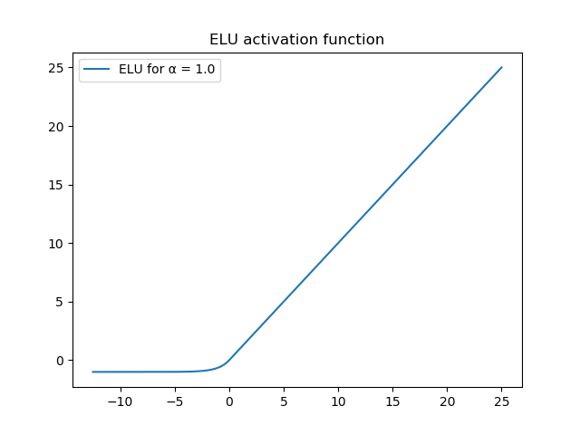

The neurons of neural networks perform operations that are linear: they multiple an _input vector_ with a _weights vector_ and add a bias - operations that are linear.

By consequence, they are not capable of learning patterns in nonlinear data, except for the fact that _activation functions_ can be added. These functions, to which the output of a neuron is fed, map the linear data into a nonlinear range, and hence introduce the nonlinearity that the system as a whole needs for learning nonlinear data. Hence, it's not strange that activation functions are also called "nonlinearities", even though - strictly speaking - \[latex\]f(x) = x\[/latex\] can also be an activation function.

In this blog post, we provide an overview of activation functions covered on MachineCurve. It allows you to quickly identify common activation functions and navigate to those which are interesting to you, in order to learn more about them in more detail. We cover traditional activation functions like Sigmoid, Tanh and ReLU, but also the newer ones like Swish (and related activation functions) as well as Leaky and Parametric ReLU (and related ones).

Are you ready? Let's go! 😎

**Update June 2020:** added possible instability and computational intensity of Swish to provide a better balance between advantages and disadvantages.

* * *

\[toc\]

* * *

## Sigmoid

One of the traditional activation functions is the Sigmoid activation function. I consider it one of the most widely known activation functions known and perhaps used today, except for ReLU. It converts a domain of \[latex\]x \\in \[ -\\infty  , \\infty\]\[/latex\] into the range \[latex\]y \\in \[ 0, 1 \]\[/latex\], with the greatest change present in the \[latex\]x \\in \[-4, +4\]\[/latex\] interval.

Using Sigmoid possibly introduces two large bottlenecks into your machine learning project. Firstly, the outputs are not symmetrical around the origin; that is, for \[latex\]x = 0\[/latex\], \[latex\]y = 0.5\[/latex\]. This might slow down convergence to the optimum solution.

Secondly, the derivative of Sigmoid has a maximum output of \[latex\]\\approx 0.25\[/latex\] for \[latex\]x = 0\[/latex\]. This means that chaining gradients, as is done during neural network optimization, produces very small gradients for upstream layers. Very large neural networks experience this problem as the _vanishing gradients problem_, and it may slow down learning or even make it impossible.

Hence, for today's ML projects: it's perfectly fine to use Sigmoid, if you consider its limitations and know that possibly better activation functions are available.

**Read more:** [ReLU, Sigmoid and Tanh: today’s most used activation functions](https://www.machinecurve.com/index.php/2019/09/04/relu-sigmoid-and-tanh-todays-most-used-activation-functions/#sigmoid)

* * *

## Tanh

Another commonly used activation function known and used since many years is the _Tangens hyperbolicus_, or Tanh activation function. It takes values from the entire domain and maps them onto the range \[latex\]y \\in \[-1, +1\]\[/latex\].

Even though it _does_ provide symmetry around the origin, it's still sensitive to vanishing gradients. The next activation function was identified to counter this problem.

**Read more:** [ReLU, Sigmoid and Tanh: today’s most used activation functions](https://www.machinecurve.com/index.php/2019/09/04/relu-sigmoid-and-tanh-todays-most-used-activation-functions/#tangens-hyperbolicus-tanh)

* * *

## Rectified Linear Unit (ReLU)

Perhaps the most widely known and used activation function today: the Rectified Linear Unit, or ReLU activation function. It activates as either \[latex\]x\[/latex\] for all \[latex\]x > 0\[/latex\], and as zero for all other values in the domain.

In terms of the derivative, this means that the gradient is either _zero_ or _one_. This is both good and bad. It's good because models are sparse (all inputs \[latex\]x < 0\[/latex\] are not taken into account) and because the vanishing gradients problem no longer occurs (for positive gradients, the gradient is always one).

It's bad because we're now opening ourselves to an entirely new problem: the _dying ReLU problem_. It may sometimes be the case that the sparsity-inducing effect of the zero activations for all negative inputs results in too many neurons that produce zeroes yet cannot recover. In other words, they "die off". This also produces models which can no longer successfully learn.

Nevertheless, ReLU is still the way to go in many cases these days.

**Read more:** [ReLU, Sigmoid and Tanh: today’s most used activation functions](https://www.machinecurve.com/index.php/2019/09/04/relu-sigmoid-and-tanh-todays-most-used-activation-functions/#rectified-linear-unit-relu)

* * *

## Leaky ReLU

Now onto some fixes for the dying ReLU problem. Leaky ReLU is the first: by means of a hyperparameter called \[latex\]\\alpha\[/latex\], the machine learning engineer can configure the outputs for the negative domain to be very small, but nonzero. This can be seen in the plot below.

As a result, the gradient for the negative domain is no longer zero, and the neurons no longer die off. This comes at the cost of non-sparse models, and does not always work (especially because you use simple models, it doesn't really work better than traditional ReLU in my experience), but empirical tests have shown quite some success in larger cases. Worth a try!

**Read more:** [Using Leaky ReLU with Keras](https://www.machinecurve.com/index.php/2019/11/12/using-leaky-relu-with-keras/)

* * *

## Parametric ReLU (PReLU)

Leaky ReLU works with some \[latex\]\\alpha\[/latex\] that must be configured by the machine learning engineer. Generalizing from here, Parametric ReLU (or PReLU) takes this job from the engineer and puts it in the training process.

That is, it adds a few extra parameters to the neural network, which represent the alpha parameter (either one alpha per dimension of your data, or one alpha for all dimensions - this can be set by you). Optimization then determines the best alpha for your dataset and continuously adapts it based on training progress.

**Read more:** [How to use PReLU with Keras?](https://www.machinecurve.com/index.php/2019/12/05/how-to-use-prelu-with-keras/)

* * *

## ELU

The authors of the Exponential Linear Unit (ELU) activation function recognize that Leaky ReLU and PReLU contribute to resolving the issues with activation functions to quite a good extent. However, they argued, their fixes introduced a new issue: the fact that there is no "noise-deactivation state" and that by consequence, the models are not robust to noise.

What does this mean? Put very simply, the fact that the negative domain produces negative outputs means that for very large negative numbers, the outputs may still be considerable. This means that noise can still introduce disbalance into the model.

For this reason, the authors propose ELU: an activation function that looks like ReLU, has nonzero outputs for the negative domain, yet (together with its gradient) saturates to some value (which can be configured with an \[latex\]\\alpha\[/latex\] parameter), so that the model is protected from the impact of noise.

**Read more:** [How to use ELU with Keras?](https://www.machinecurve.com/index.php/2019/12/09/how-to-use-elu-with-keras/)

* * *

## Softmax

Now something entirely different: from activation functions that are used on hidden layers, we'll move to an output activation function as a small intermezzo. Let's take a look at the Softmax activation function.

Softmax is quite widely used in classification, and especially when you're trying to solve a multiclass classification problem with [categorical crossentropy loss](https://www.machinecurve.com/index.php/2019/10/22/how-to-use-binary-categorical-crossentropy-with-keras/). Softmax works very nicely and quite intuitively: by interrelating all the values in some vector, and converting them into numbers that adhere to the principles of probability theory, Softmax essentially computes a discrete probability distribution over the values in your vector. When these values represent the outputs of a neural network based classifier, you effectively compute a probability distribution over the target classes for each sample. This allows you to select a "most probable class" and has contributed to e.g. neural network based object detectors.

**Read more:** [How does the Softmax activation function work?](https://www.machinecurve.com/index.php/2020/01/08/how-does-the-softmax-activation-function-work/)

* * *

## Swish

Back to the ReLU-like activation functions. Another activation function which attempts to mimic ReLU is the Swish activation function, which was invented by a Google Brain team. It ensures both ReLU style activations for the positive domain, introduces smoothness around \[latex\]x \\approx 0\[/latex\], then also allows negative inputs close to the origin result in negative outputs, but saturates to \[latex\]y \\approx 0\[/latex\] for large negative inputs. Quite understandably, Swish has produced quite good results in the authors' empirical tests. However, it is more computationally intensive than say ReLU, which may impact the resources you need for training (Deep Learning University, 2020). It can also be unstable, impacting the training process. Therefore, proceed with caution.

**Read more:** [Why Swish could perform better than ReLu](https://www.machinecurve.com/index.php/2019/05/30/why-swish-could-perform-better-than-relu/)

* * *

## FTSwish

Another Swish style activation function is called Flatten-T Swish. Effectively combining the ReLU and Sigmoid activation functions into one, it attempts to resolve much of the issues related to traditional activation functions:

**Read more:**

- [What is the FTSwish activation function?](https://www.machinecurve.com/index.php/2020/01/03/what-is-the-ftswish-activation-function/)
- [How to use FTSwish with Keras?](https://www.machinecurve.com/index.php/2020/01/06/how-to-use-ftswish-with-keras/)

* * *

## LiSHT

Another activation function is LiSHT. It works in a different way when comparing it to more traditional activation functions: negative inputs are converted into positive outputs. However, in terms of the derivative, this produces negative gradients for negative inputs, which eventually saturate to zero. This may also be good for both model sparsity and training power. It might thus be worth a try!

**Read more:**

- [Beyond Swish: the LiSHT activation function](https://www.machinecurve.com/index.php/2019/11/17/beyond-swish-the-lisht-activation-function/)
- [How to use LiSHT activation function with Keras?](https://www.machinecurve.com/index.php/2019/11/17/how-to-use-lisht-activation-function-with-keras/)

* * *

## Summary

In this blog post, you found an overview of commonly used activation functions and newer ones, which attempt to solve the problems related to these activation functions. Most notably, such problems are the vanishing gradients problem and the dying ReLU problem. For each activation function, we provided references to additional blog articles which study the activation function in more detail.

Please do note that in a fast-changing landscape like the ML one, this overview can never be complete. Therefore, if you know about a new activation function which must really be covered, please feel free to leave a comment in the comments section. I'll then try to add it as soon as possible. Please leave a comment too if you have any questions, or when you spot issues in this blog.

Thanks for reading MachineCurve today and happy engineering! 😎

## References

Deep Learning University. (2020, June 8). _Swish as an activation function in neural network_. [https://deeplearninguniversity.com/swish-as-an-activation-function-in-neural-network/](https://deeplearninguniversity.com/swish-as-an-activation-function-in-neural-network/)
