There are many algorithms for clustering available today. DBSCAN, or **density-based spatial clustering of applications with noise**, is one of these clustering algorithms. It can be used for clustering data points based on _density_, i.e., by grouping together areas with many samples. This makes it especially useful for performing clustering under noisy conditions: as we shall see, besides clustering, DBSCAN is also capable of detecting noisy points, which can - if desired - be discarded from the dataset.

In this article, we will be looking at DBScan in more detail. Firstly, we'll take a look at an example use case for clustering, by generating two blobs of data where some nosiy samples are present. Then, we'll introduce DBSCAN based clustering, both its concepts (core points, directly reachable points, reachable points and outliers/noise) and its algorithm (by means of a step-wise explanation). Subsequently, we're going to implement a DBSCAN-based clustering algorithm with Python and Scikit-learn. This allows us to both _understand_ the algorithm and _apply_ it.

In this tutorial, you will learn...

- **The concepts behind DBSCAN.**
- **How the DBSCAN algorithm works.**
- **How you can implement the DBSCAN algorithm yourself, with Scikit-learn.**

[Ask a question](https://www.machinecurve.com/index.php/add-machine-learning-question/)

Let's take a look! 😎

**Update 11/Jan/2021:** added quick-start code example.

* * *

\[toc\]

* * *

## Code example: how to perform DBSCAN clustering with Scikit-learn?

With this quick example you can get started with DBSCAN in Python immediately. If you want to understand how the algorithm works in more detail, or see step-by-step examples for coding the clustering method, make sure to read the full article below!

```
from sklearn.datasets import make_blobs
from sklearn.cluster import DBSCAN
import numpy as np

# Configuration options
num_samples_total = 1000
cluster_centers = [(3,3), (7,7)]
num_classes = len(cluster_centers)
epsilon = 1.0
min_samples = 13

# Generate data
X, y = make_blobs(n_samples = num_samples_total, centers = cluster_centers, n_features = num_classes, center_box=(0, 1), cluster_std = 0.5)

# Compute DBSCAN
db = DBSCAN(eps=epsilon, min_samples=min_samples).fit(X)
labels = db.labels_

no_clusters = len(np.unique(labels) )
no_noise = np.sum(np.array(labels) == -1, axis=0)

print('Estimated no. of clusters: %d' % no_clusters)
print('Estimated no. of noise points: %d' % no_noise)
```

* * *

## What is clustering?

DBSCAN is a clustering algorithm and is part of the class of Unsupervised Learning algorithms. But what is clustering? Let's first take a look at a definition:

> **Cluster analysis** or **clustering** is the task of grouping a set of objects in such a way that objects in the same group (called a **cluster**) are more similar (in some sense) to each other than to those in other groups (clusters).
> 
> Wikipedia (2004)

Aha!

It allows us to select groups from datasets based on shared characteristics for samples within a particular group.

That's interesting, because - to give just one example - we can use clustering to generate a _labeled dataset_ (e.g. to select classes if we don't have them) for creating a predictive model. What's more, as we shall see in this article, clustering can also be used for detecting noisy samples, which can possibly be removed prior to training a Supervised Learning model.

Another vast array of examples is available [here](https://en.wikipedia.org/wiki/Cluster_analysis#Applications).

* * *

## Introducing DBSCAN clustering

DBSCAN is an algorithm for performing cluster analysis on your dataset.

Before we start any work on implementing DBSCAN with Scikit-learn, let's zoom in on the algorithm first. As we read above, it stands for **density-based spatial clustering of applications with noise**, which is quite a complex name for a relatively simple algorithm. But we can break it apart so that we can intuitively grasp what it does. _Density-based_ means that it will zoom into areas that have great _density_, or in other words a large amount of samples closely together. Since clusters are dense, this focus on density is good.

_Spatial_ clustering means that it performs clustering by performing actions in the feature space. In other words, whereas some clustering techniques [work by sending messages between points](https://www.machinecurve.com/index.php/2020/04/18/how-to-perform-affinity-propagation-with-python-in-scikit/), DBSCAN performs distance measures in the space to identify which samples belong to each other. _Clustering_ speaks for itself, and _applications with noise_ means that the technique can be used with noisy datasets. We shall see why this is the case next, because we will now look at the fundamental concepts of DBScan: core points, directly reachable points, reachable points and outliers.

### The concepts of DBScan

Before we start looking at these concepts, we must generate an imaginary dataset first. Here it is. Suppose that we are dealing with a two-dimensional feature space where our samples can be expressed as points (i.e. as \[latex\](X\_1, X\_2)\[/latex\] coordinates). It could then look like this:  

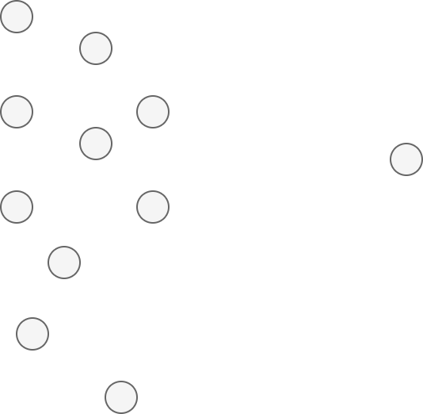

When performing DBSCAN, two parameters must be provided before the algorithm is run. The first is the **epsilon value**, or \[latex\]\\epsilon\[/latex\]. This value indicates some distance around a point, which can be visualized as a circle with a diamater of \[latex\]\\epsilon\[/latex\] around a point. Note that each point has the same epsilon, but that we draw the circle for just one point below.

The second is the **minimum number of samples**. This number indicates the minimum number of samples (including the point itself) that should be within the epsilon range (i.e., the circle) for a point to be considered a _core point_. We will now look at what these are.


#### Core Points

Suppose that we have some epsilon \[latex\]\\epsilon\[/latex\] and set the minimum number of points to 3. We will now look at two points of the dataset. On the left, we look at the above point, while on the right, we look at one of the middle points.

> A point _p_ is a _core point_ if at least minPts points are within distance _ε_ of it (including _p_).
> 
> Wikipedia (2007)

In other words, in our example, a point is a core point if at least 3 points, including itself, are within the circle. As becomes clear, both points that we are looking at are so-called core points.

The great thing of core points is that they are likely part of a cluster, because they are in the vicinity of other points. That's why they are so important in the DBSCAN algorithm.

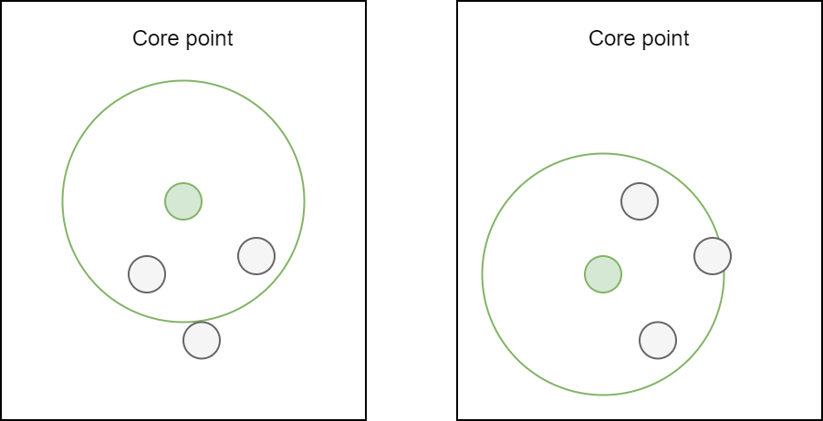

If the dataset were larger (e.g. because we zoomed into a particular area), and another point would be inspected, we could arrive at the conclusion that it is not a core point. The example below illustrates why: there are only two points, including itself, in the \[latex\]\\epsilon\[/latex\] based vicinity of the point. Since \[latex\]\\text{minPts} = 3\[/latex\] and \[latex\]2 < 3\[/latex\], this is not a core point.

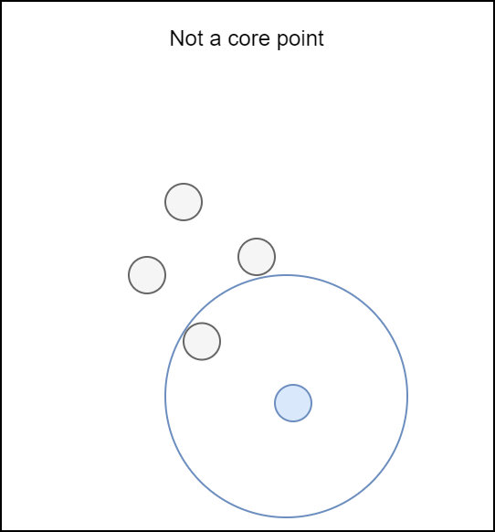

#### Directly Reachable Points

If a point is not a core point, we must look whether it is **directly reachable**.

> A point _q_ is _directly reachable_ from _p_ if point _q_ is within distance _ε_ from core point _p_. Points are only said to be directly reachable from core points.
> 
> Wikipedia (2007)

In the example above, we saw that the extra point we were looking at is not a core point. But is it directly reachable?

It seems to be the case:

- The closest point to the point we were looking at is a core point, since its \[latex\]\\epsilon\[/latex\] circle contains 4 points, which exceeds the minimum of 3.
- The point itself lies within the \[latex\]\\epsilon\[/latex\] circle for the closest core point.

This means that it is directly reachable.

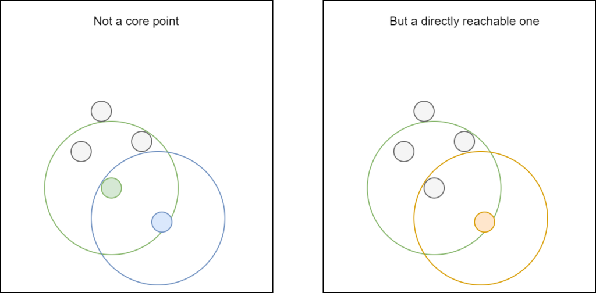

#### Reachable Points

Another concept in DBSCAN is the one of **reachable points:**

> A point _q_ is _reachable_ from _p_ if there is a path _p_1, ..., _pn_ with _p_1 = _p_ and _pn_ = _q_, where each _p__i_+1 is directly reachable from _pi_. Note that this implies that the initial point and all points on the path must be core points, with the possible exception of _q_.
> 
> Wikipedia (2007)

Points are reachable from some point if we can draw a path to it, through points directly reachable from the points on the path (i.e. core points on the path), to the specific point. In our example, B is reachable from A, and we display just one of the paths through which B can be reached.

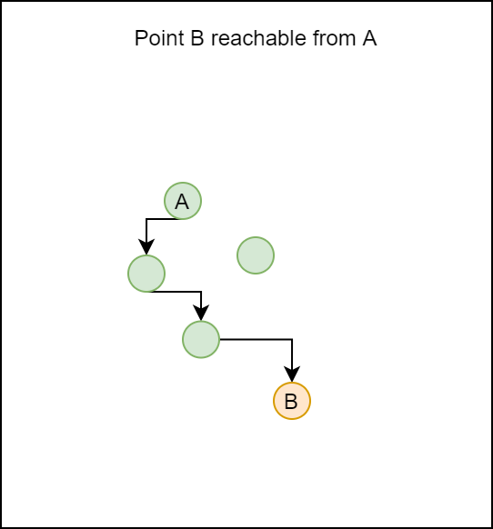

#### Outliers

If a point is not reachable from any other point, it is called an outlier:

> All points not reachable from any other point are _outliers_ or _noise points_.
> 
> Wikipedia (2007)

In other words, if we cannot draw a path from a core point to another point (i.e. if it's not directly reachable nor reachable from the particular point), it's considered an outlier. This is what makes DBSCAN so good for clustering with outlier detection: it can signal outliers natively.

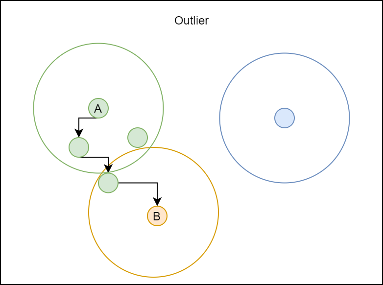

### How everything fits together: DBScan in pseudocode

Now that we know about all the DBSCAN concepts, i.e. the _what_, we can now dive into the _how_. In other words, it's time to look at how DBSCAN works. Funnily, despite the complex name, the algorithm is really simple (Wikipedia, 2007):

1. We set values for \[latex\]\\epsilon\[/latex\] and \[latex\]\\text{minPts}\[/latex\].
2. We randomly select a point from the samples that has not been checked before.
3. We retrieve the \[latex\]\\epsilon-\\text{neighborhood}\[/latex\] for this point. If it equals or exceeds \[latex\]\\text{minPts}\[/latex\], we signal it as a cluster. Otherwise, we label it as noise.
4. We signal the \[latex\]\\epsilon-\\text{neighborhood}\[/latex\] as being part of the cluster. This means that for each point of that neighborhood, its own \[latex\]\\epsilon-\\text{neighborhood}\[/latex\] is added to the cluster as well, and so on, and so on. We continue until no further point can be added to the cluster. Note that the point originally labeled as noise can now also become part of this cluster (it may be part of the \[latex\]\\epsilon-\\text{neighborhood}\[/latex\] of one of the other points), or of another cluster later, because:
5. We now start at (2) again, unless all points have been checked and labeled.

By searching for clusters cluster-by-cluster, we can slowly but surely build one cluster, and do not necessarily end up with too many cluster indications that are actually part of the same cluster. Of course, this is something that we can control by setting \[latex\]\\epsilon\[/latex\] and \[latex\]\\text{minPts}\[/latex\] and is depending on the dataset (requiring your own exploratory data analysis first). In addition, labeling points as noise means that after clustering has finished, we can simply show and count the points that remain labeled as noise, and possibly remove them from our dataset.

If for some \[latex\]\\epsilon\[/latex\] the value for \[latex\]\\text{minPts} = 4\[/latex\], this would be the outcome: many core points, some points that are not core points but directly reachable from core points and hence part of the cluster, and some points that are not reachable and hence outliers. In other words, we have one cluster here, including the green and red points, where the two blue ones are outliers.

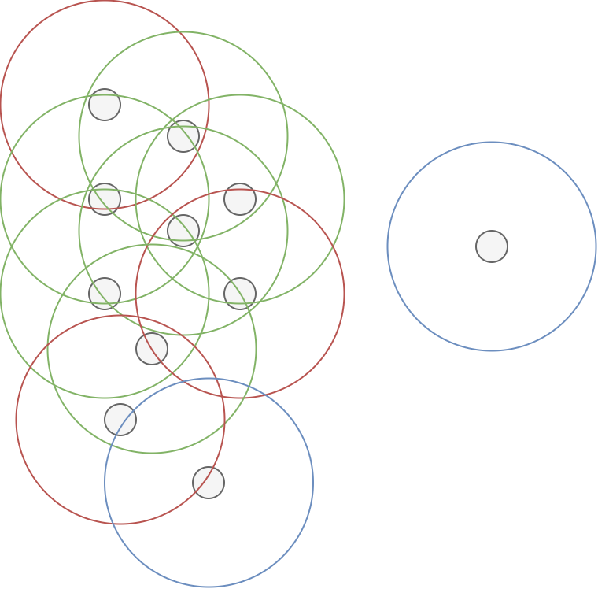

* * *

## Performing DBSCAN-based clustering with Scikit-learn

All right, you should now have a fair understanding about how the DBSCAN algorithm works and hence how it can be used for clustering. Let's convert our knowledge into code by writing a script that is capable of performing clustering on some data. We'll be using Scikit-learn for this purpose, since it makes available `DBSCAN` within its `sklearn.cluster` API, and because Python is the de facto standard language for ML engineering today.

Let's open a code editor and create a file named e.g. `dbscan.py`.

### Adding the imports

The first thing that we do is adding the imports:

- We'll import `make_blobs` from `sklearn.datasets` for generating the blob-based dataset in the next section.
- From `sklearn.cluster` we import `DBSCAN`, which allows us to perform the clustering.
- NumPy (as `np`) will be used for number processing.
- Finally, we'll use the Matplotlib PyPlot API (`plt`) for visualizing the generated dataset after clustering.

```
from sklearn.datasets import make_blobs
from sklearn.cluster import DBSCAN
import numpy as np
import matplotlib.pyplot as plt
```

### Generating a dataset

For generating the dataset, we'll do two things: specifying some configuration options and using them when calling `make_blobs`. Note that we also specify `epsilon` and `min_samples`, which will later be used for the clustering operation.

```
# Configuration options
num_samples_total = 1000
cluster_centers = [(3,3), (7,7)]
num_classes = len(cluster_centers)
epsilon = 1
.0
min_samples = 13

# Generate data
X, y = make_blobs(n_samples = num_samples_total, centers = cluster_centers, n_features = num_classes, center_box=(0, 1), cluster_std = 0.5)
```

The clusters look as follows (in your case, they will look slightly differently since they are generated randomly).

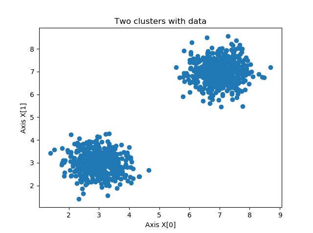

For replicability, it can be wise to save the data just once after running the script - by uncommenting the `.save(...)` line then, you'll always load the same data from the `clusters.npy` file. This is however not required.

```
np.save('./clusters.npy', X)
X = np.load('./clusters.npy')
```

### Initializing DBScan and computing the clusters

We can now initialize DBScan and compute the clusters.

- We initialize `DBSCAN` with our values for `epsilon` and `min_samples`.
- We then immediately fit the data to DBSCAN, meaning that clustering will start.
- We load the generated labels (i.e. cluster indices) into `labels` after clustering has finished.

```
# Compute DBSCAN
db = DBSCAN(eps=epsilon, min_samples=min_samples).fit(X)
labels = db.labels_
```

In our case, printing the number of clusters and number of noisy samples yields 2 clusters with 0 noisy samples due to our selection of \[latex\]\\epsilon = 1.0; \\text{minPts} = 13\[/latex\]. In your case, the results will likely be different. Shuffling around with epsilon values (i.e. making the circle bigger) or minimum number of samples (depending on the density of your clusters) will yield other results then!

```
no_clusters = len(np.unique(labels) )
no_noise = np.sum(np.array(labels) == -1, axis=0)

print('Estimated no. of clusters: %d' % no_clusters)
print('Estimated no. of noise points: %d' % no_noise)
```

(Outcome:)

```
Estimated no. of clusters: 2
Estimated no. of noise points: 0
```

### Plotting the clustered data

Finally, we can generate a scatter plot for our training data. Since we have two clusters, we use a simple lambda function that selects either one color or the other. If you have multiple clusters, you can easily generalize this lambda function [with a dictionary approach](https://www.machinecurve.com/index.php/question/how-to-give-multiple-colors-when-plotting-clusters/).

```
# Generate scatter plot for training data
colors = list(map(lambda x: '#3b4cc0' if x == 1 else '#b40426', labels))
plt.scatter(X[:,0], X[:,1], c=colors, marker="o", picker=True)
plt.title('Two clusters with data')
plt.xlabel('Axis X[0]')
plt.ylabel('Axis X[1]')
plt.show()
```

The end result is indeed two clusters, as intended:

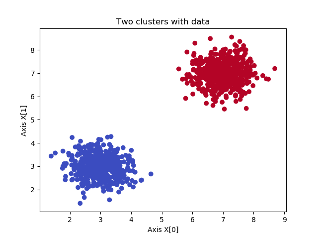

### Full model code

Here's the full code for those who aim to use it straight away:

```
from sklearn.datasets import make_blobs
from sklearn.cluster import DBSCAN
import numpy as np
import matplotlib.pyplot as plt

# Configuration options
num_samples_total = 1000
cluster_centers = [(3,3), (7,7)]
num_classes = len(cluster_centers)
epsilon = 1.0
min_samples = 13

# Generate data
X, y = make_blobs(n_samples = num_samples_total, centers = cluster_centers, n_features = num_classes, center_box=(0, 1), cluster_std = 0.5)

np.save('./clusters.npy', X)
X = np.load('./clusters.npy')

# Compute DBSCAN
db = DBSCAN(eps=epsilon, min_samples=min_samples).fit(X)
labels = db.labels_

no_clusters = len(np.unique(labels) )
no_noise = np.sum(np.array(labels) == -1, axis=0)

print('Estimated no. of clusters: %d' % no_clusters)
print('Estimated no. of noise points: %d' % no_noise)

# Generate scatter plot for training data
colors = list(map(lambda x: '#3b4cc0' if x == 1 else '#b40426', labels))
plt.scatter(X[:,0], X[:,1], c=colors, marker="o", picker=True)
plt.title('Two clusters with data')
plt.xlabel('Axis X[0]')
plt.ylabel('Axis X[1]')
plt.show()
```

* * *

## Removing noise from the dataset after clustering

If we adapt the value for \[latex\]\\epsilon\[/latex\] and set it to 0.3, we get different results:

```
Estimated no. of clusters: 3
Estimated no. of noise points: 50
```

In particular, the algorithm is now capable of detecting noisy samples, as we can see in the image below. However, removing the noisy samples after performing DBSCAN is easy - and requires just four lines of extra code. This is the because because DBSCAN sets the labels for noisy samples to `-1`; this is its way of "signaling a label as noisy".

Adding the lines before generating the scatter plot shows that samples that are labeled as noise are removed from the dataset.

For this reason, we can also use DBSCAN as a noise removal algorithm, e.g. before applying [SVM based classification](https://www.machinecurve.com/index.php/2020/05/03/creating-a-simple-binary-svm-classifier-with-python-and-scikit-learn/), to find better decision boundaries.

```
# Remove the noise
range_max = len(X)
X = np.array([X[i] for i in range(0, range_max) if labels[i] != -1])
labels = np.array([labels[i] for i in range(0, range_max) if labels[i] != -1])

# Generate scatter plot for training data
colors = list(map(lambda x: '#000000' if x == -1 else '#b40426', labels))
plt.scatter(X[:,0], X[:,1], c=colors, marker="o", picker=True)
plt.title(f'Noise removed')
plt.xlabel('Axis X[0]')
plt.ylabel('Axis X[1]')
plt.show()
```

- [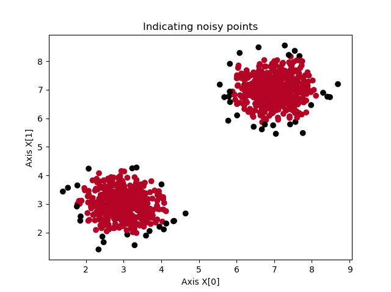](https://www.machinecurve.com/wp-content/uploads/2020/12/noisy.png)
    
- [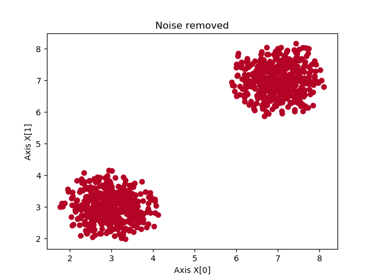](https://www.machinecurve.com/wp-content/uploads/2020/12/noiseremoved.png)
    

* * *

## Summary

In this article, we looked at DBSCAN based clustering in multiple ways. Firstly, we looked at cluster analysis or clustering in general - what is it? What is it used for? As we could see in this article, there are some interesting areas where such techniques can be employed.

We then introduced DBSCAN, which stands for density-based spatial clustering of applications with noise, and is a widely used clustering algorithm. We looked at the algorithm and the conceptual building blocks first. We saw that core points are named so if at least \[latex\]\\text{minPts}\[/latex\] points are located at less than \[latex\]\\epsilon\[/latex\] distance from the point. All the points within this circle are directly reachable. If we can construct a path from a point to another, non-directly reachable point, through other core points, the point is finally said to be reachable. All points that are not reachable are considered to be outliers, or noise.

The algorithm itself is then really simple. Starting from one point, it attempts to build a cluster by grouping its \[latex\]\\epsilon-\\text{neighborhoods}\[/latex\], i.e. directly reachable points for the point. If no such point is available, it is labeled as noise. If some are available, for these points, their directly reachable points are added, and so on, until the cluster cannot be expanded any further. Then, it selects another non-visited point and performs the same steps, until all points have been visited. We then know the clusters and the noisy points.

Knowing about the building blocks and how the algorithm works conceptually, we then moved on and provided a Python implementation for DBSCAN using Scikit-learn. We saw that with only a few lines of Python code, we were able to generate a dataset, apply DBSCAN clustering to it, visualize the clusters, and even remove the noisy points. The latter makes our dataset cleaner without losing much of the core information available in the clusters.

[Ask a question](https://www.machinecurve.com/index.php/add-machine-learning-question/)

I hope that you have learned something from today's article. If you have any questions, you can leave a comments in the comments section below 💬. You can also click the green button to the right 🟢, where you can ask your questions in our **Ask Questions** forum. Please feel free to leave a comment as well if you have other remarks or suggestions for improvement. I'd love to hear from you.

Thank you for reading MachineCurve today and happy engineering! 😎

* * *

## References

Wikipedia. (2007, October 16). _Dbscan_. Wikipedia, the free encyclopedia. Retrieved December 8, 2020, from [https://en.wikipedia.org/wiki/DBSCAN](https://en.wikipedia.org/wiki/DBSCAN)

Scikit-learn. (n.d.). _Sklearn.cluster.DBSCAN — scikit-learn 0.23.2 documentation_. scikit-learn: machine learning in Python — scikit-learn 0.16.1 documentation. Retrieved December 9, 2020, from [https://scikit-learn.org/stable/modules/generated/sklearn.cluster.DBSCAN.html#sklearn.cluster.DBSCAN](https://scikit-learn.org/stable/modules/generated/sklearn.cluster.DBSCAN.html#sklearn.cluster.DBSCAN)

Wikipedia. (2004, May 21). _Cluster analysis_. Wikipedia, the free encyclopedia. Retrieved December 9, 2020, from [https://en.wikipedia.org/wiki/Cluster\_analysis](https://en.wikipedia.org/wiki/Cluster_analysis)
