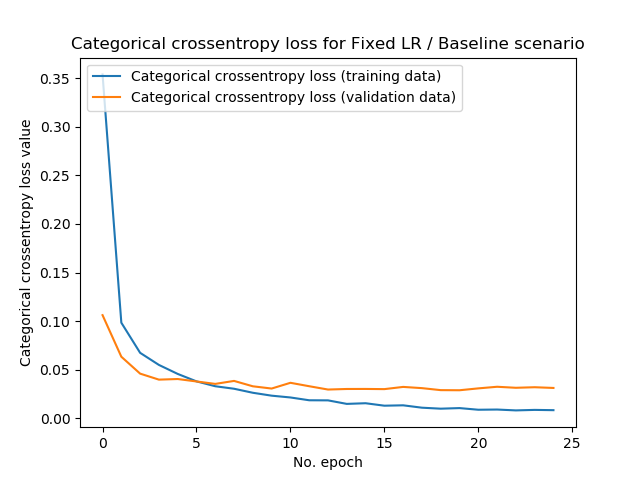
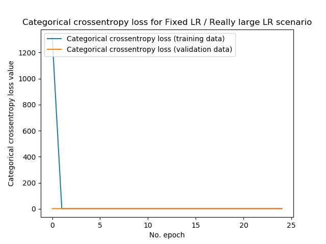
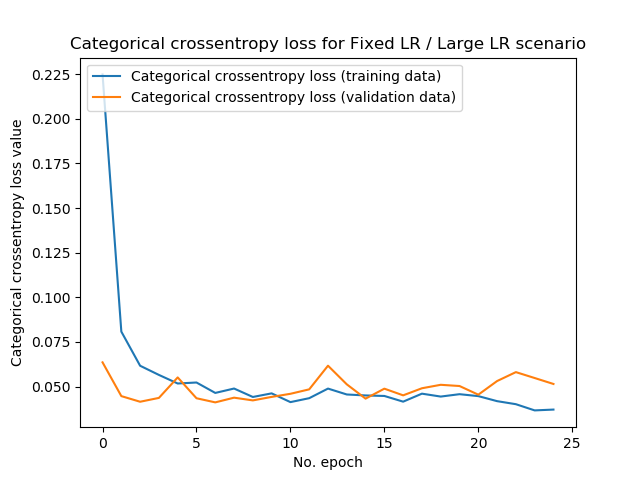
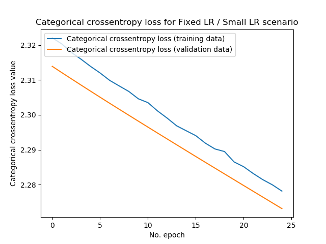
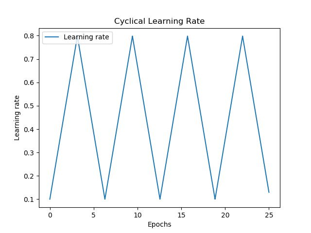

Learning rates come in various flavors and can be used to influence the learning process. More specifically, they are meant to ensure that gradient updates are not too large as they are set to small values by default. In a [different blog post](https://www.machinecurve.com/index.php/2019/11/06/what-is-a-learning-rate-in-a-neural-network/), we covered them conceptually, but highlighted that fixed and decaying learning rates come with their set of challenges.

What these challenges are is what we'll cover in this blog post. For fixed learning rates, we will compare [SGD](https://www.machinecurve.com/index.php/2019/10/24/gradient-descent-and-its-variants/) learning rates that are either too large or too small with the baseline scenario, which is the Keras default learning rate for the SGD optimizer.

For learning rate decay, we'll show you how it improves the learning process, but why setting the default one in advance and choosing a decay scheme might still influence the training results. Finally, we'll show you a few possible solutions for the problem.

If you still think that this post covers the machine learning problem you're dealing with - let's go! 😎

**Update 02/Nov/2021:** fixed bug in model code with missing reshape and `input_shape` variable.

**Update 01/Mar/2021:** ensure that article is up to date for 2021. Replaced TF 1 based code with TensorFlow 2 based code, so that it can be used with recent versions of the library. Some other improvements as well.

**Update 01/Feb/2020:** added link to [Learning Rate Range Test](https://www.machinecurve.com/index.php/2020/02/20/finding-optimal-learning-rates-with-the-learning-rate-range-test/).

* * *

\[toc\]

* * *

## Problems with Fixed Learning Rates

In order to show the issues you may encounter when using fixed learning rates, we'll use a [CNN based image classifier](https://www.machinecurve.com/index.php/2019/09/17/how-to-create-a-cnn-classifier-with-keras/) that we created before. This model uses the MNIST dataset for demonstration purposes. This dataset is used in educational settings quite often.

The code of our model can be found by clicking the link above or by scrolling slightly to the bottom of this post, under 'Model code'.

First, we will create our baseline by training our CNN with the default learning rate. It allows us to show that our model does actually perform well. Next, we'll show what happens when we increase the learning rate: your model no longer performs. We then show that decreasing the learning rate is not a solution either, since it will tremendously slow down your learning process.

### Baseline: default learning rate

This is a [visualization of the performance](https://www.machinecurve.com/index.php/2019/10/08/how-to-visualize-the-training-process-in-keras/) of the model with our baseline scenario:

[](https://www.machinecurve.com/wp-content/uploads/2019/11/fixed_lr_baseline.png)

It actually shows a very normal learning curve: a steep descent during the first few epochs, after which the model gets close to the minimum (whether local or global!) and learning stabilizes. The final loss value on the training data is approximately 0.01 whereas it's 0.05 on the validation data - that's pretty good. Test accuracy, in this case, confirmed the results:

```
Test loss: 0.02863448634357819 / Test accuracy: 0.9919000267982483
```

### Too large fixed learning rate: overshooting loss minimum

Now, what happens when we set the learning rate to \[latex\]0.5\[/latex\], which the machine learning community considers a really large one?

(Note that in this case, 50% of the computed gradient change is actually used to change the model's weights!)

In the really large case, this is the result:

[](https://www.machinecurve.com/wp-content/uploads/2019/11/fixed_lr_really_large.png)

```
Test loss: 2.3188612442016603 / Test accuracy: 0.10100000351667404
```

Loss, initially, was really large - and while indeed, the loss decreases substantially during the first epoch, nothing happens during the subsequent ones. Rather, test loss is 2.32 (instead of 0.029 in the baseline scenario) and accuracy is only 10.1%. Really large learning rates therefore don't work: if the minimum can be found at all, it continuously oversohots it.

Now, what happens if we decrease the learning rate to a value that is still large - but generally speaking, acceptably large?

That is, we're now using a learning rate of \[latex\]0.01\[/latex\]:

[](https://www.machinecurve.com/wp-content/uploads/2019/11/fixed_lr_large.png)

```
Test loss: 0.045392444870159344 / Test accuracy: 0.9887999892234802
```

Yes, we're finding convergence again with really good test accuracy! 😎

...but still, we're being impacted by the fact that the learning rate seems to be too large:

- First, the test loss is approximately twice as high compared with the baseline scenario: 0.045 instead of 0.029. This likely occurs because the model cannot find the actual minimum, since the learning rate is too large and we overshoot our minimum every time.
- Secondly, compared to the [baseline plot](https://www.machinecurve.com/wp-content/uploads/2019/11/fixed_lr_baseline.png), we can observe that our loss value oscillates more heavily. This is also the result of a less subtle learning rate, compared with the baseline scenario.

All in all, comparing our baseline, we can see that while increasing the learning rate _may_ help you find convergence faster, _it may also be destructive for learning_. Choose wisely! Start with the default LR and perhaps increase it in small steps, [visualize training history](https://www.machinecurve.com/index.php/2019/10/08/how-to-visualize-the-training-process-in-keras/) and watch for oscillation in your plots, and stop slightly before this occurs.

### Too small fixed learning rate: extremely slow convergence

Okay. We have seen that increasing the learning rate helps, but only to some extent. It allows you to find convergence faster, but at some point it ensures that your model no longer converges. Instead, you then find very poor model performance.

You may now think: okay, but what happens when I _decrease_ instead of _increase_ the learning rate? Does the same pattern emerge then?

Let's find out.

We'll first use a learning rate of \[latex\]0.00001\[/latex\]. Note that our baseline learning rate is \[latex\]0.001\[/latex\], so ours is now 100 times smaller.

[](https://www.machinecurve.com/wp-content/uploads/2019/11/fixed_lr_small.png)

```
Test loss: 0.17123142351806164 / Test accuracy: 0.9513999819755554
```

We can make a few observations here:

- First, the history plot shows that our history is much smoother than the ones found with the larger learning rate. This makes sense, since a smaller learning rate essentially means that you're taking smaller steps when performing [gradient descent](https://www.machinecurve.com/index.php/2019/10/24/gradient-descent-and-its-variants/), and hence your path downhill is smoother.
- Secondly, we unfortunately find higher loss values compared to our baseline scenario. Training and validation loss approximate 0.25, while test loss is approximately 0.171. Compare this with our baseline, where test loss was 0.029, and you see what happens - smaller loss values lead to smoother learning curves, but result in slower convergence (while theoretically your model still converges by simply increasing the number of epochs, things like [vanishing gradients](https://www.machinecurve.com/index.php/2019/08/30/random-initialization-vanishing-and-exploding-gradients/) or using the [Adadelta optimizer](https://www.machinecurve.com/index.php/2019/11/03/extensions-to-gradient-descent-from-momentum-to-adabound/#adagrad) could then result in finding no convergence at all!)

This pattern gets even stronger when we decrease our learning rate again, once more 100 times. In fact, the steps are now too small in order to find model convergence quickly:

[](https://www.machinecurve.com/wp-content/uploads/2019/11/fixed_lr_really_small.png)

```
Test loss: 2.2723510555267334 / Test accuracy: 0.16249999403953552
```

### Fixing your learning rate is resource inefficient

We can thus conclude that while fixed learning rates benefit you in terms of _simplicity_, they have multiple drawbacks:

- Too large fixed learning rates will ensure that your model no longer converges to the loss minimum, because it always overshoots this minimum during training.
- Too small fixed learning rates may result in the same, but then because your steps are so small that it (theoretically) takes infinitely long to find the minimum.
- Hence, there is a range in between learning rates result in quick and approximate convergence. Your learning rate is best configured to be in this range.
- Unfortunately, this range is dependent on the loss landscape that is generated by your dataset. You can only find this landscape by either visualizing it, or experimenting with many trial runs of your training process.
- Additionally, the range is dependent on the configuration of the other hyperparameters in your machine learning model, which itself are also dependent on the dataset. This introduces quite some complexity.
- Hence, fixed learning rates are flawed, since they require setting a learning rate a priori - either finding no or less-than-superior convergence, or wasting a lot of resources.
- Could there be a better solution? We'll explore learning rate decay schemes in the next section.

### Model code

This is the code that we used for our model, more speifically for our baseline setting. It uses the [Adam adaptive optimizer](https://www.machinecurve.com/index.php/2019/11/03/extensions-to-gradient-descent-from-momentum-to-adabound/) and its default learning rate of \[latex\]0.001\[/latex\]. Note that you can adapt the learning rate under 'Fit data to model'.

```
'''
  Problems with fixed and decaying Learning Rates:
  Fixed Learning Rate - Baseline Scenario
'''
import tensorflow
from tensorflow.keras.datasets import mnist
from tensorflow.keras.models import Sequential
from tensorflow.keras.layers import Dense, Dropout, Flatten
from tensorflow.keras.layers import Conv2D, MaxPooling2D
import matplotlib.pyplot as plt

# Model configuration
img_width, img_height = 28, 28
batch_size = 250
no_epochs = 25
no_classes = 10
validation_split = 0.2
verbosity = 1

# Load MNIST dataset
(input_train, target_train), (input_test, target_test) = mnist.load_data()

# Parse numbers as floats
input_train = input_train.astype('float32')
input_test = input_test.astype('float32')

# Convert them into black or white: [0, 1].
input_train = input_train / 255
input_test = input_test / 255

# Convert target vectors to categorical targets
target_train = tensorflow.keras.utils.to_categorical(target_train, no_classes)
target_test = tensorflow.keras.utils.to_categorical(target_test, no_classes)

# Reshape everything
input_train = input_train.reshape(input_train.shape[0], 28, 28, 1)
input_test = input_test.reshape(input_test.shape[0], 28, 28, 1)

# Set input shape
input_shape = (28, 28, 1)

# Create the model
model = Sequential()
model.add(Conv2D(32, kernel_size=(3, 3), activation='relu', input_shape=input_shape))
model.add(MaxPooling2D(pool_size=(2, 2)))
model.add(Dropout(0.25))
model.add(Conv2D(64, kernel_size=(3, 3), activation='relu'))
model.add(MaxPooling2D(pool_size=(2, 2)))
model.add(Dropout(0.25))
model.add(Flatten())
model.add(Dense(256, activation='relu'))
model.add(Dense(no_classes, activation='softmax'))

# Compile the model
model.compile(loss=tensorflow.keras.losses.categorical_crossentropy,
              optimizer=tensorflow.keras.optimizers.Adam(learning_rate=0.001),
              metrics=['accuracy'])

# Fit data to model
history = model.fit(input_train, target_train,
          batch_size=batch_size,
          epochs=no_epochs,
          verbose=verbosity,
          validation_split=validation_split)

# Generate generalization metrics
score = model.evaluate(input_test, target_test, verbose=0)
print(f'Test loss: {score[0]} / Test accuracy: {score[1]}')

# Plot history
plt.plot(history.history['loss'], label='Categorical crossentropy loss (training data)')
plt.plot(history.history['val_loss'], label='Categorical crossentropy loss (validation data)')
plt.title('Categorical crossentropy loss for Fixed LR / Baseline scenario')
plt.ylabel('Categorical crossentropy loss value')
plt.xlabel('No. epoch')
plt.legend(loc="upper left")
plt.show()
```

* * *

## Problems with Learning Rate Decay

In the previous section, we found that fixed learning rates can be used, but that they are inherently flawed if you cannot find an adequate, or even the best, fixed learning rate quickly.

Learning Rate Decay may reduce your challenge.

### What is Learning Rate Decay?

Why should it be necessary to keep your learning rate fixed - that is the premise behind decaying learning rates. It's just that simple: a decaying learning rate is a learning rate that gets smaller and smaller as the number of epochs increases.

This allows you to start with a relatively large learning rate, while benefiting from smaller (or even small!) ones towards your final stages of training.

In terms of the training process, this is beneficial: at the beginning, a relatively large learning rate is necessary in order to set huge steps, while you wish to set increasingly smaller steps when you approach the loss minimum.

Decay schemes are thus a better idea than fixed learning rates, and there are many of them (Lau, 2017):

**Linear decay**, well, decays your learning rate linearly. That is, it decreases with a fixed rate, until it reaches 0:

```
l_lr = initial_learning_rate
def linear_decay(epoch):
  lr_decay = 0.00001
  global l_lr
  l_lr = l_lr - lr_decay
  return max(l_lr, 0)
```


**Step decay** allows you to drop the learning rates in exponentially smaller steps, every few epochs. In the case below, the learning rate drops step-wise every 15 epochs. The first drop is 0.5, the second 0.025, then 0.0125, and so on.

```
def step_decay(epoch):
  lr_drop_by = 0.5
  lr_drop_every = 15
  return initial_learning_rate * math.pow(
    lr_drop_by, math.floor((1+epoch)/lr_drop_every)
  )
```


**Time decay** decreases the learning rate overtime. Decay starts slowly at first, to ensure that the learning rate remains relatively large during the early phases of the training process. Subsequently, decay gets larger, but slows down towards the end. Compared with linear and step decay, time decay is smooth. This might reduce oscillation around your loss curve.

```
td_lr = initial_learning_rate
def time_decay(epoch):
  lr_decay = 0.0000015
  global td_lr
  td_lr *= (1 / (1 + lr_decay * epoch))
  return td_lr 
```

[](https://www.machinecurve.com/wp-content/uploads/2019/11/time_decay.png)

**Exponential decay** is similar to time decay, but - compare the plots! - is different. Contrary to time decay, which decays slowly at first, exponential decay decays fastest at first, only to decrease decay with increasing epochs. Similar to time decay, it's also smooth.

[](https://www.machinecurve.com/wp-content/uploads/2019/11/exponential_decay.png)

As discussed, learning rate decay schemes do improve the learning process by reducing the impact of fixed learning rates. Nevertheless, decay schemes also come with their own set of peculiarities, of which two are primarily relevant: **setting the default learning rate in advance** is still necessary, while it's _not_ known in advance **which decay scheme is best**.

### Setting the Default Learning Rate in advance

One of the main drawbacks of fixed learning rates was that it must be set in advance, even though it's dependent on the loss landscape, which itself is dependent on the dataset and how you configured the rest of your hyperparameters.

Learning rate decay schemes partially resolve this problem: by setting a quite high learning rate and applying a decay scheme, you can (1) ensure that your model still converges and (2) that its steps are smaller once you get closer to the loss minimum.

This is good.

But there's still a catch: the default learning rate, i.e. the learning rate from which decay starts, is still _fixed_. And while the range of decay-fixed learning rates is larger than true-fixed learning rates (by virtue of LR decay), you still have to make assumptions about your default learning rate - because it's once again dependent on the data _and_ the other hyperparameters.

While learning rate decay schemes therefore make your life easier, they're still not a full solution.

### Choosing a Decay Scheme

Another choice you'll have to make _in advance_ is which decay scheme you'll use. As we saw above, multiple decay schemes exist - schemes that are linear, that are dependent on time, or work exponentially. There is no fixed law that prescribes which decay scheme to use in which situation, and your choice is often dependent on experience.

...and experience is always related to the structure of the dataset you're using, which means that choosing a decay scheme is also dependent on your dataset and hence the other hyperparameters.

The necessity of choosing a decay scheme in advance is therefore, together with choosing a default learning rate a priori, why there might still be better options.

* * *

## Possible solutions

This does not mean that your life is lost. No, on the contrary - both fixed learning rates and learning rate decay schemes often result in well-performing models, especially if your data has high volume and variety.

Nevertheless, it may be that you wish to optimize your model to the max _or_ find mediocre performance and wish to investigate whether it's your learning rate that is to blame.

You may in that case try a few of these solutions.

### Using adaptive optimizers

First of all - you may wish to use an [adaptive optimizer](https://www.machinecurve.com/index.php/2019/11/03/extensions-to-gradient-descent-from-momentum-to-adabound/). Normal [gradient descent](https://www.machinecurve.com/index.php/2019/10/24/gradient-descent-and-its-variants/) updates all your weights in a similar fashion: it applies the gradient update times the learning rate and subtracts this update from the model's current weights.

However, over time, you may wish to decrease the updates for weights that have already updated quite often (since they apparently do not contribute to model improvement) while increasing the weights that haven't updated quite often yet (because perhaps, they may contribute after all).

What you need is an _adaptive optimizer_ such as [Adam](https://www.machinecurve.com/index.php/2019/11/03/extensions-to-gradient-descent-from-momentum-to-adabound/#adam), [Adadelta](https://www.machinecurve.com/index.php/2019/11/03/extensions-to-gradient-descent-from-momentum-to-adabound/#adadelta) or [AdaMax](https://www.machinecurve.com/index.php/2019/11/03/extensions-to-gradient-descent-from-momentum-to-adabound/#adamax), which

Yes - for most of them, you'll still need to configure the default learning rate. However, what's best **is that the impact of your choice impacts the training process even less**, because the optimizer will be able to alter the _impact_ of the update itself. Even better, if you use [Adadelta](https://www.machinecurve.com/index.php/2019/11/03/extensions-to-gradient-descent-from-momentum-to-adabound/#adadelta) it means that you don't need to configure a default learning rate at all.

(Note that adaptive optimizers are not [without challenges](https://www.machinecurve.com/index.php/2019/11/03/extensions-to-gradient-descent-from-momentum-to-adabound/#challenges-with-adaptive-optimizers-new-ones) - as is pretty much everything in deep learning. Do not use them blindly, but use your common sense - if they don't work, perhaps try SGD with one of the other options instead.)

### Learning Rate Range Test

In 2017, in two papers, Smith (2017) and Smith & Topin (2017) produced an interesting idea: _what if you can determine the most optimal learning rate empirically_?

This is the premise behind the **[Learning Rate Range Test](https://www.machinecurve.com/index.php/2020/02/20/finding-optimal-learning-rates-with-the-learning-rate-range-test/)**, which essentially allows you to test a range of learning rates by training the model once, but then with exponentially increasing learning rate.

Take for example the [Keras LR Finder](https://github.com/surmenok/keras_lr_finder) implementation in Keras, which is based on the algorithm described in Smith (2017) and essentially:

> Plots the change of the loss function of a Keras model when the learning rate is exponentially increasing.

Generating plots like this:


Result of the Learning Rate Range Test for a CNN I trained for my master's thesis. Clearly, loss is lowest with learning rates in the range of \[0.01, 0.1\].

It allows you to to estimate a default learning rate, which you can then use in a fixed sense or with a decay scheme. Even though you'll have to fix your learning rate a priori before starting the real training process, you can now find an estimate that might actually work best, or approaches an optimal value quite closely.

If you wish to implement it with Keras, [take a look here](https://www.machinecurve.com/index.php/2020/02/20/finding-optimal-learning-rates-with-the-learning-rate-range-test/#implementing-the-learning-rate-range-test-with-keras).

### Cyclical Learning Rates

Smith (2017) doesn't only describe the LR Range Test, however. In fact, the author combines the test with another new concept: a **cyclical learning rate**.

The concept is conceptually very easy:

**Just move back and forth between a really large learning rate, and a lower one, in a zig-zag way, between some bounds.**

Like this:

[](blob:https://www.machinecurve.com/4f506139-515f-4c7a-b431-1f4a1927dc59)

The bounds can be determined by means of the LR Range Test: in the case above, e.g. \[latex\]10^-2\[/latex\] and \[latex\]10^-1\[/latex\].

How does this benefit you compared to a 'traditional' learning rate, you may now wonder?

Well, this has actually yielded quite good results, and this is perhaps why: it combines the best of _large steps_ with the best of _small steps_. By setting large steps, you may move quickly towards a minimum, and even overshoot a local minimum if it seems that you're getting stuck. The smaller steps will then ensure, if you're closer to a minimum, that you will be able to find the true minimum without overshooting.

Especially when you're in the global minimum, it's very unlikely that you'll overshoot when learning rates switch back from small to large ones. In fact, when you combine this strategy with [EarlyStopping and/or ModelCheckpointing](https://www.machinecurve.com/index.php/2019/05/30/avoid-wasting-resources-with-earlystopping-and-modelcheckpoint-in-keras/), it's even more unlikely that you'll overshoot your global minimum.

* * *

## Summary: use common sense and don't be afraid to experiment

As we've seen, it's very much possible to achieve quite well-performing models with fixed learning rates and learning rate decay schemes. Still, they face some challenges that cannot be ignored if you wish to optimize your model to the fullest. Adaptive optimizers, the Learning Rate Range Test and Cyclical Learning Rates may then help you, but even those must be applied with caution and common sense.

The lesson learnt here could then perhaps be summarized as follows:

**Benefit from the best of theory, but don't be afraid to experiment.**

Waste resources in finding your best hyperparameters - but do so wisely, rather than naïvely. For example, use the LR Range Test with open source libraries like the Keras LR Finder to find a good learning rate empirically, and don't make guesses yourself. Try cyclical learning rates and/or adaptive optimizers for some time, but make sure to compare them with traditional SGD with e.g. fine-tuned learning rate decay too.

...when working with common sense, I'm confident that you're on your way to creating a well-performing model! 😎

I hope you've learnt something from reading this blog post. If you did, I'd appreciate a heads up about what you did - and if anything was unclear. Just leave a comment in the comments box below 👇 and I'll be happy to answer any questions, or improve my blog where necessary.

Thanks - and happy engineering! 😄

* * *

## References

Lau, S. (2017, August 1). Learning Rate Schedules and Adaptive Learning Rate Methods for Deep Learning. Retrieved from [https://towardsdatascience.com/learning-rate-schedules-and-adaptive-learning-rate-methods-for-deep-learning-2c8f433990d1](https://towardsdatascience.com/learning-rate-schedules-and-adaptive-learning-rate-methods-for-deep-learning-2c8f433990d1)

Smith, L. N. (2017, March). [Cyclical learning rates for training neural networks.](https://ieeexplore.ieee.org/abstract/document/7926641/) In _2017 IEEE Winter Conference on Applications of Computer Vision (WACV)_ (pp. 464-472). IEEE.

Smith, L. N., & Topin, N. (2017). Exploring loss function topology with cyclical learning rates. _[arXiv preprint arXiv:1702.04283](https://arxiv.org/abs/1702.04283)_[.](https://arxiv.org/abs/1702.04283)

Surmenok, P. (2018, July 14). Estimating an Optimal Learning Rate For a Deep Neural Network. Retrieved from [https://towardsdatascience.com/estimating-optimal-learning-rate-for-a-deep-neural-network-ce32f2556ce0](https://towardsdatascience.com/estimating-optimal-learning-rate-for-a-deep-neural-network-ce32f2556ce0)

surmenok/keras\_lr\_finder. (2019, October 19). Retrieved from [https://github.com/surmenok/keras\_lr\_finder](https://github.com/surmenok/keras_lr_finder)
