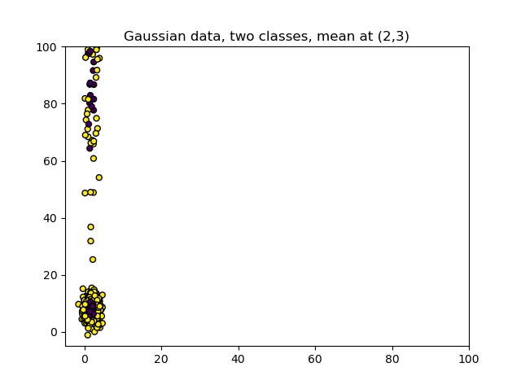
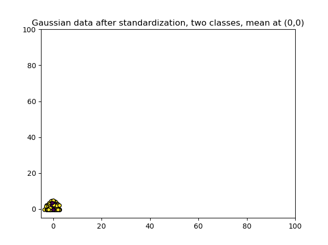
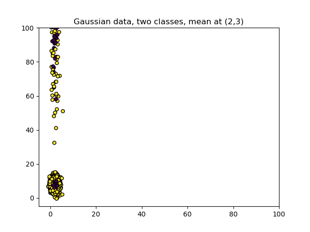
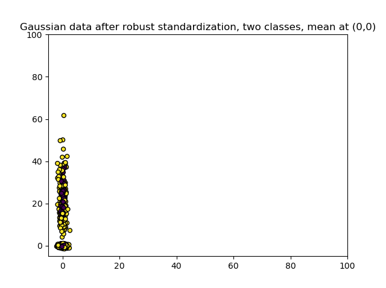

When you are training Machine Learning models, data preprocessing is an important activity. It is sometimes even crucial to the success of your project that your dataset is adequately prepared. **Feature Scaling**, adapting the scales of your features so that they become comparable, can be crucial to the performance provided by the model. Fortunately, there are many methods and techniques that can be applied for Feature Scaling.

However, if you have a dataset where many outliers are present, especially one of the two most important techniques - Standardization - might not perform so well. This article zooms in on this problem and looks at Robust Scaling, which is a way to overcome this problem. It is structured as follows. Firstly, we will look at why Feature Scaling is important and sometimes even necessary for Machine Learning algorithms - to give you the appropriate context for the rest of the article. We then look at why Feature Scaling with especially Standardization can be difficult when your dataset contains (extreme) outliers. Subsequently, we introduce Robust Scaling, and show you how it works by means of the `RobustScaler` implementation in Scikit-learn. The examples include Scikit-learn models and TensorFlow/Keras models.

Let's take a look! 😎

**Update 08/Dec/2020:** added references to PCA article.

* * *

\[toc\]

* * *

## Why Feature Scaling is necessary for Machine Learning algorithms

If you have trained Machine Learning models before, or if you have looked closely at the articles at MachineCurve, you have likely seen lines like these sometimes:

```
# Convert into [0, 1] range.
input_train = input_train / 255
input_test = input_test / 255
```

These lines rescale the (in this case) grayscale input data from the \[latex\]\[0, 255\]\[/latex\] range into the \[latex\]\[0, 1\]\[/latex\] range. It is one of the methods of **Feature Scaling**, which is often necessary for your Machine Learning projects. It involves reducing the _range_ (i.e. the minimum and maximum values) to a small interval, without losing the relationships between the individual samples. In fact, in many cases, you get really weird performance (close-to-zero accuracy or infinite loss with Neural Networks, for example) if you don't apply it.

But why do you have to apply it in the first place? What makes Machine Learning algorithms or more specifically the datasets so dependent on Feature Scaling?

Feature Scaling can be necessary because of one or more of the following reasons:

- Feature Selection and Extraction
- Convergence of your Machine Learning algorithm
- Regularization applied in your algorithm

Let's take a look at the individual reasons in more detail now, and then introduce Normalization and Standardization for performing Feature Scaling.

### Feature Selection and Extraction

Suppose that you have a dataset where two variables are candidates for being the _predictor variable_, i.e. the independent value which is used in the \[latex\]\\text{independent variable} \\rightarrow \\text{dependent variable}\[/latex\] relationship of a predictive model.

If we would plot those variables, without knowing what they represent, the plot could look like this:


Often, if a variable has a big range, its variance is also bigger compared to variables which have a small range.

> _Variance is the expectation of the squared deviation of a random variable from its mean. Informally, it measures how far a set of numbers is spread out from their average value._
> 
> Wikipedia (2001)

And variables with greater variance often contribute more significantly to the relationship of a predictive model, for the simple reason that they capture more possible values from the domain of input variables.

Here's the catch, though: for feature extraction and selection, we often use algorithms like [Principal Component Analysis (PCA)](https://www.machinecurve.com/index.php/2020/12/07/introducing-pca-with-python-and-scikit-learn-for-machine-learning/), which are dependent on variable variance for extracting the variables that contribute most significantly to the spread of our dataset.

But if the variable scales are incompatible and hence cannot be compared, the comparison and hence the application of Feature Selection algorithm is pointless.

If you want to apply Feature Selection (which is true in many cases), you first want to make your scales comparable. This can be achieved with Normalization or, even more accurately, with Standardization. It is one of the reasons why Feature Scaling can improve your ML model performance: **you will truly find the variables that contribute most.**

### Machine Learning convergence

Another reason why you should consider applying Feature Scaling is due to the convergence of your Machine Learning model.

**Some Machine Learning algorithms are dependent on Feature Scaling should they converge to an optimal solution well, or converge at all.**

For example, some algorithms utilize distance metrics for learning the [decision boundary](https://www.machinecurve.com/index.php/2019/10/11/how-to-visualize-the-decision-boundary-for-your-keras-model/) of the model. You can imagine that in a variable \[latex\]X\_1\[/latex\] with a range of \[latex\]\[0, 102500\]\[/latex\] the distances are much bigger compared to a variable \[latex\]X\_2\[/latex\] with a \[latex\]\[0, 1\]\[/latex\] range. Now, should they both be used in generating a prediction (e.g. in a relationship that looks like \[latex\]{{X\_1}, {X\_2}} \\rightarrow y\[/latex\], then much more emphasis will be put on the distances measured for \[latex\]X\_1\[/latex\].

This significantly distorts the impact of the other, smaller-range variables, and is another reason why you may wish to apply Feature Scaling.

### Regularization

The third reason is related to [regularization](https://www.machinecurve.com/index.php/2020/01/26/which-regularizer-do-i-need-for-training-my-neural-network/), which is used for controlling the weights of the model. For example, L1 (Lasso) regularization ensures that models are sparse, by dropping out weights that contribute insignificantly, while L2 (Ridge) keeps weights small without making models sparse.

Here's the catch when you use a non-scaled dataset with regularization: applying regularizers involves computing distance metrics. We saw above what happens when distance metrics are computed and the ranges of your variables vary significantly - things go south. In the case of regularization, we should ensure that Feature Scaling is applied, **which ensures that penalties are applied appropriately** (Wikipedia, 2011).

### Normalization and Standardization for Feature Scaling

Above, we saw that Feature Scaling can be applied to [normalize or standardize](https://www.machinecurve.com/index.php/2020/11/19/how-to-normalize-or-standardize-a-dataset-in-python/) your features. As the names already suggest, there are two main candidates for normalization and standardization:

- **Min-max normalization:** here, the values are scaled to a \[latex\]\[0, 1\]\[/latex\] range (or possibly an \[latex\]\[a, b\]\[/latex\] range) using the minimum and maximum values. Although simple and very efficient, the means and standard deviations of the variables are still unequal, meaning that they remain a bit incompatible, although the situation improves a lot.
- **Standardization** (or **z-score normalization**): here, for all variables, the mean is brought to zero and the standard deviation to one. This makes the scales fully compatible because the values now express the _differences from the mean in standard deviations_, which are always the same. The technique is best applied with Gaussian data, although it can also work with other data in many cases. Just see for yourself which one works best.

You can click on the referenced link above to dive into Normalization and Standardization in more detail. In the remainder of this article, we will look at why Feature Scaling using Standardization can become problematic when your dataset contains (extreme) outliers, and how to handle these situations.

* * *

## Problems with Feature Scaling with Outliers in your Dataset

In the article referenced above, we saw that datasets can become surprisingly comparable when Standardization is applied - in this case, the variance of one feature seems to be comparable after Standardization. This means that both variables are equally important, which is not something we thought when we first saw the dataset on the left!

- 
    
- 
    

As expected, the entire feature space would now be centered around \[latex\](\\mu = 0, \\sigma = 1)\[/latex\]. The new range is approximately \[latex\]\[-3.66, 3.16\]\[/latex\].

```
print(np.mean(X1))
print(np.std(X1))
print(f'Range: [{np.min(X1)}, {np.max(X1)}]')

> 4.920508445138694e-16
> 1.0000000000000004
> Range: [-3.65964765666819, 3.1606977253547752]
```

Now let's take a look at what happens when we regenerate the dataset but then introduce outliers - in approximately 20% of the cases, the samples are multiplied by 10-25 so that they are really off:

- 
    
- 
    

The `StandardScaler` used for applying Standardization to this dataset nicely generates a standard dataset centered around \[latex\](\\mu = 0, \\sigma = 1)\[/latex\].

But this is misleading if we look at the new range!

```
9.090506125630782e-16
1.0000000000000004
Range: [-3.549687574954954, 4.685632224899642]
```

\[latex\]\[-3.55, 4.69\]\[/latex\]? Compare this to the range of the dataset without outliers, which was \[latex\]\[-3.66, 3.16\]\[/latex\].

If this looks strange to you, it is because it _is_. After standardization, it looks like as if the dataset never had outliers in the first place: the 'lowest' values have scantily moved, while the outliers were moved _significantly_ towards zero mean and unit variance. We now have a distorted dataset which could potentially allow you to detect patterns which are not there, by masking the presence of outliers!

This is why applying Standardization for Feature Scaling can be problematic and must be dealt with appropriately.

* * *

## How to perform Feature Scaling with Outliers

Let's now take a look at how we can perform Feature Scaling when we have (extreme) outliers in our dataset. For doing so, we can apply a technique called _Robust Scaling_, which comes delivered in Scikit-learn by means of the `sklearn.preprocessing.RobustScaler` module.

### Introducing the RobustScaler

Where Z-score Standardization removes the mean and then divides by the standard deviation to ensure that the mean is zero and the scales become comparable in terms of standard deviation, we saw that this _overperforms_ in the case of outliers.

Using the `RobustScaler` in Scikit-learn, we can overcome this problem, by scaling the dataset appropriately - reducing the range, while keeping the outliers, so that they keep contributing to feature importance and model performance.

> This Scaler removes the median and scales the data according to the quantile range (defaults to IQR: Interquartile Range). The IQR is the range between the 1st quartile (25th quantile) and the 3rd quartile (75th quantile).
> 
> Scikit-learn (n.d.)

- 
    
- 
    

### Using the RobustScaler with Python for Scikit-learn and TensorFlow models

Applying Robust Scaling with the `RobustScaler` is really easy and works both for Scikit-learn and TensorFlow models. Suppose that we generate the originally Gaussian data from the plots above, and then stretch one of the axes by `2.63` and then stretch 20% of the data more by multiplying it with a number between \[latex\]\[10, 25\]\[/latex\]. We then have a dataset available in `X1` which is also what we would have when e.g. training a [Scikit-learn](https://www.machinecurve.com/index.php/2020/11/12/using-error-correcting-output-codes-for-multiclass-svm-classification/) or a [TensorFlow](https://www.machinecurve.com/index.php/2019/09/17/how-to-create-a-cnn-classifier-with-keras/) model.

```
# Imports
from sklearn.datasets import make_gaussian_quantiles
from sklearn.preprocessing import RobustScaler
import random
import numpy as np

# Make Gaussian data
X1, Y1 = make_gaussian_quantiles(n_features=2, n_classes=2, n_samples=1000, mean=(2,3))

# Stretch one of the axes with random numbers
x_new = []
X1[:, 1] = 2.63 * X1[:, 1]
for x in X1[:, 1]:
  outlier_generation = random.uniform(0, 1)
  if outlier_generation >= 0.80:
    x = x * random.uniform(10, 25)
  x_new.append(x)
X1[:, 1] = x_new

# Robustly Scale Gaussian data
scaler = RobustScaler()
scaler.fit(X1)
X1 = scaler.transform(X1)

# Print statistics
print(np.mean(X1))
print(np.std(X1))
print(f'Range: [{np.min(X1)}, {np.max(X1)}]')
```

Applying the `RobustScaler` is then really easy:

- Firstly, we initialize the `RobustScaler` and assign it to `scaler`.
- Secondly, we `.fit` the `X1` dataset to the `scaler` variable.
- We then `.transform` the `X1` dataset and re-assign it to `X1`.

Printing the statistics then yields the following values for mean, standard deviation and range:

```
2.4222758827852466
7.942996751183663
Range: [-2.500445964741244, 61.19964933941751]
```

Not entirely zero mean and unit variance, but much better than what it was _before_ applying Feature Scaling that is robust to outliers:

```
18.09362233921902
45.25650019182367
Range: [-1.9328478564634346, 379.4841869132472]
```

* * *

## Summary

Feature Scaling is a very important data preprocessing task when training Machine Learning models. It can be critical to the success of your Feature Selection algorithms, if you apply any, but also to the convergence of your Machine Learning algorithm and to the regularizer, if applied. That's why Normalization and Standardization are heavily used in many Machine Learning models.

Unfortunately, many datasets do however contain outliers, and especially Standardization is not robust to these outliers, significantly masking their significance and possibly giving you a model that performs due to false reasons.

Robust Feature Scaling by means of the `RobustScaler` in Scikit-learns can help you fix this issue. By scaling data according to the quantile range rather than the standard deviation, it reduces the range of your features while keeping the outliers in. In this article, we also looked at how we can implement Robust Scaling with Scikit-learn, and use it for Scikit-learn and TensorFlow models.

I hope that you have learned something from this article. If you did, please feel free to leave a message in the comments section below 💬 Please do the same when you have other comments or questions. I'd love to hear from you! Thank you for reading MachineCurve today and happy engineering 😎

* * *

## References

Wikipedia. (2001, June 30). _Variance_. Wikipedia, the free encyclopedia. Retrieved November 18, 2020, from [https://en.wikipedia.org/wiki/Variance](https://en.wikipedia.org/wiki/Variance)

Wikipedia. (2011, December 15). _Feature scaling_. Wikipedia, the free encyclopedia. Retrieved November 18, 2020, from [https://en.wikipedia.org/wiki/Feature\_scaling](https://en.wikipedia.org/wiki/Feature_scaling)

Scikit-learn. (n.d.). _Sklearn.preprocessing.RobustScaler — scikit-learn 0.23.2 documentation_. scikit-learn: machine learning in Python — scikit-learn 0.16.1 documentation. Retrieved November 19, 2020, from [https://scikit-learn.org/stable/modules/generated/sklearn.preprocessing.RobustScaler.html#sklearn.preprocessing.RobustScaler](https://scikit-learn.org/stable/modules/generated/sklearn.preprocessing.RobustScaler.html#sklearn.preprocessing.RobustScaler)

Scikit-learn. (2020, November 19). _How to normalize or standardize a dataset in Python? – MachineCurve_. MachineCurve. [https://www.machinecurve.com/index.php/2020/11/19/how-to-normalize-or-standardize-a-dataset-in-python/](https://www.machinecurve.com/index.php/2020/11/19/how-to-normalize-or-standardize-a-dataset-in-python/)
