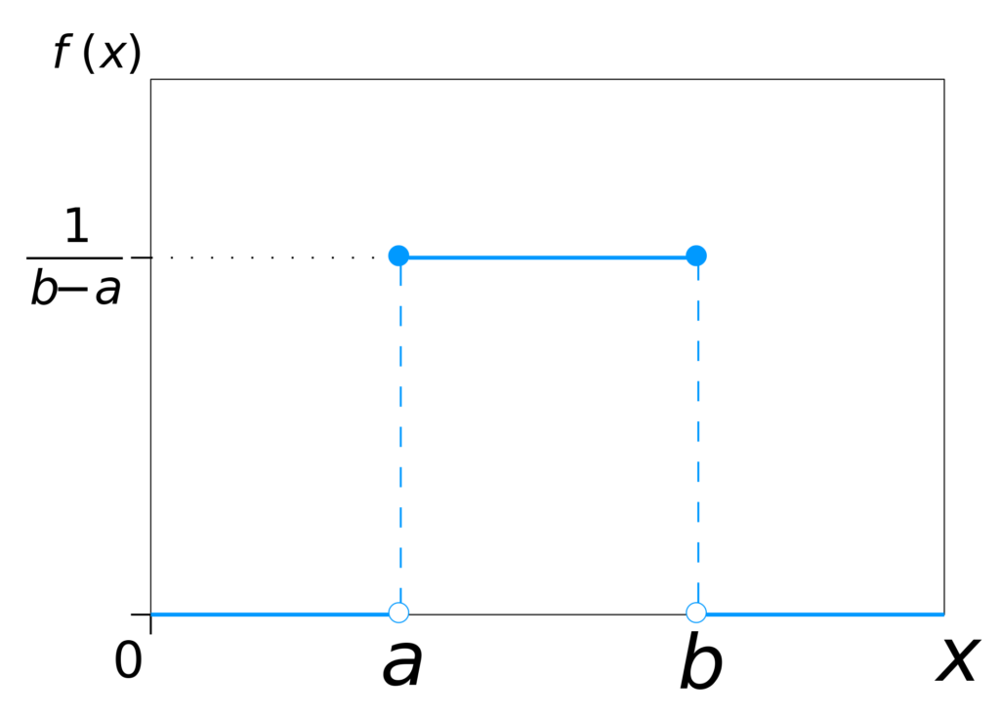
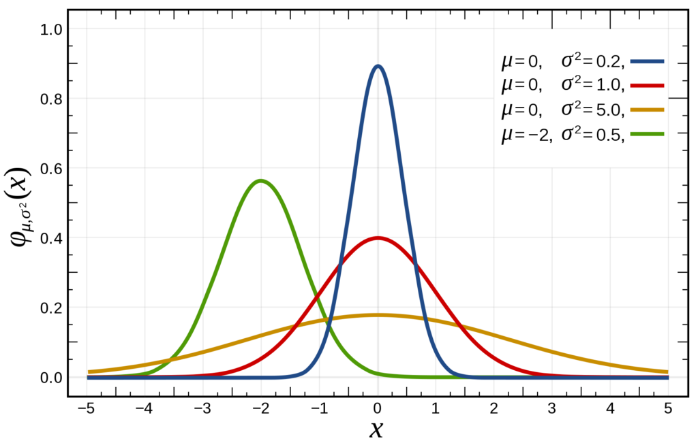

Neural networks must be initialized before one can start training them. As with any aspect of deep learning, however, there are many ways in which this can be done. Random initialization of the neural weights is one of those ways. In fact, it is quite often suggested as being _the_ way of initializing your neural networks.

This might however not exactly be the case due to two problems: the _vanishing gradients problem_ and the _exploding gradients problem_. In this blog, we'll take a look at those problems and will find means to overcome them to a great extent.

Before we can do that, we must however first provide a small recap on the necessity for weight initialization in the first place. This must be followed by a discussion on random initialization and how that is achieved. Once we understand how neural networks are optimized, we can introduce the two problems and the possible solutions.

Let me know in the comments if you've got any remarks, questions or tips. Thanks! :-)

**Update 11/Jan/2021:** checked correctness of the article and updated header information.

\[toc\]

\[ad\]

## The necessity for weight initialization

I always think that a little bit of context must be provided before we move to the details.

The context in this case would be as follows: why is weight initialization necessary in the first place?

Although I primarily wrote on weight initialization [in another blog post](https://machinecurve.com/index.php/2019/08/22/what-is-weight-initialization/), I will briefly cover it here again.

Put very simply, a neural network is composed of various neurons. Those neurons are a combination of a linear operation that I call _vector dot product plus bias_ and a possibly nonlinear operation called the _activation_.

In this latter, also known as the activation function, nonlinearity is added to the linear output of the linear operation. If this wouldn't be done, the neural network would not perform better than a linear one - and all the progress that has occurred over the previous years wouldn't have been possible.

We'll cover activation functions in more detail in a later blog.

The first part, the linear operation itself, is what is interesting today. During this operation, a so-called _input vector_ is multiplied with a _weights vector_, after which a bias value is added to the outcome of this multiplication. Let's break the vectors apart slightly more:

- The **input vector** contains the sample you currently feed into the neural network. In the first layer, this is the actual data, in subsequent layers, it contains the outputs of the neurons in the previous layer.
- The **weights vector** contains the ideosyncrasies, or unique patterns, that the neuron has learnt from the data. It is essentially how the neural network learns: because each neuron is capable of learning a subset of the patterns hidden in the data, the network as a whole can identify many of them.

However, before the training process starts, all weights vectors must be initialized - or - configured with some numbers. They simply cannot be empty, because an empty vector cannot be multiplied properly. As you probably guess by now, there are many initializers... of which _random initialization_ is one of the most widely known ones.

\[ad\]

## Random initialization

Random initialization, as you would have probably guessed by now, initializes the weights randomly ;-)

There exist two ways to achieve random initialization: by means of a normal distribution and an uniform distribution.

### Uniform distribution

This is the uniform distribution:

The uniform distribution. Thanks to the creator of this [work](https://en.wikipedia.org/wiki/Uniform_distribution_(continuous)#/media/File:Uniform_Distribution_PDF_SVG.svg): © [IkamusumeFan](https://commons.wikimedia.org/wiki/User:IkamusumeFan)at Wikipedia, licensed under [CC BY-SA 3.0](https://creativecommons.org/licenses/by-sa/3.0/legalcode).

Don't be scared, it's actually really easy to interpret it :-)

\[mathjax\]

What you see is the _probability distribution_ of the uniform distribution, and it essentially says this: when I draw a number randomly, the odds are \[latex\]1/(b-a)\[/latex\] that they are in the range \[latex\]a <= x <= b\[/latex\] and 0 if they are outside this range.

Fun fact: this is a continuous distribution. That is, there is an infinite amount of real numbers in the interval specified above. By consequence, the probability that you find a certain _number_ is 0. [Read here why](https://stats.stackexchange.com/questions/60702/why-is-the-probability-zero-for-any-given-value-of-a-normal-distribution).

Usually, it is possible to give as input the following variables when configuring the uniform distribution for deep learning:

- The **minimum value** that should be selected.
- The **maximum value** that should be selected.
- A **seed number** to fix the random number generator. Seeding is sometimes necessary because random number generators aren't random; they're [pseudo-random](https://curiosity.com/topics/why-computers-can-never-generate-truly-random-numbers-curiosity/). Hence, you'll want to have the same peculiarities of pseudo-randomness (i.e., deviations from true randomness) every time you use the generator, because otherwise your weights may share different peculiarities.

The maximum value in this case is \[latex\]a\[/latex\] and the maximum value is \[latex\]b\[/latex\].

### Normal distribution

This is the normal distribution:

Credits: [Inductiveload at Wikipedia](https://commons.wikimedia.org/wiki/User:Inductiveload)

Like the uniform distribution, the normal distribution is a continuous one as well.

It's in fact one of the most widely used probability distributions; many natural phenomena can be described according to the distribution, if configured properly.

Specifically, one can configure the **mean** and the **standard deviation**, and once again **seed** the distribution to a specific (pseudo-)random number generator.

If you've had some statistics, you probably know what mean and standard deviation are. If not, [check this out](http://www.ltcconline.net/greenl/courses/201/descstat/mean.htm).

Fun fact: compared with the uniform distribution, where you manually configure the _range_ of possible values, you don't do that with the normal distribution.

Theoretically, that means that you could find any real number as a result. However, as you can see in the image above - e.g. in the standard normal distribution displayed in red - the odds are most likely that your number will fall in the \[-3, +3\] range.

\[ad\]

### Which distribution to choose

Now that you know that both the uniform and the normal distribution are used quite often in deep neural networks, you may wonder: which distribution to use, then?

...if you would choose to initialize them randomly, of course.

A post on [StackExchange](https://datascience.stackexchange.com/a/13362) answers this question for us: it seems to be the case that it doesn't really matter.

Or at least, that it's very unclear whether one is better over the other.

In fact, in the [Glorot](http://www.jmlr.org/proceedings/papers/v9/glorot10a/glorot10a.pdf) and [He](https://www.cv-foundation.org/openaccess/content_iccv_2015/papers/He_Delving_Deep_into_ICCV_2015_paper.pdf) 'initialization papers', the author of that post argues, in which Glorot et al. and He et al. discuss the problems with random initialization, they used the two of them: the Glorot one uses an uniform distribution and the He one a normal one.

It thus seems to be the case that choosing a random statistical distribution for initializing your weights may be chosen by you.

...if you would initialize them randomly, of course.

Because random initialization itself can become problematic under some conditions: you may then face the _vanishing gradients_ and _exploding gradients_ problems. Before we'll introduce those, we take a brief look at how most neural networks are optimized.

\[ad\]

## Optimizing neural networks: gradient descent & backprop

When you train a neural network, you essentially feed it data for which it makes a prediction, computing the error - or loss - afterwards.

This is called a forward pass of your data.

However, one iteration comprises a forward and a backwards pass.

Now, you can view the loss as a mathematical function that is highly characteristic of your data. Functions can be optimized, i.e., their minimum can be found.

And where does the model perform best? At minimum loss, of course.

### Computing gradients

So by computing the derivative of the loss function, you arrive at a gradient for improving the _final hidden layer_ of your neural network. By moving your weights slightly into the direction of the gradient, your model is expected to 'walk' a little bit towards the loss minimum, and hence improve.

We call this gradient descent, and we often use the [stochastic](https://datascience.stackexchange.com/a/36451) one.

### Chaining gradients

However, a neural network consists of multiple layers, not just one.

We cannot simply take the gradient again for the last-but-one hidden layer, since it is intrinsically connected to the last one. Hence, when computing the gradient for this layer, you will always need to consider the gradient of the loss function given the gradient.

For the next layer, you'll repeat this process, but then also including the last-but-one hidden layer.

And so on.

You're essentially creating a chain of gradients, which you will multiply to find the gradient for improving the current layer.

We call this backpropagation.

As you can see, optimizing a neural network thus comprises a:

- Forward pass of the data, computing the current error or _loss_;
- Backwards pass of the data, computing the improvement by means of
    - Backpropagation for computing the gradient given the layer you wish to optimize.
    - (Stochastic) gradient descent or a more advanced optimizer that takes the gradient and moves the neural network weights into the right direction, essentially walking down the 'mountain of loss'.

\[ad\]

## Vanishing gradients

Chaining gradients by multiplying them to find the gradient for an arbitrary layer presents you with a weird peculiarity: the so-called vanishing gradients problem.

As you can see from the normal distribution, to give but one example, is that the majority of the values are relatively low, say within +3 and -1. In fact, the odds are largest that you randomly select a number that is larger than -1 and smaller than 1, i.e. \[latex\]  
\-0.9999999999(..) < x < 0.99999999999(..)\[/latex\]

Suppose that all your neurons output \[latex\]0.1\[/latex\] - a bit strange, but it makes reasoning about vanishing gradients easier. Suppose that you have some layers and a gradient improvement of 0.03. Five layers upstream, with an activation function that outputs between 0 and 1, the gradient improvement for the sixth given the others could be something like 0.1 x 0.1 x 0.1 x 0.1 x 0.1 x 0.03.

And that's a very small number.

The vanishing gradients problem thus means that your most upstream layers will learn _very slowly_, because essentially the computed gradient is _very small_ due to the way the gradients are chained together.

In practice, that could mean that you need infinite time and computing resources to end up at the most optimum value, i.e. the minimum loss.

And we simply don't want that - we want the best possible model.

\[ad\]

## Exploding gradients

Similarly, the _exploding gradients problem_ may happen during training. Essentially, certain neurons die off because they experience what is known as an overflow - or, the number is too large to be handled by computer memory.

Why does this occur?

Suppose that you initialize your weights randomly. It does not really matter which initializer you use. You can then imagine that very likely, the behavior produced by the random weights during the forward pass generates a very large loss, simply because it does not match the underlying data distribution at all.

What happens? The weight swing, or the gradient, could be really large. This is especially the case when random numbers are drawn that are > 1 or < -1. Due to the same effect, chaining the outputs, we get into trouble. Instead of numbers that are getting smaller, we're observing numbers that keep getting bigger.

And eventually, this causes a number overflow with NaNs, or Not-a-Number, as a result. The effect: your learning process is severly hampered.

## What to do against these problems?

Fortunately, there's a fix. Thanks to certain scientists - particularly the  
[Glorot](http://www.jmlr.org/proceedings/papers/v9/glorot10a/glorot10a.pdf) and [He](https://www.cv-foundation.org/openaccess/content_iccv_2015/papers/He_Delving_Deep_into_ICCV_2015_paper.pdf) papers - more advanced initializers have emerged that could be of help in mitigating the vanishing _and_ exploding gradients.

### Xavier and He initialization

These initializers, which are known as the Xavier (or Glorot) and He initializers and available in e.g. [Keras](https://keras.io/initializers/), essentially do one thing: they ensure that the weights are set close to 1.

This way, the problems are avoided to a great extent.

They are different in the way how they manipulate the drawn weights to arrive at approximately 1. By consequence, they are best used with different activation functions. Specifically, He initialization is developed for ReLU based activating networks and by consequence is best used on those. For others, Xavier (or Glorot) initialization generally works best.

\[ad\]

### Experiment!

Despite all those mitigation techniques that work in theory, there is one piece of advice that is generally true for data science and by consequence machine learning projects: **experiment!**

Find out what works and see what fails - and adapt your approach based on what you see. At the same time, try to understand what happens inside of your black box, to derive more generic insights from your observation that can be re-used later.

Put very simply: all theory is nice, but it has to work for you. And there is only one way towards that, i.e. learning by doing.

## Recap

In this blog, we've seen how random initialization works and why it's better than all-zeros initialization. We also know why it is necessary in the first place. However, we also were introduced to some fundamental problems with random initialization, being the vanishing and exploding gradients problem. By applying more advanced initializers, like the He initializer or the Xavier (or Glorot) initializer, we may eventually avoid these problems and arrive at a well-performing model.

I truly hope that you've learnt something from this blog post. I would highly appreciate your comment below 👇😎 Please let me know if you have any questions, any remarks or suggestions for improvement. I'd be happy to apply these, since only that way we can arrive at a best possible post.

Thanks and happy engineering! 😄

## References

Alese, E. (2018, June 10). The curious case of the vanishing & exploding gradient. Retrieved from [https://medium.com/learn-love-ai/the-curious-case-of-the-vanishing-exploding-gradient-bf58ec6822eb](https://medium.com/learn-love-ai/the-curious-case-of-the-vanishing-exploding-gradient-bf58ec6822eb)

Glorot, X., & Bengio, Y. (2019). _Understanding the difficulty of training deep feedforward neural networks_. Paper presented at International Conference on Artificial Intelligence and Statistics, Sardinia, Italy.

He, K., Zhang, X., Ren, S., & Sun, J. (2015). Delving Deep into Rectifiers: Surpassing Human-Level Performance on ImageNet Classification. _2015 IEEE International Conference on Computer Vision (ICCV)_. [doi:10.1109/iccv.2015.123](http://doi.org/doi:10.1109/iccv.2015.123)

Keras. (n.d.). Initializers. Retrieved from [https://keras.io/initializers/](https://keras.io/initializers/)

When to use (He or Glorot) normal initialization over uniform init? And what are its effects with Batch Normalization? (n.d.). Retrieved from [https://datascience.stackexchange.com/questions/13061/when-to-use-he-or-glorot-normal-initialization-over-uniform-init-and-what-are/13362#13362](https://datascience.stackexchange.com/questions/13061/when-to-use-he-or-glorot-normal-initialization-over-uniform-init-and-what-are/13362#13362)

Yadav, S. (2018, November 9). Weight Initialization Techniques in Neural Networks. Retrieved from [https://towardsdatascience.com/weight-initialization-techniques-in-neural-networks-26c649eb3b78](https://towardsdatascience.com/weight-initialization-techniques-in-neural-networks-26c649eb3b78)
