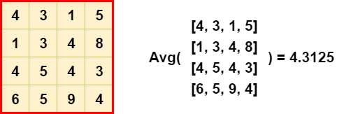
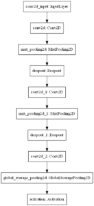
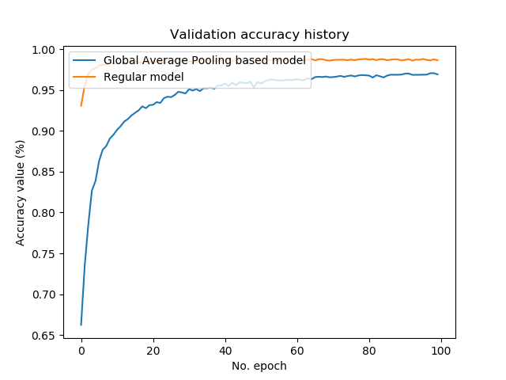

When you Google around for questions like "how to create an image classifier", it's possible that you end up on pages which explain how to create such neural networks with e.g. Keras. In pretty much all of the cases, you'll see that there is a fixed structure for creating those networks:

_You'll use convolutional layers as feature extractors while you use Dense layers for generating the classification._

Did you however know that you can also take a different approach, which may be less intense in terms of computational requirements? Did you know that you might not even lose much predictive performance while doing so?

Replacing the Dense layers with a Global Average Pooling based model does the trick. And this blog post shows you how it's done by means of an example model.

But firstly, we'll take a look at using Global Average Pooling in theory. What are pooling layers? What does Global Average Pooling do and why can it be useful for replacing Dense layers when creating a classifier? We must understand these questions first before we actually start writing some code.

However, code is included - don't worry. By means of a Keras model using TensorFlow 2.0, we build a classifier step by step, providing explanations for each part of the model. Finally, we validate the model, and show you the results.

Are you ready? Let's go! 😎

**Update 05/Nov/2020:** removed channels first/last check for CNTK/Theano/TF backends because Keras is now tightly integrated with TF 2.x; rendering the check obsolete. In other words, made the code compatible with TensorFlow 2.x.

* * *

\[toc\]

* * *

## Using Global Average Pooling to replace Dense layers

Before we begin, I think it's important to take a look at the concept of pooling - and specifically Global Average Pooling - first. It's only going to be a brief introduction so as to save you time ([click here if you want to read a more detailed discussion](https://www.machinecurve.com/index.php/2020/01/30/what-are-max-pooling-average-pooling-global-max-pooling-and-global-average-pooling/)). However, with this understanding, I think you can better understand what happens in the code later, and why.

Let's begin our analysis with what pooling layers are.

### What are pooling layers?

When training a [convolutional neural network](https://www.machinecurve.com/index.php/2018/12/07/convolutional-neural-networks-and-their-components-for-computer-vision/), your goal is to build a spatial hierarchy of increasingly abstract representations of your input data. Doing so allows you to feed new, but slightly different input, without any consequence for the classifier or regression model - because the convolutional layers, a.k.a. the feature extractors, have still produced intermediate outputs that are highly similar.

So, in short, your goal is to build a hierarchy that is similar to the one on the left, versus the one on the right:


Convolutional layers partially achieve this by downsampling the inputs. However, they are expensive, as each layer contains _trainable parameters_ which must be optimized during training for the layer to be useful.

But downsampling _is_ necessary in order to achieve a spatial hierarchy like the one we chose above. How do we achieve this?

Often, we take a look at pooling layers for this purpose. Pooling layers create a small "pool" of data (often a few by a few pixels), which slides over the input data. That's similar to convolutional layers - they do the same - but what happens _inside the pool_ is different. Rather than a pairwise multiplication between the input vector and the learnt weights vector (explaining the relative computational expensiveness of the layer sketched above), a cheap operation such as `max` is performed. Indeed, Max Pooling is one of the most widely used pooling layers:

[](https://www.machinecurve.com/wp-content/uploads/2020/01/Max-Pooling-1.png)

As a result of these pools, their sliding process and the cheap operation, they achieve _downsampling_ as well - but in a much cheaper way:

[](https://www.machinecurve.com/wp-content/uploads/2020/01/Max-Pooling-2.png)

_Side note: there are additional benefits when using Max Pooling. Take a look at the [blog post scrutinizing it in more detail](https://www.machinecurve.com/index.php/2020/01/30/what-are-max-pooling-average-pooling-global-max-pooling-and-global-average-pooling/#max-pooling) if you wish to understand which ones they are._

### What does Global Average Pooling do?

Another form of pooling is the so-called Global Average Pooling. It's different from Max Pooling in two ways:

- The size of the pool equals the size of the input data.
- Instead of a `max` operation, an `avg` operation is performed. Rather than taking the brightest value (which yields sensitivity to noise), the average of the input is taken, smoothing everything together.

Visually, this looks as follows:

[](https://www.machinecurve.com/wp-content/uploads/2020/01/Global-Average-Pooling-2.png)

### Why can Global Average Pooling replace Dense layers in classifiers?

Traditionally, ConvNet based classifiers work as follows:

- The convolutional layers serve as feature extractors, learning the features of importance in your input data.
- A Flatten layer is used to convert the multidimensional data into one-dimensional format.
- This allows Dense or densely-connected layers to take the input and generate a class based prediction, often using the [Softmax activation function](https://www.machinecurve.com/index.php/2020/01/08/how-does-the-softmax-activation-function-work/).

Global Average Pooling can be used to replace these Dense layers in classifiers.

By removing the Dense and Flatten layers, we have a model left with a set of convolutional layers that serve as feature extractors. Now, we can do this:

- Add another Conv layer with active padding, which learns \[latex\]N\[/latex\] feature maps, where \[latex\]N\[/latex\] is the number of target classes.
- Add a Global Average Pooling layer, which transforms the \[latex\]W x H\[/latex\] feature maps into 1 x 1 maps, effectively producing "class predictions" that are not yet interrelated (like in the final Dense layer before they are fed to Softmax).
- Add a Softmax layer, which generates a multiclass probability distribution over the feature maps and by consequence the target classes.

There we go: we have a ConvNet for classification which does not use Dense layers! As we'll see, it significantly reduces the number of trainable parameters, and yields quite adequate results. However, let's first introduce the dataset and full model architecture :)

* * *

## Creating the model

Now that we understand the theory sufficiently, we can move on to the practical part: creating the model. Let's take a look at today's dataset first. Then, we inspect the model architecture in more detail. Subsequently, we'll start writing some code! :)

### Today's dataset

As today's dataset, we'll be using the KMNIST dataset from our [Extra Keras Datasets module](https://www.machinecurve.com/index.php/2020/01/10/making-more-datasets-available-for-keras/). This module makes available various additional datasets in the style of Keras `load_data` functionality. This way, you can use a variety of datasets in your models quite easily, allowing you to try different datasets than e.g. MNIST all the time.

With regards to the dataset itself: the KMNIST dataset, as you can see, replaces MNIST digits with Japanese characters. It's a drop-in dataset for MNIST: it has the same number of output classes (10) and the same number of samples (60k in total for training).

[](https://www.machinecurve.com/wp-content/uploads/2020/01/kmnist-kmnist.png)

### Model architecture

[](https://www.machinecurve.com/wp-content/uploads/2020/01/model.png)

Let's take a look at the model that we will be creating today: a [Convolutional Neural Network](https://www.machinecurve.com/index.php/2018/12/07/convolutional-neural-networks-and-their-components-for-computer-vision/) for image classification.

On the right, you see the architecture of the particular model. Click on the image to make it larger, so that we can look at it in more detail.

Obviously, an `InputLayer` takes in the data. The input shape, as we will see, is `(28, 28, 1)`, as the images that we will be feeding the model are 28 x 28 pixels and have one image channel only.

We then have two convolutional blocks: a `Conv2D` layer followed by `MaxPooling2D` for [downsampling](https://www.machinecurve.com/index.php/2020/01/30/what-are-max-pooling-average-pooling-global-max-pooling-and-global-average-pooling/) and `Dropout` for [regularization](https://www.machinecurve.com/index.php/2019/12/16/what-is-dropout-reduce-overfitting-in-your-neural-networks/). Finally, the data is added to another `Conv2D`, which generates a number of feature maps equal to the number of classes, and then to `GlobalAveragePooling2D`, which generates the average value for each feature map. Since this is output to a [`Softmax` activation function](https://www.machinecurve.com/index.php/2020/01/08/how-does-the-softmax-activation-function-work/), we get the same probability distribution as we would get with [a classic Flatten/Dense based structure](https://www.machinecurve.com/index.php/2019/09/17/how-to-create-a-cnn-classifier-with-keras/).

### What you'll need to run this model

You need to have a few software dependencies installed if you wish to successfully run this model:

- **TensorFlow**, and this must be version 2.0+
- **Matplotlib**, for generating plots.
- The [**Extra Keras Datasets**](https://www.machinecurve.com/index.php/2020/01/10/making-more-datasets-available-for-keras/) module, but you can also use `tensorflow.keras.datasets.mnist` instead.

All right - let's start writing some code! 😎 Open some code editor and create a file. For example, name it `model_no_dense.py`. If possible, enable Python syntax checking. Now, let's go!

### Model imports

First, we add the imports for our model. Given the fact that it is suggested to use the TensorFlow built-in facilities for Keras since TensorFlow released TF 2.0, we'll do precisely that. For this reason, we import Keras from Tensorflow: `import tensorflow.keras`.

Subsequently, we import the `kmnist` dataset from our `extra_keras_datasets` module.

From Keras itself, we subsequently import the `Sequential` API, allowing us to stack the individual layers nicely. Speaking about layers, we use a few of them: first of all the `Conv2D`, `MaxPooling2D` and `GlobalAveragePooling2D` layers, as we discussed above - they're the real workhorses here. Additionally, we import `Dropout` and `Activation`, as they'll complement the others and finalize the architecture of our model.

We finally import Matplotlib for generating some plots towards the end of this blog post.

```
import tensorflow.keras
from extra_keras_datasets import kmnist
from tensorflow.keras.models import Sequential
from tensorflow.keras.layers import Activation, Dropout
from tensorflow.keras.layers import Conv2D, MaxPooling2D, GlobalAveragePooling2D
import matplotlib.pyplot as plt
```

### Model configuration

Next, we configure the model. Image width and image height are 28 x 28 pixels, the batch size is 25 (which is on the low end of the spectrum, but given the low memory requirements for the KMNIST dataset this is perfectly fine) and the number of epochs - or iterations - is 25. This is also low, but for demonstration purposes this is fine too (and as we will see, our control model will converge to very good values pretty quickly). 20% of our training data will be used for validation purposes, and given our setting for verbosity mode all output is displayed on screen.

```
# Model configuration
img_width, img_height = 28, 28
batch_size = 25
no_epochs = 25
no_classes = 10
validation_split = 0.2
verbosity = 1
```

### Loading and preparing the dataset

Now that we have imported our dependencies and set the configuration options for the model, it's time to import the data. We do so by calling the `load_data()` definition from our [module](https://www.machinecurve.com/index.php/2020/01/10/making-more-datasets-available-for-keras/):

```
# Load MNIST dataset
(input_train, target_train), (input_test, target_test) = kmnist.load_data()
```

This imports the data into the four variables.

It's now necessary to reshape the input data and to set the input shape for the model differently. We can do so as follows, with default code provided by the Keras team on GitHub:

```
# Reshape data
input_train = input_train.reshape(input_train.shape[0], img_width, img_height, 1)
input_test = input_test.reshape(input_test.shape[0], img_width, img_height, 1)
input_shape = (img_width, img_height, 1)
```

We then convert the numbers into `float32` format, which presumably speeds up the training process:

```
# Parse numbers as floats
input_train = input_train.astype('float32')
input_test = input_test.astype('float32')
```

And subsequently normalize the data to bring it closer to the \[latex\] \[-1, 1\] \[/latex\] range:

```
# Normalize data
input_train = input_train / 255
input_test = input_test / 255
```

Finally, in terms of data preparation, we convert our target vectors - which are provided in integer format - into categorical format, by generating one-hot encoded vectors with `to_categorical`. This allows us to use [categorical crossentropy loss](https://www.machinecurve.com/index.php/2019/10/22/how-to-use-binary-categorical-crossentropy-with-keras/) during the optimization process.

```
# Convert target vectors to categorical targets
target_train = tensorflow.keras.utils.to_categorical(target_train, no_classes)
target_test = tensorflow.keras.utils.to_categorical(target_test, no_classes)
```

### Defining the model architecture

Next, we code the model architecture. It's equal to what we discussed above, so the discussion here won't be very lengthy. What wasn't included above, is that we use [ReLU](https://www.machinecurve.com/index.php/2019/09/04/relu-sigmoid-and-tanh-todays-most-used-activation-functions/) as an activation function on our hidden layers.

What's more, the Conv2D layer which converts the 64 feature maps into `no_classes = 10` ones uses `padding='same'`, which ensures that the _size_ of the feature maps remains equal to the ones generated by the previous layer (we do so because we aim to compare the performance of this model with a regular Dense based CNN later, and we wish to keep the data shapes equal).

```
# Create the model
model = Sequential()
model.add(Conv2D(32, kernel_size=(3, 3), activation='relu', input_shape=input_shape))
model.add(MaxPooling2D(pool_size=(2, 2)))
model.add(Dropout(0.25))
model.add(Conv2D(64, kernel_size=(3, 3), activation='relu'))
model.add(MaxPooling2D(pool_size=(2, 2)))
model.add(Dropout(0.25))
model.add(Conv2D(no_classes, kernel_size=(3, 3), padding='same', activation='relu'))
model.add(GlobalAveragePooling2D())
model.add(Activation('softmax'))
```

### Compiling the model and starting the training process

At this point, we have a prepared dataset, a set of configuration options and a model architecture. So, in short, we have a skeleton, but no instantiated model yet. That's what we do next, by calling `model.compile` with the configuration options that we specified earlier:

```
# Compile the model
model.compile(loss=tensorflow.keras.losses.categorical_crossentropy,
              optimizer=tensorflow.keras.optimizers.Adam(),
              metrics=['accuracy'])
```

Accuracy is added as an additional metric because it's much more intuitive for humans.

Now that we have a compiled model, we can actually fit the data, i.e. start the training process. Once again, this is done in line with the configuration options that we defined above:

```
# Fit data to model
history = model.fit(input_train, target_train,
            batch_size=batch_size,
            epochs=no_epochs,
            verbose=verbosity,
            validation_split=validation_split)
```

### Generating evaluation metrics

The Keras training process will output various metrics on screen during training. It will display training loss and (in our case) accuracy, and it will do the same for the validation data. However, this is data _that the model has seen during training_. While they are very good indicators for the _predictive_ power of our model, they cannot be relied upon for telling us how well it _generalizes to new data_.

This is why we split the dataset into `input_train` and `input_test` before. The testing data, which the model hasn't seen yet during training, can be used for evaluating the model. We can do this by calling `model.evaluate`:

```
# Generate generalization metrics
score = model.evaluate(input_test, target_test, verbose=0)
print(f'Test loss: {score[0]} / Test accuracy: {score[1]}')
```

This is it! You have a working Keras model now 😎 Open up an command prompt with which you can access the required software dependencies. Navigate to the folder where your file is located using `cd`, and then execute the script with Python: `python model_no_dense.py`. You should see the training process begin :)

### Full model code

Should you wish to obtain the full code at once instead, here you go:

```
import tensorflow.keras
from extra_keras_datasets import kmnist
from tensorflow.keras.models import Sequential
from tensorflow.keras.layers import Activation, Dropout
from tensorflow.keras.layers import Conv2D, MaxPooling2D, GlobalAveragePooling2D
import matplotlib.pyplot as plt

# Model configuration
img_width, img_height = 28, 28
batch_size = 25
no_epochs = 25
no_classes = 10
validation_split = 0.2
verbosity = 1

# Load MNIST dataset
(input_train, target_train), (input_test, target_test) = kmnist.load_data()

# Reshape data
input_train = input_train.reshape(input_train.shape[0], img_width, img_height, 1)
input_test = input_test.reshape(input_test.shape[0], img_width, img_height, 1)
input_shape = (img_width, img_height, 1)

# Parse numbers as floats
input_train = input_train.astype('float32')
input_test = input_test.astype('float32')

# Normalize data
input_train = input_train / 255
input_test = input_test / 255

# Convert target vectors to categorical targets
target_train = tensorflow.keras.utils.to_categorical(target_train, no_classes)
target_test = tensorflow.keras.utils.to_categorical(target_test, no_classes)

# Create the model
model = Sequential()
model.add(Conv2D(32, kernel_size=(3, 3), activation='relu', input_shape=input_shape))
model.add(MaxPooling2D(pool_size=(2, 2)))
model.add(Dropout(0.25))
model.add(Conv2D(64, kernel_size=(3, 3), activation='relu'))
model.add(MaxPooling2D(pool_size=(2, 2)))
model.add(Dropout(0.25))
model.add(Conv2D(no_classes, kernel_size=(3, 3), padding='same', activation='relu'))
model.add(GlobalAveragePooling2D())
model.add(Activation('softmax'))

# Compile the model
model.compile(loss=tensorflow.keras.losses.categorical_crossentropy,
              optimizer=tensorflow.keras.optimizers.Adam(),
              metrics=['accuracy'])

# Fit data to model
history = model.fit(input_train, target_train,
            batch_size=batch_size,
            epochs=no_epochs,
            verbose=verbosity,
            validation_split=validation_split)

# Generate generalization metrics
score = model.evaluate(input_test, target_test, verbose=0)
print(f'Test loss: {score[0]} / Test accuracy: {score[1]}')
```

* * *

## Results with and without Dense

Obviously, we trained the model ourself too! 😋 Let's now take a look at some results.

Despite showing that it _is possible_ to create a CNN based classifier without Dense layers, we're also interested in _how well it works_. For this, we need to compare the model we defined above with some other model; preferably, this is a classic one. Hence, in this section, we define a control model first.

Then, for both, we show the number of trainable parameters, which tells you something about the complexity of the model and the corresponding computational requirements.

Subsequently, we show you the evaluation metrics generated for both models with the testing data. Finally, this is visualized by some visualizations of the [training history](https://www.machinecurve.com/index.php/2019/10/08/how-to-visualize-the-training-process-in-keras/). This enables you to compare the progress of e.g. the loss value for each model over time.

### Control model

Here's the control model. It's a classic CNN with the two `Conv2D` based blocks, a `Flatten` layer, and two `Dense` layers:

```
model = Sequential()
model.add(Conv2D(32, kernel_size=(3, 3), activation='relu', input_shape=input_shape))
model.add(MaxPooling2D(pool_size=(2, 2)))
model.add(Dropout(0.25))
model.add(Conv2D(64, kernel_size=(3, 3), activation='relu'))
model.add(MaxPooling2D(pool_size=(2, 2)))
model.add(Dropout(0.25))
model.add(Flatten())
model.add(Dense(256, activation='relu'))
model.add(Dense(no_classes, activation='softmax'))
```

If you add this code to your model, you must ensure that you also import the additional layers; your inputs will thus become:

```
from tensorflow.keras.layers import Activation, Dropout, Flatten, Dense
from tensorflow.keras.layers import Conv2D, MaxPooling2D, GlobalAveragePooling2D
```

### Trainable parameters

As indicated earlier, the number of trainable parameters tells you something about the complexity and computational requirements of your machine learning model. With `model.summary()`, we can generate an overview of the models. Here is the overview for the Global Average Pooling based model:

```
Model: "GlobalAveragePoolingBased"
_________________________________________________________________
Layer (type)                 Output Shape              Param #
=================================================================
conv2d (Conv2D)              (None, 26, 26, 32)        320
_________________________________________________________________
max_pooling2d (MaxPooling2D) (None, 13, 13, 32)        0
_________________________________________________________________
dropout (Dropout)            (None, 13, 13, 32)        0
_________________________________________________________________
conv2d_1 (Conv2D)            (None, 11, 11, 64)        18496
_________________________________________________________________
max_pooling2d_1 (MaxPooling2 (None, 5, 5, 64)          0
_________________________________________________________________
dropout_1 (Dropout)          (None, 5, 5, 64)          0
_________________________________________________________________
conv2d_2 (Conv2D)            (None, 5, 5, 10)          5770
_________________________________________________________________
global_average_pooling2d (Gl (None, 10)                0
_________________________________________________________________
activation (Activation)      (None, 10)                0
=================================================================
Total params: 24,586
Trainable params: 24,586
Non-trainable params: 0
_________________________________________________________________
```

And this is the one for the traditional one, the classic CNN:

```
Model: "Traditional"
_________________________________________________________________
Layer (type)                 Output Shape              Param #
=================================================================
conv2d_3 (Conv2D)            (None, 26, 26, 32)        320
_________________________________________________________________
max_pooling2d_2 (MaxPooling2 (None, 13, 13, 32)        0
_________________________________________________________________
dropout_2 (Dropout)          (None, 13, 13, 32)        0
_________________________________________________________________
conv2d_4 (Conv2D)            (None, 11, 11, 64)        18496
_________________________________________________________________
max_pooling2d_3 (MaxPooling2 (None, 5, 5, 64)          0
_________________________________________________________________
dropout_3 (Dropout)          (None, 5, 5, 64)          0
_________________________________________________________________
flatten (Flatten)            (None, 1600)              0
_________________________________________________________________
dense (Dense)                (None, 256)               409856
_________________________________________________________________
dense_1 (Dense)              (None, 10)                2570
=================================================================
Total params: 431,242
Trainable params: 431,242
Non-trainable params: 0
_________________________________________________________________
```

As you can see, the number of trainable parameters for the Global Average Pooling based model is substantially lower than for the classic one. The second overview, and especially the `dense` layer in this overview, illustrates the difference: large Dense layers add quite a set of trainable parameters due to their high connectedness. The question, however, is this:

Does the substantial reduction in trainable parameters also influence the _performance_ of the model? Let's take a look 😉

### Evaluation metrics

The evaluation metrics show us that our model performs only slightly worse than the classic one:

```
Global Average Pooling: Test loss: 0.3354340976119041 / Test accuracy: 0.9086999893188477
Classic: Test loss: 0.3033015901445908 / Test accuracy: 0.9617000222206116
```

...but this minor deterioration comes at the benefit of an approximately 18 times reduction in trainable parameters! Perhaps, we can increase the amount of trainable parameters a bit in our new model by e.g. adding another convolutional block, to capture the patterns in a more detailed way. But that's something for a different post! :)

### Training history

The plots of our training history also demonstrate that the performance of our models is converging towards each other. However, what is apparent is that the Global Average Pooling based model takes longer to arrive at loss values that are similar to the regular, classic CNN. Perhaps, this occurs because the trainable parameters in the Dense layers are omitted, and that the individual `Conv2D` layer added to capture the "classification" process with only 10 feature maps takes longer to learn.

- [](https://www.machinecurve.com/wp-content/uploads/2020/01/gap_loss.png)
    
- [](https://www.machinecurve.com/wp-content/uploads/2020/01/gap_acc.png)
    

All in all, some pretty awesome results! 😎

* * *

## Summary

In this blog post, we created a Keras based model to show you that ConvNets do not necessarily require Dense layers at the end if we want to use them for classification purposes. Rather, with Global Average Pooling, they can work as well - at a fraction of the trainable parameters.

The blog post specifically looked at these elements:

- **What pooling layers are and why they are useful**. We studied the concept of pooling and argued why pooling layers benefit training: they ensure that you can better build the spatial hierarchy of abstractness required in your ConvNets, without losing detail unnecessarily.
- **What Global Average Pooling is and how it can be used to remove Dense layers from the ConvNet**: with Global Average Pooling, which has pools equal sizes equal to the size of input data, it's possible to replicate the Dense layer based process at the end of classic ConvNets. We discussed how this works.
- **A Keras based example of the former.** Using the Keras framework for deep learning, we showed how it _really_ works by providing example code. What's more, we validated our model by means of evaluation metrics and plots, showing that - with a little bit of extra time to converge to a minimum - the Global Average Pooling way of working also gets close to what can be achieved with a classic ConvNet.

I hope you've learnt something from today's blog post! If you did, please let me know in the comments - I appreciate your feedback 😊 Please do the same if you have questions or remarks, or if you found mistakes. I'll happily improve.

Thank you for reading MachineCurve today and happy engineering! 😎

* * *

## References

MachineCurve. (2020, January 30). What are Max Pooling, Average Pooling, Global Max Pooling and Global Average Pooling? Retrieved from [https://www.machinecurve.com/index.php/2020/01/30/what-are-max-pooling-average-pooling-global-max-pooling-and-global-average-pooling/](https://www.machinecurve.com/index.php/2020/01/30/what-are-max-pooling-average-pooling-global-max-pooling-and-global-average-pooling/)
