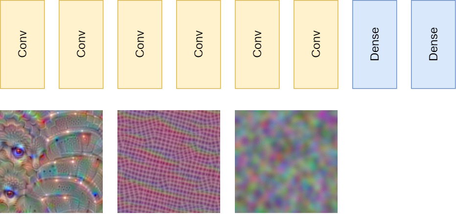
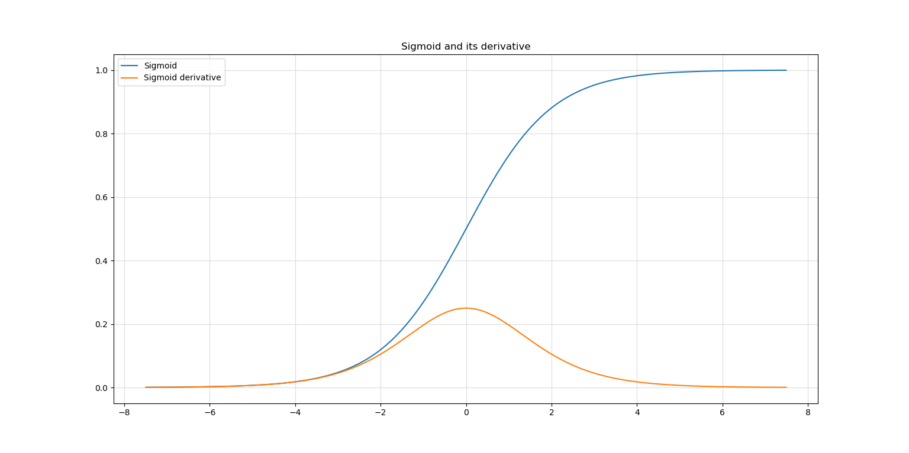
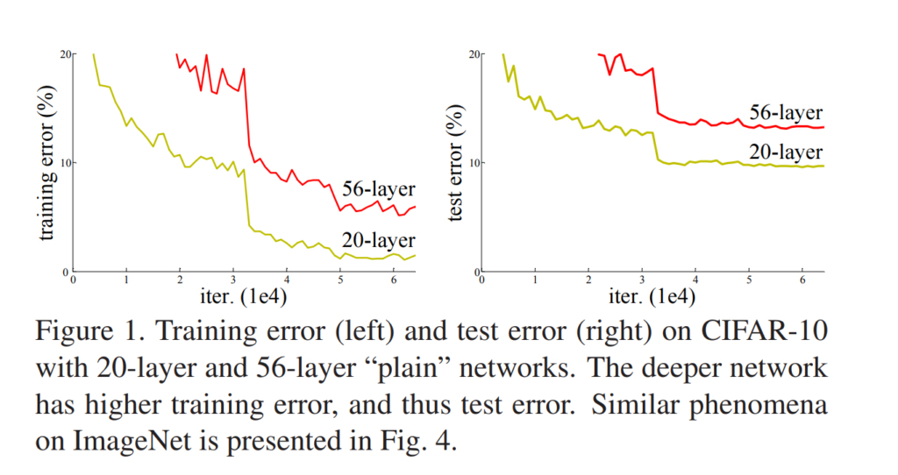

Residual networks or ResNets for short have been key elements in the computer vision oriented deep learning community. In this article, you will take a conceptual look at these networks, and the problems that they solve. However, we'll shy away from the underlying maths, and keep explanations as simple as possible.

In other words, after reading this tutorial, you will...

- **Understand why neural networks _should_ improve performance with increasing depth... in theory.**
- **Why the _shattering gradients_ problem results in degraded performance with depth, a.k.a. the _degradation problem_.**
- **How ResNets reduce shattering gradients and yield better performance, and what they look like architecturally/component-wise.**

Are you ready? Let's take a look! 😎

* * *

\[toc\]

* * *

## Adding more layer should improve performance... in theory

In 2012, during the AlexNet deep learning breakthrough reviving interest in the technique, people realized en masse that deep neural networks are feature learners.

What this means can be best explained by comparing them to other, more traditional techniques, such as logistic regression or Support Vector Machines. In these model types, machine learning engineers and/or data scientists first had to engineer features (i.e. the model input columns) explicitly and manually. In other words, extensive feature analysis and often feature selection had to be performed, e.g. with [PCA](https://www.machinecurve.com/index.php/2020/12/07/introducing-pca-with-python-and-scikit-learn-for-machine-learning/). When relevant features were selected, they had to be engineered as well (e.g., by applying specific [filters](https://learnopencv.com/image-filtering-using-convolution-in-opencv/) over them to make them suitable for the machine learning method).

With neural networks, this was no longer the case. Especially with the addition of [convolutional layers](https://www.machinecurve.com/index.php/2021/07/08/convolutional-neural-networks-with-pytorch/), neural networks became able to learn to detect important parts of images relevant to e.g. classification outcomes, by making the filters/kernels learnable.

When stacking multiple convolutional layers, the feature maps learned in each subsequent layer become more high level. For example, in the image below, we see a ConvNet with multiple Conv layers and two Dense layers for eventual prediction. When visualizing the filters/kernels of these ConvNets, low-level concepts (such as eyes) are still visible within images. The more downstream one gets, the more generic these patterns get.

You can imagine that when you are training a neural network that classifies between cats and dogs, the more downstream you get, the more generic a representation of cats and dogs emerges. The more generic the representation, the more cats are recognized as cats and dogs as dogs. In other words, it should then become much easier for the Dense layers to distinguish between the classes.

Obviously, this leads to the popularity of _deep_ learning. Deep here refers to the depth of the neural networks being used, as frequently deeper networks perform better. In theory, these networks should be [universal function approximators](https://www.machinecurve.com/index.php/2019/07/18/can-neural-networks-approximate-mathematical-functions/) and be able to learn anything. But can they? Let's take a look at some problems neural network practitioners ran into in the early days of deep learning.

* * *

## From vanishing and exploding gradients to the "degradation problem"

In the early days, while practitioners realized that they had to use [nonlinear activation functions](https://www.machinecurve.com/index.php/2020/10/29/why-nonlinear-activation-functions-improve-ml-performance-with-tensorflow-example/) in order to let their neural networks perform, they were pretty much used to Sigmoid and Tanh. Recall from the [high-level machine learning process](https://www.machinecurve.com/index.php/2019/10/04/about-loss-and-loss-functions/) that when a forward pass has completed, the loss is computed backwards throughout the network, yielding a gradient for each trainable parameter, after which the network adapts in the direction of each individual gradient.

Throughout the stack of layers, this backpropagation is performed with the chain rule - in other words, by means of gradient multiplications. For example, for the 3rd layer away from the loss in the hierarchy, the loss and the gradients computed for the two layers in between influence the gradients in the 3rd layer. This influence is expressed by means of multiplications.

Let's now take a look at the image below, where you can see the Sigmoid activation function and its first derivative. You can see that the maximum value of the derivative is ~0.25, and that it's <0.1 for a large part of the domain.

Recall that this derivative is used for gradient computation. Now imagine what happens when you multiply these values across the layers. If your network has 10 layers, the gradient at the layer is impacted by a multiplication with values in the order of `0.25^9` - indeed, a very small number. The gradient at the most upstream layers are thus very small when using these classic activation functions, resulting in very slow (or even the impossibility of) training. It's what many of you know as the **vanishing gradients problem.**

Fortunately, the vanishing gradients problem can be resolved by means of the [ReLU activation function](https://www.machinecurve.com/index.php/2021/01/21/using-relu-sigmoid-and-tanh-with-pytorch-ignite-and-lightning/).

The opposite of small gradients is also possible; in other words, your model can also suffer from the **exploding gradients problem**. This problem occurs when your data was not normalized properly, after which during optimization gradients become very large. The effect of multiplying these large gradients is that gradients in the most upstream layers will become _very_ large and possibly become larger than the maximum values for the data type (e.g., float), after which they become `NaN`. This results in model instability and, once again, the impossibility of converging to a solution every now and then.

[Batch Normalization](https://www.machinecurve.com/index.php/2020/01/14/what-is-batch-normalization-for-training-neural-networks/) combined with ReLU resolves the vanishing and exploding gradients problems to a large extent.

However, there is another problem, as observed by He et al. in their 2016 paper. If we take a look at a graph cited from [their paper](https://openaccess.thecvf.com/content_cvpr_2016/papers/He_Deep_Residual_Learning_CVPR_2016_paper.pdf), we can spot the problem instantly:

Source: He, K., Zhang, X., Ren, S., & Sun, J. (2016). [Deep residual learning for image recognition.](https://openaccess.thecvf.com/content_cvpr_2016/papers/He_Deep_Residual_Learning_CVPR_2016_paper.pdf) In _Proceedings of the IEEE conference on computer vision and pattern recognition_ (pp. 770-778).

Both training **and** testing performance degrades when neural networks such as the one sketched above, with a stack of neural layers (called "plain networks" by He et al.), become deeper.

Clearly, the 56-layer network performs worse than the 20-layer network.

This is very counterintuitive, because theory suggests that deeper networks are better feature learners and should hence perform better. When replicating this problem with "identity mappings", in the case of the 20-vs-56-layer comparison e.g. by training a network with 20 layers and another with 20 layers and 36 identity mappings that return their inputs, they still encountered this problem. Since network performance degrades, they coined it the **degradation problem**.

In other words, there's a divergence between what theory suggests and practice proves. But why? Let's take a look at another paper investigating the gradients of increasingly deep networks.

* * *

## Shattering gradients problem

In that paper, which is called [The shattered gradients problem: If resnets are the answer, then what is the question?](https://arxiv.org/pdf/1702.08591.pdf), Balduzzi et al. investigate why ResNets (you'll learn about them in the next section) of a certain depth perform better compared to plain networks of the same or even smaller depth.

They built a neural network that learns to map scalars to scalars, in other words, `2` to `2`, to give an example (their input domain was `[-2, 2]`). Note that they claim that the network itself will likely not be useful for practice, but that it is a good "laboratory" candidate with which the problem can be looked at in detail.

The image below suggests what happens in increasingly deep networks. Showing the _gradients_ of each input value as well as _covariance of the gradients between the inputs_, it becomes clear that there is structure in gradients in a shallow network (most left column). In other words, since close inputs produce similar gradients, the network can slowly but surely converge to a locally or globally optimal solution.

When the layer is made a lot deeper (the (b) column towards the left), this structure disappears, and the similarity between gradients now resembles white noise. In other words, since certain inputs produce significantly gradients, finding an optimal solution becomes increasingly difficult with depth. Balduzzi et al. coin this the **shattering gradients problem** and suggest that it's one of the key reasons for the degradation problem mentioned before.

Interestingly, you can also see the results of the analysis for a 50-layer ResNet. Clearly, the similarity between gradients by means of their covariance is worse compared to the 1-layer "plain" network, but it's much better compared to the 24-layer plain one - and it's twice as deep! In fact, something also becoming clear by plotting autocorrelation for each model type ([paper, page 3](https://arxiv.org/pdf/1702.08591.pdf)), ResNet gradient similarity resembles that of brown noise.

In other words, ResNet gradients remain somewhat similar with increased depth - i.e., by reducing the shattering gradients problem - allowing much deeper networks to be trained. Now that we understand why they can be better, let's actually take a look at what they look like :)

Source: Balduzzi, D., Frean, M., Leary, L., Lewis, J. P., Ma, K. W. D., & McWilliams, B. (2017, July). [The shattered gradients problem: If resnets are the answer, then what is the question?](https://arxiv.org/pdf/1702.08591.pdf). In _International Conference on Machine Learning_ (pp. 342-350). PMLR.

* * *

## Introducing residual networks (ResNets)

He et al. (2016) found that neural networks could be made deeper while remaining performant by designing them in a framework they call **residual learning**. For this reason, they are called **residual networks** or **ResNets** for short.

If a stack of neural layers (for example, the two layers in the image below) need to learn some mapping `H(x)`, they can do so by simply being stacked. This yields the "plain network" scenario that you just learned can be problematic when depth is increased. However, it can also be framed in a different way... by decomposing `H(x)` into separate components.

For example, what if we let the stack of neural layers learn another mapping instead - `F(x)`, where `F(x) = H(x) - x`. Then, we can construct the original mapping by means of `H(x) = F(x) + x`.

Interestingly, we can implement that mapping very easily in our neural network by using the concept of a **skip connection**. The input to our stack learning `F(x)` will simply be added to the stack's output afterwards, creating `F(x) + x`, or in other words the original mapping `H(x)`. Note that He et al. choose to do the element-wise addition _before_ the stack's final ReLU activation.

Source: He, K., Zhang, X., Ren, S., & Sun, J. (2016). [Deep residual learning for image recognition.](https://openaccess.thecvf.com/content_cvpr_2016/papers/He_Deep_Residual_Learning_CVPR_2016_paper.pdf) In _Proceedings of the IEEE conference on computer vision and pattern recognition_ (pp. 770-778).

By wrapping many such "residual blocks" on top of each other, you can create a neural network that learns a series of these decomposed mappings. From the Balduzzi et al. paper, you can see that doing so allows gradients to be more similar with increasing depth, benefiting convergence to some optimum and hence allowing better feature learning.

While being a relatively old paper, ResNets are worth discussing today, because they are still widely used in the computer vision community, despite the emergence of some other approaches. If you have any questions, comments or suggestions, feel free to leave a message in the comments section below 💬 I will then try to answer you as quickly as possible. For now, thank you for reading MachineCurve today and happy engineering! 😎

* * *

## References

He, K., Zhang, X., Ren, S., & Sun, J. (2016). [Deep residual learning for image recognition.](https://openaccess.thecvf.com/content_cvpr_2016/papers/He_Deep_Residual_Learning_CVPR_2016_paper.pdf) In _Proceedings of the IEEE conference on computer vision and pattern recognition_ (pp. 770-778).

Balduzzi, D., Frean, M., Leary, L., Lewis, J. P., Ma, K. W. D., & McWilliams, B. (2017, July). [The shattered gradients problem: If resnets are the answer, then what is the question?](https://arxiv.org/pdf/1702.08591.pdf). In _International Conference on Machine Learning_ (pp. 342-350). PMLR.
