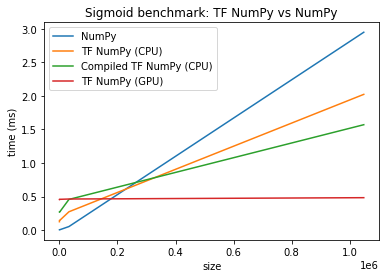

Although there are many approaches to creating deep learning models these days, [TensorFlow](http://tensorflow.org) is one of the most widely known ones. Two days ago, they released **TensorFlow 2.4.0-rc0**, a TF pre-release, with a lot of major features and improvements. In this article, we're welcoming TensorFlow 2.4.0 and look at what's changed.

**Update 05/Nov/2020:** fixed quite a bit of spelling issues. Sorry about that!

* * *

\[toc\]

* * *

## Major Features and Improvements

According to the [GitHub release page](https://github.com/tensorflow/tensorflow/releases/tag/v2.4.0-rc0), TensorFlow 2.4.0 will have these major features and improvements:

- Experimental support will be added to `tf.distribute` for training your Keras models asynchronously. A `ParameterServerStrategy` was added for this purpose. Below, we'll cover this in more detail.
- The `MultiWorkerMirroredStrategy` was moved into stable, and is no longer experimental. Many bug fixes have been applied in between the experimental and stable APIs. With the strategy, you can distribute your training process across many GPUs across many worker machines.
- A new module called `tf.experimental.numpy` was added - and it's a NumPy-compatible API for writing TensorFlow programs. We'll cover it below in more detail.
- Support for `TensorFloat-32` was added on Ampere based GPUs.
- The Keras `Functional` API was refactored in a major way. While the refactor primarily targeted the internals, some functions have changed on the outside as well.
- The `tf.keras.mixed_precision` API was moved into stable, allowing you to use 16-bit floats during training.
- Changes to TF Profiler were made; also, TFLite Profiler is available for Android. Below, we'll cover them in more detail.
- TensorFlow `pip` packages now require you to have installed CUDA11 and cuDNN 8.0.2 onto your system.

* * *

## Changes in more detail

Let's take a look at the major features/improvements in more detail :)

### Keras async training

While many people who start with TensorFlow train their neural networks on just one machine with one GPU, it is possible to extend your training setup in multiple ways:

- You can use multiple GPUs on your machine.
- You can use a [cloud setup](https://www.machinecurve.com/index.php/2020/10/16/tensorflow-cloud-easy-cloud-based-training-of-your-keras-model/) for using multiple GPUs on multiple machines.

How you setup your training process can be configured by a **distribution strategy**, available through the `tf.distribute` API in TensorFlow. Now, a new strategy was added - called `ParameterServerStrategy`:

```
tf.distribute.experimental.ParameterServerStrategy(
    cluster_resolver, variable_partitioner=None
)
```

Generally, if you would use a cluster of machines for training your neural network, you would do so in a data-parallel way, by splitting your dataset into multiple batches, [training instances of the same model with those batches](https://www.machinecurve.com/index.php/2020/10/22/distributed-training-tensorflow-and-keras-models-with-apache-spark/#data-parallelism-vs-model-parallelism), and subsequently aggregating the parameters changes into a change in the full model.

This can be done **synchronously** and **asynchronously**, which differs in the way how model variables of the _full model_ are updated.

> _Synchronous_, or more commonly _sync_, training is where the updates from each replica are aggregated together before updating the model variables. This is in contrast to _asynchronous_, or _async_ training, where each replica updates the model variables independently. You may also have replicas partitioned into groups which are in sync within each group but async between groups.
> 
> TensorFlow (n.d.)

The `ParameterServerStrategy` introduces **parameter server training** and hence asynchronous training to TensorFlow, which allows you to use a cluster of workers and parameter servers.

> As a result, failures of some workers do not prevent the cluster from continuing the work, and this allows the cluster to train with instances that can be occasionally unavailable (e.g. preemptible or spot instances).
> 
> TensorFlow (n.d.)

This greatly boosts parallel training, especially now that Amazon has released [EC P4d Instances](https://aws.amazon.com/ec2/instance-types/p4/) for Machine Learning, which run in AWS EC2 UltraClusters.

### Into stable: MultiWorkerMirroredStrategy

A synchronous method that [used to be experimental](https://www.machinecurve.com/index.php/2020/10/16/tensorflow-cloud-easy-cloud-based-training-of-your-keras-model/#multiworkermirroredstrategy), called the `MultiWorkerMirroredStrategy`, is being moved from experimental into stable (TensorFlow, n.d.):

```
tf.distribute.MultiWorkerMirroredStrategy(
    cluster_resolver=None, communication_options=None
)
```

Using the distribution strategy, you can train your model in a setup across **multiple workers, each with potentially multiple GPUs**. This is a strategy that can be employed in [cloud-based training](https://www.machinecurve.com/index.php/2020/10/16/tensorflow-cloud-easy-cloud-based-training-of-your-keras-model/).


Photo by **[Manuel Geissinger](https://www.pexels.com/@artunchained?utm_content=attributionCopyText&utm_medium=referral&utm_source=pexels)** from **[Pexels](https://www.pexels.com/photo/interior-of-office-building-325229/?utm_content=attributionCopyText&utm_medium=referral&utm_source=pexels)**.

### Experimental TensorFlow NumPy-compatible API

New to TensorFlow in version 2.4.0 is the `tensorflow.experimental.numpy` API:

> This module provides a subset of NumPy API, built on top of TensorFlow operations. APIs are based on and have been tested with NumPy 1.16 version.
> 
> TensorFlow (n.d.)

As a **subset of NumPy**, i.e. not all components are implemented and more will be added later, it is fully interoperable with NumPy. In addition, as it is built on top of TensorFlow, the API interoperates seamlessly with TensorFlow.

The reason why this was added seems to be **performance**, mainly.

- TensorFlow Numpy uses highly optimized TensorFlow kernels dispatchable on CPUs, GPUs and TPUs.
- Compiler optimizations are also performed.

Generally, it seems to be the case that if your NumPy workloads have complex operations, performance benefits become clear. For smaller or not-so-complex workloads, TensorFlow (n.d.) suggests to still use NumPy instead.

Here is a comparison for a [Sigmoid](https://www.machinecurve.com/index.php/2019/09/09/implementing-relu-sigmoid-and-tanh-in-keras/) activation function implemented with NumPy and TensorFlow NumPy:



Credits: [TensorFlow (n.d.)](https://www.tensorflow.org/guide/tf_numpy). Licensed under the [Creative Commons Attribution 4.0 License](https://creativecommons.org/licenses/by/4.0/), no changes were made.

### TensorFloat-32 on Ampere based GPUs

Data can be represented with many types of math - using `integers`, for example, but also 32-bit floating-point numbers i.e. `float32` are possible. Generally, floating-point math is _precise_ but also comes at a cost: many bits and hence lots of memory are necessary for training and eventually deploying your machine learning model.

Earlier this year, **TensorFloat-32 was introduced** and was made the new math mode in the new A100 GPUs from NVIDIA, which run on the Ampere architecture.

> TensorFloat-32 is the new math mode in [NVIDIA A100 GPUs](http://www.nvidia.com/a100) for handling the matrix math also called tensor operations used at the heart of AI and certain HPC applications.
> 
> NVIDIA (2020)

Floating-point math utilizes a significand, base and exponent to represent a number (Wikipedia, n.d.):

\[latex\]significand \\times base^{exponent}\[/latex\]

TensorFloat-32 (TF32) improves upon regular 32-bits floating-point numbers (FP32) by reducing the bit size for the float significand (a.k.a. mantissa) and exponent, making computation less resource intensive, boosting speed and capabilities of a GPU.

> TF32 uses the same 10-bit mantissa as the half-precision (FP16) math, shown to have more than sufficient margin for the precision requirements of AI workloads. And TF32 adopts the same 8-bit exponent as FP32 so it can support the same numeric range.
> 
> NVIDIA (2020)

TensorFlow 2.4.0 adds support for TF32 format for Ampere based GPUs; it is enabled by default.

### Keras Functional API refactoring

Those who are used to creating Keras models know that there are two main approaches to creating one - using the more rigid but accessible `Sequential API` or the more flexible but relatively difficult `Functional` API.

The table below gives a small example for a `model` and the subsequent addition of one `Dense` layer for the Sequential and Functional APIs.

<table><tbody><tr><td><code>model&nbsp;=&nbsp;Sequential()<br>model.add(Dense(256,&nbsp;activation='relu',&nbsp;input_shape=input_shape))</code></td><td><code>inputs&nbsp;=&nbsp;keras.Input(shape=input_shape)<br>outputs&nbsp;&nbsp;=&nbsp;Dense(256,&nbsp;activation="relu")(inputs)<br>model&nbsp;=&nbsp;keras.Model(inputs=inputs,&nbsp;outputs=outputs)</code></td></tr></tbody></table>

Constructing a model and adding the layer in the Sequential (left) and Functional (right) APIs.

In TensorFlow 2.4.0, the Functional API had a major refactor, making it more reliable, stable and performant when constructing Keras models.

While the **refactor mostly involved internals**, some external calls might require a change - check the [breaking changes section of the release](https://github.com/tensorflow/tensorflow/releases/tag/v2.4.0-rc0) to see if this is applicable to your model.


Photo by **[Fernando Arcos](https://www.pexels.com/@ferarcosn?utm_content=attributionCopyText&utm_medium=referral&utm_source=pexels)** from **[Pexels](https://www.pexels.com/photo/under-construction-signage-on-laptop-keyboard-211122/?utm_content=attributionCopyText&utm_medium=referral&utm_source=pexels)**

### Into stable: Keras mixed precision API

Recall the floating-point arithmetic that we covered above. Also recall that floating-point numbers increase precision compared to integers, but also require more bits.

Generally speaking, 32-bit floats and 16-bit floats are used for this purpose. They do however present a trade-off: using `float32` format is more stable, while `float16` is faster. Using `tensorflow.keras.mixed_precision`, it was already possible to **combine both 16-bit and 32-bit floating point types**.

> Mixed precision is the use of both 16-bit and 32-bit floating-point types in a model during training to make it run faster and use less memory. By keeping certain parts of the model in the 32-bit types for numeric stability, the model will have a lower step time and train equally as well in terms of the evaluation metrics such as accuracy.
> 
> TensorFlow (n.d.)

Using mixed precision, training your model could become faster without losing too much performance in terms of accuracy and so on. With TensorFlow 2.4.0, `tensorflow.keras.mixed_precision` was moved from `experimental` into `stable`.

### TensorFlow Profiler changes

If you want to understand why your TensorFlow model performs in a certain way, e.g. because you have changed hardware, you can use the [TensorFlow Profiler](https://www.tensorflow.org/guide/profiler):

> Use the tools available with the Profiler to track the performance of your TensorFlow models. See how your model performs on the host (CPU), the device (GPU), or on a combination of both the host and device(s).
> 
> Profiling helps you understand the hardware resource consumption (time and memory) of the various TensorFlow operations (ops) in your model and resolve performance bottlenecks and ultimately, make the model execute faster.
> 
> TensorFlow (n.d.)

Note from above that the strategy was moved into `stable`. This requires that the Profiler is adapted for a multi-worker strategy as well. In TensorFlow 2.4.0, the Profiler [adds support](https://www.tensorflow.org/guide/profiler#profiling_apis) for a multi-worker setup:

```
# E.g. your worker IP addresses are 10.0.0.2, 10.0.0.3, 10.0.0.4, and you
# would like to profile for a duration of 2 seconds.
tf.profiler.experimental.client.trace(
    'grpc://10.0.0.2:8466,grpc://10.0.0.3:8466,grpc://10.0.0.4:8466',
    'gs://your_tb_logdir',
    2000)
```

_(Credits for the code snippet: TensorFlow, licensed under the [Apache 2.0 license](https://www.apache.org/licenses/LICENSE-2.0))_

In addition, a [TensorFlow Lite Profiler for Android](https://www.tensorflow.org/lite/performance/measurement#trace_tensorflow_lite_internals_in_android) is now available.

### TensorFlow pip packages CUDA/cuDNN change

Finally, from TensorFlow 2.4.0 onwards, `pip` packages are now built with different CUDA and cuDNN versions:

- **CUDA:** 11
- **cuDNN:** 8.0.2

* * *

## Summary

In this article, we said hello to TensorFlow version 2.4.0, which is now available in pre-release, and looked at its major features and improvements. Generally speaking, new things focus on distributed training, model optimization and library optimization (through a major refactor of the Functional API). Really new is the addition of the `tensorflow.experimental.numpy` API, which brings an interoperable subset of NumPy functionality to TensorFlow, for performance reasons.

I hope that you've learnt something new today. Please don't hesitate to drop a comment in the comments section below if you have any questions 💬 Please do the same if you have other comments. Thank you for reading MachineCurve today and happy engineering! 😎

* * *

## References

_TensorFlow, the TensorFlow logo and any related marks are trademarks of Google Inc._

TensorFlow. (n.d.). _Releases · TensorFlow/TensorFlow_. GitHub. [https://github.com/tensorflow/tensorflow/releases](https://github.com/tensorflow/tensorflow/releases)

TensorFlow. (n.d.). _Tf.distribute.experimental.ParameterServerStrategy_. [https://www.tensorflow.org/api\_docs/python/tf/distribute/experimental/ParameterServerStrategy?version=nightly](https://www.tensorflow.org/api_docs/python/tf/distribute/experimental/ParameterServerStrategy?version=nightly)

TensorFlow. (n.d.). _Module: Tf.distribute_. [https://www.tensorflow.org/api\_docs/python/tf/distribute](https://www.tensorflow.org/api_docs/python/tf/distribute)

TensorFlow. (n.d.). _Tf.distribute.MultiWorkerMirroredStrategy_. [https://www.tensorflow.org/api\_docs/python/tf/distribute/MultiWorkerMirroredStrategy](https://www.tensorflow.org/api_docs/python/tf/distribute/MultiWorkerMirroredStrategy)

TensorFlow. (n.d.). _Module: Tf.experimental.numpy_. [https://www.tensorflow.org/api\_docs/python/tf/experimental/numpy](https://www.tensorflow.org/api_docs/python/tf/experimental/numpy)

NVIDIA. (2020, May 18). _NVIDIA blogs: Tensorfloat-32 accelerates AI training HPC upto 20x_. The Official NVIDIA Blog. [https://blogs.nvidia.com/blog/2020/05/14/tensorfloat-32-precision-format/](https://blogs.nvidia.com/blog/2020/05/14/tensorfloat-32-precision-format/)

Wikipedia. (2001, November 11). _Floating-point arithmetic_. Wikipedia, the free encyclopedia. Retrieved November 5, 2020, from [https://en.wikipedia.org/wiki/Floating-point\_arithmetic](https://en.wikipedia.org/wiki/Floating-point_arithmetic)

TensorFlow. (n.d.). _Mixed precision_. [https://www.tensorflow.org/guide/mixed\_precision](https://www.tensorflow.org/guide/mixed_precision)

TensorFlow. (n.d.). _Optimize TensorFlow performance using the profiler_. [https://www.tensorflow.org/guide/profiler](https://www.tensorflow.org/guide/profiler)
