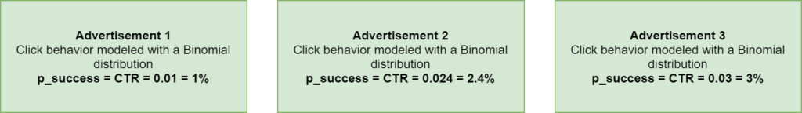
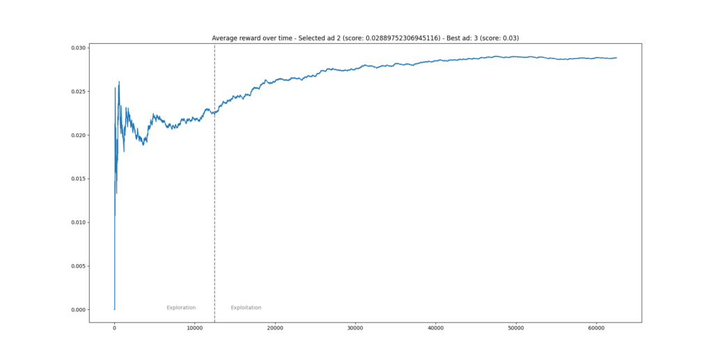

The hardened Machine Learning professional knows that there are three key branches of ML: supervised learning, unsupervised learning and reinforcement learning. In the latter, agents learn to translate state and possibly other internal knowledge into decisions - which impact state, and by consequence, influence the agent's next decision.

In a way, this is how humans operate.

The class of **Multi-Armed Bandits** is a simple way of looking at Reinforcement Learning. In this article, we're going to take a look at a simple form of these bandits - the **A/B/n testing scenario**. This is a generalization of A/B testing to multiple choices. It's simple because it does not use state - it only learns from rewards for a particular action in the past. In that way, it's also single-step; it does not look beyond the decision that is currently to be made. However, while simplicity gets you up to speed quickly, there are drawbacks too. We're going to cover everything - including a **step-by-step Python example** for implementing your own A/B/n test.

Are you ready? Let's take a look! 😎

* * *

\[toc\]

* * *

## About Multi-Armed Bandits and A/B/n testing

Before we're going to write code, let's take a look at what a **Multi-Armed Bandit or MAB problem** actually is:

> \[A multi-armed bandit problem\] is a problem in which a fixed limited set of resources must be allocated between competing (alternative) choices in a way that maximizes their expected gain, when each choice's properties are only partially known at the time of allocation, and may become better understood as time passes or by allocating resources to the choice.
> 
> Wikipedia (2005)

Quite a complex definition! Broken apart, it means that:

- There is a fixed limited set of resources. In other words, at every run, a choice must be made.
- The choice is between competing choices, meaning that we can only choose one (or a few), but not all choices.
- While doing so, we must maximize our gain, or make choices so that we profit in the best possible way - always selecting the good choices while leaving the poor ones.
- However, we're not fully aware about what is the best choice - we may learn so over time.

We've now arrived at the **exploration/exploitation** **dilemma** that is continuously present within Reinforcement Learning. Recall from the definition that we always want to make the best possible choice. However, at the beginning, we don't even know what the best possible choice is. We must learn that! In other words, we must first _explore_ all possible choices, until we can _exploit_ our knowledge with a reasonable amount of certainty.

Where to break off exploration in favor of exploitation, or even choosing to do so (it's also possible to mix both together in multiple ways, as we shall look at in further articles about ε-greedy MABs and Thompson Sampling) must be set in a good way. In essence, this is also a MAB problem in itself :)

### The advertising scenario

In the remainder of this article, we're going to work on creating our own A/B/n test. We do so with an **advertising setting**, which is actually a very common setting for A/B/n tests. Suppose that we have a website (like MachineCurve) where ads must be shown. We don't know anything about the user and we don't collect any data in order to understand the user better. Still, we'd love to maximize our revenue, which can be done by maximizing the amount of clicks per amount of views - or the **click-through rate (CTR)**.

This is a classic MAB problem. At the start, we simply have three ads, and we don't know anything about their performance. We'll have to _explore_ their performance first, before we can show the best ad to our visitors, and _exploit_ our knowledge to _maximize_ our revenue.

Suppose that these are the three ads. To allow comparison afterwards, we model them to have Binomial distributions with success probabilities (or CTRs) of 1%, 2.4% and 3%, respectively. A Binomial distribution effectively represents a trial (in our case, just _one_ - showing the ad) where the outcome is (1 - success - click) with some probability `p`, and (0 - fail - no click) with probability `1 - p`. In other words, for our three ads, the odds that someone clicks on the ad will be 1%, 2.4% and 3%, respectively, but _we don't know this officially_.



Let's know take a look at modeling this with Python.

* * *

## Creating a Multi-Armed Bandit for A/B/n testing with Python

Building a MAB for A/b/n testing with Python involves the following steps:

1. Importing all the dependencies, which are just two in our case.
2. Representing an ad: creating a `SimpleAdvertisement` class which can be shown.
3. Generating three `SimpleAdvertisements`.
4. Setting the variables for our A/B/n scenario.
5. The exploration phase - finding which ad performs best experimentally.
6. The exploitation phase - maximizing profits with the best ad.
7. Plotting the results.

### Importing dependencies

The first step would be to import our dependencies. For today's code, you'll only rely on `numpy` for numbers processing and `matplotlib` for visualizing the outcomes. Both can be installed with `pip`, through `pip install numpy`, for example.

```
import numpy as np
import matplotlib.pyplot as plt
```

### Representing an advertisement: `SimpleAdvertisement` class

The next step is to represent the blueprint of an advertisement. If you look at what such an ad should do - it should display. Displaying should return a reward, which is either a click or no click.

Recall that we generate clicks following a [Binomial distribution](https://en.wikipedia.org/wiki/Binomial_distribution) which returns 1 (success) with probability `p`. For that reason, we allow configurable `p`s to be passed in the constructor, which we then use to generate a reward when the advertisement is shown in `show`.

```
class SimpleAdvertisement():
    """ Representation of a simple advertisement."""
    
    def __init__(self, p):
        """
        Constructor. Set p value for the binomial distribution
        that models user click behavior for this advertisement. 
        A p-value represents the odds of a click, 0 <= p <= 1.
        """
        self.p = p

    def show(self):
        """
        Fictitiously show an advertisement. Return a reward:
        either 0 (no click) or 1 (click). Draw just once (n)
        and draw successfully (click) with probability p.
        """
        return np.random.binomial(n=1, p=self.p)
```

### Generating three ads

Let's now generate three ads and put them in a list. Note that each advertisement has a different parameter: `0.01` for ad 1, `0.024` for ad 2 and `0.03` for ad 3. Indeed, these are the CTRs that we saw above - or in other words, the `p values` which represent the probability that our binomial sample returns a `1` (click).

```
# Generate the advertisements
advertisement_one = SimpleAdvertisement(0.01)
advertisement_two = SimpleAdvertisement(0.024)
advertisement_three = SimpleAdvertisement(0.03)
advertisements = [advertisement_one, advertisement_two, advertisement_three]
```

### Setting scenario variables

Now that you have created the advertisements, you can set the global variables for our A/B/n test. The number of tests represents the number of exploration iterations in which the best ad is chosen. The number of production runs represents the number of subsequent exploitation iterations in which we continue with the chosen ad, to find a final score. Of course, we hope that this score approximates the CTR of `0.03`, which is that of our best-performing ad.

Number of ads is simply the number of advertisements created - three. The average rewards over time list is used for storing the average reward after every exploration/exploitation step, so that we can generate a plot later. The reward sum is indeed a sum of all the rewards, and the `N_impres` represents the number of impressions.

What's left is the `Q_values`. This is an important term in Reinforcement Learning problems and hence also in MAB problems. A **Q-value**, also called **action value**, represents a weighted average of all rewards over time, and is a measure of how well a certain choice performs. You'll see that our task involves picking the ad with the highest Q-value!

```
# Set the scenario's variables
num_tests = 12500
num_prod  = 50000
num_ads = len(advertisements)
average_rewards_over_time = []
N_impres = np.zeros(num_ads, dtype=np.int)
Q_values = np.zeros(num_ads)
reward_sum = 0
```

### The exploration phase: A/B/n testing

We've now arrived at the **exploration phase**. In this phase, we run our tests and continuously update the Q values given the reward we received after picking an advertisement, so that we can pick the best-performing advertisement later.

In the code below, this happens:

- We iterate over the number of tests, as indicated before.
- We randomly choose one of the advertisements, and set its object reference.
- We show the advertisement and observe whether we have a click (a reward of 1) or no click (a reward of 0).
- We then update the number of impressions for the advertisement and the Q value. As you can see with the Q value, we _add_ the difference between the reward and the current Q value, but in a _weighted_ way - as the number of impressions increases, the less important this Q value update is.
- Finally, we increase the reward sum, compute the average reward over time and append it to all average rewards observed so far.

```
def a_b_n_test(num_test, ads):
    """ Run A/B/n testing phase. """
    global reward_sum
    # Iterate over the test range.
    for test in range(num_test):
        # Pick an advertisement at random.
        chosen_ad_idx = np.random.randint(len(ads))
        chosen_ad = ads[chosen_ad_idx]
        # Observe reward for advertisement [click = 1, no click = 0]
        reward = chosen_ad.show()
        # Increase counter for ad and Q/action value
        N_impres[chosen_ad_idx] = N_impres[chosen_ad_idx] + 1
        Q_values[chosen_ad_idx] += (1 / N_impres[chosen_ad_idx]) * (reward- Q_values[chosen_ad_idx])
        # Increase total reward
        reward_sum += reward
        average_reward_so_far = reward_sum / (test + 1)
        average_rewards_over_time.append(average_reward_so_far)
```

### The exploitation phase: running the chosen ad in production

In the **exploitation phase**, we have selected an ad which we can now run in production. We'll actually pick the best ad from the exploration phase when merging everything together a bit more below, but let's take a look at the code for running the advertisement in production first.

```
def a_b_n_prod(num_prod, best_ad):
    """ Run the best ad in production. """
    global reward_sum
    # Iterate over the test range.
    for prod in range(num_prod):
        # Observe reward for advertisement [click = 1, no click = 0]
        reward = best_ad.show()
        # Increase total reward
        reward_sum += reward
        average_reward_so_far = reward_sum / (prod + num_tests + 1)
        average_rewards_over_time.append(average_reward_so_far)
```

As you can see, we run a number of iterations - `num_prod`. Using the best advertisement, we observe another reward, with which we increase the reward sum and add the average rewards over time.

### Plotting the results

Before we merge everything together, there's only one thing left - and that is merging everything together.

As you can see below, using `matplotlib`, we plot the average rewards over time. Precisely at the cutoff point between the exploration and exploitation phases (which in our case is after `num_tests = 12500` iterations), we draw a vertical line and write some text, to indicate the change in behavior. Finally, we set a title.

```
def plot_phases(selected_ad, selected_ad_score):
    """
    Plot the reward for the exploration and exploitation phases.
    """
    plt.plot(average_rewards_over_time)
    plt.axvline(x=num_tests, linestyle='--', color='gray') # Plot vertical line at cutoff for exploration
    plt.text(num_tests-6000, 0, 'Exploration', color='gray')
    plt.text(num_tests+2000, 0, 'Exploitation', color='gray')
    plt.title(f"Average reward over time - Selected ad {selected_ad} (score: {selected_ad_score}) - Best ad: 3 (score: 0.03)")
    plt.show()
```

### Merging everything together

Next up is merging everything together. In the `ad_scenario()` def, you'll actually create the scenario, and run the exploration and exploitation phases. As you can see:

1. You first run the `a_b_n_test` or exploration scenario on _all_ advertisements.
2. Using the Q values, you pick the index of the best-performing ad, and display it on screen.
3. You then pick the ad using this `best_ad_index` and run it in production for `num_prod` iteratinos.
4. The overall ad performance is printed on screen.
5. And a plot is generated.

```
def ad_scenario():
    """
    Run an advertisement based A/B/n Multi-Armed Bandit scenario.
    Select the best out of three ads, specified above, then run
    in production. The proper ad was chosen if the average reward
    over time approximates the highest p value (0.03) chosen 
    with the advertisements at the top of this code.
    """
    # 1. Run A/B/n test (exploration) on advertisements
    a_b_n_test(num_tests, advertisements)
    # 2. Pick best ad after testing
    best_ad_index = np.argmax(Q_values)
    print("="*50)
    print(f"Best-performing advertisement after exploration is Ad {best_ad_index+1}")
    print("="*50)
    print(f"Score board:")
    for i in range(len(advertisements)):
        print(f"> Ad {i+1} - {Q_values[i]}")
    print("="*50)
    # 3. Run the ad in production
    a_b_n_prod(num_prod, advertisements[best_ad_index])
    # 4. Print overall ad performance
    print(f"Global average reward over time: {average_rewards_over_time[-1]}")
    print("="*50)
    # 5. Plot the performance
    plot_phases(best_ad_index, Q_values[best_ad_index])


if __name__ == '__main__':
    ad_scenario()
```

### Results and how to improve upon simple A/B/n testing

Now, it's time to run the code. Quite quickly, you should observe the following:

[](https://www.machinecurve.com/wp-content/uploads/2021/10/ad.png)

After exploration, **advertisement 2** was the best-performing advertisement (with a CTR of `0.0288` or 2.88%). Recall that the best ad is actually **advertisement 3**, with a CTR of 3%. In this case, while the CTR is close, you could have done better!

This is one of the drawbacks of a simple A/B/n test: you have to configure the length of the exploration phase yourself. It can be too long, and then you waste precious amounts of time selecting a candidate that could have already been running in production. It can also be too short, which is the case above, and then you lose money - because you wanted to be too fast.

While quick, it's also dirty, and another drawback of this method is that selected choices (in this case, our selected advertisement) can no longer be changed in the exploitation phase. Indeed, once chosen, you're stuck with a potentially underperforming choice. Finally, during exploration, you'll quickly note that some ads perform quite poorly. As you select advertisements at random during that phase, you'll keep seeing these ads come by - even though you know that they perform worse than your top candidates. With a regular A/B/n test, you cannot drop such ads, unnecessarily lengthening your exploration phase.

Methods like ε-greedy MABs and Thompson Sampling help you make better choices regarding the exploration/exploitation trade-off. We'll cover them in future articles.

* * *

## References

Wikipedia. (2005, October 7). _Multi-armed bandit_. Wikipedia, the free encyclopedia. Retrieved October 4, 2021, from [https://en.wikipedia.org/wiki/Multi-armed\_bandit](https://en.wikipedia.org/wiki/Multi-armed_bandit)
