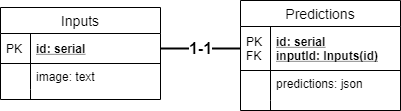
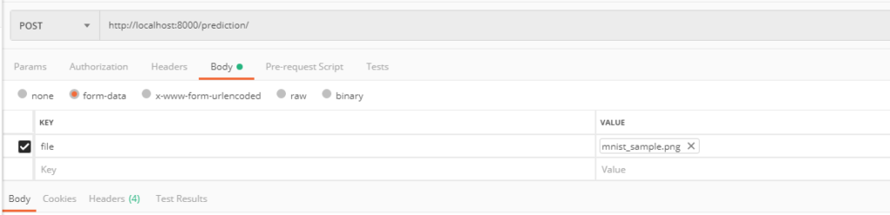
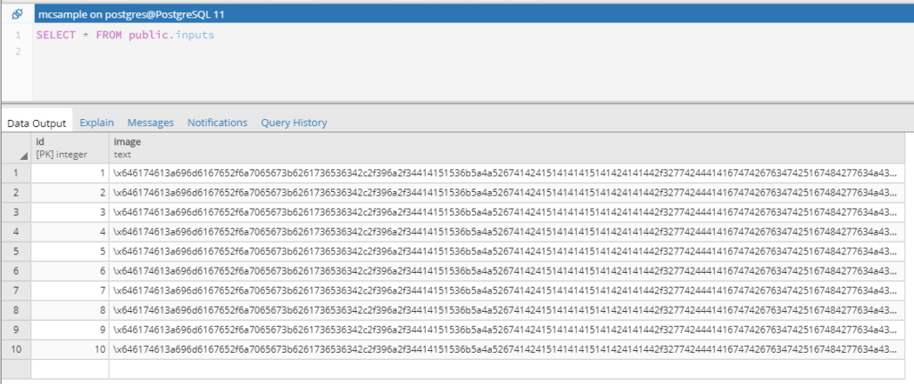
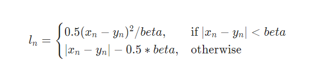
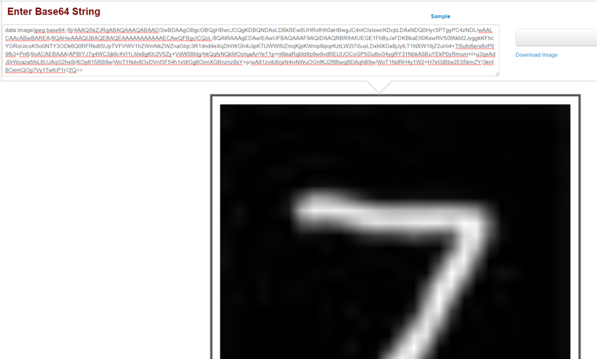

In a previous blog post, we looked at how we could deploy a Keras model [by means of an API](https://www.machinecurve.com/index.php/2020/03/19/tutorial-how-to-deploy-your-convnet-classifier-with-keras-and-fastapi/). That is, once it's ready, we wrap an internet-ready environment around it, so that we can use it in the field - for generating predictions. This way, we can really use our model!

In that blog post, we actually got an MNIST-trained ConvNet running, having it generate the correct predictions for any numeric inputs that we fed it.

Now, while deploying the model with an API is a nice achievement, we can do more. For example, we might be interested in all the predictions that are generated with the machine learning model when it's deployed in the field. We thus have to add some kind of data storage to make this work. Let's do this!

In today's blog post, we'll be using the code [that we created before](https://www.machinecurve.com/index.php/2020/03/19/tutorial-how-to-deploy-your-convnet-classifier-with-keras-and-fastapi/#full-model-code) and extend it - by means of a PostgreSQL database, so that we can store the predictions. Now, as this might be new territory for you, let me warn you in advance: PostgreSQL databases, or relational databases in general, aren't good choices when you'll be using your model in high-volume settings - like, big data big settings. They will simply fail and there are other solutions for that. But I do think that stepping from a simple machine learning model to solutions such as CassandraDB or Hadoop based appending is a bridge too far. It simply won't allow you to understand _why_ SQL databases have limits when it comes to vast quantities of data. That's why we'll do this post anyway :)

So, what we're going to do is this:

- We'll be documenting the flow of data. That is, we discuss the model we're going to deploy, the deployment itself - for those who haven't read that other blog post - and eventually how data is moved into the SQL database.
- We'll be discussing how to set up a basic SQL database for storing predictions. This includes that discussion about data volume through the benefits and drawbacks of relational databases - consistency and, surprisingly, consistency ;-) We also discuss why we use PostgreSQL here.
- Then, we'll take a look at how PostgreSQL and Python can be linked. We discuss things like SQL injection, why this must be avoided at all cost and how the tools we'll use can help you achieve this.
- Having covered all the theory, we move on to the interesting part - actually writing some code! We'll take the code we wrote for deploying our Keras model with FastAPI and extend it with storing the predictions into our PostgreSQL database. What's more, we'll also make a call with which we can retrieve all predictions, and one where we can retrieve one in particular.
- We then run it altogether and see how everything works.

I hope it'll benefit you. Let's go! 😎

* * *

\[toc\]

* * *

## Today's flow: model → deployment → predictions into SQL database

During the supervised machine learning process, you [feed forward](https://www.machinecurve.com/index.php/2019/10/04/about-loss-and-loss-functions/#the-high-level-supervised-learning-process) samples, which result in predictions, which results in a loss value, which results in optimization during yet another iteration.

Eventually, you end up with a machine learning model that works well - and if you do it well, it works _really_ well. That's the **model** stage of today's flow. We're not going to show you here how you can train a machine learning model. For example, take a look at [this blog post](https://www.machinecurve.com/index.php/2020/03/30/how-to-use-conv2d-with-keras/) if you wish to understand this in more detail. Rather, we'll be using the end result to demonstrate how to insert the predictions into a database.

Now, that's the first step. If you want your model to work well in real life, you'll have to deploy it. You can deploy it in a web application, for example. For deployments like those, you need a means - and a REST API can be one of the means that allows your frontend web application to communicate with the machine learning model. In another blog post, we already [wrapped a FastAPI REST API around a Keras machine learning model](https://www.machinecurve.com/index.php/2020/03/19/tutorial-how-to-deploy-your-convnet-classifier-with-keras-and-fastapi/).

That's the **deployment** stage of today's development flow.

The third and final stage will be the new one: **inserting the predictions into a SQL database**. SQL databases are a class of databases that can be considered relational in nature, and are hence called Relational Database Management Systems (RDBMS). In such databases, you create "entities" (for example a Bus and a TimeTable), and subsequently create relationships between the individual instances (say, bus "9301" has this "timetable"). This is a common format for representing everyday objects and it's therefore unsurprising that it's one of the most widely used database paradigms today.

Now, you might wonder, what is SQL? It's a _language_ (Wikipedia, 2001). In more detail, it's a language for _querying_ relational databases - and it stands for Structured Query Language. It allows you to insert, update, delete and select values to or from the database. For example, if we wanted to add a new bus:

```
INSERT INTO buses (bus_no) VALUES ('9302');
```

Yet another bus added in a language that is understandable for humans. Let's now pinpoint this discussion to setting up a SQL database for storing predictions made by our deployed machine learning model.

* * *

## Setting up a basic SQL database for storing predictions

A common thing in the software industry is the mantra that standards (and, by extension, technologies) are always extended...because everyone wants to rule the world.

As mentioned, this does apply to technologies too. The open source Operating System Linux [has an enormous amount of variations](https://en.wikipedia.org/wiki/List_of_Linux_distributions) available, some of which remain open source, others of which are proprietary.

[](https://www.machinecurve.com/wp-content/uploads/2020/04/standards.png)

Source - [xkcd: Standards](https://xkcd.com/927/)

The same is true for relational databases. We have MySQL, we have Oracle, we have MariaDB, and so on.

### Why PostgreSQL?

But for me, the winner is always PostgreSQL. I've come from a MariaDB background and while it was certainly good too, PostgreSQL really trumps it. It's open source - which means that you don't have to worry about integrating it with your software stack. It's extensible - for example, there is an extremely mature GIS module available for PostgreSQL, allowing you to use native data types and easily convert between the enormous amount (see the pattern?) of coordinate systems available throughout the world. Third of all, it also supports _non-relational_ data types like JSON (Chiessi, 2018).

### Our database design

When I make a database design, I always take a look at the _objects_ that we're trying to process into the database.

Take that buses scenario from above. Clearly, the classes of objects (or entities, in database terms) that we'd have to model if we were drawing a diagram for that scenario are Buses and TimeTables. It could easily be extended with, say, Drivers, and so on - but this isn't a blog about buses. You do however now get the point.

Now back to our machine learning scenario. When we read the [FastAPI blog post](https://www.machinecurve.com/index.php/2020/03/19/tutorial-how-to-deploy-your-convnet-classifier-with-keras-and-fastapi/), we can derive a few interesting pointers that suggest some entities that can be modeled by us:

- **Predictions:** this will be the key entity. It's also clear what it does - store the predictions made for some input.
- **Inputs:** that gets us to the second most important class. While not strictly necessary, it can be wise to store the inputs too. In our case, those would be the images that were fed to the machine learning model. While strictly speaking it _might not be wise to store images in relational databases directly_ (there are better solutions for that, e.g. object storage), we're not going to make our post more confusing than it should be.

#### The diagram

Let's now take a look at the diagram in more detail. This is what I came up with for today's blog post:



A fairly simple database model. We have two tables: **Inputs** and **Predictions**.

The Inputs table has a primary key (a unique identifier) called `id` and allows us to store the `image`, as text. Why as text, you might wonder? Well: because we'll convert the [input image](https://www.machinecurve.com/index.php/2020/03/19/tutorial-how-to-deploy-your-convnet-classifier-with-keras-and-fastapi/#defining-the-prediction-route) into Base64 format - so that we can easily store, retrieve and view it again afterwards.

Then, the Predictions table. It has a unique identifier as well, but also a foreign key to the Inputs table. It essentially links the Predictions to the Input. It also has a `predictions` attribute of type `json`, which stands for JavaScript Object Notation. We choose this data type because the _structure of our predictions depends on the model we're deploying_. For example, in the [tutorial](https://www.machinecurve.com/index.php/2020/03/19/tutorial-how-to-deploy-your-convnet-classifier-with-keras-and-fastapi/#defining-the-prediction-route), we have a model that utilizes [Softmax](https://www.machinecurve.com/index.php/2020/01/08/how-does-the-softmax-activation-function-work/) to generate a probability distribution over 10 classes. Not every model does this, so we need a generic data type for storing our predictions. JSON does the trick. Now, you might wonder - why don't you use a SQL array? I thought about this, and chose JSON, because SQL arrays would make it more difficult to deploy regression models, which simply generate a numeric value. However, if you're really keen on SQL arrays, you're free to adapt the code that we will write later! :)

### Creating our database and tables in the database

Now, assuming that you have installed [PostgreSQL](https://www.postgresql.org/download/) onto your system, as well as [PgAdmin](https://www.pgadmin.org/download/) or a different PostgreSQL client, it's time to create your database. First, if you don't understand how to create a database from here, it might be wise to take a look at this video:

https://www.youtube.com/watch?v=lG2Nes-wi54

Source: [Creating a PostgreSQL database with pgAdmin and logging into it - Denys on Data](https://www.youtube.com/watch?v=lG2Nes-wi54)

Once you're logged in, it's time to execute the SQL queries for generating the database:

```
CREATE TABLE Inputs (
  id serial PRIMARY KEY,
  image text
);

CREATE TABLE Predictions (
  id serial PRIMARY KEY,
  inputId integer,
  predictions json,
  FOREIGN KEY (inputId) REFERENCES Inputs(id)
);
```

### The benefit of relational databases: consistency

All right, now that we have a functioning database, we _could_ move on to the code.

But I think that's not so much of a good idea for the simple reason that you'll need to understand why PostgreSQL (and any relational database) is useful for scenarios where your data volumes aren't _too high_.

Too high here meaning big data high. But first, let's take a look at why we _would_ use relational databases in the first place.

If you're already working in an organization, you'll likely know that _data is a mess_. Various proprietary technologies that have been used for years and are now extremely outdated? Common practice. Various standards being patched every time? Not uncommon. And so on. Massive ERP systems that will deliver you grey hairs? Yep, I understand your frustration. Data is a pain in the ass.

But generally, _within_ a relational database, the problem shouldn't be too big. Instead, here, we benefit from the _consistency_ principle of a relational database. This principle simply means that all data is consistent, and the database ensures that it is. That is, each input is processed accordingly, no data is lost, and no data is linked ("related") in wrong ways.

This is a great benefit, because you don't want your bus to depart with the wrong time table, the wrong driver, and so on. You neither want your ML prediction to be linked to the wrong input, or not even inserted at all, generating an orphan input in the database. That's great!

### The drawback of relational databases: consistency, and what it means for volume

...but it's also a drawback. The fact that consistency emerges in relational database means that it _takes time to process new inputs_. Not much time, but too much time to handle the massive data volumes that we see today. For example, for platforms like YouTube or Facebook, using relational database technologies at the core of what they're doing simply doesn't work. They need something bigger.

One of the solutions that we don't cover today is CassandraDB. It gives up strict consistency for availability. While it's always available, it might not always give back the correct result - but the likelihood for this is very low. It's just the trade-off we need to make when creating solutions for big data.

But enough about Cassandra for now. Let's put our focus back onto what we were doing: inserting the predictions generated by our FastAPI machine learning model into a PostgreSQL database.

* * *

## PostgreSQL and Python: how does it work?

For today's blog post, we're going to be using the [psycopg2 database adapter](https://pypi.org/project/psycopg2/). This adapter links Python code with your PostgreSQL database and can be installed very easily, with `pip install psycopg2`.

Before we start, there's just one thing we'll have to check first: SQL injection, and why to avoid it.

### SQL injection: what it is and why to avoid it

Let's take a look at this comic from xkcd, which is very popular in the world of programmers:

[](https://www.machinecurve.com/wp-content/uploads/2020/04/exploits_of_a_mom.png)

Source - [xkcd: Exploits of a Mom](https://xkcd.com/327/)

It's a classic example of SQL injection.

Wikipedia describes it as follows:

> **SQL injection** is a code injection technique, used to attack data-driven applications, in which malicious SQL statements are inserted into an entry field for execution (e.g. to dump the database contents to the attacker).
> 
> [Wikipedia (2004)](https://en.wikipedia.org/wiki/SQL_injection)

In the comic above, all students were removed from the system because the school's software was not protected well against SQL injection :)

We don't want this to happen to our inputs and predictions, for obvious reasons. We'll have to protect our API against SQL injection, as that's the _attack vector_ for those attacks in our case.

Fortunately, if used right, `psycopg2` sanitizes your queries automatically for you. Read [here](https://www.psycopg.org/docs/usage.html#query-parameters) more about what you must definitely _not_ do when using this adapter.

Let's now extend the previous FastAPI code with some PostgreSQL based calls!

* * *

## Extending our previous FastAPI deployment code with PostgreSQL

Before we extend our code, I think it might be nice to take a look at what we have so far. Here it is - we'll discuss it below the code:

```
# Imports
from fastapi import FastAPI, File, UploadFile, HTTPException
from PIL import Image
from pydantic import BaseModel
from tensorflow.keras.models import load_model
from typing import List
import io
import numpy as np
import sys

# Load the model
filepath = './saved_model'
model = load_model(filepath, compile = True)

# Get the input shape for the model layer
input_shape = model.layers[0].input_shape

# Define the FastAPI app
app = FastAPI()

# Define the Response
class Prediction(BaseModel):
  filename: str
  contenttype: str
  prediction: List[float] = []
  likely_class: int

# Define the main route
@app.get('/')
def root_route():
  return { 'error': 'Use GET /prediction instead of the root route!' }

# Define the /prediction route
@app.post('/prediction/', response_model=Prediction)
async def prediction_route(file: UploadFile = File(...)):

  # Ensure that this is an image
  if file.content_type.startswith('image/') is False:
    raise HTTPException(status_code=400, detail=f'File \'{file.filename}\' is not an image.')

  try:
    # Read image contents
    contents = await file.read()
    pil_image = Image.open(io.BytesIO(contents))

    # Resize image to expected input shape
    pil_image = pil_image.resize((input_shape[1], input_shape[2]))

    # Convert from RGBA to RGB *to avoid alpha channels*
    if pil_image.mode == 'RGBA':
      pil_image = pil_image.convert('RGB')

    # Convert image into grayscale *if expected*
    if input_shape[3] and input_shape[3] == 1:
      pil_image = pil_image.convert('L')

    # Convert image into numpy format
    numpy_image = np.array(pil_image).reshape((input_shape[1], input_shape[2], input_shape[3]))

    # Scale data (depending on your model)
    numpy_image = numpy_image / 255

    # Generate prediction
    prediction_array = np.array([numpy_image])
    predictions = model.predict(prediction_array)
    prediction = predictions[0]
    likely_class = np.argmax(prediction)

    return {
      'filename': file.filename,
      'contenttype': file.content_type,
      'prediction': prediction.tolist(),
      'likely_class': likely_class
    }
  except:
    e = sys.exc_info()[1]
    raise HTTPException(status_code=500, detail=str(e))
```

In short, this code...

- Loads the Keras model that we trained [earlier](https://www.machinecurve.com/index.php/2020/03/30/how-to-use-conv2d-with-keras/).
- Starts a FastAPI app, which is a REST API.
- Defines the response and generates a warning to the root route that the API must be used differently.
- Specifies a `POST /prediction` route which (1) makes the input image uniform and (2) generates the actual predictions, returning them in the API response.

### Storing inputs and predictions

Let's first extend this code with storing the prediction. For this to work, we'll need to add a few more imports at the top:

```
import psycopg2
import base64
from io import BytesIO
import json
```

Well, for the first, we know what it does. We need the second and third in order to convert the input image into Base64 format, which is one way of storing the input data (see 'database diagram' above for a bit of elaboration on why I chose this format). Then, we also need `json`, for storing the predictions later on.

Then, directly below the `app = FastAPI()` statement, we make the connection to our database:

```
# Make a connection to the database
conn = psycopg2.connect("dbname=mcsample user=postgres password=postgres")
```

You can specify any [database parameter](https://www.postgresqltutorial.com/postgresql-python/connect/) you want.

We then specify two new definitions - `store_input` and `store_prediction`:

```
# Store an input image
def store_input(image):
  # Convert input into Base64
  buffered = BytesIO()
  image.save(buffered, format='JPEG')
  img_str = base64.b64encode(buffered.getvalue())
  img_base64 = bytes("data:image/jpeg;base64,", encoding='utf-8') + img_str
  base_string = img_base64.decode("utf-8")
  # Create a cursor
  cur = conn.cursor()
  # Define the query
  sql = """INSERT INTO inputs(image)
            VALUES(%s) RETURNING id;"""
  # Perform the query
  cur.execute(sql, (base_string,))
  # Get the input id
  input_id = cur.fetchone()[0]
  # Commit and close
  conn.commit()     
  cur.close()
  # Return the input id
  return input_id

# Store a prediction
def store_prediction(prediction, input_id):
  # Convert prediction into json
  prediction = json.dumps(prediction.tolist())
  # Create a cursor
  cur = conn.cursor()
  # Define the query
  sql = """INSERT INTO predictions(inputId, predictions)
            VALUES(%s, %s) RETURNING id;"""
  # Perform the query
  cur.execute(sql, (input_id,prediction))
  # Get the prediction id
  prediction_id = cur.fetchone()[0]
  # Commit and close
  conn.commit()     
  cur.close()
  # Return the prediction id
  return prediction_id
```

The flow is relatively equal in both cases: we take the input, create what is known as a "cursor", define the query, and execute it, before closing the cursor again. Then, we return the identifier of the newly stored input or prediction.

Just before the return statement in our `POST /prediction` call, we add these lines of code:

```
# Store the input
input_id = store_input(pil_image)
    
# Store the prediction
prediction_id = store_prediction(prediction, input_id)
```

Now, all predictions should be stored to the database. But let's extend it a little bit more!

### Retrieving all predictions from the database

The next thing we'll specify is a _new call_ - `GET /predictions`. It simply retrieves all predictions from the database:

```
# Get all predictions
@app.get('/predictions/')
def get_predictions():
  # Create a cursor
  cur = conn.cursor()
  # Define the query
  sql = """SELECT * FROM predictions ORDER BY id DESC;"""
  # Perform the query
  cur.execute(sql)
  # Get the predictions
  predictions = cur.fetchall()
  # Commit and close
  conn.commit()     
  cur.close()
  # Return the predictions
  return predictions
```

### Retrieving one prediction by id

Sometimes, though, you only want to retrieve _just one_ prediction, instead of all of them. In that case, we should also add some code for that.

```
# Get all predictions
@app.get('/prediction/{prediction_id}')
def get_prediction(prediction_id: str):
  # Create a cursor
  cur = conn.cursor()
  # Define the query
  sql = """SELECT p.predictions, i.image 
           FROM predictions p, inputs i
           WHERE p.inputId = i.id
            AND p.id = %s;"""
  # Perform the query
  cur.execute(sql,(prediction_id,))
  # Get the prediction
  prediction = cur.fetchone()
  # Commit and close
  conn.commit()     
  cur.close()
  # Check if we have a prediction
  if prediction is not None:
    return prediction
  else:
    return {
      'message': f'No prediction with id {prediction_id} could be found'
    }
```

### Full code

In total, this yields the following code:

```
# Imports
from fastapi import FastAPI, File, UploadFile, HTTPException
from PIL import Image
from pydantic import BaseModel
from tensorflow.keras.models import load_model
from typing import List
import io
import numpy as np
import sys
import psycopg2
import base64
from io import BytesIO
import json

# Load the model
filepath = './saved_model'
model = load_model(filepath, compile = True)

# Get the input shape for the model layer
input_shape = model.layers[0].input_shape

# Define the FastAPI app
app = FastAPI()

# Make a connection to the database
conn = psycopg2.connect("dbname=mcsample user=postgres password=aime")

# Define the Response
class Prediction(BaseModel):
  filename: str
  contenttype: str
  prediction: List[float] = []
  likely_class: int

# Define the main route
@app.get('/')
def root_route():
  return { 'error': 'Use GET /prediction instead of the root route!' }

# Store an input image
def store_input(image):
  # Convert input into Base64
  buffered = BytesIO()
  image.save(buffered, format='JPEG')
  img_str = base64.b64encode(buffered.getvalue())
  img_base64 = bytes("data:image/jpeg;base64,", encoding='utf-8') + img_str
  base_string = img_base64.decode("utf-8")
  # Create a cursor
  cur = conn.cursor()
  # Define the query
  sql = """INSERT INTO inputs(image)
            VALUES(%s) RETURNING id;"""
  # Perform the query
  cur.execute(sql, (base_string,))
  # Get the input id
  input_id = cur.fetchone()[0]
  # Commit and close
  conn.commit()     
  cur.close()
  # Return the input id
  return input_id

# Store a prediction
def store_prediction(prediction, input_id):
  # Convert prediction into json
  prediction = json.dumps(prediction.tolist())
  # Create a cursor
  cur = conn.cursor()
  # Define the query
  sql = """INSERT INTO predictions(inputId, predictions)
            VALUES(%s, %s) RETURNING id;"""
  # Perform the query
  cur.execute(sql, (input_id,prediction))
  # Get the prediction id
  prediction_id = cur.fetchone()[0]
  # Commit and close
  conn.commit()     
  cur.close()
  # Return the prediction id
  return prediction_id

# Define the /prediction route
@app.post('/prediction/', response_model=Prediction)
async def prediction_route(file: UploadFile = File(...)):

  # Ensure that this is an image
  if file.content_type.startswith('image/') is False:
    raise HTTPException(status_code=400, detail=f'File \'{file.filename}\' is not an image.')

  try:
    # Read image contents
    contents = await file.read()
    pil_image = Image.open(io.BytesIO(contents))

    # Resize image to expected input shape
    pil_image = pil_image.resize((input_shape[1], input_shape[2]))

    # Convert from RGBA to RGB *to avoid alpha channels*
    if pil_image.mode == 'RGBA':
      pil_image = pil_image.convert('RGB')

    # Convert image into grayscale *if expected*
    if input_shape[3] and input_shape[3] == 1:
      pil_image = pil_image.convert('L')

    # Convert image into numpy format
    numpy_image = np.array(pil_image).reshape((input_shape[1], input_shape[2], input_shape[3]))

    # Scale data (depending on your model)
    numpy_image = numpy_image / 255

    # Generate prediction
    prediction_array = np.array([numpy_image])
    predictions = model.predict(prediction_array)
    prediction = predictions[0]
    likely_class = np.argmax(prediction)
    
    # Store the input
    input_id = store_input(pil_image)
    
    # Store the prediction
    prediction_id = store_prediction(prediction, input_id)

    return {
      'filename': file.filename,
      'contenttype': file.content_type,
      'prediction': prediction.tolist(),
      'likely_class': likely_class,
      'input_id': input_id,
      'prediction_id': prediction_id
    }
  except:
    e = sys.exc_info()[1]
    raise HTTPException(status_code=500, detail=str(e))
  
# Get all predictions
@app.get('/predictions/')
def get_predictions():
  # Create a cursor
  cur = conn.cursor()
  # Define the query
  sql = """SELECT * FROM predictions ORDER BY id DESC;"""
  # Perform the query
  cur.execute(sql)
  # Get the predictions
  predictions = cur.fetchall()
  # Commit and close
  conn.commit()     
  cur.close()
  # Return the predictions
  return predictions

# Get all predictions
@app.get('/prediction/{prediction_id}')
def get_prediction(prediction_id: str):
  # Create a cursor
  cur = conn.cursor()
  # Define the query
  sql = """SELECT p.predictions, i.image 
           FROM predictions p, inputs i
           WHERE p.inputId = i.id
            AND p.id = %s;"""
  # Perform the query
  cur.execute(sql,(prediction_id,))
  # Get the prediction
  prediction = cur.fetchone()
  # Commit and close
  conn.commit()     
  cur.close()
  # Check if we have a prediction
  if prediction is not None:
    return prediction
  else:
    return {
      'message': f'No prediction with id {prediction_id} could be found'
    }
```

* * *

## Running it altogether

Let's now see if we can run it :) As with the [FastAPI tutorial](https://www.machinecurve.com/index.php/2020/03/19/tutorial-how-to-deploy-your-convnet-classifier-with-keras-and-fastapi/), we [run it with uvicorn](https://www.machinecurve.com/index.php/2020/03/19/tutorial-how-to-deploy-your-convnet-classifier-with-keras-and-fastapi/#running-the-deployed-model). Open up a terminal, `cd` to the directory where your `main.py` file is stored (it's the file we created with the FastAPI instance, so if you don't have it yet because you started here, create one with your code) and execute `uvicorn main:app --reload`. Then, the app should start:

```
uvicorn main:app --reload
INFO:     Uvicorn running on http://127.0.0.1:8000 (Press CTRL+C to quit)
INFO:     Started reloader process [20780]
2020-04-13 12:19:41.537433: I tensorflow/stream_executor/platform/default/dso_loader.cc:44] Successfully opened dynamic library cudart64_100.dll
2020-04-13 12:19:44.494767: I tensorflow/stream_executor/platform/default/dso_loader.cc:44] Successfully opened dynamic library nvcuda.dll
2020-04-13 12:19:45.353113: I tensorflow/core/common_runtime/gpu/gpu_device.cc:1618] Found device 0 with properties:
name: GeForce GTX 1050 Ti with Max-Q Design major: 6 minor: 1 memoryClockRate(GHz): 1.4175
pciBusID: 0000:01:00.0
2020-04-13 12:19:45.360620: I tensorflow/stream_executor/platform/default/dlopen_checker_stub.cc:25] GPU libraries are statically linked, skip dlopen check.
2020-04-13 12:19:45.367452: I tensorflow/core/common_runtime/gpu/gpu_device.cc:1746] Adding visible gpu devices: 0
2020-04-13 12:19:45.371210: I tensorflow/core/platform/cpu_feature_guard.cc:142] Your CPU supports instructions that this TensorFlow binary was not compiled to use: AVX AVX2
2020-04-13 12:19:45.387313: I tensorflow/core/common_runtime/gpu/gpu_device.cc:1618] Found device 0 with properties:
name: GeForce GTX 1050 Ti with Max-Q Design major: 6 minor: 1 memoryClockRate(GHz): 1.4175
pciBusID: 0000:01:00.0
2020-04-13 12:19:45.408220: I tensorflow/stream_executor/platform/default/dlopen_checker_stub.cc:25] GPU libraries are statically linked, skip dlopen check.
2020-04-13 12:19:45.414763: I tensorflow/core/common_runtime/gpu/gpu_device.cc:1746] Adding visible gpu devices: 0
2020-04-13 12:19:46.094212: I tensorflow/core/common_runtime/gpu/gpu_device.cc:1159] Device interconnect StreamExecutor with strength 1 edge matrix:
2020-04-13 12:19:46.099454: I tensorflow/core/common_runtime/gpu/gpu_device.cc:1165]      0
2020-04-13 12:19:46.102651: I tensorflow/core/common_runtime/gpu/gpu_device.cc:1178] 0:   N
2020-04-13 12:19:46.107943: I tensorflow/core/common_runtime/gpu/gpu_device.cc:1304] Created TensorFlow device (/job:localhost/replica:0/task:0/device:GPU:0 with 2998 MB memory) -> physical GPU (device: 0, name: GeForce GTX 1050 Ti with Max-Q Design, pci bus id: 0000:01:00.0, compute capability: 6.1)
INFO:     Started server process [24148]
INFO:     Waiting for application startup.
INFO:     Application startup complete.
```

Time to go!

### Generating a prediction

Generating a new prediction is not done differently than [previously](https://www.machinecurve.com/index.php/2020/03/19/tutorial-how-to-deploy-your-convnet-classifier-with-keras-and-fastapi/#running-the-deployed-model):

[](https://www.machinecurve.com/wp-content/uploads/2020/03/image-2.png)

[](https://www.machinecurve.com/wp-content/uploads/2020/03/image-1.png)

Yielding the correct prediction indeed:

```
{
    "filename": "mnist_sample.png",
    "contenttype": "image/png",
    "prediction": [
        0.0004434768052306026,
        0.003073320258408785,
        0.008758937008678913,
        0.0034302924759685993,
        0.0006626666290685534,
        0.0021806098520755768,
        0.000005191866875975393,
        0.9642654657363892,
        0.003465399844571948,
        0.013714754022657871
    ],
    "likely_class": 7
}
```

This time, though, it's also stored in the database:

[](https://www.machinecurve.com/wp-content/uploads/2020/04/image-4.png)

And so are the predictions:

[](https://www.machinecurve.com/wp-content/uploads/2020/04/image-5.png)

### Retrieving the predictions

Time to check our next calls: retrieving all predictions and just one. As expected, `GET /predictions` nicely returns all the predictions that were stored in our database:


Whereas the `GET /prediction/{id}` call, say `GET /prediction/4`, nicely returns the prediction as well as the Base64 input image:

[](https://www.machinecurve.com/wp-content/uploads/2020/04/image-7.png)

Which, using an online [Base64 image decoder](https://codebeautify.org/base64-to-image-converter), can be converted into the original input again:

[](https://www.machinecurve.com/wp-content/uploads/2020/04/image-8.png)

Nice! We have a working database storage for our machine learning predictions! :)

* * *

## Summary

In this blog post, we looked at how to store the predictions generated by your Keras machine learning model into a PostgreSQL database. For this, we looked at the generic flow from training the model towards storing the predictions after deployment first. This was followed by a brief introduction to relational database management systems and PostgreSQL in particular.

Afterwards, we designed our database schema, looked at the PostgreSQL/Python connector to be used and extended the Python code for model deployment that we created previously. It allows us to store the predictions into the database, while also retrieving all predictions or just one.

I hope you've learnt something today! If you did, I'd appreciate it if you left a comment in the comments section below 👇 Please do the same if you have any questions or remarks. Thank you for reading MachineCurve today and happy engineering! 😎

* * *

## References

Wikipedia. (2001, June 28). _SQL_. Wikipedia, the free encyclopedia. Retrieved April 12, 2020, from [https://en.wikipedia.org/wiki/SQL](https://en.wikipedia.org/wiki/SQL)

Chiessi, L. (2018, September 21). _Why should I use PostgreSQL as database in my startup/Company_. Medium. [https://medium.com/we-build-state-of-the-art-software-creating/why-should-i-use-postgresql-as-database-in-my-startup-company-96de2fd375a9](https://medium.com/we-build-state-of-the-art-software-creating/why-should-i-use-postgresql-as-database-in-my-startup-company-96de2fd375a9)

Wikipedia. (2004, March 14). _SQL injection_. Wikipedia, the free encyclopedia. Retrieved April 13, 2020, from [https://en.wikipedia.org/wiki/SQL\_injection](https://en.wikipedia.org/wiki/SQL_injection)
