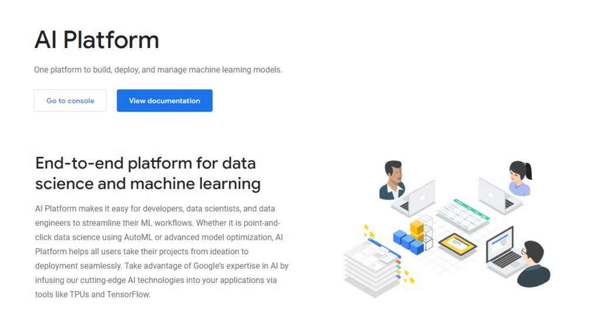
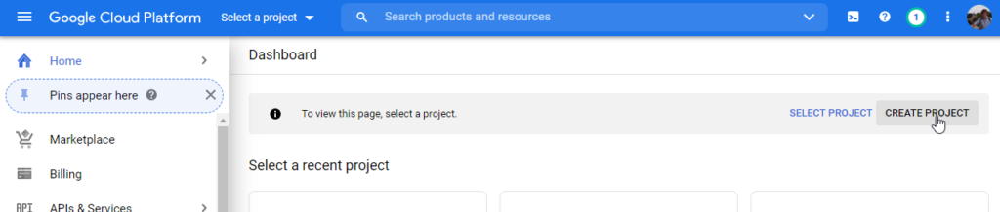
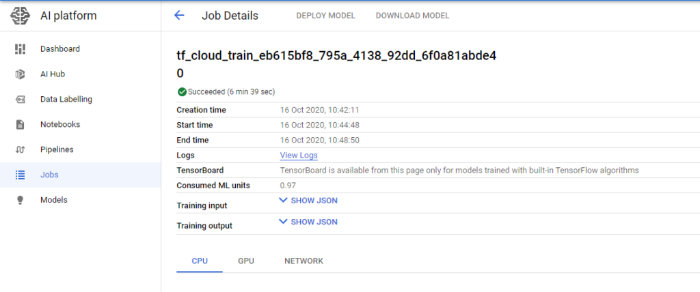
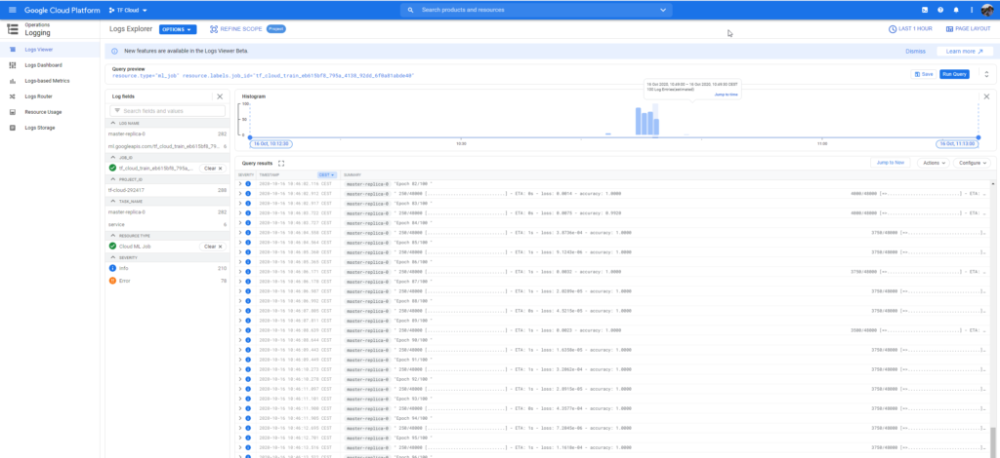

Training a supervised machine learning model does often require a significant amount of resources. With ever-growing datasets and models that continuously become deeper and sometimes wider, the computational cost of getting a well-performing model increases day after day. That's why it's sometimes not worthwhile to train your model on a machine that is running on-premise: the cost of buying and maintaining such a machine doesn't outweigh the benefits.

In those cases, cloud platforms come to the rescue. By means of various service offerings, many cloud vendors - think Amazon Web Services, Microsoft Azure and Google Cloud Platform - have pooled together resources that can be used and paid for as you use them. For example, they allow you to train your model with a few heavy machines, while you simply turn them off after you've finished training your model. In many cases, the limited costs of this approach (especially compared to the cost of owning and maintaining a heavy-resource machine) really makes training your models off-premises worthwhile.

Traditionally, training a model in the cloud hasn't been stupidly easy. TensorFlow Cloud changes this. By simply connecting to the Google Cloud Platform, with a few lines of code, it allows you to train your Keras models in the cloud. This is great, because a training job can even be started from your own machine. What's more, if desired, TensorFlow Cloud supports parallelism - meaning that you can use _multiple_ machines for training, all at once! While training a model in the cloud was not difficult before, doing so distributed was.

In this article, we'll be exploring TensorFlow Cloud in more detail. Firstly, we'll be looking at the need for cloud-based training, by showing the need for training with heavy equipment as well as the cost of getting such a device. We then also argue for why cloud services can help you reduce the cost without losing the benefits of such heavy machinery. Subsequently, we introduce the Google Cloud AI Platform, with which TensorFlow Cloud connects for training your models. This altogether gives us the context we need for getting towards the real work.

The real work, here, is TensorFlow cloud itself. We'll introduce it by looking at the TensorFlow Cloud API and especially at the cloud strategies that can be employed, allowing you to train your model in a distributed way. After the introduction, we will show how TensorFlow Cloud can be installed and linked to your Keras model. Finally, we demonstrate how a Keras model can actually be trained in the cloud. This concludes today's article.

Let's take a look! :)

**Update 02/Nov/2020:** fixed issue with file name in Step 2.

* * *

\[toc\]

* * *

## The need for cloud-based training: resources required for training

Deep learning has been very popular for eight years now, as of 2020. Especially in the fields of Computer Vision and Natural Language Processing, deep learning models have outperformed previously state-of-the-art non-ML approaches. In many cases

For example, only today, I was impressed because the municipality of my nation's capital - Amsterdam - has trained and deployed deep learning models to detect garbage alongside the road, or to detect whether people maintain mandatory social distancing measures against the [COVID-19 pandemic](https://www.machinecurve.com/index.php/2020/03/17/help-fight-covid-19-participate-in-the-cord-19-challenge/). They in fact used a variety of open source frameworks and libraries, _and_ pretrained models - a great feat!

Now, they also argued that training some of the models was costly in terms of the computational resources that are required. For example, in a case study where a data engineer showed how a model was created for detecting bicycle road signs on road pavement, he argued that approximately 150 GB of data was to be used for training. It cost three full hours to train the model on four NVIDIA Tesla V100 GPUs, which are one of the fastest currently on the market.

With a cost of approximately $11.500 for just **one** 32GB GPU (and hence $46k), the investment would be enormous if you were to purchase a machine for your deep learning workloads. For $46k, you only have the GPUs! Now, even worse, it's very likely that you wouldn't run deep learning workloads for 24/7, all the time between the 'go live' moment and the end-of-life of the purchased hardware.

This is in effect a waste of money.

Cloud vendors, such as Amazon Web Services, Digital Ocean, Microsoft Azure and Google Cloud Platform have recognized this matter and have very competitive offerings available for deep learning workloads. For example, at the time of writing, a 64GB EC2 P3 machine with Amazon costs only $12.24 per hour. Yes: those 3 hours of training would now cost less than $40. That makes training worthwhile!

* * *

## Training ML models in Google Cloud AI Platform

Google's offering for training deep learning models is embedded in the [Google Cloud AI Platform](https://cloud.google.com/ai-platform). It's one platform to build, deploy and manage machine learning models, as the introductory text argues:



In fact, it supports multiple phases. At a high level, the AI Platform provides functionality for **preparing your dataset**, **building your model**, **validating your model** and **deploying your model**. Effectively, it allows you to do these things in the individual stages:

- **Prepare stage:** labeling your dataset as well as storing and retrieving it to and from Google BigQuery.
- **Build:** playing around with code in Notebooks, training your models on highly powered machines, and applying AutoML functionality for [training automation](https://www.machinecurve.com/index.php/2020/06/09/automating-neural-network-configuration-with-keras-tuner/).
- **Validate:** once a model is trained, the AI Platform allows you to perform activities related to explainable AI, and black-box optimization with a tool called Vizier.
- **Deploy:** once trained, validated and considered ready for production usage, a model can be deployed through Google too.


Today, we will be using only a minor part of the AI Platform: from the **build** step, we'll be using the highly powered machines to train our model with. In addition, we'll be using the [Google Cloud Container Registry](https://cloud.google.com/container-registry) to temporarily store the Docker image that we'll build with TensorFlow Cloud, to be run by the AI Platform machines. As we're now talking about TensorFlow Cloud, let's inspect it in more detail, before we move on to actual coding stuff :)

* * *

## The next five years of Keras: introducing TensorFlow Cloud

In early 2020, during the Scaled Machine Learning Conference, there was a talk by François Chollet - the creator of the Keras framework that is being widely used for training deep learning models today.

Below, you can see the talk, but in it, Chollet argued that three key developments will drive the next five years of Keras development:

1. **Automation**
2. **Scale & Cloud**
3. **Into the real world**

https://www.youtube.com/watch?v=HBqCpWldPII

### Automating models & applying them in the real world

Here, with **automation**, Chollet means that developments like [automated hyperparameter tuning](https://www.machinecurve.com/index.php/2020/06/09/automating-neural-network-configuration-with-keras-tuner/), architecture search and even Automated Machine Learning (AutoML) will help commoditize the field of Machine Learning. Gone will be the days where practicing Deep Learning will be considered a field only accessible to people who are highly familiar with mathematics and complex programming. No, instead, the ML power user (and perhaps even the more introductory user!) will provide a dataset and desired model outcomes, and some automation program will find the best set of architectural and hyper-architectural principles to apply.

With **into the real world**, Chollet argues that future Keras developments will focus on getting Deep Learning models _out there_. By packaging data preprocessing with the model, to give just an example, models can be run in the field much more robustly. In addition, it's likely that edge equipment shall be used more often, requiring the need to [optimize models](https://www.machinecurve.com/index.php/tag/model-optimization/).

And so on, and so on!

### Scaling & cloud-based training

However, related to this blog post is **scaling the model and training them in the cloud**. Chollet argues that it's sometimes better to _not_ train models on-premise, for the reason that clouds provide services dedicated to training your models efficiently. We saw that training a deep learning model will be fastest when you have a heavyweight GPU in your machine. It becomes even faster by having many of such GPUs and applying a local distributed training strategy. However, it's unlikely that your deep learning machine runs 24/7, making it inefficient in terms of the total cost of ownership for such a machine.

That's why in the video, Chollet introduced **TensorFlow Cloud**. It's a means for training your TensorFlow model in the cloud. In fact, the [TensorFlow Cloud GitHub page](https://github.com/tensorflow/cloud) describes it as follows:

> The TensorFlow Cloud repository provides APIs that will allow to easily go from debugging, training, tuning your Keras and TensorFlow code in a local environment to distributed training/tuning on Cloud.
> 
> TensorFlow/cloud (n.d.)

Let's now take a look at those APIs, or primarily, the TensorFlow Cloud `run` API.

### The TensorFlow Cloud API

Within the `tensorflow_cloud` module that will be available upon installing TensorFlow Cloud (we will get to that later), a definition called `run` is available in order to let your model train in the cloud. This definition will do multiple things:

1. Making your Keras code cloud ready (TensorFlow/cloud, n.d.)
2. Packaging your model code into a [Docker container](https://www.machinecurve.com/index.php/2020/10/07/easy-install-of-jupyter-notebook-with-tensorflow-and-docker/#what-is-docker) which can be deployed in the cloud for training.
3. Subsequently, deploying this container and training the model with the TensorFlow training (distribution) strategy of your choice.
4. Write logs to a cloud-hosted [TensorBoard](https://www.machinecurve.com/index.php/2019/11/13/how-to-use-tensorboard-with-keras/).

Here is the arguments list of the `def` - we'll describe the arguments soon, and show an example later in this article:

```
def run(
    entry_point=None,
    requirements_txt=None,
    docker_config="auto",
    distribution_strategy="auto",
    chief_config="auto",
    worker_config="auto",
    worker_count=0,
    entry_point_args=None,
    stream_logs=False,
    job_labels=None,
    **kwargs
):
    """Runs your Tensorflow code in Google Cloud Platform.
```

Those are the arguments:

- The **entry\_point** describes where TensorFlow Cloud must pick up your Python code (e.g. a file called `keras.py`) or your [Notebook](https://www.machinecurve.com/index.php/2020/10/07/easy-install-of-jupyter-notebook-with-tensorflow-and-docker/) (`*.ipynb`) for preprocessing and packaging it into a Docker container.
- The **requirements\_txt** (optional) is the file path to a file called `requirements.txt` where you can specify additional `pip` packages to be installed.
- The **docker\_config** (optional) allows you to configure additional settings for the Docker container. For example, by configuring the `base_image`, you can specify a custom Docker image to start with as base image, and with `image_build_bucket` you can specify a bucket where Google Cloud Platform stores the built container if you choose to build it in the cloud. It defaults to 'auto', which means that default settings are used.
- The **distribution\_strategy** (optional) allows you to pick a training strategy for your cloud-based training. Those are distributed TensorFlow training strategies which we will cover in more detail later in this article. By default, it is set to 'auto', which means that an appropriate strategy is automatically inferred based on `chief_config`, `worker_config` and `worker_count`.
- In a distributed training scenario, it is often the case that one machine is the leader whereas others are followers. This ensures that there will be no decision-making issues related to the coordination of information about e.g. the state of a machine. The **chief\_config** allows you to pick the Google Cloud Platform machine type for your 'chief', a.k.a. the leader. By default, it is set to 'auto', which means the deployment of a `COMMON_MACHINE_CONFIGS.T4_1X` machine (8 cpu cores, 30GB memory, 1 Nvidia Tesla T4).
- The **worker\_config** (optional) describes the machine type of your workers, a.k.a. the followers. By default, it is also set to auto, meaning the deployment of a `COMMON_MACHINE_CONFIGS.T4_1X` machine (8 cpu cores, 30GB memory, 1 Nvidia Tesla T4).
- The **worker\_count** (optional) describes the number of workers you want to deploy besides your chief.
- The **entry\_point\_args** (optional), which should be a list of Strings, represents extra arguments to be input to the program run through the `entry_point`.
- If enabled, **stream\_logs** (optional, default False) streams logs back from the training job in the cloud.
- With **job\_labels** (optional), you can specify up to 64 key-value pairs of labels and values that together organize the cloud training jobs. Very useful in a scenario where you'll train a lot of TensorFlow models in the cloud, as you can organize stuff programmatically instead of manually.

### Available machine configurations

For `worker_config` and `chief_config`, there are many out-the-box machine configurations available within [TensorFlow Cloud](https://github.com/tensorflow/cloud/blob/master/src/python/tensorflow_cloud/core/machine_config.py):

```
COMMON_MACHINE_CONFIGS = {
    "CPU": MachineConfig(
        cpu_cores=4,
        memory=15,
        accelerator_type=AcceleratorType.NO_ACCELERATOR,
        accelerator_count=0,
    ),
    "K80_1X": MachineConfig(
        cpu_cores=8,
        memory=30,
        accelerator_type=AcceleratorType.NVIDIA_TESLA_K80,
        accelerator_count=1,
    ),
    "K80_4X": MachineConfig(
        cpu_cores=16,
        memory=60,
        accelerator_type=AcceleratorType.NVIDIA_TESLA_K80,
        accelerator_count=4,
    ),
    "K80_8X": MachineConfig(
        cpu_cores=32,
        memory=120,
        accelerator_type=AcceleratorType.NVIDIA_TESLA_K80,
        accelerator_count=8,
    ),
    "P100_1X": MachineConfig(
        cpu_cores=8,
        memory=30,
        accelerator_type=AcceleratorType.NVIDIA_TESLA_P100,
        accelerator_count=1,
    ),
    "P100_4X": MachineConfig(
        cpu_cores=16,
        memory=60,
        accelerator_type=AcceleratorType.NVIDIA_TESLA_P100,
        accelerator_count=4,
    ),
    "P4_1X": MachineConfig(
        cpu_cores=8,
        memory=30,
        accelerator_type=AcceleratorType.NVIDIA_TESLA_P4,
        accelerator_count=1,
    ),
    "P4_4X": MachineConfig(
        cpu_cores=16,
        memory=60,
        accelerator_type=AcceleratorType.NVIDIA_TESLA_P4,
        accelerator_count=4,
    ),
    "V100_1X": MachineConfig(
        cpu_cores=8,
        memory=30,
        accelerator_type=AcceleratorType.NVIDIA_TESLA_V100,
        accelerator_count=1,
    ),
    "V100_4X": MachineConfig(
        cpu_cores=16,
        memory=60,
        accelerator_type=AcceleratorType.NVIDIA_TESLA_V100,
        accelerator_count=4,
    ),
    "T4_1X": MachineConfig(
        cpu_cores=8,
        memory=30,
        accelerator_type=AcceleratorType.NVIDIA_TESLA_T4,
        accelerator_count=1,
    ),
    "T4_4X": MachineConfig(
        cpu_cores=16,
        memory=60,
        accelerator_type=AcceleratorType.NVIDIA_TESLA_T4,
        accelerator_count=4,
    ),
    "TPU": MachineConfig(
        cpu_cores=None,
        memory=None,
        accelerator_type=AcceleratorType.TPU_V3,
        accelerator_count=8,
    ),
}
```

### Cloud distribution strategies

We saw that it is possible to pick a particular cloud **distribution strategy** when training a TensorFlow model by means of TensorFlow cloud. A distribution strategy is a common term for those who are already used to distributed training, but then locally, using multiple GPUs in e.g. one or multiple machines.

Here are the cloud distribution strategies available within TensorFlow Cloud. We'll cover them in more detail next:

- **No distribution:** a CPU-based chief without any workers.
- **OneDeviceStrategy:** a GPU-based chief without any workers.
- **MirroredStrategy:** a GPU-based chief with multiple GPUs, without any additional workers.
- **MultiWorkerMirroredStrategy:** a GPU-based chief with multiple GPUs, as well as additional workers
- **TPUStrategy:** a TPU-based config with a chief having 1 CPU and one worker having a TPU.
- **Custom distribution strategy:** picking a custom strategy is also possible, requiring you to turn off TensorFlow Cloud based distribution strategies.

Below, we'll cover those strategies in more detail. The code samples come from the [TensorFlow Cloud GitHub page](https://github.com/tensorflow/cloud) and are licensed under the [Apache License 2.0](https://github.com/tensorflow/cloud/blob/master/LICENSE).

#### No distribution

If you choose to train `some_model.py` in the cloud without any distribution strategy, TensorFlow Cloud will interpret your choice as "I don't want any GPUs to train with". In this case, it will spawn a CPU-based machine - i.e. one chief that runs on a CPU - and trains your model there. This could be an interesting choice from a cost perspective or getting used to using TensorFlow cloud, but it's not the best choice in terms of training a model at scale.

```
tfc.run(entry_point='some_model.py',
        chief_config=tfc.COMMON_MACHINE_CONFIGS['CPU'])
```

#### OneDeviceStrategy

If you choose for a `OneDeviceStrategy`, TensorFlow Cloud will spawn a chief in Google Cloud Platform with one GPU attached. More specifically, it will spawn a `T4_1X` strategy, which means a machine having 8 cpu cores, 30GB memory, and 1 Nvidia Tesla T4. This will already give your training process a significant boost. Remember that by means of `chief_config`, you can choose to use another machine type, e.g. if you want a more powerful GPU.

```
tfc.run(entry_point='some_model.py')
```

#### MirroredStrategy

Choosing a `MirroredStrategy` will equal a mirrored strategy in local distributed training - that is, it will benefit from multiple GPUs on one machine. In this case, a machine will be spawned with 4 V100 GPUs, which will give your training process an enormous boost:

```
tfc.run(entry_point='some_model.py',
        chief_config=tfc.COMMON_MACHINE_CONFIGS['V100_4X'])
```

#### MultiWorkerMirroredStrategy

If that's still not enough, you can also deploy a `MultiWorkerMirroredStrategy`. A mouth full of words, this strategy effectively combines the MirroredStrategy with a multi-device scenario. That is, here, beyond the `chief_config`, you also specify the config of your workers, as well as the number of workers you want. In the example below, one chief will run with one V100 GPU, whereas two workers will be spawned with 8 V100 GPUs each.

This will result in an extremely fast training process, but will also result in significant cost if you still have a substantial training operation. However, so do the other GPU-based and cloud strategies, so choose wisely!

```
tfc.run(entry_point='some_model.py',
        chief_config=tfc.COMMON_MACHINE_CONFIGS['V100_1X'],
        worker_count=2,
        worker_config=tfc.COMMON_MACHINE_CONFIGS['V100_8X'])
```

#### TPUStrategy

If, however, you don't want to train your model with a GPU but with a TPU (a processing unit specifically tailored to Tensors and hence a good choice for training TensorFlow models), you can do so by employing a `TPUStrategy`:

```
tfc.run(entry_point="some_model.py",
        chief_config=tfc.COMMON_MACHINE_CONFIGS["CPU"],
        worker_count=1,
        worker_config=tfc.COMMON_MACHINE_CONFIGS["TPU"])
```

Here, the chief runs with a CPU, while you have one TPU-based worker. At the time of writing, this only works with TensorFlow 2.1, which is the only version currently supported to run with a TPU-based strategy. (Please leave a comment if this is no longer the case, and I'll make sure to adapt!)

#### Custom distribution strategy

Sometimes, all the strategies mentioned before do not meet your requirements. In this case, it becomes possible to define a custom distribution strategy - but you must do so within your model code, as with regular distributed TensorFlow. In order not to have TensorFlow cloud interfere with your custom distribution strategy, you must turn it off in the TF Cloud code:

```
tfc.run(entry_point='some_model.py',
        distribution_strategy=None,
        worker_count=2)
```

* * *

## Installing TensorFlow Cloud

Let's now take a look at how to install TensorFlow Cloud :)

### Step 1: ensure that you meet the dependencies

First of all, it is important that you ensure that you have met all the dependencies for running TensorFlow cloud on your machine. Those dependencies are as follows:

- **Python:** you'll need Python version >= 3.5 (check with `python -V`)
- **TensorFlow**: you'll need TensorFlow 2.x, since you'll train a Keras model.
- **Google Cloud Project**: TensorFlow Cloud will run as this project.
- **An authenticated GCP Service account**: you'll need to authenticate as yourself if you wish to run jobs in the cloud, so you'll also need this.
- **Google AI Platform APIs enabled**: the AI platform is used for the deployment of the built Docker images on the Google Cloud Platform.
- **Docker, or a Google Cloud Storage bucket/Google Cloud Build**: although the creators of TensorFlow Cloud argue that it's better to use Google Cloud Build to build the Docker container, you can optionally do so as well with your local Docker daemon.
- **Authentication to the Docker Container Registry**.
- **Nbconvert** (optional) if you want to train directly from a Jupyter Notebook.

If you **don't** meet the requirements, don't worry. While you will need to install the correct Python version yourself, and will need to create your own Google account, we will take you through all the necessary steps

### Step 2: becoming Google Cloud Ready

The first step is becoming 'cloud ready' with the Google Cloud Platform. We assume that you have already created a Google Account.

Becoming Cloud Ready involves two primary steps:

1. Creating a Google Cloud Project that has the necessary APIs enabled.
2. Creating a GCP service account for authenticating to the cloud from your machine.

#### Step 2A: create a Google Cloud Project with enabled APIs

First, navigate to the [Project Selector page](https://console.cloud.google.com/projectselector2) in the Google Cloud Platform, which looks like this:



Select an existing project or create a new one by clicking 'Create Project'. This should look like this:


Then, make sure to enable billing: you can find out how [here](https://cloud.google.com/billing/docs/how-to/modify-project).

If you have created a Google Cloud Project (e.g. named `TF Cloud`, like me) and have enabled billing, it's time to enable the APIs that we need for running TensorFlow Cloud! Click [here](https://console.cloud.google.com/flows/enableapi?apiid=ml.googleapis.com,compute_component&_ga=2.89617243.1196059648.1602526829-739722337.1600260254), which will allow you to enable the AI Platform Training & Prediction API and the Compute Engine API in your project.


#### Step 2B: creating a GCP service account for authentication

The next step is ensuring that you created what is called a Service Account for authenticating yourself from your machine. This can be done [here](https://console.cloud.google.com/apis/credentials/serviceaccountkey?_ga=2.88036184.1196059648.1602526829-739722337.1600260254). After having navigated to this page, follow the following steps:

1. From the dropdown list **Service account**, click **New service account**.
2. Enter a name in the **Service account name** field.
3. Add the following **Role** items: **Machine Learning Engineer > ML Engine Admin**, and **Storage > Storage Object Admin**. Those roles ensure that you can (1) train your model in the cloud, and (2) store your built container in Google Cloud Storage.
4. Click **Create**. Now, a JSON file containing the key of your service account is downloaded to your computer. Move it into some relatively persistent directory, e.g. `/home/username/tensorflow/credentials.json`.
5. Export the path to the JSON file to `GOOGLE_APPLICATION_CREDENTIALS`:
    1. On Linux or MacOS, run `export GOOGLE_APPLICATION_CREDENTIALS="[PATH]"` in a terminal, with `[PATH]` replaced by the path to your credentials file.
    2. On Windows, open PowerShell (right mouse click on the Start Windows logo, then PowerShell, preferably Admin rights enabled), and run `$env:GOOGLE_APPLICATION_CREDENTIALS="[PATH]"`, with `[PATH`\] replaced by the path to your credentials file. You might also wish to do so via the Start menu, then Environment variables (type this into your Win8/10 search bar), adding the `GOOGLE_APPLICATION_CREDENTIALS` variable in the GUI. Sometimes, this works better than the other way.


### Step 3: install and configure latest TensorFlow Cloud

Now that you have enabled the necessary Google Cloud APIs and have become cloud ready for training your model, it's time to install TensorFlow Cloud. While the steps 1 and 2 looked a bit complex, installing TensorFlow Cloud is really easy and can be done with `pip`:

```
pip install -U tensorflow-cloud
```

### Step 4: install Docker if you don't want to build your containers in the cloud

If you don't want to build the Docker container in which your training job runs in the cloud, you can also build it with a running Docker daemon on your machine. In that case, you must install Docker on your machine. Please find instructions for doing so here: [Get Docker](https://docs.docker.com/get-docker/).

### Step 5: install `nbconvert` if you'll train from a Jupyter Notebook

If you want to train in the cloud from a Jupyter Notebook, you must convert it into a workable format first. [Nbconvert](https://nbconvert.readthedocs.io/en/latest/) can be us ed for this purpose. Hence, if you want to run cloud-based training from a Jupyter Notebook - which is entirely optional, as it can be ran from `.py` files as well - then `nbconvert` must be installed as follows:

```
pip install nbconvert
```

* * *

## Training your Keras model

Now that we have installed TensorFlow Cloud, it's time to look at training the Keras model itself - i.e., in the cloud. This involves four main steps:

1. Creating a Keras model
2. Training it locally, to ensure that it works
3. Adding code for TensorFlow Cloud
4. Running it!

Let's take a look in more detail.

### Step 1: pick a Keras model to train

For training our Keras model in the cloud, we need - well, a Keras model. The model below is a relatively simple [Convolutional Neural Network](https://www.machinecurve.com/index.php/2018/12/07/convolutional-neural-networks-and-their-components-for-computer-vision/), for the creation of which you can find a detailed article [here](https://www.machinecurve.com/index.php/2019/09/17/how-to-create-a-cnn-classifier-with-keras/). Within a few iterations, it can reach significant accuracies on the [MNIST dataset](https://www.machinecurve.com/index.php/2019/12/31/exploring-the-keras-datasets/). Precisely this simplicity is what makes the model easy to follow, and why it's good for an educational setting like this. Obviously, you wouldn't train such easy and simple models in the cloud normally.

Open up your code editor, create a file called `model.py`, and add the following code.

```
import tensorflow
from tensorflow.keras.datasets import mnist
from tensorflow.keras.models import Sequential
from tensorflow.keras.layers import Dense, Dropout, Flatten
from tensorflow.keras.layers import Conv2D, MaxPooling2D

# Model configuration
img_width, img_height = 28, 28
batch_size = 250
no_epochs = 1
no_classes = 10
validation_split = 0.2
verbosity = 1

# Load MNIST dataset
(input_train, target_train), (input_test, target_test) = mnist.load_data()
input_shape = (img_width, img_height, 1)

# Reshape data for ConvNet
input_train = input_train.reshape(input_train.shape[0], img_width, img_height, 1)
input_test = input_test.reshape(input_test.shape[0], img_width, img_height, 1)
input_shape = (img_width, img_height, 1)

# Parse numbers as floats
input_train = input_train.astype('float32')
input_test = input_test.astype('float32')

# Normalize [0, 255] into [0, 1]
input_train = input_train / 255
input_test = input_test / 255

# Convert target vectors to categorical targets
target_train = tensorflow.keras.utils.to_categorical(target_train, no_classes)
target_test = tensorflow.keras.utils.to_categorical(target_test, no_classes)

# Create the model
model = Sequential()
model.add(Conv2D(32, kernel_size=(3, 3), activation='relu', input_shape=input_shape))
model.add(MaxPooling2D(pool_size=(2, 2)))
model.add(Dropout(0.25))
model.add(Conv2D(64, kernel_size=(3, 3), activation='relu'))
model.add(MaxPooling2D(pool_size=(2, 2)))
model.add(Dropout(0.25))
model.add(Flatten())
model.add(Dense(256, activation='relu'))
model.add(Dense(no_classes, activation='softmax'))

# Compile the model
model.compile(loss=tensorflow.keras.losses.categorical_crossentropy,
              optimizer=tensorflow.keras.optimizers.Adam(),
              metrics=['accuracy'])

# Fit data to model
model.fit(input_train, target_train,
          batch_size=batch_size,
          epochs=no_epochs,
          verbose=verbosity,
          validation_split=validation_split)

# Generate generalization metrics
score = model.evaluate(input_test, target_test, verbose=0)
print(f'Test loss: {score[0]} / Test accuracy: {score[1]}')
```

### Step 2: train it locally, but briefly, to see that it works

Before running your model in the cloud, we should ensure that it can train properly. That is, that it loads data properly, that it configures the model properly, and that the training process starts.

This is why we set the `no_epochs` to 1 in the configuration options above. It will train for just one iteration, and will show us whether it works.

Open up a terminal, `cd` to the folder where your `model.py` file is located, and run `python model.py`. If all is well, possibly including the download of the MNIST dataset, you should eventually see the following:

```
48000/48000 [==============================] - 6s 132us/sample - loss: 0.3527 - accuracy: 0.8942 - val_loss: 0.0995 - val_accuracy: 0.9712
Test loss: 0.08811050849966705 / Test accuracy: 0.9728000164031982
```

### Step 3: invoking it with TensorFlow cloud

Time to add TensorFlow Cloud!

Create another file called `cloud.py`, and open it in your code editor.

First of all, make sure to add TensorFlow Cloud into your new file:

```
import tensorflow_cloud as tfc
```

Then add the `run` call for TensorFlow Cloud:

```
# Add TensorFlow cloud
tfc.run(
    entry_point='model.py',
    distribution_strategy='auto',
    requirements_txt='requirements.txt',
    chief_config=tfc.COMMON_MACHINE_CONFIGS['V100_4X'],
    worker_count=0)
```

Here, we specify that the model we want to run resides in `model.py` (which it does), that we let TF Cloud determine the distribution strategy, that additional requirements are specified in `requirements.txt` (so make sure to create that file too, even though you can leave it empty), and that we will run our chief on a machine that has 4 Tesla V100 GPUs. We don't use any workers.

### Step 4: Run it!

Time to run it! Open up your terminal, navigate to the folder where your `cloud.py` and `model.py` files are located, and run `python cloud.py`.

#### Error: Python version mismatch

The first time I ran my `cloud.py`, I got this error:

```
>>> from google.auth.transport import mtls
Traceback (most recent call last):
  File "<stdin>", line 1, in <module>
ImportError: cannot import name 'mtls' from 'google.auth.transport'
```

Strange! For some reason, it seemed that an old version of `google-auth` was installed or came installed with TensorFlow Cloud. I'm not sure, but if you're running into this issue, the fix is as follows: install version 1.17.2 or newer, like this.

```
pip install google-auth==1.17.2
```

Then, when you run again, it starts building the Docker container:


This takes quite some time, because downloading the TensorFlow base image is quite resource-intensive.

#### Error: GCP unauthorized

The next error you may face now is the following:

```
RuntimeError: Docker image publish failed: unauthorized: You don't have the needed permissions to perform this operation, and you may have invalid credentials. To authenticate your request, follow the steps in: https://cloud.google.com/container-registry/docs/advanced-authentication
```

Run `gcloud auth configure-docker` and confirm the settings:

```
 {
  "credHelpers": {
    "gcr.io": "gcloud",
    "marketplace.gcr.io": "gcloud",
    "eu.gcr.io": "gcloud",
    "us.gcr.io": "gcloud",
    "staging-k8s.gcr.io": "gcloud",
    "asia.gcr.io": "gcloud"
  }
}

Do you want to continue (Y/n)?  y
```

#### Publishing!

When you now run again, it should seem as if the process freezes at publishing:

```
INFO:tensorflow_cloud.core.containerize:Publishing docker image: gcr.io/tf-cloud-292417/tf_cloud_train:f852b25b_2b3c_4f92_a70a_d0544c99e02c
```

This is in fact _good_, because it is actually sending your built image into the Google Container Registry. Here, it will be available for the AI Platform to run.

#### TypeError: default() got an unexpected keyword argument 'quota\_project\_id'

If you're getting this error, you might wish to update `google-auth` with `pip`:

```
pip install --upgrade google-auth
```

It could be the case that your `google-auth` version was old, too old for the `quota_project_id` keyword argument. In my case, the upgrade fixed the issue, and as we can see I had an old version installed:

```
Installing collected packages: google-auth
  Attempting uninstall: google-auth
    Found existing installation: google-auth 1.17.2
    Uninstalling google-auth-1.17.2:
      Successfully uninstalled google-auth-1.17.2
Successfully installed google-auth-1.22.1
```

#### PermissionError: \[WinError 32\] The process cannot access the file because it is being used by another process

On Windows, you may now run into the error mentioned above. After building the Docker image and publishing it to the Google Cloud Registry, the Python script crashes. At least, that's what happens at the time of writing.

The reason is simple: TensorFlow Cloud creates temporary files for e.g. the Docker image, and attempts to remove those when the publish is completed. This is very neat, because that's what should be done - however, Python (at least on Windows) expects the files to be _closed_ before they can be removed. Because TensorFlow Cloud doesn't close the files, the script crashes with the expected error mentioned above.

I've provided [a fix](https://github.com/tensorflow/cloud/pull/218) which is hopefully merged with the main repository soon. For the time being, you can adapt your files manually. After that, jobs are submitted successfully:

```
Job submitted successfully.
Your job ID is:  tf_cloud_train_eb615bf8_795a_4138_92dd_6f0a81abde40
```

#### Looking at the training process in Google Cloud Platform

You can now take a look at the Google Cloud Platform to see how your job performs:

```
Please access your training job information here:
https://console.cloud.google.com/mlengine/jobs/tf_cloud_train_eb615bf8_795a__SOME_OTHER

Please access your training job logs here: https://console.cloud.google.com/logs/viewer?resource=ml_job%2Fjob_id%2Ftf_cloud_train_eb615bf8_795a_4138_SOME_OTHER
```

Those URLs were made shorter on purpose.

When doing so, you'll first see that your job starts running. It can take a while for the job to prepare, but eventually it will start:

[](https://www.machinecurve.com/wp-content/uploads/2020/10/image-17.png)

With the second URL, you can follow the logs in real-time:

[](https://www.machinecurve.com/wp-content/uploads/2020/10/image-18.png)

Clearly, the MNIST-based model rushed through the 100 epochs, as expected. It was able to perform epochs of 40k samples with < 1 second per epoch. That's truly impressive!

### Don't forget to remove your files!

When ready, it's important to don't forget removing your files, because otherwise you might end up paying for Storage:

- From the **Container Registry:** [https://console.cloud.google.com/gcr](https://console.cloud.google.com/gcr)
- From the **Cloud Storage** bucket: [https://console.cloud.google.com/storage](https://console.cloud.google.com/storage)
- The reference to the Job in AI Platform doesn't have to be removed, because you're only paying for the Compute time it cost.

* * *

## Summary

In this article, we focused on training a Keras deep learning model in the cloud. Doing so is becoming increasingly important these days, as models become deeper, data sets become larger, and the trade-off between purchasing on-premise GPUs versus cloud-based GPUs is increasingly being won by the cloud. This makes the need for training your machine learning models in the cloud significant.

Unfortunately, training a TensorFlow/Keras model in the cloud was relatively difficult up to now. Not too difficult, but it cost some time to set up a specific machine learning instance such as in Amazon AMI, copy the model there, and then train it. Fortunately, for TensorFlow and Keras models, today there is TensorFlow Cloud: an extension of TensorFlow that packages your model into a Docker container, and then stores it in the Google Cloud Container Registry for training in the Google Cloud AI Platform.

In the article, we introduced the AI Platform, but then also focused on the characteristics of TensorFlow cloud. TensorFlow Cloud allows you to train your models by means of a variety of distribution strategies, letting you determine what kind of machine you need and what hardware it should contain, or whether you need a multi-machine-multi-GPU setup. It then builds your Docker container and starts the training process.

I hope that you've learnt a lot from this article. Although I read quite a bit about training deep learning models in the cloud, until now, I never actually sent one there for training. It's really great to see the progress made in this regard. Please feel free to leave a comment if you have any questions, remarks or other comments. I'll happily answer them and improve my article to make it better. Thank you for reading MachineCurve today and happy engineering! 😎

\[kerasbox\]

* * *

## References

_TensorFlow/cloud_. (n.d.). GitHub. [https://github.com/tensorflow/cloud](https://github.com/tensorflow/cloud)

Chollet, F. (2020). _Franćois Chollet - Keras: The Next Five Years_. YouTube. [https://www.youtube.com/watch?v=HBqCpWldPII](https://www.youtube.com/watch?v=HBqCpWldPII)

_Tf.distribute.experimental.MultiWorkerMirroredStrategy_. (n.d.). TensorFlow. [https://www.tensorflow.org/api\_docs/python/tf/distribute/experimental/MultiWorkerMirroredStrategy](https://www.tensorflow.org/api_docs/python/tf/distribute/experimental/MultiWorkerMirroredStrategy)

_Tf.distribute.MirroredStrategy_. (n.d.). TensorFlow. [https://www.tensorflow.org/api\_docs/python/tf/distribute/MirroredStrategy](https://www.tensorflow.org/api_docs/python/tf/distribute/MirroredStrategy)

_Tf.distribute.OneDeviceStrategy_. (n.d.). TensorFlow. [https://www.tensorflow.org/api\_docs/python/tf/distribute/OneDeviceStrategy](https://www.tensorflow.org/api_docs/python/tf/distribute/OneDeviceStrategy)

_Tf.distribute.TPUStrategy_. (n.d.). TensorFlow. [https://www.tensorflow.org/api\_docs/python/tf/distribute/TPUStrategy](https://www.tensorflow.org/api_docs/python/tf/distribute/TPUStrategy)

_NVIDIA Tesla V100 price analysis_. (2018, August 17). Microway. [https://www.microway.com/hpc-tech-tips/nvidia-tesla-v100-price-analysis/](https://www.microway.com/hpc-tech-tips/nvidia-tesla-v100-price-analysis/)

_Amazon EC2 P3 – Ideal for machine learning and HPC - AWS_. (n.d.). Amazon Web Services, Inc. [https://aws.amazon.com/ec2/instance-types/p3/](https://aws.amazon.com/ec2/instance-types/p3/)
