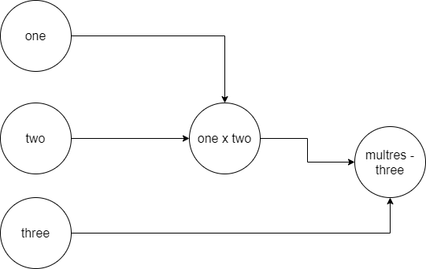

Looking at the [Effective TensorFlow 2](https://www.tensorflow.org/guide/effective_tf2) guide, we can see what major changes have occurred between TensorFlow 1 and 2.x. While some are relatively straightforward, such as the API Cleanup changes, others are less so. For example, something is written about _eager execution_:

> TensorFlow 1.X requires users to manually stitch together an [abstract syntax tree](https://en.wikipedia.org/wiki/Abstract_syntax_tree) (the graph) by making `tf.*` API calls. It then requires users to manually compile the abstract syntax tree by passing a set of output tensors and input tensors to a `session.run()` call. TensorFlow 2.0 executes eagerly (like Python normally does) and in 2.0, graphs and sessions should feel like implementation details.
> 
> Effective TensorFlow 2 (n.d.)

Now, while I have a background in software engineering (and since a few years machine learning engineering), I still find the text above really technical... especially for beginners.

What is eager execution? Why has the change been made, and what are the benefits for people who are using TensorFlow, possibly with TensorFlow based Keras?

Very interesting questions, indeed - especially if you want to get to know the TensorFlow framework in a better way. In order to understand eager execution at a high level, I've written this article, in which I will try to outline the answers to the questions above. Firstly, we'll cover the old way of working - that is, creating a computational graph, and requiring Sessions in order to run this graph. Being relatively inefficient for modeling purposes, we'll then cover how TensorFlow has changed - towards executing eagerly, no longer requiring that graph. It allows us to compare both approaches, and see - in my point of view - why this is much better for modeling. Finally, we'll cover briefly how to find whether your TensorFlow runs with Eager Execution enabled.

Are you ready? Let's go! 😎

* * *

\[toc\]

* * *

## Creating a computational graph

Suppose that we have three Tensors, which all three represent a constant number:

```
import tensorflow as tf
one = tf.constant([12])
two = tf.constant([3])
three = tf.constant([2])
```

Our goal would be to multiply the first two Tensors - thus `one` and `two` - first, followed by a subtraction - the result of the multiplication minus `three`.

```
multres = tf.math.multiply(one, two)
```

And subsequently, the substraction:

```
subres = multres - three
```

### Sequence of events

Usually, you would write it down in a sequence, like this, so that once you run your Python script, it gets executed at once:

```
import tensorflow as tf
one = tf.constant([12])
two = tf.constant([3])
three = tf.constant([2])
multres = tf.math.multiply(one, two)
subres = multres - three
```

Humans think that things flow as follows:

- Python first computes the values for `one`, `two` and `three`.
- Subsequently, it would compute the result for `multres` being 12 \* 3 = 36
- Then, finally it would compute the result for `subres` being 36 - 2 = 34.

Now, that isn't precisely how TensorFlow would work by default prior to version 2.x, and by option prior to version 1.7.

### Graph based computation

Instead, it would first create a _graph_ based on your input. A graph can be defined as "a structure amounting to a set of objects in which some pairs of the objects are in some sense "related"" (Wikipedia, 2003).

Visually, that would look something like this (note that I've likely omitted _many_ things for the sake of simplicity):



It's effectively a skeleton about what needs to happen when you would _really_ do things. As if you would write down a set of steps that would be executed upon start of your program. Those who have used TensorFlow for quite some time now, still recognize this: all instantiations of TensorFlow stuff had to be started within a `tf.Session` - being the instantiation of that graph before anything could happen.

The benefits of using graphs is that, as we mentioned before, they effectively compose a set of _steps_ about what needs to happen - which greatly helps when a model has to be rebuilt on, say, another machine.

On the other hand, this is incredibly frustrating when you are fine-tuning your machine learning model: you literally have to compile the _whole_ model over and over again. It's also a hassle when you want to store intermediate output from your model. What's more, it's unlike how Python normally works - being that any operation returns the result, immediately, instead of some intermediate representation like "one x two".

* * *

## Executing models eagerly

While TensorFlow used computational graphs until version 1.7, developers of PyTorch, the other popular framework for deep learning, recognized the potential bottleneck that this way of working provided - and ensured that their framework _was not so static_ (Chopra, 2018). Becoming increasingly popular, TensorFlow provided a break from static computational graphs in TF 1.7: it provided _eager execution_ in the framework by moving it from `contrib`, where all _additions_ are available.

Eager execution "is an imperative programming environment that evaluates operations immediately, without building graphs: operations return concrete values instead of constructing a computational graph to run later" (Tensorflow, n.d.). In plainer English, this means that static graphs are a thing from the past. Rather, each operation performed in TensorFlow immediately returns the value (so "36" instead of "one x two") which is subsequently used as is in the next operation ("36 - 2 = 34" instead of "multres - three produces _some final result_".

### Benefits of eager execution

According to Tensorflow (n.d.), this provides various benefits already recognized and driving the PyTorch ecosystem:

> _An intuitive interface_—Structure your code naturally and use Python data structures. Quickly iterate on small models and small data.
> 
> _Easier debugging_—Call ops directly to inspect running models and test changes. Use standard Python debugging tools for immediate error reporting.
> 
> _Natural control flow_—Use Python control flow instead of graph control flow, simplifying the specification of dynamic models.

With respect to the intuitive interface, this makes a lot of sense. Python makes use of 'eager execution' by default: if you multiply 12 by 3, you won't get some kind of intermediate result, but rather, it will output 36 immediately. Sessions were a purely TensorFlow thing for the experienced Python developer, and with eager execution enabled, the necessity for them has disappeared. This provides an easier interface for Python developers who are new to TensorFlow and allows one's code to be cleaner.

Easier debugging makes sense as well. As the outputs of your TensorFlow operations are numbers instead of intermediate results, it's now very easy to output intermediate results - such as the outputs of intermediate layers of your machine learning model - in order to debug it.

In fact, it allows you to be aware of how certain changes produce certain impacts immediately - and you can indeed do so with standard Python debugging tools, which can read default output rather than those intermediate results.

The point about _natural control flow_ was already covered above, but it's true: there's no _un-Pythonic_ graphs anymore, but regular Python operations instead. Hence, I'd say that this is valid as well - and indeed, a benefit :)

So, in short, eager execution provides **clear benefits** over graph mode: it's more intuitive to the Python developer, making use of TensorFlow more natural and hence easier, providing cleaner code and faster debugging. Sounds good!

* * *

## Does your TensorFlow have Eager Execution enabled?

All TensorFlow 2.x versions should come with eager execution enabled by default. If you are still running an 1.x version or want to find whether it's running eagerly anyway, you could execute this code to find out whether that's the case for your machine learning model:

```
import tensorflow as tf
tf.executing_eagerly()
```

If it outputs `True`, then you know that your model runs with eager execution enabled.

* * *

## Summary

In this blog post, we looked at eager execution - enabled by default in TensorFlow 2.x - and what it is. What's more, we also looked at why it is different compared to static graphs used in earlier versions of the machine learning framework.

Firstly, we started with an example of how graphs were used before. While this can be a very elegant solution when you have to export models and reconstruct them on other machines, it is a hassle when you have to debug models and want to use intermediate results. Especially since PyTorch was much more dynamic, the TensorFlow team introduced eager execution in TF 1.7 and enabled it by default in 2.x versions.

Funnily, in my point of view, that _major_ change has happened in the 1.x to 2.x TensorFlow transition - and hence, that's why eager execution is a point in TensorFlow (n.d.). If you're very new to TensorFlow, and if you've never worked with 1.x versions in your career, then you won't even _know_ about graphs in the first place. Still, I hope that you've learnt something from this article if that's the case - and also if that's not the case. Please leave a comment in the comments section below if you have any questions, remarks or suggestions. I'd love to hear from you and will respond where possible.

Thank you for reading MachineCurve today and happy engineering! 😎

\[kerasbox\]

* * *

## References

_Effective TensorFlow 2_. (n.d.). TensorFlow. [https://www.tensorflow.org/guide/effective\_tf2](https://www.tensorflow.org/guide/effective_tf2)

_Graph (discrete mathematics)_. (2003, September 23). Wikipedia, the free encyclopedia. Retrieved September 13, 2020, from [https://en.wikipedia.org/wiki/Graph\_(discrete\_mathematics)](https://en.wikipedia.org/wiki/Graph_(discrete_mathematics))

Chopra, S. (2018, September 15). _Eager execution in TensorFlow : A more pythonic way of building models_. Medium. [https://medium.com/coding-blocks/eager-execution-in-tensorflow-a-more-pythonic-way-of-building-models-e461810618c8](https://medium.com/coding-blocks/eager-execution-in-tensorflow-a-more-pythonic-way-of-building-models-e461810618c8)

_Importance of using TensorFlow eager execution for developers_. (2020, April 26). Analytics India Magazine. [https://analyticsindiamag.com/beginners-guide-to-tensorflow-eager-execution-machine-learning-developers/](https://analyticsindiamag.com/beginners-guide-to-tensorflow-eager-execution-machine-learning-developers/)

Aggarwal, K. (2018, April 9). _A brief guide to TensorFlow eager execution_. Medium. [https://towardsdatascience.com/eager-execution-tensorflow-8042128ca7be](https://towardsdatascience.com/eager-execution-tensorflow-8042128ca7be)

_Eager execution_. (n.d.). TensorFlow. [https://www.tensorflow.org/guide/eager](https://www.tensorflow.org/guide/eager)
