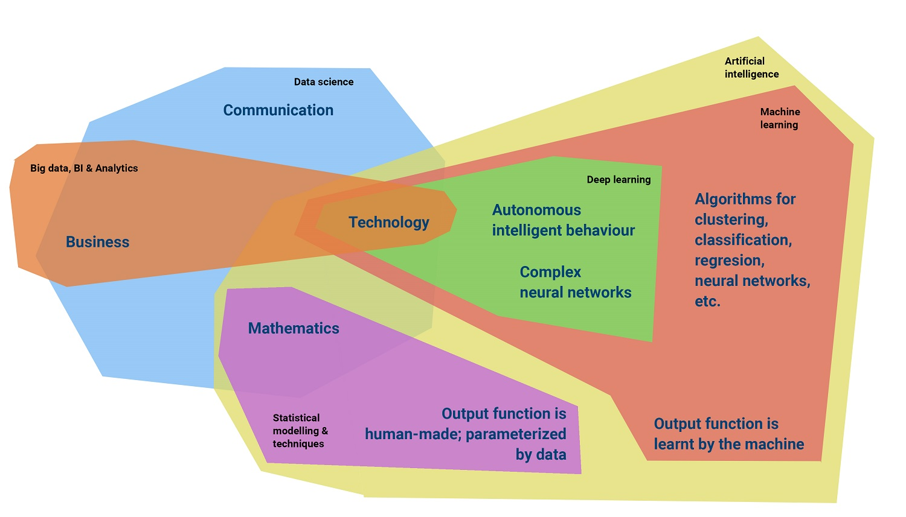
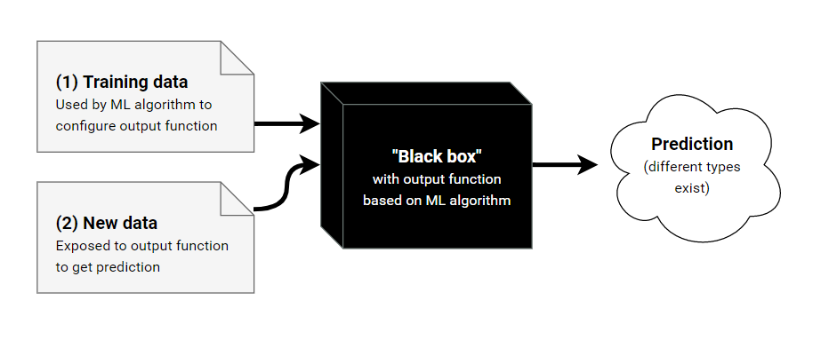
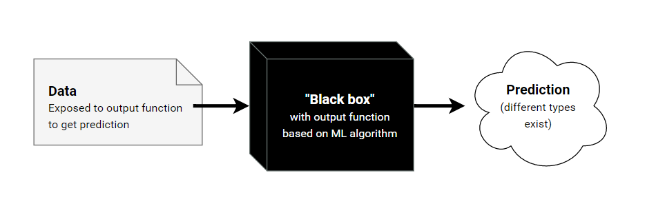
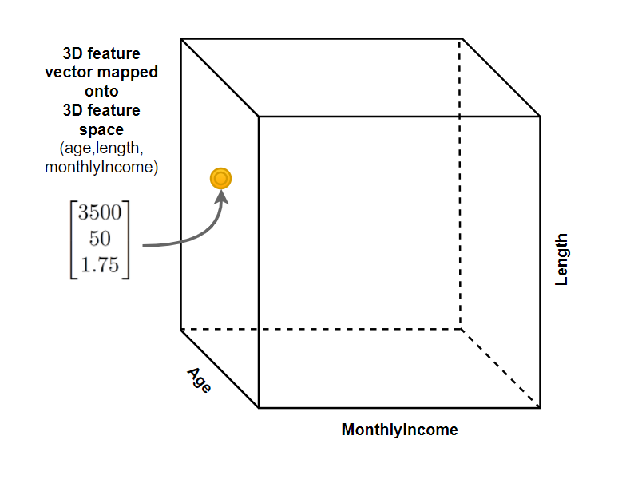
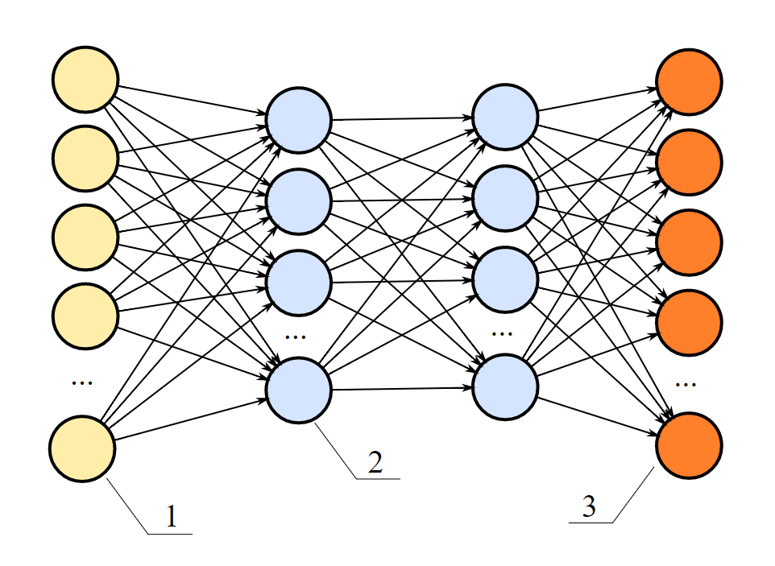

We're being flooded with data related buzzwords these days :)

Artificial intelligence. Big data. Business analytics. Machine learning. Deep learning. And we should not forget the mother of all buzzwords, _data science_. :D We use every term to describe a field that processes or analyses data to achieve something.

But what is something?

And if every field works with data, are they different at all?

If they are, do they overlap as well?

In this article, I'll describe the differences between these fields from my perspective. As you may [read](https://www.machinecurve.com/index.php/about/), I have a background in business & IT and have started learning machine learning on my own. This was one of the first articles I wrote - and it helped me a lot in getting a proper understanding of the fields. Below, I'll first argue why I think that it's important to draw clear boundaries between these fieldsthis. I'll then write about each field individually.

**Update February 2020** \- Added links to other MachineCurve blog posts.

## **Table of contents**

\[toc depth="2" title=""\]

## **How I started with machine learning**

When I [started to study machine learning](https://www.machinecurve.com/index.php/dissecting-deep-learning/), I first looked at various algorithms that are out there. But rather quickly, I was lost in a random forest (pun intended) full of algorithms. I realised that I needed to create a high-level overview first before I could dive into this extremely interesting world.

So I focused on making an overview of machine learning algorithms.

## **The need for a high-level overview**

Soon enough, I was lost again. If I'm interested in _machine learning_, I thought, there should be some line that clearly distinguishes between machine learning and _everything else_.

But what does this line look like, if it exists at all?

That's when I knew I first had to focus on the differences between widely used terms that are related to what I'm doing. I found these terms online and in my academic literature:

- Data science
- Artificial intelligence
- Machine learning
- Deep learning
- Big data and business analytics

So I started Googling. Turned out that the machine learning field itself doesn't even properly know its boundaries. For some reason, people cannot properly give a definition of - for example - the differences between machine learning and artificial intelligence. However, for some reason, they know that machine learning is part of AI while the opposite is not true. :D I'll get back to that later.

## **Clear boundaries = clear thinking**

I think it's important to draw sharp lines between the fields, especially because they are buzzwords. Like _[data](https://www.quora.com/Is-Data-Science-a-meme-term-or-a-buzzword)_ [science](https://www.quora.com/Is-Data-Science-a-meme-term-or-a-buzzword): can you exactly describe what it is? The thing with buzzwords is that everybody talks about them, but nobody knows _what_ they are and _how_ to properly use them. Only a few minds have the power to see through the hype. These types often:

- Know exactly what a word is about, but most importantly what it is not about;
- Know how they can use technology;
- And, most importantly, know how to successfully apply it in business.

These three describe one of my most important beliefs about technology:

_It's simple to make it run, it's difficult to make it fly._

This belief provides me with a clear direction: I first have to be able to draw these boundaries before I can even start thinking about algorithms at all. If I can't do that, I'll most likely end up contributing to the confusion.

A long story short: we need to figure out these boundaries.

But I also need to provide you with a clear overview of the fields. That's why I'll also have to take a look at the overlap between them - because what I did find out is that they are not mutually exclusive. Based on my Google research, I got a clearer idea about the fields, their developments, boundaries and limitations. And that's how we end up with the next image. It reflects my views on these boundaries and overlap. Let's take a look:

I'll now cover the fields in more detail. I'll try to explain how they are different and how they overlap. If you need very specific information, I advise you to use the table of contents at the top of this post.

## **Data science**

Let's start with data science since it's the most used buzzword in business these days. Like me at the beginning, you may have your ideas about what a data scientist is. About what they do. And what they don't, or can't. In my view, data scientists are curious, pragmatic and persevering jack-of-all-trades...with in addition a rather exceptional entrepreneurial, mathematical and technological skillset.

Let me explain that in more detail.

### **It started in science**

A short timeline of how data science became what it is today:

#### Mid-to-late 20th century

- 1960: Peter Naur, a prominent Danish computer scientist, used the term as a replacement for _computer science_.
- 1974: The same Peter Naur moved the term to the field of data processing methods, probably realising that computer science is about more than data alone.
- 1996: For the first time in history, an academic conference is named after data science: _Data science, classification, and related methods._
- 1997: A professor asks whether "Statistics = Data Science?" in his inaugural lecture. This can be considered the start of data science outside of the computer science world.

#### 21st century

- 2001: A statistician introduces data science as an independent academic discipline. Data science, according to the statistician, is about more than the maths alone, given the advances of modern computing.
- 2002: Academics started the Data Science Journal, followed by more journals in the period from 2003 to 2005.
- 2012: Harvard Business Review claims that data scientists have [the sexiest job of the 21st century](https://hbr.org/2012/10/data-scientist-the-sexiest-job-of-the-21st-century). I consider this article to be the bridge from academia to business (although I do not agree with their observation that they themselves coined the term _data science_). Everything before the HBR article was focused on statistics and academia. Everything afterwards was focused on _applying_ this knowledge to solve business problems. One could say that since then, demand for a data scientist has skyrocketed.

### **Data scientists care about the end, not the means**

Data scientists aren't engineers. OK, I get your caution, and I do agree - they use engineering disciplines in their work. But that's not everything! Data scientists don't care about how technology works. They care about the phenomena they investigate. If their work can benefit business and, consequently, the customer, they are happy.

At the same time, they are also entrepreneurial. Data scientists have the ability to identify new business opportunities in data. But they must sometimes be patient. If a data scientist's approach towards their end goal does not provide the expected results, they don't give up. They find a second approach so they can still achieve what they promise.

And they do so in creative ways. The [Harvard Business Review article](https://hbr.org/2012/10/data-scientist-the-sexiest-job-of-the-21st-century) describes a data scientist who used the resemblance between a DNA sequencing problem and a fraud scheme to apply methods used in DNA sequencing. The scientist successfully tackled the problem for business.

### **Data science is a process**

Their entrepreneurial nature means that data scientists must have a broad general knowledge. Nevertheless, as I wrote, they have a toolbox filled with very valuable technologies and statistical knowledge. This means that they must also be specialised in certain areas in order to succeed:

#### Statistics

And then mainly in applying statistical methods in order to solve a problem in a data-driven way. A data scientist does often not care about the exact mathematical foundations of the formulas. Although I'll dive into some mathematical foundations on this website, I myself don't care either about the exact mathematical proof.

#### Technology

For structuring large quantities of data in order to prepare them for analysis, a data scientist must know about data cleansing and structuring methods. Often, these require knowledge about technologies like Hadoop and algorithms like MapReduce - as well as knowledge about various machine learning algorithms. Therefore, a data scientist must have specialised knowledge about technology - data processing technology in particular. In fact, one of the interviewees in the HBR article - a recruiter - does not care about whether data scientists have statistical knowledge. Their ability to write code is much more important.

#### Business

Data scientists must be able to feel what's happening in an organisation. You cannot figure out a solution to a problem if you do not see or cannot understand it. Therefore, new data scientists do not necessarily need to have a background in statistics or technology. They may even come from business - or other rarities like ecology :D

#### Communication

Some of you may feel offended, but computer scientists and mathematicians are not the greatest of communicators every now and then. Sometimes, their explanations become very complex - so complex that a business manager does no longer understand how he may benefit from the solution being discussed. However, the manager definitely needs that solution because it solves his problem. Therefore, data scientists need to be very communicative. I've read about one of the success factors for hiring a data scientist -- and one recruiter said that he always checked whether an applicant could explain a problem and his solution in layman's terms.

Together, they form the process of starting with a problem --> processing and analysing data --> finding a solution. Therefore, rather than an umbrella term for interdisciplinary elements, I believe that _data science is a process_!

### It includes business analytics

Beller & Barnett's definition of business analytics is as follows ([thanks to Wikipedia](https://en.wikipedia.org/wiki/Business_analytics)):

> Business analytics (BA) refers to the skills, technologies, practices for continuous iterative exploration and investigation of past business performance to gain insight and drive business planning.

And as discussed, in my view data science is the process of solving business problems in a data-driven way. Data scientists have explicit knowledge about how a business works, but also the technological and mathematical skills in order to perform the data processing & analysis.

Consequently, I believe that business analytics - with its _skills, technologies and practices for continuous iterative exploration and investigation (...) to drive business planning_ - is a part of data science. Data science itself is a bit broader:

- It does not merely look at past business data, but attempts to include everything if it's interesting for problem solving - data science may therefore not only be explanatory, but also predictive in nature.
- The goal of business analytics is gaining business insights and driving business planning. While gaining insights is in line with data science's goal of understanding phenomena, I think that data science does not need to be about _driving business planning_ alone (but in practice, obviously, this happens most of the time!)
- Data scientists are creative in the sense that they may use various approaches to solving a problem (remember the DNA sequencing method?) - business analysts use a more tech&business oriented skillset/toolbox.

### **Now what is a data scientist?**

As a result, you may end up conceptualising a data scientist. The data scientist is the proud owner of a toolbox that is filled with various technologies and statistical methods. He has the skills to use them in order to prepare data for analysis, perform the analysis, and communicate the analysis - often to business. It is not uncommon to see that data scientists often make themselves irreplaceable :)

Yet, a formal definition is to come. But given the fact that we're dealing with a hype here, I'm not sure whether it will come soon...

But who cares! We can now see through the hype. ;)

## **Artificial intelligence**

Let's now move to artificial intelligence. As you can see in the fields overview above, in my view artificial intelligence is oriented around technology and mathematics. It is truly an engineering discipline and has little to do with business. Funnily enough, it is strongly grounded in philosophical developments too - as well as on dreams about the future. Below, I'll describe some of my observations.

### **It's an engineering umbrella term**

In my opinion, the term _artificial intelligence_ is very vague. The way I see it - AI is an umbrella term for various disciplines related to mathematics and technology. Examples of these may be machine learning, deep learning, rule-based learning, and more.

There are multiple activities within AI:

- _Research activities_ focus on the validation of existing methods and techniques and the development of new ones. It's mostly academics who focus on these activities, but sometimes organisations also have their own R&D for artificial intelligence.
- _Philosophical activities_ discuss developments within artificial intelligence. These discussions range from the application of AI in the future world, AI ethics, dangers and opportunities. Thinking about new, currently non-existent forms of AI is also a part of AI related philosophy.
- _Tech activities_ focus on the actual technological part: engineers making intelligence happen. Pure maths does not make the world better - it only does so if it is applied (I'm sorry, mathematicians :) ). Engineers are often responsible for these tech activities - developing new algorithms based on state-of-the-art research, fitting algorithms into an existing AI infrastructure, and showing that it works.

You may miss _business activities_ in this list. I personally believe that bridging the gap between technology and business is not a part of AI. Delivering value by applying AI is the job of a data scientist.

### **The goal of AI: making machines intelligent**

At least, you could say that is the highest level goal. But what is intelligence?

#### Types of intelligence

Within AI, people often come up with two types of intelligence: strong (or general) AI and weak (or applied) AI. Artificial general intelligence works towards a machine that is intelligent enough to perform any task a human being can do too.

A weak AI system focuses on one particular task at hand - for example playing chess or classifying an email.

Today however, no system is known that meets this definition for general AI, and every work so far is forcibly known as weak AI.

However, some AI scientists and engineers work towards general AI by creating bigger and better weak AI, combining various systems, methods and technologies in smart ways.

But some also work on improving weak AI.

Therefore, you cannot get a _single goal for AI_ when you ask different people in the field. Actually, you'll see two categories - which are strongly related to general and weak AI. You'll mostly hear that the goal of AI is either one of two:

- Working towards technological singularity
- Improving weak AI

#### Working towards technological singularity

Ok, you may have never heard of that term before :) However, I believe that the goal of those working on general AI is, maybe indirectly, _working towards technological singularity._

If we manage to make a general AI one day, the machine has the capability to perform tasks like a human being. But we may go one step further: we may make a machine that is more intelligent than a human being, i.e. a machine that is _superintelligent_. This machine may then - by accident or by the grace of intelligence - realise that it can make a better version of itself by either developing a new, more intelligent machine - or rewriting its own code.

This more intelligent machine, once it runs, could then also realise that it can make a better version of itself - in less time than its 'parent'. We then enter a loop in which exponential technological growth is triggered. Even better superintelligent machines would make human intelligence very dumb, to say the least :)

One of the founding fathers of the singularity concept is the famous mathematician John von Neumann:

> "The accelerating progress of technology and changes in the mode of human life, give the appearance of approaching some essential singularity in the history of the race beyond which human affairs, as we know them, could not continue" - _in Ulam, Stanislaw (May 1958). ["Tribute to John von Neumann"](https://docs.google.com/file/d/0B-5-JeCa2Z7hbWcxTGsyU09HSTg/edit?pli=1). 64, #3, part 2. Bulletin of the American Mathematical Society: 5._

Another pioneer is Ray Kurzweil, an American inventor and computer scientist.

Both argue that today, human beings cannot imagine the so-called post-singularity world. I tend to agree.

#### Is singularity science fiction?

I can see you thinking: this is pure science fiction. And yes, today that's the case. :) I'm convinced that we'll first have to work towards general AI before we may start thinking about technological singularity. Nevertheless, you see striking technological advances every now and then. Facebook, for example, had to shut down [a language generating AI](https://www.forbes.com/sites/tonybradley/2017/07/31/facebook-ai-creates-its-own-language-in-creepy-preview-of-our-potential-future/) because engineers simply no longer understood how to interpret the language.

However, while people working on _general AI_ may work towards singularity, there is another group that focuses on weak AI. These are the folks that work on:

#### Improving the quality of weak AI

Like I said earlier, weak AI focuses on one task at hand.

And although there is no general AI today, the folks working on general AI have a different goal in mind than those working on weak AI.

Because yes, there are groups of researchers and engineers who purely want to improve the machine's intelligence with regards to one task. Examples are:

- Emulating the human brain - through neural networks. The brain, however, has various different tasks. The Natural Language Processing field for example works on methods and techniques for interpreting and processing language. These folks have no interest in self-driving cars.
- Liberating human beings from their duties. A robot cleaning device may learn how to move based on its environment. It is an intelligent machine, but its only task is cleaning a room.

#### The AI effect

A funny but frustrating effect within AI is known as the AI effect or AI paradox. Whenever some AI program achieves something, this something is seen as no longer intelligent - but as "just a computation". It means that the definition of machine intelligence changes all the time, but also that AI researchers are only working on what "failed" so far.

Tough life for them! ;)

## **Machine learning**

Besides data science and artificial intelligence, machine learning is also a widely used buzzword. But what is machine learning? How is it different from both data science and AI? Below, I'll discuss my observations.

### **What is machine learning?**

If we take a look at [Wikipedia](https://en.wikipedia.org/wiki/Machine_learning), we'll see a very clear definition of machine learning:

> Machine learning is a field of computer science that gives computers the ability to learn without being explicitly programmed.

This gives a very clear indication about what machine learning is:

1. A field within computer science;
2. That makes computers learn based on data;
3. But computers learn by themselves, so there is no explicit programming!

And also what it is not:

1. An _intelligent_ system that works with human-written rules (which would maybe classify as AI, but not as machine learning)

Learning can happen in multiple ways. Before we can proceed with a more detailed view on machine learning, we first have to make a very important distinction between supervised and unsupervised learning.

#### Supervised learning

Suppose that we have a very simple data set (like a spreadsheet) with these elements: _name, length, sex._ We want to know whether we can predict somebody's _sex_ based on their _name_ and their _length_. This is a **supervised learning** problem. In supervised learning, you deliver data samples that both contain the predictor(s) - _name and length -_ and the target value(s) - _sex_. You then let a machine learning algorithm learn which names and lengths often correspond with a certain sex. When you input a new combination of name and length into the system, you get a prediction for this person's sex.

The above supervised learning problem is known as a **classification** problem. In a classification problem, you attempt to predict a _discrete_ value. This may be new to you, I understand - but a discrete function can take only certain values (like _David_, or _Peter_, or _Grace_, or _Sheila_).

Another type of supervised learning problem is a **regression** problem. Here, you attempt to predict a _continuous_ value. That's a value which may take any value within a range. An example regression situation would be to predict the _length_ (e.g. 1.24 metres) based on one's _sex_ and _age_.

In both cases, you first train the algorithm with your initial data set - also known as your **training data**. The _black box_ then learns to predict a value (either discrete or continuous) based on your data set. If it finishes training, you may input new data (e.g. _Frank, 1.81 metres)_. It then predicts whether Frank is male or female. We all know the answer ;-)

\[caption id="attachment\_84" align="aligncenter" width="932"\] Supervised learning\[/caption\]

#### Unsupervised learning

In an **unsupervised learning** problem, you do not provide the target values. The machine learning algorithm has to find out on its own which pattern exists within the data.

One type of unsupervised learning is **clustering**. Suppose that you have a geographical data set with lightning strikes. You want to find out which lightning strikes belong to the same lightning storm. Then, a clustering algorithm may help you - it can detect which strikes belong _to the same cluster_ and hence, with a certain level of certainty, to the same lightning storm.

Another type of unsupervised learning is **dimensionality reduction**. Here, you try to reduce the complexity of your initial data. Suppose that you have multiple fields (in machine learning also known as features) which contain the same information, like _age_ as well as _date of birth_. In dimensionality reduction, you remove the _age_ feature because you can compute the person's current age by subtracting their _date of birth_ from today's date. Dimensionality reduction reduces the complexity of the data, making it easier for a machine learning algorithm to handle the data. This, in return, may save you a lot of time!

In both cases of unsupervised learning, you provide the black box with data - but not with target values. The _black box_ attempts to find patterns itself - and then comes with a prediction.

\[caption id="attachment\_85" align="aligncenter" width="937"\] Unsupervised learning\[/caption\]

#### Inside the black box - an output function

You may think that this black box is a mystery, but the machine learning engineer is less convinced about that. It is in fact to a large extent understandable what happens inside a machine learning system, due to the nature of most machine learning algorithms.

In the images above, I introduced the concept of an **output function**. The basic notation of such a function may be the following:

Y = f(X)

Which means this: for a value X inserted in the output function, you get value Y.

And this is actually the same as the examples we sketched before:

If you would input _name_ and _length_ as X values, you would get _sex_ as a return value - the Y value.

#### So many algorithms

You may now think that machine learning is very easy. To some extent, that is true. It is really about creating and improving this output function in order to maximise the predictability of the function - and the prediction as a whole.

But you may now wonder about this: why are there so many machine learning algorithms around? We have - for example - various classifiers such as linear classifiers, but also support vector machines, linear regression and logistic regression, perceptrons, neural networks, ...and the list goes on.

Here's why: the output function can be _tweaked_ in various ways, and every machine learning algorithm does that in a slightly different way.

We know that certain algorithms perform better under certain circumstances, such as the nature of data, the type of data, the quality of data or even the number of samples. Consequently, we know that based on our data set and problem type (supervised vs unsupervised - and then classification/regression or clustering/dimensionality reduction!), we can choose an algorithm that tweaks the output function in the best way.

As a result, we end up with a large spectrum of algorithms. I want to treat them all on this website, eventually :)

### **The difference between machine learning and data science / business analytics**

In my opinion, data science encompasses more than just the machine aspect. If you recall the goals of machine learning...

1. Making computers learn from data;
2. Without humans explicitly programming the actual learning

...you can clearly see the difference when you compare it to the elements which I think should be the core competencies of a data scientist:

1. A feeling for business;
2. A good communicative skillset;
3. A grounded technological understanding (in order to create infrastructures like Hadoop/MapReduce, and to code machine learning algorithms);
4. As well as a statistical/mathematical understanding of what's happening (so the system can be continuously improved).

We may see machine learning as an integral part of a data scientist's job - and in this way they do overlap. However, in my view, data science is more than just machines alone.

### **The difference between machine learning and AI**

Another vague difference may the one between machine learning and artificial intelligence. The highest-level goal of artificial intelligence is 'making machines intelligent' (up to the level of _general AI_, you may recall). Therefore, machine learning is part of artificial intelligence - it is a way to make machines intelligent.

But are there more ways to make machines intelligent?

Yes, and an exemplary case may be rule-based intelligence - where the rules are programmed by a human being. Given the definition of machine learning such a system cannot be considered a machine learning system, but it may demonstrate intelligence after all. Consequently, these systems may be considered artificial intelligence - until the moment that they work well, due to this _AI effect_ we discussed above :D

To summarise: machine learning is a part of artificial intelligence, but AI is not only about machine learning.

## **Deep learning**

Another buzzword that I see a lot is [_deep learning_](https://www.machinecurve.com/index.php/2018/11/23/what-is-deep-learning-exactly/). Questions that often arise are about the difference between deep learning and machine learning. Below, I'll discuss my views on these differences.

### **It's a part of machine learning**

According to the [Wikipedia page about deep learning](https://en.wikipedia.org/wiki/Deep_learning), this is the definition of the field:

> Deep learning (also known as deep structured learning or hierarchical learning) is part of a broader family of machine learning methods based on learning data representations, as opposed to task-specific algorithms. Learning can be supervised, partially supervised or unsupervised.

Oops. :) Let's try and find out what it is in plainer English. We can do that by breaking up the definition into some important parts:

- It's somehow related to machine learning, so we can say that it is a part of it;
- It has something to do with _learning data representations_, which are the opposite of task-specific algorithms.
- Learning can be supervised, partially supervised or unsupervised.

Additionally, I found a lot of information on the internet suggesting that deep learning has something to do with very complex neural networks. We'll therefore also have to take a look at these and sketch the basics in order to understand what deep learning is.

#### Additional characteristics

Wikipedia describes additional characteristics which at least for me make things a bit more clear:

> 1\. use a cascade of many layers of [nonlinear processing](https://en.wikipedia.org/wiki/Nonlinear_filter "Nonlinear filter") units for [feature extraction](https://en.wikipedia.org/wiki/Feature_extraction "Feature extraction") and transformation. Each successive layer uses the output from the previous layer as input. The algorithms may be [supervised](https://en.wikipedia.org/wiki/Supervised_learning "Supervised learning") or [unsupervised](https://en.wikipedia.org/wiki/Unsupervised_learning "Unsupervised learning") and applications include pattern analysis (unsupervised) and classification (supervised).
> 
> 2\. are based on the (unsupervised) learning of multiple levels of features or representations of the data. Higher level features are derived from lower level features to form a hierarchical representation.
> 
> 3\. are part of the broader machine learning field of learning representations of data.
> 
> 4\. learn multiple levels of representations that correspond to different levels of abstraction; the levels form a hierarchy of concepts.

If they don't for you, hang on tight. I'll try to explain them in layman's terms below :-)

#### Layers of nonlinear processing units for feature extraction & transformation

Ok, that's a lot of difficult words :)

We begin with the most important ones here: feature extraction and feature transformation.

##### Feature extraction

In the case of **feature extraction**, a machine learning engineer starts with an initial dataset and retrieves features from this data set. Suppose that we have a data set with attributes _name, age, length, sex_. Let's suppose that one of the rows in the dataset is about Peter, who is 28 years old, and is a male of 1.88 meters. _Peter, 28,_ _1.88_ and _male_ are so-called **features**. They are put together in a **feature vector**, which is like a collection of features for one instance - one row.

\[caption id="attachment\_96" align="alignright" width="450"\] Mapping a 3D feature vector onto a 3D feature space. MonthlyIncome = 3500, Age = 50, Length = 1.75\[/caption\]

A feature vector is n-dimensional: n is the number of features in the vector. In our case above, we have a 4-dimensional feature vector. It is impossible to make a 4-dimensional space understandable for human beings, but we can visualise the 3D space of a 3-dimensional space, the plane of a 2-dimensional space, and the line of a 1-dimensional space.

These directly translate into the concept of a feature space.

A **feature space** is the space onto which you can map feature vectors. The image of the space near this text shows how you can visualise this process. I'll discuss feature vectors and feature spaces in more detail in another article, since we focus on the differences between machine learning and deep learning in this one. For now, it's enough to remember that a feature vector contains the necessary data (features) for one instance (a row, about e.g., a client in a shop). Make sure to remember that in any practical machine learning _and_ deep learning situation, the feature space is filled with dozens of feature vectors!

##### Feature transformation

In the case of **feature transformation**, features are used to create a different feature. It's like combining old data to generate new data, based on logic.

Feature extraction and feature transformation are two common processes in both machine learning and deep learning. Normally, features are extracted  in a linear way, which means that it is changed with a linear function of its input.

Y = 2X, for example, is a linear function.

But linear functions have their limitations given the fact that they always separate the feature space into two halfs of equal size.

Non-linear functions do not necessarily do that, and that's what makes them interesting for automating the discovery of features. Deep learning uses these non-linear functions a lot, contrary to other subsets of machine learning - which quite strongly rely on linear functions. In fact, in deep learning algorithms use multiple layers of non-linear functions, which serve like a chain. This way, they can autonomously detect new features.

And that's why deep learning is called a part of the field of _learning representations of data_.

\[caption id="attachment\_97" align="aligncenter" width="962"\] A complex neural network. These and even more complex neural nets provide different layers of possibly non-linear functionality, and may thus be used in deep learning.\[/caption\]

#### Learning representations of data field

Normally, machine learning engineers need to prepare the data set and manually select the features with which they will work. They often don't like this part of the job, since getting actual results is much more interesting :) However, as we will see when we dive into the _big data_ term below, data is never clean on arrival. It needs to be cleaned.

The layers of non-linear processing units allow researchers and engineers to automatically retrieve features and transform them into new ones. More importantly, their algorithms can do this autonomously - without interaction with these stakeholders. They can do that because they simply do no longer have the limitations of linearity, and the system can be learnt to recognise everything - just like a human can.

Contrary to machine learning, in deep learning it is possible to automatically learn new data based on existing data.

That's what makes deep learning so unique and interesting at the same time!

#### Multiple levels of features

This ability to learn does not work at one conceptual level. Deep learning algorithms are capable of generalising their knowledge about features into _more general concepts_. An example would be a system that detects what you're going to do when you wake up. A traditional machine learning algorithm may provide you with the suggestion to make some coffee based on behaviour shown in the past - since you always seem to drink coffee in the morning. However, a deep learning algorithm may recognise that making coffee is a _process_, and that for making coffee you do need _coffee beans_. If it somehow knows (maybe via sensors) that you no longer have coffee beans, or rather you'll run out of them after your first coffee in the morning, it suggests to buy new ones.

Like me, you may now begin to realise that we're dealing with an entirely different type of machine intelligence here - one that leans much more towards _general AI_ than anything we have seen before.

#### Ok, can you summarise?

Yes, of course I can. I understand that it has become a complex story :D

Deep learning is:

- A totally different way of learning and generalising from data when compared to traditional machine learning;
- Nevertheless a part of machine learning;
- Making sure that learning can be done at various conceptual hierarchies, compared to traditional machine learning - hence the name _deep_ learning;
- About making learning an autonomous process, rather than a human-driven one;
- Using very complex (neural) algorithms - sometimes engineers do no longer get what's happening _inside_;
- Really promising for the future, since deep learning systems are already better than humans when performing a certain task.
- Very threatening at the same time, given the fact that human beings don't know what happens when intelligent systems become superintelligent.

#### How is it related to neural networks?

Like I said, I see a lot of statements on the internet which suggest that deep learning is closely related to (complex) neural networks.

Some even say that _deep learning = neural networks_.

And that may be correct, at least for today :) Neural networks seem to be one of the better choices today for performing deep learning activities.

Let's briefly compare traditional neural networks with the ones used in deep learning.

The difference with 'normal' neural networks is both the number of hidden layers as well as the number of neurons. In the image above (scrolljust a bit until you see the neural network), you'll see 2 blue-ish hidden layers. It's quite a shallow network. Complex ones used in deep learning may have a lot more hidden layers.

The image above, however, does not limit the amount of input neurons, the yellow ones on the left. Deep neural networks may also have a large amount of input neurons, and subsequently a large amount of neurons in the following hidden layers.

This allows for great computational power, but also a lot of complexity which may impact the results!

### **It's a hype today**

Like anything that leans towards _doing magical things with data_, deep learning is one of the hype words in today's business environment. I do however think that there is a promising future ahead for deep learning, if we can see through the nonsense and focus at the work at hand. What we should also not forget is to work on how business can benefit from deep learning. You may have seen that my explanation has become very technical - and that's a logical consequence of deep learning's very complex nature. But ultimately, it is not important how it works - it is important _that_ it works. For humans.

## **Big data and business analytics**

In my experience, when you talk to business people about processing data in order to achieve business results, they do often not come up with _data science_ - unless they are IT staff themselves. Rather, they will tell you about their attempts in creating value by using big data, or their approach regarding business analytics.

But big data projects fail very often. The same applies to business analytics. But why is that? And what are the differences between the two? I'll discuss my observations below.

### **Both are business-driven**

One of my funnier observations is that you'll almost never hear an engineer talk about his _big data_ problems. He either speaks about _machine learning_ or something similar or describes his problems in very technical terms, like "my infrastructure was a a b\*\*\*\* today".

Consequently, you can imagine that both big data and business analytics are business-driven. It's mostly business that speaks about the potential that processing and analysing these large quantities of data has.

However, you need a totally different person in order to speak to an engineer...to actually make it work. And given my observations about data scientists above, I think they may be suitable persons to bridge this gap.

### **Big data characteristics**

But what _is_ big data?

Let's use Gartner's initial definition of big data, stated in their [2012 IT glossary](https://web.archive.org/web/20170718161704/https://research.gartner.com/definition-whatis-big-data):

> Big Data is high-volume, high-velocity and/or high-variety information assets that demand cost-effective, innovative forms of information processing that enable enhanced insight, decision making, and process automation

We see three important Vs in this definition: **volume, velocity and variety**. These became known as the _three Vs_, three important pillars to define big data. Today, the three V model is still widely used, albeit extended in some ways.

Below, I'll discuss Gartner's three V model, which is now already known as the _four Vs of big data_. I'll also discuss variability as an additional characteristic.

#### The four Vs of big data

Big data itself can often be characterised along four different Vs, namely:

- Volume
- Variety
- Velocity
- Veracity

#### Volume

The **volume** attribute refers to the _big_ in big data. Big data can be characterised by the large volume of data that is generated and, subsequently, stored. We can make two important observations here, which are highly relevant for a big data enthusiast:

- The volume of data increases rapidly;
- The growth rate of data volume increases as well, which means that the increase in data is going increasingly faster;

#### Variety

Next to volume, big data can be characterised by its **variety**. It's not about one simple data set - it's about the massive amount of data that can be stored. If we focus on a customer, we may store a lot of things about him:

- His personal details
- Where the customer lives or works
- His relationships (family members, friends, acquaintances)
- The way he moves through a store
- The way he behaves online, both on a store's website and other websites
- ...and who knows what?

Companies tend to store as much as they can. Consequently, a key skill of a big data engineer (who may actually be a data scientist) is to reduce the dimensionality of the data. In plainer English: being capable of precisely selecting the data he needs, putting focus on the interesting parts of the data set (and then obviously, interesting for business). Given the enormous variety within the data, this is a complex task!

#### Velocity

The **velocity** characteristic is about the speed with which data is processed. Large data processing infrastructures like Hadoop in combination with MapReduce process a lot of data - even more than traditional data management systems could handle.

In fact, MapReduce is a great example to illustrate why I think that data scientists are entrepreneurial. Data scientists need to provide business value based on data. Folks at Google realised they could no longer process the increasing quantities of data with the algorithms they had in place. So rather than trying to fix a broken system, they designed a new algorithm. MapReduce, as it is called, breaks down data in smart ways in order to reduce its quantity without information loss. In fact, it is one of the most used - and cited - algorithms these days within the big data field!

#### Veracity

It now all sounds very great. And while big data offers great potential to businesses, data quality may rather often be low. **Veracity** is about the fluctuating quality of data - one of the main pitfalls in big data. It's then up to the big data engineer to make it better. He can do so in multiple ways:

- By smartly combining multiple data sources in order to retrieve the information in another way;
- By applying various data cleansing algorithms in order to end up with a less complex data set;
- et cetera!

#### Additional characteristic: variability

Some folks related to big data use **variability** as well. It's about the consistency of data - which is partially about data quality, but which may also qualify to be a distinct characteristic. Nevertheless, imagine you're working for a logistics company that has integrated its IT systems with the systems of another company. You both agreed to store data of your clients and their routes - and share it so you could both improve your market position. Suppose that at first, the other company sends data about various things, e.g.:

_{ ShipName, ContainerNo, DepartureHarbour, ArrivalHarbour, ExpectedArrivalDate }_

... because the company received an invoice from shipper A, who sends it in this format.

Then they send another bunch of data with this format:

_{ Shipping, ContainerInfo: { No, Harbour: { Arrival, Departure }, ArrivalDate, Expected }_

Because another shipper sent it this way.

This shows the variability a big data engineer has to deal with.

### The limitations of big data projects

Big data projects often fail. There is a multitude of factors that contribute to these failures:

- Business simply overestimates what's possible in big data analysis today;
- It becomes impossible/uneconomical to clean data, rendering analysis undoable;
- There is not enough data in order to boost model accuracies;
- There is a scope creep - big data projects need to be scoped in order to succeed. If you want to do it all in one project, you'll definitely fail;
- and more!

### **The differences between big data and business analytics**

I've discussed business analytics before and like I said, I think it's a part of the data science process. In order to save you time scrolling to business analytics, here is the definition by Beller & Barnett:

> Business analytics (BA) refers to the skills, technologies, practices for continuous iterative exploration and investigation of past business performance to gain insight and drive business planning.

We can immediately see the differences between big data and business analytics if we compare both along the Vs: handling volume, velocity, variety, veracity and variability are not the characteristics or drivers of business analytics. In fact, business analytics cares about gaining insights for business planning.

I do however think that there is some overlap. In fact, I think that a data scientist is also partially performing business analytics when handling big data (and yes, I know these are a lot of buzzwords in one phrase, but you get me). Therefore, these may all be interchangeable, rendering the discussion whether all these terms are necessary at all.

But let's skip that discussion for now.

### **The differences between big data and machine learning**

Another distinction that is often made is about the **difference between** **big data and machine learning**. We know about big data that the 4 Vs are important. But what is machine learning? You could read about these two main characteristics above:

- Making computers learn from data;
- Without humans explicitly programming the actual learning

Once again, there is nothing about volume, velocity, variety, veracity and variability.

But there is some overlap here as well - with data science.

While _machine learning_ (and to a larger extent deep learning too) is the toolbox for making learning from data possible, big data is the term that provides the higher-level overview of any business data infrastructure. You can see the relationship - and then data science enters the picture again. If we remember well, my view on a data scientist is that he attempts to provide value to a business by solving a problem through processing and analysis of data - maybe even large quantities. For this, he needs a proper understanding of the business, a good communicative skillset, a proper technological understanding and a mathematical basis. You can see that for a data scientist technology meets business.

Long story short - for a data scientist machine learning may be one of his tools; big data may be one of his goals.

## **A brief overview of the differences**

If we could make a high-level overview of the fields you could read about above, I would come to this:

- Data science is about bridging the gap between data technology and data driven problems by bringing a good technological understanding & business-/problem-oriented mentality to the table;
- Artificial intelligence is about making machines intelligent - the goals may vary from superintelligence to very task-specific intelligence;
- Machine learning is about learning from data without explicit human programming, but with human-configured features;
- Deep learning makes the feature learning process autonomous. For this, the field uses very complex algorithms;
- Big data is about the characteristics of the data - volume, velocity, variety, veracity (and maybe variability) - and the value it may provide, but less about technology.
- Big data may be applied within any field, like ecology, astronomy, meteorology, but also in business. Business analytics tends to focus on applying data about past events to a business problem in order to learn for the future.

I hope you've enjoyed my article. If you have any comments, questions or suggestions, please feel free to leave a comment below :)
