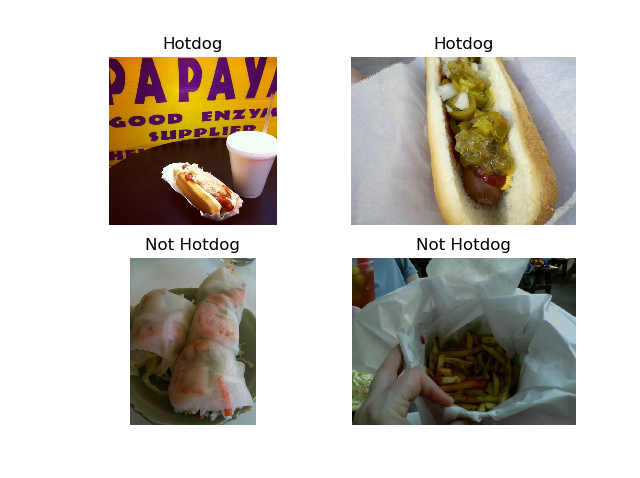
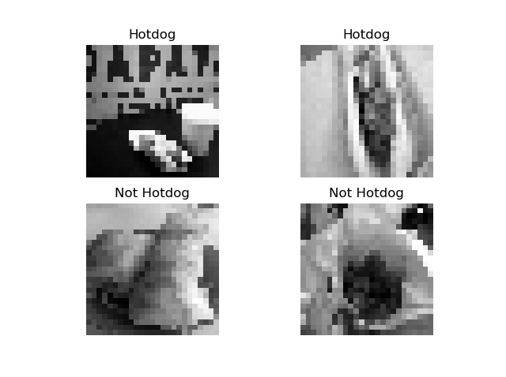

People who start with creating machine learning models, including the deep learning ones / neural networks that are popular today, often want to start with relatively simple models. They feel as if there is a steep learning curve to getting up to speed with the libraries being used. Truth be told: such a learning curve exists. And designing well-scoped exercises can be of great help when you want to understand how those models work. At least, they did for me.

That's why in today's article, we will be creating a relatively simple ConvNet classifier that is capable of classifying between Hot Dogs and Not Hot Dogs. Being inspired by a television series, we set out to create such a machine learning model by means of Python, TensorFlow, Keras and OpenCV. Don't worry about its complexity: we will explain each part of the model step-by-step and show you how you can neatly structure your model into different parts. This way, you'll be able to grasp the concepts and produce something that is really tangible.

Let's start! 😀

* * *

\[toc\]

* * *

## Ehhh... Hot Dog - Not Hot Dog?

First of all: you might think that I'm a bit weird for making a classifier that can distinguish between hot dogs and non-hot dogs, and perhaps I am. However, take a look at this fragment from HBO's Silicon Valley series:

https://www.youtube.com/watch?v=pqTntG1RXSY

Here, Jian-Yang, portrayed by Jimmy O. Yang, demonstrates a classifier which, to everyone's surprise, turns out to be a [binary one](https://www.machinecurve.com/index.php/2020/10/19/3-variants-of-classification-problems-in-machine-learning/) that can only distinguish between _hotdogs_ and _everything else_ (that is, not hot dog).

As creating such a binary classifier should be relatively simple using today's machine learning libraries, we're going to create a similar classifier. Let's see if we can replicate what they did there!

* * *

## Today's deep learning libraries: TensorFlow and Keras

For doing so, we're going to use two libraries with which you are likely already familiar. For those who are not, let's take a look at them briefly.

> TensorFlow is an end-to-end open source platform for machine learning. It has a comprehensive, flexible ecosystem of tools, libraries and community resources that lets researchers push the state-of-the-art in ML and developers easily build and deploy ML powered applications.
> 
> TensorFlow (n.d.)

First TensorFlow. As we saw in the quota above, it is a library that has emerged from Google Brain and is the convergence of all ideas related to deep learning as they were present within Google. Originally a research project, through the application of those ideas within many Google products such as Speech Recognition, Images and Search, it has transformed into a production-level library for machine learning. It's even made open source: all source code is [publicly available](https://github.com/tensorflow/tensorflow) and can be adapted by the open source community. This has really [boosted](https://trends.google.com/trends/explore?date=all&q=tensorflow) adoption.

https://www.youtube.com/watch?v=oZikw5k\_2FM

One of the key benefits of using a library like TensorFlow is that the **abyss between research-level machine learning and production-level machine learning is removed**. In the past, researchers with "crazy ideas" would use particular software to test out their ideas. If they worked, they should have easily moved into a production setting. Unfortunately, the software they used was not production ready; e.g. for reasons of scalability. This was a real bottleneck for adopting the state-of-the-art in ML into production. With libraries like TensorFlow, models can easily be moved from research settings into production ones, greatly improving the speed of your organization's ML lifecycle.

One of the key drawbacks of _original_ TensorFlow is that it's difficult. The learning curve to start working with TensorFlow is steep; in the early days, it cost a lot of time to become a true TensorFlow expert. This is where Keras comes in. **Keras is the high-level API of TensorFlow 2.0**: an approchable, highly-productive interface for solving machine learning problems, with a focus on modern deep learning (Keras Team, n.d.). The keyword here is _iteration_: we don't want to spend a lot of time tracing bugs or other mistakes, but rather want to test a lot of variations to your model, to find which variation works best:

> It provides essential abstractions and building blocks for developing and shipping machine learning solutions with high iteration velocity. Keras empowers engineers and researchers to take full advantage of the scalability and cross-platform capabilities of TensorFlow 2.0: you can run Keras on TPU or on large clusters of GPUs, and you can export your Keras models to run in the browser or on a mobile device.
> 
> Keras Team (n.d.)

Together, TensorFlow 2.x and Keras are one of the silver bullets currently in use within the deep learning communities. We're also going to use them in today's article. However, let's first take a look at the technical aspects of the machine learning model that we will be creating today: a Convolutional Neural Network.

* * *

## Today's model: a ConvNet-based classifier

A **Convolutional Neural Network** is a type of neural network that is used in Computer Vision and Natural Language Processing tasks quite often due to the fact that it can learn to _extract relevant features from the input data_.

I can imagine that this sounds a bit too difficult already, so I'm going to break things apart. We're going to look at what Convolutional Neural Networks (or ConvNets, or CNNs) are based on the image that follows next, as well as its components:


A CNN architecture. Source: [gwding/draw\_convnet](https://github.com/gwding/draw_convnet)

### What is a ConvNet?

Altogether, a ConvNet is a neural network that can do two things really well if it is trained properly:

1. **Generate predictions for new input samples.**
2. **Extract relevant features from the input data to generate those predictions.**

It is not surprising to find (1) with this class of machine learning models, or with any machine learning model, because it is the essence of the [supervised machine learning process](https://www.machinecurve.com/index.php/2019/10/04/about-loss-and-loss-functions/#the-high-level-supervised-learning-process): training a model with some data in order to make it capable of generating new predictions.

Number (2) is more intriguing, especially if you look at it with the lens of the Computer Vision field, because in the pre-CNN era CV models were not capable of doing this. In fact, researchers and engineers employed a wide variety of [feature extraction techniques](https://en.wikipedia.org/wiki/Feature_extraction) in order to reduce the dimensionality of the input data. As you can imagine, a 200 x 200 pixels RGB image has 40.000 pixels times 3 channels = 120.000 _features_ that the model should be taking into account. In the pre-CNN era, this was a serious bottleneck, and dimensionality had to be reduced - requiring manual work and tweaking.

ConvNets changed this in 2012 (Gershgorn, 2017). In an annual image classification competition, one ConvNet - such a solution was never proposed before - outranked all the other competitors, which did not use such types of layers. The year after, pretty much everyone started using ConvNets. Years later, we've seen another machine learning hype, and ConvNet performance has led to near-100% accuracies in very narrow domains with adequately large datasets. Truly impressive, to say the least, the effect of (2).

We're now going to study it from the right towards the left, because we want to look at how it comes at a particular prediction - and those always happen near the end of a neural network. A ConvNet:

- Has an **output layer**, which outputs the predictions of the model. This can either be a [binary prediction or a multiclass/multilabel prediction](https://www.machinecurve.com/index.php/2020/10/19/3-variants-of-classification-problems-in-machine-learning/).
- Has **dense layers** (or _densely-connected layers_), which take as input some features and generate more abstract representations of the patterns captured within those features. In doing so, they make the output layer capable of generating the correct prediction. In the past, features that were input into the first dense layer were collected by human beings. Today, convolutional layers are used.
- Those **convolutional layers** are what make the ConvNet a ConvNet rather than a regular neural network. If you know what happens when you let sunlight move through a magnifying glass, you're already on your way to understanding what ConvNets do. If you perform this activity with sunlights, you'll find that light converges into a smaller area - essentially, the light's energy gathers there, and colors are more abstract (no clear shapes can be recognized). The same happens within convolutional layers. Input features are the "light" which are transformed through a 'magnifying glass', after which a smaller and more abstract representation is output. By stacking multiple convolutional layers on top of each other (as you can see in the image above, with two Conv layers and two [Max pooling](https://www.machinecurve.com/index.php/2020/01/30/what-are-max-pooling-average-pooling-global-max-pooling-and-global-average-pooling/) layers from left to right), you can make the model learn extract increasingly abstract features. From those lower-dimensional feature representations (called feature maps), the dense layers can generate their predictions.
- Finally, there is an **input layer** where the original input is presented to the neural network.

As we can see, this stack of various layers puts benefit on top of benefit. Today, we'll be using a stack of layers like this one to generate our Hot Dog - Not Hot Dog model. But first, let's take a look at the dataset that we are using.


* * *

## Getting ready for creating the model

Before we can build the model, it's important that you ensure that your development environment is ready for... well, development. Running the machine learning model that we'll create next requires you to have installed the following software and respective version numbers:

- **Python:** version 3.x, preferably 3.6+
- **TensorFlow:** version 2.x, preferably one of the newest versions. `pip install tensorflow`, after installing Python.
- **Numpy**: `pip install numpy`, after installing Python.
- **OpenCV:** `pip install opencv-python`, after installing Python.

It's often best to install those packages in what is called an _environment_, an isolated development area where installs from one project don't interfere with those from another. Take a look at [Anaconda](http://conda.io) if you want to learn more about this topic and get started with environments.

* * *

## Building your model

Time to get ready for building your model! Open up your development environment, load some folder, and create a Python file - say, `hotdog.py`. Obviously, it's also fine to use a [Jupyter Notebook](https://www.machinecurve.com/index.php/2020/10/07/easy-install-of-jupyter-notebook-with-tensorflow-and-docker/), but then it's a notebook rather than an individual Python file that you create.

### Adding the necessary imports

Now it's time to build the model.

The first step in building it is adding the necessary imports. Primarily, we're using `tensorflow` - and its `tensorflow.keras` sub imports. Specifically, that will be the `Sequential` API for constructing your model (which allows you to stack layers on top of each other using `model.add`), and the `Dense`, `Conv2D` and `Flatten` layers. We also use `numpy`, the `os` util from Python itself as well as OpenCV, by means of `cv2`.

Make sure to add this code to your `hotdog.py` file:

```
import tensorflow
from tensorflow.keras.models import Sequential
from tensorflow.keras.layers import Dense, Conv2D, Flatten
import numpy as np
import os
import cv2
```

### Adding the model configuration

After specifying the imports, we can add the configuration options for our model:

```
# Configuration
img_width, img_height = 25, 25
input_shape = (img_width, img_height, 1)
batch_size = 10
no_epochs = 25
no_classes = 2
validation_split = 0.2
verbosity = 1
```

As we shall see, we'll be using 25 x 25 pixel images that are grayscale (hence the `1` in the `input_shape`), use a batch size of 10 (our data set will be relatively small), 25 iterations, 2 classes (not hot dog = 0 / hot dog = 1), and 20% of our data will be used for [validation purposes](https://www.machinecurve.com/index.php/2020/02/18/how-to-use-k-fold-cross-validation-with-keras/). We make the training process verbose, meaning that all results will be printed on screen.

### Loading and preprocessing of the dataset

The next step is loading and preprocessing of your dataset. For today's model, we're using the [Hot Dog-Not Hot Dog dataset](https://www.kaggle.com/dansbecker/hot-dog-not-hot-dog). Make sure to create an account at Kaggle in order to download the dataset. After downloading, unzip the data, rename the folder into `hotdog` and move the folder to the folder where your `hotdog.py` file is located.

To give you an idea about the dataset: it's a few hundred pictures of hot dogs, and a few hundred pictures of foods that aren't hotdogs. Here are four samples:



After downloading the dataset, it's time to write some code that (1) loads the data from that particular folder and (2) preprocesses it. Here it is:

```
# Load data
def load_data(data_type='train', class_name='hot_dog'):
  instances = []
  classes = []
  for filepath in os.listdir(f'hotdog/{data_type}/{class_name}'):
    resized_image = cv2.imread(f'hotdog/{data_type}/{class_name}/{format(filepath)}', 0)
    resized_image = cv2.resize(resized_image, (img_width, img_height))
    instances.append(resized_image)
    classes.append(0 if class_name == 'not_hot_dog' else 1)
  return (instances, classes)
```

If we look at it, we see that this definition - once used - does a couple of things:

1. It allows you to specify the `data_type` and the `class_name`. By default, it attempts to load `hot_dog` images from the `train` folder.
2. It lists the contents of the folder specified with the previous parameters available in the `hotdog` folder. That's why you had to rename the folder and move it to the folder where your Python script is located!
3. It loads the image using `imread`, as a grayscale image - by means of the `0` specification. We don't want colors of images to interfere with the prediction, as it's all about shape. This is especially important in the case of small datasets, which can be biased. That's why we load the images as grayscale ones.
4. We resize the images to 25 x 25 pixels, in line with the model configuration specified above. Resizing is necessary for two reasons. Firstly, images can be really large sometimes, and this can hamper learning. It's usually best to train your models with images relatively small in size. Secondly, your model will accept inputs only when they have the shape of the input specified in the Input layer (which we shall cover next). That's why all images must be using the same number of color channels (that is, either RGB or grayscale, but not both) and be of the same size.
5. We append the resized image to the list of `instances`, and the corresponding [class number](https://www.machinecurve.com/index.php/2020/10/19/3-variants-of-classification-problems-in-machine-learning/) to the list of `classes`.
6. We output a tuple with the `instances` and `classes`.

After loading and preprocessing, our images should be both in grayscale and resized. Indeed, they now look as follows:



### Creating the model skeleton

Now we have defined a function for loading and preprocessing the data, we can move on and create a function that creates the model skeleton. Such a skeleton is essentially the representation of the model building blocks - i.e., the architecture. The model itself is not yet alive, and will be instantiated after specifying the skeleton, as we shall see.

Make sure to add this code for specifying the model skeleton:

```
# Model creation
def create_model():
  model = Sequential()
  model.add(Conv2D(4, kernel_size=(3, 3), activation='relu', input_shape=input_shape))
  model.add(Conv2D(8, kernel_size=(3, 3), activation='relu'))
  model.add(Conv2D(12, kernel_size=(3, 3), activation='relu'))
  model.add(Flatten())
  model.add(Dense(256, activation='relu'))
  model.add(Dense(no_classes, activation='softmax'))
  return model
```

The steps performed are simple: a `model` is created with the `Sequential` API, three [convolutional layers](https://www.machinecurve.com/index.php/2018/12/07/convolutional-neural-networks-and-their-components-for-computer-vision/) are stacked on top of each other (note the increasing number of feature maps with increasing abstractness; we benefit most from learning the abstract representations), a `Flatten` operation which allows the output feature maps to be input by the `Dense` layers, which finally generate a [multiclass probability distribution using Softmax](https://www.machinecurve.com/index.php/2020/01/08/how-does-the-softmax-activation-function-work/).

It finally returns the `model` after creating the skeleton.

### Instantiating the model

Instantiating the model, _making it alive_, involves the `model` we just built - as well as a compilation step:

```
# Model compilation
def compile_model(model):
  model.compile(loss=tensorflow.keras.losses.sparse_categorical_crossentropy,
              optimizer=tensorflow.keras.optimizers.Adam(),
              metrics=['accuracy'])
  return model
```

Here, we specify things like the [loss function](https://www.machinecurve.com/index.php/2019/10/04/about-loss-and-loss-functions/) (we use [sparse categorical crossentropy loss](https://www.machinecurve.com/index.php/2019/10/06/how-to-use-sparse-categorical-crossentropy-in-keras/) because our targets, our `y` values, are integers rather than one-hot encoded vectors - it is functionally equal to [categorical crossentropy loss](https://www.machinecurve.com/index.php/2019/10/22/how-to-use-binary-categorical-crossentropy-with-keras/)). We also specify the optimize, which can be [gradient descent-based](https://www.machinecurve.com/index.php/2019/10/24/gradient-descent-and-its-variants/) or [Adaptive](https://www.machinecurve.com/index.php/2019/11/03/extensions-to-gradient-descent-from-momentum-to-adabound/), like Adam. In addition, we specify additional metrics. We then return the `model` again to be used by the next step.

### Running the training process

...this next step is actually starting the training process!

We define another function for doing this:

```
# Model training
def train_model(model, X_train, y_train):
  model.fit(X_train, y_train,
            batch_size=batch_size,
            epochs=no_epochs,
            verbose=verbosity,
            shuffle=True,
            validation_split=validation_split)
  return model
```

Here, we accept the `model` as well as the features and corresponding targets from the training set. Using configuration options specified in the model configuration (such as batch size, number of epochs, and verbosity) we start the training process. We do so by calling `model.fit`, which essentially fits the data to the model and attempts to find the [global loss minimum](https://www.machinecurve.com/index.php/2020/02/26/getting-out-of-loss-plateaus-by-adjusting-learning-rates/). Once training has finished, which in our case happens after 25 iterations (or `epochs`), the trained `model` is returned.

### Generating evaluation metrics

We can then test our model by means of applying `model.evaluate`:

```
# Model testing
def test_model(model, X_test, y_test):
  score = model.evaluate(X_test, y_test, verbose=0)
  print(f'Test loss: {score[0]} / Test accuracy: {score[1]}')
  return model
```

This function accepts the trained `model` as well as the features and targets of your testing dataset. It evaluates the model with those samples and prints test loss and accuracy. For convenience reasons, this function also returns the trained (and now tested) `model`.

### Connecting the building blocks

What we did in the sections above is creating the building blocks of today's machine learning exercise. We didn't connect them yet, which currently makes them rather meaningless as a whole. That's why it's now time to connect the dots, and specifically do those two things:

1. Load and merge training and testing data
2. Constructing the model

#### Loading and merging training and testing data

This step is really easy:

```
# CLICKING EVERYTHING TOGETHER
# Load and merge training data
X_train_nh, y_train_nh = load_data(data_type='train', class_name='not_hot_dog')
X_train_h, y_train_h = load_data(data_type='train', class_name='hot_dog')
X_train = np.array(X_train_nh + X_train_h)
X_train = X_train.reshape((X_train.shape[0], img_width, img_height, 1))
y_train = np.array(y_train_nh + y_train_h)

# Load and merge testing data
X_test_nh, y_test_nh = load_data(data_type='test', class_name='not_hot_dog')
X_test_h, y_test_h = load_data(data_type='test', class_name='hot_dog')
X_test = np.array(X_test_nh + X_test_h)
X_test = X_test.reshape((X_test.shape[0], img_width, img_height, 1))
y_test = np.array(y_test_nh + y_test_h)
```

For both data sets, we use `load_data` to retrieve our hot dog / not hot dog data, and eventually merge the two sub datasets each time and create a `np.array` with all the training and testing data, respectively.

#### Constructing the model

Finally, constructing the model is essentially connecting the functions we defined above:

```
# Create and train the model
model = create_model()
model = compile_model(model)
model = train_model(model, X_train, y_train)
model = test_model(model, X_test, y_test)
```

### Full model code

As we now have a functional model, I can imagine that it would be preferable to some people that they can copy and paste the full model code at once. Especially for you, here you go! :)

```
import tensorflow
from tensorflow.keras.models import Sequential
from tensorflow.keras.layers import Dense, Conv2D, Flatten
import numpy as np
import os
import cv2

# Configuration
img_width, img_height = 25, 25
input_shape = (img_width, img_height, 1)
batch_size = 10
no_epochs = 25
no_classes = 2
validation_split = 0.2
verbosity = 1

# Load data
def load_data(data_type='train', class_name='hot_dog'):
  instances = []
  classes = []
  for filepath in os.listdir(f'hotdog/{data_type}/{class_name}'):
    read_image = cv2.imread(f'hotdog/{data_type}/{class_name}/{format(filepath)}', 0)
    resized_image = cv2.resize(read_image, (img_width, img_height))
    instances.append(resized_image)
    classes.append(0 if class_name == 'not_hot_dog' else 1)
  return (instances, classes)
                  
# Model creation
def create_model():
  model = Sequential()
  model.add(Conv2D(4, kernel_size=(3, 3), activation='relu', input_shape=input_shape))
  model.add(Conv2D(8, kernel_size=(3, 3), activation='relu'))
  model.add(Conv2D(12, kernel_size=(3, 3), activation='relu'))
  model.add(Flatten())
  model.add(Dense(256, activation='relu'))
  model.add(Dense(no_classes, activation='softmax'))
  return model

# Model compilation
def compile_model(model):
  model.compile(loss=tensorflow.keras.losses.sparse_categorical_crossentropy,
              optimizer=tensorflow.keras.optimizers.Adam(),
              metrics=['accuracy'])
  return model

# Model training
def train_model(model, X_train, y_train):
  model.fit(X_train, y_train,
            batch_size=batch_size,
            epochs=no_epochs,
            verbose=verbosity,
            shuffle=True,
            validation_split=validation_split)
  return model

# Model testing
def test_model(model, X_test, y_test):
  score = model.evaluate(X_test, y_test, verbose=0)
  print(f'Test loss: {score[0]} / Test accuracy: {score[1]}')
  return model

# CLICKING EVERYTHING TOGETHER
# Load and merge training data
X_train_nh, y_train_nh = load_data(data_type='train', class_name='not_hot_dog')
X_train_h, y_train_h = load_data(data_type='train', class_name='hot_dog')
X_train = np.array(X_train_nh + X_train_h)
X_train = X_train.reshape((X_train.shape[0], img_width, img_height, 1))
y_train = np.array(y_train_nh + y_train_h)

# Load and merge testing data
X_test_nh, y_test_nh = load_data(data_type='test', class_name='not_hot_dog')
X_test_h, y_test_h = load_data(data_type='test', class_name='hot_dog')
X_test = np.array(X_test_nh + X_test_h)
X_test = X_test.reshape((X_test.shape[0], img_width, img_height, 1))
y_test = np.array(y_test_nh + y_test_h)

# Create and train the model
model = create_model()
model = compile_model(model)
model = train_model(model, X_train, y_train)
model = test_model(model, X_test, y_test)
```

* * *

## Running the model: results

Running the model unfortunately does not provide spectacular results:

```
Epoch 1/25
2020-10-20 21:52:07.059086: I tensorflow/stream_executor/platform/default/dso_loader.cc:44] Successfully opened dynamic library cublas64_100.dll
2020-10-20 21:52:07.628550: I tensorflow/stream_executor/platform/default/dso_loader.cc:44] Successfully opened dynamic library cudnn64_7.dll
2020-10-20 21:52:09.160540: W tensorflow/stream_executor/cuda/redzone_allocator.cc:312] Internal: Invoking ptxas not supported on Windows
Relying on driver to perform ptx compilation. This message will be only logged once.
398/398 [==============================] - 4s 9ms/sample - loss: 6.8960 - accuracy: 0.5503 - val_loss: 3.5099 - val_accuracy: 0.1300
Epoch 2/25
398/398 [==============================] - 0s 477us/sample - loss: 0.5785 - accuracy: 0.7588 - val_loss: 0.9329 - val_accuracy: 0.6600
Epoch 3/25
398/398 [==============================] - 0s 485us/sample - loss: 0.1795 - accuracy: 0.9322 - val_loss: 1.9922 - val_accuracy: 0.3700
Epoch 4/25
398/398 [==============================] - 0s 460us/sample - loss: 0.0868 - accuracy: 0.9774 - val_loss: 1.7145 - val_accuracy: 0.4800
Epoch 5/25
398/398 [==============================] - 0s 467us/sample - loss: 0.0387 - accuracy: 0.9975 - val_loss: 1.3653 - val_accuracy: 0.5800
Epoch 6/25
398/398 [==============================] - 0s 489us/sample - loss: 0.0201 - accuracy: 1.0000 - val_loss: 1.7234 - val_accuracy: 0.5000
Epoch 7/25
398/398 [==============================] - 0s 434us/sample - loss: 0.0117 - accuracy: 1.0000 - val_loss: 2.1737 - val_accuracy: 0.4500
Epoch 8/25
398/398 [==============================] - 0s 508us/sample - loss: 0.0077 - accuracy: 1.0000 - val_loss: 2.2219 - val_accuracy: 0.4600
Epoch 9/25
398/398 [==============================] - 0s 449us/sample - loss: 0.0055 - accuracy: 1.0000 - val_loss: 2.3434 - val_accuracy: 0.4700
Epoch 10/25
398/398 [==============================] - 0s 447us/sample - loss: 0.0041 - accuracy: 1.0000 - val_loss: 2.3332 - val_accuracy: 0.4700
Epoch 11/25
398/398 [==============================] - 0s 441us/sample - loss: 0.0031 - accuracy: 1.0000 - val_loss: 2.6542 - val_accuracy: 0.4600
Epoch 12/25
398/398 [==============================] - 0s 467us/sample - loss: 0.0024 - accuracy: 1.0000 - val_loss: 2.8659 - val_accuracy: 0.4100
Epoch 13/25
398/398 [==============================] - 0s 433us/sample - loss: 0.0018 - accuracy: 1.0000 - val_loss: 2.7200 - val_accuracy: 0.4500
Epoch 14/25
398/398 [==============================] - 0s 425us/sample - loss: 0.0014 - accuracy: 1.0000 - val_loss: 3.0100 - val_accuracy: 0.4300
Epoch 15/25
398/398 [==============================] - 0s 424us/sample - loss: 0.0010 - accuracy: 1.0000 - val_loss: 3.0143 - val_accuracy: 0.4500
Epoch 16/25
398/398 [==============================] - 0s 441us/sample - loss: 8.0917e-04 - accuracy: 1.0000 - val_loss: 3.2440 - val_accuracy: 0.4200
Epoch 17/25
398/398 [==============================] - 0s 450us/sample - loss: 6.2771e-04 - accuracy: 1.0000 - val_loss: 3.2514 - val_accuracy: 0.4300
Epoch 18/25
398/398 [==============================] - 0s 432us/sample - loss: 5.1242e-04 - accuracy: 1.0000 - val_loss: 3.2235 - val_accuracy: 0.4500
Epoch 19/25
398/398 [==============================] - 0s 439us/sample - loss: 4.3272e-04 - accuracy: 1.0000 - val_loss: 3.4012 - val_accuracy: 0.4300
Epoch 20/25
398/398 [==============================] - 0s 427us/sample - loss: 3.6860e-04 - accuracy: 1.0000 - val_loss: 3.3259 - val_accuracy: 0.4500
Epoch 21/25
398/398 [==============================] - 0s 439us/sample - loss: 3.1128e-04 - accuracy: 1.0000 - val_loss: 3.4801 - val_accuracy: 0.4400
Epoch 22/25
398/398 [==============================] - 0s 428us/sample - loss: 2.6993e-04 - accuracy: 1.0000 - val_loss: 3.5010 - val_accuracy: 0.4400
Epoch 23/25
398/398 [==============================] - 0s 450us/sample - loss: 2.3627e-04 - accuracy: 1.0000 - val_loss: 3.5777 - val_accuracy: 0.4300
Epoch 24/25
398/398 [==============================] - 0s 448us/sample - loss: 2.1087e-04 - accuracy: 1.0000 - val_loss: 3.4808 - val_accuracy: 0.4800
Epoch 25/25
398/398 [==============================] - 0s 442us/sample - loss: 1.7988e-04 - accuracy: 1.0000 - val_loss: 3.6907 - val_accuracy: 0.4400
```

With a 52.6% test accuracy, the model performs only slightly better than simply tossing a coin:

```
Test loss: 3.108407344818115 / Test accuracy: 0.5260000228881836
```

* * *

## Summary

In this article, we looked at how we can create a machine learning model that is capable of distinguishing hot dogs from foods that aren't a hot dog. Inspired by the television series Silicon Valley, we set out to replicate what was shown there.

For doing so, we first took a look at how Computer Vision models work these days - that is, by means of Convolutional Neural Networks. The benefits of using convolutional layers include the fact that those layers _learn_ what the most important features are, instead of the human need for selecting those features using a variety of techniques. This makes machine learning much more robust, as we have seen since 2012, when the first ConvNet was applied at massive scale.

We then moved on from theory into practice - and found how we can create a ConvNet that classifies Hot Dog / Not Hot Dog using the similarly-named dataset available on Kaggle. We created Python code using TensorFlow, Keras and OpenCV which is freely available for you and is explained step-by step.

I hope that you've learnt something interesting today! If you did, please feel free to drop a message in the comments section below 💬 Please do the same if you have questions, have suggestions for improvement of this article, or other comments. Thank you f or reading MachineCurve today and happy engineering! 😎

\[kerasbox\]

* * *

## References

Keras Team. (n.d.). _Keras documentation: About Keras_. Keras: the Python deep learning API. [https://keras.io/about/](https://keras.io/about/)

TensorFlow. (n.d.). [https://www.tensorflow.org/](https://www.tensorflow.org/)

Gershgorn, D. (2017, July 26). _The data that transformed AI research—and possibly the world_. Quartz. [https://qz.com/1034972/the-data-that-changed-the-direction-of-ai-research-and-possibly-the-world/](https://qz.com/1034972/the-data-that-changed-the-direction-of-ai-research-and-possibly-the-world/)

_Hot dog - Not hot dog_. (n.d.). Kaggle: Your Machine Learning and Data Science Community. [https://www.kaggle.com/dansbecker/hot-dog-not-hot-dog/data](https://www.kaggle.com/dansbecker/hot-dog-not-hot-dog/data)
