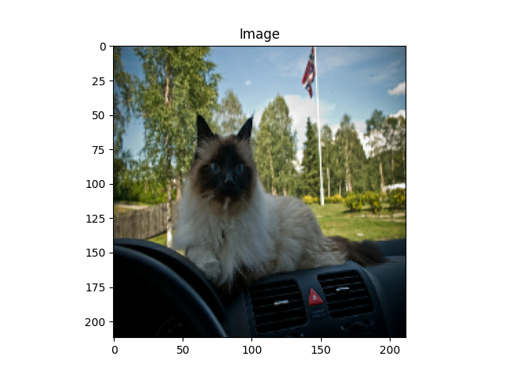
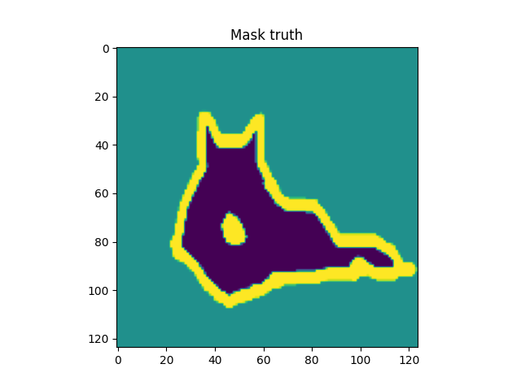
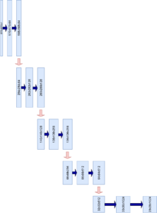
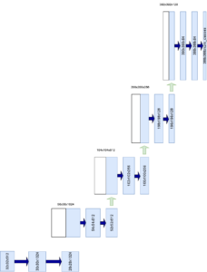
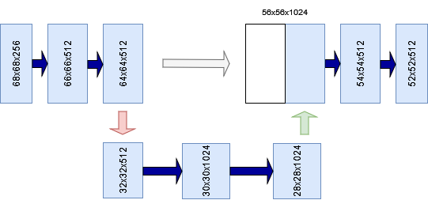

Computer vision has many sub fields - and image segmentation is one of them. By classifying each individual pixel of an image or applying regression to these pixels, it's possible to generate very precise interpretations of input images.

Such interpretations can be very useful in high-precision fields such as medical biology or autonomous driving, to give just a few examples.

One of the key architectures in image segmentation is U-Net. In this article, you're going to take a look at the original U-Net architecture proposed in 2015 by Ronneberger et al. You're going to learn about the contracting path, the expansive path, and the skip connections - and how when put together they give a U shape. In addition, we're discussing how modern U-Nets are built up with a variety of ConvNet backbones.

So, after reading this introduction, you will understand:

- **What image segmentation is at a pixel level, for both classification and regression.**
- **How U-Net can be used for image segmentation through the contractive & expansive paths using skip connections.**
- **What backbones are being used today in U-Net like architectures.**

Let's take a look! 😎

* * *

\[toc\]

* * *

## Solving image segmentation

Classic computer vision approaches using deep learning solutions focused on classification. AlexNet, as created by Krizhevsky et al. (2012), is an example. It uses convolutional layers for feature learning, after which a set of densely-connected layers is attached for assigning a class to the input image.

This allows you to distinguish between cats and dogs, or [hotdog/no hotdog](https://www.machinecurve.com/index.php/2020/10/20/tutorial-building-a-hot-dog-not-hot-dog-classifier-with-tensorflow-and-keras/), to give just a few examples.

Now, there is much more that you can do with images! For example, it should be possible to detect objects within them. If you're familiar with deep learning and computer vision already, it's more than likely that you have heard about approaches like YOLO or [Transformers](https://www.machinecurve.com/index.php/2022/01/04/easy-object-detection-with-python-huggingface-transformers-and-machine-learning/) that draw boxes around objects present in an image.

However, it should be possible to add even more precision to your image. While classic object detectors draw bounding boxes, **image segmentation** approaches perform their work at pixel level. In other words, each pixel is inspected and assigned a class. This allows you to draw very sharp boxes separating your objects.

Source: Parkhi et al. (2012)

### Classification at pixel level

If you've built classification models before, you know that Softmax is used to generate a pseudo probability distribution over your target classes. You can then simply take the maximum argument of your Softmaxed output Tensor to find the class that your sample belongs to. This is called a **segmentation mask**.

At the tail of an image segmentation network, the output Tensor does not represent the whole image - but rather, it's output at pixel level. This means that Softmax will be applied at the pixel level and that you can take the maximum argument for each pixel to find the class it belongs to.

### For regression, too

If we simply left the Softmax out, and set the number of output channels to 1 (or > 1 if you have multiple dependent regression variables), you'll get a linear output for each pixel. This is similar to what you would do when [building a regression model](https://www.machinecurve.com/index.php/2019/07/30/creating-an-mlp-for-regression-with-keras/), but then once again at pixel level. By using a loss function like MAE or MSE, you can now perform image segmentation for regression, too.

It also means that pretrained models for image segmentation for classification can be adapted for regression scenarios, by simply removing the Softmax activation (or only changing the loss function if in fact, Softmax is applied in the loss function - both are possible).

Examples of image segmentation for regression are the following:

- Pixel level depth estimation
- Map value estimation

In the rest of this article, you will learn about U-Net, which is a model for image segmentation. It was introduced by Ronneberger et al. in a 2015 paper on image segmentation in the biomedical sciences. In the original work, U-Net is used for classification.

Let's take a look! 😎

* * *

## U-Net: a high-level perspective

The image below represents the U-Net. As the network is composed of layer groups that are shaped like an U, it's not surprising where the name comes from. The left part and foot of the U is called the **contracting path**, whereas the right part is called the **expansive path**. Jointly, and with the help of **skip connections**, U-nets downsample an input image to learn about its salient features, to reconstruct the input (or a derived product, like a segmentation mask) via upsampling.

Inspired by Ronneberger et al. (2015)

Let's now take a look at the individual components, to begin with the **contracting path.**

In their work on U-Net, Ronneberger et al. (2015) started with a regular convolutional neural network. Each ConvNet is what they call a **contracting network**. In more simple terms, this means that the convolutional layers (and possibly pooling layers) scale down the feature maps (outputs) in size.

For example, if the input to a regular ConvNet is a 32x32x3 image (indeed, that can be a CIFAR-10 sample), a simple 2x2 convolutional layer with regular stride and 12 feature maps would produce a 30x30x12 output. By stacking multiple convolutional layers (and possibly, pooling layers) on top of each other, it becomes possible to scale down the original input to - for example - 10x10x64.

Recall that this allows convolutional neural networks to learn a hierarchy of features, from the more detailed ones (at the start of the network) to the more coarse-grained ones (towards the tail of the network). Because the network looks a bit like a pyramid (it gets less wide the more downstream we get), it _contracts_, and hence is called a _contracting network_.

### From contracting to upsampling

In U-Net, the contracting network is used, but is extended with an _upsampling_ network to reconstruct an output at a specific resolution. This network is called the **expansive path**.

> The main idea \[..\] is to supplement a usual contracting network by successive layers, where pooling operators are replaced by upsampling operators.
> 
> Ronneberger et al. (2015)

Note that in contemporary variations of U-Net, the output is always of equal size to the input in the width and height dimensions (e.g., 32x32x3 --> 32x32xC). In the original U-Net, however, this was not the case!

### The need for skip connections

Now, suppose that you have a working stack of contracting and upsampling layers and thus something that looks very much like a U-Net. It's time to start training and you do so without using pretrained weights, but rather weights initialized by e.g. He init or Xavier init, depending on the activation functions you use.

When performing a forward pass of your images, they are first passed through the contracting part of your U-Net-like model. Then, from the contracted input, they are upsampled again to find e.g. a mask. When upsampling from the contracted (or _summarized_, to view it more conceptually) input at the end of your contracting network, upsampling to find what looks like the original image is really difficult - because you're doing it blindly! At that point in the network, you have absolutely no information about what the original input looked like - except for the summary. If you would imagine it to be a choice between many doors, you would effectively need to walk through every door, see if it's the right door to move through, and if not walk back and try another.

> In order to localize, high resolution features from the contracting path are combined with the upsampled output.
> 
> Ronneberger et al. (2015)

A little bit of steering towards the correct door would thus be very helpful. In U-Net, this is achieved through **skip connections**, which pass the output of each level in the contracting network to the corresponding level in the upsampling network. Jointly with the current state of upsampling, it is used to upsample even further. By combining the _high-level information about the input image_ (which comes from the end of the contracting network) with the _high-level information about the level_, results are expected to be much better.

> The resulting network is applicable to various biomedical segmentation problems.
> 
> Ronneberger et al. (2015)

Turned out it would be applicable to more than just biomedical segmentation problems, too! With tens of thousands of citations, the Ronneberger et al. (2015) paper is one of the key papers in deep learning based image segmentation. U-Net is a widely used architecture, and remains one of the possible choices in image segmentation today.

* * *

## Individual U-Net building blocks

Now that you understand the high-level U-Net architecture, it's a good idea to take a look at its individual components. We begin with the contracting path, followed by the expansive path and the skip connections.

### Contracting path

Inspired by Ronneberger et al. (2015)

The contracting part is composed of multiple building blocks of convolutional layers, the so-called **convolutional blocks**.

The number of convolutional blocks is configurable, but is five in the original paper.

Note that each convolutional block, except for the last, lets its output be used as a skip connection, so in the five-block setting we have four skip connections in total.

> The contracting path follows the typical architecture of a convolutional network. It consists of the repeated application of two 3x3 convolutions (unpadded convolutions), each followed by a rectified linear unit (ReLU) and a 2x2 max pooling operation with stride 2 for downsampling.
> 
> Ronneberger et al. (2015)

Each convolutional block in the U-Net contracting path is composed of two **convolutional layers** with a **3x3** **kernel** size. They are not padded. Recall that when a 3x3 kernel is used with stride 1, image height and width reduce by 2 pixels each. This is clearly visible in the image displaying the contracting path. For example, the input image is contracted from 572x572 pixels to 570x570 and then 568x568 pixels in the convolutional block.

Each convolutional layer is followed by a ReLU activation function.

Between each convolutional block, a **max pooling** operation is performed. It uses a 2x2 pool size and a stride 2 for downsampling. This means that the input image is cut in half width and height wise. This is compensated with a doubling in feature map size. Since the number of feature maps at the start is 64, we end up with a 5-time double, thus 1024 feature maps at the bottom of the U.

So, in other words, _relatively_, the U-Net learns fewer features with high resolution and more features with lower resolution. This allows for a better balance in resource use.

Through the contracting path, an input image is downsampled, and a lot of features are learned. These can now be used for upsampling, both from the output of the contractive path and the skip connections. Let's now take a look at how this is done.

### Expansive path

Inspired by Ronneberger et al. (2015)

Now that you understand the contracting path, it's time to look at the expansive path. It is similar to what happens in the contracting path, but everything happens in inverse.

Instead of downsampling the input image, it's upsampling that is performed. For this reason, the expansive path contains an equal number of blocks compared to the contracting path, but these are **upsampling blocks**.

The general procedure for these upsampling blocks is as follows:

1. Upsampling is performed on the feature maps at a specific level, to effectively go one level upwards in terms of feature map size. Upsampling also decreases the number of feature maps by 2.
2. The skip connection is center cropped to the width and height of the upsampled input. Note that the skip connection has the same number of feature maps as the upsampled input.
3. Both are concatenated, with the skip connection first followed by the upsampled input. The number of feature maps is double now.
4. With two convolutional layers with 2x2 kernels, the feature maps are downsampled again and the number of feature maps is reduced to the original number. So, for example, when the concatenation yields 512x2 = 1024 feature maps, the Conv layers yield 512 again.

For upsampling, upsampling layers with a 2x2 kernel and stride 2 are used. The convolutional layers are once again with 3x3 kernel size and stride 1, followed by ReLU activation.

> Every step in the expansive path consists of an upsampling of the feature map followed by a 2x2 convolution (“up-convolution”) that halves the number of feature channels, a concatenation with the correspondingly cropped feature map from the contracting path, and two 3x3 convolutions, each followed by a ReLU. (...) At the final layer a 1x1 convolution is used to map each 64- component feature vector to the desired number of classes.
> 
> Ronneberger et al. (2015)

This means that eventually you'll end up with an upsampled image with an initial amount of feature maps. Depending on your problem - for example, classification with two possible classes - a 1x1 kernel Convolution is now used to reduce the number of feature maps. The width and height remain the same, but the feature maps are then reduced to - say, 2.

This, of course, can be followed by Softmax activation (either as a separate layer or more preferably, pushed to the loss function) and categorical crossentropy loss for training your image segmentation model for classification. In the case you want to use U-Net for regression, you leave Softmax out and let the output be Linear, with (most probably) 1 output feature map. In regression scenarios, loss functions like MSE and MAE would be good starting points.

### Skip connections

Now that you understand both the contracting and expansive paths, it's time to look into the final core aspect of U-Nets in more detail. Although briefly mentioned in the previous section, it's important to understand what happens to the **skip connections**.

Recall from the section about the contractive path that skip connections are generated **at every level, except for the last one**. Indeed, in the image you can see that skip connections emerge from the four upper contractive levels, while the last one (serving as the bottom of the U) does not generate a skip connection.

A skip connection (gray) at the bottom of the U. Note that the last level has no skip connections. Inspired by Ronneberger et al. (2015)

These skip connections are then re-used at the expansive layers at the opposite side of the U. Do note, however, that in the original setup of U-Net feature map width and height of the skip connection are unequal to (in fact, larger than) those of the upsampled inputs. In other words, it's not possible to concatenate them straight away, if you were to build U-Net.

In their work, Ronneberger et al. (2015) fixed this problem by taking a center crop from the skip connection - a crop of the size of the upsampled input. So, for example, if your skip connection has feature maps of size 136 x 136 pixels while the upsampled input has 104 x 104, the 136 x 136 pixels image is center cropped to 104 x 104 pixels by removing (136-104)/2 pixels from the top, bottom, left and right. Now, both can be concatenated.

> The cropping is necessary due to the loss of border pixels in every convolution.
> 
> Ronneberger et al. (2015)

U-Net greatly benefits from skip connections in the sense that they pass information about "what the network saw" at the particular level in the contracting path, to the expansive path. Recall the door scenario: if you have thousands of options i.e. doors to walk through, you can do so blindly but end up taking many wrong paths - resulting in a long time to find the good direction. If you have some steering, you might make a few judgment errors here and there, but you can find the correct door much quicker.

### A practical note: different backbones in modern U-Nets

So far, you have looked at how the U-Net architecture was implemented in the original work by Ronneberger et al. Over the years, many people have experienced with different setups for U-Nets, including pretraining on e.g. ImageNet and then finetuning to their specific image segmentation tasks.

This means that today, you will likely use a U-Net that no longer utilizes the original architecture as proposed above - but it's still a good starting point, because the contractive path, expansive path and the skip connections remain the same.

Common backbones for U-Net architectures these days are ResNet, ResNeXt, EfficientNet and DenseNet architectures. Often, these have been pretrained on the ImageNet dataset, so that many common features have already been learned. By using these backbone U-Nets, initialized with pretrained weights, it's likely that you can reach convergence on your segmentation problem much faster.

That's it! You have now a high-level understanding of U-Net and its components 😎 If you have any questions, comments or suggestions, feel free to leave a message in the comments section below 💬 I will then try to answer you as quickly as possible. For now, thank you for reading MachineCurve today and happy engineering!

* * *

## References

Krizhevsky, A., Sutskever, I., & Hinton, G. E. (2012). [Imagenet classification with deep convolutional neural networks.](https://proceedings.neurips.cc/paper/2012/file/c399862d3b9d6b76c8436e924a68c45b-Paper.pdf) _Advances in neural information processing systems_, _25_, 1097-1105.

Ronneberger, O., Fischer, P., & Brox, T. (2015, October). [U-net: Convolutional networks for biomedical image segmentation.](https://arxiv.org/abs/1505.04597) In _International Conference on Medical image computing and computer-assisted intervention_ (pp. 234-241). Springer, Cham.

Parkhi, O. M., Vedaldi, A., Zisserman, A., & Jawahar, C. V. (2012, June). [Cats and dogs.](https://www.robots.ox.ac.uk/~vgg/publications/2012/parkhi12a/parkhi12a.pdf) In _2012 IEEE conference on computer vision and pattern recognition_ (pp. 3498-3505). IEEE.
