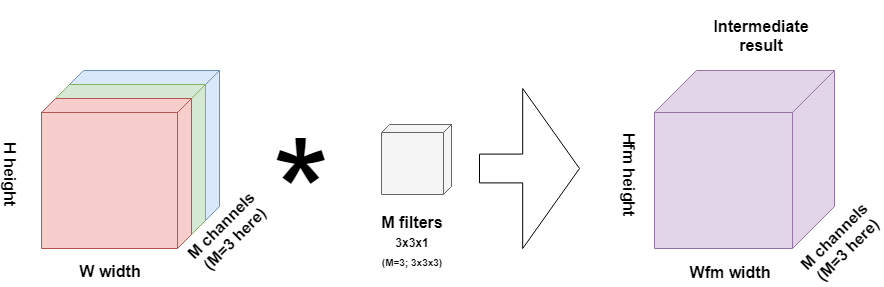
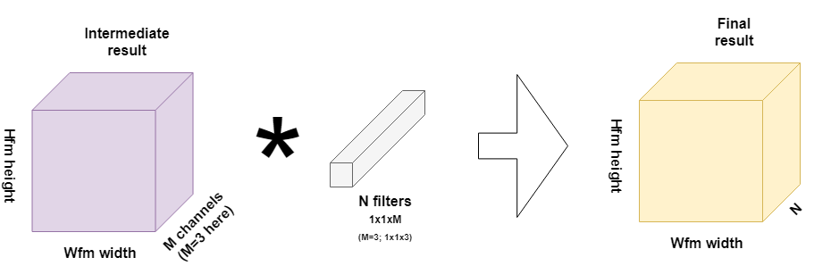

Over the past years, convolutional neural networks (CNNs) have led to massive achievements in machine learning projects. The class of deep learning models has specifically boomed in computer vision, spawning many applications such as [snagging parking spaces with a webcam and a CNN](https://medium.com/@ageitgey/snagging-parking-spaces-with-mask-r-cnn-and-python-955f2231c400).

That's great!

But those networks come at a cost. Training them is relatively costly. Not necessarily in money, because computing power is relatively cheap (the most powerful deep learning instance at AWS costs $33/hour in February 2021), but in time. When you have a massive dataset -which is a necessity when you aim to achieve extremely high performance- you will face substantial training times. It's not uncommon to see that training a deep learning model takes two weeks when the dataset is really big.

This is especially unfavorable when your goal is to test whether your model works and, thus, when you want to iterate quickly.

Although the landscape is slowly changing with GPUs that are becoming exponentially powerful, training convolutional neural networks still takes a lot of time. The main culprit: the number of multiplications during the training process.

**After reading this article, you will understand...**

- Why traditional convolutions yield good performance, but require many computational resources.
- How spatially separable convolutions can reduce the computational requirements, but that they work in only a minority of cases.
- Why depthwise separable convolutions resolve this problem _and_ achieve computational efficiency.

Let's take a look! 🚀

* * *

**Update 05/Feb/2021:** ensure that the article is up to date.

* * *

\[toc\]

* * *

## Summary: how separable convolutions improve neural network performance

**Convolutional Neural Networks** have allowed significant progress to be made in the area of Computer Vision. This is especially true for really deep networks with many convolutional layers. These layers, however, require significant resources to be trained. For example, one convolutional layer trained on 15x15x3 pixel images will already require more than 45.000 multiplications to be made... per image!

**Spatially separable convolutions** help solve this problem. They are convolutions that can be separated across their spatial axis, meaning that one large convolution (e.g. the original Conv layer) can be split into smaller ones that when convolved sequentially produce the same result. By consequence, the number of multiplications goes down, while getting the same resul.t

The downside of these convolutions is that they cannot be used everywhere since only a minority of kernels is spatially separable. To the rescue here are **depthwise separable convolutions**. This technique simply splits convolutions differently, over a depthwise convolution and a pointwise convolution. The depthwise convolution applies the kernel to each individual channel layer only. The pointwise convolution then convolves over all channels at once, but only with a 1x1 kernel. As you can see in the image, you get the same result as with the original Conv layer, but at only 20% of the multiplications required. A substantial reduction!

If you wish to understand everything written above in more detail, make sure to read the rest of this article as well 🚀

* * *

## A traditional convolution

Understanding separable convolutions requires to understand traditional ones first. Because I often try to favor [development use](https://machinecurve.com/index.php/mastering-keras/) of deep learning over pure theory, I had to look into the inner workings of those traditional layers again. Since this provides valuable insights (or a valuable recap) about convolutions and I think you'll better understand separable ones because of it, I'll include my review first.

By consequence, we'll firist look into traditional convolutions. This is such a convolution:

Specifically, it's the inner workings of the **first** convolutional layer in your neural network: it takes an RGB image as its input.

### RGB image and channels

As you know, RGB images can be represented by their _width_, by their _height_ and by their _channels_.

Channels?

Yes, channels: each RGB image is composed of three channels that each describe the 'colorness' of the particular pixel. They do so at the levels _red_, _green_ and _blue_; hence, it's called an _RGB_ image. Above, you'll therefore see the input represented by a cube that itself is composed of the three RGB channels of width W and height H.

### Kernels

As you see, the convolutional layer also contains N so-called _kernels_. A kernel is a very small piece of 'memory' that through training becomes capable of deriving particular features from the image. Kernels are typically 1x1, 3x3 or 5x5 pixels and they 'slide' over the image:

What they essentially do is that element-wise multiplications are computed between the filter and the image currently _under inspection_.

That is, suppose that your filter is 3x3 pixels and currently in the upper left corner of your image. Pixel (1,1) of the image is multiplied with kernel element (1,1); (1,2) with (1,2), and so forth. All those scalar values are summated together and subsequently represent _one scalar_ in the feature map, illustrated on the right in the image above.

### Kernels and multiple channels

When N=1, we arrive at the situation above: a two-dimensional box is slided over the image that has one channel and the result is a summary of the image.

What confused me was what happened when there are multiple channels, like in the image we've seen before:

The kernel itself here is 3x3x3, there are N of them; yet, the feature map that is the result of the convolution operation is HxWxN.

I then found this video which perfectly explained what happens:

https://www.youtube.com/watch?v=KTB\_OFoAQcc

In essence, the fact that the kernel is three-dimensional (WxHxM, with M=3 in the RGB situation above) effectively means that a _cube_ is convolving over the _multichanneled_ image. Equal to the pair-wise multiplications above, the three-dimensional multiplications also result in a scalar value per slide. Hence, a WxHxM kernel results in a feature map third dimension of M, when three kernels are used.

* * *

## Traditional convolutions require many resources

Very often, your neural network is not composed of one convolutional layer. Rather, a few of them summarize your image to an abstract representation that can be used for classification with densely classified layers that behave like [MLPs](https://machinecurve.com/index.php/2019/07/27/how-to-create-a-basic-mlp-classifier-with-the-keras-sequential-api/).

However, a traditional convolution is expensive in terms of the resources that you'll need during training.

We'll investigate next why this is the case.

Suppose that your training set contains 15x15 RGB pixel images (3 channels!) and that you're using 10 3x3x3 pixel kernels to convolve over your training data.

In _one_ convolution on _one_ input image (i.e., 3x3x3 slide over the first 3x3x3 pixels of your RGB image, you'll do 3x3x3 = 27 multiplications to find the first scalar value.

However, we chose to use 10 kernels, so we'll have 270 multiplications for the first 3x3 pixels of your image.

Since we're not using padding, the kernel will have to slide over 13 (15-3+1 = 13) patches, both horizontally and vertically. Hence, per image, we'll have to make 270 x 13 x 13 = 45630 multiplications.

We can generalize this to the following formula when we're not using padding:

**Multiplications per image = Kernel width x Kernel height x Number of channels x Number of kernels x Number of vertical slides x Number of horizontal slides**.

Say that the MNIST dataset added to [Keras](https://machinecurve.com/index.php/2019/09/17/how-to-create-a-cnn-classifier-with-keras/) contains ~60k images, of which ~48k are training data, you get the point: convolutions are expensive - and this was only the first convolutional layer.

Why I'm covering separable convolutions in this blog today is because they might be the (partial) answer to these requirements for computational complexity. They will do the same trick while requiring much fewer resources. Let's start with spatially separable convolutions. Following those, we cover depthwise separable convolutions. For both, we'll show how they might improve the resource requirements for your machine learning projects, and save resources when you're developing convolutional neural nets.

* * *

## Spatially separable convolutions

Spatially separable convolutions, sometimes briefly called _separable convolutions_ (Chollet (2017), although this does not fully cover depthwise separable convolutions), are convolutions that can be separated across their spatial axes.

That is, they can be split into smaller convolutions that, when convolved sequentially, produce the same result.

In [_A Basic Introduction to Separable Convolutions_](https://towardsdatascience.com/a-basic-introduction-to-separable-convolutions-b99ec3102728), Chi-Feng Wang argues that "\[o\]ne of the most famous convolutions that can be separated spatially is the Sobel kernel, used to detect edges":

\[latex\] \\begin{bmatrix} -1 & 0 & 1 \\\\ -2 & 0 & 2 \\\\ -1 & 0 & 1 \\end{bmatrix} = \\begin{bmatrix} 1 \\\\ 2 \\\\ 1 \\end{bmatrix} \\times \\begin{bmatrix} -1 & 0 & 1 \\end{bmatrix} \[/latex\]

### Convolution with normal kernel

Suppose that you're performing a normal convolution operation with this kernel on a 15x15 pixel grayscale image (hence, 1 channel), and only use one kernel and no padding.

Remember the formula?

**Multiplications per image = Kernel width x Kernel height x Number of channels x Number of kernels x Number of vertical slides x Number of horizontal slides**.

Or: 3x3x1x1x13x13 = 1521 multiplications.

### Spatially separated kernel

With the above kernel, you would first convolve the 3x1 kernel and subsequently the 1x3 kernel. This yields for both kernels:

3x1 kernel: 3x1x1x1x13x15 = 585 multiplications.

1x3 kernel: 1x3x1x1x15x13 = 585 multiplications.

585 + 585 = **1170 multiplications.**

Yet, you'll have the same result as with the original kernel!

Spatially separable kernels can thus yield the same result with fewer multiplications, and hence you require fewer computational resources.

### The problem with spatially separable kernels

Then why use traditional convolution at all, you would say?

Well, this is perfectly illustrated in [_A Basic Introduction to Separable Convolutions_](https://towardsdatascience.com/a-basic-introduction-to-separable-convolutions-b99ec3102728).

The point is that only a minority of kernels is spatially separable. Most can't be separated that way. If you would therefore rely on spatially separable kernels while training a convolutional neural network, you would limit the network significantly. Likely, the network won't perform as well as the one trained with traditional kernels, even though it requires fewer resources.

Depthwise separable convolutions might now come to the rescue ;-)

* * *

## Depthwise separable convolutions

A depthwise separable convolution benefits from the same characteristic as spatially separable convolutions, being that splitting the kernels into two smaller ones yields the same result with fewer multiplications, but does so differently. Effectively, two operations are performed in depthwise separable convolutions - sequentially (Geeks for Geeks, 2019):

1. Depthwise convolutions;
2. Pointwise convolutions.

### Depthwise convolutions

As we've seen above, normal convolutions over volumes convolve over the entire volume, i.e. over all the channels at once, producing a WidthxHeightx1 volume for every kernel. Using N kernels therefore produces a WidthxHeightxN volume called the feature map.

In depthwise separable convolutions, particularly the first operation - the depthwise convolution - this does not happen in that way. Rather, each channel is considered separately, and _one filter per channel_ is convolved over _that channel only_. See the example below:

Here, we would use 3 one-channel filters (M=3), since we're interpreting an RGB image. Contrary to traditional convolutions, the result is no _end result_, but rather, an intermediate result that is to be interpreted further in the second phase of the convolutional layer, the pointwise convolution.

### Pointwise convolutions

From the intermediate result onwards, we can then continue with what are called _pointwise convolutions_. Those are filters of 1x1 pixels but which cover all the M intermediate channels generated by the filters, in our case M=3.

And since we're trying to equal the original convolution, we need N of them. Remember that a convolution over a volume produces a SomeWidth x SomeHeight x 1 volume, as the element-wise multiplications performed over three dimensions result in a one-dimensional scalar value. If we would thus apply one such pointwise filter, we would end up with a Hfm x Wfm x 1 volume. As the original convolution produced a Hfm x Wfm x N volume, we need N such pointwise filters.

I visualized this process below:

### Depthwise separable convolutions altogether

When taken altogether, this is how depthwise separable convolutions produce the same result as the original convolution:

First, using depthwise convolutions using M filters, an intermediate result is produced, which is then processed into the final volume by means of the pointwise convolutions. Taking those volumes together, M volume x N volume, yields that the operation is equal to the original kernel volume: (3x3x1 times 1x1xM = 3x3xM = 3x3x3, the volume of our N original kernels indeed). Since we have N such filters, we produce the same result as with our N original kernels.

### How many multiplications do we save?

We recall from convolving with our traditional kernel that we required**3x3x3x10x13x13 = 45630 multiplications** to do so successfully for one image.

How many multiplications do we need for one image when we're using a depthwise separated convolutional layer? How many multiplications do we save?

Remember that we used a 15x15 pixel image without padding. We'll use the same for the depthwise separable convolution. We split our calculation into the number of multiplications for the depthwise and pointwise convolutions and subsequently add them together.

All right, for the depthwise convolution we multiply the _number of convolutions in one full range of volume convolving_times the _number of channels_ times the _number of multiplications per convolution_:

- Number of convolutions in one full range of volume convolving is Horizontal movements x Vertical movements:
    - Horizontal movements = (15 - 3 + 1) = 13
    - Vertical movements = (15 - 3 + 1) = 13
    - One full range of convolving has 13 x 13 = 169 individual convolutions.
- The number of channels is 3, so we do 3 full ranges of volume convolving.
- The number of multiplications per individual convolution equals 3x3x1 since that's the volume of each individual filter.

Hence, the number of multiplications in the depthwise convolutional operation is 13 x 13 x 3 x 3 x 3 x 1 = **4563**.

For the pointwise convolution, we compute the _number of convolutions in one full range of volume convolving over the intermediate result_ times the _number of filters_ times the _number of multiplications per convolution_:

- Number of convolutions in one full range of volume convolving is Horizontal movements x Vertical movements:
    - Horizontal movements = 13, since our kernel is 1x1xM;
    - Vertical movements = 13 for the same reason;
    - Note that the intermediate result was reduced from 15x15x3 to 13x13x3, hence the movements above are 13.
    - One full range of convolving therefore has 13 x 13 = 225 individual convolutions.
- The number of filters in our case is N, and we used N = 10 in the original scenario.
- The number of multiplications per convolution in our case is 1x1xM, since that's our kernel volume, and M = 3 since we used 3 channels, hence 3.

So for the pointwise convolution that's 13 x 13 x 10 x 1 x 1 x 3 = **5070**.

Together, that's 5070 + 4563 = **9633** multiplications, down many from the original 45630!

That's a substantial reduction in the number of multiplications, while keeping the same result!

* * *

## Recap

Today, we've seen how spatially separable and depthwise separable convolutions might significantly reduce the resource requirements for your convolutional neural networks without - in most cases - giving in on accuracy. If you're looking to optimize your convolutional neural network, you should definitely look into those!

In the discussion, we've seen how it's more likely that you find those improvements with depthwise separable convolutions, since not many kernels can be split spatially - being a drawback for your convnets. However, even with depthwise separable convolutions, you'll likely find substantial optimization.

I hope that this blog was useful to understand those convolutions more deeply - writing about them has at least helped me gain understanding. I therefore definitely wish to thank the articles I reference below for providing many valuable insights and, when you're interested in separable convolutions, I definitely recommend checking them out!

If you have any questions, remarks, comments whatsoever - feel free to leave a comment below! 👇 When possible, I'll happily answer _or_ adapt my blog in order to make it better. Thanks and happy engineering! 😄

* * *

## References

Wang, C. (2018, August 14). A Basic Introduction to Separable Convolutions. Retrieved from [https://towardsdatascience.com/a-basic-introduction-to-separable-convolutions-b99ec3102728](https://towardsdatascience.com/a-basic-introduction-to-separable-convolutions-b99ec3102728)

Geeks for Geeks. (2019, August 28). Depth wise Separable Convolutional Neural Networks. Retrieved from [https://www.geeksforgeeks.org/depth-wise-separable-convolutional-neural-networks/](https://www.geeksforgeeks.org/depth-wise-separable-convolutional-neural-networks/)

Chollet, F. (2017). Xception: Deep Learning with Depthwise Separable Convolutions. _2017 IEEE Conference on Computer Vision and Pattern Recognition (CVPR)_. [doi:10.1109/cvpr.2017.195](http://doi.org/10.1109/cvpr.2017.195)
