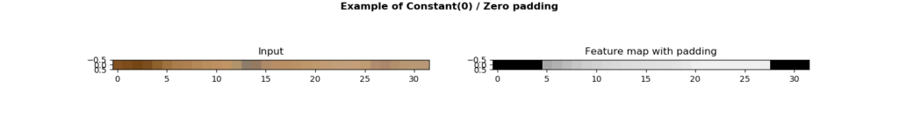
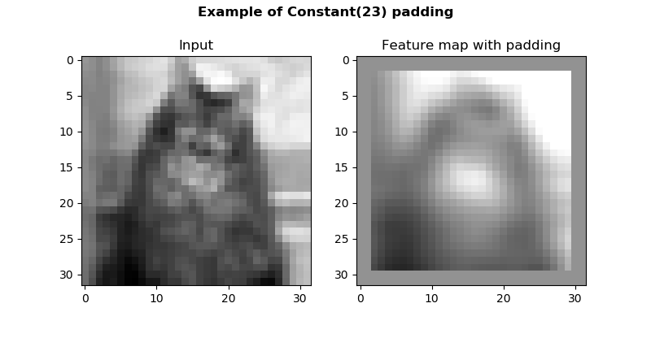
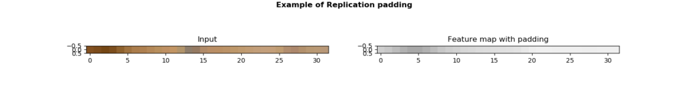

If you're training Convolutional Neural Networks with Keras, it may be that you don't want the size of your feature maps to be smaller than the size of your inputs. For example, because you're using a Conv layer in an autoencoder - where your goal is to generate a final feature map, not reduce the size of its output.

Fortunately, this is possible with [padding](https://www.machinecurve.com/index.php/2020/02/08/how-to-use-padding-with-keras/), which essentially puts your feature map inside a frame that combined has the same size as your input data. Unfortunately, the Keras framework for deep learning only supports Zero Padding by design. This is especially unfortunate because there are types of padding - such as Reflection Padding and Replication Padding - which [may interfere less with the distribution of your data](https://www.machinecurve.com/index.php/2020/02/07/what-is-padding-in-a-neural-network/#reflection-padding) during training.

Now, there's no point in giving up :) That's why we got inspired by an answer on StackOverflow and got to work (StackOverflow, n.d.). By consequence, this blog post presents implementations of Constant Padding, Reflection Padding and Replication Padding to be used with TensorFlow 2.0 based Keras. The implementations are available for 1D and 2D data. Besides the implementation, it will also show you how to use them in an actual Keras model 👩‍💻.

Are you ready? Let's go! 😎

**Update 05/Nov/2020:** added 'TensorFlow' to the title in order to reflect the deep integration between TensorFlow and Keras in TensorFlow 2.x.

* * *

\[toc\]

* * *

## Recap: what is padding and why is it useful?

Suppose that you are training a [convolutional neural network](https://www.machinecurve.com/index.php/2018/12/07/convolutional-neural-networks-and-their-components-for-computer-vision/), which is a type of neural network where so-called "convolutional layers" serve as feature extractors:

[](https://www.machinecurve.com/wp-content/uploads/2019/09/CNN-1.png)

In the drawing above, some input data (which is likely an RGB image) of height \[latex\]H\[/latex\] and width \[latex\]W\[/latex\] is fed to a convolutional layer. This layer, which slides (or "convolves") \[latex\]N\[/latex\] kernels of size 3x3x3 over the input, produces \[latex\]N\[/latex\] so-called "feature maps" as output. Through the _weights_ of the kernels, which have been [optimized](https://www.machinecurve.com/index.php/2019/10/24/gradient-descent-and-its-variants/) based on the training dataset, the neural network learns to recognize featues in the input image.

Note that often, a convolutional neural network consists of quite a few convolutional layers stacked on top of each other. In this case, the feature map that is the output of the first layer, is used as the input of the second, and so on.

Now, due to the way such layers work, the size of one feature map (e.g. \[latex\]H\_{fm}\[/latex\] and \[latex\]W\_{fm}\[/latex\] in the image above) [is _smaller_](https://www.machinecurve.com/index.php/2020/02/07/what-is-padding-in-a-neural-network/#conv-layers-might-induce-spatial-hierarchy) than the size of the input to the layer (\[latex\]H\[/latex\] and \[latex\]W\[/latex\]). However, sometimes, you don't want this to happen. Rather, you wish that the size of the feature map is equal - or perhaps larger - than the size of your input data.

Padding can be used to achieve this. By wrapping the outcome in some "frame", you can ensure that the size of the outputs are equal to those of the input. However, what does this frame look like? In our [article about padding](https://www.machinecurve.com/index.php/2020/02/07/what-is-padding-in-a-neural-network/), we saw that zeros are often used for this. However, we also saw that this might result in worse performance due to the fact that zero padding is claimed to interfere with the distribution of your dataset. _Reflection padding_ and _replication padding_ are introduced as possible fixes for this issue, together with _constant padding_.

Unfortunately, Keras does not support this, [as it only supports zero padding](https://www.machinecurve.com/index.php/2020/02/08/how-to-use-padding-with-keras/). That's why the rest of this blog will introduce constant padding, reflection padding and replication padding to Keras. The code below is compatible with TensorFlow 2.0 based Keras and hence should still work for quite some time from now. If not, feel free to leave a message in the comments box, and I'll try to fix it for you :)

Let's take a look at the first type: using constant padding with Keras 😎

* * *

## Constant padding

The first type of padding that we'll make available for Keras: **constant padding** 😉

### What is constant padding?

Let's take a look at what constant padding does by means of this schematic drawing:

[](https://www.machinecurve.com/wp-content/uploads/2020/02/constantpad.jpg)

As you can see, the feature maps that are the output of the `Conv2D` layer that is applied to the input data, are smaller than the input data itself. This is perfectly normal, and normally, one would apply [zero padding](https://www.machinecurve.com/index.php/2020/02/08/how-to-use-padding-with-keras/#how-to-use-same-zero-padding-with-keras). However, can't we pad with a constant value \[latex\]c\[/latex\] instead of zeros?

Yes!

This is what constant padding does: the "frame" around the feature maps which ensures that their size equals the size of the input data, is filled with the specified \[latex\]c\[/latex\]. Let's now take a look at Keras implementations for 1D and 2D data :)

### Keras ConstantPadding1D

First, constant padding for 1D data - a.k.a. `ConstantPadding1D`:

```
from tensorflow import pad
from tensorflow.keras.layers import Layer

'''
  1D Constant Padding
  Attributes:
    - padding: (padding_left, padding_right) tuple
    - constant: int (default = 0)
'''
class ConstantPadding1D(Layer):
    def __init__(self, padding=(1, 1), constant=0, **kwargs):
        self.padding = tuple(padding)
        self.constant = constant
        super(ConstantPadding1D, self).__init__(**kwargs)

    def compute_output_shape(self, input_shape):
        return input_shape[1] + self.padding[0] + self.padding[1]

    def call(self, input_tensor, mask=None):
        padding_left, padding_right = self.padding
        return pad(input_tensor,  [[0, 0], [padding_left, padding_right], [0, 0]], mode='CONSTANT', constant_values=self.constant)
```

The code above effectively defines a new layer type for Keras, which we call `ConstantPadding1D`. It's defined as a class and hence can be initialized multiple times. It is composed of three definitions:

- `__init__`, which is the class constructor, and serves to lift the variables passed on creation (`padding` and `constant`, respectively) into class scope, which means that every definition can use them.
- `compute_output_shape`, which does what it suggests: it computes the output shape for the layer. In our case, that's the new shape of our `Conv1D` output data, _after_ padding is applied as well.
- `call`, which is where the data (the `input_tensor`) flows through.

#### Results for 1D Constant Padding

Now, let's take a look at whether it works. If we applied `ConstantPadding1D` with `constant = 0` and `padding = (5, 4)` after a `Conv1D` layer with a `kernel_size = 10`, we should expect to see Zero Padding applied to 1D data:

[](https://www.machinecurve.com/wp-content/uploads/2020/02/zero_padding_1d-1.png)

Indeed, the left and the right of the padded feature map clearly show the zeroes being padded successfully. This is supported even more by the fact that if changed into `constant = 23`, the padding changes color, as expected:

[](https://www.machinecurve.com/wp-content/uploads/2020/02/23_pad_1d.png)

In both padding cases, note that the "left side" of the input is very dark, and that this darkness is also visible in the feature map. This provides some trust that it's the actual feature map that we visualize :)

### Keras ConstantPadding2D

Here's `ConstantPadding2D`:

```
from tensorflow import pad
from tensorflow.keras.layers import Layer

'''
  2D Constant Padding
  Attributes:
    - padding: (padding_width, padding_height) tuple
    - constant: int (default = 0)
'''
class ConstantPadding2D(Layer):
    def __init__(self, padding=(1, 1), constant=0, **kwargs):
        self.padding = tuple(padding)
        self.constant = constant
        super(ConstantPadding2D, self).__init__(**kwargs)

    def compute_output_shape(self, input_shape):
        return (input_shape[0], input_shape[1] + 2 * self.padding[0], input_shape[2] + 2 * self.padding[1], input_shape[3])

    def call(self, input_tensor, mask=None):
        padding_width, padding_height = self.padding
        return pad(input_tensor, [[0,0], [padding_height, padding_height], [padding_width, padding_width], [0,0] ], mode='CONSTANT', constant_values=self.constant)
```

The code is pretty similar to the one of `ConstantPadding1D`:

- It still represents a new Keras layer, having the `__init__`, `compute_output_shape` and `call` definitions.
- The output shape that is computed by `compute_output_shape` differs from the 1D version, for the simple reason that both produce a different shape :)
- The `paddings` attribute that is applied to the `pad` function is also different, and suitable for 2D padding.

#### Results for 2D Constant Padding

Now, time for results :) Applying `ConstantPadding2D` with `constant = 0` equals Zero Padding:

[](https://www.machinecurve.com/wp-content/uploads/2020/02/zero_padding.png)

However, the strength of `ConstantPadding2D` over Keras built-in `ZeroPadding2D` is that you can use any constant, as with `ConstantPadding1D`. For example, with `constant = 23`, this is what you get:

[](https://www.machinecurve.com/wp-content/uploads/2020/02/constant23.png)

Great! :D

* * *

## Reflection padding

The second type of padding that we'll make available for Keras: **reflection padding** 😉

### What is reflection padding?

In order to understand reflection padding, it's important that we first take a look at this schematic drawing of \[latex\](1, 2)\[/latex\] padding which, by coincidence ;-), we call "reflection padding":

[](https://www.machinecurve.com/wp-content/uploads/2020/02/reflection_pad.jpg)

Let's now take a look at the first row of our unpadded input, i.e. the yellow box. It's \[latex\]\[3, 5, 1\]\[/latex\]. Reflection padding essentially uses the contents of this row for padding the values directly next to it. For example, move to the right, i.e. from 3 to 1. Then, move one additional box to the right - you'll find a 5. Hey, that's the middle value of our row. Then, you'll find a 3. Hey, that's the first value! And so on. You see the same happening on the left, and on top.

Reflection padding thus "reflects" the row into the padding. This is useful because it ensures that your outputs will transition "smoothly" into the padding. Possibly, this improves the performance of your model, because padded inputs will still look like the original ones in terms of data distribution (Liu et al., 2018).

### Keras ReflectionPadding1D

Here's the implementation for 1D data, i.e. `ReflectionPadding1D`:

```
from tensorflow import pad
from tensorflow.keras.layers import Layer

'''
  1D Reflection Padding
  Attributes:
    - padding: (padding_left, padding_right) tuple
'''
class ReflectionPadding1D(Layer):
    def __init__(self, padding=(1, 1), **kwargs):
        self.padding = tuple(padding)
        super(ReflectionPadding1D, self).__init__(**kwargs)

    def compute_output_shape(self, input_shape):
        return input_shape[1] + self.padding[0] + self.padding[1]

    def call(self, input_tensor, mask=None):
        padding_left, padding_right = self.padding
        return pad(input_tensor,  [[0, 0], [padding_left, padding_right], [0, 0]], mode='REFLECT')
```

Once again, the class is similar to the paddings we've already seen. However, the contents of the `call` operation are different. Particularly, the `mode` has changed, from `CONSTANT` into `REFLECT`. What's more, the `constant_values` attribute was removed, and so was the `self.constant` assignment, simply because we don't need them here.

#### Results for 1D Reflection Padding

Now, when we apply this padding to an 1D input, we can see how it works. Firstly, the kernel reduces the input into a feature map - as you can see, the "dark area" on the left of your input has moved to approximately position 5 in the feature map. It's also 5 times smaller, which makes sense, given our large kernel size.

However, what you'll also see, is that from the "max value" in your feature map at around 5, exact symmetry is visible on the left and on the right. This is indeed reflection padding in action!

[](https://www.machinecurve.com/wp-content/uploads/2020/02/reflection_1d.png)

### Keras ReflectionPadding2D

Now, let's take a look at 2D Reflection Padding, or `ReflectionPadding2D`:

```
from tensorflow import pad
from tensorflow.keras.layers import Layer

'''
  2D Reflection Padding
  Attributes:
    - padding: (padding_width, padding_height) tuple
'''
class ReflectionPadding2D(Layer):
    def __init__(self, padding=(1, 1), **kwargs):
        self.padding = tuple(padding)
        super(ReflectionPadding2D, self).__init__(**kwargs)

    def compute_output_shape(self, input_shape):
        return (input_shape[0], input_shape[1] + 2 * self.padding[0], input_shape[2] + 2 * self.padding[1], input_shape[3])

    def call(self, input_tensor, mask=None):
        padding_width, padding_height = self.padding
        return pad(input_tensor, [[0,0], [padding_height, padding_height], [padding_width, padding_width], [0,0] ], 'REFLECT')
```

The value for `compute_output_shape` is equal to `ConstantPadding2D`. So is the `call` operation, except for `CONSTANT -> REFLECT` and the removal of `self.constant`. Nothing too exciting :)

#### Results for 2D Reflection Padding

...except for the results, perhaps :) Using 2D data, the effect of reflection padding is even more visible. As you can see, with a relatively large kernel, the input is reduced to a more abstract feature map. However, the feature map has the same size as the input data, and shows perfect symmetry around the edges. Reflection padding in action! :)

[](https://www.machinecurve.com/wp-content/uploads/2020/02/reflection.png)

* * *

## Replication padding

The third type of padding that we'll make available for Keras: **replication padding** 😉

### What is replication padding?

Replication padding is pretty similar to reflection padding, actually, and attempts to achieve the same outcome: that the distribution of your data is disturbed as little as possible (Liu et al., 2018).

However, it does so in a slightly different way:

[](https://www.machinecurve.com/wp-content/uploads/2020/02/replication_pad.png)

Instead of a pure _reflection_, like Reflection Padding, _replication_ padding makes a copy of the input, reverses it, and then apply it. Take a look at the first row again: \[latex\]\[3, 5, 1\]\[/latex\] -> \[latex\]\[1, 5, 3\]\[/latex\], after which it's applied. In the results, you should thus see a more broad "transition zone" from _input_ to _padding_.

In TensorFlow, replication padding is not known by the name "replication padding". Instead, in TF, it's called "symmetric padding". Hence, we'll use `SYMMETRIC` as our padding mode throughout the 1D and 2D examples that will follow next.

### Keras ReplicationPadding1D

Here's the code for `ReplicationPadding1D`:

```
from tensorflow import pad
from tensorflow.keras.layers import Layer

'''
  1D Replication Padding
  Attributes:
    - padding: (padding_left, padding_right) tuple
'''
class ReplicationPadding1D(Layer):
    def __init__(self, padding=(1, 1), **kwargs):
        self.padding = tuple(padding)
        super(ReplicationPadding1D, self).__init__(**kwargs)

    def compute_output_shape(self, input_shape):
        return input_shape[1] + self.padding[0] + self.padding[1]

    def call(self, input_tensor, mask=None):
        padding_left, padding_right = self.padding
        return pad(input_tensor,  [[0, 0], [padding_left, padding_right], [0, 0]], mode='SYMMETRIC')
```

Contrary to reflection padding, not much was changed: `REFLECT -> SYMMETRIC`.

#### Results for 1D Replication Padding

Now, let's take a look at the results :)

Indeed, it's clear that the "transition zone" between input and padding is broader. Compared to reflection padding, the gray zone around position 5 is broader. This, obviously, is caused by the _copy_ instead of _reflection_ that replication padding makes:

[](https://www.machinecurve.com/wp-content/uploads/2020/02/replication_1d.png)

### Keras ReplicationPadding2D

Now, the code for 2D Replication Padding a.k.a. `ReplicationPadding2D`:

```
from tensorflow import pad
from tensorflow.keras.layers import Layer

'''
  2D Replication Padding
  Attributes:
    - padding: (padding_width, padding_height) tuple
'''
class ReplicationPadding2D(Layer):
    def __init__(self, padding=(1, 1), **kwargs):
        self.padding = tuple(padding)
        super(ReplicationPadding2D, self).__init__(**kwargs)

    def compute_output_shape(self, input_shape):
        return (input_shape[0], input_shape[1] + 2 * self.padding[0], input_shape[2] + 2 * self.padding[1], input_shape[3])

    def call(self, input_tensor, mask=None):
        padding_width, padding_height = self.padding
        return pad(input_tensor, [[0,0], [padding_height, padding_height], [padding_width, padding_width], [0,0] ], 'SYMMETRIC')
```

#### Results for 2D Replication Padding

Here, the difference between replication and reflection padding is visible even better. The feature map is generated - i.e., it's more abstract than the input data - and it is padded smoothly. However, the "transition zone" is broader than with reflection padding - and this is clearly visible on the bottom right of the feature map:

[](https://www.machinecurve.com/wp-content/uploads/2020/02/replication.png)

* * *

## Using these paddings in a Keras model

Okay, time to show you how to use these paddings :)

We've made `ConstantPadding`, `ReflectionPadding` and `ReplicationPadding` available for `Conv1D` and `Conv2D` layers in Keras, but we still don't know how to use them.

Here's an example for 2D padding, where we create a `Sequential` model, apply a `Conv2D` layer and subsequently apply both replication and constant padding. Obviously, this will produce a padded feature map that is larger than our original input. However, we just wanted to show how to apply replication/reflection padding, _and_ constant padding, as you require an additional parameter there :)

```
model = Sequential()
model.add(Conv2D(img_num_channels, kernel_size=(5, 5), activation='linear', input_shape=input_shape, kernel_initializer=Ones(), bias_initializer=Ones()))
model.add(ReplicationPadding2D(padding=(3, 3)))
model.add(ConstantPadding1D(padding=(5, 4), constant=23))
```

* * *

## Summary

In this blog post, you found how to use Constant Padding, Reflection Padding and Replication Padding with Keras using TensorFlow. The blog started with a recap on padding, showing that you might need it if you want your Conv-generated feature maps to be of equal size to your input data. This was followed by discussing how Keras only supports zero padding, while more advanced paddings are available.

We subsequently provided Python based implementations of these paddings, and gave an example of how to apply them into your Keras models.

I hope you've learnt something from this blog or that it was useful! :) If it was, feel free to leave a comment in the comments section. Please do the same if you think I made mistakes, or when you have questions or remarks.

Thank you for reading MachineCurve today and happy engineering! 😎

\[kerasbox\]

* * *

## References

StackOverflow. (n.d.). Reflection padding Conv2D. Retrieved from [https://stackoverflow.com/questions/50677544/reflection-padding-conv2d](https://stackoverflow.com/questions/50677544/reflection-padding-conv2d)

MachineCurve. (2020, February 9). What is padding in a neural network? Retrieved from [https://www.machinecurve.com/index.php/2020/02/07/what-is-padding-in-a-neural-network/](https://www.machinecurve.com/index.php/2020/02/07/what-is-padding-in-a-neural-network/)

Liu, G., Shih, K. J., Wang, T. C., Reda, F. A., Sapra, K., Yu, Z., … & Catanzaro, B. (2018). [Partial convolution based padding](https://arxiv.org/abs/1811.11718). _arXiv preprint arXiv:1811.11718_.

TensorFlow. (n.d.). tf.pad. Retrieved from [https://www.tensorflow.org/api\_docs/python/tf/pad](https://www.tensorflow.org/api_docs/python/tf/pad)
