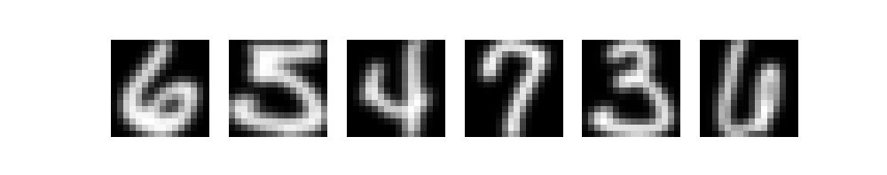

Deep Learning, the subset of Machine Learning which employs Deep Neural Networks for generating models, can be used for many things. Today, it's being used in Google Translate, in Uber's app, and in many [Computer Vision applications](https://www.machinecurve.com/index.php/2018/12/07/convolutional-neural-networks-and-their-components-for-computer-vision/). One of these examples is digit classification in mail delivery. This article will focus on this use case. We will teach you to build your own Neural Network for Digit Classification, but not with the MNIST dataset - which is a pretty common dataset. Rather, we'll be using the USPS Handwritten Digits Dataset, which is made available by scanning many pieces of mail and extracting the digits from them.

The article is structured as follows. Firstly, we'll be taking a look at mail digit classification. Why can it help in the first place? Then, we'll move on to our dataset, the USPS Handwritten Digits Dataset. We will show you how we can use [extra-keras-datasets](https://github.com/christianversloot/extra_keras_datasets) for easy loading of the dataset, and then explore it further. Once we are familiar with the dataset, we will build and train the Deep Learning model, using Python, TensorFlow and Keras. Then, we'll run it, and you will see how it performs.

Let's take a look! 😎

* * *

\[toc\]

* * *

## Why Mail Digit Classification?

Even though the number of mail sent (and I'm not talking about email here, haha, but real mail) has been decreasing for some years (at least in the country where I live), the number of pieces that has to be processed is still enormous. So enormous even, that we can no longer handle them by hand if we expect next-day delivery, sometimes even same-day delivery.

We therefore have to automate away many of the parts of the mail delivery process. This is especially fruitful in process steps that require many repetitive actions, such as the ones undertaken in a distribution center (the video below shows what's going on in just _one_ USPS distribution center during Christmastime). For example, if a piece of mail comes in, the address must be registered and it must be distributed to some part of the distribution center where mail for a particular region is gathered.

Is scanning the address a highly complex operation requiring large amounts of creativity?

No.

Rather, it's a highly repetitive task: read address, move piece of mail. Read address, move piece of mail. And so on, and so on.

For this reason, automation, and the employment of Machine Learning algorithms - which learn to recognize patterns from datasets and which can later employ these learnings to handle new observations - can be really worthwhile in mail distribution centers. In fact, many such algorithms have been around for years, using camera techniques and smart actuators for distributing the mail into the right buckets. It speeds up the mail sorting process and hence the time between sending your mail and a happy smile at the receiving end of the mail process :)

In this article, we'll try to find whether we can build (parts of) such a mail classification system ourselves. We'll be specifically focusing on **digits**, being the numbers 0 to 9. Using Computer Vision technology and Deep Learning, we will build a Neural network capable of classifying mail digits correctly in many cases. Let's take a look at our dataset first.

https://www.youtube.com/watch?v=A3UCmTr5RBk

* * *

## Our dataset: the USPS Handwritten Digits Dataset

For building our Neural Network, we will be using the **USPS Handwritten Digits Dataset**. It is a dataset made available in Hull (1994). It is in fact quite an extensive dataset:

> An image database for handwritten text recognition research is described. Digital images of approximately 5000 city names, 5000 state names, 10000 ZIP Codes, and 50000 alphanumeric characters are included.
> 
> Hull (1994)

It was constructed as follows:

> Each image was scanned from mail in a working post office at 300 pixels/in in 8-bit gray scale on a high-quality flat bed digitizer. The data were unconstrained for the writer, style, and method of preparation. These characteristics help overcome the limitations of earlier databases that contained only isolated characters or were prepared in a laboratory setting under prescribed circumstances.
> 
> Hull (1994)

Let's now take a look at the data in a bit more detail. In order for easy accessibility, we have made available the dataset in our [Extra Keras Datasets package](https://github.com/christianversloot/extra_keras_datasets) which can be installed really easily: `pip install extra-keras-datasets`. We can then call `load_data(...)` to load the data, as we can see here:

```
from extra_keras_datasets import usps

# Load dataset
(X_train, y_train), (X_test, y_test) = usps.load_data()
```

Using Matplotlib, we can then visualize the dataset. If we visualize six random images, we get the following results. Clearly, we are working with small images (they are pixelated if we make them bigger). The dataset also seems to be prepared nicely: numbers are centered, and all numbers are surrounded by a black box (likely, by taking the inverse color after scanning). What's more, the numbers are grayscale digits, which also removes the aspect of color from the equation.



* * *

## Building the Deep Learning model

Now that we are aware of the dataset, we can start building our Deep Learning model. We will use TensorFlow and specifically the `tensorflow.keras` API for building the model. TensorFlow is one of the leading Machine Learning libraries that is being used these days and can be used for constructing Neural networks. Building our network involves the following steps which together create Python code:

1. **Adding imports:** we depend on other packages for building our Neural network. We have to import the specific components that we require first.
2. **Specifying the configuration options:** configuring a Neural network involves specifying some configuration options.
3. **Loading the dataset:** using the Extra Keras Datasets package, we'll easily load the dataset into our code. We will also perform preprocessing activities.
4. **Creating the model skeleton:** we then actually create the Neural network, or more specifically the model skeleton. We will then know what our model _looks like_, but it's not real yet.
5. **Compiling the model:** when compiling the model, we make it real, by instantiating it and configuring it. It can now be used.
6. **Fitting data to the model:** in other words, training the model.
7. **Evaluating the model:** checking how well it works after it was trained.

Let's get to work! Open a code editor, create a file - e.g. `usps.py` - and we can go.

### Adding the imports

As we said, the first thing we have to do is adding the imports.

- First of all, we'll be using the [Extra Keras Datasets](https://www.machinecurve.com/index.php/2020/01/10/making-more-datasets-available-for-keras/) package for importing `usps`, i.e. the USPS Handwritten Digits Dataset.
- We then import the `Sequential` Keras API, which is the foundation for our Keras model. Using this API, we can stack layers on top of each other, which jointly represent the Deep Learning model.
- We will also use a few layers: we'll use [Convolutional ones](https://www.machinecurve.com/index.php/2018/12/07/convolutional-neural-networks-and-their-components-for-computer-vision/) (`Conv2D`) for 2D data (i.e., images), Densely-connected ones (for generating the actual predictions) and `Flatten` (Dense layers can't handle non-1D data, so we must flatten the outputs of our final Conv layers).
- For optimization, we use the [Adam optimizer](https://www.machinecurve.com/index.php/2019/11/03/extensions-to-gradient-descent-from-momentum-to-adabound/#adam) (`tensorflow.keras.optimizers.Adam`) and for [loss](https://www.machinecurve.com/index.php/2019/10/04/about-loss-and-loss-functions/) we use `categorical_crossentropy` [loss](https://www.machinecurve.com/index.php/2019/10/22/how-to-use-binary-categorical-crossentropy-with-keras/).
- Finally, because we use categorical crossentropy loss, we must [one-hot encode our targets](https://www.machinecurve.com/index.php/2020/11/24/one-hot-encoding-for-machine-learning-with-tensorflow-and-keras/). Using the `to_categorical` util, we can achieve this.

```
from extra_keras_datasets import usps
from tensorflow.keras.models import Sequential
from tensorflow.keras.layers import Dense, Flatten, Conv2D
from tensorflow.keras.losses import categorical_crossentropy
from tensorflow.keras.optimizers import Adam
from tensorflow.keras.utils import to_categorical
```

### Specifying the configuration options

Now that we have the imports, we can move on to specifying the configuration options. Strictly speaking, this step is not necessary, because it is possible to define all the options _within_ the later parts (compiling the model, fitting the data ...) as well. However, I think that listing them near the top of your model helps with clarity: you can immediately see how your model is configured. Next, we will therefore specify the configuration options for our ML model:

- Fitting data goes [in batches](https://www.machinecurve.com/index.php/2019/10/24/gradient-descent-and-its-variants/) if you want to avoid exhausting your memory. That's why we have to specify a `batch_size`. We set it to 250 samples, meaning that our [forward pass](https://www.machinecurve.com/index.php/2019/10/04/about-loss-and-loss-functions/#the-high-level-supervised-learning-process) moves 250 samples through the model, generates predictions, and then optimizes. When all batches have passed, the iteration - or epoch - is complete.
- The number of iterations, or `no_epochs`, is set to 150. This means that our model will feed forward samples, generate predictions, and then optimize for 150 times. Is this a good number? We don't know up front. If you want to stop at precisely the good moment, [you can apply callbacks](https://www.machinecurve.com/index.php/2019/05/30/avoid-wasting-resources-with-earlystopping-and-modelcheckpoint-in-keras/), but for the purpose of this experiment, setting a fixed number of epochs will work well.
- Some of the training data must be used for [validation purposes](https://www.machinecurve.com/index.php/2020/11/16/how-to-easily-create-a-train-test-split-for-your-machine-learning-model/). In other words, it must be used to steer the training process _while training is happening_, to preserve the testing set for true model evaluation. We therefore set `validation_split_size` to `0.20`, meaning that we use 20% of the training data for validation purposes.
- We set `verbosity` to 1, which will instruct Keras to print all outputs on screen. This slows down the training process slightly, so it's best not to use it for production training settings (if you want small summaries, you can set `verbosity = 2`, otherwise I recommend `verbosity = 0`). However, for this experiment, we actually _want_ everything to be displayed on screen.
- We use the [Adam optimizer](https://www.machinecurve.com/index.php/2019/11/03/extensions-to-gradient-descent-from-momentum-to-adabound/) and [categorical crossentropy loss](https://www.machinecurve.com/index.php/2019/10/22/how-to-use-binary-categorical-crossentropy-with-keras/) for the optimization process, and specify accuracy as an additional metric, because it is more intuitive for humans.

```
# Configuration options
batch_size = 250
no_epochs = 150
validation_split_size = 0.20
verbosity = 1
optimizer = Adam()
loss_function = categorical_crossentropy
additional_metrics = ['accuracy']
```

### Loading the dataset

Now that we have specified the configuration options, it's time to load the dataset. Fortunately, with the [Extra Keras Datasets package](https://www.machinecurve.com/index.php/2020/01/10/making-more-datasets-available-for-keras/), this is really easy:

```
# Load dataset
(X_train, y_train), (X_test, y_test) = usps.load_data()
```

If you don't have this package yet: it can be installed easily, using `pip install extra-keras-datasets`.

Next, we have to do three things:

- [Scale the data](https://www.machinecurve.com/index.php/2020/11/19/how-to-normalize-or-standardize-a-dataset-in-python/) to the \[latex\]\[0, 1\]\[/latex\] range, which helps the optimization process.
- Reshape the 2D grayscale data (which has dimensions for `width` and `height` only) into a 3D object, because the [Conv2D](https://www.machinecurve.com/index.php/2019/09/17/how-to-create-a-cnn-classifier-with-keras/) accepts arrays with 3D inputs (`width`, `height` and `color channels` only). We'll therefore reshape each sample into `(width, height, 1)`, which does not change anything semantically.
- Convert our target values to [one-hot encoded format](https://www.machinecurve.com/index.php/2020/11/24/one-hot-encoding-for-machine-learning-with-tensorflow-and-keras/), which makes them compatible with our usage of categorical crossentropy loss.

Let's add these tasks to our code:

```
# Set to [0, 1] range
X_train = X_train / 255.0
X_test  = X_test / 255.0

# Reshape 2D grayscale data into 2D-grayscale-with-one-channel data
X_train = X_train.reshape(X_train.shape[0], X_train.shape[1], X_train.shape[2], 1)
X_test = X_test.reshape(X_test.shape[0], X_test.shape[1], X_test.shape[2], 1)

# Convert targets into one-hot encoded format
y_train = to_categorical(y_train)
y_test  = to_categorical(y_test)
```

### Creating the model skeleton

It's now time to create the skeleton for our Neural network. This skeleton describes _what our model looks like_. It does however not create a model that we can use (we must compile it in the next section before we can use it).

Recall that in a Neural network, we have an input layer, hidden layers and an output layer. In our model skeleton, we describe the structure of our hidden layers and our output layer. Keras [will construct the input layer for us](https://www.machinecurve.com/index.php/2020/04/05/how-to-find-the-value-for-keras-input_shape-input_dim/). What we must do, however, is showing Keras what it must look like. We'll therefore derive the input shape from one sample and specify it as the shape of our input layer shape later:

```
# Input shape
input_shape = X_train[0].shape
print(f'Input shape = {input_shape}')
```

We can then create the model skeleton:

- We first initialize the Sequential API into the `model` variable, giving us an empty model to work with.
- We then stack a few layers on top of each other and indirectly on top of the `model` foundation by calling `model.add(...)`. Specifically, we use two Convolutional layers, then Flatten the feature maps generated by the last layer, and use Dense layers for the final prediction ([using Softmax](https://www.machinecurve.com/index.php/2020/01/08/how-does-the-softmax-activation-function-work/)).
- Specifically note the `input_shape = input_shape` assignment in the first layer, telling Keras what the shape of an input sample looks like!

```
# Create the model
model = Sequential()
model.add(Conv2D(16, kernel_size=(3, 3), activation='relu', input_shape=input_shape))
model.add(Conv2D(8, kernel_size=(3, 3), activation='relu'))
model.add(Flatten())
model.add(Dense(32, activation='relu'))
model.add(Dense(10, activation='softmax'))
```

### Compiling the model

We can now compile our model skeleton into a functional model. Since we already specified the configuration options before, this is really easy:

```
# Compile the model
model.compile(loss=loss_function,
              optimizer=optimizer,
              metrics=additional_metrics)
```

### Fitting data to the model

The same is true for starting the training process, or fitting data to the model:

```
# Fit data to model
model.fit(X_train, y_train,
          batch_size=batch_size,
          epochs=no_epochs,
          verbose=verbosity,
          validation_split=validation_split_size)
```

We explicitly fit the `(X_train, y_train)` data, applying the 80/20 validation split before actually starting the training process. The other configuration options speak for themselves, because we already covered them in the previous section about specifying the configuration options.

### Evaluating the model

Should we now run our Python code, we will see that our model starts training, and that it will eventually finish. However, doing that, we can only check whether our model works well _on training data_. As we know, [we cannot rely on that data](https://www.machinecurve.com/index.php/2020/11/16/how-to-easily-create-a-train-test-split-for-your-machine-learning-model/) if we want to [evaluate our model](https://www.machinecurve.com/index.php/2020/11/03/how-to-evaluate-a-keras-model-with-model-evaluate/), because it is like checking your own homework. We therefore have to use testing data for evaluation purposes, in order to find out how well our model really works.

We can easily perform a model evaluation step with the testing data, as follows:

```
# Generate generalization metrics
score = model.evaluate(X_test, y_test, verbose=0)
print(f'Test loss: {score[0]} / Test accuracy: {score[1]}')
```

* * *

## Running the model

Now that we have written code for configuration options, loading and preparing the dataset, constructing and compiling the model, and subsequently training and evaluating it, we can actually run the model.

Therefore, save your `usps.py` file, open up a terminal where you have TensorFlow and [Extra Keras Datasets](https://www.machinecurve.com/index.php/2020/01/10/making-more-datasets-available-for-keras/) installed, and run `python usps.py`.

If the dataset hasn't been loaded onto your machine yet, you will first see a loading bar that illustrates the dataset download process. Then, you'll find that your model starts training.

```
Epoch 1/150
5832/5832 [==============================] - 2s 350us/sample - loss: 2.2843 - accuracy: 0.1632 - val_loss: 2.2766 - val_accuracy: 0.1590
Epoch 2/150
5832/5832 [==============================] - 0s 26us/sample - loss: 2.2399 - accuracy: 0.2327 - val_loss: 2.2148 - val_accuracy: 0.2954
Epoch 3/150
5832/5832 [==============================] - 0s 26us/sample - loss: 2.1096 - accuracy: 0.3009 - val_loss: 1.9877 - val_accuracy: 0.3002
Epoch 4/150
5832/5832 [==============================] - 0s 25us/sample - loss: 1.7524 - accuracy: 0.4114 - val_loss: 1.5406 - val_accuracy: 0.5278
Epoch 5/150
5832/5832 [==============================] - 0s 24us/sample - loss: 1.2502 - accuracy: 0.6722 - val_loss: 1.0161 - val_accuracy: 0.7313
Epoch 6/150
3000/5832 [==============>...............] - ETA: 0s - loss: 0.8810 - accuracy: 0.8007
```

After it has finished, our validation accuracy is close to 96%. This is good, but we cannot trust validation data fully either (because it is used in the training process, it can also leave its marks on the model internals, rendering it a bit suspect). We really have to use testing data, i.e. data that the model has never seen during training, for model evaluation.

The evaluation result is also displayed on screen:

```
Test loss: 0.3841879335271522 / Test accuracy: 0.9217737913131714
```

Clearly, we can see that our model performs a bit worse with testing data, but still - it performs at a 92.2% accuracy. That's good!

* * *

## Summary

In this article, we saw how we can create a Neural network for digits classification with TensorFlow and Keras. Contrary to many other articles, which use the [MNIST dataset](https://www.machinecurve.com/index.php/2019/12/31/exploring-the-keras-datasets/#mnist-database-of-handwritten-digits), we used a different one - the USPS Handwritten Digits Dataset, available through the Extra Keras Datasets package.

We firstly saw why digits classification can help in the mail distribution process. We then briefly looked at the dataset, and saw that it is composed of many handwritten digits, scanned from real, USPS-distributed mail. Then, we moved on to model construction, showing you how to build and train a TensorFlow/Keras model for digits classification with step-by-step examples. With the dataset and our Neural network, we achieved a 92.2% accuracy on our testing dataset.

I hope that you have learned something from today's article! If you did, please feel free to leave a comment in the comments section - I'd love to hear from you 💬 Please do the same if you have questions or other remarks. Whenever possible, I'll try to help you move forward in your ML career.

Regardless of that, thank you for reading MachineCurve today and happy engineering! 😎

* * *

## References

J. J. Hull. (1994). A database for handwritten text recognition research. _IEEE Transactions on Pattern Analysis and Machine Intelligence_, _16_(5), 550–554. https://doi.org/10.1109/34.291440
