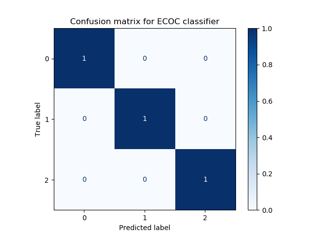
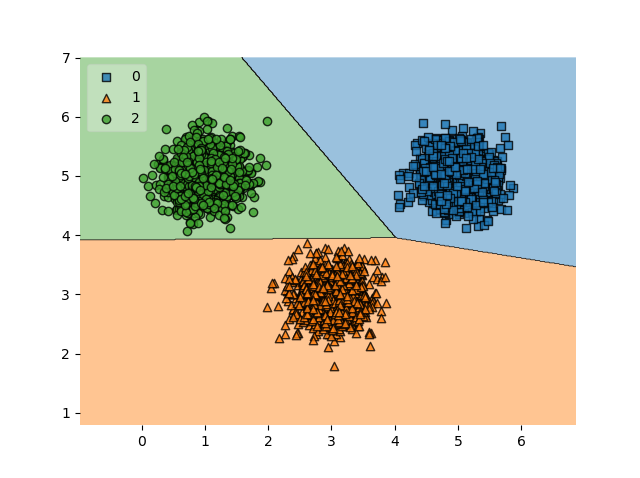

Classification is a key theme in the area of Supervised Machine Learning. As we saw in [another article](https://www.machinecurve.com/index.php/2020/10/19/3-variants-of-classification-problems-in-machine-learning/), there are multiple forms of classification - binary, multiclass and multilabel. In binary classification, an input sample is categorized into one out of two categories. In other words, into "0 or 1", or "False or True" - you name it.

While this can be a good approach if you have a binary classification problem, many of today's classification problems are multiclass. Think about the [COVID-19 classifier](https://www.machinecurve.com/index.php/2020/11/05/ml-against-covid-19-detecting-disease-with-tensorflow-keras-and-transfer-learning/), for example: it has three classes, namely COVID-19 pneumonia, Other Viral pneumonia and no pneumonia. And there are many more examples. Finally, there is also multilabel classification, where multiple classes (also known as labels in that case) are attached to an input sample.

A variety of algorithms is natively capable of multiclass classification. Neural networks, for example, can achieve this by learning to generate a multiclass probability distribution with [Softmax](https://www.machinecurve.com/index.php/2020/01/08/how-does-the-softmax-activation-function-work/). Support Vector Machines (SVMs), on the other hand, cannot do this natively. There are however many approaches to creating a multiclass SVM classifier anyway. Having covered [One-vs-Rest and One-vs-One SVMs](https://www.machinecurve.com/index.php/2020/11/11/creating-one-vs-rest-and-one-vs-one-svm-classifiers-with-scikit-learn/) in another article, we will focus on **Error-Correcting Output Codes** (ECOC) in today's article. It is structured as follows. Firstly, we'll revisit why SVMs aren't capable of performing multiclass classification natively. Then, we introduce ECOCs conceptually. What are they? How can they be used for multiclass classification? Those are the questions we will answer.

Finally, we will implement an ECOC based Support Vector Machine with the Scikit-learn Machine Learning library. Step by step, we'll look at how one can be constructed. Let's take a look! :)

* * *

\[toc\]

* * *

## Why SVMs don't support multiclass classification natively

Suppose that we have the following assembly line, where red, yellow and blue objects are rolling down the line. They must be added to the correct bucket, which is then shipped to diverse customers. This is a **multiclass classification scenario:**


As the task at hand (looking at the objects and putting them into the correct buckets) is really repetitive, we could create an automated system that performs the task for us. This system contains what is known as a _multiclass classifier_. It generates a decision boundary between the classes based on a set of characteristics called _features_. If two features would characterize an object (e.g. **shape** and **color**), and if we could plot them on two axes (the image below is fictitious), such a decision boundary _could_ look like this:


As said, some Machine Learning algorithms - like the ones that optimize a Neural network - can automatically generate a decision boundary between multiple classes. For [Support Vector Machines](https://www.machinecurve.com/index.php/2019/09/20/intuitively-understanding-svm-and-svr/), this does not work for the simple reason that SVMs don't support this natively. But why? Let's take a look at how an SVM operates.

An SVM is known as a _kernel method_ that _maximizes the margin between two classes_ by means of _[support vectors](https://www.machinecurve.com/index.php/2020/05/05/how-to-visualize-support-vectors-of-your-svm-classifier/)_. Kernel methods mean that a so-called _kernel function_ is used to generate a linear separation boundary between two classes by mapping the samples from the original feature space (i.e. axes) onto another one, where linear separation can be achieved. If the data is already linearly separable, like the black and white classes in the image below, separation is simple. In other cases, we must use more advanced [kernel functions](https://www.machinecurve.com/index.php/2019/09/20/intuitively-understanding-svm-and-svr/) for this purpose.

In the figure below, we can observe three decision boundaries, namely \[latex\]H\_1\[/latex\], \[latex\]H\_2\[/latex\] and \[latex\]H\_3\[/latex\]. But which one is best?

- **Is \[latex\]H\_1\[/latex\] best?** No, definitely not. It is not even capable of separating black and white, and is therefore not usable. We see such decision boundaries often by models that have just been initialized, which happens relatively randomly. Soon after, the decision boundary starts to shift.
- **Is \[latex\]H\_2\[/latex\] best?** Neither! Although it _is_ capable of separating between black and white, it is only marginally so. Especially if an outlier from the black class is present, the odds are that it is not able to assign it the correct class, because it "crosses the line". While \[latex\]H\_2\[/latex\] is a decision boundary that works, we often see those boundaries in stages of the training process where separation has _just_ been achieved, but where more optimal solutions are available.
- **Is \[latex\]H\_3\[/latex\] best?** Finally, yes. It is both capable of separating between the two classes _and_ does so with an equal distance between \[latex\]H\_3\[/latex\] and the earliest black vectors and \[latex\]H\_3\[/latex\] and the earliest white vectors, which both are called _support vectors_. This is called a _maximum margin_ and means that the boundary is _equidistant_ to the two classes (Wikipedia, 2005).

Now this is why Support Vector Machines are called _Support Vector_ Machines. We now also know how they work, i.e. by generating a maximum-margin linear decision boundary, by means of a kernel function.


Hyperplanes and data points. The [image](https://en.wikipedia.org/wiki/Support-vector_machine#/media/File:Svm_separating_hyperplanes_(SVG).svg)is not edited. Author: [Zack Weinberg](https://commons.wikimedia.org/w/index.php?title=User:ZackWeinberg&action=edit&redlink=1), derived from [Cyc’s](https://commons.wikimedia.org/w/index.php?title=User:Cyc&action=edit&redlink=1) work. License: [CC BY-SA 3.0](https://creativecommons.org/licenses/by-sa/3.0/legalcode)

What remains unanswered is why SVMs cannot be used for multiclass classification. The answer is in fact really simple. Recall that the decision boundary must be equidistant for an SVM to converge, meaning that it must be as far as possible from both classes - and hence perfectly in the middle.

Now suppose that we add a third class and hence our decision boundary splits into three line segments, like in the green/blue/orange figure above. In this case, the line segment between blue and orange is equidistant for those two classes, but not for the green class. The same is true for the other two line segments. Since SVMs always try to find a maximum margin decision boundary, finding one for > 2 classes is impossible. This is why SVMs cannot be used for multiclass classification natively.

Fortunately, there is a solution: training multiple binary classifiers at once and using them jointly for generating a multiclass prediction. The [One-vs-Rest and One-vs-One](https://www.machinecurve.com/index.php/2020/11/11/creating-one-vs-rest-and-one-vs-one-svm-classifiers-with-scikit-learn/) are two approaches that train multiple classifiers that compete against each other. In this article, we will continue with an interesting but different approach: that of Error-Correcting Output Codes.

* * *

## Introducing Error-Correcting Output Codes

Let's recall that above, we were working on a three-class multiclass classification problem. **Error-Correcting Output Codes** (ECOC) represent a method for doing so by generating a variety of binary classifiers that predict _output codes_. In the table below, we see what is called a three-bit _output code_ for each class. With an output code, a class can be described in some multidimensional space (in this case, a three-dimensional space). In other words, in our case, we can draw a vector \[latex\](0, 0, 1)\[/latex\] in three-dimensional space in order to represent class 0. The same can be done for classes 1 and 2, making them unique.

Output codes can be used to generate a multiclass classifier, by learning a wide range of binary classifiers that predict specific bits in the output code. For example, in our three-class classification scenario, a three-bit output code is capable of describing each class. Binary classifier 3 (B3) predicts whether the input sample looks more like class 0 or like classes 1/2. B2 predicts whether the input sample looks more like class 1 or like classes 0/2. B1 predicts whether it's class 2 or classes 0/1.

By aggregating the binary classifier predictions, we get a number of bits - the output code. When generating the multiclass prediction, after aggregating the individual predictions into an output code, the predicted output code is compared to the classes available and their corresponding output code. The closest match is picked as the predicted class. This way, ECOC can be used to generate a multiclass classifier.

<table><tbody><tr><td><strong>Class / Classifier</strong></td><td>B1</td><td>B2</td><td>B3</td></tr><tr><td>0</td><td>0</td><td>0</td><td>1</td></tr><tr><td>1</td><td>0</td><td>1</td><td>0</td></tr><tr><td>2</td><td>1</td><td>0</td><td>0</td></tr></tbody></table>

We haven't yet discussed why they are called _error-correcting_. The reason is simple. While for an N-class multiclass problem at least N binary classifiers must be trained, it is possible to train many more. For example, if we want to represent the three classes with 15-bit output codes (and hence 15 binary classifiers), this is perfectly possible. This is also what makes the method error-correcting: with each additional classifier, the output codes become more complex and therefore much more tailored to a specific class because _the closest class output code is chosen_.

Now, if one binary classifier is wrong, the impact would be bigger if the number of classifiers is low (e.g., a wrong prediction in the table above would immediately switch classes). If the number is high, only one out of many bits would be wrong, and the resulting output code could still be closest to the class we actually want the input to be assigned. In other words, using more binary classifiers allows them to "correct the errors of their colleagues". Of course, the more binary classifiers are added, the more resources for training are required.

Another aspect that we must cover is the initialization of the output codes. In the table above, we initialized the output codes randomly - I did not put any thought in assigning the numbers, except that the output codes must be unique. In many cases, random initialization provides adequate results. However, and especially in the case where many binary classifiers are used, better methods could exist (Scikit-learn, n.d.). It is however beyond the scope of this article to discuss them in detail.

* * *

## Implementing an ECOC based SVM with Scikit-learn

Imagine that you would need to generate a multiclass classifier for this linearly separable dataset in a two-dimensional feature space:


Constructing the dataset can be done in the following way:

```
from sklearn.datasets import make_blobs

# Configuration options
num_samples_total = 10000
cluster_centers = [(5,5), (3,3), (1,5)]
num_classes = len(cluster_centers)

# Generate data
X, y = make_blobs(n_samples = num_samples_total, centers = cluster_centers, n_features = num_classes, center_box=(0, 1), cluster_std = 0.30)
```

Note that for both the code above and the code below, we assume that you have installed the common data science dependencies. For today's code, they include `sklearn`, `matplotlib`, `numpy` and (if desired, otherwise code can be scrapped) `mlxtend`.

Now that we have a dataset that we can use for generating an ECOC based multiclass SVM, we can actually create our model. For creating it, we will use [Scikit-learn](https://scikit-learn.org/stable/), a widely used library for Machine Learning in Python. Let's now take a look at the code for our model and walk through it step-by-step.

- First of all, we must import all the dependencies that we need. We import `pyplot` from `matplotlib` as `plt` for visualizing the data, like we did above. Numpy will be used for saving the clusters if necessary; this could be useful if you want to perform model changes and run them with _exactly_ the same generated data. We then use many functions from `sklearn`. The `make_blobs` function will be used for data generation. `OutputCodeClassifier` is a wrapper that makes a Scikit-learn model multiclass by adding ECOC classification. `LinearSVC` is a linear SVM, which is adequate for today's article since our data can be separated linearly. `Train_test_split` can be used by generating a split between training data and testing data. With `plot_confusion_matrix`, we can generate a [confusion matrix](https://www.machinecurve.com/index.php/2020/05/05/how-to-create-a-confusion-matrix-with-scikit-learn/) for our classifier. Finally, importing from `mlxtend`, we add `plot_decision_regions`, for [visualizing the decision boundaries](https://www.machinecurve.com/index.php/2019/10/11/how-to-visualize-the-decision-boundary-for-your-keras-model/) for our model.
- We then specify configuration options for data generation. We create 10.000 samples around three centers, and hence have 3 classes.
- Subsequently, we generate data by calling `make_blobs` for the number of samples, centers and number of classes specified above. We set a standard deviation of 0.30 in order to make the plots only a little bit scattered, but not too much.
- We then save and load the data into a `.npy` file. If you want to tune the model and train it with exactly the same data, this is useful - by simply commenting `save`, you'll always use the same data. If you don't want this, you can also delete the code.
- We then make the train/test split with `train_test_split` and store the split data in `X_train`, `X_test`, `y_train` and `y_test` (i.e. the split feature vectors and corresponding labels).
- We then create the `LinearSVC` SVM and initialize it with some random state.
- We then wrap the `svm` into the `OutputCodeClassifier`, making it an ECOC classifier. The `code_size` attribute represents the "percentage of the number of classes to be used to create the code book." (Scikit-learn, n.d.)
- We then fit the training data to the `ecoc_classifier`, starting the training process. After fitting has completed, our trained ECOC classifier is also available in `ecoc_classifier`, because we assign it there.
- The trained classifier can then be evaluated. Performing classification analysis using a [confusion matrix](https://www.machinecurve.com/index.php/2020/05/05/how-to-create-a-confusion-matrix-with-scikit-learn/) is a useful tool for quick-and-dirty analysis of model performance. We use `plot_confusion_matrix` with the testing data and some Matplotlib colormap to generate the confusion matrix. With `normalize='true'`, we instruct Scikit to display the _normalized_ predictions: in other words, we don't see the absolute amount of predictions on screen, but rather the proportions between predictions.
- We finally plot the confusion matrix with Matplotlib.

```
import matplotlib.pyplot as plt
import numpy as np
from sklearn.datasets import make_blobs
from sklearn.multiclass import OutputCodeClassifier
from sklearn.svm import LinearSVC
from sklearn.model_selection import train_test_split
from sklearn.metrics import plot_confusion_matrix
from mlxtend.plotting import plot_decision_regions

# Configuration options
num_samples_total = 10000
cluster_centers = [(5,5), (3,3), (1,5)]
num_classes = len(cluster_centers)

# Generate data
X, y = make_blobs(n_samples = num_samples_total, centers = cluster_centers, n_features = num_classes, center_box=(0, 1), cluster_std = 0.30)

# Save/load data
np.save('./clusters.npy', X)
X = np.load('./clusters.npy')

# Split into training and testing data
X_train, X_test, y_train, y_test = train_test_split(X, y, test_size=0.33, random_state=42)

# Create the SVM
svm = LinearSVC(random_state=42)

# Make it an ECOC classifier
ecoc_classifier = OutputCodeClassifier(svm, code_size=6)

# Fit the data to the ECOC classifier
ecoc_classifier = ecoc_classifier.fit(X_train, y_train)

# Evaluate by means of a confusion matrix
matrix = plot_confusion_matrix(ecoc_classifier, X_test, y_test,
                                 cmap=plt.cm.Blues,
                                 normalize='true')
plt.title('Confusion matrix for ECOC classifier')
plt.show(matrix)
plt.show()

# Plot decision boundary
plot_decision_regions(X_test, y_test, clf=ecoc_classifier, legend=2)
plt.show()
```

Running our code, our end result is a SVM-based linear classifier that is capable of learning a correct decision boundary. As with any perfect setting (i.e. our data is linearly separable), our confusion matrix shows great performance. Of course, in the real world, your data is likely not linearly separable and the confusion matrix will be more diffuse.

- 
    
- 
    

* * *

## Summary

Support Vector Machines do not support multiclass classification natively. Fortunately, by using some techniques, such classifiers can be achieved - even with SVMs. In this article, we covered Error-Correcting Output Codes. These codes, which effectively map input samples to some region of a multidimensional space (and hence a class), can uniquely describe classes through multiple binary classifiers. More than the strictly required number of binary classifiers can be added, reducing the system's sensitivity to errors, making the output codes _error-correcting_.

We also provided an example of ECOC based multiclass classification with SVMs through the `OutputCodeClassifier` in Scikit-learn. In the example above, we walked through creating it step-by-step, so that you can understand in detail how such classifiers can be constructed.

I hope that you have learned something from today's article! If you did, please feel free to drop a message in the comments section below 💬 Please do the same if you have any questions or other remarks. I'd love to hear from you and will respond whenever possible. Thank you for reading MachineCurve today and happy engineering! 😎

* * *

## References

Wikipedia. (2005, February 21). _Equidistant_. Wikipedia, the free encyclopedia. Retrieved November 11, 2020, from [https://en.wikipedia.org/wiki/Equidistant](https://en.wikipedia.org/wiki/Equidistant)

Error-Correcting Output Codes. (n.d.). [https://www.ccs.neu.edu/home/vip/teach/MLcourse/4\_boosting/lecture\_notes/ecoc/ecoc.pdf](https://www.ccs.neu.edu/home/vip/teach/MLcourse/4_boosting/lecture_notes/ecoc/ecoc.pdf)

Scikit-learn. (n.d.). _1.12. Multiclass and multilabel algorithms — scikit-learn 0.23.2 documentation_. scikit-learn: machine learning in Python — scikit-learn 0.16.1 documentation. Retrieved November 12, 2020, from [https://scikit-learn.org/stable/modules/multiclass.html#error-correcting-output-codes](https://scikit-learn.org/stable/modules/multiclass.html#error-correcting-output-codes)

Scikit-learn. (n.d.). _Sklearn.multiclass.OutputCodeClassifier — scikit-learn 0.23.2 documentation_. scikit-learn: machine learning in Python — scikit-learn 0.16.1 documentation. Retrieved November 12, 2020, from [https://scikit-learn.org/stable/modules/generated/sklearn.multiclass.OutputCodeClassifier.html#sklearn.multiclass.OutputCodeClassifier](https://scikit-learn.org/stable/modules/generated/sklearn.multiclass.OutputCodeClassifier.html#sklearn.multiclass.OutputCodeClassifier)
