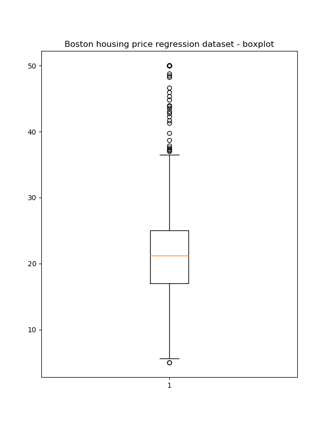
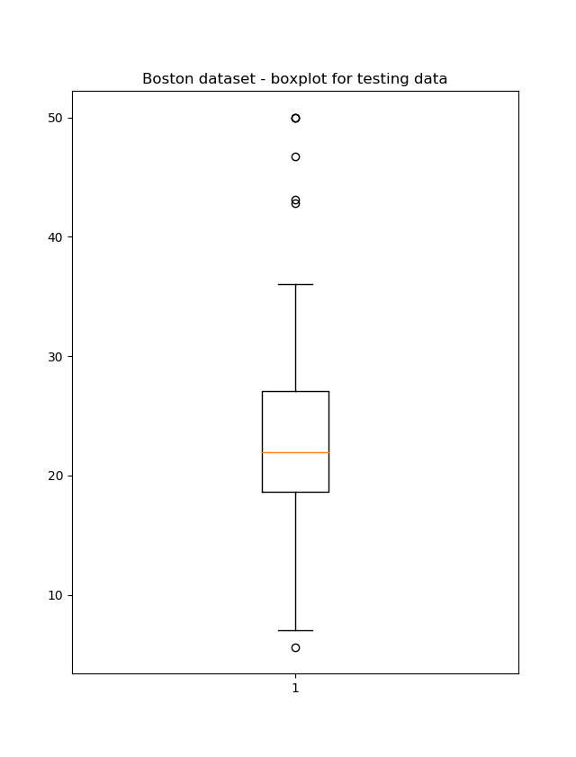
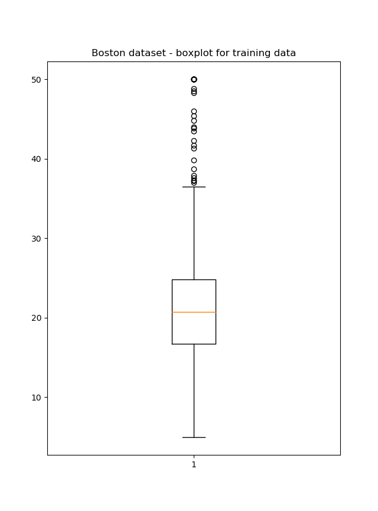
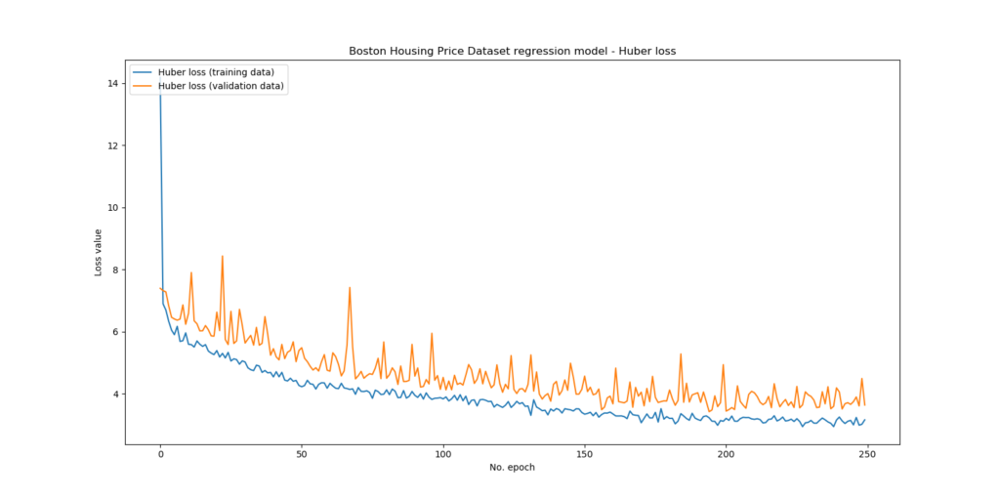
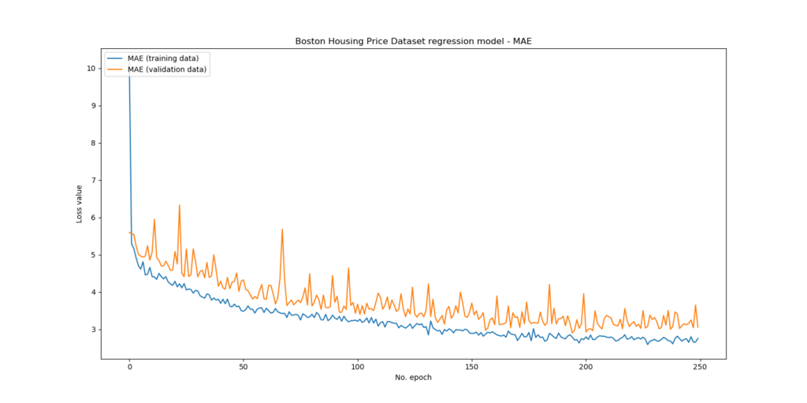

The Huber loss function can be used to balance between the Mean Absolute Error, or MAE, and the Mean Squared Error, MSE. It is therefore a good loss function for when you have varied data or only a few outliers.

But how to implement this loss function in Keras?

That's what we will find out in this blog.

We first briefly recap the concept of a loss function and introduce Huber loss. Next, we present a Keras example implementation that uses the Boston Housing Prices Dataset to generate a regression model.

After reading this tutorial, you will have learned...

- What loss functions are in neural networks.
- How Huber loss works and how it combines MAE and MSE.
- How `tensorflow.keras.losses.Huber` can be used within your TensorFlow 2 / Keras model.

Let's get to work! 🚀

_Note that the full code is also available on GitHub, in my [Keras loss functions repository](https://github.com/christianversloot/keras-loss-functions)._

* * *

**Update 28/Jan/2021:** updated the tutorial to ensure that it is ready for 2021. The code now runs with TensorFlow 2 based versions and has been updated to use `tensorflow.keras.losses.Huber` instead of a custom Huber loss function. Also updated header information and featured image.

* * *

\[toc\]

* * *

## Summary and code example: Huber Loss with TensorFlow 2 and Keras

Loss functions are used to compare predictions with ground truth values after the forward pass when training a neural network. There are many loss functions, and choosing one can be dependent on the dataset that you are training with. For example, in regression problems, you want to use Mean Absolute Error if you have many outliers, while if you don't Mean Squared Error can be a better choice.

But sometimes, you don't know exactly which of these two is best. In that case, **Huber loss** can be of help. Based on a delta parameter, it shapes itself as a loss function somewhere in between MAE and MSE. This way, you have more control over your neural network.

In TensorFlow 2 and Keras, Huber loss can be added to the compile step of your model - i.e., to `model.compile`. Here, you'll see **an example of Huber loss with TF 2 and Keras**. If you want to understand the loss function in more detail, make sure to read the rest of this tutorial as well!

```
model.compile(loss=tensorflow.keras.losses.Huber(delta=1.5), optimizer='adam', metrics=['mean_absolute_error'])
```

* * *

## About loss functions and Huber loss

When you train machine learning models, you feed data to the network, generate predictions, compare them with the actual values (the targets) and then compute what is known as a _loss_. This loss essentially tells you something about the performance of the network: the higher it is, the worse your networks performs overall.

There are many ways for computing the loss value. [Huber loss](https://www.machinecurve.com/index.php/2019/10/04/about-loss-and-loss-functions/#huber-loss) is one of them. It essentially combines the [Mean Absolute Error](https://www.machinecurve.com/index.php/2019/10/04/about-loss-and-loss-functions/#mean-absolute-error-l1-loss) and the [Mean Squared Error](https://www.machinecurve.com/index.php/2019/10/04/about-loss-and-loss-functions/#mean-squared-error) depending on some delta parameter, or 𝛿. This parameter must be configured by the machine learning engineer up front and is dependent on your data.

Huber loss looks like this:

[](https://www.machinecurve.com/wp-content/uploads/2019/10/huberloss.jpeg)

As you can see, for target = 0, the loss increases when the error increases. However, the speed with which it increases depends on this 𝛿 value. In fact, Grover (2019) writes about this as follows: **Huber loss approaches MAE when 𝛿 ~ 0 and MSE when 𝛿 ~ ∞ (large numbers.)**

When you compare this statement with the benefits and disbenefits of both the MAE and the MSE, you'll gain some insights about how to adapt this delta parameter:

- If your dataset contains large outliers, it's likely that your model will not be able to predict them correctly at once. In fact, it might take quite some time for it to recognize these, if it can do so at all. This results in large errors between predicted values and actual targets, because they're outliers. Since MSE squares errors, large outliers will distort your loss value significantly. If outliers are present, you likely don't want to use MSE. Huber loss will still be useful, but you'll have to use small values for 𝛿.
- If it does not contain many outliers, it's likely that it will generate quite accurate predictions from the start - or at least, from some epochs after starting the training process. In this case, you may observe that the errors are very small overall. Then, one can argue, it may be worthwhile to let the largest small errors contribute more significantly to the error than the smaller ones. In this case, MSE is actually useful; hence, with Huber loss, you'll likely want to use quite large values for 𝛿.
- If you don't know, you can always start somewhere in between - for example, in the plot above, 𝛿 = 1 represented MAE quite accurately, while 𝛿 = 3 tends to go towards MSE already. What if you used 𝛿 = 1.5 instead? You may benefit from both worlds.

Let's now see if we can complete a regression problem with Huber loss!

* * *

## Huber loss example with TensorFlow 2/Keras

Next, we show you how to use Huber loss with Keras to create a regression model. We'll use the **Boston housing price regression dataset** which comes with Keras by default - that'll make the example easier to follow. Obviously, you can always use your own data instead!

Since we need to know how to configure 𝛿, we must inspect the data at first. Do the target values contain many outliers? Some statistical analysis would be useful here.

Only then, we create the model and configure 𝛿 to an estimate that seems adequate. Finally, we run the model, check performance, and see whether we can improve 𝛿 any further.

### Regression dataset: Boston housing price regression

Keras comes with datasets on board the framework: they have them stored on some Amazon AWS server and when you load the data, they automatically download it for you and store it in user-defined variables. It allows you to experiment with deep learning and the framework easily. This way, you can get a feel for DL practice and neural networks without getting lost in the complexity of loading, preprocessing and structuring your data.

The **Boston housing price regression dataset** is one of these [datasets](https://keras.io/datasets/#boston-housing-price-regression-dataset). It is taken by Keras from the Carnegie Mellon University StatLib library that contains many datasets for training ML models. It is described as follows:

> The Boston house-price data of Harrison, D. and Rubinfeld, D.L. 'Hedonic prices and the demand for clean air', J. Environ. Economics & Management, vol.5, 81-102, 1978. Used in Belsley, Kuh & Welsch, 'Regression diagnostics ...', Wiley, 1980.
> 
> [StatLib Datasets Archive](http://lib.stat.cmu.edu/datasets/)

And contains these variables, according to the StatLib website:

- **CRIM** per capita crime rate by town
- **ZN** proportion of residential land zoned for lots over 25,000 sq.ft.
- **INDUS** proportion of non-retail business acres per town
- **CHAS** Charles River dummy variable (= 1 if tract bounds river; 0 otherwise)
- **NOX** nitric oxides concentration (parts per 10 million)
- **RM** average number of rooms per dwelling
- **AGE** proportion of owner-occupied units built prior to 1940
- **DIS** weighted distances to five Boston employment centres
- **RAD** index of accessibility to radial highways
- **TAX** full-value property-tax rate per $10,000
- **PTRATIO** pupil-teacher ratio by town
- **B** 1000(Bk - 0.63)^2 where Bk is the proportion of blacks by town
- **LSTAT** % lower status of the population
- **MEDV** Median value of owner-occupied homes in $1000's

In total, one sample contains 13 features (CRIM to LSTAT) which together approximate the median value of the owner-occupied homes or MEDV. The structure of this dataset, mapping some variables to a real-valued number, allows us to perform regression.

Let's now take a look at the dataset itself, and particularly its target values.

### Does the dataset have many outliers?

The number of outliers helps us tell something about the value for d that we have to choose. When thinking back to my _Introduction to Statistics_ class at university, I remember that box plots can help visually identify outliers in a statistical sample:

> Examination of the data for unusual observations that are far removed from the mass of data. These points are often referred to as outliers. Two graphical techniques for identifying outliers, scatter plots and box plots, (…)
> 
> [Engineering Statistics Handbook](https://www.itl.nist.gov/div898/handbook/prc/section1/prc16.htm)

The sample, in our case, is the Boston housing dataset: it contains some mappings between feature variables and target prices, but obviously doesn't represent all homes in Boston, which would be the statistical population. Nevertheless, we can write some code to generate a box plot based on this dataset:

```
'''
  Generate a BoxPlot image to determine how many outliers are within the Boston Housing Pricing Dataset.
'''
import tensorflow.keras
from tensorflow.keras.datasets import boston_housing
import numpy as np
import matplotlib.pyplot as plt

# Load the data
(x_train, y_train), (x_test, y_test) = boston_housing.load_data()

# We only need the targets, but do need to consider all of them
y = np.concatenate((y_train, y_test))

# Generate box plot
plt.boxplot(y)
plt.title('Boston housing price regression dataset - boxplot')
plt.show()
```

And next run it, to find this box plot:

[](https://www.machinecurve.com/wp-content/uploads/2019/10/boston_boxplot.png)

Note that we concatenated the _training data_ and the _testing data_ for this box plot. Although the plot hints to the fact that many outliers exist, and primarily at the high end of the statistical spectrum (which does make sense after all, since in life extremely high house prices are quite common whereas extremely low ones are not), we cannot yet conclude that the MSE may not be a good idea. We'll need to inspect the individual datasets too.

We can do that by simply adapting our code to:

```
y = y_train
```

or

```
y = y_test
```

This results in the following box plots:

- 
    
- 
    

Although the number of outliers is more extreme in the training data, they are present in the testing dataset as well.

Their structure is also quite similar: most of them, if not all, are present in the high end segment of the housing market.

Do note, however, that the median value for the testing dataset and the training dataset are slightly different. This means that patterns underlying housing prices present in the testing data may not be captured fully during the training process, because the statistical sample is slightly different. However, there is only one way to find out - by actually creating a regression model!

### Creating the model

Let's now create the model. Create a file called `huber_loss.py` in some folder and open the file in a development environment. We're then ready to add some code! However, let's analyze first what you'll need to use Huber loss in Keras.

#### What you'll need to use Huber loss in Keras

The primary dependency that you'll need is **[TensorFlow 2](https://tensorflow.org)**, one of the two deep learning libraries for Python. In TensorFlow 2, Keras is tightly coupled as `tensorflow.keras` and can therefore be used easily. In fact, today, it's _the_ way to create neural networks with TensorFlow easily.

#### Model imports

Now that we can start coding, let's import the Python dependencies that we need first:

```
'''
  Keras model demonstrating Huber loss
'''
from tensorflow.keras.datasets import boston_housing
from tensorflow.keras.models import Sequential
from tensorflow.keras.layers import Dense
from tensorflow.keras.losses import Huber
import numpy as np
import matplotlib.pyplot as plt
```

Obviously, we need the `boston_housing` dataset from the available Keras datasets. Additionally, we import `Sequential` as we will build our model using the Keras Sequential API. We're creating a very simple model, a [multilayer perceptron](https://www.machinecurve.com/index.php/2019/07/30/creating-an-mlp-for-regression-with-keras/), with which we'll attempt to regress a function that correctly estimates the median values of Boston homes. For this reason, we import `Dense` layers or densely-connected ones.

We also need `Huber` since that's the loss function we use. Numpy is used for number processing and we use Matplotlib to visualize the end result.

#### Loading the dataset

We next load the data by calling the Keras `load_data()` function on the housing dataset and prepare the input layer shape, which we can add to the initial hidden layer later:

```
# Load data
(x_train, y_train), (x_test, y_test) = boston_housing.load_data()

# Set the input shape
shape_dimension = len(x_train[0])
input_shape = (shape_dimension,)
print(f'Feature shape: {input_shape}')
```

#### Preparing the model: architecture & configuration

Next, we do actually provide the model architecture and configuration:

```
# Create the model
model = Sequential()
model.add(Dense(16, input_shape=input_shape, activation='relu', kernel_initializer='he_uniform'))
model.add(Dense(8, activation='relu', kernel_initializer='he_uniform'))
model.add(Dense(1, activation='linear'))

# Configure the model and start training
model.compile(loss=Huber(delta=1.5), optimizer='adam', metrics=['mean_absolute_error'])
history = model.fit(x_train, y_train, epochs=250, batch_size=1, verbose=1, validation_split=0.2)
```

As discussed, we use the Sequential API; here, we use two densely-connected hidden layers and one output layer. The hidden ones activate by means of [ReLU](https://www.machinecurve.com/index.php/2019/09/04/relu-sigmoid-and-tanh-todays-most-used-activation-functions/) and for this reason require [He uniform initialization](https://www.machinecurve.com/index.php/2019/09/16/he-xavier-initialization-activation-functions-choose-wisely/). The final layer activates linearly, because it regresses the actual value.

Compiling the model requires specifying the delta value, which we set to 1.5, given our estimate that we don't want true MAE but that given the outliers identified earlier full MSE resemblence is not smart either. We'll optimize by means of Adam _and also define the MAE as an extra error metric_. This way, we can have an estimate about what the true error is in terms of thousands of dollars: the MAE keeps its domain understanding whereas Huber loss does not.

Subsequently, we fit the training data to the model, complete 250 epochs with a batch size of 1 (true SGD-like optimization, albeit with Adam), use 20% of the data as validation data and ensure that the entire training process is output to standard output.

#### Performance testing & visualization

Finally, we add some code for performance testing and [visualization](https://www.machinecurve.com/index.php/2019/10/08/how-to-visualize-the-training-process-in-keras/):

```
# Test the model after training
test_results = model.evaluate(x_test, y_test, verbose=1)
print(f'Test results - Loss: {test_results[0]} - MAE: {test_results[1]}')

# Plot history: Huber loss and MAE
plt.plot(history.history['loss'], label='Huber loss (training data)')
plt.plot(history.history['val_loss'], label='Huber loss (validation data)')
plt.title('Boston Housing Price Dataset regression model - Huber loss')
plt.ylabel('Loss value')
plt.xlabel('No. epoch')
plt.legend(loc="upper left")
plt.show()

plt.title('Boston Housing Price Dataset regression model - MAE')
plt.plot(history.history['mean_absolute_error'], label='MAE (training data)')
plt.plot(history.history['val_mean_absolute_error'], label='MAE (validation data)')
plt.ylabel('Loss value')
plt.xlabel('No. epoch')
plt.legend(loc="upper left")
plt.show()
```

* * *

## Model performance for 𝛿 = 1.5

Let's now take a look at how the model has optimized over the epochs with the Huber loss:

[](https://www.machinecurve.com/wp-content/uploads/2019/10/huber_loss_d1.5.png)

And with the MAE:

[](https://www.machinecurve.com/wp-content/uploads/2019/10/huber_loss_mae1.5.png)

We can see that overall, the model was still improving at the 250th epoch, although progress was stalling - which is perfectly normal in such a training process. The mean absolute error was approximately $3.639.

```
Test results - Loss: 4.502029736836751 - MAE: 3.6392388343811035
```

* * *

## Recap

In this blog post, we've seen how the Huber loss can be used to balance between MAE and MSE in machine learning regression problems. By means of the delta parameter, or 𝛿, you can configure which one it should resemble most, benefiting from the fact that you can check the number of outliers in your dataset a priori. I hope you've enjoyed this blog and learnt something from it - please let me know in the comments if you have any questions or remarks. Thanks and happy engineering! 😊

* * *

## References

Grover, P. (2019, September 25). 5 Regression Loss Functions All Machine Learners Should Know. Retrieved from [https://heartbeat.fritz.ai/5-regression-loss-functions-all-machine-learners-should-know-4fb140e9d4b0](https://heartbeat.fritz.ai/5-regression-loss-functions-all-machine-learners-should-know-4fb140e9d4b0)

StatLib---Datasets Archive. (n.d.). Retrieved from [http://lib.stat.cmu.edu/datasets/](http://lib.stat.cmu.edu/datasets/)

Keras. (n.d.). Datasets. Retrieved from [https://keras.io/datasets/](https://keras.io/datasets/)

Keras. (n.d.). Boston housing price regression dataset. Retrieved from [https://keras.io/datasets/#boston-housing-price-regression-dataset](https://keras.io/datasets/#boston-housing-price-regression-dataset)

Carnegie Mellon University StatLib. (n.d.). Boston house-price data. Retrieved from [http://lib.stat.cmu.edu/datasets/boston](http://lib.stat.cmu.edu/datasets/boston)

Engineering Statistics Handbook. (n.d.). 7.1.6. What are outliers in the data? Retrieved from [https://www.itl.nist.gov/div898/handbook/prc/section1/prc16.htm](https://www.itl.nist.gov/div898/handbook/prc/section1/prc16.htm)

TensorFlow. (2021). _Tf.keras.losses.Huber_. [https://www.tensorflow.org/api\_docs/python/tf/keras/losses/Huber](https://www.tensorflow.org/api_docs/python/tf/keras/losses/Huber)
