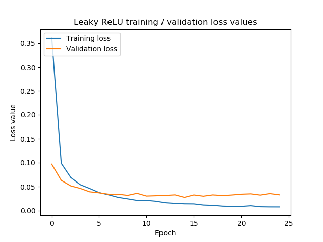
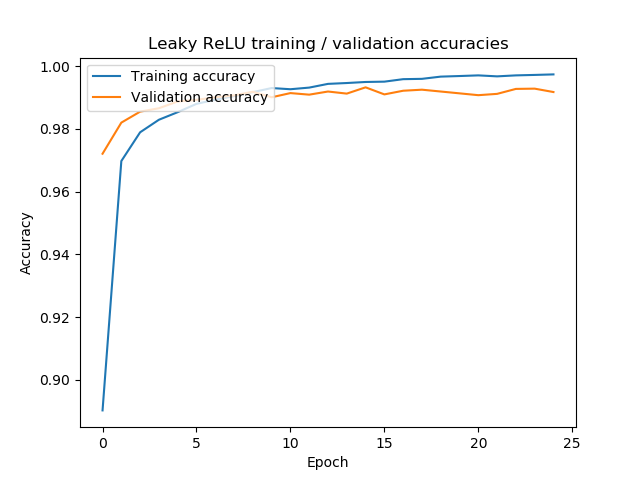
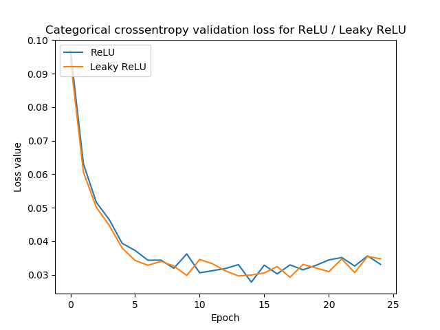
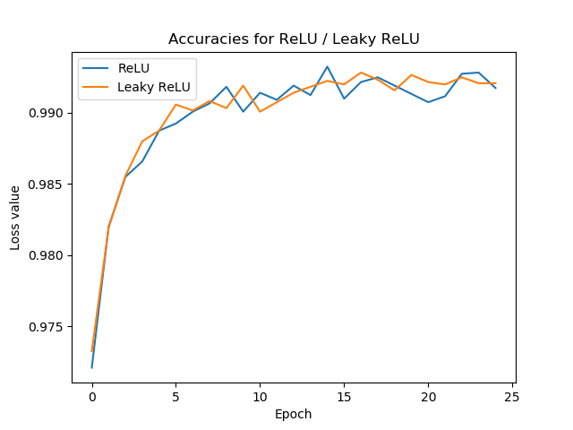

Even though the traditional [ReLU activation function](https://www.machinecurve.com/index.php/2019/09/09/implementing-relu-sigmoid-and-tanh-in-keras/) is used quite often, it may sometimes not produce a converging model. This is due to the fact that ReLU maps all negative inputs to zero, with a dead network as a possible result.

The death of a neural network? How is that even possible?

Well, you'll find out in this blog 😄

We briefly recap on Leaky ReLU, and why it is necessary, and subsequently present how to implement a Leaky ReLU neural network with Keras. Additionally, we'll actually train our model, and compare its performance with a traditional ReLU network.

**After reading this tutorial, you will...**

- See how the _dying ReLU problem_ can impact your neural network.
- Understand how the 'negative side' of ReLU causes this problem.
- Learn using Leaky ReLU with TensorFlow, which can help solve this problem.

Let's go! 😎

**Update 01/Mar/2021:** ensure that Leaky ReLU can be used with TensorFlow 2; replaced all old examples with new ones.

* * *

\[toc\]

* * *

## Recap: what is Leaky ReLU?

As you likely know, this is how traditional ReLU activates:

\\begin{equation} f(x) = \\begin{cases} 0, & \\text{if}\\ x < 0 \\\\ x, & \\text{otherwise} \\\\ \\end{cases} \\end{equation}

That is, the output is \[latex\]x\[/latex\] for all \[latex\]x >= 0\[/latex\], while it's zero for all other \[latex\]x\[/latex\].

Generally, this works very well in many neural networks - and in fact, since this makes the model a lot sparser, the training process tends to be impacted only by the features in your dataset that actually contribute to the model's decision power.

However, there are cases when this sparsity becomes a liability:

- If you didn't normalize your data before you fed it to your neural network, large changes in your model's weights can occur during the first stages of the training process. When the optimizer becomes less fierce when training progresses, some weights may be just too negative - and they can no longer 'escape' from the zero-ReLU-activation.
- Similarly, when you didn't configure your model's hyperparameters well, this may occur.

Since the majority of your neurons will be unresponsive, we call the _neural network dead_. Using ReLU may in some cases thus lead to the death of neural networks. While preventable in essence, it happens. Leaky ReLU may in fact help you here.

Mathematically, Leaky ReLU is defined as follows (Maas et al., 2013):

\\begin{equation} f(x) = \\begin{cases} 0.01x, & \\text{if}\\ x < 0 \\\\ x, & \\text{otherwise} \\\\ \\end{cases} \\end{equation}

Contrary to traditional ReLU, the outputs of Leaky ReLU are small and nonzero for all \[latex\]x < 0\[/latex\]. This way, the authors of the paper argue that death of neural networks can be avoided. We do have to note, though, that there also exists [quite some criticism](https://www.machinecurve.com/index.php/2019/10/15/leaky-relu-improving-traditional-relu/#does-leaky-relu-really-work) as to whether it really works.

* * *

## Leaky ReLU and the Keras API

Nevertheless, it may be that you want to test whether traditional ReLU is to blame when you find that your Keras model does not converge.

In that case, we'll have to know how to implement Leaky ReLU with Keras, and that's what we're going to do next 😄

Let's see what the Keras API tells us about Leaky ReLU:

> Leaky version of a Rectified Linear Unit.  
> It allows a small gradient when the unit is not active: `f(x) = alpha * x for x < 0`, `f(x) = x for x >= 0`.
> 
> [Keras Advanced Activation Layers: LeakyReLu](https://www.tensorflow.org/api_docs/python/tf/keras/layers/LeakyReLU)

It is defined as follows:

```
tf.keras.layers.LeakyReLU(alpha=0.3)
```

Contrary to our definition above (where \[latex\]\\alpha = 0.01\[/latex\], Keras by default defines alpha as 0.3). This does not matter, and perhaps introduces more freedom: it allows you to experiment with some \[latex\]\\alpha\[/latex\] to find which works best for you.

What it does? Simple - take a look at the definition from the API docs: `f(x) = alpha * x for x < 0`, `f(x) = x for x >= 0` .

Alpha _is the slope of the curve for all \[latex\]x < 0\[/latex\]._

**One important thing before we move to implementation!**

With traditional ReLU, you directly apply it to a layer, say a `Dense` layer or a `Conv2D` layer, like this:

```
model.add(Conv2D(64, kernel_size=(3, 3), activation='relu', kernel_initializer='he_uniform'))
```

You don't do this with Leaky ReLU. Instead, you have to apply it as an additional layer, and import it as such:

```
# In your imports
from tensorflow.keras.layers import LeakyReLU
# In your model
# ... upstream model layers
model.add(Conv1D(8, 1, strides=1, kernel_initializer='he_uniform'))
model.add(LeakyReLU(alpha=0.1))
# ... downstream model layers
```

Note my use of the He uniform initializer contrary to Xavier, [which is wise theoretically](https://www.machinecurve.com/index.php/2019/09/16/he-xavier-initialization-activation-functions-choose-wisely/) when using ReLU or ReLU-like activation functions.

* * *

## Implementing your Keras LeakyReLU model

Now that we know how LeakyReLU works with Keras, we can actually implement a model using it for activation purposes.

I chose to take the [CNN we created earlier](https://www.machinecurve.com/index.php/2019/09/17/how-to-create-a-cnn-classifier-with-keras/), which I trained on the MNIST dataset: it's relatively easy to train, its dataset already comes out-of-the-box with Keras, and hence it's a good starting point for educational purposes 😎 Additionally, it allows me to compare LeakyReLU performance with traditional ReLU more easily.

Obviously, Leaky ReLU can also be used in more complex settings - just use a similar implementation as we'll create next.

### What you'll need to run it

You will need the following dependencies installed on your system if you want to run this model:

- **Python**, and preferably version 3.6+.
- **TensorFlow 2** or any recent 2.x version, which contains Keras by default, in `tensorflow.keras`.
- **Matplotlib**, for [visualizing the model history](https://www.machinecurve.com/index.php/2019/10/08/how-to-visualize-the-training-process-in-keras/).

### The dataset we're using

[](https://www.machinecurve.com/wp-content/uploads/2019/07/mnist.png)

To show how Leaky ReLU can be implemented, we're going to build a convolutional neural network image classifier that is [very similar to the one we created with traditional ReLU](https://www.machinecurve.com/index.php/2019/09/17/how-to-create-a-cnn-classifier-with-keras/).

It is trained with the MNIST dataset and therefore becomes capable of classifying handwritten digits into the correct classes. With normal ReLU, the model achieved very high accuracies. Let's hope that it does here as well!

### Model file & imports

Now, open your Explorer, navigate to some folder, and create a Python file - such as `model_leaky_relu.py`. Open a code editor, open the file in your edit, and we can start adding the imports!

```
import tensorflow
from tensorflow.keras.datasets import mnist
from tensorflow.keras.models import Sequential
from tensorflow.keras.layers import Dense, Dropout, Flatten
from tensorflow.keras.layers import Conv2D, MaxPooling2D
from tensorflow.keras.layers import LeakyReLU
import matplotlib.pyplot as plt
```

### Model configuration

We can next specify some configuration variables:

```
# Model configuration
img_width, img_height = 28, 28
batch_size = 250
no_epochs = 25
no_classes = 10
validation_split = 0.2
verbosity = 1
leaky_relu_alpha = 0.1
```

The width and height of the handwritten digits provided by the MNIST dataset are 28 pixels. Hence, we specify `img_width` and `img_height` to be 28.

We will use a [minibatch approach](https://www.machinecurve.com/index.php/2019/10/24/gradient-descent-and-its-variants/) (although strictly speaking, we don't use Gradient Descent but Adam for optimization), with a `batch_size` of 250. We train the model for a fixed amount of iterations, with `no_epochs = 25`, and have 10 classes. This makes sense, as digits range from 0 to 9, which are ten in total.

20% of our training data will be used for validation purposes, and hence the `validation_split` is 0.2. Verbosity mode is set to True (by means of 'one'), which means that all output is returned to the terminal when running the model. Finally, we set the \[latex\]\\alpha\[/latex\] value for Leaky ReLU; in our case to 0.1. Note that (1) any alpha value is possible _if_ it is equal or larger than zero, and (2) that you may also specify different alpha values for each layer you add Leaky ReLU to. This is however up to you.

### Data preparation

We can next proceed with data preparation:

```
# Load MNIST dataset
(input_train, target_train), (input_test, target_test) = mnist.load_data()

# Parse numbers as floats
input_train = input_train.astype('float32')
input_test = input_test.astype('float32')

# Convert them into black or white: [0, 1].
input_train = input_train / 255
input_test = input_test / 255

# Convert target vectors to categorical targets
target_train = tensorflow.keras.utils.to_categorical(target_train, no_classes)
target_test = tensorflow.keras.utils.to_categorical(target_test, no_classes)
```

This essentially resolves to these steps:

- Loading the MNIST dataset by calling the Keras API (this is what I meant with relative ease - the dataset is a default Keras dataset, which means that we don't have to write much code for importing, benefiting today's educational purposes).
- Reshaping data based on whether your backend (TensorFlow, Theano or CNTK) uses a channels first / channels last approach.
- Next, we parse the training data as `float32` values. This is argued to make the training process faster (Quora, n.d.).
- We subsequently normalize our data.
- Finally, we convert our data into categorical format. That is, we fix the number of categories and convert our integer targets into category vectors. This allows us to use the [categorical crossentropy loss function](https://www.machinecurve.com/index.php/2019/10/22/how-to-use-binary-categorical-crossentropy-with-keras/).

### Model architecture

We can next define our model's architecture.

```
# Create the model
model = Sequential()
model.add(Conv2D(32, kernel_size=(3, 3), input_shape=input_shape))
model.add(LeakyReLU(alpha=leaky_relu_alpha))
model.add(MaxPooling2D(pool_size=(2, 2)))
model.add(Dropout(0.25))
model.add(Conv2D(64, kernel_size=(3, 3)))
model.add(LeakyReLU(alpha=leaky_relu_alpha))
model.add(MaxPooling2D(pool_size=(2, 2)))
model.add(Dropout(0.25))
model.add(Flatten())
model.add(Dense(256))
model.add(LeakyReLU(alpha=leaky_relu_alpha))
model.add(Dense(no_classes, activation='softmax'))
```

Note that we're using the Sequential API, which is the easiest one and most suitable for simple Keras problems. We specify two blocks with `Conv2D` layers, apply `LeakyReLU` directly after the convolutional layer, and subsequently apply `MaxPooling2D` and `Dropout`.

Subsequently, we `Flatten` our input into onedimensional format to allow the `Dense` or densely-connected layers to handle it. The first, which used traditional ReLU in the traditional scenario, is now also followed by Leaky ReLU. The final `Dense` layer has ten output neurons (since `no_classes = 10`) and the activation function is Softmax, to generate the multiclass probability distribution we're looking for as we use categorical data.

A few important observations:

- Note that by omitting any activation function for the `Conv2D` layers and the first `Dense` layer, we're essentially telling Keras to use a linear activation function instead. This activates as \[latex\]f(x) = x\[/latex\]. [Normally, this is a bad idea](https://www.machinecurve.com/index.php/2019/06/11/why-you-shouldnt-use-a-linear-activation-function/), but today it is not, as we directly apply Leaky ReLU afterwards.
- The `input_shape` parameter is based on our dataset.
- As discussed before, Leaky ReLU is applied by specifying an extra layer to the model stack, _not by specifying some `activation=''` in the layer you're applying it on!_

### Adding model configuration & performing training

Next, we can specify our hyperparameters and start the training process:

```
# Compile the model
model.compile(loss=tensorflow.keras.losses.categorical_crossentropy,
              optimizer=tensorflow.keras.optimizers.Adam(),
              metrics=['accuracy'])

# Fit data to model
history = model.fit(input_train, target_train,
          batch_size=batch_size,
          epochs=no_epochs,
          verbose=verbosity,
          validation_split=validation_split)
```

We assign the results of fitting the data to the configured model to the `history` object in order to visualize it later.

### Performance testing & visualization

Finally, we can add code for performance testing and visualization:

```
# Generate generalization metrics
score = model.evaluate(input_test, target_test, verbose=0)
print(f'Test loss for Keras Leaky ReLU CNN: {score[0]} / Test accuracy: {score[1]}')

# Visualize model history
plt.plot(history.history['accuracy'], label='Training accuracy')
plt.plot(history.history['val_accuracy'], label='Validation accuracy')
plt.title('Leaky ReLU training / validation accuracies')
plt.ylabel('Accuracy')
plt.xlabel('Epoch')
plt.legend(loc="upper left")
plt.show()

plt.plot(history.history['loss'], label='Training loss')
plt.plot(history.history['val_loss'], label='Validation loss')
plt.title('Leaky ReLU training / validation loss values')
plt.ylabel('Loss value')
plt.xlabel('Epoch')
plt.legend(loc="upper left")
plt.show()
```

The first block takes the testing code and generates test loss and test accuracy values - in order to find out whether the trained model generalizes well beyond data it has already seen before.

The second and third block simply use Matplotlib to visualize the accuracy and loss values over time, i.e. for every epoch or iteration. These can be saved to your system and used in e.g. reports, as we will show next.

### Full model code

If you are interested, you can also copy the full model code here:

```
import tensorflow
from tensorflow.keras.datasets import mnist
from tensorflow.keras.models import Sequential
from tensorflow.keras.layers import Dense, Dropout, Flatten
from tensorflow.keras.layers import Conv2D, MaxPooling2D
from tensorflow.keras.layers import LeakyReLU
import matplotlib.pyplot as plt

# Model configuration
img_width, img_height = 28, 28
batch_size = 250
no_epochs = 25
no_classes = 10
validation_split = 0.2
verbosity = 1
leaky_relu_alpha = 0.1

# Load MNIST dataset
(input_train, target_train), (input_test, target_test) = mnist.load_data()

# Parse numbers as floats
input_train = input_train.astype('float32')
input_test = input_test.astype('float32')

# Convert them into black or white: [0, 1].
input_train = input_train / 255
input_test = input_test / 255

# Convert target vectors to categorical targets
target_train = tensorflow.keras.utils.to_categorical(target_train, no_classes)
target_test = tensorflow.keras.utils.to_categorical(target_test, no_classes)

# Create the model
model = Sequential()
model.add(Conv2D(32, kernel_size=(3, 3), input_shape=input_shape))
model.add(LeakyReLU(alpha=leaky_relu_alpha))
model.add(MaxPooling2D(pool_size=(2, 2)))
model.add(Dropout(0.25))
model.add(Conv2D(64, kernel_size=(3, 3)))
model.add(LeakyReLU(alpha=leaky_relu_alpha))
model.add(MaxPooling2D(pool_size=(2, 2)))
model.add(Dropout(0.25))
model.add(Flatten())
model.add(Dense(256))
model.add(LeakyReLU(alpha=leaky_relu_alpha))
model.add(Dense(no_classes, activation='softmax'))

# Compile the model
model.compile(loss=tensorflow.keras.losses.categorical_crossentropy,
              optimizer=tensorflow.keras.optimizers.Adam(),
              metrics=['accuracy'])

# Fit data to model
history = model.fit(input_train, target_train,
          batch_size=batch_size,
          epochs=no_epochs,
          verbose=verbosity,
          validation_split=validation_split)


# Generate generalization metrics
score = model.evaluate(input_test, target_test, verbose=0)
print(f'Test loss for Keras Leaky ReLU CNN: {score[0]} / Test accuracy: {score[1]}')

# Visualize model history
plt.plot(history.history['accuracy'], label='Training accuracy')
plt.plot(history.history['val_accuracy'], label='Validation accuracy')
plt.title('Leaky ReLU training / validation accuracies')
plt.ylabel('Accuracy')
plt.xlabel('Epoch')
plt.legend(loc="upper left")
plt.show()

plt.plot(history.history['loss'], label='Training loss')
plt.plot(history.history['val_loss'], label='Validation loss')
plt.title('Leaky ReLU training / validation loss values')
plt.ylabel('Loss value')
plt.xlabel('Epoch')
plt.legend(loc="upper left")
plt.show()
```

* * *

## Model performance

Now, we can take a look at how our model performs. Additionally, since we also retrained the [Keras CNN with traditional ReLU](https://www.machinecurve.com/index.php/2019/09/17/how-to-create-a-cnn-classifier-with-keras/) as part of creating the model defined above, we can even compare traditional ReLU with Leaky ReLU for the MNIST dataset!

### LeakyReLU model performance

Generally speaking, I'm quite satisfied with how the model performed during training. The curves for loss and accuracy are actually pretty normal - large improvements at first, slower improvements at last. Perhaps, the model already starts overfitting slightly, as validation loss is stable after the 10th epoch and perhaps already increasing _very lightly_. However, that's not (too) relevant for now.

[](https://www.machinecurve.com/wp-content/uploads/2019/11/lrr_lr_losses.png)

[](https://www.machinecurve.com/wp-content/uploads/2019/11/lrr_lr_accuracies.png)

As we can observe from our evaluation metrics, test accuracy was 99.19% - that's really good!

```
Test loss for Keras ReLU CNN: 0.02855007330078265 / Test accuracy: 0.9919000267982483
```

### Comparing LeakyReLU and normal / traditional ReLU

Comparing our Leaky ReLU model with traditional ReLU produced these results:

[](https://www.machinecurve.com/wp-content/uploads/2019/11/lrr_lrr_loss.png)

[](https://www.machinecurve.com/wp-content/uploads/2019/11/lrr_lrr_acc.png)

With those evaluation metrics for testing:

```
Test loss for Keras Leaky ReLU CNN: 0.029994659566788557 / Test accuracy: 0.9927999973297119
Test loss for Keras ReLU CNN: 0.02855007330078265 / Test accuracy: 0.9919000267982483
```

I'd say they perform equally well. Although the traditional ReLU model seems to perform _slightly_ better than Leaky ReLU during training and testing, it's impossible to say whether this occurs by design or by chance (e.g., due to [pseudo-random weight initialization](https://www.machinecurve.com/index.php/2019/08/22/what-is-weight-initialization/)).

* * *

## Summary

By consequence, we can perhaps argue - in line with the [criticism we saw before](https://www.machinecurve.com/index.php/2019/10/15/leaky-relu-improving-traditional-relu/#does-leaky-relu-really-work) - that in most cases, Leaky ReLU does not perform better than traditional ReLU. This makes sense, as the leaky variant is only expected to work much better in the cases when you experience many dead neurons.

Nevertheless, it can be used with Keras, as we have seen in this blog post. We first introduced the concept of Leaky ReLU by recapping on how it works, comparing it with traditional ReLU in the process. Subsequently, we looked at the Keras API and how Leaky ReLU is implemented there. We then used this knowledge to create an actual Keras model, which we also used in practice. By training on the MNIST dataset, we also investigated how well it performs and compared it with traditional ReLU, as we've seen above.

I hope you've learnt something from this blog post - or that it was useful in other ways 😊 Let me know if you have any questions or if you think that it can be improved. I'll happily answer your comments, which you can leave in the comments box below 👇

Thanks again for visiting MachineCurve - and happy engineering! 😎

* * *

## References

Maas, A. L., Hannun, A. Y., & Ng, A. Y. (2013). Rectifier Nonlinearities Improve Neural Network Acoustic Models. Retrieved from [https://www.semanticscholar.org/paper/Rectifier-Nonlinearities-Improve-Neural-Network-Maas/367f2c63a6f6a10b3b64b8729d601e69337ee3cc](https://www.semanticscholar.org/paper/Rectifier-Nonlinearities-Improve-Neural-Network-Maas/367f2c63a6f6a10b3b64b8729d601e69337ee3cc)

Keras. (n.d.). Advanced Activations Layers: LeakyReLU. Retrieved from [https://keras.io/layers/advanced-activations/#leakyrelu](https://keras.io/layers/advanced-activations/#leakyrelu)

Quora. (n.d.). When should I use tf.float32 vs tf.float64 in TensorFlow? Retrieved from [https://www.quora.com/When-should-I-use-tf-float32-vs-tf-float64-in-TensorFlow](https://www.quora.com/When-should-I-use-tf-float32-vs-tf-float64-in-TensorFlow)

TensorFlow. (n.d.). _Tf.keras.layers.LeakyReLU_. [https://www.tensorflow.org/api\_docs/python/tf/keras/layers/LeakyReLU](https://www.tensorflow.org/api_docs/python/tf/keras/layers/LeakyReLU)
