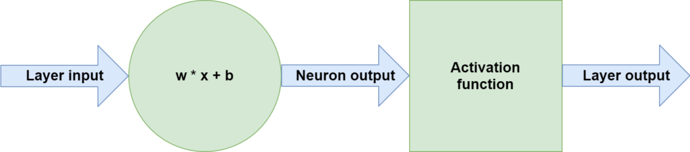

Rectified Linear Unit, Sigmoid and Tanh are three activation functions that play an important role in how neural networks work. In fact, if we do not use these functions, and instead use _no_ function, our model will be unable to learn from nonlinear data.

This article zooms into ReLU, Sigmoid and Tanh specifically tailored to the PyTorch ecosystem. With simple explanations and code examples you will understand how they can be used within PyTorch and its variants. In short, after reading this tutorial, you will...

- Understand what activation functions are and why they are required.
- Know the shape, benefits and drawbacks of ReLU, Sigmoid and Tanh.
- Have implemented ReLU, Sigmoid and Tanh with PyTorch, PyTorch Lightning and PyTorch Ignite.

All right, let's get to work! 🔥

* * *

\[toc\]

* * *

## Summary and example code: ReLU, Sigmoid and Tanh with PyTorch

Neural networks have boosted the field of machine learning in the past few years. However, they do not work well with nonlinear data natively - we need an activation function for that. Activation functions take any number as input and map inputs to outputs. As any function can be used as an activation function, we can also use nonlinear functions for that goal.

As results have shown, using nonlinear functions for that purpose ensure that the neural network as a whole can learn from nonlinear datasets such as images.

The **Rectified Linear Unit (ReLU), Sigmoid and Tanh** **activation functions** are the most widely used activation functions these days. From these three, ReLU is used most widely. All functions have their benefits and their drawbacks. Still, ReLU has mostly stood the test of time, and generalizes really well across a wide range of deep learning problems.

In this tutorial, we will cover these activation functions in more detail. Please make sure to read the rest of it if you want to understand them better. Do the same if you're interested in better understanding the implementations in PyTorch, Ignite and Lightning. Next, we'll show code examples that help you get started immediately.

### Classic PyTorch and Ignite

In classic PyTorch and PyTorch Ignite, you can choose from one of two options:

1. Add the activation functions `nn.Sigmoid()`, `nn.Tanh()` or `nn.ReLU()` to the neural network itself e.g. in `nn.Sequential`.
2. Add the _functional equivalents_ of these activation functions to the forward pass.

The first is easier, the second gives you more freedom. Choose what works best for you!

```

import torch.nn.functional as F

# (1). Add to __init__ if using nn.Sequential
def __init__(self):
    super().__init__()
    self.layers = nn.Sequential(
      nn.Linear(28 * 28, 256),
      nn.Sigmoid(),
      nn.Linear(256, 128),
      nn.Tanh(),
      nn.Linear(128, 10),
      nn.ReLU()
    )

# (2). Add functional equivalents to forward()
def forward(self, x):
    x = F.sigmoid(self.lin1(x))
    x = F.tanh(self.lin2(x))
    x = F.relu(self.lin3(x))
    return x
```

With Ignite, you can now proceed and finalize the model by adding Ignite specific code.

### PyTorch Lightning

In Lightning, too, you can choose from one of the two options:

1. Add the activation functions to the neural network itself.
2. Add the functional equivalents to the forward pass.

```
import torch
from torch import nn
import torch.nn.functional as F
import pytorch_lightning as pl

# (1) IF USED SEQUENTIALLY
class SampleModel(pl.LightningModule):
  
    def __init__(self):
      super().__init__()
      self.layers = nn.Sequential(
        nn.Linear(28 * 28, 256),
        nn.Sigmoid(),
        nn.Linear(256, 128),
        nn.Tanh(),
        nn.Linear(128, 56),
        nn.ReLU(),
        nn.Linear(56, 10)
      )
      self.ce = nn.CrossEntropyLoss()
    
    def forward(self, x):
        return self.layers(x)

# (2) IF STACKED INDEPENDENTLY
class SampleModel(pl.LightningModule):
  
    def __init__(self):
      super().__init__()
      self.lin1 = nn.Linear(28 * 28, 256)
      self.lin2 = nn.Linear(256, 128)
      self.lin3 = nn.Linear(128, 56)
      self.lin4 = nn.Linear(56, 10)
      self.ce = nn.CrossEntropyLoss()

    def forward(self, x):
      x = F.sigmoid(self.lin1(x))
      x = F.tanh(self.lin2(x))
      x = F.relu(self.lin3(x))
      x = self.lin4(x)
      return x
```

* * *

## Activation functions: what are they?

Neural networks are composed of _layers_ of _neurons_. They represent a system that together learns to capture patterns hidden in a dataset. Each individual neuron here processes data in the form `Wx + b`. Here, `x` represents the input vector - which can either be the input data (in the first layer) or any subsequent and partially processed data (in the downstream layers). `b` is the bias and `W` the weights vector, and they represent the trainable components of a neural network.

Performing `Wx + b` equals making a linear operation. In other words, the mapping from an input value to an output value is always linear. While this works perfectly if you need a model to generate a linear decision boundary, it becomes problematic when you don't. In fact, when you need to learn a decision boundary that is _not_ linear (and there are many such use cases, e.g. in computer vision), you can't if only performing the operation specified before.

Activation functions come to the rescue in this case. Stacked directly after the neurons, they take the neuron output values and map this linear input to a nonlinear output. By consequence, each neuron, and the system as a whole, becomes capable of learning nonlinear patterns. The exact flow of data flowing through one neuron is visualized below and can be represented by these three steps:

1. **Input data flows through the neuron, performing the operation `Wx + b`.**
2. **The output of the neuron flows through an activation function, such as ReLU, Sigmoid and Tanh.**
3. **What the activation function outputs is either passed to the next layer or returned as model output.**



### ReLU, Sigmoid and Tanh are commonly used

There are many activation functions. In fact, any activation function can be used - even \[latex\]f(x) = x\[/latex\], the linear or identity function. While you don't gain anything compared to using no activation function with that function, it shows that pretty much anything is possible when it comes to activation functions.

The key consideration that you have to make when creating and using an activation function is the function's computational efficiency. For example, if you would design an activation function that trumps any such function in performance, it doesn't really matter if it is _really_ slow to compute. In those cases, it's more likely that you can gain similar results in the same time span, but then with more iterations and fewer resources.

That's why today, [three key activation functions](https://www.machinecurve.com/index.php/2019/09/04/relu-sigmoid-and-tanh-todays-most-used-activation-functions/) are most widely used in neural networks:

1. **Rectified Linear Unit (ReLU)**
2. **Sigmoid**
3. **Tanh**

Click the link above to understand these in more detail. We'll now take a look at each of them briefly.

The **Tanh** and **Sigmoid** activation functions are the oldest ones in terms of neural network prominence. In the plot below, you can see that Tanh converts all inputs into the `(-1.0, 1.0)` range, with the greatest slope around `x = 0`. Sigmoid instead converts all inputs to the `(0.0, 1.0`) range, also with the greatest slope around `x = 0`. **ReLU** is different. This function maps all inputs to `0.0` if `x <= 0.0`. In all other cases, the input is mapped to `x`.

While being very prominent, all of these functions come with drawbacks. These are the benefits and drawbacks for ReLU, Sigmoid and Tanh:

- Sigmoid and Tanh suffer greatly from the [vanishing gradients problem](https://www.machinecurve.com/index.php/2019/08/30/random-initialization-vanishing-and-exploding-gradients/). This problem occurs because the derivatives of both functions have a peak value at `x < 1.0`. Neural networks use the chain rule to compute errors backwards through layers. This chain rule effectively _chains_ and thus _multiplies_ gradients. You can imagine what happens when, where `g` is some gradient for a layer, you perform `g * g * g * ...`. The result for the most upstream layers is then very small. In other words, larger networks struggle or even fail learning when Sigmoid or Tanh is used.
- In addition, with respect to Sigmoid, the middle point in terms of the `y` value does not lie around `x = 0`. This makes the process somewhat unstable. On the other hand, Sigmoid is a good choice for binary classification problems. Use at your own caution.
- Finally with respect to these two, the functions are more complex than that of ReLU, which essentially boils down to `[max(x, 0)](https://www.machinecurve.com/index.php/question/why-does-relu-equal-max0-x/)`. Computing them is thus slower than when using ReLU.
- While it seems to be the case that ReLU trumps all activation functions - and it surely generalizes to many problems and is really useful, partially due to its computational effectiveness - it has its own unique set of drawbacks. It's not smooth and therefore [not fully differentiable](https://www.machinecurve.com/index.php/question/why-is-relu-not-differentiable-at-x-0/), neural networks can start to [explode](https://www.machinecurve.com/index.php/2019/08/30/random-initialization-vanishing-and-exploding-gradients/) because there is no upper limit on the output, and using ReLU also means opening up yourself to the dying ReLU problem. Many activation functions attempting to resolve these problems have emerged, such as [Swish](https://www.machinecurve.com/index.php/2019/05/30/why-swish-could-perform-better-than-relu/), [PReLU](https://www.machinecurve.com/index.php/2019/12/05/how-to-use-prelu-with-keras/) and [Leaky ReLU](https://www.machinecurve.com/index.php/2019/11/12/using-leaky-relu-with-keras/) - and [there are many more](https://www.machinecurve.com/index.php/tag/activation-function). But for some reason, they haven't been able to dethrone ReLU yet, and it is still widely used.

- [](https://www.machinecurve.com/wp-content/uploads/2019/05/tanh.png)
    
- [](https://www.machinecurve.com/wp-content/uploads/2019/05/relu.png)
    
- [](https://www.machinecurve.com/wp-content/uploads/2019/05/sigmoid.png)
    

* * *

## Implementing ReLU, Sigmoid and Tanh with PyTorch

Now that we understand how ReLU, Sigmoid and Tanh work, we can take a look at how we can implement with PyTorch. In this tutorial, you'll learn to implement these activation functions with three flavors of PyTorch:

1. **Classic PyTorch.** This is where it all started and it is PyTorch as we know it.
2. **PyTorch Ignite.** Ignite is a PyTorch-supported approach to streamline your models in a better way.
3. **PyTorch Lightning**. The same is true for Lightning, which focuses on model organization and automation even more.

Let's start with classic PyTorch.

### Classic PyTorch

In classic PyTorch, the suggested way to create a neural network is using a class that utilizes `nn.Module`, the neural networks module provided by PyTorch.

```
class Model(nn.Module):
    def __init__(self):
        super(Model, self).__init__()
        self.lin1 = nn.Linear(28 * 28, 256),
        self.lin2 = nn.Linear(256, 128)
        self.lin3 = nn.Linear(128, 10)
```

You can also choose to already stack the layers on top of each other, like this, using `nn.Sequential`:

```
import torch.nn.functional as F

class Model(nn.Module):
    def __init__(self):
        super(Model, self).__init__()
        self.layers = nn.Sequential(
          nn.Linear(28 * 28, 256),
          nn.Linear(256, 128),
          nn.Linear(128, 10)
        )
```

As you can see, this way of working resembles that of the `tensorflow.keras.Sequential` API, where you add layers on top of each other using `model.add`.

#### Adding activation functions

In a `nn.Module`, you can then add a `forward` definition for the forward pass. The implementation differs based on the choice of building your neural network from above:

```
    # If stacked on top of each other
    def forward(self, x):
        return self.layers(x)
      
    # If stacked independently
    def forward(self, x):
        x = self.lin1(x)
        x = self.lin2(x)
        return self.lin3(x)
```

Adding **Sigmoid, Tanh or ReLU** to a classic PyTorch neural network is really easy - but it is also dependent on the way that you have constructed your neural network above. When you are using `Sequential` to stack the layers, whether that is in `__init__` or elsewhere in your network, it's best to use `nn.Sigmoid()`, `nn.Tanh()` and `nn.ReLU()`. An example can be seen below.

If instead you are specifying the layer composition in `forward` - similar to the Keras Functional API - then you must use `torch.nn.functional`, which we import as `F`. You can then wrap the layers with the activation function of your choice, whether that is `F.sigmoid()`, `F.tanh()` or `F.relu()`. Quite easy, isn't it? :D

```

import torch.nn.functional as F

# Add to __init__ if using nn.Sequential
def __init__(self):
    super().__init__()
    self.layers = nn.Sequential(
      nn.Linear(28 * 28, 256),
      nn.Sigmoid(),
      nn.Linear(256, 128),
      nn.Tanh(),
      nn.Linear(128, 10),
      nn.ReLU()
    )

# Add functional equivalents to forward()
def forward(self, x):
    x = F.sigmoid(self.lin1(x))
    x = F.tanh(self.lin2(x))
    x = F.relu(self.lin3(x))
    return x
```

### PyTorch Ignite

You can use the classic PyTorch approach from above for adding Tanh, Sigmoid or ReLU to PyTorch Ignite. Model creation in Ignite works in a similar way - and you can then proceed adding all Ignite specific functionalities.

### PyTorch Lightning

In Lightning, you can pretty much repeat the classic PyTorch approach - i.e. use `nn.Sequential` and specify calling the whole system in the `forward()` definition, or create the forward pass yourself. The first is more restrictive but easy, whereas the second gives you more freedom for creating exotic models at the cost of increasing difficulty.

Here's an example of using ReLU, Sigmoid and Tanh when you stack all layers independently and configure data flow yourself in `forward`:

```
import torch
from torch import nn
import torch.nn.functional as F
import pytorch_lightning as pl

class SampleModel(pl.LightningModule):
  
    # IF STACKED INDEPENDENTLY
    def __init__(self):
      super().__init__()
      self.lin1 = nn.Linear(28 * 28, 256)
      self.lin2 = nn.Linear(256, 128)
      self.lin3 = nn.Linear(128, 56)
      self.lin4 = nn.Linear(56, 10)
      self.ce = nn.CrossEntropyLoss()

    def forward(self, x):
      x = F.sigmoid(self.lin1(x))
      x = F.tanh(self.lin2(x))
      x = F.relu(self.lin3(x))
      x = self.lin4(x)
      return x
    
    def training_step(self, batch, batch_idx):
      x, y = batch
      x = x.view(x.size(0), -1)
      y_hat = self.layers(x)
      loss = self.ce(y_hat, y)
      self.log('train_loss', loss)
      return loss

    def configure_optimizers(self):
        optimizer = torch.optim.Adam(self.parameters(), lr=1e-3)
        return optimizer
```

Do note that the functional equivalents of Tanh and Sigmoid are deprecated and may be removed in the future:

```
UserWarning: nn.functional.sigmoid is deprecated. Use torch.sigmoid instead.
  warnings.warn("nn.functional.sigmoid is deprecated. Use torch.sigmoid instead.")
UserWarning: nn.functional.tanh is deprecated. Use torch.tanh instead.
  warnings.warn("nn.functional.tanh is deprecated. Use torch.tanh instead.")
```

The solution would be as follows. You can also choose to use `nn.Sequential` and add the activation functions to the model itself:

```
import torch
from torch import nn
import torch.nn.functional as F
import pytorch_lightning as pl

class SampleModel(pl.LightningModule):
  
    # IF USED SEQUENTIALLY
    def __init__(self):
      super().__init__()
      self.layers = nn.Sequential(
        nn.Linear(28 * 28, 256),
        nn.Sigmoid(),
        nn.Linear(256, 128),
        nn.Tanh(),
        nn.Linear(128, 56),
        nn.ReLU(),
        nn.Linear(56, 10)
      )
      self.ce = nn.CrossEntropyLoss()
    
    def forward(self, x):
        return self.layers(x)
    
    def training_step(self, batch, batch_idx):
      x, y = batch
      x = x.view(x.size(0), -1)
      y_hat = self.layers(x)
      loss = self.ce(y_hat, y)
      self.log('train_loss', loss)
      return loss

    def configure_optimizers(self):
        optimizer = torch.optim.Adam(self.parameters(), lr=1e-3)
        return optimizer
```

That's it, folks! As you can see, adding ReLU, Tanh or Sigmoid to any PyTorch, Ignite or Lightning model is _a piece of cake_. 🍰

If you have any comments, questions or remarks - please feel free to leave a comment in the comments section 💬 I'd love to hear from you. [You can also leave your question here](https://www.machinecurve.com/index.php/machine-learning-questions/).

Thanks for reading MachineCurve today and happy engineering! 😎

* * *

## References

PyTorch Ignite. (n.d.). _Ignite your networks! — ignite master documentation_. PyTorch. [https://pytorch.org/ignite/](https://pytorch.org/ignite/)

PyTorch Lightning. (2021, January 12). [https://www.pytorchlightning.ai/](https://www.pytorchlightning.ai/)

PyTorch. (n.d.). [https://pytorch.org](https://pytorch.org/)

PyTorch. (n.d.). _ReLU — PyTorch 1.7.0 documentation_. [https://pytorch.org/docs/stable/generated/torch.nn.ReLU.html#torch.nn.ReLU](https://pytorch.org/docs/stable/generated/torch.nn.ReLU.html#torch.nn.ReLU)

PyTorch. (n.d.). _Sigmoid — PyTorch 1.7.0 documentation_. [https://pytorch.org/docs/stable/generated/torch.nn.Sigmoid.html#torch.nn.Sigmoid](https://pytorch.org/docs/stable/generated/torch.nn.Sigmoid.html#torch.nn.Sigmoid)

PyTorch. (n.d.). _Tanh — PyTorch 1.7.0 documentation_. [https://pytorch.org/docs/stable/generated/torch.nn.Tanh.html#torch.nn.Tanh](https://pytorch.org/docs/stable/generated/torch.nn.Tanh.html#torch.nn.Tanh)

PyTorch. (n.d.). _Torch.nn.functional — PyTorch 1.7.0 documentation_. [https://pytorch.org/docs/stable/nn.functional.html](https://pytorch.org/docs/stable/nn.functional.html)
