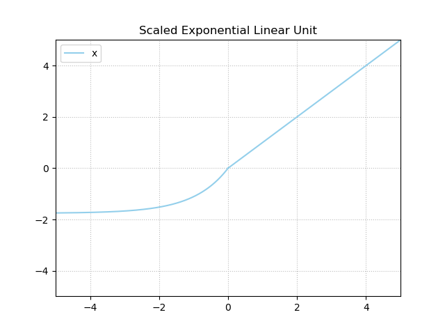

Neural networks thrive on nonlinear data only when [nonlinear activation functions](https://www.machinecurve.com/index.php/2020/10/29/why-nonlinear-activation-functions-improve-ml-performance-with-tensorflow-example/) are used. The Rectified Linear Unit, or RELU, is one such activation function - and in fact, it is currently the most widely used one due to its robustness in many settings. But training a neural network can be problematic, even with functions like RELU.

Parts of these problems can be related to the speed of the training process. For example, we know from [Batch Normalization](https://www.machinecurve.com/index.php/2020/01/15/how-to-use-batch-normalization-with-keras/) that it helps speed up the training process, because it [normalizes](https://www.machinecurve.com/index.php/2020/11/19/how-to-normalize-or-standardize-a-dataset-in-python/) the inputs to a layer. While this is not necessarily problematic, deep learning engineers must pay attention to how they construct the rest of their model. For example, using Dropout in combination with Batch Normalization might not be a good idea if implemented incorrectly. In addition, Batch Normalization must be explicitly added to a neural network, which might not always what you want.

In this article, we are going to take a look at the **Scaled Exponential Linear Unit** or **SELU activation function**. This activation function, which has self-normalizing properties, ensures that all outputs are normalized without explicitly adding a normalization layer to your model. What's better is that it can be used relatively easily and that it provides adequate results, according to the authors in Klambauer et al. (2017).

It's structured as follows. Firstly, we're going to provide a code example that immediately answers the question "how to use SELU with TensorFlow and Keras?". It allows you to get up to speed quickly. After that, we'll go in a bit more detail. First of all, we're going to take a brief look at the need for activation functions to provide some context. This is followed by looking at the SELU activation function, which we'll explore both mathematically and visually. Once we did that, we take a look at how SELU is implemented in TensorFlow, by means of `tf.keras.activations.selu`. Finally, we build an actual neural network using SELU, and provide step-by-step examples.

After reading this tutorial, you will...

- Understand what activation functions are.
- Know what SELU is and how SELU relates to RELU.
- See how SELU is implemented in TensorFlow.
- Be capable of building a neural network using SELU.

Let's take a look! 😊

* * *

\[toc\]

* * *

## Code example: using SELU with tf.keras.activations.selu

This quick example helps you get started with SELU straight away. If you want to know how to use SELU with TensorFlow or Keras, you can use the code below. Do make sure to take a look at the important notes however, they're really important! Read the full article below if you want to understand their _whys_ and the SELU activation function in general in more detail.

```
# Using SELU with TensorFlow and Keras - example.
# Important:
# 1. When using SELU, the LecunNormal() initializer must be used.
# 2. When using SELU and Dropout, AlphaDropout() must be used.
model = Sequential()
model.add(Conv2D(32, kernel_size=(3, 3), kernel_initializer=LecunNormal(), activation='selu', input_shape=input_shape))
model.add(AlphaDropout(0.25))
model.add(Flatten())
model.add(Dense(256, activation='selu', kernel_initializer=LecunNormal()))
model.add(Dense(no_classes, activation='softmax'))
```

* * *

## What are activation functions?

By design, a neural network processes data linearly. Every neuron takes an input vector `x` and multiplies this vector element-wise with vector `w`, which contains **weights**. These weights, in return, are learned by the network, as well as the **bias**. As each neuron learns to process data individually, the system as a whole learns to process the data collectively, because it is trained to do so by means of the [high-level machine learning process](https://www.machinecurve.com/index.php/2019/10/04/about-loss-and-loss-functions/#the-high-level-supervised-learning-process).


Neural networks are therefore perfectly capable of learning [linear decision boundaries](https://www.machinecurve.com/index.php/2020/10/29/why-nonlinear-activation-functions-improve-ml-performance-with-tensorflow-example/):


Unfortunately, today's world comes with complex datasets. These datasets often contain patterns that are not linear. If we would train a neural network using the approach mentioned above, that would not work. This is clearly visible in the example that [we visualized above](https://www.machinecurve.com/index.php/2019/10/11/how-to-visualize-the-decision-boundary-for-your-keras-model/): the neural network is not capable of learning a nonlinear decision boundary.

### Adding activation functions

But if we add **activation functions** to the neural network, this behavior changes, and we can suddenly learn to detect nonlinear patterns in our datasets. Activation functions are simple mathematical functions that map some inputs to some outputs, but then in a nonlinear way. We place them directly after the neurons, as we visualized in the image below.


This is the effect with the data visualized above when a nonlinear activation function is used:


### About RELU

One of the most prominent activation functions that is used today is the **[Rectified Linear Unit](https://www.machinecurve.com/index.php/2019/09/09/implementing-relu-sigmoid-and-tanh-in-keras/)**, or **RELU**. This activation function effectively boils down to the following output:

\[mathjax\]

\\begin{equation} f(x) = \\begin{cases} 0, & \\text{if}\\ x < 0 \\\\ x, & \\text{otherwise} \\\\ \\end{cases} \\end{equation}

In other words, the output will be zero if `x < 0` and will equal `x` otherwise. Being as simple as implementing [max(x, 0)](https://www.machinecurve.com/index.php/question/why-does-relu-equal-max0-x/), ReLU is a very efficient and easy activation function. It is therefore not surprising that it is widely used today.


* * *

## What is the SELU activation function?

Training a neural network successfully does not depend on an activation function alone. Especially with bigger models, the training process also becomes dependent on a variety of efficiencies that must be built into the neural network for it to work well. For example, we know that the distribution of layer outputs significantly impacts the speed of the training process. [Batch Normalization](https://www.machinecurve.com/index.php/2020/01/14/what-is-batch-normalization-for-training-neural-networks/) has been invented to deal with it, and we can use it easily in TensorFlow by simply [adding it as a layer](https://www.machinecurve.com/index.php/2020/01/15/how-to-use-batch-normalization-with-keras/).

But while Batch Normalization speeds up the training process by normalizing the outputs of each layer, it comes at a few drawbacks. The first one is that it must be added explicitly, incurring additional computational costs that are unnecessary, strictly speaking. In addition, using Batch Normalization together with Dropout is not a good idea necessarily, unless implemented correctly.

That's why Klambauer et al. (2017) argue for the **Scaled Exponential Linear Unit**, or the **SELU activation function**. This activation function combines both the benefits of classic RELU with self-normalizing properties, hence removing the necessity to use BatchNorm.

> The activation function of SNNs are "scaled exponential linear units" (SELUs), which induce self-normalizing properties. Using the Banach fixed-point theorem, we prove that activations close to zero mean and unit variance that are propagated through many network layers will converge towards zero mean and unit variance -- even under the presence of noise and perturbations.
> 
> Klambauer et al. (2017)

A SELU activation function is defined in the following way:

\\begin{equation} f(x) = \\begin{cases} \\text{scale} \\times \\text{alpha} \\times (exp(x) - 1), & \\text{if}\\ x \\lt 0 \\\\ x, & \\text{otherwise} \\\\ \\end{cases} \\end{equation}

Here, `alpha=1.67326324` and `scale=1.05070098` (TensorFlow, n.d.).

It has the properties that leads the neural network to become **self-normalizing**, meaning that the outputs of each layer are pushed to a mean (\[latex\]\\mu\[/latex\]) of zero (\[latex\]\\mu = 0.0\[/latex\]) whereas variance equals 1.0 (\[latex\]\\sigma = 1.0\[/latex\]). This equals the effect of Batch Normalization, without using Batch Normalization. If this is not _strictly_ possible, the authors show that at least an upper and lower bound is present for the derivative, [avoiding the vanishing gradients problem](https://www.machinecurve.com/index.php/2019/08/30/random-initialization-vanishing-and-exploding-gradients/) (Klambauer et al., 2017).

> We have introduced self-normalizing neural networks for which we have proved that neuron activations are pushed towards zero mean and unit variance when propagated through the network. Additionally, for activations not close to unit variance, we have proved an upper and lower bound on the variance mapping. Consequently, SNNs do not face vanishing and exploding gradient problems.
> 
> Klambauer et al. (2017)

Visually, a SELU activation functions looks as follows:



* * *

## SELU in TensorFlow

Of course, it is possible to use **Scaled Exponential Linear Unit** or SELU with TensorFlow and Keras. The example at the top of this page already demonstrates how you can use it within your neural network. In TensorFlow 2.x, the SELU activation function is available as `tf.keras.activations.selu` (TensorFlow, n.d.):

```
tf.keras.activations.selu(
    x
)
```

The function is really simple - it takes `x` as input and applies the self-normalizing nonlinear mapping that was visualized above.

#### About SELU and Dropout

Note that if you're using Dropout, you must use [AlphaDropout](https://www.tensorflow.org/api_docs/python/tf/keras/layers/AlphaDropout) instead of regular Dropout (TensorFlow, n.d.).

#### About SELU and Initializers

Note that for [weight initialization](https://www.machinecurve.com/index.php/2019/08/22/what-is-weight-initialization/), you must take into account the utilization of SELU (just as you would need to use a [different initializer when using RELU](https://www.machinecurve.com/index.php/2019/09/16/he-xavier-initialization-activation-functions-choose-wisely/)). If you are using SELU, you must use the `LecunNormalInitializer` [instead](https://www.tensorflow.org/api_docs/python/tf/keras/initializers/LecunNormal).

* * *

## Building a neural network using SELU: example

Adding SELU to a TensorFlow / Keras powered neural network is really easy and involves three main steps:

1. **Setting the `activation` attribute to `'selu'`.** As you can see in the example above, all activations are set to SELU through `activation='selu'`. Of course, we don't do this at the last layer, because (as we shall see) we are trying to solve a [multiclass classification problem](https://www.machinecurve.com/index.php/2020/10/19/3-variants-of-classification-problems-in-machine-learning/). For these, we need [Softmax](https://www.machinecurve.com/index.php/2020/01/08/how-does-the-softmax-activation-function-work/).
2. **Using the `LecunNormal` kernel initializer**. The TensorFlow docs suggest to use this initializer when using SELU, which is related in the fact that [different activation functions need different initializers](https://www.machinecurve.com/index.php/2019/09/16/he-xavier-initialization-activation-functions-choose-wisely/).
3. **Using `AlphaDropout` instead of `Dropout`.** Another important suggestion made the docs is to use this type of [Dropout](https://www.machinecurve.com/index.php/2019/12/16/what-is-dropout-reduce-overfitting-in-your-neural-networks/) when you need to use it.

```
# Create the model
model = Sequential()
model.add(Conv2D(32, kernel_size=(3, 3), kernel_initializer=LecunNormal(), activation='selu', input_shape=input_shape))
model.add(AlphaDropout(0.25))
model.add(Flatten())
model.add(Dense(256, activation='selu', kernel_initializer=LecunNormal()))
model.add(Dense(no_classes, activation='softmax'))
```

### Fully working neural network with SELU

We can use these easy steps in the creation of a neural network which can be used for [multiclass classification](https://www.machinecurve.com/index.php/2020/10/19/3-variants-of-classification-problems-in-machine-learning/). In fact, we will be using it for classification of the [MNIST dataset](https://www.machinecurve.com/index.php/2019/12/31/exploring-the-keras-datasets/#mnist-database-of-handwritten-digits), which is composed of handwritten digits - a few examples of them visualized on the right.

In other words, the neural network that we will create is capable of generating a prediction about the digit it sees - giving a number between zero and nine as the output. The code below constructs the neural network and is composed of multiple sections. Read the article about [constructing a ConvNet](https://www.machinecurve.com/index.php/2019/09/17/how-to-create-a-cnn-classifier-with-keras/) for more step-by-step instructions, but these are the important remarks:

1. **Imports section**. We import everything that we need in this section. Recall once more that this also includes the `LecunNormal` initializer and the `AlphaDropout` layer; the latter only if you desire to use [Dropout](https://www.machinecurve.com/index.php/2019/12/18/how-to-use-dropout-with-keras/).
2. **Model configuration**. Here, we set a few configuration options throughout the model.
3. **Loading and preparing the dataset.** With these lines of code, we use `load_data()` to [load the MNIST dataset](https://www.machinecurve.com/index.php/2019/12/31/exploring-the-keras-datasets/) and reshape it into the correct [input format](https://www.machinecurve.com/index.php/2020/04/05/how-to-find-the-value-for-keras-input_shape-input_dim/). It also includes parsing numbers as floats, [which might speed up the training process](https://www.machinecurve.com/index.php/2020/09/16/tensorflow-model-optimization-an-introduction-to-quantization/#float32-in-your-ml-model-why-its-great). Finally, it is also [normalized](https://www.machinecurve.com/index.php/2020/11/19/how-to-normalize-or-standardize-a-dataset-in-python/) relatively naïvely and target vectors are [one-hot encoded](https://www.machinecurve.com/index.php/2020/11/24/one-hot-encoding-for-machine-learning-with-tensorflow-and-keras/).
4. **The model is created and compiled**. This involves stacking layers on top of each other with `model.add(..)` and actually initializing the model with `model.compile(..)`, getting us a model that can be trained.
5. **Training the model**. We use the `input_train` and `target_train` variables for this; in other words, [our training dataset](https://www.machinecurve.com/index.php/2020/11/16/how-to-easily-create-a-train-test-split-for-your-machine-learning-model/).
6. **[Evaluating](https://www.machinecurve.com/index.php/2020/11/03/how-to-evaluate-a-keras-model-with-model-evaluate/) the model**. Finally, we evaluate the performance of the model with `input_test` and `target_test`, to see whether it generalizes to data that we haven't seen before.

```
import tensorflow
from tensorflow.keras.datasets import mnist
from tensorflow.keras.models import Sequential
from tensorflow.keras.initializers import LecunNormal
from tensorflow.keras.layers import AlphaDropout
from tensorflow.keras.layers import Dense, Dropout, Flatten
from tensorflow.keras.layers import Conv2D, MaxPooling2D

# Model configuration
img_width, img_height = 28, 28
batch_size = 250
no_epochs = 5
no_classes = 10
validation_split = 0.2
verbosity = 1

# Load MNIST dataset
(input_train, target_train), (input_test, target_test) = mnist.load_data()

# Reshape data 
input_train = input_train.reshape(input_train.shape[0], img_width, img_height, 1)
input_test = input_test.reshape(input_test.shape[0], img_width, img_height, 1)
input_shape = (img_width, img_height, 1) 

# Parse numbers as floats
input_train = input_train.astype('float32')
input_test = input_test.astype('float32')

# Convert into [0, 1] range.
input_train = input_train / 255
input_test = input_test / 255

# Convert target vectors to categorical targets
target_train = tensorflow.keras.utils.to_categorical(target_train, no_classes)
target_test = tensorflow.keras.utils.to_categorical(target_test, no_classes)

# Create the model
model = Sequential()
model.add(Conv2D(32, kernel_size=(3, 3), kernel_initializer=LecunNormal(), activation='selu', input_shape=input_shape))
model.add(AlphaDropout(0.25))
model.add(Flatten())
model.add(Dense(256, activation='selu', kernel_initializer=LecunNormal()))
model.add(Dense(no_classes, activation='softmax'))

# Compile the model
model.compile(loss=tensorflow.keras.losses.categorical_crossentropy,
              optimizer=tensorflow.keras.optimizers.Adam(),
              metrics=['accuracy'])

# Fit data to model
model.fit(input_train, target_train,
          batch_size=batch_size,
          epochs=no_epochs,
          verbose=verbosity,
          validation_split=validation_split)

# Generate generalization metrics
score = model.evaluate(input_test, target_test, verbose=0)
print(f'Test loss: {score[0]} / Test accuracy: {score[1]}')
```

If you are getting memory errors when running this script using your GPU, you might need to add the following code directly after the imports. It limits the growth of GPU memory and allows you to get your code running again.

```
gpus = tensorflow.config.experimental.list_physical_devices('GPU')
if gpus:
  try:
    # Currently, memory growth needs to be the same across GPUs
    for gpu in gpus:
      tensorflow.config.experimental.set_memory_growth(gpu, True)
    logical_gpus = tensorflow.config.experimental.list_logical_devices('GPU')
    print(len(gpus), "Physical GPUs,", len(logical_gpus), "Logical GPUs")
  except RuntimeError as e:
    # Memory growth must be set before GPUs have been initialized
    print(e)
```

### Results

These are the results, which suggest a well-performing model - but this is not unexpected given the simplicity of MNIST.

```
192/192 [==============================] - 9s 24ms/step - loss: 0.9702 - accuracy: 0.7668 - val_loss: 0.1748 - val_accuracy: 0.9530
Epoch 2/5
192/192 [==============================] - 4s 22ms/step - loss: 0.2187 - accuracy: 0.9349 - val_loss: 0.1293 - val_accuracy: 0.9624
Epoch 3/5
192/192 [==============================] - 4s 22ms/step - loss: 0.1411 - accuracy: 0.9569 - val_loss: 0.1153 - val_accuracy: 0.9688
Epoch 4/5
192/192 [==============================] - 5s 24ms/step - loss: 0.1068 - accuracy: 0.9667 - val_loss: 0.1097 - val_accuracy: 0.9710
Epoch 5/5
192/192 [==============================] - 7s 38ms/step - loss: 0.0889 - accuracy: 0.9715 - val_loss: 0.1014 - val_accuracy: 0.9739
Test loss: 0.09341142326593399 / Test accuracy: 0.9747999906539917
```

* * *

## Summary

The **Scaled Exponential Linear Unit** or **SELU activation function** can be used to combine the effects of RELU and Batch Normalization. It has self-normalizing properties, meaning that the outputs have an upper and lower bound at worst (avoiding vanishing gradients) and activations normalized around zero mean and unit variance at best. This means that Batch Normalization might no longer be necessary, making the utilization of Dropout easier.

In this article, we looked at activation functions, SELU, and an implementation with TensorFlow. We saw that activation functions help our neural networks learn to handle nonlinear data, whereas SELU combines the effects of RELU (today's most common activation function) with those of Batch Normalization. In TensorFlow and hence Keras, it is implemented as `tf.keras.activations.selu`.

In an example implementation, we also saw how we can create a neural network using SELU.

[Ask a question](https://www.machinecurve.com/index.php/add-machine-learning-question/)

I hope that this tutorial has been useful to you and that you have learned something! 😀 If you did, please feel free to leave a message in the comments section below 💬 Please do the same if you have any questions or remarks, or click the **Ask Questions** button to the right.

Thank you for reading MachineCurve today and happy engineering! 😎

* * *

## References

TensorFlow. (n.d.). _Tf.keras.activations.selu_. [https://www.tensorflow.org/api\_docs/python/tf/keras/activations/selu](https://www.tensorflow.org/api_docs/python/tf/keras/activations/selu)

Klambauer, G., Unterthiner, T., Mayr, A., & Hochreiter, S. (2017). [Self-normalizing neural networks.](https://arxiv.org/abs/1706.02515) _Advances in neural information processing systems_, _30_, 971-980.
