Although it likely sounds a bit strange, getting started with Machine Learning gets easier day after day. That is - the steep learning curve that the field of ML once presented to engineers who wanted to gets started is going away.

And I think that this is great news, because the field provides a lot of opportunities for those who wish to obtain both a holistic business perspective as well as an engineering one. For those who master the business and engineering aspects of machine learning, or data science in general, the future is bright.

In today's article, we will cover one of the ways in which creating TensorFlow based models is getting easier - that is, through Google's AI experiment Teachable Machine. It can be used for generating training data and training a Machine Learning model straight from a web browser. In fact, as we shall see, the trained model can be exported for usage in native TensorFlow, TensorFlow.js and TensorFlow Lite. This is awesome, so let's take a look at what it can do in more detail!

* * *

\[toc\]

* * *

## Google's AI Experiments

Did you already know about the existence of Google's AI Experiments?

The website quotes itself as follows:

> AI Experiments is a showcase for simple experiments that make it easier for anyone to start exploring machine learning, through pictures, drawings, language, music, and more.
> 
> AI Experiments (n.d.)

For those who aren't engineers - getting excited about the fact that your code runs and your model trains can be boring. What's the point of seeing a few lines of text move on a computer screen, they often argue. While for people like me, and perhaps even us, it's very exciting - something is happening within the machine, a model is learning!

That's why AI Experiments makes the powerful capabilities of Artificial Intelligence (and hence Machine Learning) very visual. By means of simple experiments / demonstrations, often in the form of games, Google wants to make it very easy to get excited about ML. For example, the website provides a variety of games related to drawing: with **Quick, Draw!**, a neural network will attempt to learn what you're drawing. In **Handwriting**, a neural network will attempt to complete a handwriting attempt started by yourself.

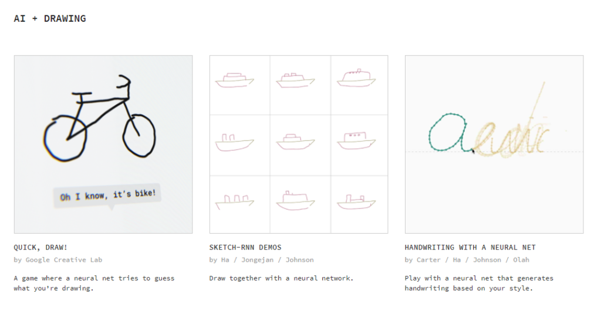

Another set of experiments which I think are really cool are related to audio. For example, with the **Freddiemeter**, you can measure how much your singing looks like that of Freddie Mercury's. The **Semi-Conductor** allows you to conduct a digital orchestra based on your webcam, by means of a [PoseNet-like](https://github.com/tensorflow/tfjs-models/tree/master/posenet) Machine Learning architecture.

I'm loving these examples as they really make Machine Learning Accessible! 😎

* * *

## Introducing Teachable Machine

Despite the fact that those experiments are - in my opinion - quite awesome, I've always thought that one key thing was missing.

A method for creating your own Machine Learning models from the browser. Or rather, a method for _letting other people create ML models from their browser_. In the workshops that I give for business audiences, people are often thrilled to hear about the possibilities that Machine Learning can bring them. In fact, they really get impressed how the world is changing rapidly into a place where data lies at the core of contemporary organizations.

...but I think they could be even more impressed when they can actually create their own ML model from scratch, but without having to code, because business people aren't the greatest coders, generally speaking.

Unfortunately, this never seemed to be possible. Until - for another workshop - I looked at the AI Experiments website again today. When looking around, I found an experiment called **Teachable Machine**. According to its website, it makes it possible for you to "\[t\]rain a computer to recognize your own images, sounds, & poses" (Teachable Machine, n.d.). In fact, you can now create a Machine Learning model from your web browser - and pick from three model types:

- A Machine Learning model that can **classify audio samples** into one of user-configured classes.
- A Machine Learning model that can **classify images** (or webcam streams) into one of user-configured classes.
- A Machine Learning model that can **classify human poses** into one of user-configured classes.

Teachable Machine thus only support [classification](https://www.machinecurve.com/index.php/2020/10/19/3-variants-of-classification-problems-in-machine-learning/) as of now, but its website suggests that more model types are added frequently.

https://www.youtube.com/watch?v=T2qQGqZxkD0&feature=emb\_title

* * *

## Getting Started: an Image Project

Enough bla-bla for now. Time to get started, so let's see if we can generate an Image Project with Teachable Machine. This afternoon, I managed to train a model that can classify my webcam stream into "cup" and "no cup" based on only approximately 150-225 images per class.

In fact, I generated those images by simply using my webcam to generate a stream of data, including some weird behavior like moving the cup from edge to edge, turning it up side down, and so on.

### Creating a new project

The first thing you need to do in order to get started with Teachable Machine is to navigate to their website, [teachablemachine.withgoogle.com](https://teachablemachine.withgoogle.com/).

Then make sure to click the button 'Get Started'.

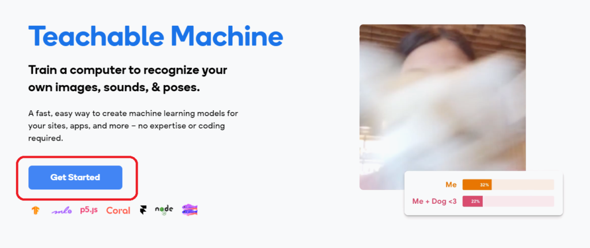

The web application then navigates to a page that lets you [create your own project](https://teachablemachine.withgoogle.com/train). We're going to create a classifier that is capable of classifying a webcam stream, so make sure to click 'Image Project'. Of course, if you're playing around yourself, you can also create an Audio Project or a Pose Project. Do note that training the model will take a bit longer with those kind of projects, because the input data is more complex.

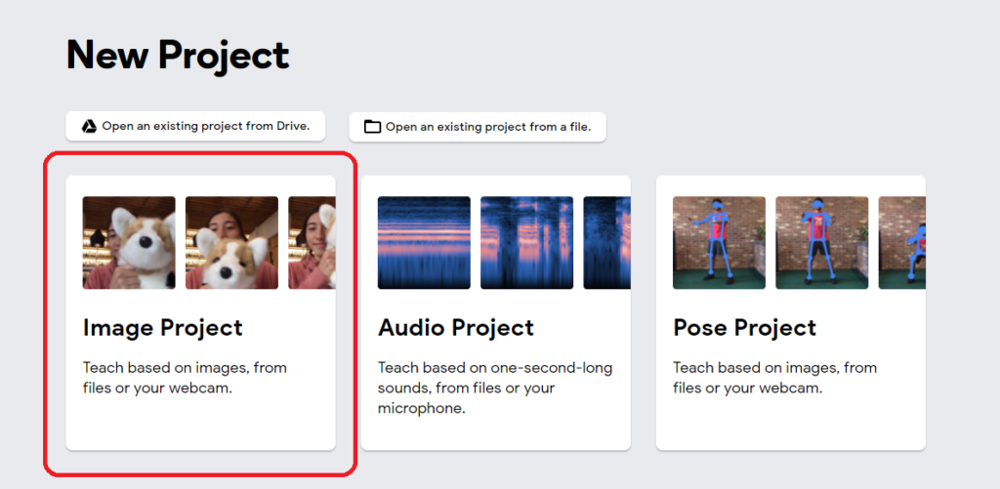

### Deciding about your classes

Then it's time to decide about the classes you're going to train with. Do you want to train a [binary classifier](https://www.machinecurve.com/index.php/2020/10/19/3-variants-of-classification-problems-in-machine-learning/#variant-1-binary-classification) and hence use [Sigmoid](https://www.machinecurve.com/index.php/2019/09/04/relu-sigmoid-and-tanh-todays-most-used-activation-functions/) for generating the prediction under the hood, or will you make it a [multiclass one](https://www.machinecurve.com/index.php/2020/10/19/3-variants-of-classification-problems-in-machine-learning/#variant-2-multiclass-classification) using [Softmax](https://www.machinecurve.com/index.php/2020/01/08/how-does-the-softmax-activation-function-work/)?

Take some time to think about what you want. You could also pick one of these classes:

- **Cup / no cup**, in case you have a a cup somewhere near you. Being a true engineer, powered by coffee, this is likely the case 😉☕
- **Hot dog / No Hot dog**, which is [self-explanatory](https://www.machinecurve.com/index.php/2020/10/20/tutorial-building-a-hot-dog-not-hot-dog-classifier-with-tensorflow-and-keras/).
- **Cat / dog**, should you have two animals walking around in your house.
- **Purple / red / green / blue**, if you have papers in various colors nearby.

Let's now enter these classes. I'm going for the Hot Dog / No Hot Dog scenario, just like the [Hotdog Classifier](https://www.machinecurve.com/index.php/2020/10/20/tutorial-building-a-hot-dog-not-hot-dog-classifier-with-tensorflow-and-keras/).

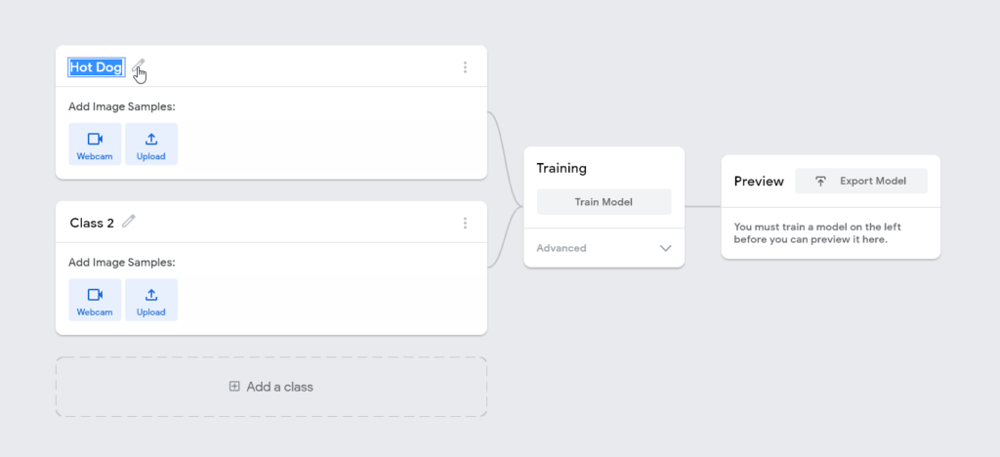

I first enter 'Hot Dog' by adapting the first class, then 'Not Hot Dog' by adapting the second class.

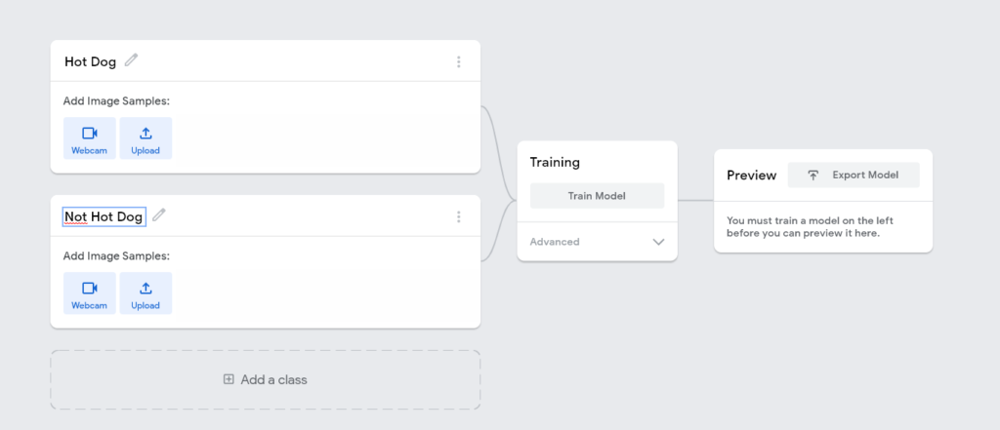

If you chose the scenario with > 2 classes, then you can use the 'Add a class' button to add another class.

### Generating training data

It's now time to generate training data. You can do so in multiple ways. If you have a dataset available (for example the [Hot Dog / Not Hot Dog dataset](https://www.machinecurve.com/index.php/2020/10/20/tutorial-building-a-hot-dog-not-hot-dog-classifier-with-tensorflow-and-keras/)), you can of course use that by clicking the 'Upload' button. You can also use your Webcam if you want to generate data yourself.

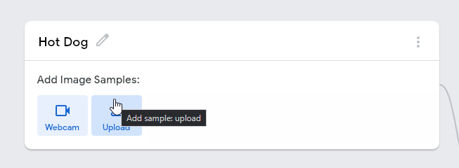

Make sure to have that dataset, or generate it:

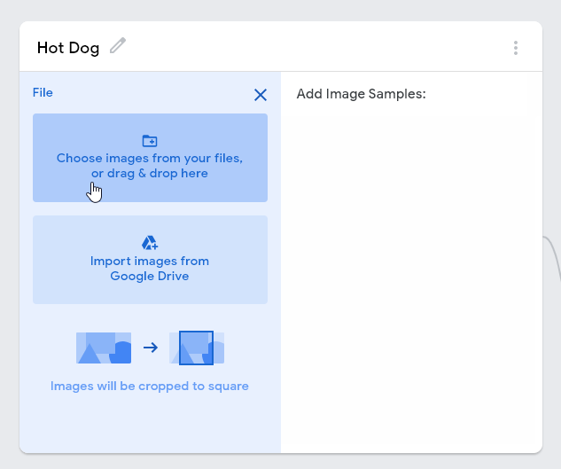

Now upload images from Drive or file. At least 150 are necessary, in my experience.

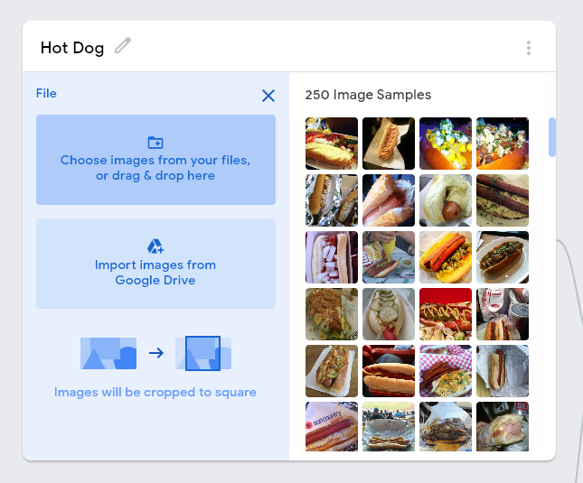

Make sure to do the same for 'Not Hot Dog', but then with the other data.

### Training the model

Your screen should now look somewhat like this:

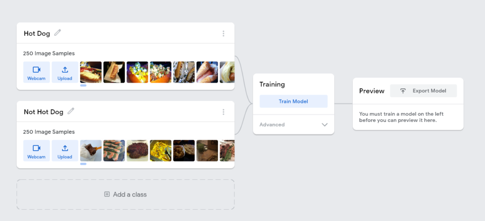

Through the **Advanced** button, you can adapt the number of _epochs_ (i.e. number of iterations), the batch size (the poorer your hardware, the lower it should be) and the [Learning Rate](https://www.machinecurve.com/index.php/2019/11/06/what-is-a-learning-rate-in-a-neural-network/) - which should be fine at 0.001 in this setting. Generally, you don't want to tweak the settings, and click 'Train Model' straight away.

So let's do that. The model then starts training.

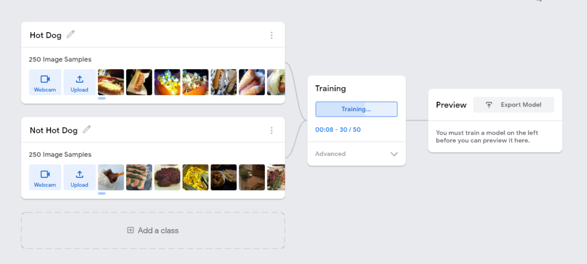

### Generating new predictions

When it's done training, Preview Mode becomes available. Here, you can upload a few files - and see whether your model works.

In our case, it should:

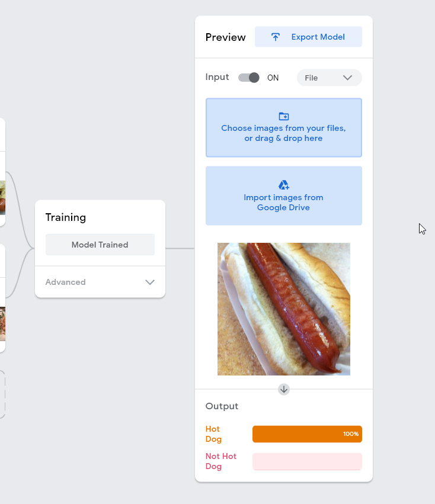

Correct!

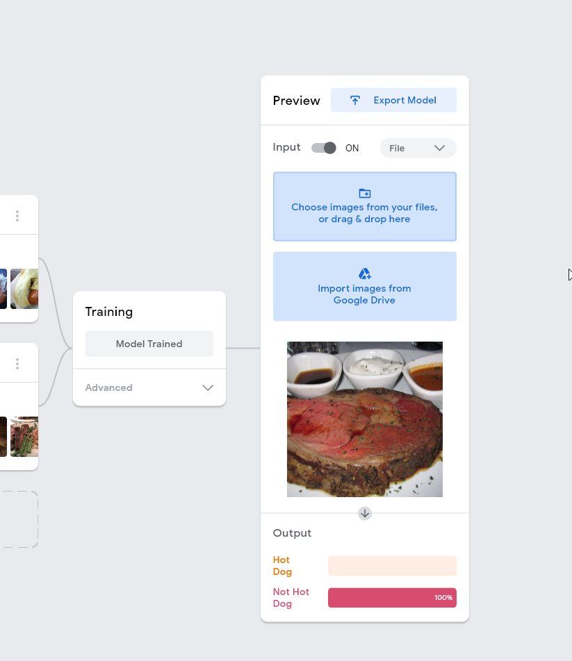

Also good!

Awesome! 😎

* * *

## Exporting your model to TensorFlow, TF.js or TF Lite

Even better is that you can **export the model you just trained**. For example, you can [load it with TensorFlow](https://www.machinecurve.com/index.php/2020/02/14/how-to-save-and-load-a-model-with-keras/), run it in the web browser with [TensorFlow.js](https://www.tensorflow.org/js) or use it with [Model Optimization techniques in TensorFlow Lite](https://www.machinecurve.com/index.php/tag/model-optimization/). Simply click 'Export Model' and use the option you want - you'll even get a code example as part of the deal.

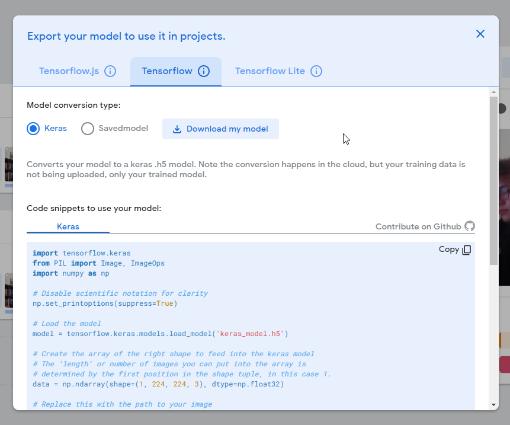

* * *

## Summary

In this relatively brief but in my opinion interesting article, we looked at a technique for training Machine Learning models from your web browser - Teachable Machine, a Google AI Experiment. It demonstrates that Machine Learning is not necessarily a domain for experts and that everyone can train models, if they understand the [basics](https://www.machinecurve.com/index.php/2020/10/19/3-variants-of-classification-problems-in-machine-learning/).

It allows one to create a classification model for images, audio or human poses, to capture a training set directly from the web browser, and export the model to be ran with true TensorFlow, TF.js or TF Lite. It's a great tool for workshops, allowing people without any experiments to become very proud:

_I've just created my own Machine Learning model!_

I hope that you've enjoyed this article. If you did, please feel free to let me know in the comments section below 💬 Please do the same if you have any other questions, remarks or comments. I'd happily adapt the article whenever necessary, and help you move forward where possible. Thank you for reading MachineCurve today and happy engineering! 😎

* * *

## References

AI experiments. (n.d.). Experiments with Google. [https://experiments.withgoogle.com/collection/ai](https://experiments.withgoogle.com/collection/ai)

Teachable Machine. (n.d.). [https://teachablemachine.withgoogle.com/](https://teachablemachine.withgoogle.com/)
