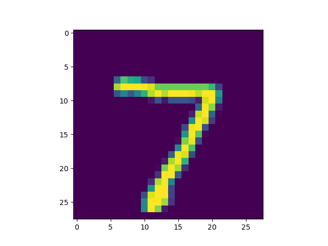
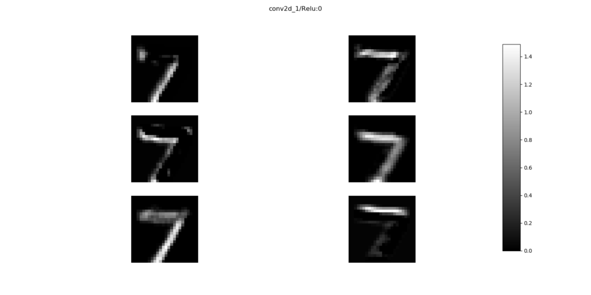
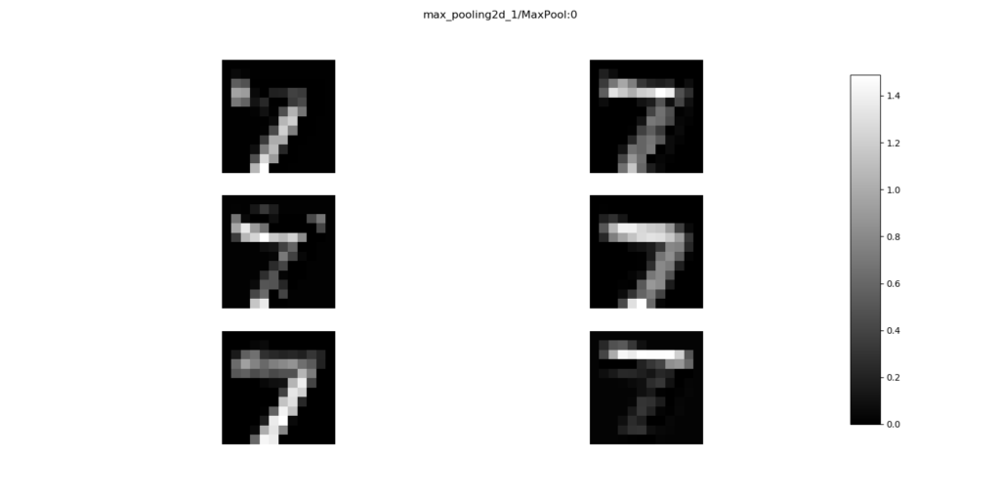
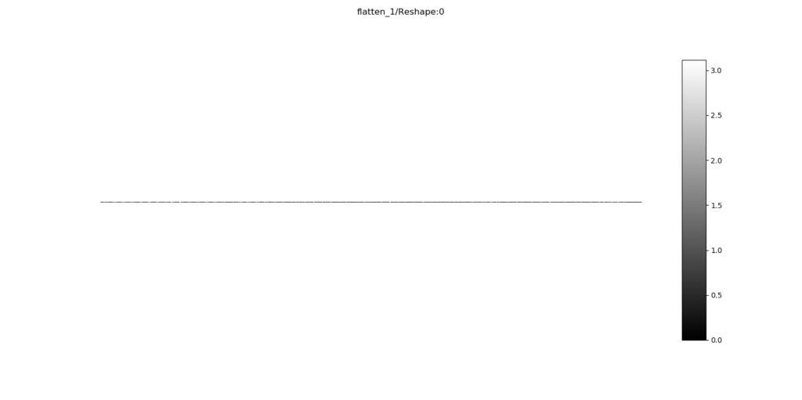
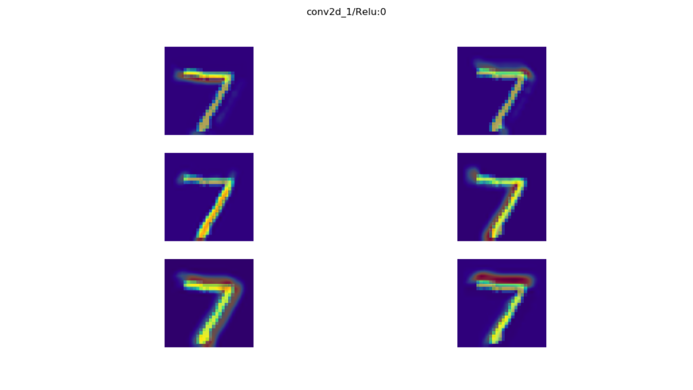
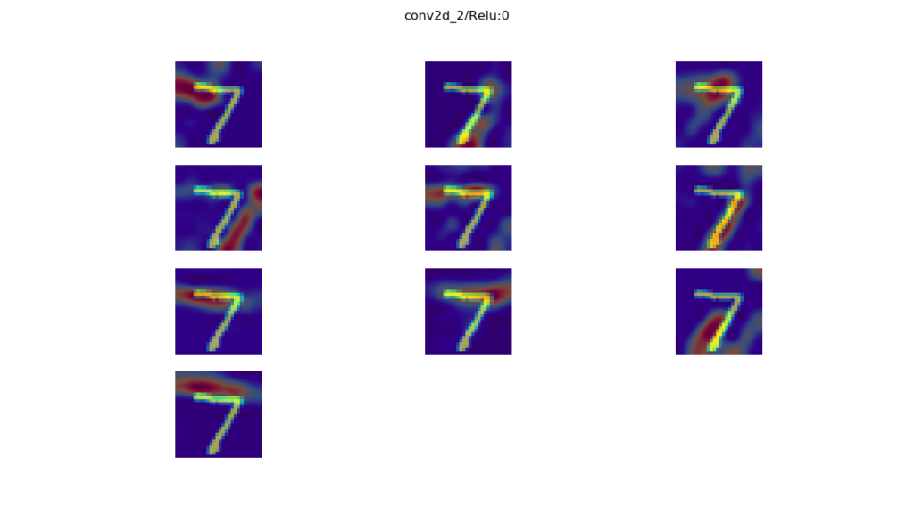

When you train Convolutional Neural Networks, you wish to understand their performance before you apply them in the real world. This spawns the need for visualization: when you can see how they perform, layer by layer, you can improve them in a more guided fashion.

This is what is possible with Keract - and not only for Convolutional Neural Networks. This toolkit, which is available as an open source Github repository and `pip` package, allows you to visualize the outputs of any Keras layer for some input. This way, you can trace how your input is eventually transformed into the prediction that is output - possibly identifying bottlenecks in the process - and subsequently improve your model.

In this blog post, we'll cover precisely this feature of the Keract toolkit. We first argue in more detail why it can be smart to visualize the output of various neural network layers. Subsequently, we introduce Keract, which is followed by the creation of a simple ConvNet that can classify MNIST digits. Note again that you can also use Keract when you don't have a ConvNet - that is, it allows you to visualize Dense layers as well.

Followed by the creation of our simple classifier, we use Keract to do a couple of things. First, we use it to generate visualizations of the outputs of the model's layers. Subsequently, we show that it can also generate _activation heatmaps_, which are similar to the [Grad-CAM maps](https://www.machinecurve.com/index.php/2019/11/28/visualizing-keras-cnn-attention-grad-cam-class-activation-maps/) which we created in another blog post. Finally, we show that you don't necessarily need ConvNets to use Keract - as indicated - by giving you an example.

Let's go! 😎

**Update April 2020:** updated the code to run with TensorFlow 2.0+

\[toc\]

## Why visualize layer outputs?

Training your supervised neural network involves feeding forward your training data, generating predictions, and computing a loss score, which is used for [optimization purposes](https://www.machinecurve.com/index.php/2019/10/24/gradient-descent-and-its-variants/). However, it may be that your optimizer gets stuck after some time - and you would like to know why this occurs and, more importantly, what you could do about it.

Take for example a [Convolutional Neural Network](https://www.machinecurve.com/index.php/2018/12/07/convolutional-neural-networks-and-their-components-for-computer-vision/). Such a network is often composed of two types of layers: convolutional layers, which learn features from the image, that can be used by densely-connected layers for classification purposes. The result is a neural network that can classify images - and with quite some accuracy in many cases!

However, especially with problems that are less straight-forward, ConvNets can be tough to train. In some cases, it does not even converge. Visualizing layer outputs gets important in those cases. As convolutional layers, together with additional layers such as pooling layers downsample the image - in the sense that it gets smaller and more abstract - it may be the case, for example, that information loss occurs. When this happens, a neural network might no longer be able to discriminate between the classes, and hence show inadequate performance. Solving this might be done by increasing the number of feature maps or by removing a layer. While this increase computational cost, it might also improve model performance.

Hence: visualization is important. Let's now introduce Keract, which we can use to visualize the outputs of the layers of our Keras models.

## What is Keract?

Keract is best summarized as follows: **You have just found a (easy) way to get the activations (outputs) and gradients for each layer of your Keras model ([LSTM](https://www.machinecurve.com/index.php/2020/12/29/a-gentle-introduction-to-long-short-term-memory-networks-lstm/), conv nets…)** (Rémy, 2019).

It is a set of simple yet powerful tools to visualize the outputs (and gradients, but we leave them out of this blog post) of every layer (or a subset of them) of your Keras model. Contrary to many visualization packages, it doesn't only visualize the convolutional layers. Rather, it visualizes output of other layers as well: [LSTMs](https://www.machinecurve.com/index.php/2020/12/29/a-gentle-introduction-to-long-short-term-memory-networks-lstm/), densely-connected ones, and so on. That's great news, as Keract will thus allow you to follow an input throughout the entire model towards its final prediction.

Let's now implement Keract based visualization using a simple convolutional neural network that classifies the MNIST dataset 😀 As you likely know, this dataset contains thousands of 28x28 pixel images of handwritten digits, i.e. the numbers 0 to 9. Visualizing a subset of them produces this plot:

[](https://www.machinecurve.com/wp-content/uploads/2019/07/mnist.png)

Since the MNIST dataset is integrated with Keras by design, it's very easy to use it. Additionally, models often achieve very high accuracies quite simply, making it one of the better datasets when applying Keras for educational purposes.

Let's go! 😎

## Creating a simple MNIST ConvNet: model architecture

This is the architecture of the model that we will create today:

[](https://www.machinecurve.com/wp-content/uploads/2019/12/model.png)

The model's architecture from the input layer to the output Dense layer. Click [here](https://www.machinecurve.com/index.php/2019/10/07/how-to-visualize-a-model-with-keras/) if you want to understand how to make such plots yourself.

We start with an **input layer**, which is simply receptive to the inputs as they are fed to the model. This input layer passes the data to a **Conv2D** layer, which is a convolutional layer that handles two-dimensional inputs. The layer will output six so-called [feature maps](https://www.machinecurve.com/index.php/2018/12/07/convolutional-neural-networks-and-their-components-for-computer-vision/#convolutional-layers), in which the model can detect certain 'features' that separate the classes, to be used for discriminating between the digits 0 to 9. This number - six - is arbitrary: it could have been 32, or 250, but the more feature maps, the more computational resources you need. Additionally, the Keract visualizations that will follow would then consume a substantial amount of space. For this post, we've kept it simple - but feel free to change this number as you desire.

Upon passing through the Conv2D layer, data flows to a **MaxPooling2D** layer. This layer essentially looks at the data with e.g. a 2x2 pixels block, taking the maximum value for the block at every time. While the information present in the feature map remains relatively intact, the image gets substantially smaller - saving the need for computational resources. If you're having trouble visualizing this in your head - you've found the _exact_ reason why visualization with e.g. Keract helps you with tuning your deep neural networks.... as it will provide the visualization for you. But let's finish analyzing the architecture first!

Once the feature maps have passed the max pooling layer, they are fed into another **Conv2D** layer, which learns to identify more abstract features (based on more abstract data). This way, with multiple convolutional layers, a _hierarchy_ of features is learnt: highly abstract ones as well as more detailed ones. This benefits the model's discriminative power.

Once this convolutional layer has generated another set of feature maps - ten in our case - we let the data pass to a **Flatten** layer. This layer simply takes the data, which is multidimensional (by having a width, height and depth - the ten feature maps), and converts it into a onedimensional array. Why this is necessary is simple: the densely-connected layers, or the "true neuron like layers" that we will use next, can only handle one-dimensional data. The Flatten layer hence connects the convolutional part of your model with the Dense, or classification, part.

As said, two **Dense** layers subsequently follow the convolutional part. They allow for actual classification. The final Dense layer uses the **Softmax** activation function, for [multiclass classification](https://www.machinecurve.com/index.php/2019/10/22/how-to-use-binary-categorical-crossentropy-with-keras/) purposes.

## From architecture to code: the model

Okay, enough bla-bla about the architecture for now. Let's turn it into code! 😁

### What you'll need to run the model

You can't run code when you don't have the appropriate tools. To run today's model, you'll need to install these dependencies:

- Python, obviously, as we're creating Python code. Please use version 3.6+.
- TensorFlow 2.x, which includes Keras, the deep learning framework we're using today.
- Keract, for generating the neural network visualizations.

That's it already! 😊

### Imports and model preparations

Open up your Explorer and navigate to some folder. Create a file - and name it e.g. `keract_activations.py`. Now open an editor, open the file, and start coding. What you'll have to code largely aligns with the [Keras CNN tutorial](https://www.machinecurve.com/index.php/2019/09/17/how-to-create-a-cnn-classifier-with-keras/), and especially the first part:

```
'''
  Visualize layer activations of a tensorflow.keras CNN with Keract
'''

# =============================================
# Model to be visualized
# =============================================
import tensorflow
from tensorflow.keras.datasets import mnist
from tensorflow.keras.models import Sequential
from tensorflow.keras.layers import Dense, Dropout, Flatten
from tensorflow.keras.layers import Conv2D, MaxPooling2D
from tensorflow.keras import backend as K
from tensorflow.keras import activations

# Model configuration
img_width, img_height = 28, 28
batch_size = 250
no_epochs = 25
no_classes = 10
validation_split = 0.2
verbosity = 1

# Load MNIST dataset
(input_train, target_train), (input_test, target_test) = mnist.load_data()

# Reshape data based on channels first / channels last strategy.
# This is dependent on whether you use TF, Theano or CNTK as backend.
# Source: https://github.com/keras-team/keras/blob/master/examples/mnist_cnn.py
if K.image_data_format() == 'channels_first':
    input_train = input_train.reshape(input_train.shape[0], 1, img_width, img_height)
    input_test = input_test.reshape(input_test.shape[0], 1, img_width, img_height)
    input_shape = (1, img_width, img_height)
else:
    input_train = input_train.reshape(input_train.shape[0], img_width, img_height, 1)
    input_test = input_test.reshape(input_test.shape[0], img_width, img_height, 1)
    input_shape = (img_width, img_height, 1)

# Parse numbers as floats
input_train = input_train.astype('float32')
input_test = input_test.astype('float32')

# Normalize data
input_train = input_train / 255
input_test = input_test / 255

# Convert target vectors to categorical targets
target_train = tensorflow.keras.utils.to_categorical(target_train, no_classes)
target_test = tensorflow.keras.utils.to_categorical(target_test, no_classes)
```

### The architecture in code

The architecture, that follows next, equals the architecture we visualized before:

```
# Create the model
model = Sequential()
model.add(Conv2D(6, kernel_size=(5, 5), activation='relu', input_shape=input_shape))
model.add(MaxPooling2D(pool_size=(2, 2)))
model.add(Conv2D(10, kernel_size=(5, 5), activation='relu'))
model.add(Flatten())
model.add(Dense(256, activation='relu'))
model.add(Dense(no_classes, activation='softmax'))
```

### Model compilation & training

Configuring the model (by tuning hyperparameters) and fitting it to the data (i.e., assigning where the training process should start) is similar to the Keras CNN tutorial again:

```
# Compile the model
model.compile(loss=tensorflow.keras.losses.categorical_crossentropy,
              optimizer=tensorflow.keras.optimizers.Adam(),
              metrics=['accuracy'])

# Fit data to model
model.fit(input_train, target_train,
          batch_size=batch_size,
          epochs=no_epochs,
          verbose=verbosity,
          validation_split=validation_split)

# Generate generalization metrics
score = model.evaluate(input_test, target_test, verbose=0)
print(f'Test loss: {score[0]} / Test accuracy: {score[1]}')
```

### Starting the training process

Now, when we open up a terminal where the required software dependencies are installed, you most likely experience a working training process. Once the model has trained for 25 epochs, the process finishes and the model evaluation procedure kick in:

```
Test loss: 0.043425704475744877 / Test accuracy: 0.9896000027656555
```

99.0% accuracy (okay, 98.96%) - that's great! 😊

## Installing Keract

So far, we haven't done anything different from the Keras CNN tutorial. But that's about to change, as we will now install Keract, the visualization toolkit that we're using to generate model/layer output visualizations & heatmaps today.

Installation is simple: `pip install keract`. Run this command in your terminal, and that should be it 😁

Next up: generating visualizations of the outputs of your layers!

## Generating layer output visualizations

Keract comes with a very simple API, and it is very easy to generate output visualizations for your layers. It's as simple as this:

```
# =============================================
# Keract visualizations
# =============================================
from keract import get_activations, display_activations
keract_inputs = input_test[:1]
keract_targets = target_test[:1]
activations = get_activations(model, keract_inputs)
display_activations(activations, cmap="gray", save=False)
```

This is what this piece of code does:

- First, the `get_activations` and `display_activations` functions are imported from Keract. With `get_activations`, you can retrieve the layer activations numerically, i.e. you get arrays with activations. By calling `display_activations` and passing these activations, you can visualize them.
- After the imports, you select the `inputs` and `targets` that must be visualized this time. In this case, we visualize the first sample of the test set.
- Finally, we call `get_activations` for the `model` instance and input image, and subsequently display them with `display_activations`, using the gray colormap. We don't save them, but rather display them on screen.

Now it's time to run the model again. Likely, you have to start training again (check [ModelCheckpoint](https://www.machinecurve.com/index.php/2019/05/30/avoid-wasting-resources-with-earlystopping-and-modelcheckpoint-in-keras/) if you wish to avoid this by saving your model instance to file), but when it finishes, visualizations start popping up.

Remember the architecture? Recall...

- That we start with a Conv2D layer;
- That this layer is followed by MaxPooling2D;
- Once again followed by Conv2D;
- That subsequently, the data is flattened;
- And that it is finally passed through two Dense layers, generating a prediction.

Let's now see whether we actually _see this happen_.

This is the input image that is represented by `input_test[:1]`:

[](https://www.machinecurve.com/wp-content/uploads/2019/12/seven.png)

When this is passed to the first layer, recall that **six feature maps** are generated that learn to detect a feature. Think of them as a "coloring mechanism": when you pass them the input they know to detect, the elements of the input picture that match these inputs will "light up", as if given some color.

In our case, this is what lights up for each feature map when the _seven_ is passed to the first convolutional layer:

[](https://www.machinecurve.com/wp-content/uploads/2019/12/0_conv2d_1.png)

As you can see, some feature maps detect the top of the seven, others the bottom, whereas others detect the inner edges, and so on. They all detect different features of your input image.

The next layer is the Max Pooling layer:

[](https://www.machinecurve.com/wp-content/uploads/2019/12/1_maxpooling2d_1.png)

Recall that this layer is used for _downsampling_, i.e., making the image smaller with (preferably) limited information loss. You can see this happening when you compare the visualization of the Max Pooling layer with the Conv2D one above: the activations learnt by the convolutional layer persist, but they get blocky and the total images get smaller. This is precisely what Max Pooling does.

Next up, another convolutional layer:

[](https://www.machinecurve.com/wp-content/uploads/2019/12/2_conv2d_2.png)

Here, **ten feature maps** are learnt, which learn to detect abstract features in the converted input image. Nevertheless, you can still detect how they activate for the number seven.

Next up: the Flatten layer.

[](https://www.machinecurve.com/wp-content/uploads/2019/12/3_flatten.png)

It simply converts the multidimensional input into a onedimensional output, being an array, or dots on a line segment. This is fed into a Dense layer which activates with the [ReLU activation function](https://www.machinecurve.com/index.php/2019/09/04/relu-sigmoid-and-tanh-todays-most-used-activation-functions/):

[](https://www.machinecurve.com/wp-content/uploads/2019/12/4_dense.png)

Finally, data arrives at the **Softmax layer**, which essentially generates a prediction. Perhaps unsurprisingly, you can see that all neurons are black (outputting **0**) while only one is **white, or 'one' or 'true'**. When counting the block size from left to right, you'll see that the model output is the **eight** digit - or, the number _seven_ (zero is the first digit) Bingo! 🎉

[](https://www.machinecurve.com/wp-content/uploads/2019/12/5_dense.png)

## Generating layer activation heatmaps

Note that sometimes, you do not only wish to get _output visualizations_ for your layers (showing how the feature maps activate on some aspects of your image), but rather, you wish to generate an input/activation overlay. This can be done with Keract as well, and more specifically with its `display_heatmaps` function. This can be done as follows:

```
# =============================================
# Keract visualizations
# =============================================
from keract import get_activations, display_heatmaps
keract_inputs = input_test[:1]
keract_targets = target_test[:1]
activations = get_activations(model, keract_inputs)
display_heatmaps(activations, keract_inputs, save=False)
```

Resulting in slightly different visualizations _for only the convolutional and convolutional-related layers:_

- [](https://www.machinecurve.com/wp-content/uploads/2019/12/conv2d_1.png)
    
- [](https://www.machinecurve.com/wp-content/uploads/2019/12/conv2d_2.png)
    
- [](https://www.machinecurve.com/wp-content/uploads/2019/12/maxpooling.png)
    

### You don't need ConvNets to use Keract

Note again, as we've seen with `display_activations`, you do not necessarily need to use a ConvNet if you wish to use Keract. Rather, it works with Dense layers and recurrent ones as well. But that's for another blog! 😃

## Summary

Today, we've seen how to visualize the way your Keras model's layers activate by using Keract. We provided an example model that is capable of classifying the MNIST dataset, and subsequently showed how to use Keract in order to visualize how your model's layers activate when passed a new input value.

I hope you've learnt something today. If you did, I'd appreciate a comment - please feel free to leave one in the comments box below 😁 Thanks a lot, and happy engineering! 😊

## References

Rémy, P. (2019, November 28). Keract. Retrieved from [https://github.com/philipperemy/keract](https://github.com/philipperemy/keract)
