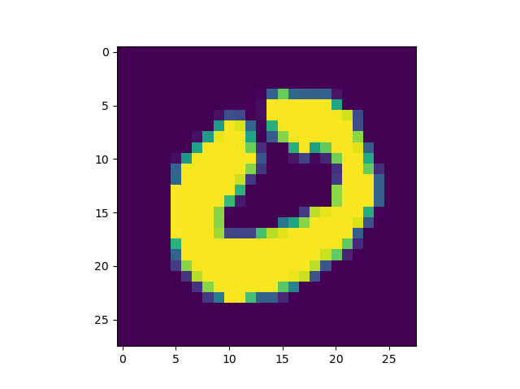
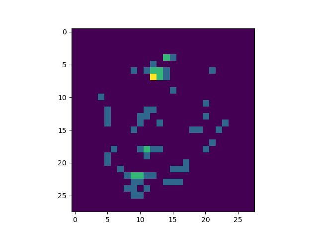
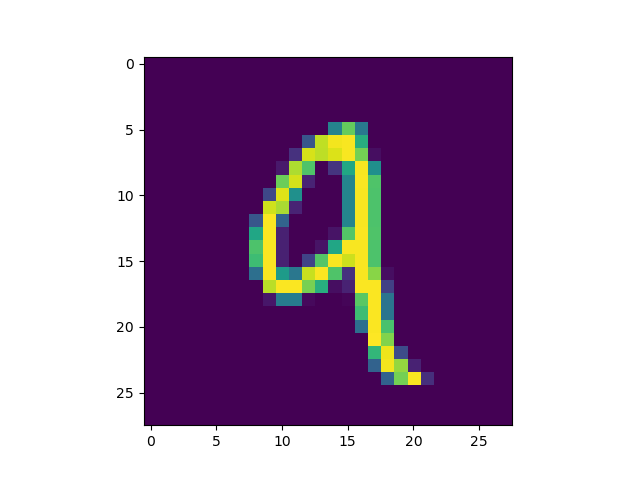
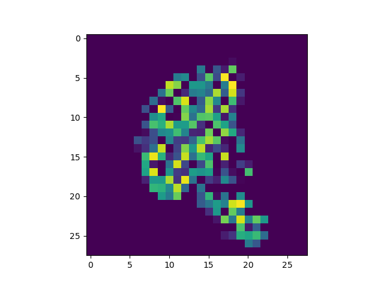

Machine learning and deep learning are here to stay. After the spectacular rise of deep learning since 2012, much research has been undertaken into how those models need to be trained. This has spawned a significant rise in academic works on machine learning, as well as practical applications.

Personally, I think the latter is of significance too - machine learning should not remain a research field only. In fact, many companies are already using machine learning in the core of their business. Take Amazon, for example. It's a very data-driven company and harnesses machine learning for generating, say, the products you should likely buy.

And so does Uber, with demand prediction, crash detection and Estimated Time of Arrival computations, to give just a few examples.

Now, applications of machine learning can sometimes be critical. For example, in the field of medicine, utilization of computer vision models for inspecting scans can produce very good results - but what if it misses one?

Machine learning explainability is a key driver of future adoption of ML in production settings. Recently, many approaches for explaining the outcomes of machine learning models have emerged - and then especially so for computer vision related models.

In this blog post, we will also be looking at one of those approaches for explaining the outcome of Convolutional Neural Networks: at Vanilla Gradients, to be precise.

What are Vanilla Gradients? How can they be used to determine which pixels of an image contribute most to the outcome? And how can we implement a Keras model and explain it by means of the `tf-explain` framework?

That's what we will cover today. Firstly, I'll introduce `tf-explain`, which is an awesome framework which allows you to use a variety of model explainability techniques with your Keras model.

Finally, this is followed by the step-by-step implementation of an actual Keras model by means of `tf-explain`. This way, you'll be able to understand _how_ model explainability works with Vanilla Gradients, _why_ it works that way and how you can _use_ it in practice.

Ready? All right, let's go! 😎

* * *

\[toc\]

* * *

## Introducing tf-explain

Now that we understand what Vanilla Gradients are, we can take a look at `tf-explain`. Put simply, it is a collection of techniques used for explaining machine learning models (Tf-explain, n.d.).

A wide range of explainability techniques is supported:

1. [Activations Visualization](https://www.machinecurve.com/index.php/2020/04/27/neural-network-activation-visualization-with-tf-explain/)
2. _Vanilla Gradients_
3. Gradients\*Inputs
4. Occlusion Sensitivity
5. Grad CAM (Class Activation Maps)
6. SmoothGrad
7. Integrated Gradients

…and others are on their development roadmap:

1. GradCAM++
2. Guided SmoothGrad
3. LRP

Created by a French company called Sicara, it's really worth a look. Here, you can find it [on GitHub](https://github.com/sicara/tf-explain).

Installation is simple: `pip install tf-explain`. That’s it – and it’s usable for both the TensorFlow CPU and GPU based models 🙂

* * *

## Vanilla Gradients and your Keras ConvNet

All right - that's the theory for today. Let's shift our focus to some practice :D Practice, here, meaning explaining your Keras based Convolutional Neural Network with Vanilla Gradients using `tf-explain`.

What do we need?

A model, I guess. And it should be a ConvNet.

### Today's model

Let's take a look at the model that we will be using first.

It'll be a simple Convolutional Neural Network that we created in our post explaining the [Keras Conv2D layer type](https://www.machinecurve.com/index.php/2020/03/30/how-to-use-conv2d-with-keras/).

Why not create the ConvNet here, you'd likely argue. There is one big reason:It would spoil this blog post - which is not about creating a ConvNet, but about applying Vanilla Gradients for visualizing the importance of gradients with respect to your input image.

That's why we will be using the model that we created before, but we'll adapt it to use the MNIST dataset.

If you wish to understand how the model was created - that's entirely possible :) Please click the link above to go to the particular post explaining the code below.

Here's the Python code for today's model. Open up a code editor, create a Python file (such as `vanillagradients.py`) and code away:

```
from tensorflow.keras.datasets import mnist
from tensorflow.keras.models import Sequential
from tensorflow.keras.layers import Dense, Flatten, Conv2D
from tensorflow.keras.losses import sparse_categorical_crossentropy
from tensorflow.keras.optimizers import Adam

# Model configuration
batch_size = 50
img_width, img_height, img_num_channels = 28, 28, 1
loss_function = sparse_categorical_crossentropy
no_classes = 10
no_epochs = 100
optimizer = Adam()
validation_split = 0.2
verbosity = 1

# Load MNIST data
(input_train, target_train), (input_test, target_test) = mnist.load_data()

# Determine shape of the data
input_shape = (img_width, img_height, img_num_channels)

# Reshape data
input_train = input_train.reshape((input_train.shape[0], img_width, img_height, img_num_channels))
input_test  = input_test.reshape((input_test.shape[0], img_width, img_height, img_num_channels))

# Parse numbers as floats
input_train = input_train.astype('float32')
input_test = input_test.astype('float32')

# Scale data
input_train = input_train / 255
input_test = input_test / 255

# Create the model
model = Sequential()
model.add(Conv2D(32, kernel_size=(3, 3), activation='relu', input_shape=input_shape))
model.add(Conv2D(64, kernel_size=(3, 3), activation='relu'))
model.add(Conv2D(128, kernel_size=(3, 3), activation='relu'))
model.add(Flatten())
model.add(Dense(128, activation='relu'))
model.add(Dense(no_classes, activation='softmax'))

# Compile the model
model.compile(loss=loss_function,
              optimizer=optimizer,
              metrics=['accuracy'])

# Fit data to model
history = model.fit(input_train, target_train,
            batch_size=batch_size,
            epochs=no_epochs,
            verbose=verbosity,
            validation_split=validation_split)

# Generate generalization metrics
score = model.evaluate(input_test, target_test, verbose=0)
print(f'Test loss: {score[0]} / Test accuracy: {score[1]}')
```

\[affiliatebox\]

### Applying vanilla gradients during training

Tf-explain allows you to apply vanilla gradients in two ways: **during training**, which allows you to visualize progress using TensorBoard, and **after training**, so that you can see how new data responds.

We'll cover both in this blog post, but here, we will cover the _during training_ visualization (_after_ training is covered below).

It consists of multipe phases of adaptations to the model code above:

1. Adding tf-explain to your imports;
2. Creating a Keras callback: the VanillaGradientsCallback;
3. Fitting data to your model with the callback appended.

Let's start with adding `tf-explain` to our imports.

#### Adding tf-explain to your imports

These are the current imports for our Keras model:

```
from tensorflow.keras.datasets import mnist
from tensorflow.keras.models import Sequential
from tensorflow.keras.layers import Dense, Flatten, Conv2D
from tensorflow.keras.losses import sparse_categorical_crossentropy
from tensorflow.keras.optimizers import Adam
```

We'll have to add `tf_explain` and specifically the VanillaGradientsCallback, which is done as follows:

```
from tf_explain.callbacks.vanilla_gradients import VanillaGradientsCallback
```

Also make sure to import the `os` module, the need for which we'll explain later - `import os`.

...this yields:

```
from tensorflow.keras.datasets import mnist
from tensorflow.keras.models import Sequential
from tensorflow.keras.layers import Dense, Flatten, Conv2D
from tensorflow.keras.losses import sparse_categorical_crossentropy
from tensorflow.keras.optimizers import Adam
from tf_explain.callbacks.vanilla_gradients import VanillaGradientsCallback
import os
```

#### Creating a Keras callback: the VanillaGradientsCallback

Now that we have imported the `VanillaGradientsCallback`, it's time to use it in our model.

We can do so by means of a **Keras callback**. Callbacks are pieces of code that are executed after each iteration, or epoch, and can manipulate the training process.

For example, with the [ModelCheckpoint and EarlyStopping callbacks](https://www.machinecurve.com/index.php/2019/05/30/avoid-wasting-resources-with-earlystopping-and-modelcheckpoint-in-keras/), you can ensure that your training process stops precisely in time, while saving the best model instance you've found during the training process.

This saves you resources and avoids that your [saved model](https://www.machinecurve.com/index.php/2020/02/14/how-to-save-and-load-a-model-with-keras/) has been overfitting for some time.

However, we can also apply callbacks for using vanilla gradients with `tf-explain`: by means of the `VanillaGradientsCallback`, we can visualize and explain our model during the training process. Here's the code for creating the Keras callback:

```
# Defining callbacks
output_dir = './output'
os.mkdir(output_dir)
keras_callbacks = [
    VanillaGradientsCallback(
        validation_data=(input_test, target_test),
        class_index=0,
        output_dir=output_dir,
    ),
]
```

It contains of 3 separate blocks:

- The `output_dir`, which specifies the directory where your TensorBoard required files are stored so that visualization can happen.
- The `os.mkdir` call, which generates the `output_dir` in your file system.
- The `keras_callbacks` array, which is the collection of callbacks that will be used during the training process. In today's case, it's only the `VanillaGradientsCallback`. We specify our test set as validation data for the callback, set a class that we want to visualize, and specify the output directory.

#### Fitting data to your model with the callback appended

We can then add the callback to our `model.fit` operation which starts the training process, to ensure that it is actually used:

```
# Fit data to model
history = model.fit(input_train, target_train,
            batch_size=batch_size,
            epochs=no_epochs,
            verbose=verbosity,
            validation_split=validation_split,
            callbacks=keras_callbacks)
```

That's it already! If you open up your terminal where `tf-explain` and TensorFlow 2.x are installed, and run the code, you'll see the training process begin.

#### Full model code

If you wish to obtain the full model code at once, that's possible :) Here you go:

```
from tensorflow.keras.datasets import mnist
from tensorflow.keras.models import Sequential
from tensorflow.keras.layers import Dense, Flatten, Conv2D
from tensorflow.keras.losses import sparse_categorical_crossentropy
from tensorflow.keras.optimizers import Adam
from tf_explain.callbacks.vanilla_gradients import VanillaGradientsCallback
import os

# Model configuration
batch_size = 50
img_width, img_height, img_num_channels = 28, 28, 1
loss_function = sparse_categorical_crossentropy
no_classes = 10
no_epochs = 100
optimizer = Adam()
validation_split = 0.2
verbosity = 1

# Load MNIST data
(input_train, target_train), (input_test, target_test) = mnist.load_data()

# Determine shape of the data
input_shape = (img_width, img_height, img_num_channels)

# Reshape data
input_train = input_train.reshape((input_train.shape[0], img_width, img_height, img_num_channels))
input_test  = input_test.reshape((input_test.shape[0], img_width, img_height, img_num_channels))

# Parse numbers as floats
input_train = input_train.astype('float32')
input_test = input_test.astype('float32')

# Scale data
input_train = input_train / 255
input_test = input_test / 255

# Create the model
model = Sequential()
model.add(Conv2D(32, kernel_size=(3, 3), activation='relu', input_shape=input_shape))
model.add(Conv2D(64, kernel_size=(3, 3), activation='relu'))
model.add(Conv2D(128, kernel_size=(3, 3), activation='relu'))
model.add(Flatten())
model.add(Dense(128, activation='relu'))
model.add(Dense(no_classes, activation='softmax'))

# Compile the model
model.compile(loss=loss_function,
              optimizer=optimizer,
              metrics=['accuracy'])

# Defining callbacks
output_dir = './output'
os.mkdir(output_dir)
keras_callbacks = [
    VanillaGradientsCallback(
        validation_data=(input_test, target_test),
        class_index=0,
        output_dir=output_dir,
    ),
]

# Fit data to model
history = model.fit(input_train, target_train,
            batch_size=batch_size,
            epochs=no_epochs,
            verbose=verbosity,
            validation_split=validation_split,
            callbacks=keras_callbacks)

# Generate generalization metrics
score = model.evaluate(input_test, target_test, verbose=0)
print(f'Test loss: {score[0]} / Test accuracy: {score[1]}')
```

Now, open up your terminal again (possibly the same one as you trained your model in), `cd` to the folder where your `.py` file is located, and start TensorBoard:

```
tensorboard --logdir=./output
```

By default, TensorBoard will load on `localhost` at port `6006`:

```
Serving TensorBoard on localhost; to expose to the network, use a proxy or pass --bind_all
TensorBoard 2.1.0 at http://localhost:6006/ (Press CTRL+C to quit)
```

At that URL, you can find the visualizations you need :)

### Applying Vanilla Gradients to new data

Sometimes, however, you don't want to use Vanilla Gradients _during_ training, but rather, _after training_, to find how your model behaves... and explain it.

With Vanilla Gradients, you can do so in two ways:

1. Set a class to explain, and feed it an image corresponding to the class, and see which parts of the image contribute most to the output. This tells you something about whether the correct parts of the image contribute to the correct class output.
2. Set a class to explain, and feed it an image corresponding to an incorrect class. The output image tells you something about what parts of the image (which is the wrong class) contribute to the output mostly, i.e. to the _error_ mostly.

Let's give an example.

#### Adding tf-explain to your imports

The first thing we do is adding the `VanillaGradients` explainer to our imports:

```
from tensorflow.keras.datasets import mnist
from tensorflow.keras.models import Sequential
from tensorflow.keras.layers import Dense, Flatten, Conv2D
from tensorflow.keras.losses import sparse_categorical_crossentropy
from tensorflow.keras.optimizers import Adam
from tf_explain.core.vanilla_gradients import VanillaGradients
import matplotlib.pyplot as plt
import numpy as np
```

We also add Matplotlib, for generating visualizations later, and Numpy, for numbers processing.

#### Instantiating the VanillaGradients explainer

Then, after `model.fit`, we select a sample - in this case, sample 25 from the test set:

```
# Get some sample
sample = 25
sample_image = np.array(input_test[sample]).reshape((img_width, img_height))
plt.imshow(sample_image)
plt.show()
```

We also visualize it.

Then, we instantiate the Vanilla Gradients explainer:

```
# Instantiate the explainer
explainer = VanillaGradients()
```

And explain away:

```
# Explain away
sample_array = (np.array([input_test[sample]]), None)
explanation = explainer.explain(sample_array, model, class_index=0)
plt.imshow(explanation)
plt.show()
```

...once again visualizing the outcome.

#### Full model code

Should you wish to obtain the full code for your model - that's possible again :) Here you go:

```
from tensorflow.keras.datasets import mnist
from tensorflow.keras.models import Sequential
from tensorflow.keras.layers import Dense, Flatten, Conv2D
from tensorflow.keras.losses import sparse_categorical_crossentropy
from tensorflow.keras.optimizers import Adam
from tf_explain.core.vanilla_gradients import VanillaGradients
import matplotlib.pyplot as plt
import numpy as np

# Model configuration
batch_size = 50
img_width, img_height, img_num_channels = 28, 28, 1
loss_function = sparse_categorical_crossentropy
no_classes = 10
no_epochs = 10
optimizer = Adam()
validation_split = 0.2
verbosity = 1


# Load MNIST data
(input_train, target_train), (input_test, target_test) = mnist.load_data()

# Determine shape of the data
input_shape = (img_width, img_height, img_num_channels)

# Reshape data
input_train = input_train.reshape((input_train.shape[0], img_width, img_height, img_num_channels))
input_test  = input_test.reshape((input_test.shape[0], img_width, img_height, img_num_channels))

# Parse numbers as floats
input_train = input_train.astype('float32')
input_test = input_test.astype('float32')

# Scale data
input_train = input_train / 255
input_test = input_test / 255

# Create the model
model = Sequential()
model.add(Conv2D(32, kernel_size=(3, 3), activation='relu', input_shape=input_shape))
model.add(Conv2D(64, kernel_size=(3, 3), activation='relu'))
model.add(Conv2D(128, kernel_size=(3, 3), activation='relu'))
model.add(Flatten())
model.add(Dense(128, activation='relu'))
model.add(Dense(no_classes, activation='softmax'))

# Compile the model
model.compile(loss=loss_function,
              optimizer=optimizer,
              metrics=['accuracy'])

# Fit data to model
history = model.fit(input_train, target_train,
            batch_size=batch_size,
            epochs=no_epochs,
            verbose=verbosity,
            validation_split=validation_split)

# Get some sample
sample = 25
sample_image = np.array(input_test[sample]).reshape((img_width, img_height))
plt.imshow(sample_image)
plt.show()

# Instantiate the explainer
explainer = VanillaGradients()

# Explain away
sample_array = (np.array([input_test[sample]]), None)
explanation = explainer.explain(sample_array, model, class_index=0)
plt.imshow(explanation)
plt.show()

# Generate generalization metrics
score = model.evaluate(input_test, target_test, verbose=0)
print(f'Test loss: {score[0]} / Test accuracy: {score[1]}')
```

#### Results

Running your code will allow the training process to start:

```
Train on 48000 samples, validate on 12000 samples
2020-05-02 20:35:01.571880: I tensorflow/stream_executor/platform/default/dso_loader.cc:44] Successfully opened dynamic library cublas64_100.dll
2020-05-02 20:35:01.844852: I tensorflow/stream_executor/platform/default/dso_loader.cc:44] Successfully opened dynamic library cudnn64_7.dll
2020-05-02 20:35:02.834555: W tensorflow/stream_executor/cuda/redzone_allocator.cc:312] Internal: Invoking ptxas not supported on Windows
Relying on driver to perform ptx compilation. This message will be only logged once.
 9200/48000 [====>..................
```

And once it ends, you should have two visualizations generated :)

- 
    
- 
    

On the left, you see the sample you're trying to explain your model with - and on the right, you see which parts of the sample contribute most to the class output. There you go :)

Now for use case 2 - explaining the error. Suppose that we set `class_index = 4` in our explainer (which would correspond to the number 4, as the MNIST dataset has 10 classes, the numbers 0-9), and feed it a 9, we see:

- 
    
- 
    

It seems that the distinction is not so strong as I thought it would be. Nevertheless, you can still use Vanilla Gradients to determine _which parts of the input contribute to the output the most_.

* * *

\[affiliatebox\]

## Summary

In this blog post, we showed you how Vanilla Gradients can be used for explaining ConvNet performance. We started with an introduction to `tf-explain`, which is a great collection of model explanation techniques. This was followed by an example implementation of Vanilla Gradients for your Keras model, both for visualizing during training and after training. We concluded by demonstrating the results of today's post visually.

I hope you've learnt something today! If you did, please feel free to leave a comment in the comments section below - I would appreciate it 😊💬 Please make sure to do the same if you have any questions, remarks or other comments. I'll be happy to respond.

Thank you for reading MachineCurve today and happy engineering 😎

\[kerasbox\]

* * *

## References

Tf-explain. (n.d.). _tf-explain documentation_. tf-explain — tf-explain documentation. [https://tf-explain.readthedocs.io/en/latest/](https://tf-explain.readthedocs.io/en/latest/)
