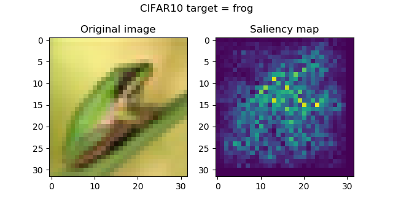
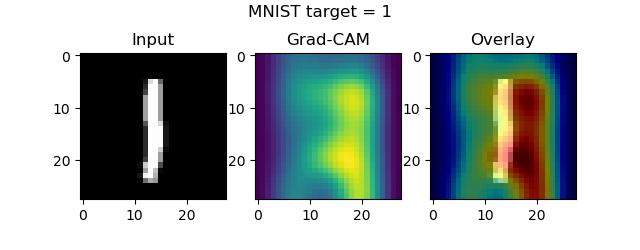
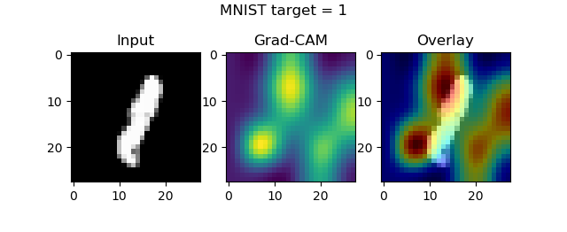
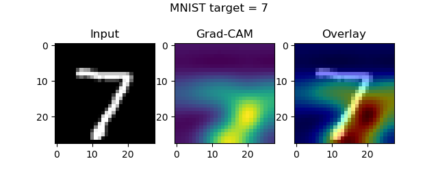
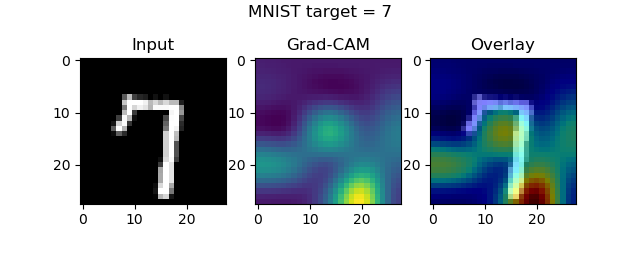
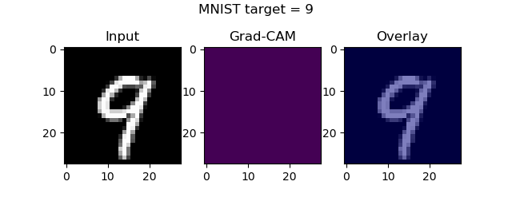

When training image classifiers, you wish to know that it generates predictions based on what you want the model to see. For example, if you have a classifier that can distinguish cars from buses, it should determine whether the picture contains a bus or a car based on _the vehicle_, rather than the environment.

....this may sound odd, since a well-performing model ensures that this in order, doesn't it?

You can't imagine how simple is to disturb the model :-) What if your training set contained buses in snowy environments only, whereas the cars drive in various weather conditions? What if your dataset contains cars at night, while buses drive during daytime? And so on. In those cases, it might be that the model's discriminative powers come from the environment rather than the target, rendering pretty bad performance for buses that drive while it's not snowing, especially at nighttime.

Fortunately, it's possible to inspect where your ConvNet attends to, with **Class Activation Maps**. In this blog post, we cover the maps offered by the `keras-vis` toolkit: the Grad-CAM class activation maps. We'll first recap why model performance should be visualized in your ML projects, from a high level perspective. Subsequently, we introduce `keras-vis`, and will point you to other blogs on this topic. Then, we continue with the real deal:

- We cover traditional class activation maps and Grad-CAM maps and will cover the reasons why `keras-vis` offers the latter ones.
- We implement the visualizations, using the MNIST dataset. We cover this process step by step, providing you the code with explanations.
- We argue why guided Grad-CAM might result in even better visualizations, but why `keras-vis` does (no longer) support this.
- Subsequently, because we can't help it, we repeat the process for a CIFAR10 CNN 😀

All right. Enough introductory text - let's go! 😎

\[toc\]

## Recap: why visualize model performance?

Machine learning models, or more colloquially _AI models_, have been taking a special role in today's business environment. 'Algorithms', as they are sometimes called as well, are automating away tasks that previously required human knowledge.

Especially machine learning models, which are trained with large quantities of data, are increasing the speed of this process. This comes with an inherent risk: we often don't know what happens within these models. Explaining their behavior can be hard and difficult. Still, this is one of the most important aspects of machine learning, as - according to Gehrmann et al. (2019):

- Users give up their agency, or autonomy, and control over the processes automated by machine learning.
- Users are forced to trust models that have been shown to be biased.
- Similarly, users have to rely on these same models.

## Introducing `keras-vis`

Hence, scholars have been finding ways to explain model behavior. `keras-vis` is a practical implementation of these attempts. It is a toolkit that can be integrated with your Keras models, and used for visualization.

Broadly speaking, it comes with three types of visualizations:

- **[Activation Maximization](https://www.machinecurve.com/index.php/2019/11/18/visualizing-keras-model-inputs-with-activation-maximization/)**, which essentially generates a perfect image of a particular class for a trained model.
- **[Saliency Maps](https://www.machinecurve.com/index.php/2019/11/25/visualizing-keras-cnn-attention-saliency-maps/)**, which - given some input image - tell you something about the importance of each pixel for generating the class decision, hence visualizing where the model looks at when deciding.
- **Class Activation Maps**, and especially Grad-CAM class activation maps, which generate heatmaps at the _convolutional_ level rather than the _dense_ neural layer level, taking into account more spatial details.

We cover the latter in this blog post. Please click the links above if you wish to understand more about the other two, or if you wish to find examples for them.

## Traditional and Grad-CAM Class Activation Maps

Let's first cover the inner workings of class activation maps and Grad-CAMs, or _gradient-weighted class activation maps_, before we continue to the example implementation. Of course, if you're interested in the example only, please feel free to skip this section - but I think it's interesting to see why these visualizations work as they do.

In fact, we'll have to take an additional step backwards in order to understand Grad-CAMs: by looking at saliency maps.

As we covered in the [saliency maps blog post](https://www.machinecurve.com/index.php/2019/11/25/visualizing-keras-cnn-attention-saliency-maps/), saliency maps tell you something about the importance of a pixel of the input image. In the case of `keras-vis` based saliency maps, this is the importance of a pixel of the input image with respect to _generating the class prediction_, i.e. the output. This is achieved by mathematically asking the following question: how does the output of the saliency map change when changing its input?

As you could see in the blog post, they work pretty well in telling you which parts of the image are used for generating the target prediction:

[](https://www.machinecurve.com/wp-content/uploads/2019/11/frog-2.png)

However, we can find suggestions for improvement with respect to saliency maps (Selvaraju et al., 2017):

- These maps, which the above authors call _pixel-space gradient visualizations,_ highlight many details in the image, but are not necessarily _class discriminative_ (see the MNIST image below).
- This especially occurs when two similar but different classes occur in an image. In their paper, the authors provide an image of a cat and a dog, and the pixel based visualizations highlight both the cat and the dog for the 'dog' and 'cat' classes, respectively.

[](https://www.machinecurve.com/wp-content/uploads/2019/11/sal9.png)

We can't be 100% sure whether this activates because of a 9 or because of an 8.

Class activation maps (or CAMs) solve this problem: they are highly class discriminative, exclusively highlighting the class regions for the class to be visualized (Selvaraju et al., 2017). This is why traditional CAMs have been popular for some time, as proposed by Zhou et al. (2016). However - and this is why `keras-vis` makes use of Grad-CAMs (we'll explain these next) - traditional CAMs also come with one big drawback:

**Traditional CAMs can only be used by a small class of ConvNets, i.e. those without densely-connected layers, directly passing forward the convolutional feature maps to the output layer (Selvaraju et al., 2017).**

This fact makes it hard to use them in real life models, where often [convolutional layers are followed by densely-connected ones](https://www.machinecurve.com/index.php/2019/09/17/how-to-create-a-cnn-classifier-with-keras/), to generate various [computer vision applications](https://www.machinecurve.com/index.php/2018/12/07/convolutional-neural-networks-and-their-components-for-computer-vision/). Fortunately, Selvajaru et al. (2017) propose a generalization of the CAM approach which can be used by _any_ architecture, hence also the ones with densely-connected layers.

It is called **gradient-weighted class activation maps** (Grad-CAM) and works as follows:

- First, the gradient of the _output class prediction_ with respect to the _feature maps of your **last** convolutional layer_ is computed (before the Softmax layer which is common in [multiclass scenarios](https://www.machinecurve.com/index.php/2019/10/22/how-to-use-binary-categorical-crossentropy-with-keras/) - hence, we replace it in our implementation with Linear).
- Subsequently, these gradients flow back, and determine the relative importance of these feature maps for the class prediction, by means of global average pooling.
- By generating a weighted combination of the feature maps in this layer and their weights, we get a _gradient-weighted_ CAM heatmap that represents both the _positive_ and _negative_ importance factors for the input image. The positive factors mean that many feature maps participate in the importance of some area with respect to the output class (i.e., the desired class). Those are the areas that likely contain the object of interest. The negative factors mean that many feature maps participate in the importance of that area with respect to the _other classes_ (as the gradients will be strongly negative).
- Selvaraju et al. simply yet ingeniously propose to pass the heatmap through a [ReLU](https://www.machinecurve.com/index.php/2019/09/04/relu-sigmoid-and-tanh-todays-most-used-activation-functions/) function to filter out the negative areas, setting them to zero importance, while maintaining importance of the positive areas.

...which allows us to visualize which parts of an image participate in a class decision, and hence add _explainability_ to the ConvNet's prediction process!

Let's now see if we can implement this 😎

## Implementing the visualizations

### Today's dataset: MNIST

In today's implementation, we will generate visualizations for predictions made with a model trained on the MNIST dataset. As you can see in the image below, this dataset contains many small images that represent handwritten digits. That is, we have ten classes: the numbers 0 to 9.

[](https://www.machinecurve.com/wp-content/uploads/2019/07/mnist.png)

### What you'll need to run the models

As with many MachineCurve tutorials, you'll need to have a few software dependencies installed in order to run the models. For generating Grad-CAMs, dependencies are as follows:

- **Python**, as you will need to use Keras - the deep learning framework for Python. Make sure to install Python 3.6+.
- **Keras**, which is the deep learning framework we're using today.
- One of the supported backends, being **Tensorflow, Theano or CNTK**. Keras runs on top of these and abstracts the backend into easily comprehensible format. We advise to use Tensorflow, as it is deeply integrated with Keras today.
- **Matplotlib**, for generating plots for the visualizations and colormap information.
- **Numpy**, for data processing.
- **Keras-vis**, the toolkit for generating Grad-CAMs.

From the blog on [saliency maps](https://www.machinecurve.com/index.php/2019/11/25/visualizing-keras-cnn-attention-saliency-maps/) \- this is important:

With this latter requirement, there is a catch: `pip install keras-vis` doesn't work, as it will not install the most recent version - which is a version that doesn't work with the most recent versions of Tensorflow/Keras.

Instead, you'll need to install `keras-vis` a little bit differently, like this:

```
pip install https://github.com/raghakot/keras-vis/archive/master.zip
```

When doing so, version `0.5.0` will be installed, which is - as of November 2019 - the most recent version:

```
>pip install https://github.com/raghakot/keras-vis/archive/master.zip
Collecting https://github.com/raghakot/keras-vis/archive/master.zip
  Downloading https://github.com/raghakot/keras-vis/archive/master.zip
     \ 58.1MB 819kB/s
Building wheels for collected packages: keras-vis
  Building wheel for keras-vis (setup.py) ... done
Successfully built keras-vis
Installing collected packages: keras-vis
Successfully installed keras-vis-0.5.0
```

### Today's model: default Keras CNN

The first step you'll undertake now is opening File explorer and creating a file such as `class_activation_maps_mnist.py`. In this file, you're going to add your code. Now open a code editor and open the file. Then proceed.

We're going to use the Keras CNN we created and explained in a different blog for today's MNIST visualizations. Hence, I won't explain the model in much detail here, but would like to refer you [to that blog](https://www.machinecurve.com/index.php/2019/09/17/how-to-create-a-cnn-classifier-with-keras/) if you wish to know more. Instead, I'll just give you the model code:

```
'''
  Visualizing how layers represent classes with keras-vis Class Activation Maps (Grad-CAM).
'''

# =============================================
# Model to be visualized
# =============================================
import keras
from keras.datasets import mnist
from keras.models import Sequential
from keras.layers import Dense, Dropout, Flatten
from keras.layers import Conv2D, MaxPooling2D
from keras import backend as K
from keras import activations

# Model configuration
img_width, img_height = 28, 28
batch_size = 250
no_epochs = 25
no_classes = 10
validation_split = 0.2
verbosity = 1

# Load MNIST dataset
(input_train, target_train), (input_test, target_test) = mnist.load_data()

# Reshape data based on channels first / channels last strategy.
# This is dependent on whether you use TF, Theano or CNTK as backend.
# Source: https://github.com/keras-team/keras/blob/master/examples/mnist_cnn.py
if K.image_data_format() == 'channels_first':
    input_train = input_train.reshape(input_train.shape[0], 1, img_width, img_height)
    input_test = input_test.reshape(input_test.shape[0], 1, img_width, img_height)
    input_shape = (1, img_width, img_height)
else:
    input_train = input_train.reshape(input_train.shape[0], img_width, img_height, 1)
    input_test = input_test.reshape(input_test.shape[0], img_width, img_height, 1)
    input_shape = (img_width, img_height, 1)

# Parse numbers as floats
input_train = input_train.astype('float32')
input_test = input_test.astype('float32')

# Normalize data
input_train = input_train / 255
input_test = input_test / 255

# Convert target vectors to categorical targets
target_train = keras.utils.to_categorical(target_train, no_classes)
target_test = keras.utils.to_categorical(target_test, no_classes)

# Create the model
model = Sequential()
model.add(Conv2D(32, kernel_size=(3, 3), activation='relu', input_shape=input_shape))
model.add(MaxPooling2D(pool_size=(2, 2)))
model.add(Dropout(0.25))
model.add(Conv2D(64, kernel_size=(3, 3), activation='relu'))
model.add(MaxPooling2D(pool_size=(2, 2)))
model.add(Dropout(0.25))
model.add(Flatten())
model.add(Dense(256, activation='relu'))
model.add(Dense(no_classes, activation='softmax', name='visualized_layer'))

# Compile the model
model.compile(loss=keras.losses.categorical_crossentropy,
              optimizer=keras.optimizers.Adam(),
              metrics=['accuracy'])

# Fit data to model
model.fit(input_train, target_train,
          batch_size=batch_size,
          epochs=no_epochs,
          verbose=verbosity,
          validation_split=validation_split)

# Generate generalization metrics
score = model.evaluate(input_test, target_test, verbose=0)
print(f'Test loss: {score[0]} / Test accuracy: {score[1]}')
```

### ...one difference, though

Being the final layer that is added to the model:

```
model.add(Dense(no_classes, activation='softmax', name='visualized_layer'))
```

We added `name='visualized_layer'`, which is not present in the model creation in the other blog post. Adding this allows us to use this layer in Grad-CAM visualizations later.

### Creating the Grad-CAM map

Now that we have a model instance, we can create a Grad-CAM - let's find out how.

First, we add some additional imports: `keras-vis` as `vis` for visualization purposes, together with Matplotlib (for plotting purposes) and Numpy (for data processing):

```
# =============================================
# Grad-CAM code
# =============================================
from vis.visualization import visualize_cam, overlay
from vis.utils import utils
import matplotlib.pyplot as plt
import numpy as np
import matplotlib.cm as cm
```

Subsequently, we find the index of the layer we will use in the visualizations by means of the `name` we gave it earlier:

```
# Find the index of the to be visualized layer above
layer_index = utils.find_layer_idx(model, 'visualized_layer')
```

Next, we swap the final layer's Softmax activation function with a Linear activation function, which simply passes input `x` as `x`. As Grad-CAMs are generated by weighing the gradients of the output class prediction with respect to the feature maps of the last convolutional layer of your model, you need to ensure that information passes properly. Softmax breaks this pattern, and hence you need to convert it into Linear. We do that as follows:

```
# Swap softmax with linear
model.layers[layer_index].activation = activations.linear
model = utils.apply_modifications(model)  
```

Next, we specify some samples to visualize:

```
# Numbers to visualize
indices_to_visualize = [ 0, 12, 38, 83, 112, 74, 190 ]
```

...and actually generate the visualizations:

```
# Visualize
for index_to_visualize in indices_to_visualize:
  # Get input
  input_image = input_test[index_to_visualize]
  input_class = np.argmax(target_test[index_to_visualize])
  # Matplotlib preparations
  fig, axes = plt.subplots(1, 3)
  # Generate visualization
  visualization = visualize_cam(model, layer_index, filter_indices=input_class, seed_input=input_image)
  axes[0].imshow(input_image[..., 0], cmap='gray') 
  axes[0].set_title('Input')
  axes[1].imshow(visualization)
  axes[1].set_title('Grad-CAM')
  heatmap = np.uint8(cm.jet(visualization)[..., :3] * 255)
  original = np.uint8(cm.gray(input_image[..., 0])[..., :3] * 255)
  axes[2].imshow(overlay(heatmap, original))
  axes[2].set_title('Overlay')
  fig.suptitle(f'MNIST target = {input_class}')
  plt.show()
```

- We iterate over all the indices that we wish to visualize.
- For each index, we get the input image and the input class that corresponds to this image.
- We subsequently prepare Matplotlib and generate the visualization for the input image given the input class.
- Next, we plot the original image, the Grad-CAM feature map and the two as an overlay image.
- That's it - we show the plot!

### The results

Now, open up a terminal (e.g. `cmd` or your Anaconda terminal - any terminal suffices as long it has the dependencies), and `cd` to the folder where your `class_activation_maps_mnist.py` or similar file is stored. Next, execute the script, via `python class_activation_maps_mnist.py`.

Once the model finishes training, the plots should start popping up:

- 
    
- 
    
- 
    
- 
    
- 
    
- 
    
- 
    

## Guided Grad-CAM maps and `keras-vis`

While Grad-CAMs are quite capable to generate heatmaps often, it would be even better if pixel based approaches (such as saliency maps) can be combined with Grad-CAMs. Guided Grad-CAMs are a solution to this challenge, as traditional Grad-CAMs are combined with guided backprop in order to generate an even more accurate visualization (Selvaraju et al., 2017).

While `keras-vis` supports this, maintenance on the toolkit has dropped somewhat. This unfortunately means that it is no longer fully compatible with newer Tensorflow and Keras versions. Although traditional Grad-CAMs do work, the guided (and rectified) versions unfortunately produce errors that cannot be overcome.

## Summary

In this blog post, we've seen how to generate gradient-weighted Class Activation Maps (or Grad-CAMs) with the `keras-vis` toolkit, for your Keras model. We explained the conceptual nature of Grad-CAMs and how they differ from pixel based approaches such as saliency maps. We also provided an example implementation that runs with your Keras model.

I hope you've learnt something from this blog and am looking forward to your comment! 😊 If you have any questions, remarks, or when you think that my blog can be improved - please feel free to drop me a message in the comments box below ⬇.

Thank you for reading MachineCurve today and happy engineering! 😎

## References

Gehrmann, S., Strobelt, H., Kruger, R., Pfister, H., & Rush, A. M. (2019). Visual Interaction with Deep Learning Models through Collaborative Semantic Inference. _IEEE Transactions on Visualization and Computer Graphics_, 1-1. [doi:10.1109/tvcg.2019.2934595](https://arxiv.org/abs/1907.10739)

Kotikalapudi, Raghavendra and contributors. (2017). Github / keras-vis. Retrieved from [https://github.com/raghakot/keras-vis](https://github.com/raghakot/keras-vis)

Selvaraju, R. R., Cogswell, M., Das, A., Vedantam, R., Parikh, D., & Batra, D. (2017). Grad-CAM: Visual Explanations from Deep Networks via Gradient-Based Localization. _2017 IEEE International Conference on Computer Vision (ICCV)_. [doi:10.1109/iccv.2017.74](https://arxiv.org/abs/1610.02391)

Zhou, B., Khosla, A., Lapedriza, A., Oliva, A., & Torralba, A. (2016). Learning Deep Features for Discriminative Localization. _2016 IEEE Conference on Computer Vision and Pattern Recognition (CVPR)_. [doi:10.1109/cvpr.2016.319](http://cnnlocalization.csail.mit.edu/)
