Deep neural networks were black boxes traditionally. The mantra "you feed them data, you'll get a working model, but you cannot explain how it works" is still very common today. Fortunately, however, developments in the fields of machine learning have resulted in _explainable AI_ by means of visualizing the internals of machine learning models.

In this blog, we'll take a look at a practice called **activation maximization**, which can be used to visualize 'perfect inputs' for your deep neural network. It includes an example implementation for Keras classification and regression models using the `tf-keras-vis` library.

However, we'll start with some rationale - why visualize model internals in the first place? What is activation maximization and how does it work? And what is `tf-keras-vis`?

Subsequently, we move on to coding examples for two Keras CNNs: one trained on the MNIST dataset, the other trained on the CIFAR10 dataset. Finally, we'll wrap up our post by looking at what we created.

After reading this tutorial, you will have learned...

- **What Activation Maximization is and how it can be used to compute expected inputs for class outcomes.**
- **How to use `tf-keras-vis` for Activation Maximization.**
- **How to apply Activation Maximization to your TensorFlow 2 based Keras models, using the MNIST and CIFAR-10 datasets.**

Let's go! 😎

**Update 17/Mar/2021:** large article update. `keras-vis` does not work with TensorFlow 2, so switched to `tf-keras-vis`. This ensures that the code can be used with TensorFlow 2 based versions of Keras. Also adapted the text to reflect on this. Ensures that the article is up to date for 2021 and beyond.

* * *

\[toc\]

* * *

## Code example: Activation Maximization with TensorFlow 2 based Keras

The code below provides a full example of using Activation Maximization with TensorFlow 2 based Keras for visualizing the expected inputs to a model, in order to reach a specific class outcome. For example, in the example below, you'll see what you should input to e.g. get class output for class 4.

It allows you to get started quickly. If you want to understand more details behind Activation Maximization or `tf-keras-vis`, make sure to read the rest of this tutorial as well! 🚀

```
'''
  Visualizing how layers represent classes with keras-vis Activation Maximization.
'''

# =============================================
# Model to be visualized
# =============================================
import tensorflow
from tensorflow.keras.datasets import cifar10
from tensorflow.keras.models import Sequential
from tensorflow.keras.layers import Dense, Dropout, Flatten
from tensorflow.keras.layers import Conv2D, MaxPooling2D
from tensorflow.keras import activations
import numpy as np

# Model configuration
img_width, img_height = 32, 32
batch_size = 250
no_epochs = 1
no_classes = 10
validation_split = 0.2
verbosity = 1

# Load CIFAR-10 dataset
(input_train, target_train), (input_test, target_test) = cifar10.load_data()

# Reshape data
input_train = input_train.reshape(input_train.shape[0], img_width, img_height, 3)
input_test = input_test.reshape(input_test.shape[0], img_width, img_height, 3)
input_shape = (img_width, img_height, 3)

# Parse numbers as floats
input_train = input_train.astype('float32')
input_test = input_test.astype('float32')

# Convert them into black or white: [0, 1].
input_train = input_train / 255
input_test = input_test / 255

# Convert target vectors to categorical targets
target_train = tensorflow.keras.utils.to_categorical(target_train, no_classes)
target_test = tensorflow.keras.utils.to_categorical(target_test, no_classes)

# Create the model
model = Sequential()
model.add(Conv2D(32, kernel_size=(3, 3), activation='relu', input_shape=input_shape))
model.add(MaxPooling2D(pool_size=(2, 2)))
model.add(Dropout(0.25))
model.add(Flatten())
model.add(Dense(256, activation='relu'))
model.add(Dense(no_classes, activation='softmax', name='visualized_layer'))

# Compile the model
model.compile(loss=tensorflow.keras.losses.categorical_crossentropy,
              optimizer=tensorflow.keras.optimizers.Adam(),
              metrics=['accuracy'])

# Fit data to model
model.fit(input_train, target_train,
          batch_size=batch_size,
          epochs=no_epochs,
          verbose=verbosity,
          validation_split=validation_split)

# Generate generalization metrics
score = model.evaluate(input_test, target_test, verbose=0)
print(f'Test loss: {score[0]} / Test accuracy: {score[1]}')

# =============================================
# Activation Maximization code
# =============================================
from tf_keras_vis.activation_maximization import ActivationMaximization
import matplotlib.pyplot as plt

def loss(output):
  return (output[0, 0], output[1, 1], output[2, 2], output[3, 3], output[4, 4], output[5, 5], output[6, 6], output[7, 7], output[8, 8], output[9, 9])

def model_modifier(m):
    m.layers[-1].activation = tensorflow.keras.activations.linear

# Initialize Activation Maximization
visualize_activation = ActivationMaximization(model, model_modifier)

# Generate a random seed for each activation
seed_input = tensorflow.random.uniform((10, 28, 28, 3), 0, 255)

# Generate activations and convert into images
activations = visualize_activation(loss, seed_input=seed_input, steps=512, input_range=(30,150))
images = [activation.astype(np.float32) for activation in activations]

# Define classes
classes = {
  0: 'airplane',
  1: 'automobile',
  2: 'bird',
  3: 'cat',
  4: 'deer',
  5: 'dog',
  6: 'frog',
  7: 'horse',
  8: 'ship',
  9: 'truck'
}

# Visualize each image
for i in range(0, len(images)):
  visualization = images[i]
  plt.imshow(visualization, cmap='gray')
  plt.title(f'CIFAR10 target = {classes[i]}')
  plt.show()
```

* * *

## Why visualize model internals?

Over the past few years we have seen quite a few AI breakthroughs. With the ascent of deep neural networks since 2012 have come self-driving cars, usage of AI in banking, and so on. However, humans still don't trust AI models entirely - and rightfully so, as for example AI has [a gender bias](https://www.reuters.com/article/us-amazon-com-jobs-automation-insight/amazon-scraps-secret-ai-recruiting-tool-that-showed-bias-against-women-idUSKCN1MK08G). It is really important to visualize the neural network which has so far been a _black box_ (Gehrman et al., 2019), as:

- Users give up their agency, or autonomy, and control over the processes automated by machine learning.
- Users are forced to trust models that have been shown to be biased.
- Similarly, users have to rely on these same models.

Fortunately, various approaches for studying the internals of the model with respect to how it works have emerged over the past few years. **Activation Maximization** is one of them, and can be used to generate images of the 'best input' for some class. We'll take a look at it intuitively now.

* * *

## Activation Maximization explained intuitively

During the [supervised training process](https://www.machinecurve.com/index.php/2019/10/04/about-loss-and-loss-functions/#the-high-level-supervised-learning-process), your neural network learns by adapting its weights, step by step, based on the error generated by the training data fed forward.

Suppose you're training a classifier. During training, you thus have fixed model inputs and model outputs for these inputs (since your training samples will always have a corresponding class number), and what is dynamic are the weights. These are adapted continuously (Valverde, 2018) in order to generate a model that performs well.

Now think the other way around. Suppose that you finished training a classifier. How do you know that it was trained correctly? Firstly, you can take a look at the loss value, but this does not tell you everything. Rather, you would want to see what the model _thinks_ belongs to every _class_. So, suppose you're using the MNIST dataset of handwritten digits, you're interested in e.g. what the model thinks is the best visual representation of class '4'. This is hopefully a visualization that somewhat (or perhaps even better, greatly) resembles an actual 4.

This is what _activation maximization can do:_ **you visualize what a class in your trained model looks like by inverting the process mentioned above**. This time, the weights and the desired output are constant, and the input will be modified as long as neurons that yield the class are maximized (Valverde, 2018). Since only the best possible image will maximize the activation of the neurons that produce this class number as output, you'll find _what the model thinks it sees when you're talking about some class_.

In the case of the '4' mentioned above, that would be something like this:

[](https://www.machinecurve.com/wp-content/uploads/2019/11/4-1.png)

* * *

## Visualizing Keras model performance: say hi to `tf-keras-vis`

Fortunately, for engineers who use Keras in their deep learning projects, there is a toolkit out there that adds activation maximization to Keras: `tf-keras-vis` ([link](https://github.com/keisen/tf-keras-vis)). Since it integrates with Keras quite well, this is the toolkit of our choice. As we'll be creating actual models, we'll next take a look at what software dependencies you need to install in order to run the models. Additionally, we'll also take a closer look at installing `tf-keras-vis`, which is slightly more complex than you realize now.

### What you'll need to run the models

We'll do two things in this tutorial:

- Create a Keras model (based on a model we created before);
- Visualize the network's inputs with `tf-keras-vis`.

We hence need the following dependencies:

- **TensorFlow 2** or any newer versions.
- **Python**, preferably version 3.8+;
- **[Tf-keras-vis](https://github.com/keisen/tf-keras-vis)**, for generating the input visualizations with activation maximization, adapted from `keras-vis` to TensorFlow 2;
- **Matplotlib**, for converting these visualizations into actual plots.

### Installing `tf-keras-vis`

Keras-vis for TensorFlow 2 can easily be installed with `pip install tf-keras-vis`.

* * *

## Visualizing Keras CNN MNIST inputs

Let's now create an example of visualizing inputs with activation maximization!

... a simple one, but a very fun one indeed: we'll be visualizing true inputs for the Keras MNIST CNN created [in another blog post](https://www.machinecurve.com/index.php/2019/09/17/how-to-create-a-cnn-classifier-with-keras/). This means that our code will consist of two parts:

- The Keras MNIST CNN, which can be replaced by your own Keras code, as long as it has some `model` instance.
- The activation maximization visualization code.

Open up your file explorer, navigate to some directory, and create a file. You can name it as you like, but `activation_maximization_mnist.py` seems to be a good choice for us today, so if you're uninspired perhaps just choose that one.

### Keras CNN

We'll first add the code for the [Keras CNN](https://www.machinecurve.com/index.php/2019/09/17/how-to-create-a-cnn-classifier-with-keras/) that we'll visualize. Since this code was already explained here, and an explanation will only distract us from the actual goal of this blog post, I'd like to refer you to the post if you wish to understand the CNN code in more detail.

```
'''
  Visualizing how layers represent classes with keras-vis Activation Maximization.
'''

# =============================================
# Model to be visualized
# =============================================
import tensorflow
from tensorflow.keras.datasets import mnist
from tensorflow.keras.models import Sequential
from tensorflow.keras.layers import Dense, Dropout, Flatten
from tensorflow.keras.layers import Conv2D, MaxPooling2D
from tensorflow.keras import activations
import numpy as np

# Model configuration
img_width, img_height = 28, 28
batch_size = 250
no_epochs = 25
no_classes = 10
validation_split = 0.2
verbosity = 1

# Load MNIST dataset
(input_train, target_train), (input_test, target_test) = mnist.load_data()

# Reshape data
input_train = input_train.reshape(input_train.shape[0], img_width, img_height, 1)
input_test = input_test.reshape(input_test.shape[0], img_width, img_height, 1)
input_shape = (img_width, img_height, 1)

# Parse numbers as floats
input_train = input_train.astype('float32')
input_test = input_test.astype('float32')

# Convert them into black or white: [0, 1].
input_train = input_train / 255
input_test = input_test / 255

# Convert target vectors to categorical targets
target_train = tensorflow.keras.utils.to_categorical(target_train, no_classes)
target_test = tensorflow.keras.utils.to_categorical(target_test, no_classes)

# Create the model
model = Sequential()
model.add(Conv2D(32, kernel_size=(3, 3), activation='relu', input_shape=input_shape))
model.add(MaxPooling2D(pool_size=(2, 2)))
model.add(Dropout(0.25))
model.add(Flatten())
model.add(Dense(256, activation='relu'))
model.add(Dense(no_classes, activation='softmax'))

# Compile the model
model.compile(loss=tensorflow.keras.losses.categorical_crossentropy,
              optimizer=tensorflow.keras.optimizers.Adam(),
              metrics=['accuracy'])

# Fit data to model
model.fit(input_train, target_train,
          batch_size=batch_size,
          epochs=no_epochs,
          verbose=verbosity,
          validation_split=validation_split)
```

### Activation Maximization code

#### Imports

We next add the imports: the most important one is `ActivationMaximization` from `tf-keras-vis`, in order to apply activation maximization. Note that the `-` characters from the `pip` command have changed into `_` here. Secondly, we import Matplotlib, for actually outputting the visualizations.

```
# =============================================
# Activation Maximization code
# =============================================
from tf_keras_vis.activation_maximization import ActivationMaximization
import matplotlib.pyplot as plt

```

#### Preparations

```
def loss(output):
  return (output[0, 0], output[1, 1], output[2, 2], output[3, 3], output[4, 4], output[5, 5], output[6, 6], output[7, 7], output[8, 8], output[9, 9])

def model_modifier(m):
    m.layers[-1].activation = tensorflow.keras.activations.linear
```

Next, we prepare our visualization code, by performing two things:

- Defining a `loss` function, which describes the outputs that must be used in the backwrds computation. Here, `output[i, c]` is used multiple times, where `i` represents the index of the output, and `c` the class index that must be visualized there. For example, in MNIST, your number 2 has class index `2`.
- Defining a `model_modifier`. This swaps the Softmax activation function in our trained model, which is common for multiclass classification problems, with the linear activation function. Why this is necessary can be seen in the images below. Since you're essentially looking backwards, from outputs and fixed weights to inputs, you need a free path from outputs back to inputs. Softmax disturbs this free path by essentially transforming your model data in intricate ways, which makes the activation maximizations no longer understandable to humans.

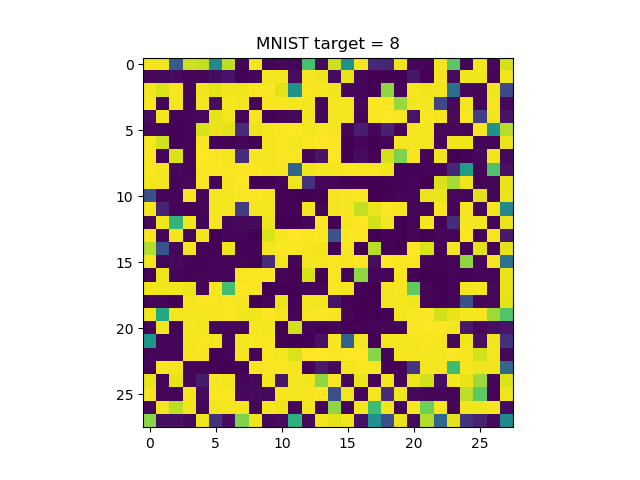

You don't want this - so swap Softmax for Linear.

#### Visualization

Finally, we add some code for the visualizations. It does the following:

- Initializing `ActivationMaximization` with our `model` and the `model_modifier` which swaps Softmax for Linear.
- Generating a random seed for each activation, to ensure that its initialization is not biased.
- Generate the activations with `visualize_activation` and our self-defined `loss` function, the `seed_input` seeds and using 512 steps. The latter is recommended by `tf-keras-vis` docs for "generating good images".
- Finally, converting the activations into images, and visualizing them.

```
# Initialize Activation Maximization
visualize_activation = ActivationMaximization(model, model_modifier)

# Generate a random seed for each activation
seed_input = tensorflow.random.uniform((10, 28, 28, 1), 0, 255)

# Generate activations and convert into images
activations = visualize_activation(loss, seed_input=seed_input, steps=512)
images = [activation.astype(np.float32) for activation in activations]

# Visualize each image
for i in range(0, len(images)):
  visualization = images[i].reshape(28,28)
  plt.imshow(visualization)
  plt.title(f'MNIST target = {i}')
  plt.show()
```

### Class visualizations

Now, let's take a look what happens when we run our model. Obviously, it will first train for 25 epochs and will likely achieve a very high accuracy in the range of 99%. Subsequently, it will start outputting plots one by one.

And surprisingly, they are quite interpretable for humans! We can recognize numbers - especially 0, 1, 8 and 9 . Really cool! 😎

- [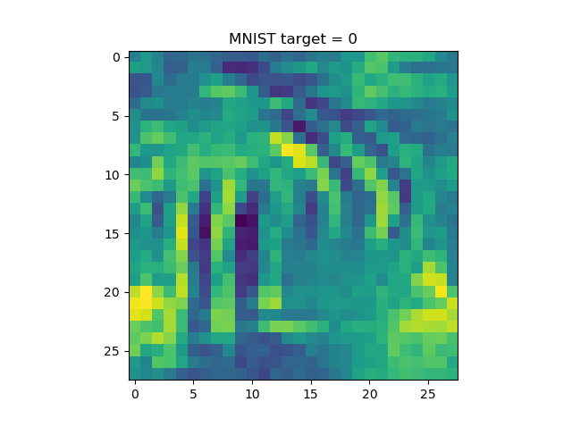](https://www.machinecurve.com/wp-content/uploads/2021/03/0.png)
    
- [](https://www.machinecurve.com/wp-content/uploads/2021/03/1.png)
    
- [](https://www.machinecurve.com/wp-content/uploads/2021/03/2.png)
    
- [](https://www.machinecurve.com/wp-content/uploads/2021/03/3.png)
    
- [](https://www.machinecurve.com/wp-content/uploads/2021/03/4.png)
    
- [](https://www.machinecurve.com/wp-content/uploads/2021/03/5.png)
    
- [](https://www.machinecurve.com/wp-content/uploads/2021/03/6.png)
    
- [](https://www.machinecurve.com/wp-content/uploads/2021/03/7.png)
    
- [](https://www.machinecurve.com/wp-content/uploads/2021/03/8.png)
    
- [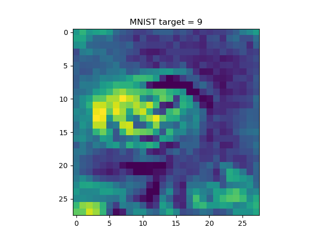](https://www.machinecurve.com/wp-content/uploads/2021/03/9.png)
    

### Why swapping Softmax is necessary

You already saw what happened when you don't swap Softmax for linear. However, for the sake of completeness, this is what you'll get for every class when you _don't_ swap Softmax:

- [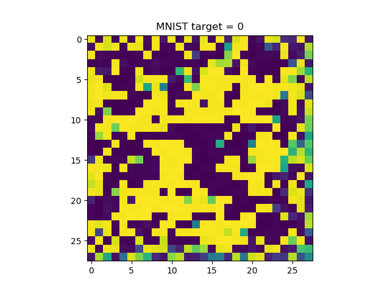](https://www.machinecurve.com/wp-content/uploads/2019/11/0-2.png)
    
- [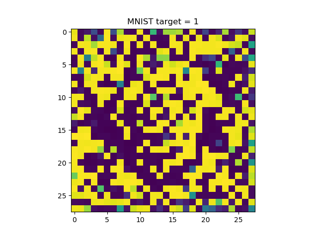](https://www.machinecurve.com/wp-content/uploads/2019/11/1-2.png)
    
- [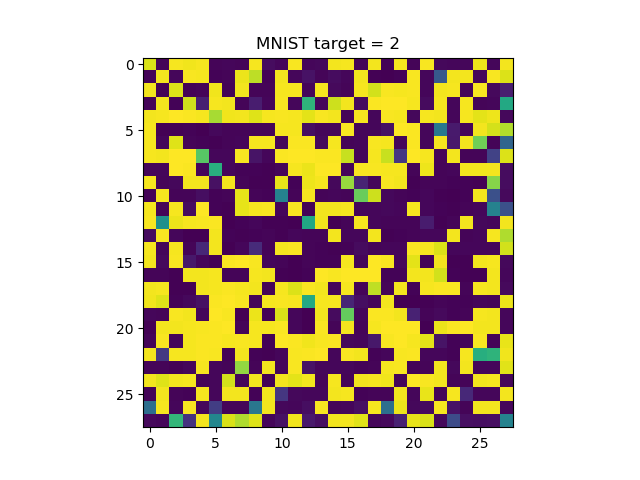](https://www.machinecurve.com/wp-content/uploads/2019/11/2-2.png)
    
- [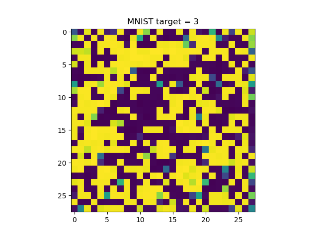](https://www.machinecurve.com/wp-content/uploads/2019/11/3-2.png)
    
- [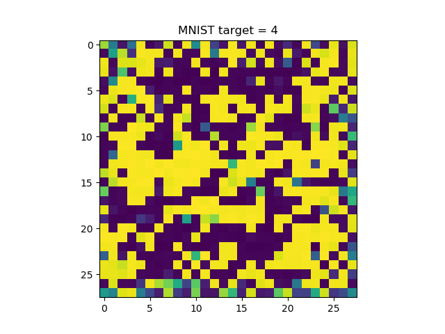](https://www.machinecurve.com/wp-content/uploads/2019/11/4-2.png)
    
- [](https://www.machinecurve.com/wp-content/uploads/2019/11/5-2.png)
    
- [](https://www.machinecurve.com/wp-content/uploads/2019/11/6-2.png)
    
- [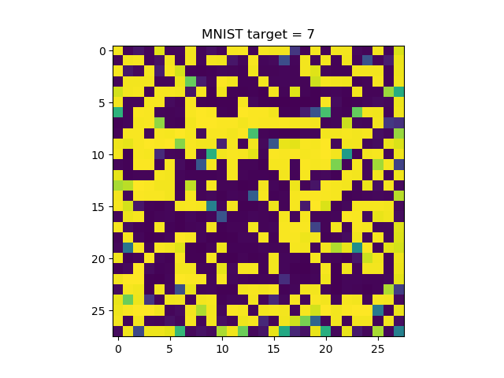](https://www.machinecurve.com/wp-content/uploads/2019/11/7-2.png)
    
- [](https://www.machinecurve.com/wp-content/uploads/2019/11/8-2.png)
    
- [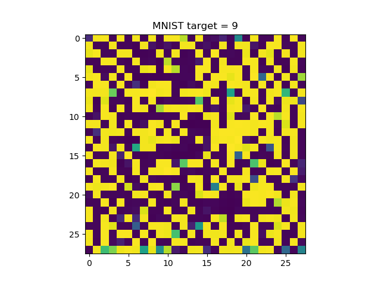](https://www.machinecurve.com/wp-content/uploads/2019/11/9-2.png)
    

* * *

## Visualizing Keras CNN CIFAR10 inputs

Let's now see what happens when we perform the same operation with the CIFAR10 dataset. We train the same model, once for 25 epochs and once for 100 epochs, and hope that our visualizations somewhat resemble the objects in the dataset.

This is a random selection from CIFAR10:

[](https://www.machinecurve.com/wp-content/uploads/2019/11/cifar10_images.png)

This is the code used for CIFAR10 visualization. It is really similar to the MNIST one above, so take a look there for explanations:

```
'''
  Visualizing how layers represent classes with keras-vis Activation Maximization.
'''

# =============================================
# Model to be visualized
# =============================================
import tensorflow
from tensorflow.keras.datasets import cifar10
from tensorflow.keras.models import Sequential
from tensorflow.keras.layers import Dense, Dropout, Flatten
from tensorflow.keras.layers import Conv2D, MaxPooling2D
from tensorflow.keras import activations
import numpy as np

# Model configuration
img_width, img_height = 32, 32
batch_size = 250
no_epochs = 1
no_classes = 10
validation_split = 0.2
verbosity = 1

# Load CIFAR-10 dataset
(input_train, target_train), (input_test, target_test) = cifar10.load_data()

# Reshape data
input_train = input_train.reshape(input_train.shape[0], img_width, img_height, 3)
input_test = input_test.reshape(input_test.shape[0], img_width, img_height, 3)
input_shape = (img_width, img_height, 3)

# Parse numbers as floats
input_train = input_train.astype('float32')
input_test = input_test.astype('float32')

# Convert them into black or white: [0, 1].
input_train = input_train / 255
input_test = input_test / 255

# Convert target vectors to categorical targets
target_train = tensorflow.keras.utils.to_categorical(target_train, no_classes)
target_test = tensorflow.keras.utils.to_categorical(target_test, no_classes)

# Create the model
model = Sequential()
model.add(Conv2D(32, kernel_size=(3, 3), activation='relu', input_shape=input_shape))
model.add(MaxPooling2D(pool_size=(2, 2)))
model.add(Dropout(0.25))
model.add(Flatten())
model.add(Dense(256, activation='relu'))
model.add(Dense(no_classes, activation='softmax', name='visualized_layer'))

# Compile the model
model.compile(loss=tensorflow.keras.losses.categorical_crossentropy,
              optimizer=tensorflow.keras.optimizers.Adam(),
              metrics=['accuracy'])

# Fit data to model
model.fit(input_train, target_train,
          batch_size=batch_size,
          epochs=no_epochs,
          verbose=verbosity,
          validation_split=validation_split)

# Generate generalization metrics
score = model.evaluate(input_test, target_test, verbose=0)
print(f'Test loss: {score[0]} / Test accuracy: {score[1]}')

# =============================================
# Activation Maximization code
# =============================================
from tf_keras_vis.activation_maximization import ActivationMaximization
import matplotlib.pyplot as plt

def loss(output):
  return (output[0, 0], output[1, 1], output[2, 2], output[3, 3], output[4, 4], output[5, 5], output[6, 6], output[7, 7], output[8, 8], output[9, 9])

def model_modifier(m):
    m.layers[-1].activation = tensorflow.keras.activations.linear

# Initialize Activation Maximization
visualize_activation = ActivationMaximization(model, model_modifier)

# Generate a random seed for each activation
seed_input = tensorflow.random.uniform((10, 28, 28, 3), 0, 255)

# Generate activations and convert into images
activations = visualize_activation(loss, seed_input=seed_input, steps=512, input_range=(30,150))
images = [activation.astype(np.float32) for activation in activations]

# Define classes
classes = {
  0: 'airplane',
  1: 'automobile',
  2: 'bird',
  3: 'cat',
  4: 'deer',
  5: 'dog',
  6: 'frog',
  7: 'horse',
  8: 'ship',
  9: 'truck'
}

# Visualize each image
for i in range(0, len(images)):
  visualization = images[i]
  plt.imshow(visualization, cmap='gray')
  plt.title(f'CIFAR10 target = {classes[i]}')
  plt.show()
```

### Visualizations at 25 epochs

At 25 epochs, it's possible to detect the shapes of the objects very vaguely - I think this is especially visible at automobiles, deer, horses and trucks.

- [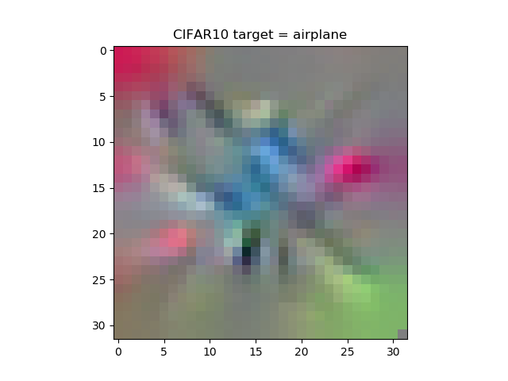](https://www.machinecurve.com/wp-content/uploads/2019/11/airplane.png)
    
- [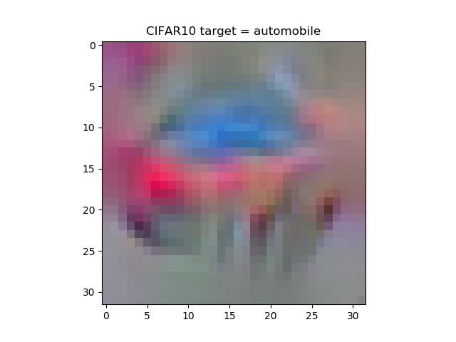](https://www.machinecurve.com/wp-content/uploads/2019/11/automobile.png)
    
- [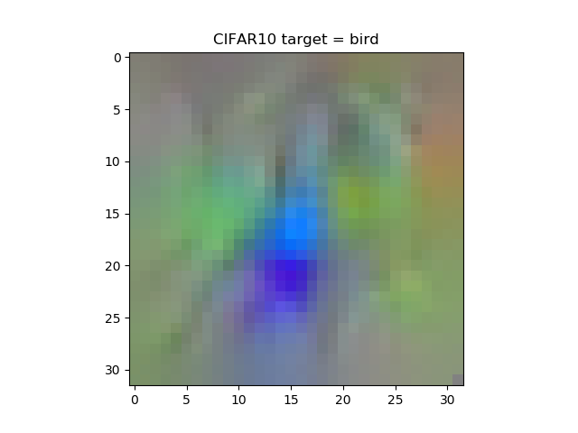](https://www.machinecurve.com/wp-content/uploads/2019/11/bird.png)
    
- [](https://www.machinecurve.com/wp-content/uploads/2019/11/cat.png)
    
- [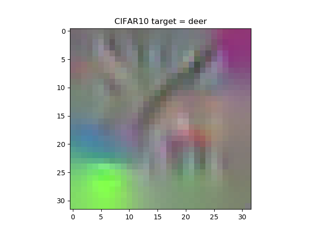](https://www.machinecurve.com/wp-content/uploads/2019/11/deer.png)
    
- [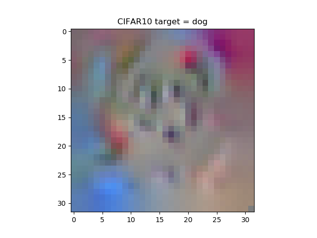](https://www.machinecurve.com/wp-content/uploads/2019/11/dog.png)
    
- [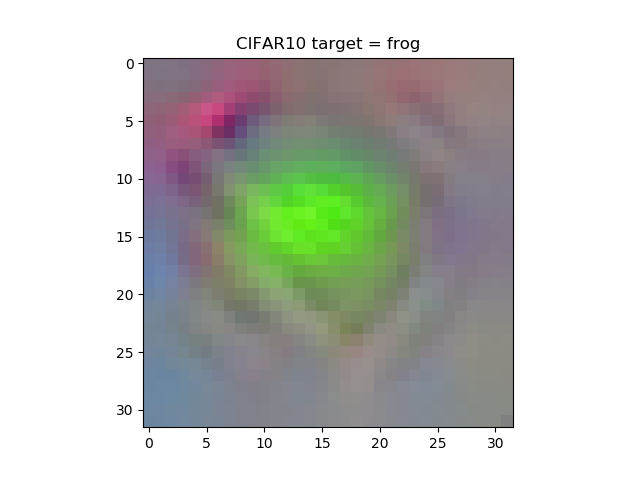](https://www.machinecurve.com/wp-content/uploads/2019/11/frog.png)
    
- [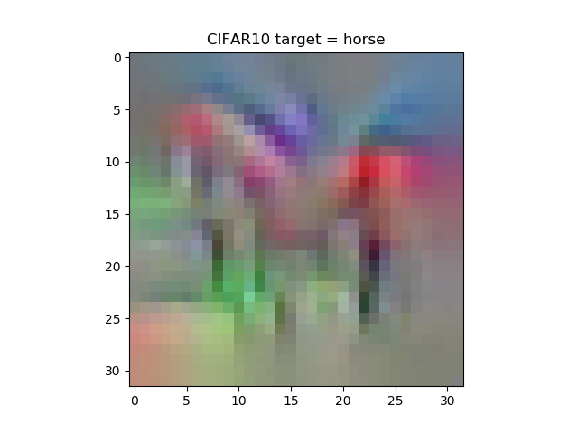](https://www.machinecurve.com/wp-content/uploads/2019/11/horse.png)
    
- [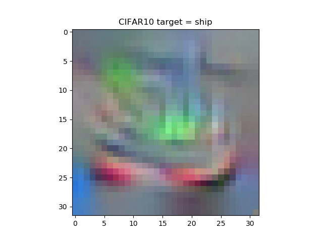](https://www.machinecurve.com/wp-content/uploads/2019/11/ship.png)
    
- [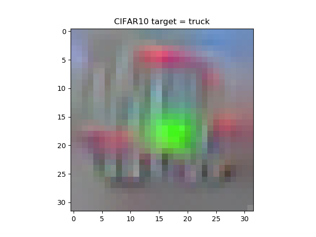](https://www.machinecurve.com/wp-content/uploads/2019/11/truck.png)
    

### Visualizations at 100 epochs

At 100 epochs, the model specified above is overfitting quite severely - but nevertheless, these are the visualizations:

- [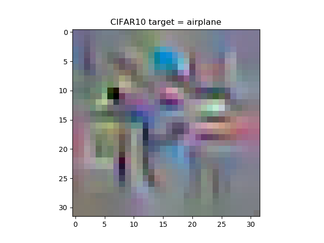](https://www.machinecurve.com/wp-content/uploads/2019/11/airplane-1.png)
    
- [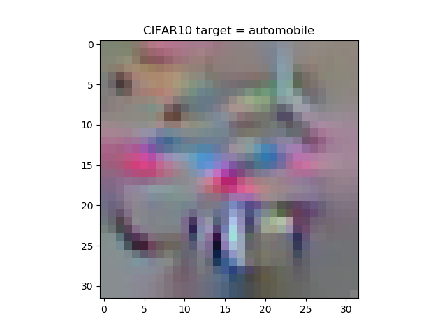](https://www.machinecurve.com/wp-content/uploads/2019/11/automobile-1.png)
    
- [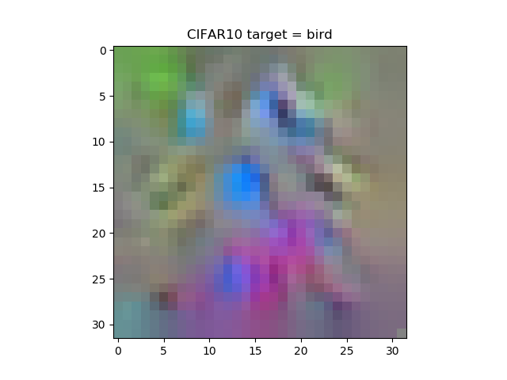](https://www.machinecurve.com/wp-content/uploads/2019/11/bird-1.png)
    
- [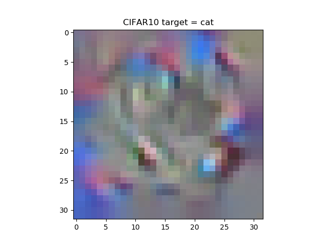](https://www.machinecurve.com/wp-content/uploads/2019/11/cat-1.png)
    
- [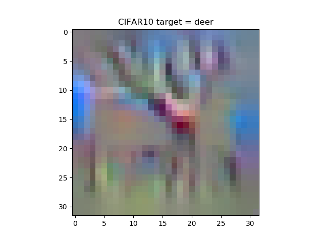](https://www.machinecurve.com/wp-content/uploads/2019/11/deer-1.png)
    
- [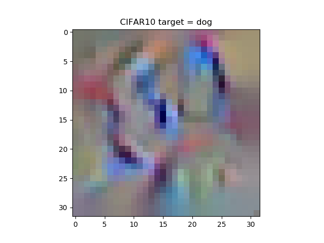](https://www.machinecurve.com/wp-content/uploads/2019/11/dog-1.png)
    
- [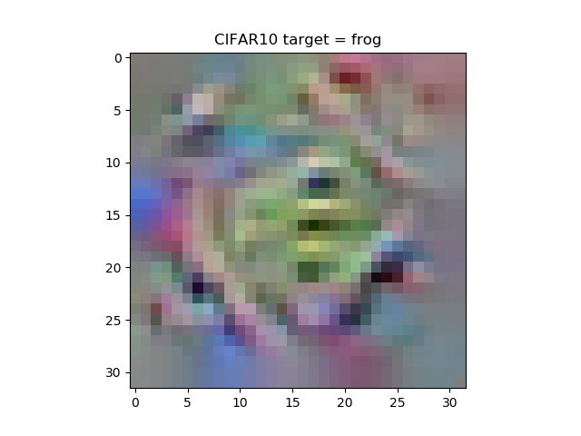](https://www.machinecurve.com/wp-content/uploads/2019/11/frog-1.png)
    
- [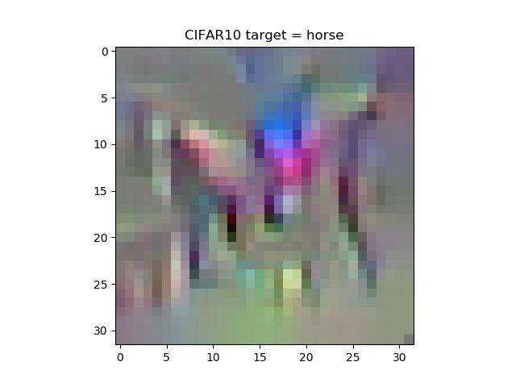](https://www.machinecurve.com/wp-content/uploads/2019/11/horse-1.png)
    
- [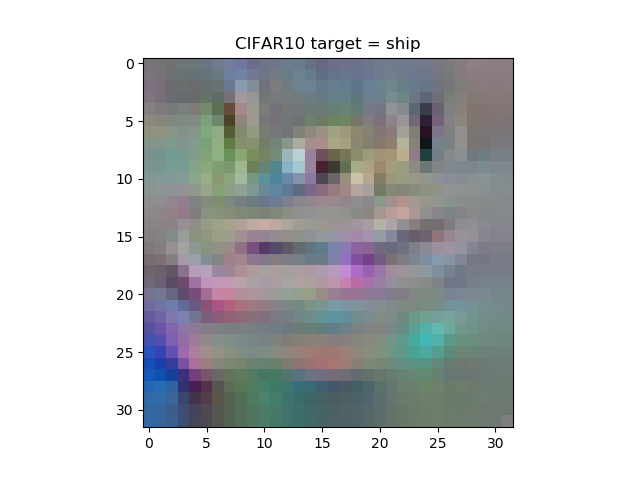](https://www.machinecurve.com/wp-content/uploads/2019/11/ship-1.png)
    
- [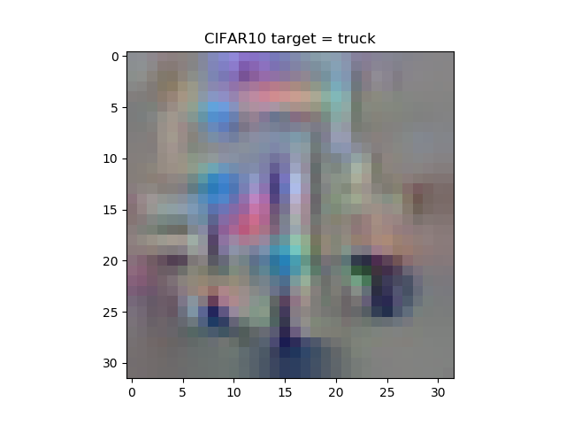](https://www.machinecurve.com/wp-content/uploads/2019/11/truck-1.png)
    

Primarily, they have become 'sharper' - but not necessarily more detailed. Well, this is already questionable at first for a 32x32 pixel image, but also shows that you should not expect _magic_ to happen, despite the possible advantages of methods like activation maximization.

* * *

## Summary

In this blog post, we studied what Activation Maximization is and how you can visualize the 'best inputs' for your CNN classes with `tf-keras-vis`, i.e., with TensorFlow 2 based Keras. Activation Maximization helps you in understanding what happens within your model, which may help you to find hidden biases that - when removed - really improve the applicability of your machine learning model.

I hope you've learnt something today - for me, it was really interesting to see how it's possible to visualize the model's black box! 😊 If you have any questions, remarks, or other comments, feel free to leave a comment below 👇 I will try to respond as soon as possible.

Thanks for reading MachineCurve and happy engineering! 😎

* * *

## References

GitHub. (2021). _Keisen/tf-keras-vis_. [https://github.com/keisen/tf-keras-vis](https://github.com/keisen/tf-keras-vis)

Kotikalapudi, Raghavendra and contributors. (2017). Github / keras-vis. Retrieved from [https://github.com/raghakot/keras-vis](https://github.com/raghakot/keras-vis)

Valverde, J. M. (2018, June 18). Introduction to Activation Maximization and implementation in Tensorflow. Retrieved from [http://laid.delanover.com/introduction-to-activation-maximization-and-implementation-in-tensorflow/](http://laid.delanover.com/introduction-to-activation-maximization-and-implementation-in-tensorflow/)

Gehrmann, S., Strobelt, H., Kruger, R., Pfister, H., & Rush, A. M. (2019). Visual Interaction with Deep Learning Models through Collaborative Semantic Inference. _IEEE Transactions on Visualization and Computer Graphics_, 1-1. [doi:10.1109/tvcg.2019.2934595](https://arxiv.org/abs/1907.10739)
