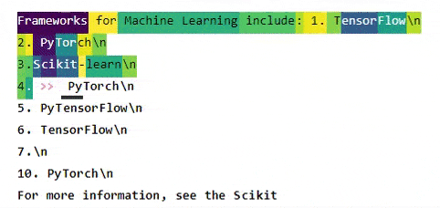
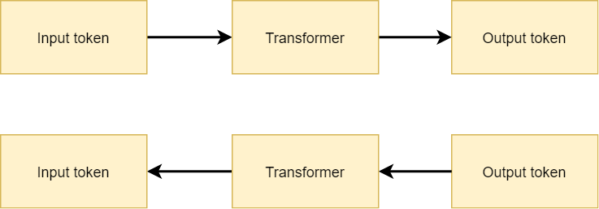

These days, Transformer based architectures are taking the world of Natural Language Processing by storm. What's more, even more recently, they have also blended the fields of NLP and Computer Vision - with approaches like the Visual Transformer and the DeIT architecture.

In other words, we can expect many new developments emerge from these fields in the years to come.

But as with any Machine Learning field, it is not only important to know that your model works - but you must also ensure that you know _**why**_ it works. For example, if you are building a binary classifier that classifies between dogs and cats, you cannot be sure that it's the animal it decides on whether you have a snowy background with many of the dogs, while using indoor pictures with the cats.

Fortunately, these days, many Machine Learning practitioners build great stuff _and_ release it as open source packages. That's why we can say hello to **Ecco**, which was created by [Jay Alammar](https://jalammar.github.io/). It can be used for interpreting the outputs of (language based) Transformers. Built on top of HuggingFace Transformers and using PyTorch, it will be useful to a wide audience.



Visualizing the outputs of a Transformer 🤗 Really cool!

Currently, two methods for visualizing how a Transformer works are supported. Relatively similar to the [saliency maps](https://www.machinecurve.com/index.php/2019/11/25/visualizing-keras-cnn-attention-saliency-maps/) that we know from ConvNets, Ecco can compute the importance of input tokens for the predicted output token, something known as **input saliency**. In addition, it's capable of visualizing how the neurons in Transformer networks activate using **neuron activation**.

In this tutorial, we will be looking at Ecco in more detail. After reading it, you will...

- Have a bit of background knowledge about Transformers and Model Interpretability.
- Know what Ecco is all about.
- Have built a Transfomer visualization using input saliency and neuron activations.

Let's go! 🤗🚀

* * *

\[toc\]

* * *

## Visualizing Transformer models: summary and code examples

- Transformer models are taking the world by storm. With the emergence of models like BERT, GPT-2 and GPT-3, the field of NLP is making a lot of progress. In fact, a few breakthroughs are spilling over into the world of Computer Vision these days, with the emergence of Transformers there as well.
- As with any deep learning model, interpretability is an important thing for model evaluation. If we don't understand the model, how can we ensure that it can be used without adverse events occurring?
- [Ecco](https://github.com/jalammar/ecco) is a library that can be used for visualizing the behavior of your Transformer model. In this tutorial, we'll take a look at what Ecco is, how it works and how it can be used.
- First, we take a look at two ready-to-use code examples for using Ecco for generating input saliency and neuron activation visualizations.

### Visualizing the importance of the input tokens when predicting an output token

```
import ecco

# Load pretrained DistilGPT2 and capture neural activations
lm = ecco.from_pretrained('distilgpt2', activations=True)

# Input text

text = "Frameworks for Machine Learning include: 1. TensorFlow\n2. PyTorch\n3.Scikit-learn\n4."

# Generate 35 tokens to complete the input text.
output = lm.generate(text, generate=35, do_sample=True)

# To view the input saliency
output.saliency()
```

### Visualizing what's going on inside the Transformer during prediction

```
import ecco

# Load pretrained DistilGPT2 and capture neural activations
lm = ecco.from_pretrained('distilgpt2', activations=True)

# Input text

text = "Frameworks for Machine Learning include: 1. TensorFlow\n2. PyTorch\n3.Scikit-learn\n4."

# Perform NMF
nmf = output.run_nmf(n_components=10) 
nmf.explore()
```

* * *

## Transformers and Model Interpretability

In the field of Machine Learning, **Transformer architectures** are currently very prominent. Having been around since 2017 after a breakthrough paper by Vaswani et al., the field of NLP - classically relying on recurrent neural networks - saw that recurrent segments were not necessary for achieving state-of-the-art performance on a variety of language tasks.

Since then, we have seen many Transformer based architectures dominate progress in Natural Language Processing, among which are BERT, GPT-2 and GPT-3. Now, recently, Transformers have even been adapted to the computer vision domain. With the Visual Transformer and the DeIT Transformer, it even becomes possible to use Conv-free classifiers for relatively state-of-the-art performance on vision tasks. They work even in the area in between these fields: with DALL-E, we can generate images based on textual inputs.

The original Transformer architecture works by combining an **encoder segment** and a **decoder segment**. Using a technique called multi-head attention and using it many times over, inputs can be converted in some hidden representation and subsequently into an output token. This way, we can e.g. perform Neural Machine Translation. Even Google Search is now primarily running on BERT for performing its natural language understanding.

Speaking about BERT, which is an extension to the original work by Vaswani et al., we must say that recently work on Transformers has split into an encoder vs. decoder battle. Despite some approaches which attempt to bridge the gap (e.g. BART), the GPT camp argues that models must be autoregressive and hence use the decoder segment when performing language generation, whereas the BERT camp argues that the _masked_ attention segment in the decoder unnecessarily limits the model when used for language understanding.

Let's see where things are going with Transformers in the months and years ahead.


The original Transformer architecture, as proposed by Vaswani et al. (2017)

Another field in Machine Learning that is gaining a lot of traction in the past few years is the field of **Model Interpretability.** Machine learning models have drawn a lot of attention, and this attention was both positive and negative.

While positive attention focused on the possible benefits of Machine Learning and how it could achieve a significant impact within company operations (by finding patterns that previously remained hidden in large datasets available within your organization), negative attention tended to argue that using a Machine Learning model is equal to using a black box.

And there lies truth in both stories. While people can be overconfident about AI's impact, it's not exactly a black box, either: today, [many model visualization approaches](https://www.machinecurve.com/index.php/2019/12/03/visualize-keras-models-overview-of-visualization-methods-tools/) have been made available that can give insight in _why_ a model performs in a certain way.

Today, this is even true for Transformer based models. Let's take a look at Ecco!

* * *

## Introducing Ecco


Wouldn't it be cool if we can visualize what is happening in a Transformer based language model?

It would greately help our understanding of such models and allow us to track spurious predictions in order to find out what is going wrong.

Let's introduce **[Ecco](https://github.com/jalammar/ecco)**, an open source (BSD-3) library that can be used on top of HuggingFace Transformers an PyTorch for understanding your NLP model. Created by Jay Alammar, a ML research engineer currently focused on NLP, it's a really cool library to work with.

> Ecco is a python library for explaining Natural Language Processing models using interactive visualizations.
> 
> Alammar (2021)

Let's take a look at it quickly!

* * *

## Visualizing your NLP model with Ecco

Currently, Ecco supports two methods for visualizing your language model:

- Using **input saliency**, we can determine the importance of any input token for generating a prediction. In other words, we can look back and see what words have contributed to the word that has just been predicted. This way, we can visualize interrelationships between words in sentences.
- Using **neuron activations**, we can identify the parts of the densely-connected (feedforward) layers in a Transformer architecture that fire when generating predictions for new tokens.

While strictly working with all kinds of language models, it works best when the model is autoregressive (Alammar, 2021).

### Installing Ecco

Installing Ecco is really easy. There are two prerequisites to installing Ecco: you must have PyTorch installed ([howto here](https://pytorch.org/get-started/locally/)) and also HuggingFace Transformers ([here](https://github.com/huggingface/transformers)) is required, although Ecco seems to install the latter during the installation process if it's not available on your system.

Performing the installation itself then equals the execution of just one command:

```
pip install ecco
```

* * *

## Visualizing token importance: input saliency

If you've been a frequent reader of this website, you know that we have written another article about [visualizing attention of a ConvNet](https://www.machinecurve.com/index.php/2019/11/25/visualizing-keras-cnn-attention-saliency-maps/) with saliency maps. Such maps were defined as follows:

> In computer vision, a saliency map is an image that shows each pixel‘s unique quality.
> 
> Wikipedia (2015)

Indeed, we could use them to visualize the parts of an input image that were most important to a Convolutional Neural Network in generating a prediction. Fortunately, in this case, it's the frog, and not the background!


### How input saliency works

If you are familiar with how a neural network works, understanding the workings of input saliency is not difficult. First recall that training a neural network involves a forward pass, where an input token is fed forward through the model - i.e. the Transformer - after which an output prediction is generated.

This forward pass results in a loss value which is then used for computing gradients with backpropagation and subsequent optimization with gradient descent or another optimizer. In other words, the forward pass is followed by a backward pass.



Forward and backward pass, i.e. optimizing a neural network

With input saliency, the question we're asking is exactly the opposite one. In the case above we want to know how the input needs to change with respect to a desired change in the outputs (in our case, the difference between predicted and expected values, or the loss). Input saliency, on the other hand, means understanding the change in _output_ with respect to a change in _input_ values.

Or, in plainer English, if we know which input value changes the output the most, we know the rudimentary pixel (or in this case, the token) value which contributes most significantly. After multiplying the resulting gradient with the input embedding of the token, and taking the L2 norm, we know the input salience of every particular token.


With input saliency, the process is in the opposite direction.

### Example text

Generating the **input saliency** map for input tokens of a text is really easy. With Ecco, we can use any pretrained language model (note again that in the current version autoregressive models are the primary focus) available within HuggingFace Transformers.

For example, let's allow the `distilgpt2` model to further predict based on the following text:

_Frameworks for Machine Learning include:_

1. _TensorFlow_
2. _PyTorch_
3. _Scikit-learn_

### Code

We can do so with the following code, which loads the pretrained `distilgpt2` model into Ecco using `transformers`, performs generation of 35 more tokens using the input text, and views input saliency. Run this in a [Jupyter Notebook](https://www.machinecurve.com/index.php/2020/10/07/easy-install-of-jupyter-notebook-with-tensorflow-and-docker/):

```
import ecco

# Load pretrained DistilGPT2 and capture neural activations
lm = ecco.from_pretrained('distilgpt2', activations=True)

# Input text

text = "Frameworks for Machine Learning include: 1. TensorFlow\n2. PyTorch\n3.Scikit-learn\n4."

# Generate 35 tokens to complete the input text.
output = lm.generate(text, generate=35, do_sample=True)

# To view the input saliency
output.saliency()
```

### Output

You will then get the following output:


It shows the output of the DistilGPT2 Transformer as well as the saliency for generating the first token, which is underlined as Py. GPT2 seems to have some difficulty recognizing that PyTorch was already mentioned before, and funnily even thinks that PyTorch and TensorFlow will merge in the future, but well... that's not in scope for today's article.

You can use your mouse to see which previous tokens were most important for generating the one under inspection.


### Observations

Some observations:

- The words **Frameworks** and **Machine Learning** keep getting highlighted all the time, meaning that GPT-2 understands that all these libraries are related to Machine Learning.
- When the token **Torch** is highlighted, the model understands that it is highly related to _Py_.
- The same is true for **Flow** in this context, for which _Tensor_ is very salient.
- All future references of **Scikit** mostly refer back to the original reference of that library.

It's really cool that we can analyze a Transformer model in such a visual way!

* * *

## Visualizing neuron activations

While input saliency tells you something about the _external factors_ of your Transformer model, **neuron activations** tell you what is happening inside the neural network. More specifically, it tells you what is happening in the feedforward subsegments of each Transformer block.

This functionality essentially 'groups' together inputs - in components - that cause same regions in the Dense classifier to fire. This can provide interesting insights about the behavior of your Transformer model.

Let's take a look at how this works in more detail.

### Code

We can visualize the neuron activations in the following way. Here, `n_components` describes the number of groups that we want to construct.

```
import ecco

# Load pretrained DistilGPT2 and capture neural activations
lm = ecco.from_pretrained('distilgpt2', activations=True)

# Input text

text = "Frameworks for Machine Learning include: 1. TensorFlow\n2. PyTorch\n3.Scikit-learn\n4."

# Perform NMF
nmf = output.run_nmf(n_components=10) 
nmf.explore()
```

### Observations

After running the DistilGPT2 model, the output of the neuron activations in that particular case looks like this:


Output of Transformer neuron activations

We can derive some interesting insights here:

1. In the predicted part (i.e. after _4._), all numbers belong to the same group. The same is true for the numbers in the provided part. DistilGPT2 for some reason does not consider these to be part of the same sequence.
2. In many cases, the capital letters of a word in the list are estimated to belong to the same group, and the same is true for the first few tokens after the capital letter.
3. It's difficult to see a pattern in the newline characters `\n`.

As you can see, breaking into the black box is now also possible with Transformer models! 😎

* * *

## Summary

Transformers are taking the world of NLP by storm, and have also been introduced to the field of Computer Vision recently. However, visualizing the behavior of Transformer models is difficult, and is in its infancy today, while the need for interpretable models is high.

In this tutorial, we introduced Ecco, a new library for visualizing the behavior of your Transformer model. With Ecco, we can visualize Transformer behavior in two ways. The first is **input saliency**, or the importance of the input tokens in predicting a particular output value. The second is **neuron activations**, which groups the neurons in the feedforward segment(s) of your Transformer into a predefined amount of components, allowing you to see _within_ the model as well.

Using the code examples, we have also demonstrated how Ecco can be used for visualizing your Transformer language model.

[Ask a question](https://www.machinecurve.com/index.php/add-machine-learning-question/)

I hope that you have learned something from this tutorial! 😎 If you did, please feel free to leave a message in the comments section. Please do the same if you have any questions, or click the **Ask Questions** button on the right.

Thank you for reading MachineCurve today and happy engineering!

* * *

## References

Vaswani, A., Shazeer, N., Parmar, N., Uszkoreit, J., Jones, L., Gomez, A. N., … & Polosukhin, I. (2017). [Attention is all you need](https://arxiv.org/abs/1706.03762). _Advances in neural information processing systems_, _30_, 5998-6008.

Alammar, J. (2021). _Jalammar/ecco_. GitHub. [https://github.com/jalammar/ecco](https://github.com/jalammar/ecco)

Wikipedia. (2015, December 3). Saliency map. Retrieved from [https://en.wikipedia.org/wiki/Saliency\_map](https://en.wikipedia.org/wiki/Saliency_map)
