When you're training a neural network, you're learning a mapping from some input value to a corresponding expected output value. This is great, because it allows you to create predictive models, but who guarantees that the _mapping_ is correct for the data points that aren't part of your data set?

That is, how do you ensure that your learnt mapping does not oscillate very heavily if you want a smooth function instead?

Regularization can help here. With techniques that take into account the complexity of your weights during optimization, you may steer the networks towards a more general, but scalable mapping, instead of a very data-specific one.

In this blog, we cover these aspects. First, we'll discuss the need for regularization during model training. We then continue by showing how regularizers can be added to the loss value, and subsequently used in optimization. This is followed by a discussion on the three most widely used regularizers, being L1 regularization (or Lasso), L2 regularization (or Ridge) and L1+L2 regularization (Elastic Net). Finally, we provide a set of questions that may help you decide which regularizer to use in your machine learning project.

Are you ready? Let's go! 😎

* * *

\[toc\]

* * *

## The need for regularization during model training

When you are training a machine learning model, at a high level, you're learning a function \[latex\]\\hat{y}: f(x) \[/latex\] which transforms some _input_ value \[latex\]x\[/latex\] (often a vector, so \[latex\]\\textbf{x}\[/latex\]) into some output value \[latex\]\\hat{y}\[/latex\] (often a scalar value, such as a class when classifying and a real number when regressing). \\

Contrary to a regular mathematical function, the exact mapping (to \[latex\]y\[/latex\]) is not known in advance, but is learnt based on the input-output mappings present in your training data (so that \[latex\]\\hat{y} \\approx y\[/latex\] - hence the name, machine learning :)

This understanding brings us to the need for regularization.

### Complex mappings vs simple mappings

Say that you've got a dataset that contains points in a 2D space, like this small one:

[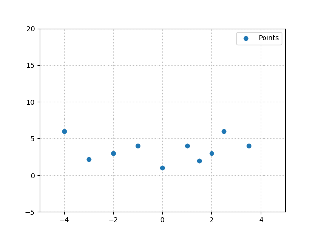](https://www.machinecurve.com/wp-content/uploads/2020/01/points.png)

Now suppose that these numbers are reported by some bank, which loans out money (the values on the x axis in $ of dollars). This has an impact on the weekly cash flow within a bank, attributed to the _loan_ and other factors (together represented by the y values).

The bank suspects that this interrelationship means that it can predict its cash flow based on the amount of money it spends on new loans. In practice, this relationship is likely much more complex, but that's not the point of this thought exercise.

Machine learning is used to generate a predictive model - a regression model, to be precise, which takes some input (amount of money loaned) and returns a real-valued number (the expected impact on the cash flow of the bank).

After training, the model is brought to production, but soon enough the bank employees find out that it doesn't work. Upon analysis, the bank employees find that the actual _function_ learnt by the machine learning model is this one:

[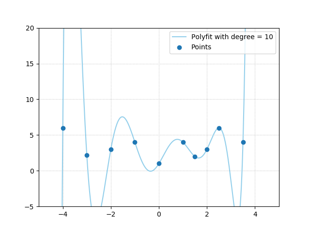](https://www.machinecurve.com/wp-content/uploads/2020/01/poly_large.png)

The employees instantly know why their model does not work, using nothing more than common sense:

**The function is way too extreme for the data**. It's nonsense that if the bank would have spent $2.5k on loans, returns would be $5k, and $4.75k for $3.5k spendings, but minus $5k and counting for spendings of $3.25k.

They'd rather have wanted something like this:

[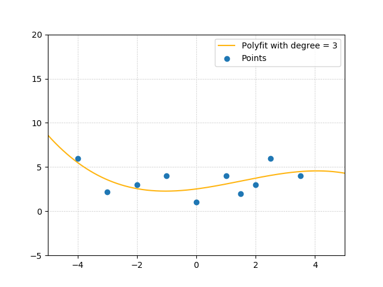](https://www.machinecurve.com/wp-content/uploads/2020/01/poly_small.png)

Which, as you can see, makes a lot more sense:

[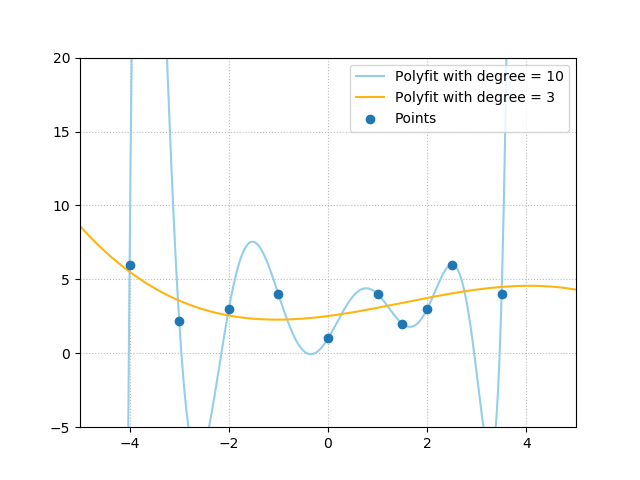](https://www.machinecurve.com/wp-content/uploads/2020/01/poly_both.png)

### On training machine learning models

But how do we get there?

The two functions are generated based on the same data points, aren't they?

For me, it was simple, because I used a `polyfit` on the data points, to generate either a polynomial function of the third degree or one of the tenth degree. Obviously, the one of the tenth produces the wildly oscillating function.

Machine learning however does not work this way. Besides not even having the certainty that your ML model will learn the mapping correctly, you also don't know if it will learn a highly specialized mapping or a more generic one.

Or can you? Let's explore a possible route.

From our article about [loss and loss functions](https://www.machinecurve.com/index.php/2019/10/04/about-loss-and-loss-functions/), you may recall that a supervised model is trained following the high-level supervised machine learning process:

- Training data is fed to the network in a feedforward fashion.
- The predictions generated by this process are stored, and compared to the actual targets, or the "ground truth".
- The difference between the predictions and the targets can be computed and is known as the loss value.
- Through computing gradients and subsequent [gradient based optimization techniques](https://www.machinecurve.com/index.php/2019/10/24/gradient-descent-and-its-variants/), the weights of your neural network can be adapted, possibly improving the model.

This means that optimizing a model equals minimizing the loss function that was specified for it.

### Loss based regularization

You can imagine that if you train the model for too long, minimizing the loss function is done based on loss values that are entirely adapted to the dataset it is training on, generating the highly oscillating curve plot that we've seen before.

This is not what you want. However, you also don't know exactly _the point where you should stop_.

This is why you may wish to add a regularizer to your neural network.

Regularizers, which are attached to your _loss value_ often, induce a penalty on large weights or weights that do not contribute to learning. This way, we may get sparser models and weights that are not too adapted to the data at hand. If done well, adding a regularizer should result in models that produce better results for data they haven't seen before.

Let's take a look at some foundations of regularization, before we continue to the actual regularizers.

* * *

## For starters: a little bit of foundation

Before we do so, however, we must first deepen our understanding of the concept of regularization in conceptual and mathematical terms.

Say, for example, that you are training a machine learning model, which is essentially a function \[latex\]\\hat{y}: f(\\textbf{x})\[/latex\] which maps some input vector \[latex\]\\textbf{x}\[/latex\] to some output \[latex\]\\hat{y}\[/latex\].

From previously, we know that during training, there exists a true target \[latex\]y\[/latex\] to which \[latex\]\\hat{y}\[/latex\] can be compared.

Say that some function \[latex\]L\[/latex\] computes the loss between \[latex\]y\[/latex\] and \[latex\]\\hat{y}\[/latex\] (or \[latex\]f(\\textbf{x})\[/latex\]). For one sample \[latex\]\\textbf{x}\_i\[/latex\] with corresponding target \[latex\]y\_i\[/latex\], loss can then be computed as \[latex\]L(\\hat{y}\_i, y\_i) = L(f(\\textbf{x}\_i), y\_i)\[/latex\].

Total loss can be computed by summing over all the input samples \[latex\]\\textbf{x}\_i ... \\textbf{x}\_n\[/latex\] in your training set, and subsequently performing a minimization operation on this value:

\[latex\]\\min\_f \\sum\_{i=1}^{n} L(f(\\textbf{x}\_i), y\_i) \[/latex\]

### Adding a regularizer

Before, we wrote about regularizers that they "are attached to your _loss value_ often". Indeed, adding some regularizer \[latex\]R(f)\[/latex\] - "regularization for some function \[latex\]f\[/latex\]" - is easy:

\[latex\] L(f(\\textbf{x}\_i), y\_i) = \\sum\_{i=1}^{n} L\_{ losscomponent}(f(\\textbf{x}\_i), y\_i) + \\lambda R(f) \[/latex\]

...where \[latex\]\\lambda\[/latex\] is a hyperparameter, to be configured by the machine learning engineer, that determines the relative importance of the regularization component compared to the loss component.

The above means that the loss _and_ the regularization components are minimized, not the loss component alone. Let's take a look at some scenarios:

- If the loss component's value is low but the mapping is not generic enough (a.k.a. overfitting), a regularizer value will likely be high. There is still room for minimization.
- If a mapping is very generic (low regularization value) but the loss component's value is high (a.k.a. underfitting), there is also room for minimization.
- The optimum is found when the model is both as generic and as good as it can be, i.e. when both values are as low as they can possible become.

### Instantiating the regularizer function R(f)

Now, you likely understand that you'll want to have your outputs for \[latex\]R(f)\[/latex\] to minimize as well. But what is this function? What does it look like? It turns out to be that there is a wide range of possible instantiations for the regularizer.

In the machine learning community, three regularizers are very common:

- **L1 Regularization**, also known as Lasso Regularization;
- **L2 Regularization**, also known as Ridge Regularization;
- **L1+L2 Regularization**, also known as Elastic Net Regularization.

Next, we'll cover the three of them.

* * *

## L1 Regularization

**L1 Regularization** (or **Lasso**) adds to so-called L1 Norm to the loss value. A "norm" tells you something about a vector in space and can be used to express useful properties of this vector (Wikipedia, 2004).

The L1 norm of a vector, which is also called the taxicab norm, computes the absolute value of each vector dimension, and adds them together (Wikipedia, 2004). As computing the norm effectively means that you'll travel the full distance from the starting to the ending point for each dimension, adding it to the distance traveled already, the travel pattern resembles that of a taxicab driver which has to drive the blocks of e.g. New York City; hence the name (Wikipedia, 2004).

In terms of maths, this can be expressed as \[latex\] R(f) = \\sum\_f{ \_{i=1}^{n}} | w\_i |\[/latex\], where this is an iteration over the \[latex\]n\[/latex\] dimensions of some vector \[latex\]\\textbf{w}\[/latex\].

Visually, and hence intuitively, the process goes as follows. Suppose that we have this two-dimensional vector \[latex\]\[2, 4\]\[/latex\]:

[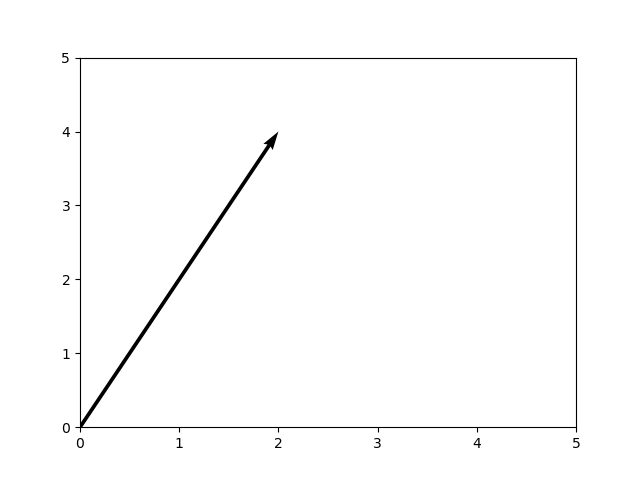](https://www.machinecurve.com/wp-content/uploads/2020/01/empty_vector.png)

...our formula would then produce a computation over two dimensions, for the first:

[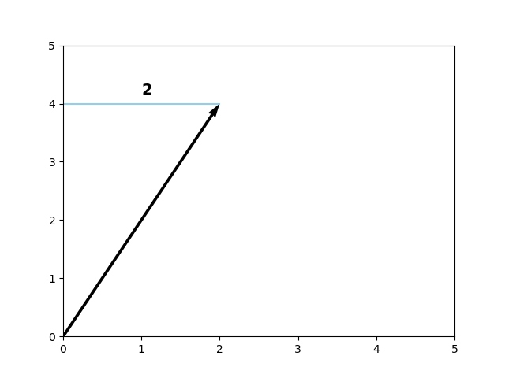](https://www.machinecurve.com/wp-content/uploads/2020/01/taxicab1.png)

Then the second:

[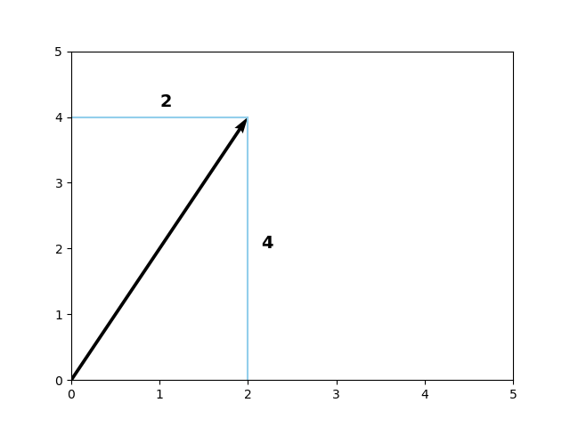](https://www.machinecurve.com/wp-content/uploads/2020/01/taxicab2.png)

The L1 norm for our vector is thus 6, as you can see:

\[latex\] \\sum\_{i=1}^{n} | w\_i | = | 4 | + | 2 | = 4 + 2 = 6\[/latex\]

Adding L1 Regularization to our loss value thus produces the following formula:

\[latex\] L(f(\\textbf{x}\_i), y\_i) = \\sum\_{i=1}^{n} L\_{ losscomponent}(f(\\textbf{x}\_i), y\_i) + \\lambda \\sum\_{i=1}^{n} | w\_i | \[/latex\]

...where \[latex\]w\_i\[/latex\] are the values of your model's weights.

This way, our loss function - and hence our optimization problem - now also includes information about the _complexity_ of our weights.

### On negative vectors

Say we had a negative vector instead, e.g. \[latex\]\[-1, -2.5\]\[/latex\]:

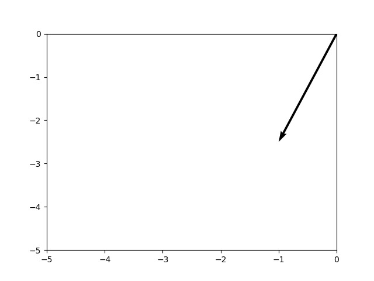

As you can derive from the formula above, L1 Regularization takes some value related to the weights, and adds it to the same values for the other weights. As you know, "some value" is the absolute value of the weight or \[latex\]| w\_i |\[/latex\], and we take it for a reason:

[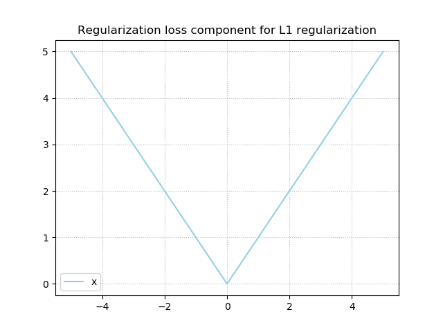](https://www.machinecurve.com/wp-content/uploads/2020/01/l1_component.png)

Taking the absolute value ensures that _negative values_ contribute to the regularization loss component as well, as the sign is removed and only the, well, absolute value remains. This way, L1 Regularization natively supports negative vectors as well, such as the one above.

### On model sparsity

Next up: model sparsity. L1 Regularization produces sparse models, i.e. models where unnecessary features don't contribute to their predictive power, which - as an additional benefit - may also speed up models during inference (Google Developers, n.d.).

But why is this the case? Let's take a closer look (Caspersen, n.d.; Neil G., n.d.).

This is the derivative for L1 Regularization:

[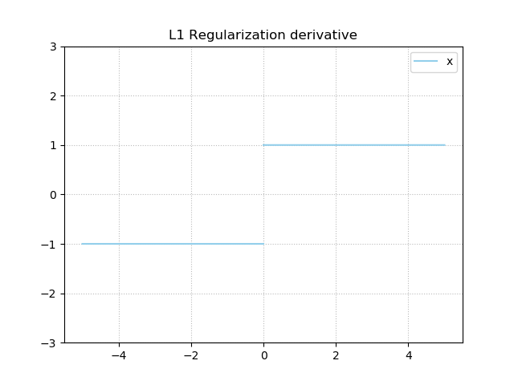](https://www.machinecurve.com/wp-content/uploads/2020/01/l1_deriv.png)

It's either -1 or +1, and is undefined at \[latex\]x = 0\[/latex\].

Now suppose that we have trained a neural network for the first time. We have a loss value which we can use to compute the weight change. Obviously, this weight change will be computed with respect to the _loss component_, but this time, the _regularization component_ (in our case, L1 loss) would also play a role.

If our loss component were static for some reason (just a thought experiment), our obvious goal would be to bring the regularization component to zero. As you can see, this would be done in small but constant steps, eventually allowing the value to reach minimum regularization loss, at \[latex\]x = 0\[/latex\]. This would essentially "drop" a weight from participating in the prediction, as it's set at _zero_. This is also known as the "model sparsity" principle of L1 loss.

This theoretical scenario is however not necessarily true in real life. Besides the regularization loss component, the normal loss component participates as well in generating the loss value, and subsequently in gradient computation for optimization. This means that the theoretically constant steps in one direction, i.e. sparse models, are less "straight" in practice. Nevertheless, since the regularization loss component still plays a significant role in computing loss and hence optimization, L1 loss will _still tend to push weights to zero and hence produce sparse models_ (Caspersen, n.d.; Neil G., n.d.).

### Lasso disadvantages

Unfortunately, besides the benefits that can be gained from using L1 regularization, the technique also comes at a cost:

1. Lasso does not work that well in a high-dimensional case, i.e. where the number of _samples_ is lower than the number of _dimensions_ (Tripathi, n.d.; Wikipedia, 2011). This is also called the "large \[latex\]p\[/latex\], small \[latex\]n\[/latex\] case" or the "short, fat data problem", and it's not good because L1 regularization can only select \[latex\]n\[/latex\] variables at most (Duke University, n.d.; Tripathi, n.d.).
2. Secondly, the main benefit of L1 regularization - i.e., that it results in sparse models - could be a disadvantage as well. For example, when you don't need variables to drop out - e.g., because you already performed variable selection - L1 might induce too much sparsity in your model (Kochede, n.d.). The same is true if the relevant information is "smeared out" over many variables, in a correlative way (cbeleites, 2013; Tripathi, n.d.). In this case, having variables dropped out removes essential information. On the contrary, when your information is primarily present in a few variables only, it makes total sense to induce sparsity and hence use L1.
3. Even when you _do_ want variables to drop out, it is reported that L1 regularization does not work as well as, for example, L2 Regularization and Elastic Net Regularization (Tripathi, n.d.). We will cover both of them next.

Therefore, always make sure to decide whether you need L1 regularization based on your dataset, before blindly applying it.

* * *

## L2 Regularization

Another type of regularization is **L2 Regularization**, also called **Ridge**, which utilizes the L2 norm of the vector:

\[latex\] R(f) = \\sum\_f{ \_{i=1}^{n}} w\_i^2\[/latex\]

When added to the regularization equation, you get this:

\[latex\] L(f(\\textbf{x}\_i), y\_i) = \\sum\_{i=1}^{n} L\_{ losscomponent}(f(\\textbf{x}\_i), y\_i) + \\lambda \\sum\_{i=1}^{n} w\_i^2 \[/latex\]

Visually, it looks as follows:

[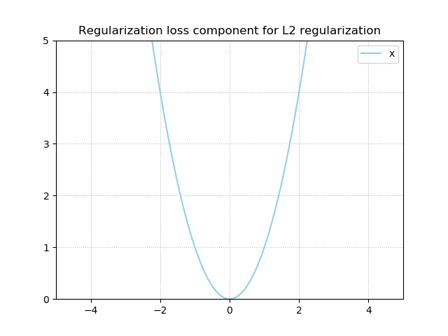](https://www.machinecurve.com/wp-content/uploads/2020/01/l2_comp.png)

As you can see, L2 regularization also stimulates your values to approach zero (as the loss for the regularization component is zero when \[latex\]x = 0\[/latex\]), and hence stimulates them towards being very small values.

However, unlike L1 regularization, it does not push the values to be _exactly zero_.

### Why L1 yields sparsity and L2 likely does not

Let's recall the gradient for L1 regularization:

Regardless of the value of \[latex\]x\[/latex\], the gradient is a constant - either plus or minus one.

This is also true for very small values, and hence, the expected weight update suggested by the regularization component is quite static over time. This, combined with the fact that the normal loss component will ensure some oscillation, stimulates the weights to take zero values whenever they do not contribute significantly enough.

However, the situation is different for L2 loss, where the derivative is \[latex\]2x\[/latex\]:

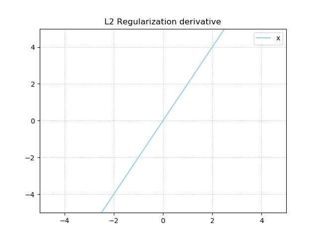

From this plot, you can see that the closer the weight value gets to zero, the smaller the gradient will become.

And the smaller the gradient value, the smaller the weight update suggested by the regularization component.

Much like how you'll never reach zero when you keep dividing 1 by 2, then 0.5 by 2, then 0.25 by 2, and so on, you won't reach zero in this case as well. This is due to the nature of L2 regularization, and especially the way its gradient works. Thus, while L2 regularization will nevertheless produce very small values for non-important values, the models will _not_ be stimulated to be sparse. This is a very important difference between L1 and L2 regularization.

### Why would you want L2 over L1?

Primarily due to the L1 drawback that situations where _high-dimensional data where many features are correlated_ will lead to ill-performing models, because relevant information is removed from your models (Tripathi, n.d.).

### Ridge disadvantage

Unfortunately, L2 regularization also comes with a disadvantage due to the nature of the regularizer (Gupta, 2017). It is model interpretability: due to the fact that L2 regularization does not promote sparsity, you may end up with an uninterpretable model if your dataset is high-dimensional.

This may not always be unavoidable (e.g. in the case where you have a correlative dataset), but once again, take a look at your data first before you choose whether to use L1 or L2 regularization.

* * *

## Elastic Net Regularization

Now that we have identified how L1 and L2 regularization work, we know the following:

- L1 regularization produces sparse models, but cannot handle "small and fat datasets".
- L2 regularization can handle these datasets, but can get you into trouble in terms of model interpretability due to the fact that it does not produce the sparse solutions you may wish to find after all.

But what if we can combine them?

Say hello to **Elastic Net Regularization** (Zou & Hastie, 2005). It's a linear combination of L1 and L2 regularization, and produces a regularizer that has both the benefits of the L1 (Lasso) and L2 (Ridge) regularizers. Let's take a look at how it works - by taking a look at a _naïve_ version of the Elastic Net first, the Naïve Elastic Net.

### Naïve Elastic Net

In their work "Regularization and variable selection via the elastic net", Zou & Hastie (2005) introduce the Naïve Elastic Net as a linear combination between L1 and L2 regularization. With hyperparameters \[latex\]\\lambda\_1 = (1 - \\alpha) \[/latex\] and \[latex\]\\lambda\_2 = \\alpha\[/latex\], the elastic net penalty (or regularization loss component) is defined as:

\[latex\](1 - \\alpha) | \\textbf{w} |\_1 + \\alpha | \\textbf{w} |^2 \[/latex\]

Here, the first part is the L1 penalty \[latex\] \\sum\_{i=1}^{n} | w\_i | \[/latex\], while the second part is the L2 penalty \[latex\] \\sum\_f{ \_{i=1}^{n}} w\_i^2 \[/latex\]. The hyperparameter to be tuned in the Naïve Elastic Net is the value for \[latex\]\\alpha\[/latex\] where, \[latex\]\\alpha \\in \[0, 1\]\[/latex\].

With Elastic Net Regularization, the total value that is to be minimized thus becomes:

\[latex\] L(f(\\textbf{x}\_i), y\_i) = \\sum\_{i=1}^{n} L\_{ losscomponent}(f(\\textbf{x}\_i), y\_i) + (1 - \\alpha) \\sum\_{i=1}^{n} | w\_i | + \\alpha \\sum\_{i=1}^{n} w\_i^2 \[/latex\]

As you can see, for \[latex\]\\alpha = 1\[/latex\], Elastic Net performs Ridge (L2) regularization, while for \[latex\]\\alpha = 0\[/latex\] Lasso (L1) regularization is performed. Tuning the alpha parameter allows you to balance between the two regularizers, possibly based on prior knowledge about your dataset. Visually, we can see this here:

[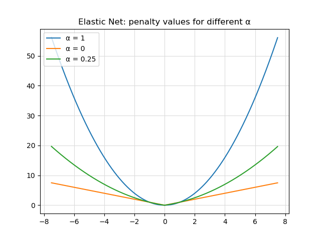](https://www.machinecurve.com/wp-content/uploads/2020/01/penalty-values.png)

Do note that frameworks often allow you to specify \[latex\]\\lambda\_1\[/latex\] and \[latex\]\\lambda\_2\[/latex\] manually. The penalty term then equals:

\[latex\]\\lambda\_1| \\textbf{w} |\_1 + \\lambda\_2| \\textbf{w} |^2 \[/latex\]

The Elastic Net works well in many cases, especially when the final outcome is close to either L1 or L2 regularization only (i.e., \[latex\]\\alpha \\approx 0\[/latex\] or \[latex\]\\alpha \\approx 1\[/latex\]), but performs less adequately when the hyperparameter tuning is different. That's why the authors call it naïve (Zou & Hastie, 2005). The cause for this is "double shrinkage", i.e., the fact that both L2 (first) and L1 (second) regularization tend to make the weights as small as possible. As this may introduce unwanted side effects, performance can get lower. Fortunately, the authors also provide a fix, which resolves this problem. I'd like to point you to the Zou & Hastie (2005) paper for the discussion about correcting it.

* * *

## Should I start with L1, L2 or Elastic Net Regularization?

If you want to add a regularizer to your model, it may be difficult to decide which one you'll need. Generally speaking, it's wise to start with Elastic Net Regularization, because it combines L1 and L2 and generally performs better because it cancels the disadvantages of the individual regularizers (StackExchange, n.d.). However, you may wish to make a more informed choice - in that case, read on :)

Fortunately, there are three questions that you can ask yourself which help you decide where to start. We'll cover these questions in more detail next, but here they are:

1. **How much prior knowledge \[about the dataset\] do you have?** This includes a judgement call (or an empirical decision) about whether you need regularization in the first place, and how sparse and/or correlative your dataset already is.
2. **How much room for validation do you have?** You might wish to test the method and the hyperparameter before you're spending all your resources on one approach.
3. **What are your computational requirements?** Depending on them, you might wish to choose either L1 or L2 over Elastic Net regularization.

### How much prior knowledge do you have?

The first thing that you'll have to inspect is the following: t**he amount of prior knowledge that you have about your dataset**.

Knowing some crucial details about the data may guide you towards a correct choice, which can be L1, L2 or Elastic Net regularization, no regularizer at all, or a regularizer that we didn't cover here.

For example, it may be the case that your model does not improve significantly when applying regularization - due to sparsity already introduced to the data, as well as good normalization up front (StackExchange, n.d.). In those cases, you may wish to avoid regularization altogether.

If you don't, **you'll have to estimate the _sparsity_ and _pairwise correlation_ of and within the dataset** (StackExchange). For this purpose, you may benefit from these references:

- [How do you calculate how dense or sparse a dataset is?](https://datascience.stackexchange.com/questions/10580/how-do-you-calculate-how-dense-or-sparse-a-dataset-is)
- [Calculating pairwise correlation among all columns](https://stackoverflow.com/questions/33997753/calculating-pairwise-correlation-among-all-columns)

Depending on your analysis, **you might have enough information to choose a regularizer**. If your dataset turns out to be very sparse already, L2 regularization may be your best choice. The same is true if the dataset has a large amount of pairwise correlations. If it doesn't, and is dense, you may choose L1 regularization instead. If you don't know for sure, or when your metrics don't favor one approach, Elastic Net may be the best choice for now.

However, before actually starting the training process with a large dataset, you might wish to validate first. You could do the same if you're still unsure.

### How much room for validation do you have?

If you have some resources to spare, you may also perform some **validation activities** first, before you start a large-scale training process. These validation activities especially boil down to the following two aspects:

1. Method testing;
2. Hyperparameter tuning.

Firstly, and obviously, if you choose to validate, it's important to _validate the method you want to use_. If, when using a representative dataset, you find that some regularizer doesn't work, the odds are that it will neither for a larger dataset.

Secondly, when you find a method about which you're confident, it's time to estimate _the impact of the_ _hyperparameter_. The hyperparameter, which is \[latex\]\\lambda\[/latex\] in the case of L1 and L2 regularization and \[latex\]\\alpha \\in \[0, 1\]\[/latex\] in the case of Elastic Net regularization (or \[latex\]\\lambda\_1\[/latex\] and \[latex\]\\lambda\_2\[/latex\] separately), effectively determines the impact of the _regularizer_ on the loss value that is optimized during training. The stronger you regularize, the sparser your model will get (with L1 and Elastic Net), but this comes at the cost of underperforming when it is too large (Yadav, 2018).

### What are your computational requirements?

Thirdly, and finally, you may wish to inform yourself of the **computational requirements** of your machine learning problem.

Often, and especially with today's movement towards commoditization of hardware, this is not a problem, but Elastic Net regularization is more expensive than Lasso or Ridge regularization applied alone (StackExchange, n.d.). Hence, if your machine learning problem already balances at the edge of what your hardware supports, it may be a good idea to perform additional validation work and/or to try and identify additional knowledge about your dataset, in order to make an informed choice between L1 and L2 regularization.

Now that you have answered these three questions, it's likely that you have a good understanding of what the regularizers do - and _when_ to apply _which_ one. With this understanding, we conclude today's blog :)

* * *

## Summary

In this article, you've found a discussion about a couple of things:

1. **The need for regularization.** Primarily, we looked at a fictional scenario where a regression model was estimated based on a few datapoints. Clearly, we saw why a more _generic_ model may be preferred over a very _specific_ one - as we don't want the bank go bankrupt :)
2. **The foundations of a regularizer**. We saw how regularizers are attached to the loss values of a machine learning model, and how they are thus included in the optimization step. Combining the original loss value with the regularization component, models will become simpler with likely losing not much of their predictive abilities.
3. **L1 regularization, or Lasso**. This approach, by using the L1 norm of your weights, ensures that the weights of your model are both small and sparse, dropping out weights that are not relevant. This is especially useful when you have many dimensions that are not correlated, as your models get simpler. However, when you have a small but fat dataset, or when the variables in your dataset correlate quite substantially, L1 regularization may not be suitable for your machine learning problem.
4. **L2 regularization, or Ridge**. By taking the L2 norm of your weights, it ensures that weights get small, but without the zero enforcement. While it is very useful in the cases where L1 regularization is not so useful, the typical datasets suitable for L1 (high-dimensional, high-volume and low-correlation between samples) yield uninterpretable models when L2 loss is used.
5. **Elastic Net regularization**, which has a _naïve_ and a _smarter_ variant, but essentially combines L1 and L2 regularization linearly. It's often the preferred regularizer during machine learning problems, as it removes the disadvantages from both the L1 and L2 ones, and can produce good results.
6. **However, we also looked at questions that help you determine the best regularizer for your machine learning problem**. Even though Elastic Net regularization produces good results often, it may not always be the best choice. For example, do you have substantial prior knowledge about your dataset? Do you need regularization at all? Do you have resources to spare for validation activities? Or, on the contrary, do you already balance on the fine line between overshooting your computational limits and staying on track? The answer to these questions may help you further.

If you have any questions or remarks - feel free to leave a comment 😊 I will happily answer those questions and will improve my blog if you found mistakes. Thank you for reading MachineCurve today and happy engineering! 😎

* * *

## References

Wikipedia. (2004, September 16). Norm (mathematics). Retrieved from [https://en.wikipedia.org/wiki/Norm\_(mathematics)](https://en.wikipedia.org/wiki/Norm_(mathematics))

Chioka. (n.d.). Differences between L1 and L2 as Loss Function and Regularization. Retrieved from [http://www.chioka.in/differences-between-l1-and-l2-as-loss-function-and-regularization/](http://www.chioka.in/differences-between-l1-and-l2-as-loss-function-and-regularization/)

Google Developers. (n.d.). Regularization for Sparsity: L1 Regularization. Retrieved from [https://developers.google.com/machine-learning/crash-course/regularization-for-sparsity/l1-regularization](https://developers.google.com/machine-learning/crash-course/regularization-for-sparsity/l1-regularization)

Neil G. (n.d.). Why L1 regularization can "zero out the weights" and therefore leads to sparse models? Retrieved from [https://stats.stackexchange.com/questions/375374/why-l1-regularization-can-zero-out-the-weights-and-therefore-leads-to-sparse-m](https://stats.stackexchange.com/questions/375374/why-l1-regularization-can-zero-out-the-weights-and-therefore-leads-to-sparse-m)

Wikipedia. (2011, December 11). Elastic net regularization. Retrieved from [https://en.wikipedia.org/wiki/Elastic\_net\_regularization](https://en.wikipedia.org/wiki/Elastic_net_regularization)

Khandelwal, R. (2019, January 10). L1 L2 Regularization. Retrieved from [https://medium.com/datadriveninvestor/l1-l2-regularization-7f1b4fe948f2](https://medium.com/datadriveninvestor/l1-l2-regularization-7f1b4fe948f2)

Caspersen, K. M. (n.d.). Why L1 norm for sparse models. Retrieved from [https://stats.stackexchange.com/questions/45643/why-l1-norm-for-sparse-models/159379](https://stats.stackexchange.com/questions/45643/why-l1-norm-for-sparse-models/159379)

Kochede. (n.d.). What are disadvantages of using the lasso for variable selection for regression? Retrieved from [https://stats.stackexchange.com/questions/7935/what-are-disadvantages-of-using-the-lasso-for-variable-selection-for-regression](https://stats.stackexchange.com/questions/7935/what-are-disadvantages-of-using-the-lasso-for-variable-selection-for-regression)

cbeleites(https://stats.stackexchange.com/users/4598/cbeleites-supports-monica), What are disadvantages of using the lasso for variable selection for regression?, URL (version: 2013-12-03): [https://stats.stackexchange.com/q/77975](https://stats.stackexchange.com/q/77975)

Tripathi, M. (n.d.). Are there any disadvantages or weaknesses to the L1 (LASSO) regularization technique? Retrieved from [https://www.quora.com/Are-there-any-disadvantages-or-weaknesses-to-the-L1-LASSO-regularization-technique/answer/Manish-Tripathi](https://www.quora.com/Are-there-any-disadvantages-or-weaknesses-to-the-L1-LASSO-regularization-technique/answer/Manish-Tripathi)

Duke University. (n.d.). _Sparsity and p >> n - Duke Statistical Science_ \[PDF\]. Retrieved from [http://www2.stat.duke.edu/~banks/218-lectures.dir/dmlect9.pdf](http://www2.stat.duke.edu/~banks/218-lectures.dir/dmlect9.pdf)

Gupta, P. (2017, November 16). Regularization in Machine Learning. Retrieved from [https://towardsdatascience.com/regularization-in-machine-learning-76441ddcf99a](https://towardsdatascience.com/regularization-in-machine-learning-76441ddcf99a)

Zou, H., & Hastie, T. (2005). Regularization and variable selection via the elastic net. _Journal of the royal statistical society: series B (statistical methodology)_, _67_(2), 301-320.

StackExchange. (n.d.). What is elastic net regularization, and how does it solve the drawbacks of Ridge ($L^2$) and Lasso ($L^1$)? Retrieved from [https://stats.stackexchange.com/questions/184029/what-is-elastic-net-regularization-and-how-does-it-solve-the-drawbacks-of-ridge](https://stats.stackexchange.com/questions/184029/what-is-elastic-net-regularization-and-how-does-it-solve-the-drawbacks-of-ridge)

Yadav, S. (2018, December 25). All you need to know about Regularization. Retrieved from [https://towardsdatascience.com/all-you-need-to-know-about-regularization-b04fc4300369](https://towardsdatascience.com/all-you-need-to-know-about-regularization-b04fc4300369)
