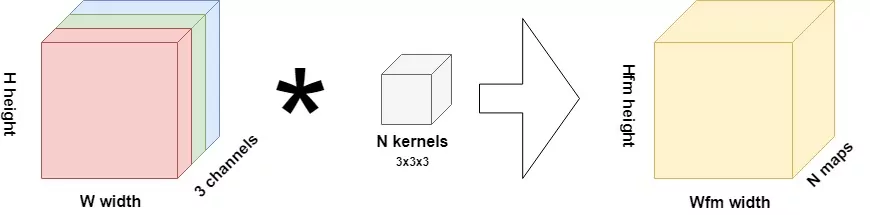
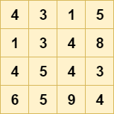
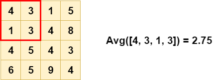
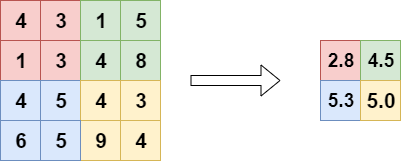
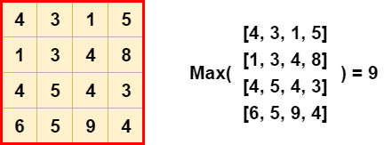
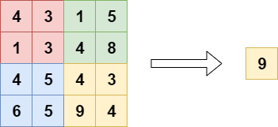
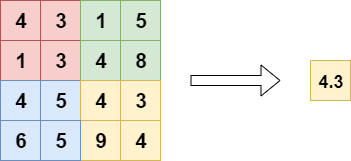

Creating ConvNets often goes hand in hand with pooling layers. More specifically, we often see additional layers like max pooling, average pooling and global pooling. But what are they? Why are they necessary and how do they help training a machine learning model? And how can they be used?

We answer these questions in this blog post.

Firstly, we'll take a look at pooling operations from a conceptual level. We explore the inner workings of a ConvNet and through this analysis show how pooling layers may help the spatial hierarchy generated in those models. Then, we continue by identifying four types of pooling - max pooling, average pooling, global max pooling and global average pooling.

Subsequently, we switch from theory to practice: we show how the pooling layers are represented within Keras, one of the most widely used deep learning frameworks today. Then, we conclude this blog by giving a MaxPooling based example with Keras, using the 2-dimensional variant i.e. `MaxPooling2D`.

Are you ready? Let's go! 😎

* * *

\[toc\]

* * *

## What are pooling operations?

Suppose that you're training a [convolutional neural network](https://www.machinecurve.com/index.php/2018/12/07/convolutional-neural-networks-and-their-components-for-computer-vision/). Your goal is to classify images from a dataset - say, the [SVHN](https://www.machinecurve.com/index.php/2020/01/10/making-more-datasets-available-for-keras/) one. The operation performed by the first convolutional layer in your neural network can be represented as follows:

[](https://www.machinecurve.com/wp-content/uploads/2019/09/CNN-1.jpg)

The inputs for this layer are images, of height \[latex\]H\[/latex\], width \[latex\]W\[/latex\] and with three channels. Thus, they're likely RGB images. Using a 3x3x3 kernel, a convolution operation is performed over the input image, generating \[latex\]N\[/latex\] so-called "feature maps" of size \[latex\]H\_{fm} \\times W\_{fm}\[/latex\]. One feature map learns one particular feature present in the image. Through [activating](https://www.machinecurve.com/index.php/2019/12/03/what-do-convnets-see-visualizing-filters-with-activation-maximization/), these feature maps contribute to the outcome prediction during training, and for new data as well. \[latex\]N\[/latex\] can be configured by the machine learning engineer prior to starting the training process.

In the case of the SVHN dataset mentioned above, where the images are 32 x 32 pixels, the first convolution operation (assuming a stride of 1 and no padding whatsoever) would produce feature maps of 30 x 30 pixels; say we set \[latex\]N = 64\[/latex\], then 64 such maps would be produced in this first layer (Chollet, 2017).

### Downsampling your inputs

Let's now take one step back and think of the goals that we want to achieve if we were to train a ConvNet successfully. The primary goal, say that we have an image classifier, **is that it classifies the images correctly.**

If we as humans were to do that, we would look at **both the details and the high-level patterns**.

Now let's take a look at the concept of a feature map again. In the first layer, you learn a feature map based on very "concrete" aspects of the image. Here, the feature map consists of very low-level elements within the image, such as curves and edges, a.k.a. the **details**. However, we cannot see the **higher-level** **patterns** with just one convolutional layer. We need many, stacked together, to learn these patterns. This is also called building a spatial hierarchy (Chollet, 2017). Good spatial hierarchies summarize the data substantially when moving from bottom to top, and they're like a pyramid. Here's a good one versus a bad one:

[](https://www.machinecurve.com/wp-content/uploads/2020/01/hierarchies.png)

_A good spatial hierarchy (left) versus a worse one (right)._

As you [likely know](https://www.machinecurve.com/index.php/2018/12/07/convolutional-neural-networks-and-their-components-for-computer-vision/), in the convolution operation of a ConvNet, a small block slides over the entire input image, taking element-wise multiplications with the part of the image it currently slides over (Chollet, 2017). This is a relatively expensive operation. Can't this be done in a simpler way? Do we really need to have a hierarchy built up from convolutions only? The answer is no, and pooling operations prove this.

### Introducing pooling

Here's one definition of pooling:

> Pooling is basically “downscaling” the image obtained from the previous layers. It can be compared to shrinking an image to reduce its pixel density.
> 
> [Hervatte (n.d.)](https://www.quora.com/What-is-pooling-in-a-convolutional-neural-network/answer/Shreyas-Hervatte)

All right, downscaling it is. But it is also done in a much simpler way: by performing a _hardcoded tensor operation_ such as `max`, rather than through a learned transformation, we don't need the relatively expensive operation of learning the weights (Chollet, 2017). This way, we get a nice and possibly useful spatial hierarchy at a fraction of the cost.

In the rest of this blog post, we cover four types of pooling operations:

- Max pooling;
- Average pooling;
- Global max pooling;
- Global average pooling.

Let's take a look at Max Pooling first.

* * *

## Max Pooling

Suppose that this is one of the 4 x 4 pixels feature maps from our ConvNet:

[](https://www.machinecurve.com/wp-content/uploads/2020/01/Max-Pooling.png)

If we want to downsample it, we can use a pooling operation what is known as "max pooling" (more specifically, this is _two-dimensional_ max pooling). In this pooling operation, a \[latex\]H \\times W\[/latex\] "block" slides over the input data, where \[latex\]H\[/latex\] is the height and \[latex\]W\[/latex\] the width of the block. The stride (i.e. how much it steps during the sliding operation) is often equal to the pool size, so that its effect equals a reduction in height and width.

For each block, or "pool", the operation simply involves computing the \[latex\]max\[/latex\] value, like this:

[](https://www.machinecurve.com/wp-content/uploads/2020/01/Max-Pooling-1.png)

Doing so for each pool, we get a nicely downsampled outcome, greatly benefiting the spatial hierarchy we need:

[](https://www.machinecurve.com/wp-content/uploads/2020/01/Max-Pooling-2.png)

### How Max Pooling benefits translation invariance

Besides being a cheap replacement for a convolutional layer, there is another reason why max pooling can be very useful in your ConvNet: _translation invariance_ (Na, n.d.).

When a model is translation invariant, it means that it doesn't matter where an object is present in a picture; it will be recognized anyway. For example, if I hold a phone near my head, or near my pocket - it should be part of the classification both times.

As you can imagine, achieving translation invariance in your model greatly benefits its predictive power, as you no longer need to provide images where the object is _precisely_ at some desired position. Rather, you can just provide a massive set of images that contain the object, and possibly get a well-performing model.

Now, how does max pooling achieve translation invariance in a neural network?

Say that we have a one-pixel object - that's a bit weird, as objects are normally multi-pixel, but it benefits our explanation. The object has the highest contrast and hence generates a high value for the pixel in the input image. Suppose that the 4 at (0, 4) in the red part of the image above is the pixel of our choice. With max pooling, it is still included in the output, as we can see.

Now imagine that this object, and thus the 4, isn't present at (0, 4), but at (1, 3) instead. Does it disappear from the model? No. Rather, the output of the max pooling layer will still be 4. Hence, it doesn't really matter where the object resides in the red block, as it will be "caught" anyway.

That's why max pooling means translation invariance and why it is really useful, except for being relatively cheap.

Do note however that if the object were in any of the non-red areas, it would be recognized there, but _only_ if there's nothing with a greater pixel value (which is the case for all the elements!). Hence, max pooling does not produce translation invariance if you only provide pictures where the object resides in a _very small_ _area_ all the time. However, if your dataset is varied enough, with the object being in various positions, max pooling does really benefit the performance of your model.

### Why Max Pooling is the most used pooling operation

Next, we'll look at Average Pooling, which is another pooling operation. It can be used as a drop-in replacement for Max Pooling. However, when you look at neural network theory (such as Chollet, 2017), you'll see that Max Pooling is preferred all the time.

Why is this the case?

The argument is relatively simple: as the objects of interest likely produce the largest pixel values, it shall be more interesting to take the max value in some block than to take an average (Chollet, 2017).

Oops, now I already gave away what Average Pooling does :)

* * *

## Average Pooling

Another type of pooling layers is the Average Pooling layer. Here, rather than a `max` value, the `avg` for each block is computed:

[](https://www.machinecurve.com/wp-content/uploads/2020/01/Average-Pooling.png)

As you can see, the output is also different - and less extreme compared to Max Pooling:

[](https://www.machinecurve.com/wp-content/uploads/2020/01/Average-Pooling-1.png)

Average Pooling is different from Max Pooling in the sense that it retains much information about the "less important" elements of a block, or pool. Whereas Max Pooling simply throws them away by picking the maximum value, Average Pooling blends them in. This can be useful in a variety of situations, where such information is useful. We'll see one in the next section.

### Why think about Average Pooling at all?

On the internet, many arguments pro and con Average Pooling can be found, often suggesting Max Pooling as the alternative. Primarily, the answers deal with the difference mentioned above.

For example:

> So, to answer your question, I don’t think average pooling has any significant advantage over max-pooling. But, may be in some cases, where variance in a max pool filter is not significant, both pooling will give same type results. But in extreme cases, max-pooling will provide better results for sure.
> 
> [Rahman (n.d.)](https://www.quora.com/What-is-the-benefit-of-using-average-pooling-rather-than-max-pooling/answer/Nouroz-Rahman)

But also:

> I would add an additional argument - that max-pooling layers are worse at preserving localization.
> 
> Ilan (n.d.)

Consequently, the only correct answer is this: it is entirely dependent on the problem that you're trying to solve.

If the position of objects is not important, Max Pooling seems to be the better choice. If it is, it seems that better results can be achieved with Average Pooling.

* * *

## Global Max Pooling

Another type of pooling layer is the Global Max Pooling layer. Here, we set the pool size equal to the input size, so that the `max` of the entire input is computed as the output value (Dernoncourt, 2017):

[](https://www.machinecurve.com/wp-content/uploads/2020/01/Global-Max-Pooling-3.png)

Or, visualizing it differently:

[](https://www.machinecurve.com/wp-content/uploads/2020/01/Global-Max-Pooling-1.png)

Global pooling layers can be used in a variety of cases. Primarily, it can be used to reduce the dimensionality of the feature maps output by some convolutional layer, to replace Flattening and sometimes even Dense layers in your classifier (Christlein et al., 2019). What's more, it can also be used for e.g. word spotting (Sudholt & Fink, 2016). This is due to the property that it allows detecting _noise_, and thus "large outputs" (e.g. the value 9 in the exmaple above). However, this is also one of the downsides of Global Max Pooling, and like the regular one, we next cover Global Average Pooling.

* * *

## Global Average Pooling

When applying Global Average Pooling, the pool size is still set to the size of the layer input, but rather than the maximum, the average of the pool is taken:

[](https://www.machinecurve.com/wp-content/uploads/2020/01/Global-Average-Pooling-2.png)

Or, once again when visualized differently:

[](https://www.machinecurve.com/wp-content/uploads/2020/01/Global-Average-Pooling-3.png)

They're often used to replace the fully-connected or densely-connected layers in a classifier. Instead, the model ends with a convolutional layer that generates as many feature maps as the number of target classes, and applies global average pooling to each in order to convert each feature map into one value (Mudau, n.d.). As feature maps can recognize certain elements within the input data, the maps in the final layer effectively learn to "recognize" the presence of a particular class in this architecture. By feeding the values generated by global average pooling into a [Softmax activation function](https://www.machinecurve.com/index.php/2020/01/08/how-does-the-softmax-activation-function-work/), you once again obtain the multiclass probability distribution that you want.

What's more, this approach might improve model performance because of the nativeness of the "classifier" to the "feature extractor" (they're both convolutional instead of convolutional/dense), and reduce overfitting because of the fact that there is no parameter to be learnt in the global average pooling layer (Mudau, n.d.). In a different blog post, we'll try this approach and show the results!

* * *

## Pooling layers in the Keras API

Let's now take a look at how Keras represents pooling layers in its API.

### Max Pooling

Max Pooling comes in a one-dimensional, two-dimensional and three-dimensional variant (Keras, n.d.). The one-dimensional variant can be used together with Conv1D layers, and thus for temporal data:

```
keras.layers.MaxPooling1D(pool_size=2, strides=None, padding='valid', data_format='channels_last')
```

Here, the pool size can be set as an integer value through `pool_size`, strides and padding can be applied, and the data format can be set. With strides, which if left `None` will default the `pool_size`, one can define how much the pool "jumps" over the input; in the default case halving it. With padding, we may take into account the edges if they were to remain due to incompatibility between pool and input size. Finally, the data format tells us something about the channels strategy (channels first vs channels last) of your dataset.

Max Pooling is also available for 2D data, which can be used together with Conv2D for spatial data (Keras, n.d.):

```
keras.layers.MaxPooling2D(pool_size=(2, 2), strides=None, padding='valid', data_format=None)
```

The API is really similar, except for the `pool_size`. It's possible to define it as an integer value (e.g. `pool_size = 3`), but it will be converted to `(3, 3)` internally. Obviously, one can also set a tuple instead, having more flexibility over the shape of your pool.

3D Max Pooling can be used for spatial or spatio-temporal data (Keras, n.d.):

```
keras.layers.MaxPooling3D(pool_size=(2, 2, 2), strides=None, padding='valid', data_format=None)
```

Here, the same thing applies for the `pool_size`: it can either be set as an integer value or as a three-dimensional tuple.

### Average Pooling

For Average Pooling, the API is no different than for Max Pooling, and hence I won't repeat everything here except for the API representation (Keras, n.d.):

```
keras.layers.AveragePooling1D(pool_size=2, strides=None, padding='valid', data_format='channels_last')
keras.layers.AveragePooling2D(pool_size=(2, 2), strides=None, padding='valid', data_format=None)
keras.layers.AveragePooling3D(pool_size=(2, 2, 2), strides=None, padding='valid', data_format=None)
```

### Global Max Pooling

Due to the unique structure of global pooling layers where the pool shape equals the input shape, their representation in the Keras API is really simple. For example, for Global Max Pooling (Keras, n.d.):

```
keras.layers.GlobalMaxPooling1D(data_format='channels_last')
keras.layers.GlobalMaxPooling2D(data_format='channels_last')
keras.layers.GlobalMaxPooling3D(data_format='channels_last')
```

Here, the only thing to be configured is the `data_format`, which tells us something about the ordering of dimensions in our data, and can be `channels_last` or `channels_first`.

### Global Average Pooling

The same can be observed for Global Average Pooling (Keras, n.d.):

```
keras.layers.GlobalAveragePooling1D(data_format='channels_last')
keras.layers.GlobalAveragePooling2D(data_format='channels_last')
keras.layers.GlobalAveragePooling3D(data_format='channels_last')
```

* * *

## Conv2D and Pooling example with Keras

Now that we know what pooling layers are and how they are represented within Keras, we can give an example. For this example, we'll show you the model we created before, to show [how sparse categorical crossentropy worked](https://www.machinecurve.com/index.php/2019/10/06/how-to-use-sparse-categorical-crossentropy-in-keras/). Hence, we don't show you all the steps to creating the model here - click the link to finalize your model.

But what we do is show you the fragment where pooling is applied. Here it is:

```
# Create the model
model = Sequential()
model.add(Conv2D(32, kernel_size=(3, 3), activation='relu', input_shape=input_shape))
model.add(MaxPooling2D(pool_size=(2, 2)))
model.add(Dropout(0.25))
model.add(Conv2D(64, kernel_size=(3, 3), activation='relu'))
model.add(MaxPooling2D(pool_size=(2, 2)))
model.add(Dropout(0.25))
model.add(Flatten())
model.add(Dense(256, activation='relu'))
model.add(Dense(no_classes, activation='softmax'))
```

Essentially, it's the architecture for our model. Using the Sequential API, you can see that we add Conv2D layers, which are then followed by MaxPooling2D layers with a `(2, 2)` pool size - effectively halving the input every time. The [Dropout layer](https://www.machinecurve.com/index.php/2019/12/18/how-to-use-dropout-with-keras/) helps boost the model's generalization power.

That's it! Applying pooling layers to Keras models is really easy :)

* * *

## Summary

In this blog post, we saw what pooling layers are and why they can be useful to your machine learning project. Following the general discussion, we looked at max pooling, average pooling, global max pooling and global average pooling in more detail.

The theory details were followed by a practical section - introducing the API representation of the pooling layers in the Keras framework, one of the most popular deep learning frameworks used today. Finally, we provided an example that used MaxPooling2D layers to add max pooling to a ConvNet.

I hope you've learnt something from today's blog post. If you did, please let me know. I'm really curious to hear about how you use my content, if you do. In that case, please leave a comment below! 💬👇 Please also drop a message if you have any questions or remarks.

Thank you for reading MachineCurve today and happy engineering! 😎

* * *

## References

Keras. (n.d.). Pooling Layers. Retrieved from [https://keras.io/layers/pooling/](https://keras.io/layers/pooling/)

Chollet, F. (2017). _Deep Learning with Python_. New York, NY: Manning Publications.

Hervatte, S. (n.d.). What is “pooling” in a convolutional neural network? Retrieved from [https://www.quora.com/What-is-pooling-in-a-convolutional-neural-network/answer/Shreyas-Hervatte](https://www.quora.com/What-is-pooling-in-a-convolutional-neural-network/answer/Shreyas-Hervatte)

Na, X. (n.d.). How exactly does max pooling create translation invariance? Retrieved from [https://www.quora.com/How-exactly-does-max-pooling-create-translation-invariance/answer/Xingyu-Na](https://www.quora.com/How-exactly-does-max-pooling-create-translation-invariance/answer/Xingyu-Na)

Rahman, N. (n.d.). What is the benefit of using average pooling rather than max pooling? Retrieved from [https://www.quora.com/What-is-the-benefit-of-using-average-pooling-rather-than-max-pooling/answer/Nouroz-Rahman](https://www.quora.com/What-is-the-benefit-of-using-average-pooling-rather-than-max-pooling/answer/Nouroz-Rahman)

Ilan, S. (n.d.). What is the benefit of using average pooling rather than max pooling? Retrieved from [https://www.quora.com/What-is-the-benefit-of-using-average-pooling-rather-than-max-pooling/answer/Shachar-Ilan](https://www.quora.com/What-is-the-benefit-of-using-average-pooling-rather-than-max-pooling/answer/Shachar-Ilan)

Dernoncourt, F (2017) ([https://stats.stackexchange.com/users/12359/franck-dernoncourt](https://stats.stackexchange.com/users/12359/franck-dernoncourt)), What is global max pooling layer and what is its advantage over maxpooling layer?, URL (version: 2017-01-20): [https://stats.stackexchange.com/q/257325](https://stats.stackexchange.com/q/257325)

Christlein, V., Spranger, L., Seuret, M., Nicolaou, A., Král, P., & Maier, A. (2019). [Deep Generalized Max Pooling](https://arxiv.org/abs/1908.05040). _arXiv preprint arXiv:1908.05040_.

Sudholt, S., & Fink, G. A. (2016, October). PHOCNet: A deep convolutional neural network for word spotting in handwritten documents. In _2016 15th International Conference on Frontiers in Handwriting Recognition (ICFHR)_ (pp. 277-282). IEEE.

Mudau, T. ([https://stats.stackexchange.com/users/139737/tshilidzi-mudau](https://stats.stackexchange.com/users/139737/tshilidzi-mudau)), What is global max pooling layer and what is its advantage over maxpooling layer?, URL (version: 2017-11-10): [https://stats.stackexchange.com/q/308218](https://stats.stackexchange.com/q/308218)
