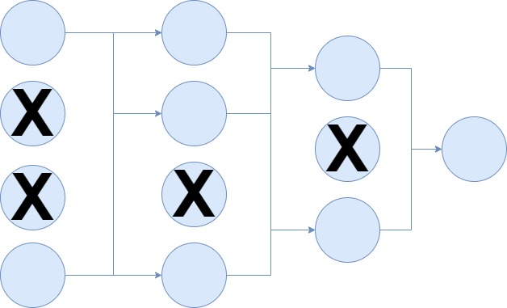

Training neural networks is an art rather than a process with a fixed outcome. You don't know whether you'll end up with working models, and there are many aspects that may induce failure for your machine learning project.

However, over time, you'll also learn a certain set of brush strokes which significantly improve the odds that you'll _succeed_.

Even though this may sound weird (it did when I started my dive into machine learning theory), it think that the above description is actually true. Once you'll dive in, there will be a moment when all the pieces start coming together.

In modern neural network theory, Batch Normalization is likely one of the encounters that you'll have during your quest for information.

It has something to do with _normalizing_ based on _batches of data_... right? Yeah, but that's actually repeating the name in different words.

Batch Normalization, in fact, helps you overcome a phenomenon called **internal covariate shift**. What this is, and how Batch Normalization works? We'll answer those questions in this blog.

To be precise: we'll kick off by exploring the concept of an internal covariate shift. What is it? How is it caused? Why does it matter? These are the questions that we'll answer.

It is followed by the introduction of Batch Normalization. Here, we'll also take a look at what it is, how it works, what it does and why it matters. This way, you'll understand how it can be used to **speed up your training**, or to even save you from situations with **non-convergence**.

Are you ready? Let's go! 😎

* * *

\[toc\]

* * *

## Internal covariate shift: a possible explanation of slow training and non-convergence

Suppose that you have a neural network, such as this one that has been equipped with [Dropout neurons](https://www.machinecurve.com/index.php/2019/12/16/what-is-dropout-reduce-overfitting-in-your-neural-networks/):

As you might recall from the [high-level supervised machine learning process](https://www.machinecurve.com/index.php/2019/10/04/about-loss-and-loss-functions/#the-high-level-supervised-learning-process), training a neural network includes a _feedforward operation_ on your training set. During this operation, the data is fed to the neural network, which generates a prediction for each sample that can be compared to the _target data_, a.k.a. the ground truth.

This results in a [loss value](https://www.machinecurve.com/index.php/2019/10/04/about-loss-and-loss-functions/#loss) that is computed by some [loss function](https://www.machinecurve.com/index.php/2019/10/04/about-loss-and-loss-functions/#loss-functions).

Based on the loss function, backpropagation will compute what is known as the _gradient_ to improve the loss, while [gradient descent](https://www.machinecurve.com/index.php/2019/10/24/gradient-descent-and-its-variants/) or an [adaptive optimizer](https://www.machinecurve.com/index.php/2019/11/03/extensions-to-gradient-descent-from-momentum-to-adabound/) will actually change the weights of the neurons of your neural network. Based on this change, the model is expected to perform better during the next iteration, in which the process is repeated.

### Changing input distributions

Now, let's change your viewpoint. Most likely, you'll have read the previous while visualizing the neural network as a whole. Perfectly fine, as this was intended, but now focus on the network as if it is _a collection of stacked, but individual, layers_.

Each layer takes some input, transforms this input through interaction with its weights, and outputs the result, to be consumed by the first layer downstream. Obviously, this is not true for the input layer (with the original sample as input) and the output layer (with no subsequent layer), but you get the point.

Now suppose that we feed the entire training set to the neural network. The first layer will _transform_ this data into _something else_. Statistically, however, this is also a _sample_, which thus has a sample mean and a sample standard deviation. This process repeats itself for each individual layer: the input data can be represented as some statistical sample with mean \[latex\]\\mu\[/latex\] and standard deviation \[latex\]\\sigma\[/latex\].

### Internal covariate shift

Now do note two things:

- Firstly, the argument above means by consequence that the distribution of input data for some particular layer depends on _all the interactions happening in all the upstream layers_.
- Secondly, this means by consequence that _a change in how one or more of the upstream layer(s) process data_ will change the _input distribution_ for this layer.

...and what happens when you train your model? Indeed, you change _how the layers process data_, by changing their weights.

Ioffe & Szegedy (2015), in their paper ["Batch Normalization: Accelerating Deep Network Training by Reducing Internal Covariate Shift"](https://arxiv.org/abs/1502.03167) call this process the **"internal covariate shift"**. They define it as follows:

> The change in the distribution of network activations due to the change in network parameters during training.
> 
> Ioffe, S., & Szegedy, C. (2015). [Batch normalization: Accelerating deep network training by reducing internal covariate shift](https://arxiv.org/abs/1502.03167). _arXiv preprint arXiv:1502.03167_.

### Why is this bad?

Put plainly and simply:

**It slows down training**.

If you were using a very strict approach towards defining a supervised machine learning model, you would for example say that machine learning produces _a function which maps some input to some output based on some learnt mapping, which equals the mapping made by the true, underlying mapping in your data_.

This is also true for each layer: each layer essentially is a function which learns to map some input to some output, so that the system as a whole maps the original input to the desired output.

Now imagine that you're looking at the training process from some distance. Slowly but surely, each layer learns to represent the internal mapping and the system as a whole starts to show the desired behavior. Perfect, isn't it?

Yes, except that you also see some oscillation during the process. Indeed, you see that the layers make _tiny_ mistakes during training, because they expect the inputs to be of some kind, while they are slightly different. They do know how to handle this, as the changes are very small, but they have to readjust each time they encounter such a change. As a result, the process as a whole takes a bit longer.

The same is true for the actual machine learning process. The _internal covariance shift_, or the changing distributions of the input data for each hidden layer, mean that each layer requires some extra time to learn the weights which allow the system as a whole to minimize the loss value of the entire neural network. In extreme cases, although this does not happen too often, this shift may even result in non-convergence, or the impossibility of learning the mapping as a whole. This especially occurs in datasets which have not been normalized and are by consequence a poor fit for ML.

* * *

## Introducing Batch Normalization

Speaking about such normalization: rather than leaving it to the machine learning engineer, can't we (at least partially) fix the problem in the neural network itself?

That's the thought process that led Ioffe & Szegedy (2015) to conceptualize the concept of **Batch Normalization**: by normalizing the inputs to each layer to a learnt representation likely close to \[latex\](\\mu = 0.0, \\sigma = 1.0)\[/latex\], the internal covariance shift is reduced substantially. As a result, it is expected that the speed of the training process is increased significantly.

But how does it work?

Let's find out.

### Per-feature normalization on minibatches

The first important thing to understand about Batch Normalization is that it works on a per-feature basis.

This means that, for example, for feature vector \[latex\]\\textbf{x} = \[0.23, 1.26, -2.41\]\[/latex\], normalization is not performed equally for each dimension. Rather, each dimension is normalized individually, based on the sample parameters of the _dimension_.

The second important thing to understand about Batch Normalization is that it makes use of minibatches for performing the normalization process (Ioffe & Szegedy, 2015). It avoids the computational burden of using the entire training set, while assuming that minibatches approach the dataset's sample distribution if sufficiently large. This is a very smart idea.

### Four-step process

Now, the algorithm. For each feature \[latex\]x\_B^{(k)} \[/latex\] in your feature vector \[latex\]\\textbf{x}\_B\[/latex\] (which, for your hidden layers, doesn't contain your features but rather the inputs for that particular layer), Batch Normalization normalizes the values with a four-step process on your minibatch \[latex\]B\[/latex\] (Ioffe & Szegedy, 2015):

1. **Computing the mean of your minibatch**: \[latex\]\\mu\_B^{(k)} \\leftarrow \\frac{1}{m} \\sum\\limits\_{i=1}^m x\_B{ \_i ^{(k)} } \[/latex\].
2. **Computing the variance of your minibatch:** \[latex\]\\sigma^2{ \_B^{(k)} } \\leftarrow \\frac{1}{m} \\sum\\limits\_{i=1}^m ( x\_B{ \_i ^{(k)} } - \\mu\_B^{(k)})^2\[/latex\]
3. **Normalizing the value:** \[latex\]\\hat{x}\_B^{(k)} \\leftarrow \\frac{x\_B{ ^{(k)} } - \\mu\_B^{(k)}}{\\sqrt{ \\sigma^2{ \_B^{(k)} } + \\epsilon}}\[/latex\]
4. **Scaling and shifting:** \[latex\]y\_i \\leftarrow \\gamma\\hat{x} \_B ^{(k)} + \\beta\[/latex\].

#### Computing mean and variance

The first two steps are simple and are very common as well as required in a normalization step: **computing the mean** \[latex\]\\mu\[/latex\] and **variance** \[latex\]\\sigma^2\[/latex\] of the \[latex\]k^{\\text{th}}\[/latex\] dimension of your minibatch sample \[latex\]x\_B\[/latex\].

#### Normalizing

These are subsequently used in the **normalization step**, in which the expected distribution is \[latex\](0, 1)\[/latex\] as long as samples in the minibatch have the same distribution and the value for \[latex\]\\epsilon\[/latex\] is neglected (Ioffe & Szegedy, 2015).

You may ask: indeed, this \[latex\]\\epsilon\[/latex\], why is it there?

It's for numerical stability (Ioffe & Szegedy, 2015). If the variance \[latex\]\\sigma^2\[/latex\] were zero, one would get a _division by zero_ error. This means that the model would become numerically unstable. The value for \[latex\]\\epsilon\[/latex\] resolves this by taking a very small but nonzero value to counter this effect.

#### Scaling and shifting

Now, finally, the fourth step: **scaling and shifting** the normalized input value. I can get why this is weird, as we already completed normalization in the third step.

> Note that simply normalizing each input of a layer may change what the layer can represent. For instance, normalizing the inputs of a sigmoid would constrain them to the linear regime of the nonlinearity. To address this, we make sure that the transformation inserted in the network can represent the identity transform. To accomplish this, we introduce, for each activation \[latex\]x^{(k)}\[/latex\], a pair of parameters \[latex\]\\gamma^{(k)}\[/latex\], \[latex\]\\beta^{(k)}\[/latex\], which scale and shift the normalized value:
> 
> \[latex\]y^{(k)} = \\gamma^{(k)}\\hat{x}^{(k)} + \\beta^{(k)}\[/latex\]
> 
> Ioffe, S., & Szegedy, C. (2015). [Batch normalization: Accelerating deep network training by reducing internal covariate shift](https://arxiv.org/abs/1502.03167). _arXiv preprint arXiv:1502.03167_.

Linear regime of the nonlinearity? Represent the identity transform? What are these?

Let's decomplexify the rather academic English into a plainer variant.

First, the "linear regime of the nonlinearity". Suppose that we're using the [Sigmoid activation function](https://www.machinecurve.com/index.php/2019/09/04/relu-sigmoid-and-tanh-todays-most-used-activation-functions/), which is a nonlinear activation function (a "nonlinearity") and was still quite common in 2015, when the Ioffe & Szegedy paper was written.

It looks like this:

Suppose that we've added it to some arbitrary layer.

_Without Batch Normalization_, the inputs of this layer do not have a distribution of approximately \[latex\](0, 1)\[/latex\], and hence could theoretically be likelier to take rather large values (e.g. \[latex\]2.5623423...\[/latex\]).

Suppose that our layer does nothing but pass the data (it makes our case simpler), the _activations_ of those input values produce outputs that have a _nonlinear_ slope: as you can see in the plot above, for inputs to the activation function in the domain \[latex\]\[2, 4\]\[/latex\], the output bends a bit.

However, for inputs of \[latex\]\\approx 0\[/latex\], this is not the case: the outputs for the input domain of approximately \[latex\]\[-0.5, 0.5\]\[/latex\] don't bend and actually seem to represent a _linear function_. This entirely reduces the effect of nonlinear activation, and by consequence the performance of our model, and might not be what we want!

...and wait: didn't we normalize to \[latex\](0, 1)\[/latex\], meaning that the inputs to our activation function are likely in the domain \[latex\]\[-1, 1\]\[/latex\] for every layer? Oops 🙊

This is why the authors introduce a scaling and shifting operation with some parameters \[latex\]\\gamma\[/latex\] and \[latex\]\\beta\[/latex\], with which the normalization can be adapted during training, in extreme cases even to "represent the identity transform" (a.k.a., what goes in, comes out again - entirely removing the Batch Normalization step).

The parameters are learnt during training, together with the other parameters (Ioffe & Szegedy, 2015).

### Continuing our small example

Now, let's revise our small example from above, with our feature vector \[latex\]\\textbf{x} = \[0.23, 1.26, -2.41\]\[/latex\].

Say if we used a minibatch approach with 2 samples per batch (a bit scant, I know, but it's sufficient for the explanation), with another vector \[latex\]\\textbf{x}\_a = \[0.56, 0.75, 1.00\]\[/latex\] in the set, our Batch Normalization step would go as follows (assuming \[latex\]\\gamma = \\beta = 1\[/latex\]):

| **Features** | **Mean** | **Variance** | **Input** | **Output** |
| --- | --- | --- | --- | --- |
| \[0.23, 0.56\] | 0.395 | 0.054 | 0.23 | \-0.710 |
| \[1.26, 0.75\] | 1.005 | 0.130 | 1.26 | 0.707 |
| \[-2.41, 1.00\] | \-0.705 | 5.81 | \-2.41 | \-0.707 |

As we can see, with \[latex\]\\gamma = \\beta = 1\[/latex\], our values are normalized to a distribution of approximately \[latex\](0, 1)\[/latex\] - with some \[latex\]\\epsilon\[/latex\] term.

### The benefits of Batch Normalization

Theoretically, there are some assumed benefits when using Batch Normalization in your neural network (Ioffe & Szegedy, 2015):

- The model is less sensitive to hyperparameter tuning. That is, whereas larger learning rates led to non-useful models previously, larger LRs are acceptable now.
- Weight initialization is a tad less important now.
- Dropout, which is used to [add noise to benefit training](https://www.machinecurve.com/index.php/2019/12/18/how-to-use-dropout-with-keras/), can be removed.

### Batch Normalization during inference

While a minibatch approach speeds up the training process, it is "neither necessary nor desirable during inference" (Ioffe & Szegedy, 2015). When inferring e.g. the class for a new sample, you wish to normalize it based on the _entire_ training set, as it produces better estimates and is computationally feasible.

Hence, during inference, the Batch Normalization step goes as follows:

\[latex\]\\hat{x}^{(k)} \\leftarrow \\frac{x\_i^{(k)} - \\mu^{(k)}}{\\sqrt{ \\sigma^2{ ^{(k)} } + \\epsilon}}\[/latex\]

Where \[latex\]x \\in X\[/latex\] and \[latex\]X\[/latex\] represents the full training data, rather than some minibatch \[latex\]X\_b\[/latex\].

* * *

## Summary

In this blog post, we've looked at the problem of a relatively slow and non-convergent training process, and noted that Batch Normalization may help reduce the issues with your neural network. By reducing the distribution of the input data to \[latex\](0, 1)\[/latex\], and doing so on a per-layer basis, Batch Normalization is theoretically expected to reduce what is known as the "internal covariance shift", resulting in faster learning.

I hope you've learnt something from this blog post. If you did, please feel free to leave a comment in the comments box below - I'll happily read and answer :) Please do the same if you have any questions or when you have remarks. Thanks for reading MachineCurve today and happy engineering! 😎

* * *

## References

Ioffe, S., & Szegedy, C. (2015). [Batch normalization: Accelerating deep network training by reducing internal covariate shift](https://arxiv.org/abs/1502.03167). _arXiv preprint arXiv:1502.03167_.

Reddit. (n.d.). Question about Batch Normalization. Retrieved from [https://www.reddit.com/r/MachineLearning/comments/3k4ecb/question\_about\_batch\_normalization/](https://www.reddit.com/r/MachineLearning/comments/3k4ecb/question_about_batch_normalization/)
