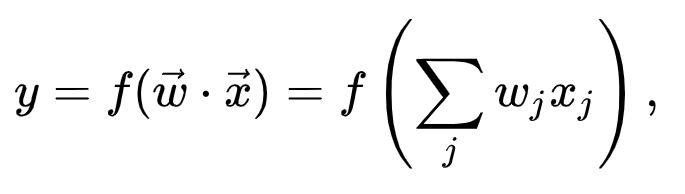

Recently, I've picked up deep learning both in my professional and spare-time activities. This means that I spent a lot of time learning the general concepts behind this very hot field. On this website, I'm documenting the process for others to repeat.

But in order to start, you'll have to start with the definition. **What is deep learning, exactly?** If you don't know what it is, you cannot deepen your understanding.

In this blog, I thus investigate the definition of deep learning in more detail. I'll take a look at the multi-layered information processing, the nonlinear [activation functions](https://www.machinecurve.com/index.php/2019/09/04/relu-sigmoid-and-tanh-todays-most-used-activation-functions/), as well as the concept behind representation learning. It's slightly high-level to keep this blog at an adequate complexity, and I will cover the particular topics in more detail in other blogs.

So keep coming back every now and then to find new information available for you to read, free of charge! :-)

Hopefully, this blog will put you into the right direction in your quest for information. If you have any questions or remarks, tips and tricks; obviously, they are welcome. Please leave me a message below and I am more than happy to respond.

Okay, let's give it a start :-)

**Update February 2020** \- Extended certain areas of the text and added additional links to other MachineCurve articles.

\[toc\]

\[ad\]

## What is deep learning, exactly?

There seems to be a bit of a definition clash, haha. In all these years, there has been [no agreed upon definition](https://www.machinecurve.com/index.php/2017/09/30/the-differences-between-artificial-intelligence-machine-learning-more/) about what the differences are between artificial intelligence, machine learning and deep learning. Especially for artificial intelligence things get vague with very fuzzy boundaries.

For deep learning, things tend to get a bit better.

If we quote Wikipedia's [page about deep learning](https://en.wikipedia.org/wiki/Deep_learning), it writes as follows: _"**Deep learning** (also known as **deep structured learning** or **hierarchical learning**) is part of a broader family of machine learning methods based on learning data representations, as opposed to task-specific algorithms."_

We now have a couple of new questions:

- What does _learning data representations_ mean?
- How are they different than tasks-specific algorithms?

The book 'Deep Learning Methods and Applications' by Li Deng and Dong Yu provides a synthesis of various definitions based on previous academic research. They highlight that within all these definitions, overlap exists between two key concepts:

1. Deep learning models are models consisting of multiple layers or stages of nonlinear information processing;
2. Deep learning methods are methods for supervised or unsupervised learning of feature representation at successively higher, more abstract layers.

This somewhat deepens our understanding from the Wikipedia quote, but we still have some remaining questions.

- Once again, _what does learning data representation_ or _feature representation_ mean?
- How can we visualize the successively higher, more abstract layers?
- What is nonlinear information processing?

We now have a problem space which we can use to move forward :-)

\[ad\]

## Multiple layers of information processing

Classic methods of machine learning work with just one layer of information processing.

To make this principle clear, we take one of the simpler variants of these kind of models: a [linear classifier](https://www.machinecurve.com/index.php/2019/06/11/why-you-shouldnt-use-a-linear-activation-function/).

Above, we have the mathematical notation of a linear classifier. I'll now try to explain it more intuitively.

### Input, output and weights

Suppose that we have a model. This means that you will have **input** which you feed to the model, and based on the model you get some **output**. In the notation above, vector (for programmers, this is like an array; for anyone else, it is like an ordered list) **x** is the new input you're feeding the model. **y** is the output, for example the class in a [classification problem](https://www.machinecurve.com/index.php/2019/09/17/how-to-create-a-cnn-classifier-with-keras/).

Vector **w** is called the **weights vector**. This is the "learnt" knowledge for the model. If you train the model, you feed it "input values" with the corresponding "output value". Based on the way the model is built up itself, it attempts to discover patterns in this data. For example, a medium-sized animal which makes a barking sound probably belongs to output... dog. This means that if trained well, when your input vector (x) consists of 'medium-sized' and 'barking', the model's output (y) will be 'dog'.

### Converting input to output: linear classifier

In the case of a linear classifier, it works by converting the dot product of the weights and the input vector scalars into the desired output value. It's simply a summated multiplication of the two vector's scalars at the same levels in the vector. This is a situation in which a **linear function** is used to produce the output.

We can use this to demonstrate how a deep learning network is different than a classic machine learning method.

If you wish to use the classic method, like the linear classifier above, you feed it with input and you get some output. However, **only one thing happens**. This means that the information is processed just once. In the case of the linear classifier, a dot product between the model's weights and the input scalars is calculated... and that provides the output score.

For the deep learning methods, things are a bit different. If we wish to demonstrate this, we must take a generic neural network and show it first:

\[caption id="attachment\_172" align="aligncenter" width="296"\] _Source: [Colored neural network at Wikipedia](https://en.wikipedia.org/wiki/Artificial_neural_network#/media/File:Colored_neural_network.svg), author: [Glosser.ca](https://commons.wikimedia.org/wiki/User_talk:Glosser.ca), license: [CC BY-SA 3.0](https://creativecommons.org/licenses/by-sa/3.0/nl/legalcode), no changes._\[/caption\]

I think you did immediately notice that an artificial neural network consists of multiple layers :-) There is one input layer, one output layer and some hidden layers in between.

These layers, and the nodes within these layers, they are all connected. In most cases, [this happens in a feed-forward fashion](https://www.machinecurve.com/index.php/2019/10/04/about-loss-and-loss-functions/#the-high-level-supervised-learning-process), as you can notice in the image above, but some network architectures exist in which certain information from the past is used to make better predictions in future layers.

### Converting input to output: neural network

In both cases, this means that **multiple things happen** when you feed a neural network new input data. This is very much contrary to the linear classifier and all the other classic machine learning methods, in which this is not the case.

Now you may ask: why is this better than classic machine learning methods?

The simple answer to this question is: it is not necessarily better. This totally depends on the task. But we have seen that these kind of network architectures _do_ generally perform better when comparing them to the classic models.

And here's why.

\[ad\]

## Nonlinear activation functions

We'll have to first look into another aspect of these kind of models: the so-called [**nonlinear activation functions**](https://www.machinecurve.com/index.php/2020/01/24/overview-of-activation-functions-for-neural-networks/).

We will have to go back to the simple principle of calculating a dot product again. In a short recap, this means to calculate the dot product of both the weights vector and the input vector.

Quite frankly, the same thing happens in a neuron, which is the node illustrated in the neural network above.

### Activation functions

But neural networks are slightly inspired on how the human brain works. Neurology research used in the development of artificial neural networks tells us that the brain is a collective cooperation between neurons, which process information and 'fire' a signal to other neurons if they wish to process information.

This means that the neurons can partially decide that certain signals do not need to be processed further down the chain, whereas for others this is actually important.

It can be achieved by using an [**activation function**](https://www.machinecurve.com/index.php/2019/09/04/relu-sigmoid-and-tanh-todays-most-used-activation-functions/). One such function uses some kind of threshold value to decide whether activation should take place. For example, "fire if value > threshold, otherwise do not fire". In numbers: "1 if value > threshold, 0 otherwise". Many types of activation function exist.

### Nonlinearity

This is really different from a regular model, which does not use any kind of activation function, as we saw with the linear classifier.

In neural networks, activation functions are [**nonlinear**](https://www.machinecurve.com/index.php/2019/06/11/why-you-shouldnt-use-a-linear-activation-function/). We can show the difference by first explaining a linear function:

y: A(x) = c \* x.

With a certain weight c (which does not matter for the example), function A produces output value y for the input value x. However, as we can see, this output value is proportional to the input value. If c = 1, we can see that A(1) = 1, A(2) = 2 et cetera.

Nonlinear functions do not work this way. Their input is not necessarily proportional to the input value (but may be for some ranges within the possible input values). For example, one of the most-used nonlinear activation functions is the so-called [**_ReLu_** _activation function_](https://www.machinecurve.com/index.php/2019/09/04/relu-sigmoid-and-tanh-todays-most-used-activation-functions/#rectified-linear-unit-relu). If the x values are < 0, the output is 0, else the output is x. This means that for x >= 0, the output is proportional to the input, but if an input scalar x is < 0, it is not proportional.

So, in nonlinear models, the weighted product calculated by the neuron is then put through an activation function that is nonlinear. Its output, if activated, is sent to the connected neurons in the subsequent layer.

### Differences with classic models

The **benefit** of these kind of activation functions is that data can be handled in a better way. Data is inherently nonlinear, as the world is too. It is therefore very complex [to fully grasp the world in linear models](https://www.machinecurve.com/index.php/2019/06/11/why-you-shouldnt-use-a-linear-activation-function/). Nonlinear activation functions can help identifying much more complex patterns in data than a linear model can handle. This partially explains the enormous rise in accuracy for machine learning models since the rise of deep learning.

\[ad\]

## Back to the multiple layers

Now that we know how nonlinear activation functions are an integral part of deep learning, we can go back to the multiple layers story with which we ended prior to reaching a conclusion.

Every layer adds a level of non-linearity that cannot be captured by another layer.

For example, suppose that we wish to identify all the data points that lie within the red circle and the orange circle in the diagram below:

We first greatly benefit from the **nonlinearity** of the neural networks, because these circles are not linear (have you seen a circular line before?).

With traditional models, it would have been impossible to achieve great accuracy on this kind of problem.

Partially because the linearity of these models, but also because it cannot separate the two problems presented hidden in the problem described above:

1. First, identify everything that lies _within_ the red circle;
2. Second, identify everything that lies _outside_ the orange circle.

Combined, these provide the answer to our problem.

Using a multi-layered neural network, we can train the model to make this separation. One layer will take the first problem; the second layer will take onto itself the second problem. Probably, a few additional layers are necessary to "polish" the result, but it illustrates why multiple layers of information processing distinguish deep learning methods from classic machine learning methods, as well as the nonlinearity.

\[ad\]

## Learning data / feature representation

Another important aspect of these deep learning networks is that they perform **learning data representation**. It is also one of the answers to the sketch drawn above, in which the data is not linearly separable.

Internally, every layer will learn its own **representation** of the data. This means that it will structure the data in a better way so the task at hand, for example classification, becomes simpler.

This also means that the data will be more abstract and more high-level for every subsequent layer. It is an essential stap in transforming the very dynamic, often heterogenous data into something for which a computer can distinguish that - for example - it's either A or B.

In a concrete example for image recognition in humans, this means that every input image is converted into higher-level concepts. For example, the noses of the various humans involved in the pictures are transformed into a generic nose, and subsequently decomposed in many other simpler, generic concepts.

This way, once the model sees a new nose, it can attempt to do the same thing - to know that it's a nose, and therefore possibly a human being :-)

## Conclusion

In this blog I investigated the definition for deep learning in more detail. I hope it helped you in some way towards becoming better in machine learning and deep learning. I would appreciate your comment and your feedback, especially if you think I made a mistake. This way, we can cooperatively make this blog better, which I would appreciate very much :-)

## Sources

- [Wikipedia: Deep learning](https://en.wikipedia.org/wiki/Deep_learning);
