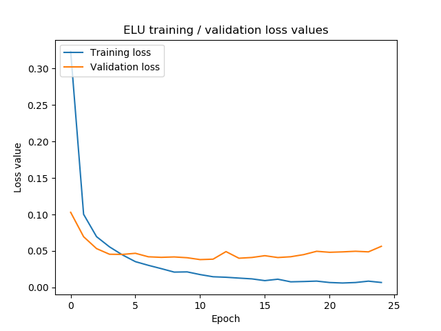
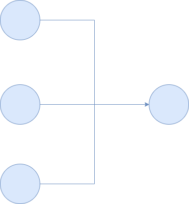
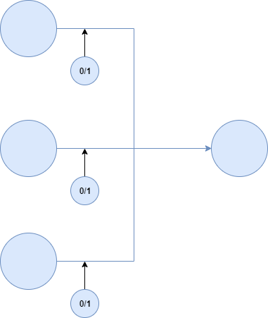

When training neural networks, your goal is to produce a model that performs really well.

This makes perfect sense, as there's no point in using a model that does not perform.

However, there's a relatively narrow balance that you'll have to maintain when attempting to find a _perfectly well-performing model_.

It's the balance between _underfitting_ and _overfitting_.

In order to avoid underfitting (having worse than possible predictive performance), you can continue training, until you experience the other problem - overfitting, a.k.a. being too sensitive to your training data. Both hamper model performance.

Sometimes, the range in which your model is not underfit nor overfit is really small. Fortunately, it can be extended by applying what is known as a _regularizer_ - a technique that regularizes how your model behaves during training, to delay overfitting for some time.

Dropout is such a regularization technique. In this blog post, we cover it, by taking a look at a couple of things. Firstly, we dive into the difference between underfitting and overfitting in more detail, so that we get a deeper understanding of the two. Secondly, we introduce Dropout based on academic works and tell you how it works. Thirdly, we will take a look at whether it really works, by describing the various experiments done with this technique. Finally, we will compare traditional Dropout with Gaussian Dropout - and how it changes training your model.

Ready? Let's go! 😎

\[toc\]

## How well does your model perform? Underfitting and overfitting

Let's first take a look at what underfitting and overfitting are.

When starting the [training process](https://www.machinecurve.com/index.php/2019/10/04/about-loss-and-loss-functions/#the-high-level-supervised-learning-process), the weights of your neurons are likely initialized at random or with some other initialization strategy. This means that the error rate, or loss value, will be very high during the first few epochs. Take a look at this diagram, where the loss decreases very rapidly during the first few epochs:

When both the training loss and the validation decrease, the model is said to be **underfit:** it can still be trained to make better predictions, i.e. to gain in its _predictive power_.

The action to undertake then is to continue training.

However, this cannot continue forever. Optimizing a model involves generating validation predictions with your validation data, resulting in loss values and gradients for optimization, which is then performed. Unfortunately, this means that _some of the ideosyncrasies of the data are leaked into the model weights_. That is, since the data is a sample rather than a full population, it is always slighty different than the full population it represents. When you optimize the model for hundreds of epochs with this data, you'll always get an offset with respect to this true population.

If you would continue training, your model would adapt more and more to those ideosyncrasies, making it less suitable for data it has never seen before - i.e., other samples from the population. The model is then said to be **overfit:** it is too well-adapted to the training and validation data.

Overfitting can be detected on plots like the one above by inspecting the validation loss: when it goes up again, while the training loss remains constant or decreases, you know that your model is overfitting. As you can see, the ELU powered network in the plot above has started overfitting very slightly.

Both underfitting and overfitting are to be avoided, as your model will perform worse than it could perform theoretically. Fortunately, certain techniques - called regularizers - can be used to reduce the impact of overfitting. **Dropout** is one of them - and we will cover it in this blog. Let's begin by analyzing what Dropout is, what it does and how it works.

## What is Dropout and how does it work?

In their paper ["Dropout: A Simple Way to Prevent Neural Networks from Overfitting"](http://jmlr.org/papers/v15/srivastava14a.html), Srivastava et al. (2014) describe the _Dropout_ technique, which is a stochastic regularization technique and should reduce overfitting by (theoretically) combining many different neural network architectures.

With Dropout, the training process essentially drops out neurons in a neural network. They are temporarily removed from the network, which can be visualized as follows:

Note that the connections or synapses are removed as well, and that hence no data flows through these neurons anymore.

...but only very briefly! This process repeats every epoch (or even every minibatch! - Srivastava et al. 2014) and hence sampling thinned networks happens very often. This should lead to significantly lower generalization error rates (i.e., overfitting), as "the presence of neurons is made unreliable" (Srivastava et al., 2014).

This removal of neurons and synapses during training is performed at random, with a parameter \[latex\]p\[/latex\] that is tunable (or, given empirical tests, best set to 0.5 for hidden layers and close to 1.0 for the input layer). This effectively means that, according to the authors, the "thinned" network is sampled from the global architecture, and used for training.

At test time, "it is not feasible to explicitly average the predictions from exponentially many thinned models" (Srivastava et al., 2014). That's true: it would become a computational burden when hundreds of thousands of epochs/minibatches have to be averaged, especially when networks become really large.

Fortunately, there is a solution - which is simple, but produces the same result. By using one neural network, where the weight outputs are scaled down according to the \[latex\]p\[/latex\] with which a unit was retained during training. This means that the expected output at training time is the same as the true output at test time, resolving the computational issue and making Dropout usable in practice.

### Bernoulli variables

Let's now take a look at how Dropout works mathematically. Don't worry, we don't bury you with maths, but instead we'll try to take a very intuitive point of view.

Very simplistically, this is how a neuron receives its input: e.g. three upstream neurons in a three-neuron Dense layer send their outputs to the next layer, where it is received as input. Note that for the sake of simplicity we omit the bias values here.

Normal neuron (assumed to be without bias)

It is very simple to go from here to a Dropout neuron, which looks as follows:

Dropout neuron (assumed to be without bias)

Mathematically, this involves so-called Bernoulli random variables:

> In probability theory and statistics, the Bernoulli distribution, named after Swiss mathematician Jacob Bernoulli, is the discrete probability distribution of a random variable which takes the value 1 with probability \[latex\]p\[/latex\].
> 
> [Wikipedia on the Bernoulli distribution](https://en.wikipedia.org/wiki/Bernoulli_distribution)

To create Dropout, Srivastava et al. (2014) attached Bernoulli variables to the network's neurons (by multiplying them with neural outputs), "each of which \[have\] probability \[latex\]p\[/latex\] of being 1". The \[latex\]p\[/latex\] value here is selected by the machine learning engineer, usually based on some validation set, or naïvely set to 0.5.

Inside the network, the Bernoulli variable and its value of 1 or 0 determines whether a neuron is 'dropped out' during this epoch or minibatch feedforward operation. This, in effect, leads to the 'thinned network' that Srivastava et al. (2014) talk about.

### Why could Dropout reduce overfitting?

You may now wonder: why does Bernoulli variables attached to regular neural networks, making the network thinner, reduce overfitting?

For the answer to this question, we will have to take a look at how neural networks are trained.

Usually, backpropagation and [gradient descent](https://www.machinecurve.com/index.php/2019/10/24/gradient-descent-and-its-variants/) or a [similar optimizer](https://www.machinecurve.com/index.php/2019/11/03/extensions-to-gradient-descent-from-momentum-to-adabound/) is used for this purpose. Given a [loss value](https://www.machinecurve.com/index.php/2019/10/04/about-loss-and-loss-functions/), so-called 'gradients' are computed which the optimizer then processes into the network's weights. By using these gradients (with respect to the error rate) to change the weights, the network likely performs slightly better during the next iteration of the training process.

Computing the gradient is done _with respect to the error_, but also _with respect to what all other units are doing_ (Srivastava et al., 2014). This means that certain neurons, through changes in their weights, may fix the mistakes of other neurons. These, Srivastava et al. (2014) argue, lead to complex co-adaptations that may not generalize to unseen data, resulting in overfitting.

Dropout, then, prevents these co-adaptations by - as we wrote before - _making the presence of other hidden \[neurons\] unreliable_. Neurons simply cannot rely on other units to correct their mistakes, which reduces the number of co-adaptations that do not generalize to unseen data, and thus presumably reduces overfitting as well.

## Training neural nets with Dropout

Training neural networks to which Dropout has been attached is pretty much equal to training neural networks without Dropout. [Stochastic gradient descent](https://www.machinecurve.com/index.php/2019/10/24/gradient-descent-and-its-variants/) or [similar optimizers](https://www.machinecurve.com/index.php/2019/11/03/extensions-to-gradient-descent-from-momentum-to-adabound/) can be used. The only difference, as reported by Srivastava et al. (2014), can be found when using a mini-batch approach: rather than per epoch, thinned networks are sampled per minibatch.

Additionally, methods that improve classic SGD - like [momentum](https://www.machinecurve.com/index.php/2019/11/03/extensions-to-gradient-descent-from-momentum-to-adabound/#momentum) - can be used as well, and show similar improvements as with regular neural networks (Srivastava et al., 2014).

What the authors also found to be useful during training is applying _max-norm regularization_, which means constraining the norm of the incoming weight to be bounded by some maximum value \[latex\]c\[/latex\]. This value must be set by the engineer upfront, and determined using a validation set (Srivastava et al., 2014).

Combining Dropout with max-norm regularization improves performance compared to using Dropout alone, but the authors reported even better results when Dropout and max-norm regularization are combined with two other things:

- Large, decaying learning rates.
- High momentum.

According to Srivastava et al. (2014), this can possibly be justified by the following arguments:

1. Constraining weight vectors makes it possible to use large learning rates without [exploding weights](https://www.machinecurve.com/index.php/2019/08/30/random-initialization-vanishing-and-exploding-gradients/).
2. Dropout noise plus large learning rates then help optimizers "to explore different regions of the weight space that would have otherwise been difficult to reach".
3. Decaying the learning rate then slows down the jumpiness of the exploration process, eventually "settling into a minimum".
4. High momentum allows the network to overcome local minima, increasing the likelihood that the global minimum is found.

## Does dropout _actually_ work? Experimental results

With any improvement in machine learning, it's nice to have a theoretical improvement - but it's also important to test whether it really works. Srivastava et al. (2014) performed multiple tests to find out whether Dropout works. Firstly, they used various standard datasets (such as the MNIST dataset) to test whether Dropout improves model performance across a wide range of classification problems.

Secondly, they checked how it performed with a variety of other regularizers (yielding the insight that max-norm regularization together with Dropout works best - but let's take a look at these results in more detail later), and thirdly, Srivastava et al. (2014) investigated which dropout rates (i.e., which parameter \[latex\]p\[/latex\]) work best and how data size impacts Dropout performance. Let's take a look!

Samples from the MNIST dataset

### Dropout vs no dropout on standard datasets

The authors tested Dropout vs No Dropout on these standard datasets (Srivastava et al., 2014):

- The **MNIST** dataset, which contains thousands of handwritten digits;
- The **TIMIT** speech benchmark dataset for clean speech recognition.
- The **CIFAR-10** and **CIFAR-100** datasets, containing tiny natural images in 10 and 100 classes.
- The **Street View House Numbers** (SVHN) dataset,w ith images of house numbers collected from Google Street View.
- The **ImageNet** dataset, which contains many natural images.
- The **Reuters RCV1** newswire articles dataset. This is a text dataset rather than an image dataset.

Samples from the CIFAR10 dataset

For all datasets, Dropout improved the generalization power of the model. On MNIST, drastically different test errors could be reported, with substantial improvements for all the different architectures that were tested.

Dropout also outperforms regular neural networks on the ConvNets trained on CIFAR-100, CIFAR-100, and the ImageNet datasets.

For the SVHN dataset, another interesting observation could be reported: when Dropout is applied on the convolutional layer, performance also increases. According to the authors, this is interesting, because before, these layers were assumed not to be sensitive to overfitting because they do not have many parameters (Srivastava et al., 2014). It is argued that adding Dropout to the Conv layers provides noisy inputs to the Dense layers that follow them, which prevents _them_ further from overfitting.

Finally, Dropout works on the TIMIT speech benchmark datasets and the Reuters RCV1 dataset, but here improvement was much smaller compared to the vision and speech datasets.

### Dropout vs no dropout with other regularizers

Now that the authors knew that Dropout scales well across a variety of machine learning problems, they investigated it further: _how does it perform with respect to other regularizers?_

Several regularizer methods were tested for preventing overfitting:

- L2 weight decay;
- Lasso;
- KL sparsity;
- Max-norm regularization.

Srivastava et al. (2014) found that when combined with max-norm regularization, Dropout gives even lower generalization errors. In fact, it provided the lowest error reported, followed - at some distance - by Dropout + L2 regularization, and finally the others.

Hence, when applying Dropout, it might also be a good idea to perform max-norm regularization at the same time.

### When does Dropout work best? About Dropout rate and Dataset size

Another question they tried to answer: does the _dropout rate_ (i.e., the \[latex\]p\[/latex\] parameter) and/or _dataset size_ impact the performance of Dropout and the neural networks it is attached to?

The question must be answered with **yes**.

#### What is the best value for \[latex\]p\[/latex\]?

First, the parameter \[latex\]p\[/latex\]. By now, we can recall that it is tunable, and must in fact be set up front by the machine learning engineer. The fact that it is tunable leads to the same errors as why [fixed learning rates aren't a good idea](https://www.machinecurve.com/index.php/2019/11/11/problems-with-fixed-and-decaying-learning-rates/): you simply don't know which \[latex\]p\[/latex\] fits the data best.

Hence, the authors argue, selecting a value for \[latex\]p\[/latex\] must be done by some initial tests with a validation set.

They did so as well - in order to see whether interesting patterns could be found.

And they did find such a pattern: across multiple scenarios, a value of \[latex\]p \\approx 0.5\[/latex\] for the hidden layers seems to result in the best performance when applying Dropout (Srivastava et al., 2014). This is true for all layers except the input one, where \[latex\]p\[/latex\] must be \[latex\]\\approx 1.0\[/latex\]. The latter is presumably the case because the input layer takes the input data, and it's difficult to find patterns when data is dropped at random.

#### How does Dropout perform with respect to dataset size?

According to the authors, a "good regularizer makes it possible to get a good generalization error from models with a large number of parameters trained on small data sets". That is, it performs really well on data it has not seen before - even when trained with small data.

In order to find whether Dropout regularizes well across various dataset sizes, Srivastava et al. (2014) performed tests with various sizes on the MNIST dataset. The sizes were as follows: "100, 500, 1K, 5K, 10K and 50K chosen randomly from the MNIST training set" (Srivastava et al., 2014).

The authors found that there is a trade-off between when Dropout is necessary, and when it's no longer useful. First, to cover the case where the dataset is extremely small: even Dropout does not improve performance in that case, simply because the dataset size is too small. The same is true for datasets that are large enough: Dropout then does no longer improve the model, but rather, model performance gets worse.

Hence, there exists a sweet spot, when Dropout is necessary and when it's smart not to use it (or to increase dataset size). According to Srivastava et al. (2014), there are no heuristics to determine this size; rather, it must be determined with a validation set.

## Gaussian Dropout: Gaussian instead of Bernoulli variables

We recall from above that Dropout works with Bernoulli variables which take 1 with probability \[latex\]p\[/latex\] and 0 with the rest, being \[latex\]1 - p\[/latex\].

This idea can be generalized to multiplying the activations with random variables from other distributions (Srivastava et al., 2014). In their work, Srivastava et al. found that the Gaussian distribution and hence Gaussian variables work just as well - and perhaps even better.

Applying Gaussian variables can be done in a similar way: thinning networks at training time, and using weighted activations at test and production time (as with regular Dropout). However, the authors choose to use Gaussian Dropout differently - i.e., multiplicatively. Instead of thinning and weighting, Gaussian Dropout is weighted at training time, when activated values that are not dropped are multiplied by \[latex\]1/p\[/latex\] instead of \[latex\]1\[/latex\] (with regular Bernoulli Dropout). They are not modified at test time. This equals the previous scenario.

Gaussian Dropout must be configured by some \[latex\]\\sigma\[/latex\], which in Srivastava et al.'s experiments was set to \[latex\]\\sqrt{(1-p)/p}\[/latex\], where \[latex\]p\[/latex\] is the configuration of the Bernoulli variant (i.e., in naïve cases \[latex\]p \\approx 0.5\[/latex\] for hidden layers and \[latex\]\\approx 1.0\[/latex\] for the input layer).

## Summary

In this blog post, we looked at overfitting - and how to avoid it, with Dropout. By looking at what it is, how it works, and _that it works_, we found that it is an interesting technique for application in your deep learning models.

I hope you've learnt something today - something useful to your ML models 😀 If you did, or when you have questions, please do not hesitate to leave a comment below ⬇! When possible, I'll answer your questions 😊

Thank you for reading MachineCurve today and happy engineering! 😎

## References

Srivastava, N., Hinton, G., Krizhevsky, A., Sutskever, I., & Salakhutdinov, R. (2014, June 15). Dropout: A Simple Way to Prevent Neural Networks from Overfitting. Retrieved from [http://jmlr.org/papers/v15/srivastava14a.html](http://jmlr.org/papers/v15/srivastava14a.html)

Wikipedia. (2003, March 20). Bernoulli distribution. Retrieved from [https://en.wikipedia.org/wiki/Bernoulli\_distribution](https://en.wikipedia.org/wiki/Bernoulli_distribution)
