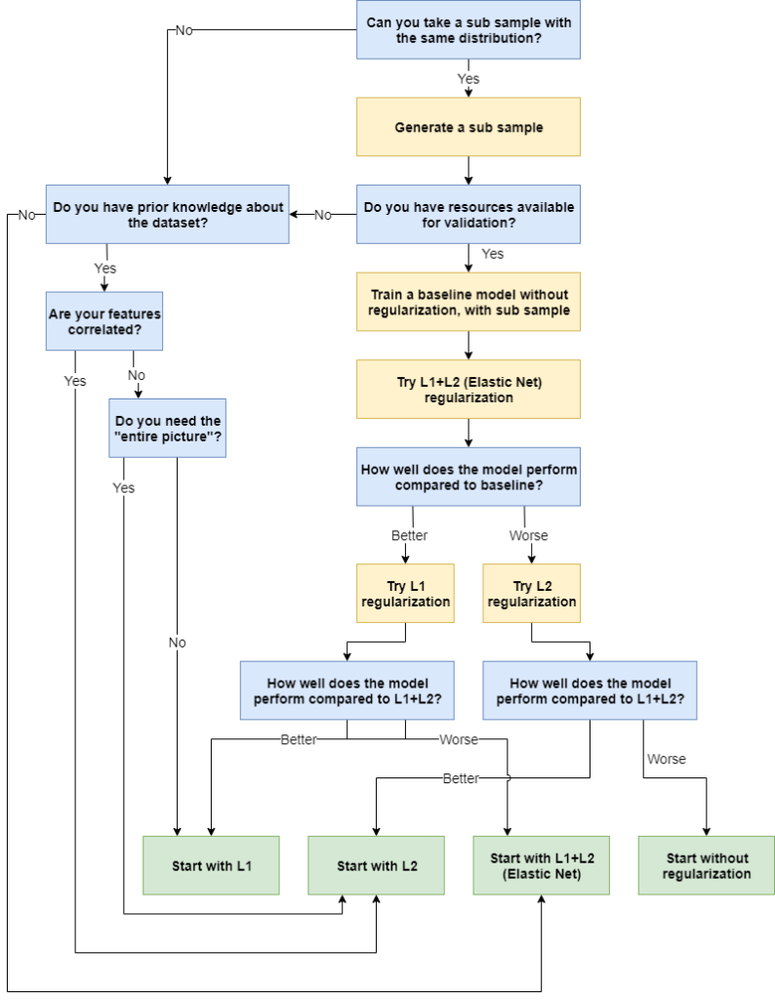
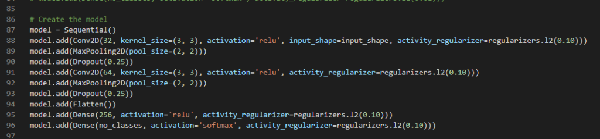

There are three widely known regularization techniques for neural networks: L1 (or Lasso) regularization, L2 (or Ridge) regularization and Elastic Net regularization, which combines the two, and is also called L1+L2.

But which regularizer to use in your neural network? Especially for larger machine learning projects and for people who just started with machine learning, this is an often confusing element of designing your neural network.

In this blog post, I will try to make this process easier, by proposing a simple flowchart for choosing a regularizer for your neural network. It's based both on my experience with adding regularizers as well as what theory suggests about picking a regularization technique. If you have any suggestions, improvements or perhaps extensions, please _feel free to share your experience by leaving a comment at the bottom of the page!_ 😊💬 Based on your feedback, we can improve the flowchart together.

The structure of this blog post is as follows. Firstly, we'll take a brief look at the basics of regularization - for starters, or for recap, if you wish. This includes a brief introduction to the L1, L2 and Elastic Net regularizers. Then, we continue with the flowchart - which includes the steps you could follow for picking a regularizer. Finally, we'll discuss each individual step in more detail, so that you can understand the particular order and why these questions are important.

Are you ready? Let's go! 😎

_PS:_ If you wish to understand regularization or how to use regularizers with Keras in more detail, you may find these two blogs interesting as well:

- [What are L1, L2 and Elastic Net Regularization in neural networks?](https://www.machinecurve.com/index.php/2020/01/21/what-are-l1-l2-and-elastic-net-regularization-in-neural-networks/)
- [How to use L1, L2 and Elastic Net Regularization with Keras?](https://www.machinecurve.com/index.php/2020/01/23/how-to-use-l1-l2-and-elastic-net-regularization-with-keras/)

* * *

\[toc\]

* * *

## The basics of regularization

Before we move on to my answer to the question _which regularizer do I need_, I think it's important to take one step back and look at the basics of regularization first. Through these basics, you'll likely understand the flowchart in a better way. If you already know a thing or two about regularizers, feel free to skip this part and directly move on to the flowchart.

Here, we'll cover these things:

- Why a regularizer could be necessary for your machine learning project;
- L1 Regularization;
- L2 Regularization;
- Elastic Net (L1+L2) Regularization.

### Why a regularizer could be necessary

Firstly, let's take a look at why we need a regularizer in the first place. Suppose that we have a few data points from which we learn a regression model using a neural network:

Which learnt mapping - i.e., the learnt function which maps the input data to the output data - would likely scale better to unseen data, the light blue one or the orange one? Obviouly, this depends on your data, but let's add a little bit of context: the data covers the weekly income versus the weekly net expense of a bank.

In that case, it's very unlikely that the light blue function is what we're looking for. The orange one looks quite nice though, and may even be representative of the actual real world pattern.

Unfortunately, training a machine learning model is a continuous balance between underfitting and overfitting, trying to find the sweet spot between a model that can be _better_ in terms of predicting versus a model that _predicts too well_... for the training data, producing worse results for the data it hasn't seen yet. Especially when your model overfits, you'll see light blue-like curves starting to appear. You want to avoid this!

One way of doing so is by applying a regularizer to your model. A regularizer, by means of inclusion in the loss value that is minimized, punishes the model for being _too complex_. That is, it penalizes the states where the weights of your neural networks have too large and ideosyncratic values. This way, your weights remain simple, and you may find that the sensitivity of your model to overfitting is reduced.

### Common regularizers

Now, which regularizers are out there? Let's take a look at the most common ones that are available for your machine learning projects today: L1, L2 and Elastic Net Regularization. [Click here if you want to understand the regularizers in more detail.](https://www.machinecurve.com/index.php/2020/01/21/what-are-l1-l2-and-elastic-net-regularization-in-neural-networks/)

#### L1 Regularization

First of all, L1 Regularization, which is also called Lasso Regularization. By computing and summating the absolute values of weights, the so-called Taxicab norm (or L1 norm) is added to the loss value. This norm, which tells you something about the absolute distance across all dimensions that must be traveled from the origin to the tip of the weights vector, helps you to achieve simple models. What's more, because of the structure of the derivative (which produces constant values), weights that do not contribute sufficiently to the model essentially "drop out", as they are forced to become zero.

#### L2 Regularization

Secondly, there is L2 Regularization (a.k.a. Ridge Regularization), which is based on the summated squares of the weights. Although it does enforce simple models through small weight values, it doesn't produce sparse models, as the derivative - \[latex\]2x\[/latex\] - produces smaller and smaller gradients (and hence changes) when \[latex\]x\[/latex\] approaches zero. It can thus be useful to use L2 if you have correlative data, or when you think sparsity won't work for your ML problem at hand.

#### Elastic Net Regularization

When you combine L1 and L2 Regularization, you get Elastic Net Regularization. As you can see, depending on some hyperparameter (or two, if you don't combine the lambdas into the single alpha parameter) that can be configured by the machine learning engineer, it takes the shape of L1, or L2, or something in between. If you don't know which regularizer to apply, it may be worthwhile to try Elastic Net first, especially when you think that regularization may improve model performance over no regularization.

* * *

## Picking a regularizer - a flowchart

Now that we have identified the three most common regularizers, here's a flowchart which can help you determine the regularizer that may be useful to your project. I always use these questions to help choose one:

- Can you take a subsample that has the same distribution as the main sample?
- Do you have resoures available for validation?
    - If so, how do the validation experiments perform?
- Do you have prior knowledge about your dataset?
    - Are your features correlated?
    - If not, do you need the "entire picture"?

In the next section, we'll analyze these questions individually, using more detail.

Now, here's the flowchart. Blue means that _a_ _question_ must be answered, yellow means that _an action_ must be taken, and green means that you've arrived at an _outcome_.

* * *

## Question to outcome - dissecting the flowchart

Let's now take a look at how we constructed the flow chart - and why I think that these questions help you choose a regularizer for your machine learning project.

### Question 1: Can you take a sub sample with the same distribution?

Taking a sub sample of your dataset allows you to perform validation activities, i.e. to pick a likely adequate regularizer by testing up front. However, here, it's important to ensure that your sub sample has the same distribution (i.e. sample mean and sample variance) as the entire sample. This way, it will be most likely that good results achieved through validation generalize to the real training scenario.

#### Yes - take a sub sample and move to question 2

When you can take a sub sample with the same distribution, that would be preferred, as it opens the path to empirically determining which regularizer works best.

[Here is an algorithm that can be used for generating the sub sampl](https://maxhalford.github.io/blog/subsampling-a-training-set-to-match-a-test-set---part-1/)[e](https://maxhalford.github.io/blog/subsampling-a-training-set-to-match-a-test-set---part-1/)[.](https://maxhalford.github.io/blog/subsampling-a-training-set-to-match-a-test-set---part-1/)

#### No - move on to question 3

It may be the case that you cannot take a sub sample from your dataset. For example, it may be too much of a hassle. In that case, let's move on to question 2, where the goal is to find out a possible starting point based on theoretical knowledge and/or assumptions about your dataset.

### Question 2: Do you have resources available for testing?

If you can generate a sub set of your data that has approximately the same distribution as your whole data set, you can use it to validate certain choices with respect to regularizers. Validating your choice and your assumptions may save you quite some resources later. However, this requires you to answer one question in particular:

Do you have resources available for those validation activities?

It's more of a business related question than a technical one. It isn't difficult to spawn an instance in the cloud with a well-performing GPU, nor is it to use your own dedicated one if available. However, do you have the time? What does it mean for project costs? Those questions need to be answered.

_Adding L2 Regularization to a Keras model._

#### Yes - baseline & first regularizer

If you can answer them positively, it's time to start some validation activities. First of all, you'll need a baseline model, with which you can compare the effects of training models with a regularizer. Quite unsurprisingly, such a baseline model could be one where no regularization is applied. Hence, the first step is to train such a baseline model with your sub sample. Do make sure to evaluate it with testing data as well, to see how well it generalizes.

Afterwards, the validation process can start. I always think it's best to start with Elastic Net based regularization here, as it combines L1 and L2. Apply it to the layers of your choice, set the hyperparameters \[latex\]\\lambda\_1\[/latex\] and \[latex\]\\lambda\_2\[/latex\] (or \[latex\]\\alpha\[/latex\], depending on your approach), and train the model - once again with your sub sample. After training, make sure to generate evaluation metrics as well. Then, you might play around a bit in terms of settings and retrain for a couple of times, but depending on the results this might be not even necessary. Move on to question 4.

#### No - move on to question 3

If you can generate a sub sample but don't have resources available for validation, it's best to move to question 3. Here, we'll try to decide which regularizer it's best to start with based on possible assumptions and prior knowledge about your dataset.

### Question 3: Do you have prior knowledge about the dataset?

Even if you cannot generate a sub sample or perform validation activities, it may be possible to determine a starting point regarding the regularizer that is to be applied. This involves answering two questions:

- Are your features correlated?
- Do you need the "entire picture"?

Next, I'll explain them in more detail, so that you'll know how to answer them :)

#### Are your features correlated?

Say that you are training a classification model where your features are correlated. For example, in the case of health measurements that may predict the onset of diabetes in five years, a model can be trained that either tells you that the patient is or is not sensitive to diabetes five years from now.

Likely, features such as Body Mass Index (BMI), fat percentage and blood pressure correlate to some extent. In this case, they provide predictive information individually, but their _interrelationships_ also contribute to the outcome - i.e., whether a person will develop diabetes or not.

Hence, they cannot simply be dropped out when training the model. So if your answer to the question "are your features correlated?" is yes, it's highly unlikely that applying L1 Regularization will help you achieve better results. By consequence, the same is true for L1+L2 (Elastic Net) Regularization. Hence, in this case, it's best to start with L2 regularization.

If the answer is "no", let's take a look at the next question.

#### Do you need the "entire picture"?

Suppose that you don't have features which describe individual variables, such as when you're using image and video datasets. For example, the images below are samples from the [EMNIST dataset](https://www.machinecurve.com/index.php/2020/01/10/making-more-datasets-available-for-keras/), which means that they are 28 x 28 pixel images with only 1 image channel. By consequence, the number of features present is 28 x 28 = 784. But does each feature tell something about a variable?

Nope.

_Sample letters from the [EMNIST dataset](https://www.machinecurve.com/index.php/2020/01/10/making-more-datasets-available-for-keras/)._

Do we need the "entire picture" - and in this case, literally, the entire picture?

Likely - yes.

If you need the entire picture, in my experience, it may not be worthwhile to apply L1 Regularization, due to its effect on sparsity. Hence, if the answer to this question is "yes", you may also wish to start with L2 Regularization. From there, you may experiment with other regularizers.

If the answer to this question is "no", I'd recommend L1 Regularization as a starting point.

### Question 4: How well does L1+L2 perform on the baseline model?

All right, let's take a look at the fourth and final question. You're likely here because you were able to (1) generate a sub sample with a similar or equal distribution and (2) have resources available for validation. Then, you trained a baseline model (likely without regularization) and then validated the Elastic Net (or L1+L2) regularizer.

The question to be answered is: does it perform better or worse on the baseline model?

#### Better: validate with L1 regularization

If L1+L2 regularization performs better, it's worth a try to perform regularization with L1 alone. If you're here, these are the steps forward:

- Retrain your validation model, but this time use L1 Regularization only;
- If it performs better, your preferred starting point would be L1 Regularization;
- Otherwise, the preferred starting point would be to apply Elastic Net (L1+L2) Regularization during training with your entire data set.

#### Worse: validate with L2 regularization

In my experience, if the L1+L2 regularizer performs worse compared to the no-regularization-baseline model, then one of these assumptions is _false_:

- The features don't correlate;
- You don't need the entire picture.

Or, in short: in my experience, it's likely the L1 Regularizer component that produces pretty bad performance. Now, these are the steps forward:

- Retrain your validation model, but this time use L2 Regularization only.
- If the retrained model performs _better_, your preferred starting point would be L2 Regularization.
- If it performs _worse_, the starting point would be to apply no regularization at all.

* * *

## Summary

Which regularizer to apply when training your neural network entirely depends on the data at hand, and some other conditions. In this blog post, we looked at this question in more detail. Through a flowchart, and a more detailed discussion on its individual components, I hope this blog sheds more light on the decision that must be made by a ML engineer every now and then.

If you did learn something today, please leave a comment in the comments box below - I'd appreciate it! 😊 However, make sure to do the same if you disagree with elements of this blog post, as they generally describe my working process - which does not necessarily have to be the right one! I'll happily improve this blog post and learn from your experience :)

Thank you for reading MachineCurve today and happy engineering! 😎

* * *

## References

MachineCurve. (2020, January 21). What are L1, L2 and Elastic Net Regularization in neural networks? Retrieved from [https://www.machinecurve.com/index.php/2020/01/21/what-are-l1-l2-and-elastic-net-regularization-in-neural-networks/](https://www.machinecurve.com/index.php/2020/01/21/what-are-l1-l2-and-elastic-net-regularization-in-neural-networks/)

MachineCurve. (2020, January 23). How to use L1, L2 and Elastic Net Regularization with Keras? Retrieved from [https://www.machinecurve.com/index.php/2020/01/23/how-to-use-l1-l2-and-elastic-net-regularization-with-keras/](https://www.machinecurve.com/index.php/2020/01/23/how-to-use-l1-l2-and-elastic-net-regularization-with-keras/)
