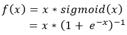

Neural networks are composed of various layers of neurons. Mathematically, a neuron is nothing but the dot product between the weights vector **w** and the input vector **x**, yielding a scalar value that is passed on to the next layer.

Except that it isn't.

If we would pass the scalar value, the model would behave as if it is a [linear one](https://www.machinecurve.com/index.php/2019/06/11/why-you-shouldnt-use-a-linear-activation-function/). In fact, it would only be able to produce linear decision boundaries between the classes you're training the model for. To extend neural network behavior to non-linear data, smart minds have invented the _[activation function](https://machinecurve.com/index.php/2019/09/04/relu-sigmoid-and-tanh-todays-most-used-activation-functions/#what-is-an-activation-function)_ - a function which takes the scalar as its input and maps it to another numerical value. Since activation functions can be non-linear, neural networks have acquired the capability of handling non-linear data. In many applications, the results have been impressive. In this blog, we'll study today's commonly used activation functions and inspect a relatively new player... the Swish activation function. Does it perform better and if so, why is that the case?

**Update February 2020** - Added links to other MachineCurve blogs and processed small spelling improvements.

\[toc\]

\[ad\]

## Today's activation functions

In the machine learning community, three major activation functions are used today.

First, there is the **tanh** activation function. It can be visualized as follows. Clearly, one can see that the entire domain (-∞, ∞) is mapped to a range of (-1, 1).

Second, there is the **sigmoid** or _softstep_ activation function. Its visualization goes as follows.

The shape of this function is really similar, but one noticeable difference is that the (-∞, ∞) domain is mapped to the (0, 1) range instead of the (-1, 1) range.

Finally, the most prominently activation function used today is called Rectified Linear Unit or **ReLU**. All inputs x < 0 are mapped to 0, zeroing out the neuron, whereas for inputs x >= 0 ReLU is linear. It looks as follows.

Those activation functions all have their own [benefits and disbenefits](https://machinecurve.com/index.php/2019/09/04/relu-sigmoid-and-tanh-todays-most-used-activation-functions/). This primarily has to do with how neural networks are optimized - i.e., through [gradient descent](https://www.machinecurve.com/index.php/2019/10/24/gradient-descent-and-its-variants/). That is, the gradient is computed with respect to the neural weights, after which the weights are altered based on this gradient and the learning rate.

\[ad\]

The derivative of any function at x is simply another function whose input is mapped to another numeric value. We can explain the benefits and disbenefits by visualizing the derivatives of those three activation functions below.

Now, the deep learning community often deals with two types of problems during training - the [vanishing gradients problem and the exploding gradients](https://machinecurve.com/index.php/2019/08/30/random-initialization-vanishing-and-exploding-gradients/) problem. In the first, the backpropagation algorithm, which chains the gradients together when computing the error backwards, will find _really small gradients_ towards the left side of the network (i.e., farthest from where error computation started). This problem primarily occurs with the Sigmoid and Tanh activation functions, whose derivatives produce outputs of 0 < x' < 1, except for Tanh which produces x' = 1 at x = 0. When you chain values that are smaller than one, such as 0.2 \* 0.15 \* 0.3, you get really small numbers (in this case 0.009). Consequently, when using Tanh and Sigmoid, you risk having a suboptimal model that might possibly not converge due to vanishing gradients.

ReLU does not have this problem - its derivative is 0 when x < 0 and is 1 otherwise. 1x1x1 = 1 and 1x1x0x1 = 0. Hence, no vanishing gradients. What's more, it makes your model sparser, since all gradients which turn to 0 effectively mean that a particular neuron is zeroed out.

Finally, it is computationally faster. Computing this function - often by simply maximizing between (0, x) - takes substantially fewer resources than computing e.g. the sigmoid and tanh functions. By consequence, ReLU is the de facto [standard activation function](https://www.machinecurve.com/index.php/2020/01/24/overview-of-activation-functions-for-neural-networks/) in the deep learning community today.

\[ad\]

## The Swish activation function

Nevertheless, it does not mean that it cannot be improved. In October 2017, Prajit Ramachandran, Barret Zoph and Quoc V. Le from Google Brain proposed the [Swish activation function](https://arxiv.org/pdf/1710.05941v1.pdf). It is a relatively simple function: it is the multiplication of the input x with the sigmoid function for x - and it looks as follows.

Upon inspection of this plot your probable first guess is that it looks a lot like ReLU. And that's not a poor guess. Instead, it _does_ look like the de facto standard activation function, with one difference: the domain around 0 differs from ReLU.

Swish is a smooth function. That means that it does not abruptly change direction like ReLU does near x = 0. Rather, it smoothly bends from 0 towards values < 0 and then upwards again.

This observation means that it's also non-monotonic. It thus does not remain stable or move in one direction, such as ReLU and the other two activation functions. The authors write in their paper that it is in fact this property which separates Swish from most other activation functions, which do share this monotonicity.

## Why Swish could be better than ReLu

In their work, Ramachandran et al. write that their "extensive experiments show that Swish consistently matches or outperforms ReLU on deep networks applied to a variety of challenging domains such as image classification and machine translation".

This is interesting. Previously proposed replacements for ReLU have shown inconsistent results over various machine learning tasks. If Swish consistently matches or outperforms ReLU, as the authors claim ... well, that would make it a candidate for challenging ReLU at a global scale!

\[ad\]

The question that now remains is - if Swish often yields better results than ReLU does, why is that the case? The authors make various observations which attempt to explain this behavior:

- First, it is bounded below. Swish therefore benefits from sparsity similar to ReLU. Very negative weights are simply zeroed out.
- Second, it is unbounded above. This means that for very large values, the outputs do not saturate to the maximum value (i.e., to 1 for all the neurons). According to the authors of the Swish paper, this is what set ReLU apart from the more traditional activation functions.
- Third, separating Swish from ReLU, the fact that it is a smooth curve means that its output landscape will be smooth. This provides benefits when optimizing the model in terms of convergence towards the minimum loss.
- Fourth, small negative values are zeroed out in ReLU (since f(x) = 0 for x < 0). However, those negative values may still be relevant for capturing patterns underlying the data, whereas large negative values may be zeroed out (for reasons of sparsity, as we saw above). The smoothness property and the values of f(x) < 0 for x ≈ 0 yield this benefit. This is a clear win over ReLU.

The [original work on Swish](https://arxiv.org/pdf/1710.05941v1.pdf) provides very interesting benchmark results for common neural network architectures.

All in all, if you're feeling a little adventurous in your machine learning project, the Swish activation function may be a candidate for testing. Perhaps, you'll even improve your model in the process. Enjoy engineering!
