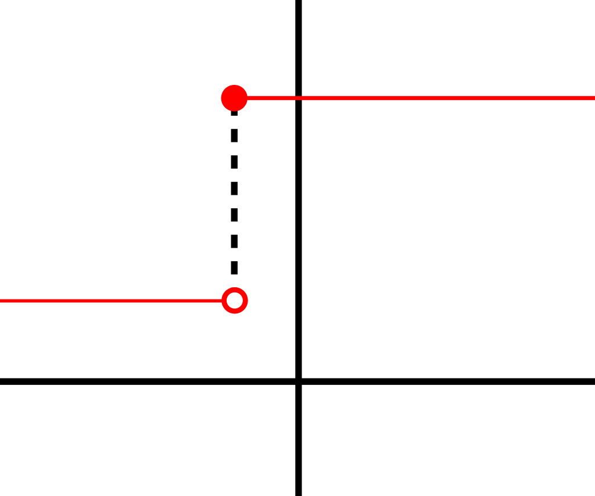

...and what to do about it!

It was January 1957 when a report was released by Cornell Aeronautical Laboratory. It was written by Frank Rosenblatt and titled _The Perceptron - a Perceiving and Recognizing Automaton_, which aimed to "formulate a brain analogue useful in analysis" (Rosenblatt, 1957).

In his work, he presented the [perceptron](https://machinecurve.com/index.php/2019/07/23/linking-maths-and-intuition-rosenblatts-perceptron-in-python/)\- a one-neuron neural network that would eventually lie at the basis of many further developments in this field.

Since I'm currently investigating historical algorithms _and_ because I use Keras on a daily basis for creating deep neural networks, I was interested in combining both - especially since I saw some blogs on the internet that had applied it too.

Rather unfortunately, I ran into trouble relatively quickly. And it all had to do with the fact that Keras to me seems unsuitable for creating the Perceptron - you can get close to it, but you cannot replicate it exactly.

Why?

That's what I will cover in this blog. First, I'm going to take a look at the internals of a perceptron. I cover how data is propagated through it and how this finally yields a (binary) output with respect to the preferred class. Subsequently, I'll try to replicate it in Keras ... until the point that you'll see me fail. I will then introduce the Perceptron Learning Rule that is used for optimizing the weights of the perceptron, based on one of my previous posts. Based on how deep neural networks are optimized, i.e. through Stochastic Gradient Descent (SGD) or a SGD-like optimizer, I will then show you why Keras cannot be used for single-layer perceptrons.

Finally, I will try to _get close_ to replication - to see what the performance of single-neuron networks _could_ be for a real-world dataset, being the Pima Indians Diabetes Database.

Let's hope we won't be disappointed!

**Update 02/Nov/2020:** made code compatible with TensorFlow 2.x.

* * *

\[toc\]

* * *

## Some intuition for a perceptron

Mathematically, a Rosenblatt perceptron can be defined as follows:

\[mathjax\]

\\begin{equation} f(x) = \\begin{cases} 1, & \\text{if}\\ \\textbf{w}\\cdot\\textbf{x}+b > 0 \\\\ 0, & \\text{otherwise} \\\\ \\end{cases} \\end{equation}

However, mathematics is useless unless you understand it - which in my opinion cannot be done without building _intuition_ and _visualization_. Only when you can visualize an equation, and thoroughly understand how it works, you can finally enjoy its beauty.

Therefore, let's precisely do that. This is a generic sketch of the perceptron as it is defined above:  
  


  
In the maths above, you noticed a weights vector `**w**` and an input vector `**x**` that are multiplied. Finally, a bias `b` is added. The class is one if this output is larger than zero. Otherwise, it picks the other class.

### Computing a dot product

Let's cover the first part - multiplying the vectors - first. When you do that, it's called a _dot product_. Computing one is actually really simple: the dot product is the sum of the multiplication of the individual vector elements. Visualized, that's `x1` multiplied by `w1`; `x2` and `w2`, et cetera - mathematically:

\\begin{equation} \\begin{split} z &= \\textbf{w}\\cdot\\textbf{x} \\\\ &=\\sum\_{i=1}^{n} w\_nx\_n \\\\ &= w\_1x\_1 + ... + w\_nx\_n \\\\ \\end{split} \\end{equation}

  
All these individual outputs are summated, as you can see. Subsequently, the bias value is added and the value is passed along to the 'gateway' (real name: unit step) function that assigns it either class 0 or class 1. The output passed to the unit step function looks as follows:

\\begin{equation} \\begin{split} z &= \\textbf{w}\\cdot\\textbf{x} + b \\\\ &=\\sum\_{i=1}^{n} w\_nx\_n + b \\\\ &= w\_1x\_1 + ... + w\_nx\_n + b \\\\ \\end{split} \\end{equation}

The step function:

\\begin{equation} f(x) = \\begin{cases} 1, & \\text{if}\\ \\textbf{w}\\cdot\\textbf{x}+b > 0 \\\\ 0, & \\text{otherwise} \\\\ \\end{cases} \\end{equation}

It is therefore one of the simplest examples of a binary classifier.

\[ad\]

## Let's code it - a Keras based perceptron

All right, let's see if we can code one. First ensure that you have all necessary dependencies installed, preferably in an Anaconda environment. Those dependencies are as follows:

- A clean Python installation, preferably 3.6+: [https://www.python.org/downloads](https://www.python.org/downloads/)
- Keras: `pip install keras`
- By consequence, TensorFlow: `pip install tensorflow` (go [here](https://medium.com/@soumyadipmajumder/complete-guide-to-tensorflow-gpu-installation-on-windows-10-36e5858640e9) if you wish to install the GPU version on Windows).
    - You may also wish to run it on Theano or CNTK, which are supported by Keras, but I only tested it with TF as a backend.
- Numpy: `pip install numpy`.
- Scipy: `pip install scipy`.

Create a new folder somewhere on your machine called `simple-perceptron`:


  

Open the folder and create one file: `model.py`.

### Dataset: Pima Indians Diabetes Database

We'll use the Pima Indians Diabetes Database as our dataset. It's a CC0 (or public domain) dataset that is freely available at [Kaggle](https://www.kaggle.com/uciml/pima-indians-diabetes-database). It can be described as follows:

> This dataset is originally from the National Institute of Diabetes and Digestive and Kidney Diseases. The objective of the dataset is to diagnostically predict whether or not a patient has diabetes, based on certain diagnostic measurements included in the dataset. Several constraints were placed on the selection of these instances from a larger database. In particular, all patients here are females at least 21 years old of Pima Indian heritage.
> 
> Source: [Kaggle](https://www.kaggle.com/uciml/pima-indians-diabetes-database)

  
All right, the first step would be to download the dataset, so let's do that first. Download the dataset to the same folder as `model.py` and call it `pima_dataset.csv`.

\[ad\]

### Loading dependencies and data

Now open `model.py` in a text editor or an IDE. First add the dependencies that you'll need:

```
# Load dependencies
from tensorflow.keras.models import Sequential
from tensorflow.keras.layers import Dense
import numpy as np
```

Then load your data:

```
# Load data
dataset = np.loadtxt('./pima_dataset.csv', delimiter=',')

# Separate train and test data
X = dataset[:, 0:8]
Y = dataset[:, 8]
```

What you do above is less difficult than it looks. First, you use the `numpy` library to use the Pima dataset, which is delimited (i.e. the columns are separated) by a comma. Indeed, when you open the CSV file, you'll see this:

```
6,148,72,35,0,33.6,0.627,50,1
1,85,66,29,0,26.6,0.351,31,0
8,183,64,0,0,23.3,0.672,32,1
1,89,66,23,94,28.1,0.167,21,0
0,137,40,35,168,43.1,2.288,33,1
...........and so on
```

Let's take the first row.

```
6,148,72,35,0,33.6,0.627,50,1
```

The numbers \[latex\]\\{6, 148, ..., 50\\}\[/latex\] represent the feature vector \[latex\]\\mathbf{x\_0} = \\{6, 148, 72, 35, 0, 33.6, 0.627, 50\\}\[/latex\]. This feature vector is part of your training set which is the Pima dataset - or \[latex\]\\mathbf{x\_0} \\in X\[/latex\].

There is however one value left: \[latex\]1\[/latex\]. This is actually the _desired outcome_, or the class to which this feature vector belongs. The total number of desired outcomes is 2, as the set is \[latex\]Y = \\{ 0, 1 \\}\[/latex\] or, in plainer English: \[latex\]Y = \\{ \\text{no diabetes}, \\text{diabetes} \\}\[/latex\]. Recall why this is the case: the objective of the Pima dataset is to "to diagnostically predict whether or not a patient has diabetes".

This also explains why you'll do this:

```
# Separate train and test data
X = dataset[:, 0:8]
Y = dataset[:, 8]
```

In Python, what you're writing for \[latex\]X\[/latex\] is this: for the entire `dataset`, take all rows (`:`) as well as columns 0 up to 8 (excluding 8). Assign the output to `X`. By consequence, `X` - or your set of feature vectors - therefore contains the _actual features_, excluding the targets (which are in column 8).

Obviously, it's now easy to understand what happens for the desired outcomes or target set `Y`: you'll take the 8th column for all rows.

Next, create the model and add your Perceptron, which is a Dense layer:

```
# Create the Perceptron
model = Sequential()
model.add(Dense())
```

### Problems!

I now got confused. The [Keras docs](https://keras.io/layers/core/) wanted me to specify an _activation function_ and an _initializer_.

\[ad\]

So I started looking around for clues, and then I found this:

> Based on that, gradient descent can't be used for perceptrons but can be used for conventional neurons that uses the sigmoid activation function (since the gradient is not zero for all x).
> 
> Source: [Yahia Zakaria, StackOverflow](https://stackoverflow.com/a/40758135), or (Zakaria, 2016).

  
Today's neural networks, which are supported by Keras, apparently use an entirely different method for optimization, I found. Whereas the Rosenblatt Perceptron updates the weights by pushing them slightly into the right direction (i.e. the [Perceptron Learning Rule](https://machinecurve.com/index.php/2019/07/23/linking-maths-and-intuition-rosenblatts-perceptron-in-python/)), today's neural networks don't do that. Instead, they compute the loss with a so-called loss function, which is differentiable. By minimizing this gradient, the algorithms find the way to the best-performing model. We call this (Stochastic) Gradient Descent. Instead of pushing the weights into the right direction, it's like descending a mountainous path, where your goal is to go to the valley - changing the model weights as you go.

The next question is then: the Perceptron step function outputs class 0 for all values \[latex\]\\leq 0\[/latex\] and 1 for the rest. Why cannot this be used as a loss function, then?

Very simple - because the derivative is always zero, except for \[latex\]x = 0\[/latex\]. Consider one of the classes as the output of a function, say for class = 1, and you will get:

\\begin{equation} \\begin{split} f(x) &= 1 \\end{split} \\end{equation}

Since \[latex\]x^0\[/latex\] is 1, we can rewrite \[latex\]f(x)\[/latex\] as:

\\begin{equation} \\begin{split} f(x) &= 1 \\cdot x^0 \\\\ &= 1 \\cdot 1 \\\\ &= 1 \\\\ \\end{split} \\end{equation}

And you will see that the derivative is 0:

\\begin{equation} \\begin{split} f'(x) &= \\frac{df}{dx}(1) \\\\ &= \\frac{df}{dx}(1 \\cdot x^0) \\\\ &= 0 \\cdot (1 \\cdot x^\\text{-1}) \\\\ &= 0 \\end{split} \\end{equation}

What's even worse is that the derivative is _undefined_ for \[latex\]x = 0\[/latex\]. This is the case because a function must be differentiable. Since it 'steps' from 0 to 1 at \[latex\]x = 0\[/latex\], the function is not differentiable at this point, rendering the derivative to be undefined. This can be visualized as follows, but obviously then for \[latex\]x = 0\[/latex\]:

[](https://machinecurve.com/wp-content/uploads/2019/07/1024px-Right-continuous.svg_.png)

Crap. There goes my plan of creating a Rosenblatt Perceptron with Keras. What to do?

### Finding an appropriate activation function

Mathematically, it is impossible to use gradient descent with Rosenblatt's perceptron - and by consequence, that's true for Keras too.

\[ad\]

But what if we found a function that _is actually differentiable_ and highly resembles the step function used in the Rosenblatt perceptron?

We might then be able to pull it off, while accepting _a slight difference compared to the Rosenblatt perceptron_.

But to me, that's okay.

The first candidate is the Sigmoid function, which can be mathematically defined as:

\\begin{equation} \\begin{split} sig(t) = \\frac{\\mathrm{1} }{\\mathrm{1} + e^\\text{-t} } \\end{split} \\end{equation}

And visualized as follows:

[](https://machinecurve.com/wp-content/uploads/2019/05/sigmoid.png)

Across a slight interval around \[latex\]x = 0\[/latex\], the Sigmoid function transitions from 0 to 1. It's a differentiable function and is therefore suitable for this Perceptron.

But can we find an even better one?

Yes.

It's the _hard Sigmoid_ function. It retains the properties of Sigmoid but transitions less quickly.

And fortunately, Keras [supports it](https://keras.io/activations/): `tensorflow.keras.activations.hard_sigmoid(x)` !

### Let's move on with our implementation

Note that so far, we have this:

```
# Load dependencies
from tensorflow.keras.models import Sequential
from tensorflow.keras.layers import Dense
import numpy as np

# Load data
dataset = np.loadtxt('./pima_dataset.csv', delimiter=',')

# Separate train and test data
X = dataset[:, 0:8]
Y = dataset[:, 8]

# Create the Perceptron
model = Sequential()
model.add(Dense())
```

We can now add the activation function and the initializer. Since _zero initialization_ (which is what one can do with the [real Rosenblatt Perceptron](https://machinecurve.com/index.php/2019/07/23/linking-maths-and-intuition-rosenblatts-perceptron-in-python/#training-the-model)) is **not a good idea with SGD** (I'll cover this in another post), I'll initialize them with the default Keras initializer, being `glorot_uniform` (or Xavier uniform).

Let's add the `hard_sigmoid` activation function to the imports:

```
from tensorflow.keras.activations import hard_sigmoid
```

\[ad\]

Also define it, together with the initializer and the input shape (remember, 8 columns so 8 features):

```
model.add(Dense(1, input_shape=(8,), activation=hard_sigmoid, kernel_initializer='glorot_uniform'))
```

### Compiling the model

We next compile the model, i.e. initialize it. We do this as follows:

```
model.compile(loss='binary_crossentropy', optimizer='adam', metrics=['accuracy'])
```

Binary cross entropy is the de facto standard loss function for binary classification problems, so we use it too (Chollet, 2018). Why this is a good one will be covered in another blog. The same goes for the Adam optimizer, which is an extension of default gradient descent, resolving some of its challenges.... and we use accuracy because it is more intuitive than loss 😎

### Fitting the data to our pseudo-Perceptron

We'll next fit the data to our pseudo Rosenblatt Perceptron. This essentially tells Keras to start the training process:

```
model.fit(X, Y, epochs=225, batch_size=25, verbose=1, validation_split=0.2)
```

Note that we've had to configure some options:

- The **number of epochs**, or the number of iterations of passing through the data and subsequent optimization before the model stops the training process.
- The **batch size**, or the sample size used during epochs.
- We set the output to **verbose**, so that we'll see what happens during execution.
- I'm also splitting 20% of the dataset into **validation data**, which essentially reduces overfitting.

For this last reason, we'll have to clearly inspect the dataset first. If, say, all non-diabetes cases (class 0) came first, followed by the diabetes class (1), we'd have a problem:

> The validation data is selected from the last samples in the `x` and `y` data provided, before shuffling.
> 
> Source: [Keras docs](https://keras.io/models/model/#fit)

... a.k.a. our validation data would only have diabetic cases in that case, rendering it highly unreliable.

However, inspecting the data at random ensures that the dataset seems to be distributed rather randomly with respect to target class:

```
....
2,71,70,27,0,28.0,0.586,22,0
7,103,66,32,0,39.1,0.344,31,1
7,105,0,0,0,0.0,0.305,24,0
1,103,80,11,82,19.4,0.491,22,0
1,101,50,15,36,24.2,0.526,26,0
5,88,66,21,23,24.4,0.342,30,0
8,176,90,34,300,33.7,0.467,58,1
7,150,66,42,342,34.7,0.718,42,0
1,73,50,10,0,23.0,0.248,21,0
7,187,68,39,304,37.7,0.254,41,1
0,100,88,60,110,46.8,0.962,31,0
0,146,82,0,0,40.5,1.781,44,0
0,105,64,41,142,41.5,0.173,22,0
2,84,0,0,0,0.0,0.304,21,0
8,133,72,0,0,32.9,0.270,39,1
....
```

All right, let's go! This is our code (it is also available on [GitHub](https://github.com/christianversloot/keras-pseudo-perceptron)):

```
# Load dependencies
from tensorflow.keras.models import Sequential
from tensorflow.keras.layers import Dense
from tensorflow.keras.activations import hard_sigmoid
import numpy as np

# Load data
dataset = np.loadtxt('./pima_dataset.csv', delimiter=',')

# Separate train and test data
X = dataset[:, 0:8]
Y = dataset[:, 8]

# Create the Perceptron
model = Sequential()
model.add(Dense(1, input_shape=(8,), activation=hard_sigmoid, kernel_initializer='glorot_uniform'))
model.compile(loss='binary_crossentropy', optimizer='adam', metrics=['accuracy'])

# Train the Perceptron
model.fit(X, Y, epochs=225, batch_size=25, verbose=1, validation_split=0.2)
```

\[ad\]

## Test results

Does it work?

```
2019-07-24 18:44:55.155520: I T:\src\github\tensorflow\tensorflow\core\common_runtime\gpu\gpu_device.cc:1084] Created TensorFlow device (/job:localhost/replica:0/task:0/device:GPU:0 with 3026 MB memory) -> physical GPU (device: 0, name: GeForce GTX 1050 Ti with Max-Q Design, pci bus id: 0000:01:00.0, compute capability: 6.1)
```

Yes.

Does it work well?

```
Epoch 225/225
614/614 [==============================] - 0s 111us/step - loss: 5.5915 - acc: 0.6531 - val_loss: 5.7565 - val_acc: 0.6429
```

...and with a different Glorot initialization...

```
Epoch 225/225
614/614 [==============================] - 0s 103us/step - loss: 5.2812 - acc: 0.6596 - val_loss: 6.6020 - val_acc: 0.5844
```

...yes, only slightly. On the validation dataset, the accuracy is only ~60%.

Why is this the case?

It's the complexity of the dataset! It's difficult to cram 8 vectors into only one neuron, that's for sure. However, I'm still impressed with the results, though! _Think about creating shallow networks first before starting with deep ones_, is what may be the actual lesson learnt here.

Altogether, today, you've seen how to use Keras to create a perceptron that mimics Rosenblatt's one. You also saw why a true perceptron cannot be created with Keras because it learns differently. Finally, we showed that this is actually the case and saw our development fail. I hope you've learnt something, and please - I am happy to receive your remarks, whether positive or negative - let me know below 👇 and I'll improve! 😊

Happy coding!

## References

Ariosa, R. (2018, April 27). MrRobb/keras-zoo. Retrieved from [https://github.com/MrRobb/keras-zoo/blob/master/P%20(Perceptron)/readme.md](https://github.com/MrRobb/keras-zoo/blob/master/P%20(Perceptron)/readme.md)

Chollet, F. (2017). _Deep Learning with Python_. New York, NY: Manning Publications.

Rosenblatt, F. (1957). _The Perceptron - a Perceiving and Recognizing Automaton_. Retrieved from UMass website: [https://blogs.umass.edu/brain-wars/files/2016/03/rosenblatt-1957.pdf](https://blogs.umass.edu/brain-wars/files/2016/03/rosenblatt-1957.pdf)

Zakaria, Y. (2016, November 23). Non-smooth and non-differentiable customized loss function tensorflow. Retrieved from [https://stackoverflow.com/a/40758135](https://stackoverflow.com/a/40758135)
