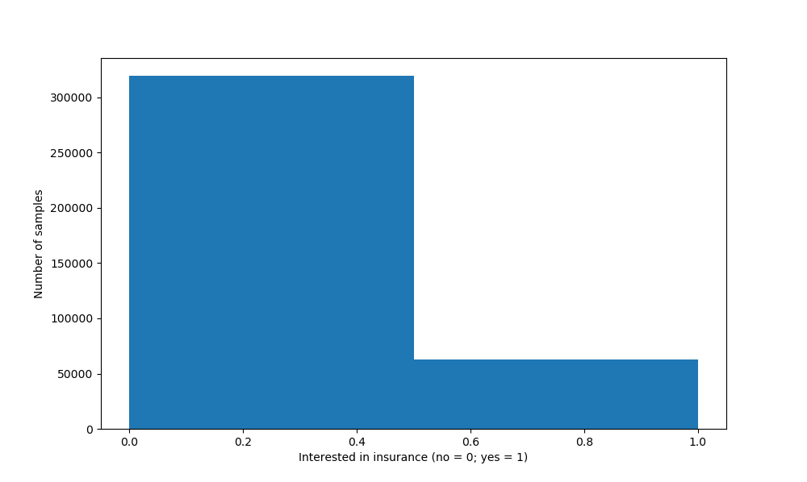
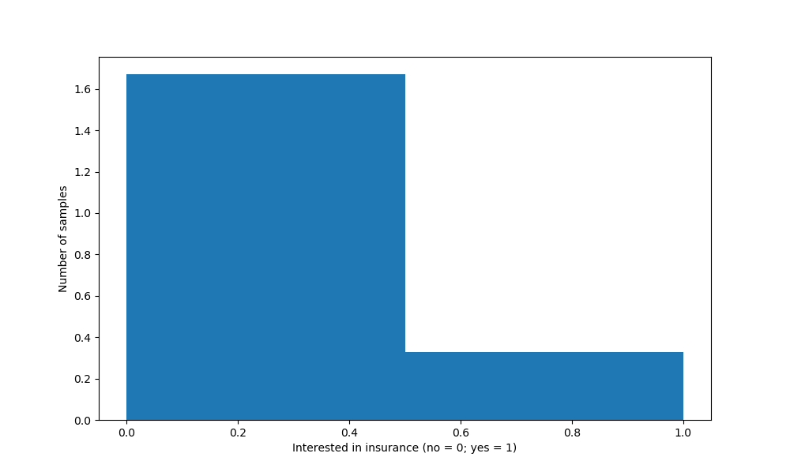
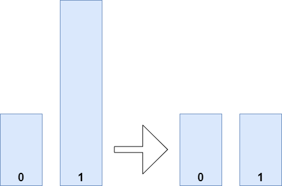
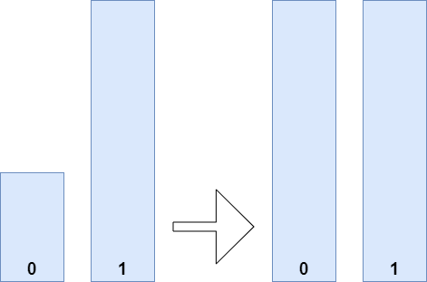

Training your machine learning model or neural network involves exploratory research activities in order to estimate what your data looks like. This is really important if you want to create a model that performs well, that performs well in many cases _and_ performs well because of why you think it performs well.

To give a simple example: if you classify between reindeer and wild boar, it is very likely that snow is present in the reindeer pictures, while it's not in the boar ones. In those cases, the model might learn to distinguish based on the presence of snow, which is not what you want.

In another case, the one of an **imbalanced dataset**, you can also run into trouble. This case is what we will cover in this article. We're going to look at a couple of things. First of all, we'll cover the concept of an imbalanced dataset. What does it mean, to have no balance in your dataset? And what is wrong with it, and why? This gives us enough context to move onto the practical part.

In that practical part, we'll be taking class imbalances into account with TensorFlow and Keras. We take a look at **undersampling**, **oversampling** and an approach which works by means of **class weights**. In addition, we also look at the concept of **F1 Score**. Through examples, we will demonstrate that it is in fact possible to use an imbalanced dataset while training your machine learning model. Let's take a look!

**Update 11/Nov/2020:** repaired a number of textual mistakes. Sorry about that!

* * *

\[toc\]

* * *

## What is an imbalanced dataset?

In today's article, we will be looking at imbalanced datasets. But what are those datasets? What makes a dataset have _class imbalance_? Let's try and answer those questions through the lens of an example dataset.

### Introducing the Insurance Cross-sell Prediction Dataset

For example, let's take a look at the **Insurance Cross-sell Prediction Dataset**. This dataset, [which is available at Kaggle](https://www.kaggle.com/arashnic/imbalanced-data-practice), contains various parameters which indicate whether people who have purchased _Health insurance_ would also be interested in _Vehicle insurance_.

> The data provided by an Insurance company which is not excluded from other companies to getting advantage of ML. This company provides Health Insurance to its customers. We can build a model to predict whether the policyholders (customers) from past year will also be interested in Vehicle Insurance provided by the company.
> 
> Kaggle (n.d.)

If we are able to generate a predictive model which helps us understand if a customer might be interested in purchasing insurance, we might be able to sell much more effectively. That would be a very valuable use of Machine Learning in business.

> Cross-selling is the action or practice of selling an additional product or service to an existing customer.
> 
> Wikipedia (2005)

### Inspecting the dataset

Make sure to download the dataset from Kaggle to a folder if you want to use the code. Copy the `train.csv` file into a particular folder, and rename it into `data.csv`. The `test.csv` file apparently has no corresponding Response (i.e. `y`) targets.

We use the following code snippet for visualizing the outcomes by means of a histogram.

```
import pandas as pd
import matplotlib.pyplot as plt
import numpy as np

df = pd.read_csv('./data.csv')
plt.rcParams["figure.figsize"] = (10,6)
plt.hist(df['Response'], bins=2, density=True)
plt.ylabel('Number of samples')
plt.xlabel('Interested in insurance (no = 0; yes = 1)')
plt.show()
```

It looks as follows.

- [](https://www.machinecurve.com/wp-content/uploads/2020/11/insurance.png)
    
- [](https://www.machinecurve.com/wp-content/uploads/2020/11/insurancedensity.png)
    

### Finding class imbalance

In total, more than 300.000 samples reflect people who have no interest in insurance. Close to 70.000 people _do_ have interest in insurance. This means that for approximately every 0.35 people who want insurance, close to 1.7 want no insurance (approximately 5 want no insurance when 1 wants insurance).

This suggests that we have found what is known as an **imbalanced dataset**.

> Imbalance means that the number of data points available for different the classes is different:
> 
> If there are two classes, then balanced data would mean 50% points for each of the class.
> 
> Kaggle (n.d.)

Let's now take a look at why you must be careful when creating a Machine Learning model when your dataset is imbalanced.

* * *

## What's wrong with imbalanced datasets?

When training a neural network, you are performing [supervised learning](https://www.machinecurve.com/index.php/2019/10/04/about-loss-and-loss-functions/#the-high-level-supervised-learning-process). This effectively involves feeding samples from a training dataset forward, generating predictions, which can be compared to the dataset's corresponding labels: the ground truth. This results in a **loss value** that can subsequently be used for [optimizing the model](https://www.machinecurve.com/index.php/2019/10/24/gradient-descent-and-its-variants/).

There are [various loss functions](https://www.machinecurve.com/index.php/2019/10/04/about-loss-and-loss-functions/) that are used in neural networks. However, in addition to a loss value, we often use the **accuracy**. It is used because it is very intuitive to human beings, and can be defined as follows:

\[latex\]Accuracy = \\frac{TP + TN}{TP + TN + FP + FN}\[/latex\]

Here:

- **TP:** True Positives, a.k.a. predictions for class 1 that are actually class 1.
- **TN**: True Negatives, a.k.a. predictions for class 0 that are actually class 0.
- **FP:** False Positives, a.k.a. predictions for class 1 that are actually class 0.
- **FN:** False Negatives, a.k.a. predictions for class 0 that are actually class 1.

The goal is to increase the numbers for TP and TN and, by consequence, reducing the numbers for FP and FN.

Now, let's take a look again at our insurance dataset


If we would train our model with this dataset, the model might actually learn the following behavior: **simply giving 0 as class output because it is correct more often.** In other words, if I would randomly pick one of the two classes, it would be more likely that my answer is correct if I pick 0 compared to picking 1. The model might pick this up and steer towards those _average_ based predictions.

In this case, you end up with a model that _does_ perform, but not _why_ you want it to perform (i.e., not because the _patterns_ in the dataset indicate certain classes to be more likely, but rather, the relative likelihood that it is a class now determines the prediction outcome).

For this reason, you don't want to create Machine Learning models that have a significant class imbalance.

Let's now take a look at some methods for removing the imbalance within your dataset.

* * *

## Taking class imbalances into account with TensorFlow and Keras

In TensorFlow and Keras, you can work with imbalanced datasets in multiple ways:

1. **Random Undersampling:** drawing a subset from the original dataset, ensuring that you have equal numbers per class, effectively discarding many of the big-quantity class samples.
2. **Random Oversampling:** drawing a subset from the original dataset, ensuring that you have equal numbers per class, effectively copying many of the low-quantity class samples.
3. **Applying class weights:** by making classes with higher data quantities less important in the model optimization process, it is possible to achieve optimization-level class balance.
4. **Working with the F1 score instead of Precision and Recall:** by using a metric that attempts to find a balance between relevance of all results and number of relevant results found, you could reduce the impact of class balance on your model without removing it.

### Random Undersampling

If we apply **undersampling** to our model, we effectively _reconstruct_ the dataset - but then ensure that it is balanced. In other words, we ensure that all classes contain an equal amount of samples. By consequence, as can be seen in the figure below, a lot of samples are discarded to regain class balance; balance is found at `min(num_samples_per_class`). Samples are chosen randomly.

We can perform undersampling as follows.

```
import pandas as pd

# Read CSV
df = pd.read_csv('./data.csv')

# Count samples per class
classes_zero = df[df['Response'] == 0]
classes_one = df[df['Response'] == 1]

# Print sizes
print(f'Class 0: {len(classes_zero)}')
print(f'Class 1: {len(classes_one)}')

# Undersample zero to the size of one
classes_zero = classes_zero.sample(len(classes_one))

# Print sizes
print(f'Class 0: {len(classes_zero)}')
print(f'Class 1: {len(classes_one)}')
```

Before undersampling, our datasets look as follows:

```
Class 0: 319553
Class 1: 62601
```

Afterwards:

```
Class 0: 62601
Class 1: 62601
```

- **Benefits of undersampling:** regaining class balance.
- **Drawbacks of undersampling:** if your dataset as a whole is small, reducing its size further can make you lose some predictive power. In those cases, you must critically inspect whether undersampling is the right fit for your setting.



### Random Oversampling

If we apply **oversampling** instead, we also reconstruct the dataset into a balanced one, but do it in such a way that all our classes find balance at `max(num_samples_per_class)`. While undersampling means discarding samples, here, we copy multiple samples instead to fill the classes that are imbalanced. Here, sampling also happens randomly.

```
import pandas as pd

# Read CSV
df = pd.read_csv('./data.csv')

# Count samples per class
classes_zero = df[df['Response'] == 0]
classes_one = df[df['Response'] == 1]

# Print sizes
print(f'Class 0: {len(classes_zero)}')
print(f'Class 1: {len(classes_one)}')

# Oversample one to the size of zero
classes_one = classes_one.sample(len(classes_zero), replace=True)

# Print sizes
print(f'Class 0: {len(classes_zero)}')
print(f'Class 1: {len(classes_one)}')
```

Before:

```
Class 0: 319553
Class 1: 62601
```

After:

```
Class 0: 319553
Class 1: 319553
```

- **Benefits of oversampling:** regaining class balance.
- **Drawbacks of oversampling:** if you have classes with _very few_ instances, both relative to the other classes and absolutely in terms of total number of samples - you might put too much emphasis on the fact that those samples belong to a specific class. Here, you must ensure that there aren't other instances that _also_ belong to the class but are not yet reflected in the dataset, or you risk missing them when running your model in production.



### Applying class weights: a Keras model

Instead of changing your dataset, another approach to handling imbalanced datasets involves instructing TensorFlow and Keras to take that class imbalance into account. For this, the `model.fit` function contains a `class_weights` attribute.

> Optional dictionary mapping class indices (integers) to a weight (float) value, used for weighting the loss function (during training only). This can be useful to tell the model to "pay more attention" to samples from an under-represented class.
> 
> TensorFlow (n.d.)

Effectively, you're thus telling the training process to keep in mind that some samples come from an underrepresented class.

Do note that applying class weights does not work adequately with [classic gradient descent](https://www.machinecurve.com/index.php/2019/10/24/gradient-descent-and-its-variants/) and others. However, if you use [Adam](https://www.machinecurve.com/index.php/2019/11/03/extensions-to-gradient-descent-from-momentum-to-adabound/), you will be fine (TensorFlow, n.d.).

We can first compute the weights with Scikit-learn's `compute_class_weight` function.

```
import pandas as pd
import sklearn
import numpy as np

# Read CSV
df = pd.read_csv('./data.csv')

# Count samples per class
classes_zero = df[df['Response'] == 0]
classes_one = df[df['Response'] == 1]

# Convert parts into NumPy arrays for weight computation
zero_numpy = classes_zero['Response'].to_numpy()
one_numpy = classes_one['Response'].to_numpy()
all_together = np.concatenate((zero_numpy, one_numpy))
unique_classes = np.unique(all_together)

# Compute weights
weights = sklearn.utils.class_weight.compute_class_weight('balanced', unique_classes, all_together)
print(weights)
```

And then apply them in `model.fit`:

```
# Fit data to model
model.fit(X, y,
          epochs=no_epochs,
          verbose=verbosity,
          class_weight=weights,
          callbacks=keras_callbacks,
          validation_split=0.2)
```

- **Benefits of applying class weights:** weighted/balanced training process.
- **Drawbacks of applying class weights:** extra computations necessary during the already resource-intensive training process.

### Working with the F1 score instead of Precision/Recall

Many people use **precision** and **recall** for computing model performance.

> The precision is the proportion of relevant results in the list of all returned results. The recall is the ratio of the relevant results returned by the search engine to the total number of the relevant results that could have been returned.
> 
> Hacker Noon (2005)

https://www.youtube.com/watch?v=o9A4e7zopu8

However, if your precision is high but your recall is low, then you will find mostly relevant results, but the number of relevant results is relatively low.

If your recall is high, you will find many relevant results, but there may be also many ones that are not relevant.

Often, precision and recall are at odds - and you must trade-off between _high relevance_ and _a bit of noise_. This is effectively impactful if you have an imbalanced dataset that you'll have to work with.

The F1 score takes both precision and recall and produces another value:

\[latex\]F1 = 2 \\times \\frac{precision \\times recall}{precision + recall}\[/latex\]

If you optimize your model with F1 instead of Precision or Recall, you will find that it will attempt to maximize F1 - and hence maximize precision without losing too much on recall, and vice versa. This way, you _can_ keep using imbalanced data, by omitting the faulty evaluation metrics in the first place.

- **Benefits of applying F1 score:** balance between precision and recall, omitting accuracy.
- **Drawbacks of applying F1 score:** a theoretically slightly less-performant model compared to a true balanced dataset one.

* * *

## Summary

In this article, we looked at imbalanced datasets - i.e. datasets where the number of samples within each class is strongly non-equal. While slightly imbalanced datasets should not significantly ML performance, big class imbalance _can_ cause model performance issues. That's why it's a good idea to take into account class imbalances when creating your Machine Learning model.

The rest of this article therefore focused on a couple of things related to this issue. First, we saw how we can detect a class imbalance in an insurance dataset. Subsequently, we looked at four ways of reducing the issue: by performing undersampling, oversampling, applying class weights in Keras/TensorFlow and changing the evaluation criterion. This way, we can resolve class imbalances, and produce a model that works.

I hope that you have learned something from reading this article! If you have any questions or comments, please feel free to leave a comment below 💬 Please also leave a messge if you have suggestions for improvement. I'll happily respond and change the article where necessary :) Thank you for reading MachineCurve today and happy engineering! 😎

* * *

## References

_TensorFlow, the TensorFlow logo and any related marks are trademarks of Google Inc._

KDnuggets. (n.d.). _The 5 most useful techniques to handle Imbalanced datasets_. [https://www.kdnuggets.com/2020/01/5-most-useful-techniques-handle-imbalanced-datasets.html](https://www.kdnuggets.com/2020/01/5-most-useful-techniques-handle-imbalanced-datasets.html)

Analytics Vidhya. (2020, July 24). _10 techniques to deal with Imbalanced classes in machine learning_. [https://www.analyticsvidhya.com/blog/2020/07/10-techniques-to-deal-with-class-imbalance-in-machine-learning/](https://www.analyticsvidhya.com/blog/2020/07/10-techniques-to-deal-with-class-imbalance-in-machine-learning/)

Kaggle. (n.d.). _Learning from Imbalanced insurance data_. Kaggle: Your Machine Learning and Data Science Community. [https://www.kaggle.com/arashnic/imbalanced-data-practice](https://www.kaggle.com/arashnic/imbalanced-data-practice)

Wikipedia. (2005, October 11). _Cross-selling_. Wikipedia, the free encyclopedia. Retrieved November 10, 2020, from [https://en.wikipedia.org/wiki/Cross-selling](https://en.wikipedia.org/wiki/Cross-selling)

Kaggle. (n.d.). _What is an imbalanced dataset? Machine learning | Data science and machine learning_. Kaggle: Your Machine Learning and Data Science Community. [https://www.kaggle.com/getting-started/100018](https://www.kaggle.com/getting-started/100018)

TensorFlow. (n.d.). _Tf.keras.Model_. [https://www.tensorflow.org/versions/r2.0/api\_docs/python/tf/keras/Model](https://www.tensorflow.org/versions/r2.0/api_docs/python/tf/keras/Model)

Hacker Noon. (2005, November 10). _Idiot’s guide to precision, recall and confusion matrix_. [https://hackernoon.com/idiots-guide-to-precision-recall-and-confusion-matrix-b32d36463556](https://hackernoon.com/idiots-guide-to-precision-recall-and-confusion-matrix-b32d36463556)
