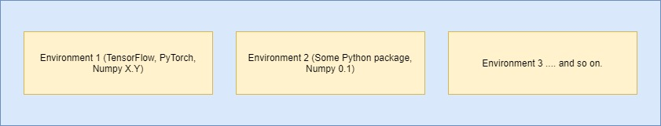
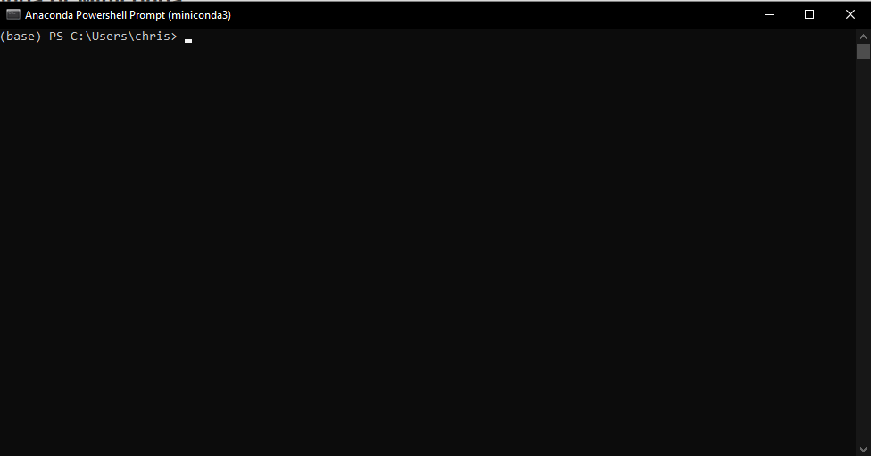
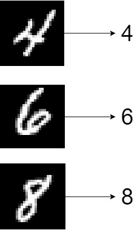

A few years ago, some people argued that being a data scientist meant that you had the sexiest job of the 21st Century. Who's to disagree: being one, you're responsible for [diving into](https://www.machinecurve.com/index.php/2017/09/30/the-differences-between-artificial-intelligence-machine-learning-more/) (sometimes big) datasets, finding relevant results for business, and reporting about them so that new opportunities can be created. This requires that you develop intuition for both business and technology as well as the capability of working in both worlds. It's in fact a very challenging but rewarding path, as salaries for data scientists are quite substantial.

Now, Machine Learning - which I often describe as automatically finding patterns in datasets that can be used for predictive purposes, by means of some type of model architecture - is one of the sub branches of data science related jobs. Becoming a machine learning engineer puts you at the technology side of the data science spectrum. Requiring some intuition about mathematics (but not necessarily a maths degree!), as well as some interest and expertise with programming languages such as Python, you could be responsible for creating a variety of predictive models that serve the future needs of the organization you're working for.

Unfortunately, the learning curve for starting with Machine Learning can be relatively steep, in my experience. A few years ago, when I had no significant ML experience whatsoever - I came from a software engineering background - the primary question I had was: "Where do I start?". That's why I've written this article, which helps you start learning how to apply machine learning for generating predictive models. In the article, we'll zoom in to TensorFlow and Keras - two tightly coupled libraries that can be used for predictive modelling - and show you step-by-step how they can be installed. We also demonstrate how a neural network can be created and trained. This way, you've set your first steps in the interesting world that Machine Learning is!

Let's take a look! 😎

* * *

\[toc\]

* * *

## TensorFlow and Keras for Machine Learning

The first step of getting started with Machine Learning is getting to know two of the libraries that we will be using for today's article: **TensorFlow** first and **Keras** second. What are those libraries, and what can they be used for?

First of all, TensorFlow is "an end-to-end open source machine learning platform". According to its website, it's a flexible ecosystems of tools that can help you convert your research-oriented Machine Learning ideas into practice, by being a bridge between research ML and production deployments.

With TensorFlow, you can…

- Easily train and deploy models wherever you want, whether that's in the cloud, in your web browser, or on a device;
- Easily perform Machine Learning research because of the ecosystem's flexibility;
- Easily perform model building due to the intuitive, high-level APIs like Keras that run with eager execution.

https://www.youtube.com/watch?v=oZikw5k\_2FM

Ah - there's the second one for today: Keras.

It's a high-level API that runs on top of TensorFlow. However, the latter was not always the case. While it has always been a high-level API with the goal of making the creation of deep learning models easier (the core argument for Keras is that originally native TensorFlow had a steep learning curve, negatively impacting the adoption of Machine Learning) . Originally, it worked on top of TensorFlow, but also on top of Theano and CNTK, other libraries for creating Machine Learning Models.

Today, however, that's no longer the case - Keras is now tightly coupled with TensorFlow in some kind of a symbiotic fashion: the `tensorflow.keras` API. TensorFlow's adoption within the community will be more difficult if Keras is not around and vice-versa; Keras needs something to run on top of. However, together, they become a very powerful tool for Machine Learning engineers to be comfortable working with.

And that's why we'll focus on them in this article explaining how to create your first Machine Learning project. In fact, we will be creating a Neural network with those tools. But first, let's take a look at how you can install TensorFlow and Keras on your machine.

* * *

## Installing TensorFlow with Conda

When you're a data scientist, using TensorFlow for creating machine learning models is likely not the only thing you will do - or if not it could be that you need other libraries such as PyTorch or [Scikit-learn](https://www.machinecurve.com/index.php/how-to-use-scikit-learn-for-machine-learning-with-python-mastering-scikit/) to do the job. To just give a few examples:

- It could very much be the case that you will be asked to filter data from CSV files by means of [Pandas](https://pandas.pydata.org/).
- You might need Scikit-learn or PyTorch to run another person's Machine Learning model.
- Or, when it comes to big data, it could be that you need to run data processing jobs on [Apache Spark](https://www.machinecurve.com/index.php/2020/10/22/distributed-training-tensorflow-and-keras-models-with-apache-spark/).

You will need a variety of Python libraries (also called 'packages') to make this happen - think `pyspark`, `pandas`, `sklearn`, `pytorch`, `tensorflow`, to name just a few.

And each package has a variety of dependencies, i.e. other packages that it will run on - for example, many of the packages above require e.g. `numpy` and `scipy` as dependencies.

### The need for environments

However:

- It is not necessarily the case that each package works with the latest version of dependencies. For example, older packages (only the very popular packages are updated very frequently) might require you to use older versions of `numpy`.

By consequence, while many packages can share dependencies, they do not necessarily have to share the same dependency versions.

And in general, if you think about the packages you install as tools in a toolbox, you likely agree with me that you want to structure your tools nicely. You don't want your toolbox to become a mess.

Here, the concept of an **environment** can help. By means of an environment, you can organize your toolbox into 'areas' where your tools (i.e., your packages) are stored. Tools cannot be used across environments, but support each other within the environment. Visually, this looks as follows:



As you can see, environments allow you to install multiple versions of the same tool - i.e. package - across environments. In one environment, you can use one version of a package, while in another environment, another version of the same package can be used.

This way, you can organize the tools that you need for particular tasks - and have no interference between stuff you need to do your job.

### Introducing Conda and Miniconda

Great concepts, environment, but up to now it's entirely theoretical. Let's move into practice by introducing Conda, an open source package management system. As an additional benefit, it can also be used for managing environments like the ones we described above.

It runs on Windows, macOS and Linux, and allows you to (1) easily create and switch between environments, and (2) install packages quickly.


Installing Conda is very easy as you can install a tool called [Miniconda](https://docs.conda.io/en/latest/miniconda.html#), which makes your job really easy:

> Miniconda is a free minimal installer for conda. It is a small, bootstrap version of Anaconda that includes only conda, Python, the packages they depend on, and a small number of other useful packages, including pip, zlib and a few others. Use the `conda install command` to install 720+ additional conda packages from the Anaconda repository.
> 
> Miniconda (n.d.)

By many, Miniconda is considered to be the Swiss knife among environment managers. While Python native [virtual environments](https://docs.python.org/3/tutorial/venv.html) can do the same thing for you, Minoconda offers all the tools you need in a simple installer.

The next part of this article assumes that you have Miniconda installed on your system. [Click here](https://docs.conda.io/en/latest/miniconda.html#) to find the installer that works for you.

### Installing TensorFlow and Keras

After installing Miniconda, you should be able to run it from your Start Menu by typing 'miniconda' - then hitting Enter once it appears in the search list.

A terminal should now open displaying `(base)`. This is good - it's the base environment:



Let's make a new environment:

```
conda create --name first-tensorflow  
```

Here, we'll be making a new environment called `first-tensorflow`. After hitting Enter, you must likely confirm the creation of the environment:

```
## Package Plan ##

  environment location: C:\Users\chris\miniconda3\envs\first-tensorflow


Proceed ([y]/n)? y        
```

After which it is created:

```
Preparing transaction: done
Verifying transaction: done
Executing transaction: done
#
# To activate this environment, use
#
#     $ conda activate first-tensorflow
#
# To deactivate an active environment, use
#
#     $ conda deactivate
```

It's now time to **activate** the environment, as the instructions already suggest. This means that you effectively _move over_ to this environment in your toolbox, so that you can install specific packages for use in the environment -- as well as use the ones already installed.

By writing `conda activate first-tensorflow`, the newly created environment is created, and you can see `(base)` change into `(first-tensorflow)`:

```
(base) PS C:\Users\chris> conda activate first-tensorflow 
(first-tensorflow) PS C:\Users\chris>     
```

The next step - installing TensorFlow, which includes Keras - is remarkably simple:

```
(first-tensorflow) PS C:\Users\chris> conda install tensorflow==2.1.0
```

Do note that while TensorFlow currently has version 2.3.0 as the latest stable release, [newest versions may not be available in Conda immediately](https://www.anaconda.com/blog/tensorflow-in-anaconda). If you do truly want to use newer versions of TensorFlow, [use this answer](https://stackoverflow.com/a/43729857) to first install `pip` _locally, i.e. within your environment_ and then use its local installment to install e.g. `pip install tensorflow==2.3.0`.

* * *

## Your First Neural Network

Exciting stuff, we're going to build our first neural network using TensorFlow and Keras, which we installed in the previous section. Doing so always boils down to a few, sequential steps:

1. Taking a look at the dataset that you will be creating your predictive model for, to get an intuition about the patterns that could be hidden within it.
2. Creating a model file and adding the imports of the TensorFlow/Keras components you'll need today.
3. Creating the model itself by adding code to the model file.
4. Starting the training process.
5. Observing and interpreting the results.

### Today's Dataset

Let's now take a look at the dataset that we will be using today. For your first Machine Learning project, you will build what is known as a [classifier](https://www.machinecurve.com/index.php/2020/10/19/3-variants-of-classification-problems-in-machine-learning/) - a system that allows you to assign an input to one of multiple (sometimes two, sometimes more) buckets. We will train the classifier on the [MNIST dataset](https://www.machinecurve.com/index.php/2019/12/31/exploring-the-keras-datasets/), which contains thousands of handwritten digits from 0 to 9:


In the ideal case, our classifier will do this really well:



Let's find out if we can create such a classifier. Open up your code editor (e.g. Visual Studio Code) and create a file called `first-ml-model.py`. Open the file, so that we can start coding! 😎

### Adding the imports

Time to add to the file the TensorFlow components that we need:

```
import tensorflow
from tensorflow.keras.models import Sequential
from tensorflow.keras.layers import Dense, Conv2D, Flatten
```

We'll need `tensorflow` in general, and some specific components. We'll be using the `Sequential` API for stacking the layers of our neural network on top of each other (as we shall see), and we require `Dense`, `Conv2D` and `Flatten`, which are general components of Convolutional Neural Networks - neurla networks often used for image processing.

### Creating the model

Next, we must specify a few configuration options:

```
# Configuration
img_width, img_height = 28, 28
input_shape = (img_width, img_height, 1)
batch_size = 1000
no_epochs = 25
no_classes = 10
validation_split = 0.2
verbosity = 1
```

The image width and height are set to 28 pixels, because that's the size of each input image. As we use grayscale images, which are one-channel (contrary to the three channels when images are RGB), our input shape has a `1` as third dimension. We feed data forward into the network with mini batches of 1000 samples. We will train for 25 iterations, and instruct the model that it must take into account 10 classes - the digits 0 to 9. 20% of our data will be used for steering the training process away from a process called overfitting (which involves training too blindly on the training data, leading to generalization issues on unseen data when used in production). We specify the model training process to be verbose, i.e. to specify all the possible output in the terminal (which comes at the cost of speed).

#### Loading the dataset

We can next load the dataset:

```
# Load data
def load_data():
  return tensorflow.keras.datasets.mnist.load_data(path="mnist.npz")
```

Per the Keras datasets `load_data` function, we can easily load the MNIST data - one of the benefits of Keras, which comes with [preinstalled datasets](https://www.machinecurve.com/index.php/2019/12/31/exploring-the-keras-datasets/).

#### Creating the model

Then, it's actually time to add the neural network. Using `model.add`, we stack a few layers on top of each other - starting with convolutional layers for extracting features (i.e. selecting what patterns within the dataset must be used for generating predictions) and Dense layers for actually converting the presence of features into a prediction (i.e. the true predictive part). Jointly, they can be expected to produce quite a performance indeed!

```
# Model creation
def create_model():
  model = Sequential()
  model.add(Conv2D(4, kernel_size=(3, 3), activation='relu', input_shape=input_shape))
  model.add(Conv2D(8, kernel_size=(3, 3), activation='relu'))
  model.add(Conv2D(12, kernel_size=(3, 3), activation='relu'))
  model.add(Flatten())
  model.add(Dense(256, activation='relu'))
  model.add(Dense(no_classes, activation='softmax'))
  return model
```

#### Compiling the model

Above, we just created a _skeleton_ of the model. That is, we didn't create a working model yet, but simply described what it should look like. Compiling a model involves specifying an optimization mechanism ([Adam](https://www.machinecurve.com/index.php/2019/11/03/extensions-to-gradient-descent-from-momentum-to-adabound/) in our case) and [loss function](https://www.machinecurve.com/index.php/2019/10/04/about-loss-and-loss-functions/):

```
# Model compilation
def compile_model(model):
  model.compile(loss=tensorflow.keras.losses.sparse_categorical_crossentropy,
              optimizer=tensorflow.keras.optimizers.Adam(),
              metrics=['accuracy'])
  return model
```

### Training and testing components

Finally, before we actually start the training process, we must add functionality both for _training_ (which makes sense) and _testing_ (which I should explain in a bit more detail). When a model is trained, it must be tested against data that it hasn't seen before. This ensures that the model _can be generalized_, meaning that it is also effective on data that it has not seen before. If it's not, there's no point in generating the predictive model, is there? Hence, your goal as a machine learning engineer is to create a model that can both predict _and_ generalize.

```
# Model training
def train_model(model, X_train, y_train):
  model.fit(X_train, y_train,
            batch_size=batch_size,
            epochs=no_epochs,
            verbose=verbosity,
            shuffle=True,
            validation_split=validation_split)
  return model

# Model testing
def test_model(model, X_test, y_test):
  score = model.evaluate(X_test, y_test, verbose=0)
  print(f'Test loss: {score[0]} / Test accuracy: {score[1]}')
  return model
```

### Stacking stuff and starting the training process

We can now add code which truly loads our data based on the definition we created before:

```
# Load data
(X_train, y_train), (X_test, y_test) = load_data()
```

We must normalize it to the \[latex\]\[0, 1\]\[/latex\] range:

```
# Normalize data
(X_train, X_test) = (X_train / 255.0, X_test / 255.0)
```

Also reshape it, because TensorFlow expects our input to have a specific structure:

```
# Reshape data
(X_train, X_test) = (
  X_train.reshape(X_train.shape[0], X_train.shape[1], X_train.shape[2], 1),
  X_test.reshape(X_test.shape[0], X_test.shape[1], X_test.shape[2], 1),
)
```

And finally, we can create, compile, train and test our model:

```
# Create and train the model
model = create_model()
model = compile_model(model)
model = train_model(model, X_train, y_train)
model = test_model(model, X_test, y_test)
```

### Results

Now open up the Miniconda terminal, ensure that you activated your `first-tensorflow` environment, and run the model - `python first-ml-model.py`.

The model should now start training and you should see stuff like this:

```
Epoch 2/25
48000/48000 [==============================] - 2s 39us/sample - loss: 0.1141 - accuracy: 0.9679 - val_loss: 0.0874 - val_accuracy: 0.9756
```

And finally this accuracy:

```
Test loss: 0.0544307005890682 / Test accuracy: 0.9878000020980835
```

...which is close to 100% - really good! 😎

### Full model code

Should you wish to obtain the full model code just at once - here you go:

```
import tensorflow
from tensorflow.keras.models import Sequential
from tensorflow.keras.layers import Dense, Conv2D, Flatten

# Configuration
img_width, img_height = 28, 28
input_shape = (img_width, img_height, 1)
batch_size = 1000
no_epochs = 25
no_classes = 10
validation_split = 0.2
verbosity = 1

# Load data
def load_data():
  return tensorflow.keras.datasets.mnist.load_data(path="mnist.npz")
                  
# Model creation
def create_model():
  model = Sequential()
  model.add(Conv2D(4, kernel_size=(3, 3), activation='relu', input_shape=input_shape))
  model.add(Conv2D(8, kernel_size=(3, 3), activation='relu'))
  model.add(Conv2D(12, kernel_size=(3, 3), activation='relu'))
  model.add(Flatten())
  model.add(Dense(256, activation='relu'))
  model.add(Dense(no_classes, activation='softmax'))
  return model

# Model compilation
def compile_model(model):
  model.compile(loss=tensorflow.keras.losses.sparse_categorical_crossentropy,
              optimizer=tensorflow.keras.optimizers.Adam(),
              metrics=['accuracy'])
  return model

# Model training
def train_model(model, X_train, y_train):
  model.fit(X_train, y_train,
            batch_size=batch_size,
            epochs=no_epochs,
            verbose=verbosity,
            shuffle=True,
            validation_split=validation_split)
  return model

# Model testing
def test_model(model, X_test, y_test):
  score = model.evaluate(X_test, y_test, verbose=0)
  print(f'Test loss: {score[0]} / Test accuracy: {score[1]}')
  return model

# Load data
(X_train, y_train), (X_test, y_test) = load_data()

# Normalize data
(X_train, X_test) = (X_train / 255.0, X_test / 255.0)

# Reshape data
(X_train, X_test) = (
  X_train.reshape(X_train.shape[0], X_train.shape[1], X_train.shape[2], 1),
  X_test.reshape(X_test.shape[0], X_test.shape[1], X_test.shape[2], 1),
)

# Create and train the model
model = create_model()
model = compile_model(model)
model = train_model(model, X_train, y_train)
model = test_model(model, X_test, y_test)
```

* * *

## Next steps

Great! You just completed creating your first Machine Learning model with TensorFlow and Keras! 🎉 Perhaps, you've gained some momentum now, and you're interested in adding extra bits of knowledge to your Machine Learning toolbox. In those cases, I would like to recommend you to the following further readings:

1. Extending the monitoring (for which you used a simple `model.evaluate` call and validation data) to a more extensive form of monitoring, with [TensorBoard](https://www.machinecurve.com/index.php/2019/11/13/how-to-use-tensorboard-with-keras/).
2. Understanding [Convolutional Neural Networks](https://www.machinecurve.com/index.php/2018/12/07/convolutional-neural-networks-and-their-components-for-computer-vision/) and what they do in more detail.
3. Reading more about how models are optimized:
    1. [The high-level supervised machine learning process](https://www.machinecurve.com/index.php/2019/10/04/about-loss-and-loss-functions/#the-high-level-supervised-learning-process)
    2. [Loss and loss functions](https://www.machinecurve.com/index.php/2019/10/04/about-loss-and-loss-functions/)
    3. [Gradient descent based optimization](https://www.machinecurve.com/index.php/2019/10/24/gradient-descent-and-its-variants/)
    4. [Adaptive optimizers](https://www.machinecurve.com/index.php/2019/11/03/extensions-to-gradient-descent-from-momentum-to-adabound/)

* * *

## Summary

Getting started with Machine Learning can be a challenging task because of the steep learning curve. Fortunately, there are high-level libraries like Keras that can make your life easier. In fact, they make everyone's life easier, because all machine learning engineers can create and train production-level models with Keras and its counterpart TensorFlow - in a very easy way.

In this article, we looked at creating your first Machine Learning model with Keras and TensorFlow. We first looked at what Keras and TensorFlow are - two symbiotic libraries that either allow people to produce production-level ML models (TensorFlow) and do so in an easy way (Keras). We then moved forward to installing TensorFlow (which includes Keras) on your system, and saw what environments are. We also saw how Miniconda can be used for managing environments and installing Python packages. Finally, we created your first neural network with TensorFlow and Keras, using the MNIST dataset.

I hope that this article provided a starting point for your Machine Learning career! If it did, or if you've learnt something from it in general, please feel free to leave a message in the comments section 💬 Please do the same if you have questions or general remarks. I'd be more than happy to answer your messages :)

Thank you for reading MachineCurve today and happy engineering! 😎

* * *

## References

_TensorFlow, the TensorFlow logo and any related marks are trademarks of Google Inc._

TensorFlow. (n.d.). [https://www.tensorflow.org/](https://www.tensorflow.org/)

_Miniconda — Conda documentation_. (n.d.). Conda — Conda documentation. [https://docs.conda.io/en/latest/miniconda.html#](https://docs.conda.io/en/latest/miniconda.html#)
